<properties
  pageTitle="Προετοιμασία του περιβάλλοντός σας για να δημιουργήσετε αντίγραφα ασφαλείας φόρτους εργασίας με χρήση διακομιστή αντίγραφο ασφαλείας Azure | Microsoft Azure"
  description="Προετοιμάσετε το περιβάλλον σας για να χρησιμοποιήσετε Azure δημιουργίας αντιγράφων ασφαλείας διακομιστή για να προστατεύσετε ή δημιουργία αντιγράφων ασφαλείας φόρτους εργασίας."
  services="backup"
  documentationCenter=""
  authors="PVRK"
  manager="shivamg"
  editor=""
  keywords="Azure δημιουργίας αντιγράφων ασφαλείας διακομιστή. προστασία φόρτους εργασίας; Δημιουργία αντιγράφου ασφαλείας φόρτους εργασίας"/>

<tags
  ms.service="backup"
  ms.workload="storage-backup-recovery"
  ms.tgt_pltfrm="na"
  ms.devlang="na"
  ms.topic="article"
  ms.date="09/27/2016"
  ms.author="jimpark;trinadhk;pullabhk;markgal"/>

# <a name="preparing-to-back-up-workloads-using-azure-backup-server"></a>Προετοιμασία του για να δημιουργήσετε αντίγραφα ασφαλείας φόρτους εργασίας με χρήση διακομιστή αντίγραφο ασφαλείας Azure

> [AZURE.SELECTOR]
- [Διακομιστής Azure αντιγράφων ασφαλείας](backup-azure-microsoft-azure-backup.md)
- [SCDPM](backup-azure-dpm-introduction.md)
- [Διακομιστής Azure αντιγράφων ασφαλείας (κλασικό)](backup-azure-microsoft-azure-backup-classic.md)
- [SCDPM (κλασικό)](backup-azure-dpm-introduction-classic.md)

Σε αυτό το άρθρο εξηγεί πώς να προετοιμάσετε το περιβάλλον σας για να δημιουργήσετε αντίγραφα ασφαλείας φόρτους εργασίας με χρήση διακομιστή Azure δημιουργίας αντιγράφων ασφαλείας. Με το διακομιστή Azure αντίγραφο ασφαλείας, μπορείτε να προστατεύσετε φόρτους εργασίας εφαρμογή όπως το Hyper-V ΣΠΣ, Microsoft SQL Server, του SharePoint Server, Microsoft Exchange και προγράμματα-πελάτες των Windows από μια μεμονωμένη κονσόλα. Μπορείτε επίσης να προστατεύσετε τις πληροφορίες ως ένα φόρτους εργασίας του διακομιστή (IaaS) όπως ΣΠΣ στο Azure.

> [AZURE.NOTE] Azure περιλαμβάνει δύο μοντέλων ανάπτυξης για τη δημιουργία και εργασία με πόρους: [Διαχείριση πόρων και κλασική](../resource-manager-deployment-model.md). Σε αυτό το άρθρο παρέχει τις πληροφορίες και διαδικασίες για την επαναφορά ΣΠΣ αναπτυχθεί με τη χρήση του μοντέλου από διαχειριστή πόρων.

Διακομιστής Azure αντιγράφων ασφαλείας μεταβιβάζονται πολλές από τις λειτουργίες δημιουργίας αντιγράφων ασφαλείας φόρτο εργασίας από τη Διαχείριση προστασίας δεδομένων (DPM). Σε αυτό το άρθρο παρέχει συνδέσεις DPM τεκμηρίωση για να εξηγήσετε ορισμένες από τις λειτουργίες κοινόχρηστο. Μέσω Azure δημιουργίας αντιγράφων ασφαλείας διακομιστή μοιράζεται πολλές από την ίδια λειτουργικότητα με DPM. Azure δημιουργίας αντιγράφων ασφαλείας διακομιστή δεν δημιουργήσετε αντίγραφα ασφαλείας σε ταινία, ούτε ενοποίηση με το κέντρο του συστήματος.

## <a name="1-choose-an-installation-platform"></a>1. Επιλέξτε μια πλατφόρμα εγκατάστασης

Είναι το πρώτο βήμα προς γρήγορα Azure δημιουργίας αντιγράφων ασφαλείας διακομιστή προς τα επάνω και την εκτέλεση για να ρυθμίσετε ένα διακομιστή των Windows. Ο διακομιστής μπορεί να είναι σε Azure ή εσωτερικής εγκατάστασης.

### <a name="using-a-server-in-azure"></a>Χρήση διακομιστή στο Azure

Όταν επιλέγετε ένα διακομιστή για την εκτέλεση Εφεδρικός διακομιστής Azure, συνιστάται να ξεκινήσετε με μια εικόνα της συλλογής του Windows Server 2012 R2 κέντρου δεδομένων. Αυτό το άρθρο, [Δημιουργήστε την πρώτη Windows εικονική μηχανή στην πύλη του Azure](..\virtual-machines\virtual-machines-windows-hero-tutorial.md), παρέχει ένα πρόγραμμα εκμάθησης για γρήγορα αποτελέσματα με την προτεινόμενη εικονική μηχανή στο Azure, ακόμα και αν δεν έχετε χρησιμοποιήσει ποτέ Azure πριν από. Πρέπει να τις προτεινόμενες ελάχιστες απαιτήσεις για την εικονική μηχανή διακομιστή (Εικονική): A2 τυπική με 2 πυρήνων και 3,5 GB RAM.

Προστασία φόρτους εργασίας με Azure δημιουργίας αντιγράφων ασφαλείας διακομιστή έχει πολλά nuances. Το άρθρο, [Εγκαταστήστε DPM ως μια εικονική μηχανή Azure](https://technet.microsoft.com/library/jj852163.aspx), σας βοηθά να εξηγήσετε αυτές τις nuances. Διαβάστε πλήρως σε αυτό το άρθρο πριν από την ανάπτυξη του υπολογιστή.

### <a name="using-an-on-premises-server"></a>Χρήση ενός διακομιστή εσωτερικής εγκατάστασης

Εάν δεν θέλετε να εκτελέσετε το διακομιστή βάσης στο Azure, μπορείτε να εκτελέσετε το διακομιστή σε μια Εικονική Hyper-V, μια Εικονική VMware ή μια υπηρεσία παροχής φιλοξενίας φυσικής. Τις προτεινόμενες ελάχιστες απαιτήσεις για το υλικό server είναι 2 πυρήνων και 4 GB RAM. Τα υποστηριζόμενα λειτουργικά συστήματα, παρατίθενται στον παρακάτω πίνακα.

| Λειτουργικό σύστημα        | Πλατφόρμα           | SKU  |
| :------------- |-------------| :-----|
|Windows Server 2012 R2 και πιο πρόσφατη SP| 64 bit| Πρότυπο, το κέντρο δεδομένων, Foundation|
|Windows Server 2012 και πιο πρόσφατη SP|    64 bit| Πρότυπο κέντρου δεδομένων, Foundation,|
|Windows αποθήκευσης Server 2012 R2 και πιο πρόσφατη SP  |64 bit|    Πρότυπο "," ομάδα εργασίας|
|Χώρος αποθήκευσης Windows Server 2012 και πιο πρόσφατη SP |64 bit |Πρότυπο "," ομάδα εργασίας|


Μπορείτε να deduplicate το χώρο αποθήκευσης DPM μέσω Απαλοιφή διπλοτύπων διακομιστή των Windows. Μάθετε περισσότερα σχετικά με τον τρόπο [DPM και Απαλοιφή διπλοτύπων](https://technet.microsoft.com/library/dn891438.aspx) συνεργάζονται όταν αναπτυχθεί στο ΣΠΣ Hyper-V.

> [AZURE.NOTE]  Δεν μπορείτε να εγκαταστήσετε Azure δημιουργίας αντιγράφων ασφαλείας διακομιστή σε έναν υπολογιστή που εκτελεί ως ελεγκτή τομέα.

Πρέπει να συμμετάσχετε Azure δημιουργίας αντιγράφων ασφαλείας διακομιστή σε έναν τομέα. Εάν σκοπεύετε να μετακινήσετε το διακομιστή σε έναν διαφορετικό τομέα, συνιστάται να συμμετάσχετε στο διακομιστή με τον νέο τομέα πριν από την εγκατάσταση του Azure δημιουργίας αντιγράφων ασφαλείας διακομιστή. Μετακίνηση ενός υπάρχοντος υπολογιστή Azure δημιουργίας αντιγράφων ασφαλείας διακομιστή σε έναν νέο τομέα μετά την ανάπτυξη *δεν*υποστηρίζεται.

## <a name="2-recovery-services-vault"></a>2. θάλαμο υπηρεσίες ανάκτησης

Εάν στέλνετε δεδομένα αντιγράφου ασφαλείας για να Azure ή Διατηρήστε την επιλογή τοπικά, το λογισμικό πρέπει να είστε συνδεδεμένοι Azure. Για να είναι πιο συγκεκριμένες, υπολογιστή του Azure δημιουργίας αντιγράφων ασφαλείας διακομιστή πρέπει να έχει εγγραφεί σε ένα θάλαμο υπηρεσίες ανάκτησης.

Για να δημιουργήσετε ένα θάλαμο υπηρεσίες ανάκτησης:

1. Είσοδος στην [πύλη του Azure](https://portal.azure.com/).

2. Στο μενού διανομέα, κάντε κλικ στο κουμπί **Αναζήτηση** και στη λίστα των πόρων, πληκτρολογήστε **Υπηρεσίες ανάκτησης**. Καθώς αρχίζετε να πληκτρολογείτε, θα φιλτράρετε τη λίστα με βάση τα δεδομένα εισόδου σας. Κάντε κλικ στην επιλογή **υπηρεσίες ανάκτησης θάλαμο**.

    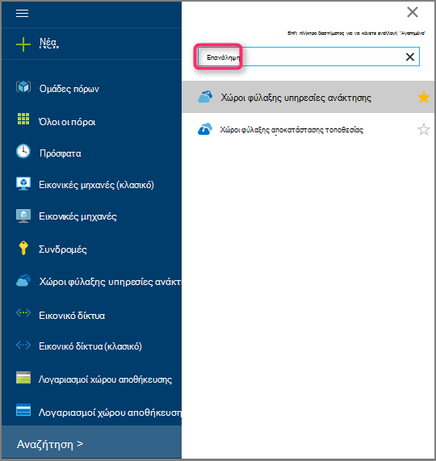 <br/>

    Εμφανίζεται η λίστα των χώροι φύλαξης υπηρεσίες ανάκτησης.

3. Στο μενού **χώροι φύλαξης υπηρεσίες ανάκτησης** , κάντε κλικ στην επιλογή **Προσθήκη**.

    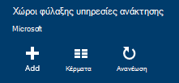

    Ανοίγει το blade θάλαμο υπηρεσίες ανάκτησης, να σας ζητήσει να δώσετε ένα **όνομα**, **τη συνδρομή**, **ομάδα πόρων**και **θέση**.

    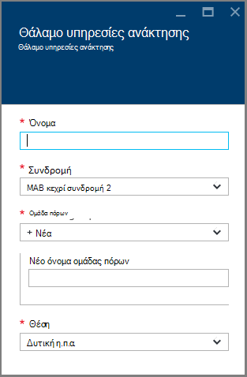

4. **Όνομα**, πληκτρολογήστε ένα φιλικό όνομα για τον προσδιορισμό του θάλαμο. Το όνομα πρέπει να είναι μοναδικό για τη συνδρομή Azure. Πληκτρολογήστε ένα όνομα που περιέχει μεταξύ 2 και 50 χαρακτήρων. Πρέπει να ξεκινούν με γράμμα και μπορούν να περιέχουν μόνο γράμματα, αριθμούς και παύλες.

5. Κάντε κλικ στην **εγγραφή** για να δείτε τη διαθέσιμη λίστα συνδρομών. Εάν δεν είστε βέβαιοι ποια συνδρομή για να χρησιμοποιήσετε, χρησιμοποιήστε την προεπιλεγμένη (ή προτεινόμενες) συνδρομής. Θα υπάρξει πολλαπλές επιλογές μόνο εάν είναι συσχετισμένη με πολλές συνδρομές Azure τον εταιρικό λογαριασμό σας.

6. Κάντε κλικ στην επιλογή **ομάδα πόρων** για να δείτε τη διαθέσιμη λίστα ομάδων πόρων ή κάντε κλικ στην επιλογή **Δημιουργία** για να δημιουργήσετε μια νέα ομάδα πόρων. Για πλήρεις πληροφορίες σχετικά με τις ομάδες πόρων, ανατρέξτε στο θέμα [Επισκόπηση της διαχείρισης πόρων Azure](../azure-resource-manager/resource-group-overview.md)

7. Κάντε κλικ στην επιλογή **θέσης** για να επιλέξετε τη γεωγραφική περιοχή για το θάλαμο.

8. Κάντε κλικ στην επιλογή **Δημιουργία**. Ενδέχεται να χρειαστεί κάποιος χρόνος για το θάλαμο υπηρεσίες ανάκτησης που θα δημιουργηθεί. Παρακολουθείτε τις ειδοποιήσεις κατάστασης στην επάνω δεξιά περιοχή στην πύλη.
Αφού δημιουργηθεί το θάλαμο, ανοίγει στην πύλη.

### <a name="set-storage-replication"></a>Ορισμός αναπαραγωγής χώρου αποθήκευσης

Η επιλογή αναπαραγωγή χώρου αποθήκευσης σας επιτρέπει να επιλέξετε μεταξύ των πλεοναζόντων παν χώρου αποθήκευσης και τοπικά πλεονάζοντα χώρο αποθήκευσης. Από προεπιλογή, το θάλαμο έχει παν πλεονάζοντα χώρο αποθήκευσης. Αφήστε την επιλογή που έχει οριστεί σε παν πλεονάζοντα χώρο αποθήκευσης, εάν πρόκειται για το πρωτεύον αντίγραφο ασφαλείας. Επιλέξτε τοπικά πλεονάζοντα χώρο αποθήκευσης, εάν θέλετε μια επιλογή κοστίζει που δεν είναι απολύτως ως διαρκή. Διαβάστε περισσότερα σχετικά με το [παν πλεονάζοντα](../storage/storage-redundancy.md#geo-redundant-storage) και [τοπικά πλεονάζοντα](../storage/storage-redundancy.md#locally-redundant-storage) επιλογές αποθήκευσης στην [Επισκόπηση αναπαραγωγής Azure αποθήκευσης](../storage/storage-redundancy.md).

Για να επεξεργαστείτε τη ρύθμιση αναπαραγωγής χώρου αποθήκευσης:

1. Επιλέξτε το θάλαμο για να ανοίξετε τον πίνακα εργαλείων θάλαμο και το blade ρυθμίσεις. Εάν δεν ανοίξει το blade **Ρυθμίσεις** , κάντε κλικ στην επιλογή **όλες οι ρυθμίσεις** στον πίνακα εργαλείων θάλαμο.

2. Στην το blade **Ρυθμίσεις** , κάντε κλικ στην **Υποδομή δημιουργίας αντιγράφων ασφαλείας** > **Ρύθμισης παραμέτρων δημιουργίας αντιγράφων ασφαλείας** για να ανοίξετε το blade **Ρύθμισης παραμέτρων δημιουργίας αντιγράφων ασφαλείας** . Στην blade τη **Ρύθμιση παραμέτρων δημιουργίας αντιγράφων ασφαλείας** , ενεργοποιήστε την επιλογή αναπαραγωγή χώρου αποθήκευσης για το θάλαμο.

    

    Αφού επιλέξετε την επιλογή αποθήκευσης για το θάλαμο, είστε έτοιμοι να συσχετίσετε την εικονική Μηχανή με το θάλαμο. Για να ξεκινήσετε τη συσχέτιση, πρέπει να ανακαλύψετε και καταχώρηση του Azure εικονικές μηχανές.

## <a name="3-software-package"></a>3. πακέτο λογισμικού

### <a name="downloading-the-software-package"></a>Λήψη του πακέτου λογισμικού
1. Είσοδος στην [πύλη του Azure](https://portal.azure.com/).

2. Εάν έχετε ήδη ένα ανοιχτό θάλαμο υπηρεσίες ανάκτησης, προχωρήστε στο βήμα 3. Εάν δεν έχετε ένα υπηρεσίες ανάκτησης φύλαξης ανοιχτό, αλλά είναι στην πύλη του Azure, στο μενού διανομέα, κάντε κλικ στο κουμπί **Αναζήτηση**.

    - Στη λίστα των πόρων, πληκτρολογήστε **Υπηρεσίες ανάκτησης**.
    - Καθώς αρχίζετε να πληκτρολογείτε, θα φιλτράρετε τη λίστα με βάση τα δεδομένα εισόδου σας. Όταν δείτε **χώροι φύλαξης υπηρεσίες ανάκτησης**, κάντε κλικ στην επιλογή.

    

    Εμφανίζεται η λίστα των χώροι φύλαξης υπηρεσίες ανάκτησης.

    - Από τη λίστα των χώροι φύλαξης υπηρεσίες ανάκτησης, επιλέξτε ένα θάλαμο.

    Ανοίγει τον πίνακα εργαλείων του επιλεγμένου θάλαμο.

    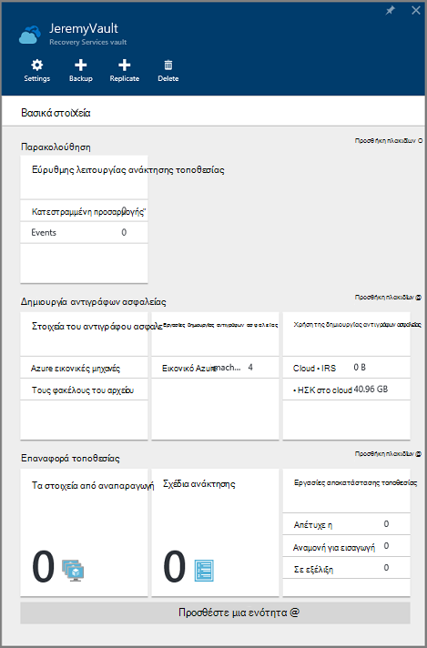

3. Ρυθμίσεις blade ανοίγει από προεπιλογή. Εάν είναι κλειστή, κάντε κλικ στην επιλογή **Ρυθμίσεις** για να ανοίξετε το blade ρυθμίσεις.

    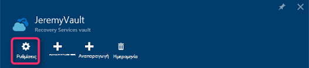

4. Κάντε κλικ στο **αντίγραφο ασφαλείας** " **Γρήγορα αποτελέσματα** " για να ανοίξετε τον "Οδηγό" Γρήγορα αποτελέσματα ".

    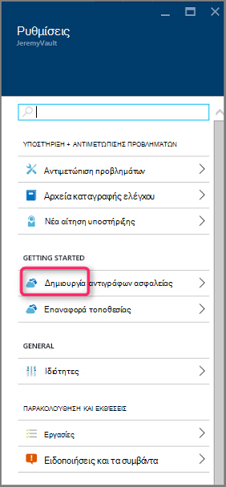

5. Το επιτύχετε γρήγορα αποτελέσματα που ανοίγει, οθόνη στόχους δημιουργίας αντιγράφων ασφαλείας θα επιλεγούν αυτόματα.
    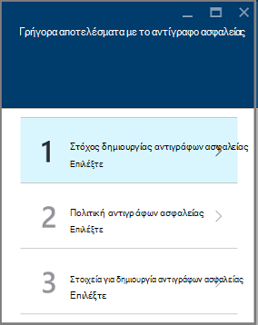

    Στην ενότητα **στόχους αντίγραφο ασφαλείας** , επιλέξτε *εσωτερικής εγκατάστασης* *όπου εκτελείται το φόρτο εργασίας*.

    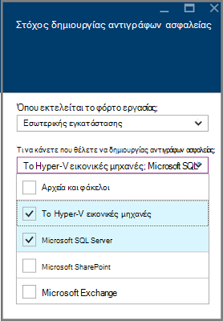

6. Επιλέξτε το φόρτο εργασίας που θέλετε να προστατεύσετε χρήση Azure δημιουργίας αντιγράφων ασφαλείας διακομιστή σε *ποια φόρτους εργασίας που θέλετε να προστατεύσετε* και κάντε κλικ στο **κουμπί OK**.

    > [AZURE.NOTE] Εάν σκοπεύετε να προστατεύσετε μόνο αρχεία και φάκελοι, στη συνέχεια, συνιστάται να χρησιμοποιείτε παράγοντας Azure δημιουργίας αντιγράφων ασφαλείας. Εάν σκοπεύετε να προστατεύσετε περισσότερες φόρτους εργασίας από απλώς αρχείων και φακέλων ή στο μέλλον εάν σχεδιάζετε να αναπτύξετε τις ανάγκες προστασίας, επιλέξτε όλα αυτά τα φόρτους εργασίας.

    Αυτό θα αλλάξει τον "Οδηγό γρήγορα αποτελέσματα" για να προετοιμάσετε υποδομή για προστασία φόρτους εργασίας από εσωτερικής εγκατάστασης για να Azure.

    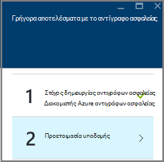

7. Στο το blade **Προετοιμασία υποδομή** που ανοίγει, κάντε κλικ στις συνδέσεις **λήψη** για εγκατάσταση Azure δημιουργίας αντιγράφων ασφαλείας διακομιστή και λήψη θάλαμο διαπιστευτήρια. Μπορείτε να χρησιμοποιήσετε τα διαπιστευτήρια θάλαμο κατά την εγγραφή του Azure δημιουργίας αντιγράφων ασφαλείας διακομιστή για να το θάλαμο υπηρεσίες ανάκτησης. Οι συνδέσεις σάς μεταφέρουν στο Κέντρο λήψης, όπου μπορείτε να κάνετε λήψη του πακέτου λογισμικού.

    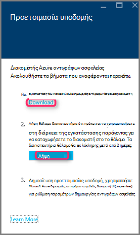

8. Επιλέξτε όλα τα αρχεία και κάντε κλικ στο κουμπί **Επόμενο**. Λήψη όλα τα αρχεία που προέρχονται από τη σελίδα λήψης Microsoft Azure Backup και τοποθετήστε όλα τα αρχεία στον ίδιο φάκελο.

    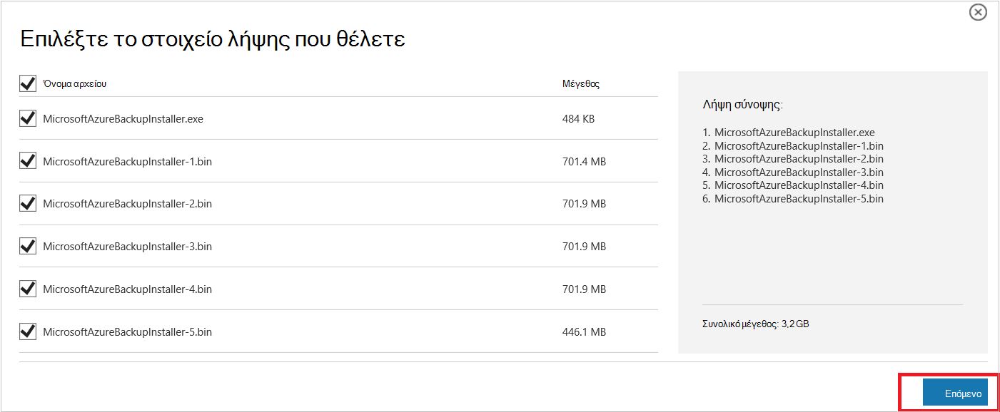

    Δεδομένου ότι το μέγεθος λήψης όλα τα αρχεία μαζί > 3G, σε μια 10Mbps σύνδεση λήψης ενδέχεται να χρειαστούν έως και 60 λεπτά για τη λήψη για να ολοκληρωθεί.


### <a name="extracting-the-software-package"></a>Εξαγωγή του πακέτου λογισμικού

Μετά τη λήψη όλων των αρχείων, κάντε κλικ στην επιλογή **MicrosoftAzureBackupInstaller.exe**. Αυτό θα ξεκινήσει ο **Οδηγός εγκατάστασης του Microsoft Azure δημιουργίας αντιγράφων ασφαλείας** για να εξαγάγετε τα αρχεία εγκατάστασης σε μια θέση που καθορίζεται από εσάς. Συνεχίστε μέσω του οδηγού και κάντε κλικ στο κουμπί " **Εξαγωγή** " για να ξεκινήσετε τη διαδικασία εξαγωγής.

> [AZURE.WARNING] Τουλάχιστον 4GB ελεύθερο χώρο που είναι απαραίτητη για να εξαγάγετε τα αρχεία της εγκατάστασης.


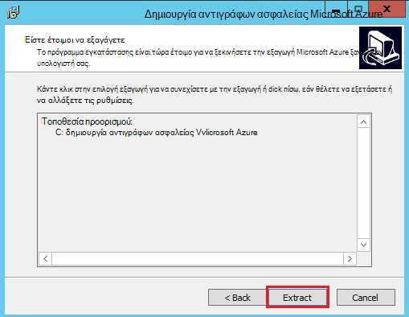

Μετά την εξαγωγή επεξεργασία ολοκληρωθεί, επιλέξτε το πλαίσιο εκκίνηση του εξαγμένο πρόσφατα *setup.exe* για να ξεκινήσετε την εγκατάσταση του Microsoft Azure δημιουργίας αντιγράφων ασφαλείας διακομιστή και κάντε κλικ στο κουμπί **Τέλος** .

### <a name="installing-the-software-package"></a>Κατά την εγκατάσταση του πακέτου λογισμικού

1. Κάντε κλικ στην επιλογή **Δημιουργία αντιγράφων ασφαλείας του Microsoft Azure** για να ξεκινήσετε τον Οδηγό εγκατάστασης.

    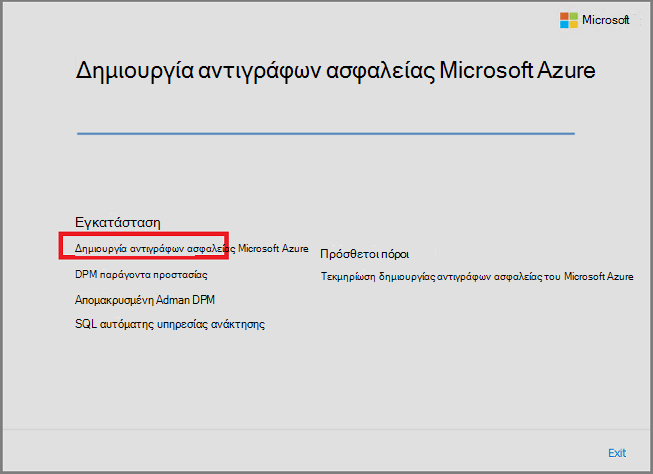

2. Στην οθόνη υποδοχής, κάντε κλικ στο κουμπί **Επόμενο** . Ενέργεια αυτή σας μεταφέρει στην ενότητα *Προαπαιτούμενες ελέγχει* . Σε αυτή την οθόνη, κάντε κλικ στο κουμπί **Έλεγχος** για να προσδιορίσετε εάν πληρούνται οι προϋποθέσεις υλικού και λογισμικού για Azure δημιουργίας αντιγράφων ασφαλείας διακομιστή. Εάν όλες οι προϋποθέσεις έχουν πληρούνται με επιτυχία, θα δείτε ένα μήνυμα που υποδεικνύει ότι ο υπολογιστής πληροί τις απαιτήσεις. Κάντε κλικ στο κουμπί **Επόμενο** .

    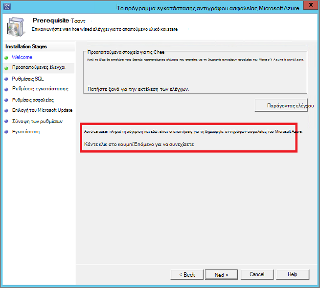

3. Διακομιστής δημιουργίας αντιγράφων ασφαλείας του Microsoft Azure απαιτεί SQL Server Standard και του πακέτου εγκατάστασης Azure δημιουργίας αντιγράφων ασφαλείας διακομιστή που παρέχεται μαζί με το κατάλληλο δυαδικά δεδομένα του SQL Server είναι απαραίτητο. Κατά την εκκίνηση με μια νέα εγκατάσταση Azure δημιουργίας αντιγράφων ασφαλείας διακομιστή, πρέπει να ορίστε την επιλογή **Εγκατάσταση νέας παρουσία του SQL Server με αυτό το πρόγραμμα εγκατάστασης** και κάντε κλικ στο κουμπί **Έλεγχος και εγκατάσταση** . Μόλις εγκαταστήσετε τις προϋποθέσεις είναι με επιτυχία, κάντε κλικ στο κουμπί **Επόμενο**.

    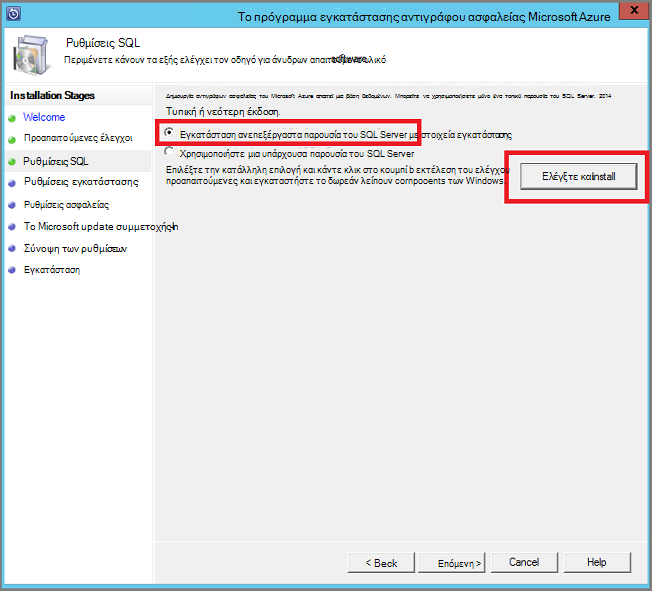

    Εάν προκύψει σφάλμα με σύσταση για να επανεκκινήσετε τον υπολογιστή σας, το κάνετε και κάντε κλικ **Ξανά**.

    > [AZURE.NOTE] Azure δημιουργίας αντιγράφων ασφαλείας διακομιστή δεν θα λειτουργεί με μια απομακρυσμένη περίοδο λειτουργίας του SQL Server. Η παρουσία που χρησιμοποιείται από Azure δημιουργίας αντιγράφων ασφαλείας διακομιστή πρέπει να είναι τοπικό.

4. Παρέχει μια θέση για την εγκατάσταση των αρχείων διακομιστή αντίγραφο ασφαλείας του Microsoft Azure και κάντε κλικ στο κουμπί **Επόμενο**.

    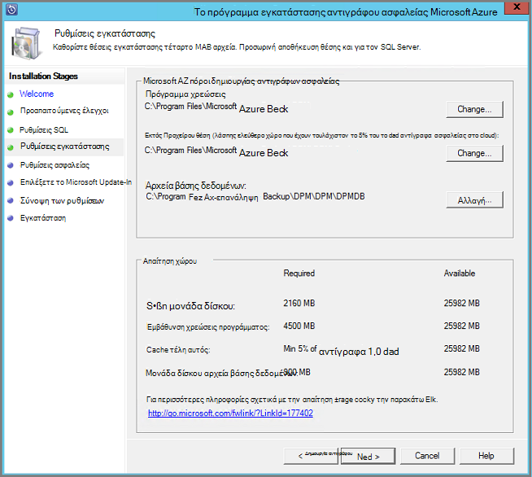

    Στην αρχική θέση αποτελεί προϋπόθεση για πίσω έως Azure. Βεβαιωθείτε ότι η αρχική θέση είναι 5% τουλάχιστον τα δεδομένα που έχει προγραμματιστεί να δημιουργηθεί αντίγραφο ασφαλείας στο cloud. Για την προστασία του δίσκου, ξεχωριστές δίσκων πρέπει να ρυθμιστούν μετά την ολοκλήρωση της εγκατάστασης. Για περισσότερες πληροφορίες σχετικά με τα σύνολα χώρου αποθήκευσης, ανατρέξτε στο θέμα [Ρύθμιση παραμέτρων αποθήκευσης σύνολα και χώρο αποθήκευσης στο δίσκο](https://technet.microsoft.com/library/hh758075.aspx).

5. Δώστε έναν ισχυρό κωδικό πρόσβασης για τους λογαριασμούς χρηστών περιορισμένα τοπικά και κάντε κλικ στο κουμπί **Επόμενο**.

    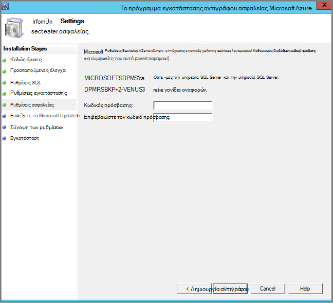

6. Επιλέξτε εάν θέλετε να χρησιμοποιήσετε *Το Microsoft Update* για να ελέγξετε για ενημερώσεις και κάντε κλικ στο κουμπί **Επόμενο**.

    >[AZURE.NOTE] Συνιστάται να αντιμετωπίζετε Windows Update ανακατεύθυνση στο Microsoft Update, το οποίο προσφέρει ασφάλεια και σημαντικές ενημερώσεις για τα Windows και άλλα προϊόντα, όπως το Microsoft Azure δημιουργίας αντιγράφων ασφαλείας διακομιστή.

    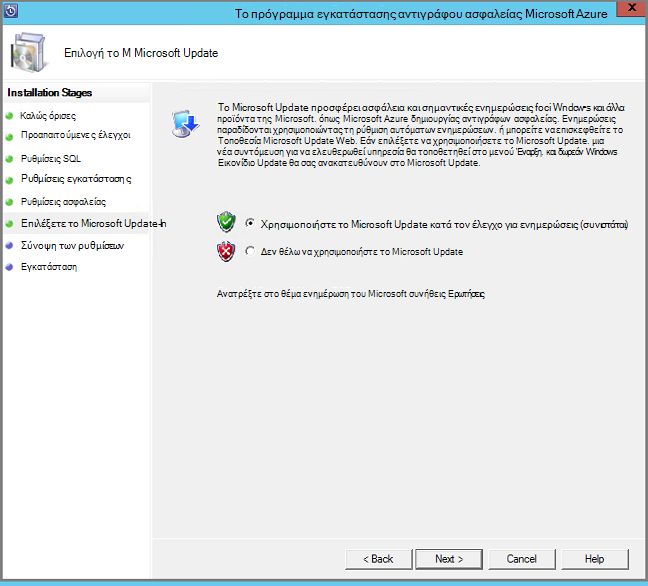

7. Ελέγξτε τη *Σύνοψη των ρυθμίσεων* και κάντε κλικ στην επιλογή **εγκατάσταση**.

    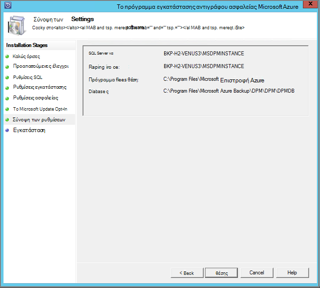

8. Η εγκατάσταση θα συμβεί σε φάσεις. Κατά την πρώτη φάση τον αντιπρόσωπο της Microsoft Azure αποκατάστασης υπηρεσίες έχει εγκατασταθεί στο διακομιστή. Ο οδηγός ελέγχει επίσης για σύνδεση στο Internet. Αν υπάρχει σύνδεση στο Internet μπορείτε να συνεχίσετε με την εγκατάσταση, εάν όχι, πρέπει να παρέχετε λεπτομέρειες διακομιστή μεσολάβησης για σύνδεση στο Internet.

    Το επόμενο βήμα είναι να ρυθμίσετε τις παραμέτρους του παράγοντα υπηρεσίες αποκατάστασης του Microsoft Azure. Ως μέρος της ρύθμισης παραμέτρων, θα πρέπει να παρέχετε τα διαπιστευτήριά σας θάλαμο για την καταχώρηση του υπολογιστή για να το θάλαμο υπηρεσίες ανάκτησης. Μπορείτε, επίσης, θα παρέχετε μια φράση πρόσβασης για να Κρυπτογράφηση/αποκρυπτογράφηση τα δεδομένα που αποστέλλονται μεταξύ Azure και την εσωτερική εγκατάσταση. Αυτόματα, μπορείτε να δημιουργήσετε μια φράση πρόσβασης ή να παρέχουν τη δική σας ελάχιστη φράση πρόσβασης 16 χαρακτήρες. Συνεχίστε με τον Οδηγό μέχρι τον παράγοντα έχει ρυθμιστεί.

    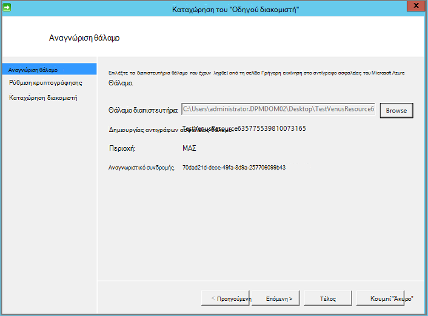

9. Μόλις ολοκληρωθεί με επιτυχία εγγραφής του Microsoft Azure Backup διακομιστή, ο Οδηγός εγκατάστασης συνολική συνεχίζει με την εγκατάσταση και ρύθμιση των παραμέτρων του SQL Server και τα στοιχεία Azure δημιουργίας αντιγράφων ασφαλείας διακομιστή. Μόλις ολοκληρωθεί η εγκατάσταση του SQL Server στοιχείου, έχουν εγκατασταθεί τα στοιχεία Azure δημιουργίας αντιγράφων ασφαλείας διακομιστή.

    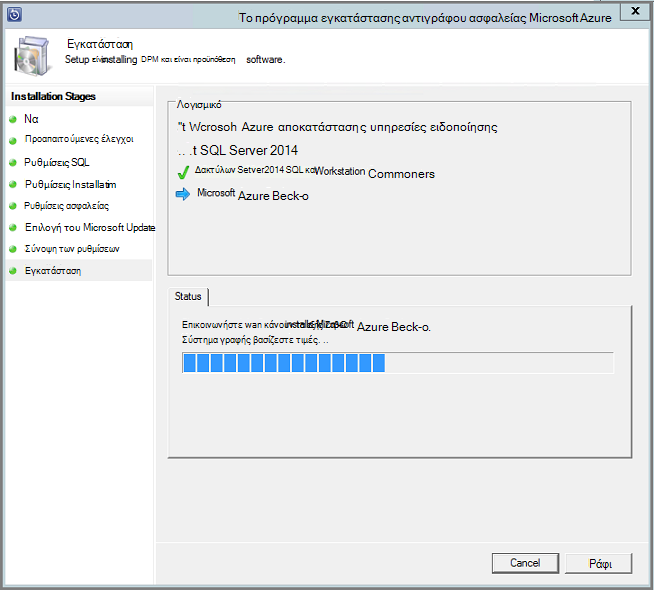


Όταν ολοκληρωθεί το βήμα εγκατάστασης, εικονίδια της επιφάνειας εργασίας του προϊόντος θα έχουν δημιουργηθεί καθώς και. Απλώς κάντε διπλό κλικ στο εικονίδιο για την εκκίνηση του προϊόντος.

### <a name="add-backup-storage"></a>Προσθήκη αποθήκευσης αντιγράφων ασφαλείας

Το πρώτο αντίγραφο ασφαλείας διατηρείται στο χώρο αποθήκευσης που έχουν επισυναφθεί σε υπολογιστή του Azure δημιουργίας αντιγράφων ασφαλείας διακομιστή. Για περισσότερες πληροφορίες σχετικά με την προσθήκη δίσκων, ανατρέξτε στο θέμα [Ρύθμιση παραμέτρων αποθήκευσης σύνολα και χώρο αποθήκευσης στο δίσκο](https://technet.microsoft.com/library/hh758075.aspx).

> [AZURE.NOTE] Πρέπει να προσθέσετε αποθήκευσης αντιγράφων ασφαλείας, ακόμα και εάν σκοπεύετε να στείλουν δεδομένα σε Azure. Στην τρέχουσα αρχιτεκτονική του Azure δημιουργίας αντιγράφων ασφαλείας διακομιστή, το αντίγραφο ασφαλείας Azure θάλαμο διατηρεί το *δεύτερο* αντίγραφο των δεδομένων κατά την τοπική αποθήκευση διατηρεί το αντίγραφο ασφαλείας πρώτη (και υποχρεωτικό).

## <a name="4-network-connectivity"></a>4. η συνδεσιμότητα του δικτύου

Azure δημιουργίας αντιγράφων ασφαλείας διακομιστή απαιτούν σύνδεση με την υπηρεσία Azure δημιουργίας αντιγράφων ασφαλείας για το προϊόν για να εργαστείτε με επιτυχία. Για να επιβεβαιώνετε αν η μηχανή έχει τη σύνδεση με Azure, χρησιμοποιήστε το ```Get-DPMCloudConnection``` cmdlet στην κονσόλα Azure δημιουργίας αντιγράφων ασφαλείας διακομιστή PowerShell. Εάν το αποτέλεσμα της το cmdlet είναι TRUE, στη συνέχεια, υπάρχει συνδεσιμότητας, αλλιώς υπάρχει χωρίς σύνδεση.

Την ίδια στιγμή, η συνδρομή Azure πρέπει να είναι σε καλή κατάσταση. Για να βρείτε την κατάσταση της συνδρομής σας και για να διαχειριστείτε, συνδεθείτε [πύλη συνδρομής]( https://account.windowsazure.com/Subscriptions).

Όταν μάθετε την κατάσταση του Azure τη συνδεσιμότητα και το Azure συνδρομής, μπορείτε να χρησιμοποιήσετε τον παρακάτω πίνακα για να βρείτε την επίδραση για τη δημιουργία αντιγράφων ασφαλείας/Επαναφορά λειτουργικότητα που παρέχεται.

| Κατάσταση σύνδεσης | Azure συνδρομή | Δημιουργία αντιγράφων ασφαλείας στο Azure| Δημιουργία αντιγράφων ασφαλείας στο δίσκο | Επαναφορά από Azure | Επαναφορά από δίσκο |
| -------- | ------- | --------------------- | ------------------- | --------------------------- | ----------------------- |
| Συνδεδεμένοι | Ενεργό | Επιτρέπονται | Επιτρέπονται | Επιτρέπονται | Επιτρέπονται |
| Συνδεδεμένοι | Έχει λήξει | Έγινε διακοπή | Έγινε διακοπή | Επιτρέπονται | Επιτρέπονται |
| Συνδεδεμένοι | Κατάργηση | Έγινε διακοπή | Έγινε διακοπή | Σημεία διακοπεί και Azure ανάκτηση διαγραμμένων | Έγινε διακοπή |
| Χαθούν συνδεσιμότητας > 15 ημέρες | Ενεργό | Έγινε διακοπή | Έγινε διακοπή | Επιτρέπονται | Επιτρέπονται |
| Χαθούν συνδεσιμότητας > 15 ημέρες | Έχει λήξει | Έγινε διακοπή | Έγινε διακοπή | Επιτρέπονται | Επιτρέπονται |
| Χαθούν συνδεσιμότητας > 15 ημέρες | Κατάργηση | Έγινε διακοπή | Έγινε διακοπή |  Σημεία διακοπεί και Azure ανάκτηση διαγραμμένων | Έγινε διακοπή |

### <a name="recovering-from-loss-of-connectivity"></a>Ανάκτηση από απώλεια σύνδεσης
Εάν έχετε ένα τείχος προστασίας ή διακομιστή μεσολάβησης που εμποδίζει την πρόσβαση σε Azure, πρέπει να whitelist οι ακόλουθες διευθύνσεις τομέα στο τείχος προστασίας/διακομιστής μεσολάβησης προφίλ:

- www.msftncsi.com
- \*. Microsoft.com
- \*. WindowsAzure.com
- \*. microsoftonline.com
- \*. των windows.net

Όταν έχει γίνει επαναφορά συνδεσιμότητας με Azure στον υπολογιστή του Azure δημιουργίας αντιγράφων ασφαλείας διακομιστή, οι λειτουργίες που μπορούν να εκτελεστούν καθορίζονται από την κατάσταση Azure συνδρομής. Στον παραπάνω πίνακα περιλαμβάνει λεπτομέρειες σχετικά με τις λειτουργίες επιτρέπεται όταν ο υπολογιστής είναι "συνδεδεμένος".

### <a name="handling-subscription-states"></a>Χειρισμός από τη συνδρομή.

Είναι δυνατό να λάβουν μια συνδρομή του Azure από μια κατάσταση *έληξε* ή *Κατάργηση* για να την *ενεργή* κατάσταση. Ωστόσο αυτό περιλαμβάνει ορισμένες συνέπειες για τη συμπεριφορά του προϊόντος ενώ δεν είναι *ενεργή*η κατάσταση:

- *Κατάργηση* συνδρομής χάσει τη λειτουργικότητα για την περίοδο που αυτό καταργείται. Σχετικά με την ενεργοποίηση *ενεργό*, τη λειτουργικότητα προϊόντος δημιουργίας αντιγράφων ασφαλείας/επαναφοράς είναι αναβιώσει. Τα δεδομένα αντιγράφου ασφαλείας στον τοπικό δίσκο επίσης μπορεί να ανακτηθεί αν αυτό ήταν κρατήσει με αρκετά μεγάλο χρόνο διατήρησης. Ωστόσο, τα δεδομένα αντιγράφου ασφαλείας στο Azure χάνεται ανεπανόρθωτη όταν η συνδρομή τίθεται σε κατάσταση *Κατάργηση* .
- Μια συνδρομή *έληξε* χάνει μόνο λειτουργίες για μέχρι το έχει γίνει *ενεργό* ξανά. Τα αντίγραφα ασφαλείας που έχει προγραμματιστεί για την περίοδο ότι η συνδρομή έχει *έληξε* δεν θα εκτελεστεί.


## <a name="troubleshooting"></a>Αντιμετώπιση προβλημάτων

Εάν διακομιστή αντιγράφων ασφαλείας Microsoft Azure αποτυγχάνει με σφάλματα κατά τη φάση εγκατάστασης (ή δημιουργία αντιγράφων ασφαλείας ή επαναφορά), ανατρέξτε σε αυτό το [έγγραφο τους κωδικούς σφάλματος](https://support.microsoft.com/kb/3041338) για περισσότερες πληροφορίες.
Μπορείτε επίσης να ανατρέξετε [Azure δημιουργίας αντιγράφων ασφαλείας που σχετίζονται με συνήθεις ερωτήσεις](backup-azure-backup-faq.md)


## <a name="next-steps"></a>Επόμενα βήματα

Μπορείτε να λάβετε λεπτομερείς πληροφορίες σχετικά με την [Προετοιμασία το περιβάλλον σας για DPM](https://technet.microsoft.com/library/hh758176.aspx) στην τοποθεσία Microsoft TechNet. Περιλαμβάνει επίσης πληροφορίες σχετικά με τις υποστηριζόμενες ρυθμίσεις παραμέτρων στην οποία Azure δημιουργίας αντιγράφων ασφαλείας διακομιστή μπορεί να αναπτυχθεί και χρησιμοποιείται.

Μπορείτε να χρησιμοποιήσετε αυτά τα άρθρα για να αποκτήσετε μια βαθύτερη Κατανόηση της προστασίας φόρτο εργασίας με χρήση διακομιστή αντίγραφο ασφαλείας του Microsoft Azure.

- [Δημιουργία αντιγράφων ασφαλείας SQL Server](backup-azure-backup-sql.md)
- [Δημιουργία αντιγράφων ασφαλείας του SharePoint server](backup-azure-backup-sharepoint.md)
- [Δημιουργία αντιγράφων ασφαλείας εναλλακτικό διακομιστή](backup-azure-alternate-dpm-server.md)
