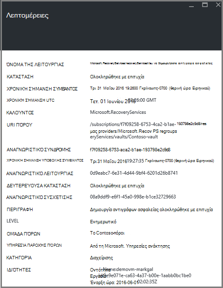

<properties
   pageTitle="Διαχείριση πόρων οθόνη αναπτυχθεί εικονική μηχανή δημιουργίας αντιγράφων ασφαλείας | Microsoft Azure"
   description="Παρακολούθηση συμβάντων και τις ειδοποιήσεις από διαχειριστή πόρων αναπτυχθεί εικονική μηχανή δημιουργίας αντιγράφων ασφαλείας. Αποστολή μηνύματος ηλεκτρονικού ταχυδρομείου που βασίζεται σε ειδοποιήσεις."
   services="backup"
   documentationCenter="dev-center-name"
   authors="markgalioto"
   manager="cfreeman"
   editor=""/>

<tags
ms.service="backup"
ms.workload="storage-backup-recovery"
ms.tgt_pltfrm="na"
ms.devlang="na"
ms.topic="article"
ms.date="08/25/2016"
ms.author="trinadhk; giridham;"/>

# <a name="monitor-alerts-for-azure-virtual-machine-backups"></a>Παρακολούθηση ειδοποιήσεων για δημιουργία αντιγράφων ασφαλείας Azure εικονική μηχανή

Οι ειδοποιήσεις είναι απαντήσεις από την υπηρεσία ότι ένα όριο συμβάν έχει πληρούνται ή διανομέων. Εάν γνωρίζετε πότε προβλήματα εκκίνησης μπορεί να είναι σημαντικό να διατηρήσετε το κόστος επιχειρήσεις προς τα κάτω. Ειδοποιήσεις δεν παρουσιάζονται συνήθως σε ένα χρονοδιάγραμμα και επομένως είναι χρήσιμο να γνωρίζετε όσο το δυνατόν πιο σύντομα αφού προκύψει ειδοποιήσεις. Για παράδειγμα, όταν μια εργασία ή επαναφοράς αντιγράφου ασφαλείας αποτύχει, μια ειδοποίηση παρουσιάζεται μετά από πέντε λεπτά της αποτυχίας. Στον πίνακα εργαλείων θάλαμο, το πλακίδιο ειδοποιήσεις αντίγραφο ασφαλείας εμφανίζει συμβάντα κρίσιμη και επίπεδο προειδοποίησης. Στις ρυθμίσεις ειδοποιήσεων αντίγραφο ασφαλείας, μπορείτε να δείτε όλα τα συμβάντα. Αλλά τι να κάνετε εάν μια ειδοποίηση πραγματοποιείται όταν εργάζεστε σε ένα νέο θέμα; Εάν δεν γνωρίζετε όταν συμβαίνει την ειδοποίηση, μπορεί να είναι μια μικρή αναστάτωση ή αυτό θα μπορούσε να υποβάθμισης δεδομένων. Για να βεβαιωθείτε ότι το σωστό χρήστες είναι γνωρίζουν ειδοποίησης - όταν παρουσιάζεται, ρύθμιση παραμέτρων της υπηρεσίας για να στείλετε ειδοποιήσεις μέσω ηλεκτρονικού ταχυδρομείου. Για λεπτομέρειες σχετικά με τη ρύθμιση των ειδοποιήσεων ηλεκτρονικού ταχυδρομείου, ανατρέξτε στο θέμα [Ρύθμιση παραμέτρων ειδοποιήσεων](backup-azure-monitor-vms.md#configure-notifications).

## <a name="how-do-i-find-information-about-the-alerts"></a>Πώς μπορώ να βρω πληροφορίες σχετικά με τις ειδοποιήσεις;

Για να προβάλετε πληροφορίες σχετικά με το συμβάν που δημιούργησε ειδοποίησης, πρέπει να ανοίξετε το blade ειδοποιήσεις δημιουργίας αντιγράφων ασφαλείας. Υπάρχουν δύο τρόποι για να ανοίξετε το αντίγραφο ασφαλείας ειδοποιήσεις blade: μία από τις ειδοποιήσεις αντίγραφο ασφαλείας πλακιδίου στον πίνακα εργαλείων θάλαμο ή από το blade ειδοποιήσεις και τα συμβάντα.

Για να ανοίξετε το αντίγραφο ασφαλείας ειδοποιήσεις blade από το πλακίδιο ειδοποιήσεις δημιουργίας αντιγράφων ασφαλείας:

- Στο πλακίδιο στον πίνακα εργαλείων θάλαμο **Ειδοποιήσεις αντίγραφο ασφαλείας** , κάντε κλικ στην επιλογή **κρίσιμη** ή **Προειδοποίηση** για να προβάλετε τα συμβάντα λειτουργικές για το συγκεκριμένο επίπεδο της σοβαρότητας.

    


Για να ανοίξετε το αντίγραφο ασφαλείας ειδοποιήσεις blade από το blade ειδοποιήσεις και τα συμβάντα:

1. Από τον πίνακα εργαλείων θάλαμο, κάντε κλικ στην επιλογή **Όλες οι ρυθμίσεις**. 

2. Στην το blade **Ρυθμίσεις** , κάντε κλικ στην επιλογή **ειδοποιήσεις και τα συμβάντα**. 

3. Στην blade **ειδοποιήσεις και τα συμβάντα** , κάντε κλικ στην επιλογή **Ειδοποιήσεις δημιουργίας αντιγράφων ασφαλείας**. 

    Το **Αντίγραφο ασφαλείας ειδοποιήσεις** blade ανοίγει και εμφανίζει τις φιλτραρισμένες ειδοποιήσεις.

    

4. Για να προβάλετε λεπτομερείς πληροφορίες σχετικά με μια συγκεκριμένη ειδοποίηση, από τη λίστα των συμβάντων, κάντε κλικ στην ειδοποίηση για να ανοίξετε το blade **Λεπτομέρειες** .

    

    Για να προσαρμόσετε τα χαρακτηριστικά που εμφανίζονται στη λίστα, ανατρέξτε στο θέμα [Προβολή χαρακτηριστικά επιπλέον συμβάντος](backup-azure-monitor-vms.md#view-additional-event-attributes)

## <a name="configure-notifications"></a>Ρύθμιση παραμέτρων ειδοποιήσεων

 Μπορείτε να ρυθμίσετε την υπηρεσία για την αποστολή ειδοποιήσεων ηλεκτρονικού ταχυδρομείου για τις ειδοποιήσεις που έγιναν πάνω από την τελευταία ώρα ή όταν προκύπτουν συγκεκριμένους τύπους συμβάντα.

Για να ρυθμίσετε τις ειδοποιήσεις ηλεκτρονικού ταχυδρομείου για τις ειδοποιήσεις

1. Στο μενού ειδοποιήσεων αντίγραφο ασφαλείας, κάντε κλικ στην επιλογή **Ρύθμιση παραμέτρων ειδοποιήσεων**

    

    Ανοίγει η ρύθμιση παραμέτρων blade ειδοποιήσεις.

    

2. Στην τη ρύθμιση παραμέτρων blade ειδοποιήσεις, για τις ειδοποιήσεις ηλεκτρονικού ταχυδρομείου, κάντε κλικ **στο**.

    Η παραλήπτες και της σοβαρότητας παράθυρα διαλόγου έχει ένα αστέρι δίπλα τους, επειδή οι πληροφορίες που είναι απαραίτητες. Παροχή τουλάχιστον μία διεύθυνση ηλεκτρονικού ταχυδρομείου και επιλέξτε τουλάχιστον μία σοβαρότητας.

3. Στο παράθυρο διαλόγου **παραλήπτες (ηλεκτρονικό ταχυδρομείο)** , πληκτρολογήστε τις διευθύνσεις ηλεκτρονικού ταχυδρομείου για άτομα που λαμβάνουν τις ειδοποιήσεις. Χρησιμοποιήστε τη μορφή: username@domainname.com. Διαχωρίστε τις πολλαπλές διευθύνσεις ηλεκτρονικού ταχυδρομείου με ελληνικό ερωτηματικό (;).

4. Στην περιοχή **ειδοποίηση** , επιλέξτε **Ανά ειδοποίηση** για την αποστολή ειδοποιήσεων όταν το καθορισμένο ειδοποίηση ή **Ωριαία σύνοψη** για να στείλετε μια σύνοψη για την τελευταία ώρα.

5. Στο παράθυρο διαλόγου **της σοβαρότητας** , επιλέξτε ένα ή περισσότερα επίπεδα που θέλετε να ενεργοποιήσετε την ειδοποίηση μέσω ηλεκτρονικού ταχυδρομείου.

6. Κάντε κλικ στην επιλογή **Αποθήκευση**.
### <a name="what-alert-types-are-available-for-azure-iaas-vm-backup"></a>Ποιοι τύποι ειδοποίησης είναι διαθέσιμες για δημιουργία αντιγράφων ασφαλείας Εικονική IaaS Azure;
| Επίπεδο προειδοποίησης  | Αποστολή προειδοποιήσεων |
| ------------- | ------------- |
| Κρίσιμη | Αποτυχία δημιουργίας αντιγράφων ασφαλείας, αποτυχία ανάκτησης  |
| Προειδοποίηση  | Κανένας |
| Ενημερωτικό  | Κανένας  |

### <a name="are-there-situations-where-email-isnt-sent-even-if-notifications-are-configured"></a>Υπάρχουν περιπτώσεις όπου δεν έχει σταλεί μήνυμα ηλεκτρονικού ταχυδρομείου ακόμα και αν έχουν ρυθμιστεί οι παράμετροι τις ειδοποιήσεις;

Υπάρχουν περιπτώσεις όπου δεν αποστέλλεται μια ειδοποίηση, παρόλο που οι ειδοποιήσεις έχουν ρυθμιστεί σωστά. Το παρακάτω περιπτώσεις, μέσω ηλεκτρονικού ταχυδρομείου δεν αποστέλλονται ειδοποιήσεις για να αποφύγετε το θόρυβο ειδοποίησης:

- Εάν ειδοποιήσεις έχουν ρυθμιστεί ώστε να ωριαία σύνοψη και ειδοποίησης είναι υψωμένο και η ανάλυση μέσα την ώρα.
- Ακύρωση της εργασίας.
- Μια εργασία αντιγράφου ασφαλείας ενεργοποιείται και, στη συνέχεια, αποτυγχάνει και μια άλλη εργασία δημιουργίας αντιγράφων ασφαλείας βρίσκεται σε εξέλιξη.
- Ξεκινά μια προγραμματισμένη εργασία αντιγράφου ασφαλείας για μια Εικονική με δυνατότητα διαχείρισης πόρων, αλλά η Εικονική δεν υπάρχει πλέον.

## <a name="customize-your-view-of-events"></a>Προσαρμόστε την προβολή των συμβάντων

Η ρύθμιση **αρχείων καταγραφής ελέγχου** συνοδεύεται από ένα προκαθορισμένο σύνολο των φίλτρων και των στηλών που εμφανίζει πληροφορίες λειτουργικές συμβάντων. Μπορείτε να προσαρμόσετε την προβολή, έτσι ώστε όταν ανοίξει το blade **συμβάντα** , σας δείχνει τις πληροφορίες που θέλετε.

1. Στον πίνακα [εργαλείων θάλαμο](./backup-azure-manage-vms.md#open-a-recovery-services-vault-in-the-dashboard), αναζητήστε και κάντε κλικ στην επιλογή **Αρχεία καταγραφής ελέγχου** για να ανοίξετε το blade **συμβάντα** .

    

    Τα **συμβάντα** blade ανοίγει τα συμβάντα λειτουργικές φιλτραρισμένο μόνο για το τρέχον θάλαμο.

    

    Το blade εμφανίζει τη λίστα των κρίσιμη, σφάλμα, προειδοποίηση και ενημερωτικό συμβάντα που προέκυψαν την προηγούμενη εβδομάδα. Το χρονικό διάστημα είναι μια προεπιλεγμένη τιμή έχει οριστεί στο **φίλτρο**. Τα **συμβάντα** blade εμφανίζει επίσης ένα γράφημα ράβδων παρακολούθησης όταν παρουσιάστηκαν τα συμβάντα. Εάν δεν θέλετε να δείτε το γράφημα ράβδων, στο μενού **συμβάντα** , κάντε κλικ στην επιλογή **Απόκρυψη γραφήματος** για να απενεργοποιήσετε το γράφημα. Η προεπιλεγμένη προβολή συμβάντων εμφανίζει πληροφορίες λειτουργίας, επίπεδο, κατάσταση, πόρων και ώρα. Για πληροφορίες σχετικά με εκθέσετε επιπλέον χαρακτηριστικά συμβάντος, ανατρέξτε στο θέμα η ενότητα [επέκταση πληροφορίες συμβάντων](backup-azure-monitor-vms.md#view-additional-event-attributes).

2. Για πρόσθετες πληροφορίες σχετικά με ένα συμβάν λειτουργικές, στη στήλη **λειτουργία** , κάντε κλικ στην επιλογή λειτουργικές συμβάντος για να ανοίξετε το blade. Το blade περιέχει λεπτομερείς πληροφορίες σχετικά με τα συμβάντα. Συμβάντα ομαδοποιημένες κατά το Αναγνωριστικό συσχέτισης και μια λίστα με τα συμβάντα που προέκυψαν στο του χρονικού διαστήματος.

    

3. Για να προβάλετε λεπτομερείς πληροφορίες σχετικά με ένα συγκεκριμένο συμβάν, από τη λίστα των συμβάντων, κάντε κλικ στο συμβάν για να ανοίξετε το blade **Λεπτομέρειες** .

    

    Οι πληροφορίες συμβάντων επιπέδου είναι λεπτομερείς λαμβάνει τις πληροφορίες. Εάν προτιμάτε να βλέπουν αυτό πολλές πληροφορίες σχετικά με κάθε συμβάν και θέλετε να προσθέσετε ο αντίστοιχος λεπτομερειών για τα **συμβάντα** blade, δείτε την ενότητα [επέκταση πληροφορίες συμβάντων](backup-azure-monitor-vms.md#view-additional-event-attributes).


## <a name="customize-the-event-filter"></a>Προσαρμογή του φίλτρου του συμβάντος
Χρησιμοποιήστε το **φίλτρο** για να προσαρμόσετε ή να επιλέξετε τις πληροφορίες που εμφανίζονται σε ένα συγκεκριμένο blade. Για να φιλτράρετε τις πληροφορίες συμβάντων:

1. Στον πίνακα [εργαλείων θάλαμο](./backup-azure-manage-vms.md#open-a-recovery-services-vault-in-the-dashboard), αναζητήστε και κάντε κλικ στην επιλογή **Αρχεία καταγραφής ελέγχου** για να ανοίξετε το blade **συμβάντα** .

    

    Τα **συμβάντα** blade ανοίγει τα συμβάντα λειτουργικές φιλτραρισμένο μόνο για το τρέχον θάλαμο.

    

2. Στο μενού **συμβάντα** , κάντε κλικ στην επιλογή **φίλτρο** για να ανοίξετε αυτόν blade.

    

3. Στην blade το **φίλτρο** , χρησιμοποιήστε τα φίλτρα **επίπεδο** **εκτείνονται σε χρόνο**και **τον καλούντα** . Τα φίλτρα δεν είναι διαθέσιμες, επειδή αυτές έχουν οριστεί να δώσετε τις τρέχουσες πληροφορίες για το θάλαμο υπηρεσίες ανάκτησης.

    

    Μπορείτε να καθορίσετε το **επίπεδο** του συμβάντος: κρίσιμες, σφάλμα, προειδοποίηση ή ενημερωτικό. Μπορείτε να επιλέξετε οποιονδήποτε συνδυασμό των επιπέδων συμβάντος, αλλά πρέπει να έχετε τουλάχιστον ένα επιλεγμένο επίπεδο. Εναλλαγή στο επίπεδο ή να απενεργοποιήσετε. Το φίλτρο **χρόνου καλύπτουν** σάς επιτρέπει να καθορίσετε το χρονικό διάστημα για την καταγραφή συμβάντων. Εάν χρησιμοποιείτε μια προσαρμοσμένη χρονικού διαστήματος, μπορείτε να ορίσετε την ώρα έναρξης και λήξης.

4. Όταν είστε έτοιμοι ερώτημα για τα αρχεία καταγραφής λειτουργίες χρησιμοποιώντας το φίλτρο, κάντε κλικ στην επιλογή **Ενημέρωση**. Τα αποτελέσματα εμφανίζονται σε blade τα **συμβάντα** .

    


### <a name="view-additional-event-attributes"></a>Προβολή επιπλέον συμβάν χαρακτηριστικά
Χρησιμοποιώντας το κουμπί " **στήλες** ", μπορείτε να ενεργοποιήσετε επιπλέον συμβάν χαρακτηριστικά να εμφανίζονται στη λίστα το blade **συμβάντα** . Στην προεπιλεγμένη λίστα συμβάντων εμφανίζει πληροφορίες για τη λειτουργία, επίπεδο, κατάσταση, πόρων και ώρα. Για να ενεργοποιήσετε επιπλέον χαρακτηριστικά:

1. Στην blade τα **συμβάντα** , κάντε κλικ στην επιλογή **στήλες**.

    

    Ανοίγει το blade **Επιλογή στηλών** .

    

2. Για να επιλέξετε το χαρακτηριστικό, επιλέξτε το πλαίσιο ελέγχου. Το χαρακτηριστικό πλαίσιο ελέγχου Ενεργοποίηση και απενεργοποίηση.

3. Κάντε κλικ στην επιλογή **Επαναφορά** για να επαναφέρετε τη λίστα των χαρακτηριστικών στο το blade **συμβάντα** . Μετά την προσθήκη ή κατάργηση χαρακτηριστικά από τη λίστα, χρησιμοποιήστε **Επαναφορά** για να προβάλετε τη νέα λίστα των χαρακτηριστικών συμβάν.

4. Κάντε κλικ στην επιλογή **Ενημέρωση** για να ενημερώσετε τα δεδομένα στο τα χαρακτηριστικά του συμβάντος. Ο παρακάτω πίνακας παρέχει πληροφορίες σχετικά με κάθε χαρακτηριστικό.

| Όνομα στήλης      |Περιγραφή|
| -----------------|-----------|
| Η λειτουργία|Το όνομα της λειτουργίας|
| Επίπεδο|Το επίπεδο της λειτουργίας, μπορεί να είναι τιμές: ενημερωτικό, προειδοποίηση, σφάλμα ή κρίσιμη|
|Κατάσταση|Περιγραφικό κατάσταση της λειτουργίας|
|Πόρων|Διεύθυνση URL που προσδιορίζει τον πόρο. γνωστό και ως το Αναγνωριστικό πόρου|
|Ώρα|Ώρα, μετρώντας από την τρέχουσα ώρα, όταν παρουσιάστηκε το συμβάν|
|Καλούντος|Ποιος ή τι που ονομάζεται ή ενεργοποίησε το συμβάν; μπορεί να είναι το σύστημα ή ένα χρήστη|
|Χρονική σήμανση|Την ώρα όταν δημιουργήθηκε το συμβάν|
|Ομάδα πόρων|Η ομάδα συσχετισμένη πόρων|
|Τύπος πόρου|Ο τύπος εσωτερικού πόρου που χρησιμοποιείται από τη διαχείριση πόρων|
|Αναγνωριστικό συνδρομής|Το Αναγνωριστικό συσχετισμένη εγγραφής|
|Κατηγορία|Κατηγορία του συμβάντος|
|Αναγνωριστικό συσχέτισης|Κοινές Αναγνωριστικό για σχετικά συμβάντα|


## <a name="use-powershell-to-customize-alerts"></a>Χρήση του PowerShell για να προσαρμόσετε τις ειδοποιήσεις
Μπορείτε να λάβετε προσαρμοσμένες οι ειδοποιήσεις για τις εργασίες στην πύλη. Για να λάβετε αυτές τις εργασίες, ορισμός ειδοποίησης κανόνες με βάση το PowerShell για τα συμβάντα λειτουργικές αρχεία καταγραφής. Χρήση *PowerShell έκδοση 1.3.0 ή νεότερη έκδοση*.

Για να ορίσετε μια προσαρμοσμένη ειδοποίηση ειδοποιεί για αποτυχιών του αντιγράφου ασφαλείας, χρησιμοποιήστε μια εντολή όπως την ακόλουθη δέσμη ενεργειών:

```
PS C:\> $actionEmail = New-AzureRmAlertRuleEmail -CustomEmail contoso@microsoft.com
PS C:\> Add-AzureRmLogAlertRule -Name backupFailedAlert -Location "East US" -ResourceGroup RecoveryServices-DP2RCXUGWS3MLJF4LKPI3A3OMJ2DI4SRJK6HIJH22HFIHZVVELRQ-East-US -OperationName Microsoft.Backup/RecoveryServicesVault/Backup -Status Failed -TargetResourceId /subscriptions/86eeac34-eth9a-4de3-84db-7a27d121967e/resourceGroups/RecoveryServices-DP2RCXUGWS3MLJF4LKPI3A3OMJ2DI4SRJK6HIJH22HFIHZVVELRQ-East-US/providers/microsoft.backupbvtd2/RecoveryServicesVault/trinadhVault -Actions $actionEmail
```

**ResourceId** : μπορείτε να λάβετε ResourceId από τα αρχεία καταγραφής ελέγχου. Το ResourceId είναι μια διεύθυνση URL που παρέχονται στη στήλη πόρων από τα αρχεία καταγραφής λειτουργία.

**OperationName** : OperationName έχει τη μορφή "Microsoft.RecoveryServices/recoveryServicesVault/*EventName*" όπου μπορεί να είναι *EventName* :<br/>
- Εγγράψου <br/>
- Κατάργηση της καταχώρησης <br/>
- ConfigureProtection <br/>
- Δημιουργία αντιγράφων ασφαλείας <br/>
- Επαναφορά <br/>
- StopProtection <br/>
- DeleteBackupData <br/>
- CreateProtectionPolicy <br/>
- DeleteProtectionPolicy <br/>
- UpdateProtectionPolicy <br/>

**Κατάσταση** : υποστηριζόμενες τιμές είναι αποτελέσματα, ολοκληρώθηκε με ή απέτυχε.

**Ομάδα πόρων** : Αυτή είναι η ομάδα πόρων στην οποία ανήκει ο πόρος. Μπορείτε να προσθέσετε τη στήλη ομάδα πόρων για τα αρχεία καταγραφής που έχει δημιουργηθεί. Ομάδα πόρων είναι ένας από τους διαθέσιμους τύπους πληροφορίες συμβάντων.

**Όνομα** : όνομα του κανόνα ειδοποίησης.

**CustomEmail** : Καθορίστε τη διεύθυνση προσαρμοσμένο μήνυμα ηλεκτρονικού ταχυδρομείου στην οποία θέλετε να στείλετε μια ειδοποίηση

**SendToServiceOwners** : Αυτή η επιλογή στέλνει ειδοποιήσεις για όλους τους διαχειριστές και διαχειριστές από κοινού από τη συνδρομή. Μπορεί να χρησιμοποιηθεί σε cmdlet **New-AzureRmAlertRuleEmail**

### <a name="limitations-on-alerts"></a>Περιορισμοί σχετικά με τις ειδοποιήσεις
Ειδοποιήσεις που βασίζονται σε συμβάν υπόκεινται σε τους εξής περιορισμούς:

1. Ειδοποιήσεις ενεργοποιούνται σε όλες οι εικονικές μηχανές στο το θάλαμο υπηρεσίες ανάκτησης. Δεν μπορείτε να προσαρμόσετε την ειδοποίηση για ένα υποσύνολο των εικονικές μηχανές σε ένα θάλαμο υπηρεσίες ανάκτησης.
2. Αυτή η δυνατότητα είναι σε προεπισκόπηση. [Μάθε περισσότερα](../monitoring-and-diagnostics/insights-powershell-samples.md#create-alert-rules)
3. Οι προειδοποιήσεις αποστέλλονται από "alerts-noreply@mail.windowsazure.com". Προς το παρόν δεν μπορείτε να τροποποιήσετε τον αποστολέα ηλεκτρονικού ταχυδρομείου.


## <a name="next-steps"></a>Επόμενα βήματα

Αρχεία καταγραφής συμβάντων εξαιρετική απολογισμού για την ενεργοποίηση και ελέγχου υποστήριξη για τις λειτουργίες δημιουργίας αντιγράφων ασφαλείας. Είστε συνδεδεμένοι τις ακόλουθες λειτουργίες:

- Εγγράψου
- Κατάργηση της καταχώρησης
- Ρύθμιση παραμέτρων προστασίας
- Δημιουργία αντιγράφων ασφαλείας (και τα δύο προγραμματισμένη καθώς και σε ζήτηση δημιουργίας αντιγράφων ασφαλείας)
- Επαναφορά
- Κατάργηση προστασίας
- Διαγραφή δεδομένων αντιγράφων ασφαλείας
- Προσθήκη πολιτικής
- Διαγραφή πολιτικής
- Ενημέρωση πολιτικής
- Ακύρωση εργασίας

Για μια ευρεία εξήγηση των συμβάντων, Λειτουργίες και αρχεία καταγραφής ελέγχου κατά μήκος των υπηρεσιών Azure, ανατρέξτε στο άρθρο, [Προβολή συμβάντων και αρχεία καταγραφής ελέγχου](../monitoring-and-diagnostics/insights-debugging-with-events.md).

Για πληροφορίες σχετικά με την εκ νέου δημιουργία μια εικονική μηχανή από ένα σημείο αποκατάστασης, ανατρέξτε στο θέμα [Επαναφορά ΣΠΣ Azure](backup-azure-restore-vms.md). Εάν χρειάζεστε πληροφορίες σχετικά με την προστασία σας εικονικές μηχανές, ανατρέξτε στο θέμα [πρώτα μια ματιά: δημιουργία αντιγράφων ασφαλείας ΣΠΣ σε ένα θάλαμο υπηρεσίες ανάκτησης](backup-azure-vms-first-look-arm.md). Μάθετε περισσότερα σχετικά με τις εργασίες διαχείρισης για αντίγραφα ασφαλείας Εικονική στο άρθρο [Διαχείριση Azure αντίγραφα ασφαλείας εικονική μηχανή](backup-azure-manage-vms.md).
