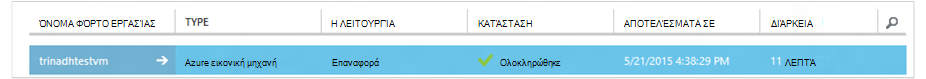

<properties
    pageTitle="Επαναφορά ενός εικονικές μηχανές από αντίγραφο ασφαλείας | Microsoft Azure"
    description="Μάθετε πώς μπορείτε να επαναφέρετε μια Azure εικονική μηχανή από ένα σημείο αποκατάστασης"
    services="backup"
    documentationCenter=""
    authors="trinadhk"
    manager="shreeshd"
    editor=""
    keywords="Επαναφορά αντιγράφου ασφαλείας; πώς μπορείτε να επαναφέρετε; σημείο αποκατάστασης;"/>

<tags
    ms.service="backup"
    ms.workload="storage-backup-recovery"
    ms.tgt_pltfrm="na"
    ms.devlang="na"
    ms.topic="article"
    ms.date="08/02/2016"
    ms.author="trinadhk; jimpark;"/>

# Επαναφορά εικονικές μηχανές στο Azure

> [AZURE.SELECTOR]
- [Επαναφορά ΣΠΣ στην πύλη του Azure](backup-azure-arm-restore-vms.md)
- [Επαναφορά ΣΠΣ στην πύλη κλασική](backup-azure-restore-vms.md)

Επαναφέρετε μια εικονική μηχανή σε μια νέα Εικονική από τα αντίγραφα ασφαλείας που είναι αποθηκευμένα σε μια Azure θάλαμο δημιουργίας αντιγράφων ασφαλείας με τα παρακάτω βήματα.

## Επαναφορά ροής εργασίας

### 1. Επιλέξτε ένα στοιχείο για να επαναφέρετε

1. Μεταβείτε στην καρτέλα **Προστασία στοιχείων** και επιλέξτε την εικονική μηχανή που θέλετε να επαναφέρετε μια νέα Εικονική.

    

    Στήλη **Σημείο αποκατάστασης** στη σελίδα **Προστατευμένη στοιχεία** θα σας ενημερώσει το πλήθος των σημείων ανάκτησης για μια εικονική μηχανή. Η στήλη **Σημείο αποκατάστασης νεότερο** σάς ενημερώνει την ώρα της πιο πρόσφατης αντιγράφου ασφαλείας από το οποίο μπορούν να αποκατασταθούν μια εικονική μηχανή.

2. Κάντε κλικ στην επιλογή **Επαναφορά** για να ανοίξετε τον οδηγό **Επαναφορά στοιχείου** .

    

### 2. Επιλέξτε ένα σημείο αποκατάστασης

1. Στην οθόνη **Επιλέξτε ένα σημείο αποκατάστασης** , μπορείτε να επαναφέρετε από το νεότερο σημείο αποκατάστασης ή από ένα προηγούμενο σημείο στο χρόνο. Η προεπιλεγμένη επιλογή επιλεγμένο, όταν ανοίγει ο οδηγός είναι *Νεότερο σημείο αποκατάστασης*.

    

2. Για να επιλέξετε μια προγενέστερη χρονική στιγμή, ενεργοποιήστε την επιλογή **Επιλέξτε ημερομηνία** στην αναπτυσσόμενη λίστα και επιλέξτε μια ημερομηνία στο στοιχείο ελέγχου ημερολογίου, κάνοντας κλικ στο **εικονίδιο ημερολογίου**. Στο στοιχείο ελέγχου, όλες οι ημερομηνίες που διαθέτουν σημεία ανάκτησης έχουν συμπληρωθεί με μια απλή σκίαση γκρι και έχουν δυνατότητα επιλογής από το χρήστη.

    

    Αφού κάνετε κλικ σε μια ημερομηνία στο στοιχείο ελέγχου ημερολογίου, την ανάκτηση σημείων διαθέσιμα σε ότι ημερομηνία θα εμφανίζονται στο αποκατάστασης σημεία στον παρακάτω πίνακα. Η στήλη **ώρα** υποδεικνύει την ώρα κατά την οποία πραγματοποιήθηκε το στιγμιότυπο. Στη στήλη **Τύπος** εμφανίζει τη [συνέπεια](https://azure.microsoft.com/documentation/articles/backup-azure-vms/#consistency-of-recovery-points) του σημείου αποκατάστασης. Κεφαλίδα πίνακα εμφανίζει τον αριθμό των σημείων αποκατάστασης που είναι διαθέσιμες για τη συγκεκριμένη ημέρα σε παρενθέσεις.

    

3. Επιλέξτε το σημείο αποκατάστασης από τον πίνακα **Αποκατάστασης σημεία** και κάντε κλικ στο επόμενο βέλος για να μεταβείτε στην επόμενη οθόνη.

### 3. Καθορίστε μια θέση προορισμού

1. Στην οθόνη **Επιλέξτε επαναφορά παρουσία** Καθορίστε λεπτομέρειες του πού μπορείτε να επαναφέρετε την εικονική μηχανή.

  - Καθορίστε το όνομα εικονική μηχανή: σε μια υπηρεσία cloud που δίνεται, το όνομα εικονική μηχανή πρέπει να είναι μοναδικό. Δεν υποστηρίζουμε υπερ-γράφετε υπάρχοντα Εικονική. 
  - Επιλέξτε μια υπηρεσία στο cloud για την εικονική Μηχανή: αυτό είναι υποχρεωτική για να δημιουργήσετε μια Εικονική. Μπορείτε να επιλέξετε για να χρησιμοποιήσετε μια υπάρχουσα υπηρεσία cloud ή να δημιουργήσετε μια νέα υπηρεσία στο cloud.

        Whatever cloud service name is picked should be globally unique. Typically, the cloud service name gets associated with a public-facing URL in the form of [cloudservice].cloudapp.net. Azure will not allow you to create a new cloud service if the name has already been used. If you choose to create select create a new cloud service, it will be given the same name as the virtual machine – in which case the VM name picked should be unique enough to be applied to the associated cloud service.

        We only display cloud services and virtual networks that are not associated with any affinity groups in the restore instance details. [Learn More](../virtual-network/virtual-networks-migrate-to-regional-vnet.md).

2. Επιλέξτε ένα λογαριασμό του χώρου αποθήκευσης για την εικονική Μηχανή: αυτό είναι υποχρεωτική για τη δημιουργία του Εικονική. Μπορείτε να επιλέξετε από υπαρχόντων λογαριασμών χώρου αποθήκευσης στην ίδια περιοχή ως το θάλαμο Azure δημιουργίας αντιγράφων ασφαλείας. Δεν υποστηρίζουμε λογαριασμούς χώρου αποθήκευσης που είναι ζώνη πλεονάζοντα ή τύπου χώρου αποθήκευσης Premium.

    Εάν υπάρχουν λογαριασμοί χώρου αποθήκευσης με υποστηρίζεται η ρύθμιση παραμέτρων, δημιουργήστε ένα λογαριασμό χώρου αποθήκευσης της υποστηρίζεται η ρύθμιση παραμέτρων πριν από την έναρξη λειτουργία επαναφοράς.

    

3. Επιλέξτε ένα εικονικό δίκτυο: πρέπει να επιλεγεί το εικονικό δίκτυο (VNET) για την εικονική μηχανή την ώρα δημιουργίας του Εικονική. Επαναφορά περιβάλλοντος εργασίας Χρήστη εμφανίζει όλα τα VNETs μέσα σε αυτήν τη συνδρομή που μπορούν να χρησιμοποιηθούν. Δεν είναι υποχρεωτικό για να επιλέξετε μια VNET για την επαναφορά εικονική Μηχανή – θα μπορείτε να συνδεθείτε με την επαναφέρει εικονική μηχανή μέσω του internet, ακόμα και αν δεν εφαρμόζεται το VNET.

    Εάν η υπηρεσία cloud που επιλέξατε έχει συσχετιστεί με ένα εικονικό δίκτυο και, στη συνέχεια, δεν μπορείτε να αλλάξετε το εικονικό δίκτυο.

    

4. Επιλέξτε ένα υποδίκτυο: σε περίπτωση που το VNET έχει δευτερεύοντα δίκτυα, από προεπιλογή το πρώτο υποδίκτυο θα είναι επιλεγμένη. Επιλέξτε το υποδίκτυο της επιλογής σας από το αναπτυσσόμενο μενού επιλογές. Για λεπτομέρειες υποδίκτυο, μεταβείτε για να δίκτυα επέκταση στην [αρχική σελίδα πύλης](https://manage.windowsazure.com/), επιλέξτε διαδοχικά **Εικονικών δικτύων** και επιλέξτε το εικονικό δίκτυο και Διερεύνηση σε ρύθμιση παραμέτρων για να δείτε λεπτομέρειες υποδικτύου.

    

5. Κάντε κλικ στο εικονίδιο **Υποβολή** στον οδηγό για να υποβάλετε τις λεπτομέρειες και να δημιουργήσετε μια εργασία επαναφοράς.

## Παρακολούθηση τη λειτουργία επαναφοράς
Αφού εισαγάγετε όλες τις πληροφορίες στον Οδηγό επαναφορά και υποβάλετε Azure δημιουργίας αντιγράφων ασφαλείας θα προσπαθήσει να δημιουργήσετε μια εργασία για να παρακολουθείτε τη λειτουργία επαναφοράς.

Εάν η δημιουργία εργασίας είναι επιτυχής, θα δείτε μια ειδοποίηση αναδυόμενη που υποδεικνύει ότι η εργασία έχει δημιουργηθεί. Μπορείτε να λάβετε περισσότερες λεπτομέρειες, κάνοντας κλικ στο κουμπί **Προβολή έργου** που θα σας μεταφέρουν σε καρτέλα **εργασίες** .

Μόλις ολοκληρωθεί η διαδικασία επαναφοράς, θα επισημανθεί ως ολοκληρωμένη στην καρτέλα **εργασίες** .

Μετά την επαναφορά η εικονική μηχανή ίσως χρειαστεί να εγκαταστήσετε ξανά τις επεκτάσεις υπάρχουσες στην αρχική Εικονική και [τροποποιήστε τα τελικά σημεία](../virtual-machines/virtual-machines-windows-classic-setup-endpoints.md) για την εικονική μηχανή στην πύλη του Azure.

## Επαναφορά των βήματα
Εάν χρησιμοποιείτε μια κατανομή με βάση την cloud προετοιμασία Linux όπως Ubuntu, για λόγους ασφαλείας, τον κωδικό πρόσβασης θα αποκλειστούν δημοσίευση επαναφορά. Χρησιμοποιήστε την επέκταση VMAccess σε την επαναφέρει εικονική Μηχανή για να [επαναφέρετε τον κωδικό πρόσβασης](../virtual-machines/virtual-machines-linux-classic-reset-access.md). Συνιστάται να χρησιμοποιείτε πλήκτρα SSH σε αυτές τις κατανομές για να αποφύγετε την επαναφορά επαναφορά κωδικού πρόσβασης δημοσίευση. 

## Δημιουργία αντιγράφων ασφαλείας για επαναφορά ΣΠΣ
Εάν έχετε επαναφέρει Εικονική στην ίδια υπηρεσία cloud με το ίδιο όνομα όπως ήταν αρχικά αντίγραφα ασφαλείας Εικονική, δημιουργία αντιγράφων ασφαλείας θα συνεχίσει στη δημοσίευση επαναφορά Εικονική. Εάν έχετε είτε ανακτηθεί εικονική σε μια υπηρεσία cloud διαφορετικές ή που καθορίζονται σε ένα διαφορετικό όνομα για επαναφορά Εικονική, αυτό θα αντιμετωπίζεται ως μια νέα Εικονική και πρέπει να ρύθμισης δημιουργίας αντιγράφων ασφαλείας για επαναφορά Εικονική.

## Επαναφορά μια Εικονική κατά τη διάρκεια Azure καταστροφής κέντρο δεδομένων
Azure αντίγραφο ασφαλείας επιτρέπει την επαναφορά αντίγραφα ασφαλείας ΣΠΣ με το Κέντρο ζεύγη δεδομένων, σε περίπτωση που τα πρωτεύοντα δεδομένα κέντρο όπου ΣΠΣ εκτελούνται από καταστροφή εμπειρίες και έχετε ρυθμίσει τις παραμέτρους θάλαμο αντίγραφο ασφαλείας παν περιττό. Κατά τη διάρκεια αυτές τις περιπτώσεις, θα πρέπει να επιλέξετε ένα λογαριασμό χώρου αποθήκευσης που είναι παρόντες σε κέντρο ζεύγη δεδομένων και υπόλοιπη διαδικασία επαναφοράς παραμένει ίδια. Azure δημιουργίας αντιγράφων ασφαλείας χρησιμοποιεί υπηρεσία υπολογισμού από ζεύγη παν για να δημιουργήσετε την επαναφέρει εικονική μηχανή. 

## Επαναφορά ΣΠΣ ελεγκτή τομέα
Δημιουργία αντιγράφου ασφαλείας του ελεγκτή τομέα (Συνεχούς) εικονικές μηχανές είναι σενάριο υποστηρίζεται με αντίγραφα ασφαλείας Azure. Ωστόσο, ορισμένες περίθαλψη πρέπει να λαμβάνονται κατά τη διαδικασία επαναφοράς. Η εμπειρία επαναφορά είναι σημαντικά διαφορετική για ΣΠΣ ελεγκτή τομέα σε μια ρύθμιση παραμέτρων ενός Συνεχούς έναντι ΣΠΣ σε μια ρύθμιση παραμέτρων πολλών-ελεγκτή Τομέα.

### Μεμονωμένο ελεγκτή Τομέα
Η Εικονική μπορούν να αποκατασταθούν (όπως άλλες Εικονική) από το Azure πύλης ή χρήση του PowerShell.

### Πολλές ελεγκτές τομέα
Όταν έχετε ένα περιβάλλον πολλαπλών Συνεχούς, οι ελεγκτές τομέα έχουν τις δικές τους έτσι ώστε να παραμείνει σε συγχρονισμό δεδομένων. Όταν ένα σημείο παλαιότερων αντιγράφων ασφαλείας επαναφέρει *χωρίς τις κατάλληλες προφυλάξεις*, διαδικασία επαναφοράς του USN να wreak χάος σε ένα περιβάλλον πολλαπλών-ελεγκτή Τομέα. Τον σωστό τρόπο για να ανακτήσετε μια εικονική Μηχανή είναι να κάνετε εκκίνηση του σε κατάσταση λειτουργίας DSRM.

Το δύσκολο προκύπτει επειδή δεν υπάρχει στο Azure DSRM λειτουργία. Επομένως, για να επαναφέρετε μια εικονική Μηχανή, δεν μπορείτε να χρησιμοποιήσετε την πύλη του Azure. Το μόνο υποστηριζόμενο επαναφορά μηχανισμός είναι επαναφορά που βασίζεται σε δίσκο και χρήση του PowerShell.

>[AZURE.WARNING] Για ΣΠΣ ελεγκτή τομέα σε ένα περιβάλλον πολλαπλών Συνεχούς, μην χρησιμοποιείτε την πύλη του Azure για επαναφορά! Υποστηρίζεται μόνο PowerShell βάσει επαναφοράς

Διαβάστε περισσότερα σχετικά με το [πρόβλημα επαναφορά USN](https://technet.microsoft.com/library/dd363553) και τις στρατηγικές που προτείνονται για να διορθώσετε το πρόβλημα.

## Επαναφορά ΣΠΣ με ρυθμίσεις παραμέτρων ειδική δικτύου
Azure δημιουργίας αντιγράφων ασφαλείας υποστηρίζει δημιουργίας αντιγράφων ασφαλείας για παρακολούθηση ρυθμίσεις παραμέτρων ειδική δικτύου του εικονικές μηχανές.

- ΣΠΣ στην περιοχή εξισορρόπηση φόρτου (εσωτερικές και εξωτερικές)
- ΣΠΣ με πολλές διευθύνσεις IP δεσμευμένες
- ΣΠΣ με πολλά NIC

Αυτές οι ρυθμίσεις παραμέτρων αναθέτουν παρακάτω ζητήματα κατά την επαναφορά τους.

>[AZURE.TIP] Χρησιμοποιήστε PowerShell βάσει Επαναφορά ροής για να αναδημιουργήσετε τη ρύθμιση παραμέτρων δικτύου ειδική ΣΠΣ δημοσίευση επαναφορά.

### Επαναφορά από το περιβάλλον εργασίας Χρήστη:
Κατά την επαναφορά από το περιβάλλον εργασίας Χρήστη, **Επιλέξτε πάντα μια νέα υπηρεσία στο cloud**. Έχετε υπόψη ότι εφόσον πύλη χρειάζονται μόνο υποχρεωτικό παραμέτρους κατά τη διάρκεια της επαναφοράς ροής, ΣΠΣ επαναφορά με χρήση του περιβάλλοντος εργασίας Χρήστη θα χάσετε τη ρύθμιση παραμέτρων ειδική δικτύου που διαθέτουν. Με άλλα λόγια, επαναφορά ΣΠΣ θα είναι κανονική ΣΠΣ χωρίς ρύθμιση παραμέτρων της εξισορρόπηση φόρτου ή πολλούς NIC ή πολλών δεσμευμένη διεύθυνση IP.

### Επαναφορά από PowerShell:
PowerShell έχει τη δυνατότητα να επαναφέρετε μόνο των δίσκων Εικονική από αντίγραφο ασφαλείας και δεν δημιουργήσετε η εικονική μηχανή. Αυτό είναι χρήσιμο κατά την επαναφορά εικονικές μηχανές που απαιτούν ειδική δικτύου ρυθμίσεις παραμέτρων mentined παραπάνω.

Για να αναδημιουργήσετε πλήρως εικονική μηχανή επαναφορά δίσκων δημοσίευση, ακολουθήστε τα παρακάτω βήματα:

1. Επαναφορά των δίσκων από αντιγράφου ασφαλείας θάλαμο χρησιμοποιώντας το [PowerShell αντιγράφου ασφαλείας Azure](../backup-azure-vms-classic-automation.md#restore-an-azure-vm)

2. Δημιουργία του config Εικονική που απαιτείται για την εξισορρόπηση φόρτου / πολλών NIC/πολλαπλάσιο δεσμευμένη διεύθυνση IP χρησιμοποιώντας το cmdlet του PowerShell και χρησιμοποιήστε το για να δημιουργήσετε την εικονική Μηχανή της επιθυμητοί ρύθμισης παραμέτρων.
    - Δημιουργία Εικονική σε μια υπηρεσία cloud με το [εσωτερικό εξισορρόπηση φόρτου](https://azure.microsoft.com/documentation/articles/load-balancer-internal-getstarted/)
    - Δημιουργία Εικονική για να συνδεθείτε [Internet αντικριστές εξισορρόπηση φόρτου] (https://azure.microsoft.com/en-us/documentation/articles/load-balancer-internet-getstarted/)
    - Δημιουργία Εικονική με [πολλά NIC](https://azure.microsoft.com/documentation/articles/virtual-networks-multiple-nics/)
    - Δημιουργία Εικονική με [πολλές διευθύνσεις IP δεσμευμένες](https://azure.microsoft.com/documentation/articles/virtual-networks-reserved-public-ip/)

## Επόμενα βήματα
- [Αντιμετώπιση σφαλμάτων](backup-azure-vms-troubleshoot.md#restore)
- [Διαχείριση εικονικές μηχανές](backup-azure-manage-vms.md)
