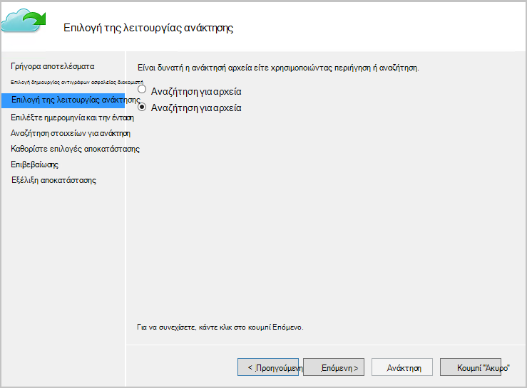

<properties
   pageTitle="Επαναφορά δεδομένων σε Windows Server ή το πρόγραμμα-πελάτη των Windows από το Azure χρησιμοποιώντας το μοντέλο ανάπτυξης διαχείρισης πόρων | Microsoft Azure"
   description="Μάθετε πώς μπορείτε να επαναφέρετε από το πρόγραμμα-πελάτη των Windows ή Windows Server."
   services="backup"
   documentationCenter=""
   authors="saurabhsensharma"
   manager="shivamg"
   editor=""/>

<tags
   ms.service="backup"
   ms.workload="storage-backup-recovery"
     ms.tgt_pltfrm="na"
     ms.devlang="na"
     ms.topic="article"
     ms.date="08/02/2016"
     ms.author="trinadhk; jimpark; markgal;"/>

# Επαναφορά των αρχείων σε ένα διακομιστή των Windows ή Windows υπολογιστή-πελάτη με χρήση μοντέλο ανάπτυξης για τη διαχείριση πόρων

> [AZURE.SELECTOR]
- [Πύλη του Azure](backup-azure-restore-windows-server.md)
- [Κλασική πύλη](backup-azure-restore-windows-server-classic.md)

Αυτό το άρθρο περιγράφει τα βήματα που απαιτούνται για την εκτέλεση δύο τύπους λειτουργιών για επαναφορά:

- Επαναφορά δεδομένων στον ίδιο υπολογιστή από την οποία ελήφθησαν τα αντίγραφα ασφαλείας.
- Επαναφορά δεδομένων σε άλλον υπολογιστή.

Και στις δύο περιπτώσεις, ανάκτηση των δεδομένων από το Azure υπηρεσίες ανάκτησης θάλαμο.

[AZURE.INCLUDE [learn-about-deployment-models](../../includes/learn-about-deployment-models-rm-include.md)]μοντέλο κλασική ανάπτυξης.

## Ανάκτηση δεδομένων στον ίδιο υπολογιστή
Εάν κατά λάθος ένα αρχείο διαγραφεί και θέλετε να το επαναφέρετε στον ίδιο υπολογιστή (από την οποία πραγματοποιήθηκε η δημιουργία αντιγράφων ασφαλείας), ακολουθήστε τα παρακάτω βήματα θα σας βοηθήσει να ανακτήσετε τα δεδομένα.

1. Ανοίξτε το **Αντίγραφο ασφαλείας του Microsoft Azure** Συγκράτηση σε.
2. Κάντε κλικ στην επιλογή **Ανάκτηση δεδομένων** για να ξεκινήσετε τη ροή εργασίας.

    

3. Επιλέξτε το * *αυτόν το διακομιστή (*yourmachinename*) ** την επιλογή για να επαναφέρετε το αντίγραφο ασφαλείας του αρχείου στον ίδιο υπολογιστή.

    

4. Επιλέξτε **Αναζήτηση για αρχεία** ή να **εκτελέσετε αναζήτηση για τα αρχεία**.

    Αφήστε την προεπιλεγμένη επιλογή εάν σκοπεύετε να επαναφέρετε ένα ή περισσότερα αρχεία των οποίων η διαδρομή είναι γνωστή. Εάν δεν είστε βέβαιοι σχετικά με τη δομή του φακέλου, αλλά θα θέλατε να αναζητήσετε ένα αρχείο, ορίστε την επιλογή **Αναζήτηση για τα αρχεία** . Για αυτήν την ενότητα, θα συνεχίσουμε με την προεπιλεγμένη επιλογή.

    

5. Επιλέξτε την ένταση ήχου από την οποία θέλετε να επαναφέρετε το αρχείο.

    Μπορείτε να επαναφέρετε από οποιοδήποτε σημείο στο χρόνο. Ημερομηνίες που εμφανίζονται σε **έντονη γραφή** στο στοιχείο ελέγχου ημερολογίου υποδεικνύουν τη διαθεσιμότητα ενός σημείου επαναφοράς. Όταν είναι επιλεγμένη μια ημερομηνία, με βάση το χρονοδιάγραμμα δημιουργίας αντιγράφων ασφαλείας (και την επιτυχία της μια λειτουργία δημιουργίας αντιγράφων ασφαλείας), μπορείτε να επιλέξετε ένα σημείο στο χρόνο από το αναπτυσσόμενο μενού **χρόνου** προς τα κάτω.

    

6. Επιλέξτε τα στοιχεία προς ανάκτηση. Μπορείτε να επιλέξετε πολλές/αρχεία φακέλων που θέλετε να επαναφέρετε.

    

7. Καθορίστε τις παραμέτρους αποκατάστασης.

    

  - Θα έχετε τη δυνατότητα επαναφοράς στην αρχική θέση (με την οποία το αρχείο/φάκελος θα είναι δυνατή η αντικατάστασή) ή σε άλλη θέση στο ίδιο υπολογιστή.
  - Εάν το αρχείο/φάκελος που θέλετε να επαναφέρετε υπάρχει στη θέση προορισμού, μπορείτε να δημιουργήσετε αντίγραφα (δύο εκδόσεις του ίδιου αρχείου), να αντικαταστήσετε τα αρχεία στη θέση προορισμού ή να παραλείψετε την ανάκτηση των αρχείων που υπάρχουν στο προορισμού.
  - Συνιστάται να αφήσετε την προεπιλεγμένη επιλογή επαναφοράς των ACL με τα αρχεία που έχουν την ανάκτηση.

8. Μόλις παρέχονται αυτά τα στοιχεία εισόδου, κάντε κλικ στο κουμπί **Επόμενο**. Η ροή εργασίας ανάκτησης, το οποίο επαναφέρει τα αρχεία σε αυτόν τον υπολογιστή, θα ξεκινήσει.

## Ανάκτηση σε εναλλασσόμενες υπολογιστή
Αν χαθεί ολόκληρο το διακομιστή σας, μπορείτε να το επαναφέρετε δεδομένα από αντίγραφο ασφαλείας Azure σε άλλον υπολογιστή. Ακολουθήστε τα παρακάτω βήματα περιγράφουν τη ροή εργασίας.  

Περιλαμβάνει την ορολογία που χρησιμοποιείται σε αυτά τα βήματα:

- *Μηχανή προέλευσης* – τον αρχικό υπολογιστή από την οποία πραγματοποιήθηκε η δημιουργία αντιγράφων ασφαλείας και που είναι διαθέσιμη αυτήν τη στιγμή.
- *Υπολογιστή προορισμού* – υπολογιστή στον οποίο γίνεται ανάκτηση των δεδομένων.
- *Δείγμα θάλαμο* – θάλαμο το υπηρεσίες ανάκτησης που στην οποία έχετε καταχωρήσει στον *υπολογιστή προέλευσης* και *προορισμού υπολογιστή* .  

> [AZURE.NOTE] Είναι δυνατή η επαναφορά αντιγράφων ασφαλείας που λαμβάνονται από έναν υπολογιστή σε έναν υπολογιστή που εκτελεί μια παλαιότερη έκδοση του λειτουργικού συστήματος. Για παράδειγμα, εάν αντίγραφα ασφαλείας λαμβάνονται από έναν υπολογιστή Windows 7, μπορεί να γίνει επαναφορά σε ένα Windows 8 ή επάνω από τον υπολογιστή. Ωστόσο το το αντίστροφο δεν έχει τιμή true.

1. Ανοίξτε το **Αντίγραφο ασφαλείας του Microsoft Azure** Συγκράτηση σε στον *υπολογιστή προορισμού*.
2. Βεβαιωθείτε ότι έχετε καταχωρήσει *υπολογιστή προορισμού* και η *μηχανή προέλευσης* για το ίδιο θάλαμο υπηρεσίες ανάκτησης.
3. Κάντε κλικ στην επιλογή **Ανάκτηση δεδομένων** για να ξεκινήσετε τη ροή εργασίας.

    

4. Επιλέξτε **έναν άλλο διακομιστή**

    

5. Δώστε το αρχείο διαπιστευτηρίων θάλαμο που αντιστοιχεί με το *δείγμα θάλαμο*. Εάν το αρχείο διαπιστευτηρίων θάλαμο δεν είναι έγκυρη (ή έχει λήξει) κάντε λήψη ενός νέου αρχείου διαπιστευτηρίων θάλαμο από το *δείγμα θάλαμο* στην πύλη του Azure. Όταν το αρχείο διαπιστευτηρίων θάλαμο παρέχεται, εμφανίζεται το θάλαμο υπηρεσίες ανάκτησης σε σχέση με το αρχείο διαπιστευτηρίων θάλαμο.

6. Επιλέξτε το *μηχανή προέλευσης* από τη λίστα των εμφανιζόμενη μηχανές.

    

7. Ορίστε την επιλογή είτε την **Αναζήτηση για αρχεία** ή **Πραγματοποιήστε αναζήτηση για αρχεία** . Για αυτήν την ενότητα, θα χρησιμοποιήσουμε την επιλογή **Αναζήτηση για τα αρχεία** .

    

8. Στην επόμενη οθόνη, επιλέξτε την ημερομηνία και την ένταση. Αναζήτηση για το όνομα φακέλου/αρχείου που θέλετε να επαναφέρετε.

    

9. Επιλέξτε τη θέση όπου τα αρχεία πρέπει να γίνει επαναφορά.

    

10. Δώστε τη φράση πρόσβασης κρυπτογράφησης που σας δόθηκε κατά την εγγραφή *του υπολογιστή προέλευσης* *δείγμα θάλαμο*.

    

11. Όταν παρέχεται η εισαγωγή δεδομένων, κάντε κλικ στην επιλογή **Ανάκτηση**, που ενεργοποιεί την επαναφορά των αντίγραφα ασφαλείας των αρχείων στον προορισμό που παρέχονται.

## Επόμενα βήματα
- Τώρα που που έχετε ανάκτησης αρχεία και φακέλους, μπορείτε να [διαχειριστείτε τα αντίγραφα ασφαλείας](backup-azure-manage-windows-server.md).
