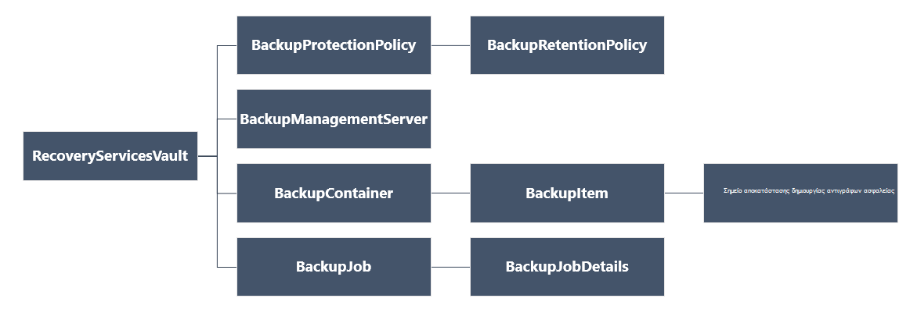

<properties
   pageTitle="Ανάπτυξη και να διαχειριστείτε αντίγραφα ασφαλείας για διαχείριση πόρων αναπτυχθεί ΣΠΣ χρήση του PowerShell | Microsoft Azure"
   description="Χρήση του PowerShell για να αναπτύξετε και να διαχειριστείτε αντίγραφα ασφαλείας σε Azure για ΣΠΣ αναπτυχθεί από διαχειριστή πόρων"
   services="backup"
   documentationCenter=""
   authors="markgalioto"
   manager="cfreeman"
   editor=""/>

<tags
   ms.service="backup"
   ms.devlang="na"
   ms.topic="article"
   ms.tgt_pltfrm="na"
   ms.workload="storage-backup-recovery"
   ms.date="08/03/2016"
   ms.author="markgal; trinadhk"/>

# <a name="deploy-and-manage-backups-for-resource-manager-deployed-vms-using-powershell"></a>Ανάπτυξη και να διαχειριστείτε αντίγραφα ασφαλείας για διαχείριση πόρων αναπτυχθεί ΣΠΣ χρήση του PowerShell

> [AZURE.SELECTOR]
- [Διαχείριση πόρων](backup-azure-vms-automation.md)
- [Κλασικό](backup-azure-vms-classic-automation.md)

Σε αυτό το άρθρο σάς δείχνει πώς μπορείτε να χρησιμοποιήσετε το cmdlet του Azure PowerShell δημιουργίας αντιγράφων ασφαλείας και επαναφορά μια εικονική μηχανή Azure (Εικονική) από ένα θάλαμο υπηρεσίες ανάκτησης. Ένα θάλαμο υπηρεσίες ανάκτησης είναι ένας πόρος για τη διαχείριση πόρων Azure και χρησιμοποιείται για την προστασία δεδομένων και περιουσιακών στοιχείων στις υπηρεσίες του Azure δημιουργίας αντιγράφων ασφαλείας και Επαναφορά τοποθεσίας Azure. Μπορείτε να χρησιμοποιήσετε ένα θάλαμο υπηρεσίες ανάκτησης για να προστατεύσετε αναπτυχθεί Azure Service Manager ΣΠΣ, καθώς και διαχείριση πόρων Azure αναπτυχθεί ΣΠΣ.

>[AZURE.NOTE] Azure περιλαμβάνει δύο μοντέλων ανάπτυξης για τη δημιουργία και εργασία με πόρους: [Διαχείριση πόρων και κλασική](../resource-manager-deployment-model.md). Σε αυτό το άρθρο προορίζονται για χρήση με ΣΠΣ που δημιουργούνται με χρήση του μοντέλου από διαχειριστή πόρων.

Σε αυτό το άρθρο σάς καθοδηγεί σε χρήση του PowerShell για να προστατέψετε μια Εικονική και να επαναφέρετε τα δεδομένα από ένα σημείο αποκατάστασης.

## <a name="concepts"></a>Έννοιες

Εάν δεν είστε εξοικειωμένοι με την υπηρεσία Azure αντίγραφο ασφαλείας, για μια επισκόπηση της υπηρεσίας, ανατρέξτε στο θέμα [Τι είναι το αντίγραφο ασφαλείας Azure;](backup-introduction-to-azure-backup.md) Πριν ξεκινήσετε, βεβαιωθείτε ότι καλύπτετε τα βασικά στοιχεία σχετικά με τις προϋποθέσεις που απαιτείται για την εργασία με Azure δημιουργίας αντιγράφων ασφαλείας και τους περιορισμούς της τρέχουσας λύσης δημιουργίας αντιγράφων ασφαλείας Εικονική.

Για να αποτελεσματική χρήση του PowerShell, είναι απαραίτητο να κατανοήσετε την ιεραρχία των αντικειμένων και από πού θα ξεκινήσετε.



Για να προβάλετε την αναφορά AzureRmRecoveryServicesBackup PowerShell cmdlet, ανατρέξτε στο θέμα το [Αντίγραφο ασφαλείας Azure - cmdlet για υπηρεσίες ανάκτησης](https://msdn.microsoft.com/library/mt723320.aspx) στη βιβλιοθήκη του Azure.
Για να προβάλετε την αναφορά AzureRmRecoveryServicesVault PowerShell cmdlet, ανατρέξτε στα [Cmdlet υπηρεσιών Azure αποκατάστασης](https://msdn.microsoft.com/library/mt643905.aspx).


## <a name="setup-and-registration"></a>Εγκατάσταση και καταχώρηση

Για να ξεκινήσετε:

1. [Λήψη πιο πρόσφατη έκδοση του PowerShell](https://github.com/Azure/azure-powershell/releases) (είναι η ελάχιστη έκδοση απαιτείται: 1.4.0)

2. Βρείτε το cmdlet του PowerShell αντίγραφο ασφαλείας Azure διαθέσιμη, πληκτρολογώντας την ακόλουθη εντολή:

```
PS C:\> Get-Command *azurermrecoveryservices*

CommandType     Name                                               Version    Source
-----------     ----                                               -------    ------
Cmdlet          Backup-AzureRmRecoveryServicesBackupItem           1.4.0      AzureRM.RecoveryServices.Backup
Cmdlet          Disable-AzureRmRecoveryServicesBackupProtection    1.4.0      AzureRM.RecoveryServices.Backup
Cmdlet          Enable-AzureRmRecoveryServicesBackupProtection     1.4.0      AzureRM.RecoveryServices.Backup
Cmdlet          Get-AzureRmRecoveryServicesBackupContainer         1.4.0      AzureRM.RecoveryServices.Backup
Cmdlet          Get-AzureRmRecoveryServicesBackupItem              1.4.0      AzureRM.RecoveryServices.Backup
Cmdlet          Get-AzureRmRecoveryServicesBackupJob               1.4.0      AzureRM.RecoveryServices.Backup
Cmdlet          Get-AzureRmRecoveryServicesBackupJobDetails        1.4.0      AzureRM.RecoveryServices.Backup
Cmdlet          Get-AzureRmRecoveryServicesBackupManagementServer  1.4.0      AzureRM.RecoveryServices.Backup
Cmdlet          Get-AzureRmRecoveryServicesBackupProperties        1.4.0      AzureRM.RecoveryServices
Cmdlet          Get-AzureRmRecoveryServicesBackupProtectionPolicy  1.4.0      AzureRM.RecoveryServices.Backup
Cmdlet          Get-AzureRMRecoveryServicesBackupRecoveryPoint     1.4.0      AzureRM.RecoveryServices.Backup
Cmdlet          Get-AzureRmRecoveryServicesBackupRetentionPolic... 1.4.0      AzureRM.RecoveryServices.Backup
Cmdlet          Get-AzureRmRecoveryServicesBackupSchedulePolicy... 1.4.0      AzureRM.RecoveryServices.Backup
Cmdlet          Get-AzureRmRecoveryServicesVault                   1.4.0      AzureRM.RecoveryServices
Cmdlet          Get-AzureRmRecoveryServicesVaultSettingsFile       1.4.0      AzureRM.RecoveryServices
Cmdlet          New-AzureRmRecoveryServicesBackupProtectionPolicy  1.4.0      AzureRM.RecoveryServices.Backup
Cmdlet          New-AzureRmRecoveryServicesVault                   1.4.0      AzureRM.RecoveryServices
Cmdlet          Remove-AzureRmRecoveryServicesProtectionPolicy     1.4.0      AzureRM.RecoveryServices.Backup
Cmdlet          Remove-AzureRmRecoveryServicesVault                1.4.0      AzureRM.RecoveryServices
Cmdlet          Restore-AzureRMRecoveryServicesBackupItem          1.4.0      AzureRM.RecoveryServices.Backup
Cmdlet          Set-AzureRmRecoveryServicesBackupProperties        1.4.0      AzureRM.RecoveryServices
Cmdlet          Set-AzureRmRecoveryServicesBackupProtectionPolicy  1.4.0      AzureRM.RecoveryServices.Backup
Cmdlet          Set-AzureRmRecoveryServicesVaultContext            1.4.0      AzureRM.RecoveryServices
Cmdlet          Stop-AzureRmRecoveryServicesBackupJob              1.4.0      AzureRM.RecoveryServices.Backup
Cmdlet          Unregister-AzureRmRecoveryServicesBackupContainer  1.4.0      AzureRM.RecoveryServices.Backup
Cmdlet          Unregister-AzureRmRecoveryServicesBackupManagem... 1.4.0      AzureRM.RecoveryServices.Backup
Cmdlet          Wait-AzureRmRecoveryServicesBackupJob              1.4.0      AzureRM.RecoveryServices.Backup
```


Μπορεί να γίνει αυτόματα τις εξής εργασίες με το PowerShell:

- Δημιουργήστε ένα θάλαμο υπηρεσίες ανάκτησης
- Δημιουργία αντιγράφων ασφαλείας ή να προστατεύσετε ΣΠΣ Azure
- Ενεργοποίηση μιας εργασίας δημιουργίας αντιγράφων ασφαλείας
- Παρακολούθηση μιας εργασίας δημιουργίας αντιγράφων ασφαλείας
- Επαναφορά Azure Εικονική μηχανή

## <a name="create-a-recovery-services-vault"></a>Δημιουργήστε ένα θάλαμο υπηρεσίες ανάκτησης

Τα παρακάτω βήματα σας καθοδηγεί στη δημιουργία ενός θάλαμο υπηρεσίες ανάκτησης. Ένα θάλαμο υπηρεσίες ανάκτησης είναι διαφορετικό από ένα αντίγραφο ασφαλείας θάλαμο.

1. Εάν χρησιμοποιείτε το αντίγραφο ασφαλείας Azure για πρώτη φορά, πρέπει να χρησιμοποιήσετε το cmdlet **[Register-AzureRMResourceProvider](https://msdn.microsoft.com/library/mt679020.aspx)** για την καταχώρηση της υπηρεσίας ανάκτησης Azure παροχής με τη συνδρομή σας.

    ```
    PS C:\> Register-AzureRmResourceProvider -ProviderNamespace "Microsoft.RecoveryServices"
    ```

2. Το θάλαμο υπηρεσίες ανάκτησης είναι ένας πόρος για τη διαχείριση πόρων, ώστε να πρέπει να το τοποθετήσετε μέσα σε μια ομάδα πόρων. Μπορείτε να χρησιμοποιήσετε μια υπάρχουσα ομάδα πόρων, ή να δημιουργήσετε μια νέα ομάδα πόρων με το cmdlet **[New-AzureRmResourceGroup](https://msdn.microsoft.com/library/mt678985.aspx)** . Κατά τη δημιουργία νέας ομάδας πόρων, καθορίστε το όνομα και τη θέση για την ομάδα πόρων.  

    ```
    PS C:\> New-AzureRmResourceGroup –Name "test-rg" –Location "West US"
    ```

3. Χρησιμοποιήστε το cmdlet **[New-AzureRmRecoveryServicesVault](https://msdn.microsoft.com/library/mt643910.aspx)** για να δημιουργήσετε το νέο θάλαμο. Φροντίστε να καθορίσετε στην ίδια θέση για το θάλαμο όπως που χρησιμοποιήθηκε για την ομάδα πόρων.

    ```
    PS C:\> New-AzureRmRecoveryServicesVault -Name "testvault" -ResourceGroupName " test-rg" -Location "West US"
    ```

4. Καθορίστε τον τύπο του χώρου αποθήκευσης πλεονασμού να χρησιμοποιήσετε. Μπορείτε να χρησιμοποιήσετε [Τοπικά πλεονάζοντα χώρο αποθήκευσης (LRS)](../storage/storage-redundancy.md#locally-redundant-storage) ή [Παν πλεονάζοντα χώρο αποθήκευσης Εξοπλισμό](../storage/storage-redundancy.md#geo-redundant-storage). Το παρακάτω παράδειγμα εμφανίζει την επιλογή - BackupStorageRedundancy testVault έχει οριστεί σε GeoRedundant.

    ```
    PS C:\> $vault1 = Get-AzureRmRecoveryServicesVault –Name "testVault"
    PS C:\> Set-AzureRmRecoveryServicesBackupProperties  -Vault $vault1 -BackupStorageRedundancy GeoRedundant
    ```

    > [AZURE.TIP] Cmdlet για πολλά αντίγραφα ασφαλείας Azure απαιτούν το αντικείμενο θάλαμο υπηρεσίες ανάκτησης ως εισαγωγή. Για αυτόν το λόγο, είναι εύκολο να αποθηκεύσετε το αντικείμενο θάλαμο υπηρεσίες ανάκτησης αντίγραφα ασφαλείας σε μεταβλητή.

## <a name="view-the-vaults-in-a-subscription"></a>Προβολή του χώροι φύλαξης σε μια συνδρομή
Χρησιμοποιήστε **[Get-AzureRmRecoveryServicesVault](https://msdn.microsoft.com/library/mt643907.aspx)** για να προβάλετε τη λίστα των όλα χώροι φύλαξης στην τρέχουσα εγγραφή. Μπορείτε να χρησιμοποιήσετε αυτή την εντολή για να ελέγξετε ότι έχει δημιουργηθεί ένα νέο θάλαμο, ή για να δείτε ποιες χώροι φύλαξης είναι διαθέσιμες στο τη συνδρομή.

Εκτελέστε την εντολή, Get-AzureRmRecoveryServicesVault, και παρατίθενται όλες οι χώροι φύλαξης στην συνδρομής.

```
PS C:\> Get-AzureRmRecoveryServicesVault
Name              : Contoso-vault
ID                : /subscriptions/1234
Type              : Microsoft.RecoveryServices/vaults
Location          : WestUS
ResourceGroupName : Contoso-docs-rg
SubscriptionId    : 1234-567f-8910-abc
Properties        : Microsoft.Azure.Commands.RecoveryServices.ARSVaultProperties
```


## <a name="backup-azure-vms"></a>Δημιουργίας αντιγράφων ασφαλείας ΣΠΣ Azure
Τώρα που έχετε δημιουργήσει ένα θάλαμο υπηρεσίες ανάκτησης, μπορείτε να το χρησιμοποιήσετε για να προστατεύσετε μια εικονική μηχανή. Ωστόσο πριν να εφαρμόσετε την προστασία, πρέπει να ορίσετε το περιβάλλον θάλαμο και θέλετε να επαληθεύσετε την πολιτική προστασίας. Περιβάλλον θάλαμο καθορίζει τον τύπο των δεδομένων που είναι προστατευμένο σε το θάλαμο. Η πολιτική προστασίας είναι το χρονοδιάγραμμα για όταν εκτελείται το εργασίας δημιουργίας αντιγράφων ασφαλείας και πόσο χρόνο διατηρούνται κάθε στιγμιότυπο δημιουργίας αντιγράφων ασφαλείας.

Πριν από την ενεργοποίηση της προστασίας σε μια Εικονική, πρέπει να ορίσετε το περιβάλλον θάλαμο. Το περιβάλλον εφαρμόζεται σε όλες οι επόμενες cmdlet για.

```
PS C:\> Get-AzureRmRecoveryServicesVault -Name testvault | Set-AzureRmRecoveryServicesVaultContext
```

### <a name="create-a-protection-policy"></a>Δημιουργία πολιτικής προστασίας

Όταν δημιουργείτε μια νέα θάλαμο, διατίθεται με μια προεπιλεγμένη πολιτική. Αυτή η πολιτική ενεργοποιεί μια εργασία αντιγράφου ασφαλείας κάθε ημέρα, ένα καθορισμένο χρονικό διάστημα. Ανά την προεπιλεγμένη πολιτική, διατηρείται το στιγμιότυπο του αντιγράφου ασφαλείας για 30 ημέρες. Μπορείτε να χρησιμοποιήσετε την προεπιλεγμένη πολιτική για την προστασία γρήγορα Εικονική σας και να επεξεργαστείτε την πολιτική αργότερα με διαφορετικές λεπτομέρειες.

Χρησιμοποιήστε **[Get-AzureRmRecoveryServicesBackupProtectionPolicy](https://msdn.microsoft.com/library/mt723300.aspx)** για να δείτε τη διαθέσιμη λίστα των πολιτικών του θάλαμο:

```
PS C:\> Get-AzureRmRecoveryServicesBackupProtectionPolicy -WorkloadType AzureVM
Name                 WorkloadType       BackupManagementType BackupTime                DaysOfWeek
----                 ------------       -------------------- ----------                ----------
DefaultPolicy        AzureVM            AzureVM              4/14/2016 5:00:00 PM
```

> [AZURE.NOTE] Τη ζώνη ώρας του πεδίου BackupTime PowerShell είναι UTC. Ωστόσο, κατά το χρόνο δημιουργίας αντιγράφων ασφαλείας εμφανίζεται στην πύλη του Azure, ο χρόνος προσαρμόζεται για να τον τοπικό ζώνης ώρας.

Μια πολιτική ασφαλείας προστασίας είναι συσχετισμένη με τουλάχιστον μία πολιτική διατήρησης.  Η πολιτική διατήρησης Καθορίζει πόσος χρόνος ένα σημείο αποκατάστασης διατηρείται με αντίγραφα ασφαλείας Azure. Χρησιμοποιήστε **Get-AzureRmRecoveryServicesBackupRetentionPolicyObject** για να προβάλετε την προεπιλεγμένη πολιτική διατήρησης.  Ομοίως, μπορείτε να χρησιμοποιήσετε **Get-AzureRmRecoveryServicesBackupSchedulePolicyObject** για να αποκτήσετε την προεπιλεγμένη πολιτική χρονοδιάγραμμα. Τα αντικείμενα πολιτικής χρονοδιάγραμμα και διατήρησης χρησιμοποιούνται ως εισροές στο cmdlet **New-AzureRmRecoveryServicesBackupProtectionPolicy** .

Μια πολιτική ασφαλείας προστασίας Καθορίζει πότε και πόσο συχνά γίνεται το αντίγραφο ασφαλείας του στοιχείου. Το cmdlet New-AzureRmRecoveryServicesBackupProtectionPolicy δημιουργεί ένα αντικείμενο PowerShell που περιέχει πληροφορίες για την πολιτική ασφαλείας. Η πολιτική ασφαλείας χρησιμοποιείται ως είσοδο στο cmdlet Enable-AzureRmRecoveryServicesBackupProtection.

```
PS C:\> $schPol = Get-AzureRmRecoveryServicesBackupSchedulePolicyObject -WorkloadType "AzureVM"
PS C:\>  $retPol = Get-AzureRmRecoveryServicesBackupRetentionPolicyObject -WorkloadType "AzureVM"
PS C:\>  New-AzureRmRecoveryServicesBackupProtectionPolicy -Name "NewPolicy" -WorkloadType AzureVM -RetentionPolicy $retPol -SchedulePolicy $schPol
Name                 WorkloadType       BackupManagementType BackupTime                DaysOfWeek
----                 ------------       -------------------- ----------                ----------
NewPolicy           AzureVM            AzureVM              4/24/2016 1:30:00 AM
```

### <a name="enable-protection"></a>Ενεργοποίηση προστασίας

Η ενεργοποίηση προστασίας περιλαμβάνει δύο αντικείμενα - το στοιχείο και την πολιτική. Και τα δύο αντικείμενα απαιτούνται για να ενεργοποιήσετε την προστασία του θάλαμο. Όταν η πολιτική δεν έχει συσχετιστεί με το θάλαμο, η ροή εργασίας δημιουργίας αντιγράφων ασφαλείας ενεργοποιείται κατά το χρόνο που ορίζονται από το στο χρονοδιάγραμμα πολιτικής.

Για να ενεργοποιήσετε την προστασία σε μη κρυπτογραφημένα VM ARM

```
PS C:\> $pol=Get-AzureRmRecoveryServicesBackupProtectionPolicy -Name "NewPolicy"
PS C:\> Enable-AzureRmRecoveryServicesBackupProtection -Policy $pol -Name "V2VM" -ResourceGroupName "RGName1"
```

Για να ενεργοποιήσετε την προστασία σε κρυπτογραφημένο VM [κρυπτογραφημένη χρησιμοποιώντας BEK και KEK], πρέπει να εκχωρήσετε δικαιώματα για την υπηρεσία Azure δημιουργίας αντιγράφων ασφαλείας για να διαβάσετε κλειδιά και απορρήτου από θάλαμο κλειδιού. 

```
PS C:\> Set-AzureRmKeyVaultAccessPolicy -VaultName 'KeyVaultName' -ResourceGroupName 'RGNameOfKeyVault' -PermissionsToKeys backup,get,list -PermissionsToSecrets get,list -ServicePrincipalName 262044b1-e2ce-469f-a196-69ab7ada62d3
PS C:\> $pol=Get-AzureRmRecoveryServicesBackupProtectionPolicy -Name "NewPolicy"
PS C:\> Enable-AzureRmRecoveryServicesBackupProtection -Policy $pol -Name "V2VM" -ResourceGroupName "RGName1"
```

Για ASM βάσει ΣΠΣ

```
PS C:\>  $pol=Get-AzureRmRecoveryServicesBackupProtectionPolicy -Name "NewPolicy"
PS C:\>  Enable-AzureRmRecoveryServicesBackupProtection -Policy $pol -Name "V1VM" -ServiceName "ServiceName1"
```

### <a name="modify-a-protection-policy"></a>Τροποποίηση μια πολιτική προστασίας

Για να τροποποιήσετε την πολιτική, η τροποποίηση του αντικειμένου BackupSchedulePolicyObject ή BackupRetentionPolicy και να τροποποιήσετε την πολιτική χρησιμοποιώντας σύνολο AzureRmRecoveryServicesBackupProtectionPolicy

Το παρακάτω παράδειγμα αλλάζει το πλήθος διατήρησης 365.

```
PS C:\> $retPol = Get-AzureRmRecoveryServicesBackupRetentionPolicyObject -WorkloadType "AzureVM"
PS C:\> $retPol.DailySchedule.DurationCountInDays = 365
PS C:\> $pol= Get-AzureRmRecoveryServicesBackupProtectionPolicy -Name NewPolicy
PS C:\> Set-AzureRmRecoveryServicesBackupProtectionPolicy -Policy $pol  -RetentionPolicy  $RetPol
```

## <a name="run-an-initial-backup"></a>Εκτελέστε μια αρχική δημιουργία αντιγράφων ασφαλείας

Το χρονοδιάγραμμα αντιγράφων ασφαλείας εκκινεί ένα πλήρες αντίγραφο ασφαλείας σε της αρχικής πίσω για χρήση με το στοιχείο. Στην επόμενη πίσω απαιτήσεων, η δημιουργία αντιγράφων ασφαλείας είναι ένα αντίγραφο αυξάνονται. Εάν θέλετε να επιβάλετε το αρχικό αντίγραφο ασφαλείας για να συμβεί σε ένα συγκεκριμένο χρονικό διάστημα ή ακόμα και αμέσως, στη συνέχεια, χρησιμοποιήστε το cmdlet **[AzureRmRecoveryServicesBackupItem δημιουργίας αντιγράφων ασφαλείας](https://msdn.microsoft.com/library/mt723312.aspx)** :

```
PS C:\> $namedContainer = Get-AzureRmRecoveryServicesBackupContainer -ContainerType "AzureVM" -Status "Registered" -Name "V2VM"
PS C:\> $item = Get-AzureRmRecoveryServicesBackupItem -Container $namedContainer -WorkloadType "AzureVM"
PS C:\> $job = Backup-AzureRmRecoveryServicesBackupItem -Item $item
WorkloadName     Operation            Status               StartTime                 EndTime                   JobID
------------     ---------            ------               ---------                 -------                   ----------
V2VM              Backup               InProgress            4/23/2016 5:00:30 PM                       cf4b3ef5-2fac-4c8e-a215-d2eba4124f27
```

> [AZURE. ΣΗΜΕΊΩΣΗ: Το ζώνης ώρας με τα πεδία ώρα έναρξης και ώρα λήξης του PowerShell είναι UTC. Ωστόσο, όταν εμφανίζεται η ώρα στην πύλη του Azure, την ώρα έχουν προσαρμοστεί για να τον τοπικό ζώνης ώρας.

## <a name="monitoring-a-backup-job"></a>Παρακολούθηση μιας εργασίας δημιουργίας αντιγράφων ασφαλείας

Οι περισσότερες λειτουργίες μεγάλη διάρκεια εκτέλεσης στο αντίγραφο ασφαλείας Azure είναι περιλαμβάνει το ως εργασία. Αυτό διευκολύνει την παρακολούθηση προόδου χωρίς να χρειάζεται να διατηρήσετε την πύλη του Azure Άνοιγμα πάντα.

Για να λάβετε την πιο πρόσφατη κατάσταση μια εργασία σε εξέλιξη, χρησιμοποιήστε το cmdlet Get-AzureRmRecoveryservicesBackupJob.

```
PS C:\ > $joblist = Get-AzureRmRecoveryservicesBackupJob –Status InProgress
PS C:\ > $joblist[0]
WorkloadName     Operation            Status               StartTime                 EndTime                   JobID
------------     ---------            ------               ---------                 -------                   ----------
V2VM             Backup               InProgress            4/23/2016 5:00:30 PM           cf4b3ef5-2fac-4c8e-a215-d2eba4124f27
```

Αντί να σταθμοσκόπησης αυτές τις εργασίες για την ολοκλήρωση - δηλαδή, δεν είναι απαραίτητες επιπλέον κώδικα - Χρησιμοποιήστε το cmdlet **[AzureRmRecoveryServicesBackupJob αναμονή](https://msdn.microsoft.com/library/mt723321.aspx)** . Αυτό το cmdlet διακόπτει προσωρινά την εκτέλεση μέχρι να ολοκληρωθεί η εργασία είτε το καθορισμένο χρονικό όριο.

```
PS C:\> Wait-AzureRmRecoveryServicesBackupJob -Job $joblist[0] -Timeout 43200
```

## <a name="restore-an-azure-vm"></a>Επαναφορά Azure Εικονική μηχανή

Υπάρχει πλήκτρο διαφορά μεταξύ της επαναφοράς μια Εικονική με την πύλη Azure και επαναφορά μια Εικονική χρήση του PowerShell. Με το PowerShell, η διαδικασία επαναφοράς έχει ολοκληρωθεί, αφού δημιουργηθεί το δίσκων και τις πληροφορίες ρύθμισης παραμέτρων από το σημείο αποκατάστασης. Η λειτουργία επαναφοράς δεν δημιουργεί μια εικονική μηχανή. Παρέχονται τις οδηγίες για τη δημιουργία η εικονική μηχανή από δίσκων. Ωστόσο, για να επαναφέρετε πλήρως μια Εικονική, πρέπει να εργαστείτε με τις παρακάτω διαδικασίες:

- Επιλέξτε την εικονική Μηχανή
- Επιλέξτε ένα σημείο αποκατάστασης
- Επαναφορά των δίσκων
- Δημιουργήστε την εικονική Μηχανή από αποθηκευμένες δίσκων

Στο παρακάτω γραφικό εμφανίζει την ιεραρχία των αντικειμένων από το RecoveryServicesVault προς τα κάτω για την BackupRecoveryPoint.


Για να επαναφέρετε τα δεδομένα αντιγράφου ασφαλείας, προσδιορίστε το στοιχείο αντίγραφα ασφαλείας και του σημείου αποκατάστασης που διατηρεί τα δεδομένα στη δεδομένη χρονική στιγμή. Στη συνέχεια, χρησιμοποιήστε το cmdlet **[AzureRmRecoveryServicesBackupItem επαναφορά](https://msdn.microsoft.com/library/mt723316.aspx)** για να επαναφέρετε τα δεδομένα από το θάλαμο με το λογαριασμό του πελάτη.

### <a name="select-the-vm"></a>Επιλέξτε την εικονική Μηχανή

Για να λάβετε το αντικείμενο του PowerShell που προσδιορίζει το στοιχείο αντιγράφου ασφαλείας προς τα δεξιά, ξεκινήστε από το κοντέινερ στην το θάλαμο και λειτουργεί με τον τρόπο προς τα κάτω την ιεραρχία των αντικειμένων. Για να επιλέξετε το κοντέινερ που αντιπροσωπεύει την εικονική Μηχανή, χρησιμοποιήστε το cmdlet **[Get-AzureRmRecoveryServicesBackupContainer](https://msdn.microsoft.com/library/mt723319.aspx)** και διοχέτευση που να το cmdlet **[Get-AzureRmRecoveryServicesBackupItem](https://msdn.microsoft.com/library/mt723305.aspx)** .

```
PS C:\> $namedContainer = Get-AzureRmRecoveryServicesBackupContainer  -ContainerType AzureVM –Status Registered -Name 'V2VM'
PS C:\> $backupitem = Get-AzureRmRecoveryServicesBackupItem –Container $namedContainer  –WorkloadType "AzureVM"
```

### <a name="choose-a-recovery-point"></a>Επιλέξτε ένα σημείο αποκατάστασης

Χρησιμοποιήστε το cmdlet **[Get-AzureRmRecoveryServicesBackupRecoveryPoint](https://msdn.microsoft.com/library/mt723308.aspx)** για να εμφανίσετε όλα τα σημεία ανάκτησης για το στοιχείο δημιουργίας αντιγράφων ασφαλείας. Στη συνέχεια, επιλέξτε το σημείο αποκατάστασης για να επαναφέρετε. Εάν δεν είστε βέβαιοι ποιο σημείο αποκατάστασης για να χρησιμοποιήσετε, είναι καλό να επιλέξετε την πιο πρόσφατη RecoveryPointType = AppConsistent σημείο στη λίστα.

Στην ακόλουθη δέσμη ενεργειών, η μεταβλητή, **$rp**, είναι ένας πίνακας με σημεία ανάκτησης για το επιλεγμένο στοιχείο δημιουργίας αντιγράφων ασφαλείας. Ο πίνακας έχει ταξινομηθεί με αντίστροφη σειρά του χρόνου με την πιο πρόσφατη σημείο αποκατάστασης στο ευρετήριο 0. Χρησιμοποιήστε την τυπική PowerShell πίνακα δημιουργίας ευρετηρίου για να επιλέξετε το σημείο αποκατάστασης. Για παράδειγμα: $rp [0] θα επιλέξετε την πιο πρόσφατη σημείο αποκατάστασης.

```
PS C:\> $startDate = (Get-Date).AddDays(-7)
PS C:\> $endDate = Get-Date
PS C:\> $rp = Get-AzureRmRecoveryServicesBackupRecoveryPoint -Item $backupitem -StartDate $startdate.ToUniversalTime() -EndDate $enddate.ToUniversalTime()
PS C:\> $rp[0]
RecoveryPointAdditionalInfo :
SourceVMStorageType         : NormalStorage
Name                        : 15260861925810
ItemName                    : VM;iaasvmcontainer;RGName1;V2VM
RecoveryPointId             : /subscriptions/XX/resourceGroups/ RGName1/providers/Microsoft.RecoveryServices/vaults/testvault/backupFabrics/Azure/protectionContainers/IaasVMContainer;iaasvmcontainer;RGName1;V2VM/protectedItems/VM;iaasvmcontainer; RGName1;V2VM
                              /recoveryPoints/15260861925810
RecoveryPointType           : AppConsistent
RecoveryPointTime           : 4/23/2016 5:02:04 PM
WorkloadType                : AzureVM
ContainerName               : IaasVMContainer;iaasvmcontainer; RGName1;V2VM
ContainerType               : AzureVM
BackupManagementType        : AzureVM
```


### <a name="restore-the-disks"></a>Επαναφορά των δίσκων

Χρησιμοποιήστε το cmdlet **[AzureRmRecoveryServicesBackupItem επαναφορά](https://msdn.microsoft.com/library/mt723316.aspx)** για να επαναφέρετε δεδομένων και ρύθμισης παραμέτρων για ένα στοιχείο αντίγραφο ασφαλείας, σε ένα σημείο αποκατάστασης. Αφού έχετε προσδιορίσει ένα σημείο αποκατάστασης Χρησιμοποιήστε το ως η τιμή για την παράμετρο **- RecoveryPoint** . Στο προηγούμενο παράδειγμα κώδικα, **$rp [0]** επιλέχθηκε ως σημείο ανάκτησης για να χρησιμοποιήσετε. Στο δείγμα παρακάτω κώδικα, **$rp [0]** έχει οριστεί ως σημείο ανάκτησης για να χρησιμοποιήσετε για την επαναφορά δίσκου.

Για να επαναφέρετε το δίσκων και τις πληροφορίες ρύθμισης παραμέτρων

```
PS C:\> $restorejob = Restore-AzureRmRecoveryServicesBackupItem -RecoveryPoint $rp[0] -StorageAccountName DestAccount -StorageAccountResourceGroupName DestRG
PS C:\> $restorejob
WorkloadName     Operation          Status               StartTime                 EndTime            JobID
------------     ---------          ------               ---------                 -------          ----------
V2VM              Restore           InProgress           4/23/2016 5:00:30 PM                        cf4b3ef5-2fac-4c8e-a215-d2eba4124f27
```

Μόλις ολοκληρωθεί η εργασία επαναφοράς, χρησιμοποιήστε το cmdlet **[Get-AzureRmRecoveryServicesBackupJobDetails](https://msdn.microsoft.com/library/mt723310.aspx)** για να λάβετε τις λεπτομέρειες της λειτουργίας επαναφοράς. Η ιδιότητα JobDetails έχει τις πληροφορίες που απαιτούνται για να δημιουργήσετε ξανά το Εικονική.

```
PS C:\> $restorejob = Get-AzureRmRecoveryServicesBackupJob -Job $restorejob
PS C:\> $details = Get-AzureRmRecoveryServicesBackupJobDetails
```

Αφού επαναφέρετε το δίσκων, μεταβείτε στην επόμενη ενότητα για πληροφορίες σχετικά με τη δημιουργία του Εικονική.

### <a name="create-a-vm-from-restored-disks"></a>Δημιουργήστε μια Εικονική από επαναφέρει δίσκων

Μετά την επαναφορά των δίσκων, ακολουθήστε τα παρακάτω βήματα για να δημιουργήσετε και να ρυθμίσετε την εικονική μηχανή από δίσκο.

1. Ερώτημα για τις ιδιότητες επαναφέρει δίσκου για τις λεπτομέρειες του έργου.

    ```
    PS C:\> $properties = $details.properties
    PS C:\> $storageAccountName = $properties["Target Storage Account Name"]
    PS C:\> $containerName = $properties["Config Blob Container Name"]
    PS C:\> $blobName = $properties["Config Blob Name"]
    ```

2. Ρύθμιση του περιβάλλοντος Azure χώρου αποθήκευσης και να επαναφέρετε το αρχείο ρύθμισης παραμέτρων JSON.

    ```
    PS C:\> Set-AzureRmCurrentStorageAccount -Name $storageaccountname -ResourceGroupName testvault
    PS C:\> $destination_path = "C:\vmconfig.json"
    PS C:\> Get-AzureStorageBlobContent -Container $containerName -Blob $blobName -Destination $destination_path
    PS C:\> $obj = ((Get-Content -Path $destination_path -Encoding Unicode)).TrimEnd([char]0x00) | ConvertFrom-Json
    ```

3. Χρησιμοποιήστε το αρχείο ρύθμισης παραμέτρων JSON για να δημιουργήσετε τη ρύθμιση παραμέτρων Εικονική.

    ```
  PS C:\> $vm = New-AzureRmVMConfig -VMSize $obj.HardwareProfile.VirtualMachineSize -VMName "testrestore"
    ```

4. Επισυνάψτε το λειτουργικό σύστημα δίσκου και δίσκων δεδομένων.

      Για μη κρυπτογραφημένα ΣΠΣ,

       ```
       PS C:\> Set-AzureRmVMOSDisk -VM $vm -Name "osdisk" -VhdUri $obj.StorageProfile.OSDisk.VirtualHardDisk.Uri -CreateOption “Attach”
       PS C:\> $vm.StorageProfile.OsDisk.OsType = $obj.StorageProfile.OSDisk.OperatingSystemType foreach($dd in $obj.StorageProfile.DataDisks)
       {
       $vm = Add-AzureRmVMDataDisk -VM $vm -Name "datadisk1" -VhdUri $dd.VirtualHardDisk.Uri -DiskSizeInGB 127 -Lun $dd.Lun -CreateOption Attach
       }
       ```
      Για κρυπτογραφημένο ΣΠΣ, πρέπει να καθορίσετε [πληροφορίες θάλαμο κλειδί](https://msdn.microsoft.com/library/dn868052.aspx) μπορέσετε να επισυνάψετε δίσκων.
      
      ```
      PS C:\> Set-AzureRmVMOSDisk -VM $vm -Name "osdisk" -VhdUri $obj.StorageProfile.OSDisk.VirtualHardDisk.Uri -DiskEncryptionKeyUrl "https://ContosoKeyVault.vault.azure.net:443/secrets/ContosoSecret007" -DiskEncryptionKeyVaultId "/subscriptions/abcdedf007-4xyz-1a2b-0000-12a2b345675c/resourceGroups/ContosoRG108/providers/Microsoft.KeyVault/vaults/ContosoKeyVault" -KeyEncryptionKeyUrl "https://ContosoKeyVault.vault.azure.net:443/keys/ContosoKey007" -KeyEncryptionKeyVaultId "subscriptions/abcdedf007-4xyz-1a2b-0000-12a2b345675c/resourceGroups/ContosoRG108/providers/Microsoft.KeyVault/vaults/ContosoKeyVault" -CreateOption "Attach" -Windows
      PS C:\> $vm.StorageProfile.OsDisk.OsType = $obj.StorageProfile.OSDisk.OperatingSystemType foreach($dd in $obj.StorageProfile.DataDisks)
       {
       $vm = Add-AzureRmVMDataDisk -VM $vm -Name "datadisk1" -VhdUri $dd.VirtualHardDisk.Uri -DiskSizeInGB 127 -Lun $dd.Lun -CreateOption Attach
       }
      ```
      
5. Ορισμός των ρυθμίσεων δικτύου.

    ```
    PS C:\> $nicName="p1234"
    PS C:\> $pip = New-AzureRmPublicIpAddress -Name $nicName -ResourceGroupName "test" -Location "WestUS" -AllocationMethod Dynamic
    PS C:\> $vnet = Get-AzureRmVirtualNetwork -Name "testvNET" -ResourceGroupName "test"
    PS C:\> $nic = New-AzureRmNetworkInterface -Name $nicName -ResourceGroupName "test" -Location "WestUS" -SubnetId $vnet.Subnets[$subnetindex].Id -PublicIpAddressId $pip.Id
    PS C:\> $vm=Add-AzureRmVMNetworkInterface -VM $vm -Id $nic.Id
    ```

6. Δημιουργήστε την εικονική μηχανή.

    ```
    PS C:\> $vm.StorageProfile.OsDisk.OsType = $obj.StorageProfile.OSDisk.OperatingSystemType
    PS C:\> New-AzureRmVM -ResourceGroupName "test" -Location "WestUS" -VM $vm
    ```

## <a name="next-steps"></a>Επόμενα βήματα

Εάν προτιμάτε χρήση του PowerShell για να επικοινωνείτε με τους πόρους σας Azure, ανατρέξτε στο άρθρο του PowerShell για την προστασία των Windows Server, [ανάπτυξη και διαχείριση δημιουργίας αντιγράφων ασφαλείας για το Windows Server](./backup-client-automation.md). Υπάρχει επίσης ένα άρθρο PowerShell για τη Διαχείριση DPM δημιουργίας αντιγράφων ασφαλείας, [ανάπτυξη και διαχείριση αντίγραφο ασφαλείας για DPM](./backup-dpm-automation.md). Και τα δύο από αυτά τα άρθρα έχουν μια έκδοση για αναπτύξεις διαχείριση πόρων, καθώς και κλασική αναπτύξεις.  
