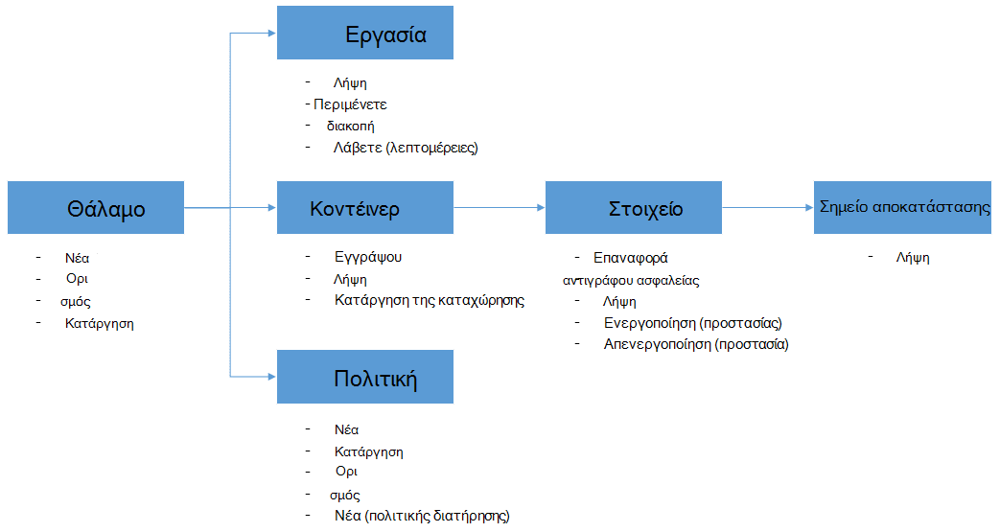

<properties
    pageTitle="Ανάπτυξη και διαχείριση δημιουργίας αντιγράφων ασφαλείας για χρήση του PowerShell ΣΠΣ Azure | Microsoft Azure"
    description="Μάθετε πώς μπορείτε να αναπτύξετε και να διαχειριστείτε Azure δημιουργίας αντιγράφων ασφαλείας με χρήση του PowerShell"
    services="backup"
    documentationCenter=""
    authors="markgalioto"
    manager="cfreeman"
    editor=""/>

<tags
    ms.service="backup"
    ms.workload="storage-backup-recovery"
    ms.tgt_pltfrm="na"
    ms.devlang="na"
    ms.topic="article"
    ms.date="08/08/2016"
    ms.author="markgal;trinadhk;jimpark" />


# <a name="deploy-and-manage-backup-for-azure-vms-using-powershell"></a>Ανάπτυξη και διαχείριση δημιουργίας αντιγράφων ασφαλείας για χρήση του PowerShell ΣΠΣ Azure

> [AZURE.SELECTOR]
- [Διαχείριση πόρων](backup-azure-vms-automation.md)
- [Κλασικό](backup-azure-vms-classic-automation.md)

Αυτό το άρθρο παρουσιάζει τον τρόπο χρήσης του Azure PowerShell για αντίγραφα ασφαλείας και επαναφορά της ΣΠΣ Azure. Azure έχει δύο διαφορετικές ανάπτυξης μοντέλα για τη δημιουργία και εργασία με πόρους: Διαχείριση τον πόρο και κλασική. Σε αυτό το άρθρο καλύπτει χρησιμοποιώντας το μοντέλο ανάπτυξης κλασική. Η Microsoft συνιστά περισσότερες νέες αναπτύξεις χρησιμοποιείτε το μοντέλο από διαχειριστή πόρων.

## <a name="concepts"></a>Έννοιες


Σε αυτό το άρθρο παρέχει πληροφορίες σχετικά με τα cmdlet του PowerShell που χρησιμοποιείται για να δημιουργήσετε αντίγραφα ασφαλείας εικονικές μηχανές. Για εισαγωγικές πληροφορίες σχετικά με την προστασία ΣΠΣ Azure, ανατρέξτε στο θέμα [Σχεδιασμός υποδομή αντιγράφου ασφαλείας σας Εικονική στο Azure](backup-azure-vms-introduction.md).

> [AZURE.NOTE] Πριν να ξεκινήσετε, διαβάστε τις [προϋποθέσεις](backup-azure-vms-prepare.md) απαιτούνται για την εργασία με Azure δημιουργίας αντιγράφων ασφαλείας και οι [περιορισμοί](backup-azure-vms-prepare.md#limitations) της τρέχουσας Εικονική λύσης δημιουργίας αντιγράφων ασφαλείας.

Για να χρησιμοποιήσετε αποτελεσματικά PowerShell, αφιερώστε λίγο χρόνο για να κατανοήσετε την ιεραρχία των αντικειμένων και από πού θα ξεκινήσετε.



Οι δύο πιο σημαντικές ροές είναι η ενεργοποίηση προστασίας για μια Εικονική και επαναφορά δεδομένων από ένα σημείο αποκατάστασης. Σε αυτό το άρθρο εστιάζει θα σας βοηθήσουν να adept στην εργασία με τα cmdlet του PowerShell για να ενεργοποιήσετε αυτά τα δύο σενάρια.


## <a name="setup-and-registration"></a>Εγκατάσταση και καταχώρηση
Για να ξεκινήσετε:

1. [Λήψη πιο πρόσφατη PowerShell](https://github.com/Azure/azure-powershell/releases) (είναι ελάχιστη απαιτούμενη έκδοση: 1.0.0)

2. Βρείτε το cmdlet του PowerShell αντίγραφο ασφαλείας Azure διαθέσιμη, πληκτρολογώντας την ακόλουθη εντολή:

```
PS C:\> Get-Command *azurermbackup*

CommandType     Name                                               Version    Source
-----------     ----                                               -------    ------
Cmdlet          Backup-AzureRmBackupItem                           1.0.1      AzureRM.Backup
Cmdlet          Disable-AzureRmBackupProtection                    1.0.1      AzureRM.Backup
Cmdlet          Enable-AzureRmBackupContainerReregistration        1.0.1      AzureRM.Backup
Cmdlet          Enable-AzureRmBackupProtection                     1.0.1      AzureRM.Backup
Cmdlet          Get-AzureRmBackupContainer                         1.0.1      AzureRM.Backup
Cmdlet          Get-AzureRmBackupItem                              1.0.1      AzureRM.Backup
Cmdlet          Get-AzureRmBackupJob                               1.0.1      AzureRM.Backup
Cmdlet          Get-AzureRmBackupJobDetails                        1.0.1      AzureRM.Backup
Cmdlet          Get-AzureRmBackupProtectionPolicy                  1.0.1      AzureRM.Backup
Cmdlet          Get-AzureRmBackupRecoveryPoint                     1.0.1      AzureRM.Backup
Cmdlet          Get-AzureRmBackupVault                             1.0.1      AzureRM.Backup
Cmdlet          Get-AzureRmBackupVaultCredentials                  1.0.1      AzureRM.Backup
Cmdlet          New-AzureRmBackupProtectionPolicy                  1.0.1      AzureRM.Backup
Cmdlet          New-AzureRmBackupRetentionPolicyObject             1.0.1      AzureRM.Backup
Cmdlet          New-AzureRmBackupVault                             1.0.1      AzureRM.Backup
Cmdlet          Register-AzureRmBackupContainer                    1.0.1      AzureRM.Backup
Cmdlet          Remove-AzureRmBackupProtectionPolicy               1.0.1      AzureRM.Backup
Cmdlet          Remove-AzureRmBackupVault                          1.0.1      AzureRM.Backup
Cmdlet          Restore-AzureRmBackupItem                          1.0.1      AzureRM.Backup
Cmdlet          Set-AzureRmBackupProtectionPolicy                  1.0.1      AzureRM.Backup
Cmdlet          Set-AzureRmBackupVault                             1.0.1      AzureRM.Backup
Cmdlet          Stop-AzureRmBackupJob                              1.0.1      AzureRM.Backup
Cmdlet          Unregister-AzureRmBackupContainer                  1.0.1      AzureRM.Backup
Cmdlet          Wait-AzureRmBackupJob                              1.0.1      AzureRM.Backup
```

Τις ακόλουθες εργασίες εγκατάσταση και καταχώρηση μπορεί να γίνει αυτόματα με το PowerShell:

- Δημιουργία ενός αντιγράφου ασφαλείας θάλαμο
- Καταχώρηση του ΣΠΣ με την υπηρεσία Azure δημιουργίας αντιγράφων ασφαλείας

### <a name="create-a-backup-vault"></a>Δημιουργία ενός αντιγράφου ασφαλείας θάλαμο

> [AZURE.WARNING] Για πελάτες που χρησιμοποιούν Azure δημιουργίας αντιγράφων ασφαλείας για πρώτη φορά, πρέπει να καταχωρήσετε την υπηρεσία παροχής Azure δημιουργίας αντιγράφων ασφαλείας για να χρησιμοποιηθεί με τη συνδρομή σας. Αυτό μπορεί να γίνει, εκτελέστε την παρακάτω εντολή: Register-AzureRmResourceProvider - ProviderNamespace "Microsoft.Backup"

Μπορείτε να δημιουργήσετε ένα νέο αντιγράφου ασφαλείας θάλαμο χρησιμοποιώντας το cmdlet **New-AzureRmBackupVault** . Το αντίγραφο ασφαλείας θάλαμο είναι ένας πόρος ARM, ώστε να πρέπει να το τοποθετήσετε μέσα σε μια ομάδα πόρων. Σε μια αναβαθμισμένη κονσόλα Azure PowerShell, εκτελέστε τις ακόλουθες εντολές:

```
PS C:\> New-AzureRmResourceGroup –Name “test-rg” –Location “West US”
PS C:\> $backupvault = New-AzureRmBackupVault –ResourceGroupName “test-rg” –Name “test-vault” –Region “West US” –Storage GeoRedundant
```

Μπορείτε να λάβετε μια λίστα με όλα τα χώροι φύλαξης αντιγράφου ασφαλείας σε μια δεδομένη συνδρομή χρησιμοποιώντας το cmdlet **Get-AzureRmBackupVault** .

> [AZURE.NOTE] Είναι εύκολο να αποθηκεύσετε το αντικείμενο θάλαμο αντιγράφου ασφαλείας σε μεταβλητή. Το αντικείμενο θάλαμο απαιτείται ως εισαγωγή για πολλές cmdlet του Azure δημιουργίας αντιγράφων ασφαλείας.


### <a name="registering-the-vms"></a>Καταχώρηση του ΣΠΣ
Είναι το πρώτο βήμα για τη ρύθμιση των παραμέτρων δημιουργίας αντιγράφων ασφαλείας με το Azure αντιγράφου ασφαλείας για την καταχώρηση του υπολογιστή ή Εικονική με ένα αντίγραφο ασφαλείας Azure θάλαμο. Το cmdlet **Register-AzureRmBackupContainer** λαμβάνει τις πληροφορίες εισόδου από μια εικονική μηχανή Azure IaaS και εγγράφει με το καθορισμένο θάλαμο. Η λειτουργία register συσχετίζει την Azure εικονική μηχανή με το αντίγραφο ασφαλείας θάλαμο και παρακολουθεί την εικονική Μηχανή μέσω του κύκλου ζωής δημιουργίας αντιγράφων ασφαλείας.

Καταχώρηση Εικονική σας με την υπηρεσία Azure δημιουργίας αντιγράφων ασφαλείας δημιουργεί ένα αντικείμενο κοντέινερ ανώτατου επιπέδου. Ένα κοντέινερ συνήθως περιέχει πολλά στοιχεία που μπορεί να δημιουργηθεί αντίγραφο ασφαλείας, αλλά στην περίπτωση ΣΠΣ θα υπάρχει μόνο ένα στοιχείο αντιγράφων ασφαλείας για το κοντέινερ.

```
PS C:\> $registerjob = Register-AzureRmBackupContainer -Vault $backupvault -Name "testvm" -ServiceName "testvm"
```

## <a name="backup-azure-vms"></a>Δημιουργίας αντιγράφων ασφαλείας ΣΠΣ Azure

### <a name="create-a-protection-policy"></a>Δημιουργία πολιτικής προστασίας
Δεν είναι υποχρεωτική για να δημιουργήσετε μια νέα πολιτική προστασίας για να ξεκινήσετε αντιγράφου ασφαλείας του ΣΠΣ σας. Το θάλαμο συνοδεύεται από μια 'προεπιλεγμένη πολιτική' που μπορεί να χρησιμοποιηθεί για να ενεργοποιήσετε την προστασία γρήγορα, και, στη συνέχεια, επεξεργαστείτε αργότερα με τις λεπτομέρειες της δεξιά. Μπορείτε να λάβετε μια λίστα με τις πολιτικές που είναι διαθέσιμες στο το θάλαμο χρησιμοποιώντας το cmdlet **Get-AzureRmBackupProtectionPolicy** :

```
PS C:\> Get-AzureRmBackupProtectionPolicy -Vault $backupvault

Name                      Type               ScheduleType       BackupTime
----                      ----               ------------       ----------
DefaultPolicy             AzureVM            Daily              26-Aug-15 12:30:00 AM
```

> [AZURE.NOTE] Τη ζώνη ώρας του πεδίου BackupTime PowerShell είναι UTC. Ωστόσο, όταν εμφανίζεται το χρόνο δημιουργίας αντιγράφων ασφαλείας στην πύλη του Azure, τη ζώνη ώρας είναι στοιχισμένο στο σύστημα τοπικό μαζί με την απόκλιση UTC.

Μια πολιτική ασφαλείας είναι συσχετισμένη με τουλάχιστον μία πολιτική διατήρησης. Την πολιτική διατήρησης Καθορίζει πόσος χρόνος ένα σημείο αποκατάστασης διατηρείται με Azure δημιουργίας αντιγράφων ασφαλείας. Το cmdlet **New-AzureRmBackupRetentionPolicy** δημιουργεί αντικείμενα PowerShell που περιέχει πληροφορίες για την πολιτική διατήρησης. Αυτά τα αντικείμενα πολιτικής διατήρησης χρησιμοποιούνται ως εισροές για να το cmdlet *New-AzureRmBackupProtectionPolicy* ή απευθείας με το cmdlet *Enable-AzureRmBackupProtection* .

Μια πολιτική ασφαλείας καθορίζει πότε και πόσο συχνά γίνεται το αντίγραφο ασφαλείας του στοιχείου. Το cmdlet **New-AzureRmBackupProtectionPolicy** δημιουργεί ένα αντικείμενο PowerShell που περιέχει πληροφορίες για την πολιτική ασφαλείας. Η πολιτική ασφαλείας χρησιμοποιείται ως είσοδο στο cmdlet *Enable-AzureRmBackupProtection* .

```
PS C:\> $Daily = New-AzureRmBackupRetentionPolicyObject -DailyRetention -Retention 30
PS C:\> $newpolicy = New-AzureRmBackupProtectionPolicy -Name DailyBackup01 -Type AzureVM -Daily -BackupTime ([datetime]"3:30 PM") -RetentionPolicy $Daily -Vault $backupvault

Name                      Type               ScheduleType       BackupTime
----                      ----               ------------       ----------
DailyBackup01             AzureVM            Daily              01-Sep-15 3:30:00 PM
```

### <a name="enable-protection"></a>Ενεργοποίηση προστασίας
Η ενεργοποίηση προστασίας περιλαμβάνει δύο αντικείμενα - το στοιχείο και την πολιτική, και και τα δύο πρέπει να ανήκουν τα ίδια θάλαμο. Όταν η πολιτική δεν έχει συσχετιστεί με το στοιχείο, η ροή εργασίας δημιουργίας αντιγράφων ασφαλείας θα εκκίνηση στο καθορισμένο χρονοδιάγραμμα.

```
PS C:\> Get-AzureRmBackupContainer -Type AzureVM -Status Registered -Vault $backupvault | Get-AzureRmBackupItem | Enable-AzureRmBackupProtection -Policy $newpolicy
```

### <a name="initial-backup"></a>Αρχικό αντίγραφο ασφαλείας
Το χρονοδιάγραμμα αντιγράφων ασφαλείας θα εκτελέσει από αυτή την πρώτη πλήρη αντίγραφο για το στοιχείο και το αντίγραφο προσαύξησης για τα επόμενα αντίγραφα ασφαλείας. Ωστόσο, εάν θέλετε να επιβάλετε το αρχικό αντίγραφο ασφαλείας για να συμβεί σε ένα συγκεκριμένο χρονικό διάστημα ή ακόμα και αμέσως, στη συνέχεια, χρησιμοποιήστε το cmdlet **AzureRmBackupItem δημιουργίας αντιγράφων ασφαλείας** :

```
PS C:\> $container = Get-AzureRmBackupContainer -Vault $backupvault -Type AzureVM -Name "testvm"
PS C:\> $backupjob = Get-AzureRmBackupItem -Container $container | Backup-AzureRmBackupItem
PS C:\> $backupjob

WorkloadName    Operation       Status          StartTime              EndTime
------------    ---------       ------          ---------              -------
testvm          Backup          InProgress      01-Sep-15 12:24:01 PM  01-Jan-01 12:00:00 AM
```

> [AZURE.NOTE] Τη ζώνη ώρας από τα πεδία ώρα έναρξης και ώρα λήξης εμφανίζεται στο PowerShell είναι UTC. Ωστόσο, όταν εμφανίζεται η παρόμοιες πληροφορίες στην πύλη του Azure, τη ζώνη ώρας ευθυγραμμίζεται με το τοπικό ρολόι συστήματος.

### <a name="monitoring-a-backup-job"></a>Παρακολούθηση μιας εργασίας δημιουργίας αντιγράφων ασφαλείας
Οι περισσότερες λειτουργίες μεγάλη διάρκεια εκτέλεσης στο αντίγραφο ασφαλείας Azure είναι περιλαμβάνει το ως εργασία. Αυτό διευκολύνει την παρακολούθηση προόδου χωρίς να χρειάζεται να διατηρήσετε την πύλη του Azure Άνοιγμα πάντα.

Για να λάβετε την πιο πρόσφατη κατάσταση μια εργασία σε εξέλιξη, χρησιμοποιήστε το cmdlet **Get-AzureRmBackupJob** .

```
PS C:\> $joblist = Get-AzureRmBackupJob -Vault $backupvault -Status InProgress
PS C:\> $joblist[0]

WorkloadName    Operation       Status          StartTime              EndTime
------------    ---------       ------          ---------              -------
testvm          Backup          InProgress      01-Sep-15 12:24:01 PM  01-Jan-01 12:00:00 AM
```

Αντί να σταθμοσκόπησης αυτές τις εργασίες για την ολοκλήρωση - δηλαδή, δεν είναι απαραίτητες, επιπλέον κωδικό - είναι ευκολότερο να χρησιμοποιήσετε το cmdlet **Αναμονής AzureRmBackupJob** . Όταν χρησιμοποιείται σε μια δέσμη ενεργειών, το cmdlet θα καταδείξτε την εκτέλεση μέχρι να ολοκληρωθεί η εργασία είτε το καθορισμένο χρονικό όριο.

```
PS C:\> Wait-AzureRmBackupJob -Job $joblist[0] -Timeout 43200
```


## <a name="restore-an-azure-vm"></a>Επαναφορά Azure Εικονική μηχανή

Για να επαναφέρετε τα δεδομένα αντιγράφου ασφαλείας, πρέπει να προσδιορίσετε το στοιχείο αντίγραφα ασφαλείας και του σημείου αποκατάστασης που διατηρεί τα δεδομένα στη δεδομένη χρονική στιγμή. Αυτές οι πληροφορίες παρέχονται στο επαναφορά AzureRmBackupItem cmdlet για να ξεκινήσετε μια επαναφορά των δεδομένων από το θάλαμο με το λογαριασμό του πελάτη.

### <a name="select-the-vm"></a>Επιλέξτε την εικονική Μηχανή

Για να λάβετε το αντικείμενο του PowerShell που προσδιορίζει το στοιχείο προς τα δεξιά αντιγράφου ασφαλείας, πρέπει να ξεκινήσετε από το κοντέινερ στην το θάλαμο και λειτουργεί με τον τρόπο προς τα κάτω ιεραρχία αντικειμένων. Για να επιλέξετε το κοντέινερ που αντιπροσωπεύει την εικονική Μηχανή, χρησιμοποιήστε το cmdlet **Get-AzureRmBackupContainer** και διοχέτευση που να το cmdlet **Get-AzureRmBackupItem** .

```
PS C:\> $backupitem = Get-AzureRmBackupContainer -Vault $backupvault -Type AzureVM -name "testvm" | Get-AzureRmBackupItem
```

### <a name="choose-a-recovery-point"></a>Επιλέξτε ένα σημείο αποκατάστασης

Μπορείτε τώρα να λίστα όλα τα σημεία ανάκτησης για το στοιχείο δημιουργίας αντιγράφων ασφαλείας χρησιμοποιώντας το cmdlet **Get-AzureRmBackupRecoveryPoint** , και να επιλέξετε το σημείο αποκατάστασης για να επαναφέρετε. Συνήθως, οι χρήστες επιλέξτε το πιο πρόσφατο σημείο *AppConsistent* στη λίστα.

```
PS C:\> $rp =  Get-AzureRmBackupRecoveryPoint -Item $backupitem
PS C:\> $rp

RecoveryPointId    RecoveryPointType  RecoveryPointTime      ContainerName
---------------    -----------------  -----------------      -------------
15273496567119     AppConsistent      01-Sep-15 12:27:38 PM  iaasvmcontainer;testvm;testv...
```

Η μεταβλητή ```$rp``` είναι ένας πίνακας με σημεία ανάκτησης για το επιλεγμένο αντίγραφο ασφαλείας στοιχείου, ταξινομημένες σε αντίστροφη σειρά του χρόνου - είναι η πιο πρόσφατη σημείο αποκατάστασης στο ευρετήριο 0. Χρησιμοποιήστε την τυπική PowerShell πίνακα δημιουργίας ευρετηρίου για να επιλέξετε το σημείο αποκατάστασης. Για παράδειγμα: ```$rp[0]``` θα επιλέξετε την πιο πρόσφατη σημείο αποκατάστασης.

### <a name="restoring-disks"></a>Επαναφορά δίσκων

Υπάρχει μια βασική διαφορά μεταξύ των τις λειτουργίες επαναφοράς πραγματοποιείται μέσω της πύλης Azure και μέσω του Azure PowerShell. Με το PowerShell, η λειτουργία επαναφοράς διακόπτεται στο επαναφορά του δίσκων και τις πληροφορίες ρύθμισης παραμέτρων από το σημείο αποκατάστασης. Δεν δημιουργεί μια εικονική μηχανή.

> [AZURE.WARNING] Η επαναφορά-AzureRmBackupItem δεν δημιουργεί μια εικονική Μηχανή. Επαναφέρει μόνο των δίσκων στο λογαριασμό καθορισμένο χώρου αποθήκευσης. Αυτό δεν είναι η ίδια συμπεριφορά θα αντιμετωπίσετε στην πύλη του Azure.

```
PS C:\> $restorejob = Restore-AzureRmBackupItem -StorageAccountName "DestAccount" -RecoveryPoint $rp[0]
PS C:\> $restorejob

WorkloadName    Operation       Status          StartTime              EndTime
------------    ---------       ------          ---------              -------
testvm          Restore         InProgress      01-Sep-15 1:14:01 PM   01-Jan-01 12:00:00 AM
```

Μπορείτε να λάβετε τις λεπτομέρειες της λειτουργίας επαναφοράς χρησιμοποιώντας το cmdlet **Get-AzureRmBackupJobDetails** μόλις ολοκληρωθεί η εργασία επαναφοράς. Η ιδιότητα *ErrorDetails* θα έχετε τις πληροφορίες που απαιτούνται για να δημιουργήσετε ξανά το Εικονική.

```
PS C:\> $restorejob = Get-AzureRmBackupJob -Job $restorejob
PS C:\> $details = Get-AzureRmBackupJobDetails -Job $restorejob
```

### <a name="build-the-vm"></a>Δημιουργήστε την εικονική Μηχανή

Δημιουργία η Εικονική εκτός των επαναφέρει δίσκων μπορεί να γίνει χρησιμοποιώντας την παλαιότερη Azure υπηρεσία διαχείρισης των cmdlet του PowerShell, τα νέα πρότυπα για τη διαχείριση πόρων Azure, ή ακόμα και με την πύλη Azure. Σε ένα γρήγορο παράδειγμα, θα δείξουμε πώς να φτάσετε εκεί χρησιμοποιώντας το cmdlet Azure υπηρεσία διαχείρισης.

```
 $properties  = $details.Properties

 $storageAccountName = $properties["Target Storage Account Name"]
 $containerName = $properties["Config Blob Container Name"]
 $blobName = $properties["Config Blob Name"]

 $keys = Get-AzureStorageKey -StorageAccountName $storageAccountName
 $storageAccountKey = $keys.Primary
 $storageContext = New-AzureStorageContext -StorageAccountName $storageAccountName -StorageAccountKey $storageAccountKey


 $destination_path = "C:\Users\admin\Desktop\vmconfig.xml"
 Get-AzureStorageBlobContent -Container $containerName -Blob $blobName -Destination $destination_path -Context $storageContext


$obj = [xml](((Get-Content -Path $destination_path -Encoding UniCode)).TrimEnd([char]0x00))
 $pvr = $obj.PersistentVMRole
 $os = $pvr.OSVirtualHardDisk
 $dds = $pvr.DataVirtualHardDisks
 $osDisk = Add-AzureDisk -MediaLocation $os.MediaLink -OS $os.OS -DiskName "panbhaosdisk"
 $vm = New-AzureVMConfig -Name $pvr.RoleName -InstanceSize $pvr.RoleSize -DiskName $osDisk.DiskName

 if (!($dds -eq $null))
 {
     foreach($d in $dds.DataVirtualHardDisk)
     {
         $lun = 0
         if(!($d.Lun -eq $null))
         {
             $lun = $d.Lun
         }
         $name = "panbhadataDisk" + $lun
     Add-AzureDisk -DiskName $name -MediaLocation $d.MediaLink
     $vm | Add-AzureDataDisk -Import -DiskName $name -LUN $lun
    }
}

New-AzureVM -ServiceName "panbhasample" -Location "SouthEast Asia" -VM $vm
```

Για περισσότερες πληροφορίες σχετικά με τον τρόπο για να δημιουργήσετε μια εικονική Μηχανή από επαναφέρει δίσκων, διαβάστε σχετικά με τα ακόλουθα cmdlet:

- [Προσθήκη AzureDisk](https://msdn.microsoft.com/library/azure/dn495252.aspx)
- [Νέα AzureVMConfig](https://msdn.microsoft.com/library/azure/dn495159.aspx)
- [Νέα AzureVM](https://msdn.microsoft.com/library/azure/dn495254.aspx)

## <a name="code-samples"></a>Δείγματα κώδικα

### <a name="1-get-the-completion-status-of-job-sub-tasks"></a>1. λάβετε την κατάσταση ολοκλήρωσης δευτερευουσών εργασιών έργου

Για να παρακολουθείτε την κατάσταση ολοκλήρωσης μεμονωμένες δευτερεύουσες εργασίες, μπορείτε να χρησιμοποιήσετε το cmdlet **Get-AzureRmBackupJobDetails** :

```
PS C:\> $details = Get-AzureRmBackupJobDetails -JobId $backupjob.InstanceId -Vault $backupvault
PS C:\> $details.SubTasks

Name                                                        Status
----                                                        ------
Take Snapshot                                               Completed
Transfer data to Backup vault                               InProgress
```

### <a name="2-create-a-dailyweekly-report-of-backup-jobs"></a>2. Δημιουργία αναφοράς Ημερήσια/Εβδομαδιαία εργασίες αντιγράφων ασφαλείας

Οι διαχειριστές συνήθως θέλουν να γνωρίζετε τι εργασιών δημιουργίας αντιγράφων ασφαλείας που εκτελέσατε στο τις τελευταίες 24 ώρες, την κατάσταση του αυτές τις εργασίες δημιουργίας αντιγράφων ασφαλείας. Επιπλέον, την ποσότητα των δεδομένων μεταφερθεί παρέχει στους διαχειριστές ένας τρόπος για να εκτιμήσετε το μηνιαίο δεδομένων χρήσης. Η παρακάτω δέσμη ενεργειών συγκεντρώνει τα ανεπεξέργαστα δεδομένα από την υπηρεσία Azure δημιουργίας αντιγράφων ασφαλείας και εμφανίζει τις πληροφορίες στην κονσόλα του PowerShell.

```
param(  [Parameter(Mandatory=$True,Position=1)]
        [string]$backupvaultname,

        [Parameter(Mandatory=$False,Position=2)]
        [int]$numberofdays = 7)


#Initialize variables
$DAILYBACKUPSTATS = @()
$backupvault = Get-AzureRmBackupVault -Name $backupvaultname
$enddate = ([datetime]::Today).AddDays(1)
$startdate = ([datetime]::Today)

for( $i = 1; $i -le $numberofdays; $i++ )
{
    # We query one day at a time because pulling 7 days of data might be too much
    $dailyjoblist = Get-AzureRmBackupJob -Vault $backupvault -From $startdate -To $enddate -Type AzureVM -Operation Backup
    Write-Progress -Activity "Getting job information for the last $numberofdays days" -Status "Day -$i" -PercentComplete ([int]([decimal]$i*100/$numberofdays))

    foreach( $job in $dailyjoblist )
    {
        #Extract the information for the reports
        $newstatsobj = New-Object System.Object
        $newstatsobj | Add-Member -Type NoteProperty -Name Date -Value $startdate
        $newstatsobj | Add-Member -Type NoteProperty -Name VMName -Value $job.WorkloadName
        $newstatsobj | Add-Member -Type NoteProperty -Name Duration -Value $job.Duration
        $newstatsobj | Add-Member -Type NoteProperty -Name Status -Value $job.Status

        $details = Get-AzureRmBackupJobDetails -Job $job
        $newstatsobj | Add-Member -Type NoteProperty -Name BackupSize -Value $details.Properties["Backup Size"]
        $DAILYBACKUPSTATS += $newstatsobj
    }

    $enddate = $enddate.AddDays(-1)
    $startdate = $startdate.AddDays(-1)
}

$DAILYBACKUPSTATS | Out-GridView
```

Εάν θέλετε να προσθέσετε δυνατότητες γραφημάτων σε αυτό το αποτέλεσμα αναφοράς, μάθετε από τη δημοσίευση ιστολογίου TechNet [Charting με το PowerShell](http://blogs.technet.com/b/richard_macdonald/archive/2009/04/28/3231887.aspx)

## <a name="next-steps"></a>Επόμενα βήματα

Εάν προτιμάτε χρήση του PowerShell για να επικοινωνείτε με τους πόρους σας Azure, ανατρέξτε στο άρθρο του PowerShell για την προστασία των Windows Server, [ανάπτυξη και διαχείριση δημιουργίας αντιγράφων ασφαλείας για το Windows Server](./backup-client-automation-classic.md). Υπάρχει επίσης ένα άρθρο PowerShell για τη Διαχείριση DPM δημιουργίας αντιγράφων ασφαλείας, [ανάπτυξη και διαχείριση αντίγραφο ασφαλείας για DPM](./backup-dpm-automation-classic.md). Και τα δύο από αυτά τα άρθρα έχουν μια έκδοση για αναπτύξεις διαχείριση πόρων, καθώς και κλασική αναπτύξεις.
