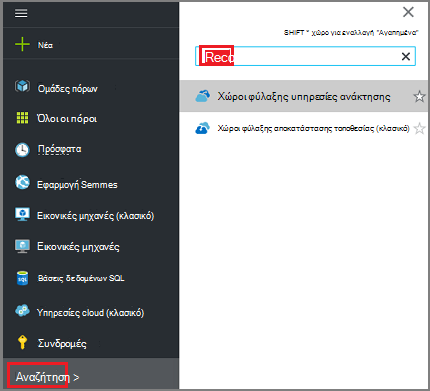
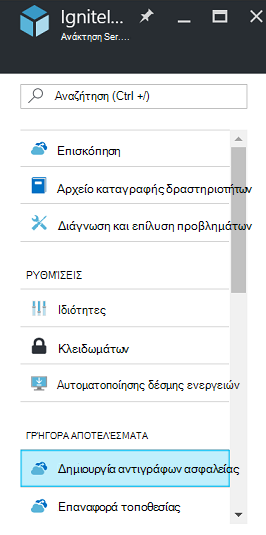
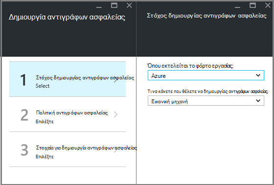
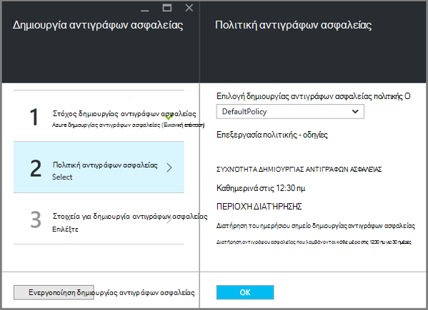
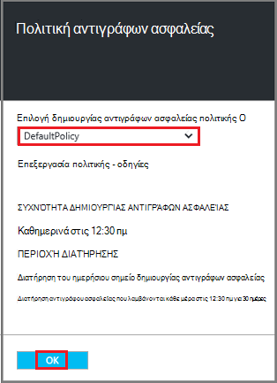
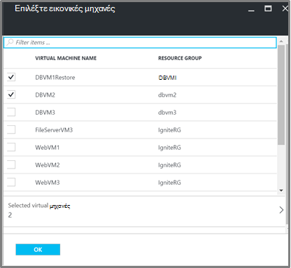
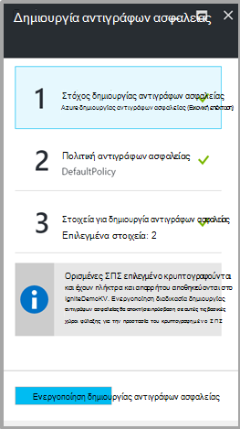

<properties
   pageTitle="Δημιουργία αντιγράφων ασφαλείας και επαναφορά κρυπτογραφημένη ΣΠΣ χρησιμοποιώντας Azure δημιουργίας αντιγράφων ασφαλείας"
   description="Σε αυτό το άρθρο ακρόασης σχετικά με τη δημιουργία αντιγράφων ασφαλείας και επαναφορά εμπειρία για ΣΠΣ κρυπτογραφημένη χρησιμοποιώντας κρυπτογράφηση δίσκου Azure."
   services="backup"
   documentationCenter=""
   authors="JPallavi"
   manager="vijayts"
   editor=""/>
<tags
   ms.service="backup"
   ms.devlang="na"
   ms.topic="article"
   ms.tgt_pltfrm="na"
   ms.workload="storage-backup-recovery"
   ms.date="10/25/2016"
   ms.author="markgal; jimpark; trinadhk"/>

# Δημιουργία αντιγράφων ασφαλείας και επαναφορά κρυπτογραφημένη ΣΠΣ χρησιμοποιώντας Azure δημιουργίας αντιγράφων ασφαλείας

Σε αυτό το άρθρο ακρόασης σχετικά με τα βήματα για τη δημιουργία αντιγράφων ασφαλείας και επαναφορά εικονικές μηχανές χρησιμοποιώντας Azure δημιουργίας αντιγράφων ασφαλείας. Επίσης, παρέχει λεπτομέρειες σχετικά με τις υποστηριζόμενες σενάρια, προαπαιτούμενα και βήματα αντιμετώπισης προβλημάτων για τις περιπτώσεις σφάλματος.

## Σενάρια που υποστηρίζονται

> [AZURE.NOTE]
1.  Δημιουργία αντιγράφων ασφαλείας και επαναφορά της κρυπτογραφημένης ΣΠΣ υποστηρίζεται μόνο για διαχείριση πόρων αναπτυχθεί εικονικές μηχανές. Δεν υποστηρίζεται για κλασική εικονικές μηχανές.  
2.  Υποστηρίζεται μόνο για εικονικές μηχανές κρυπτογραφημένα με χρήση του κλειδιού κρυπτογράφησης του BitLocker και κλειδιού κρυπτογράφησης αριθμού-κλειδιού. Δεν υποστηρίζεται για εικονικές μηχανές κρυπτογραφημένη χρησιμοποιώντας μόνο κλειδιού κρυπτογράφησης του BitLocker.  

## Προαπαιτούμενα

1.  Εικονική μηχανή έχει γίνει κρυπτογραφημένη χρησιμοποιώντας [Κρυπτογράφηση δίσκου Azure](../security/azure-security-disk-encryption.md). Θα πρέπει να είναι κρυπτογραφημένα με χρήση του κλειδιού κρυπτογράφησης του BitLocker και κλειδιού κρυπτογράφησης αριθμού-κλειδιού.
2.  Έχει δημιουργηθεί θάλαμο υπηρεσίες ανάκτησης και αποθήκευσης αναπαραγωγής ρύθμιση χρησιμοποιώντας τα βήματα που αναφέρονται στο άρθρο [Προετοιμασία το περιβάλλον σας για δημιουργία αντιγράφων ασφαλείας](backup-azure-arm-vms-prepare.md).

## Δημιουργία αντιγράφων ασφαλείας κρυπτογραφημένα εικονική Μηχανή
Χρησιμοποιήστε τα ακόλουθα βήματα για να ρυθμίσετε στόχος δημιουργίας αντιγράφων ασφαλείας, ορισμός της πολιτικής, ρύθμιση παραμέτρων των στοιχείων και έναυσμα δημιουργίας αντιγράφων ασφαλείας.

### Ρύθμιση παραμέτρων δημιουργίας αντιγράφων ασφαλείας

1. Εάν έχετε ήδη ένα θάλαμο υπηρεσίες ανάκτησης άνοιγμα, προχωρήστε στο επόμενο βήμα. Εάν δεν έχετε ένα υπηρεσίες ανάκτησης φύλαξης ανοιχτό, αλλά είναι στην πύλη του Azure, στο μενού διανομέα, κάντε κλικ στο κουμπί **Αναζήτηση**.

  - Στη λίστα των πόρων, πληκτρολογήστε **Υπηρεσίες ανάκτησης**.
  - Καθώς αρχίζετε να πληκτρολογείτε, η λίστα φίλτρων που βασίζονται σε δεδομένα εισόδου σας. Όταν δείτε **χώροι φύλαξης υπηρεσίες ανάκτησης**, κάντε κλικ στην επιλογή.
  
        

    Εμφανίζεται η λίστα των χώροι φύλαξης υπηρεσίες ανάκτησης. Από τη λίστα των χώροι φύλαξης υπηρεσίες ανάκτησης, επιλέξτε ένα θάλαμο.

    Ανοίγει τον πίνακα εργαλείων του επιλεγμένου θάλαμο.

2. Από τη λίστα των στοιχείων που εμφανίζεται στην περιοχή θάλαμο, κάντε κλικ στην επιλογή **Δημιουργία αντιγράφων ασφαλείας** για να ανοίξετε το blade δημιουργίας αντιγράφων ασφαλείας.

       
    
3. Στην blade το αντίγραφο ασφαλείας, κάντε κλικ στην επιλογή **στόχος δημιουργίας αντιγράφων ασφαλείας** για να ανοίξετε το blade στόχος δημιουργίας αντιγράφων ασφαλείας.

       
    
4.   Στην το blade στόχος αντιγράφου ασφαλείας, ορίστε **όπου εκτελείται το φόρτο εργασίας** σε Azure και **Τι μπορείτε να κάνετε θέλετε να δημιουργίας αντιγράφων ασφαλείας** για εικονικό υπολογιστή, στη συνέχεια, κάντε κλικ στο κουμπί **OK**.

    Κλείνει το blade στόχος δημιουργίας αντιγράφων ασφαλείας και ανοίγει το blade πολιτικής δημιουργίας αντιγράφων ασφαλείας.

       

5. Στην blade πολιτικής το αντίγραφο ασφαλείας, επιλέξτε την πολιτική ασφαλείας που θέλετε να ισχύουν για το θάλαμο και κάντε κλικ στο **κουμπί OK**.

       

    Τις λεπτομέρειες της προεπιλεγμένης πολιτικής παρατίθενται στις λεπτομέρειες. Εάν θέλετε να δημιουργήσετε μια πολιτική, επιλέξτε **Δημιουργία νέου** από το αναπτυσσόμενο μενού. Αφού κάνετε κλικ στο κουμπί **OK**, η πολιτική ασφαλείας είναι συσχετισμένη με το θάλαμο.

    Στη συνέχεια, επιλέξτε το ΣΠΣ να συσχετίσετε με το θάλαμο.
    
6. Επιλέξτε το κρυπτογραφημένο εικονικές μηχανές για να συσχετίσετε με την καθορισμένη πολιτική και κάντε κλικ στο **κουμπί OK**.

      
   
7. Αυτή η σελίδα εμφανίζει ένα μήνυμα σχετικά με τις βασικές θάλαμο που σχετίζονται με το κρυπτογραφημένο ΣΠΣ επιλεγμένο. Υπηρεσία δημιουργίας αντιγράφων ασφαλείας απαιτεί πρόσβαση μόνο για ανάγνωση στα πλήκτρα και απόρρητο στο του κλειδιού θάλαμο. Χρησιμοποιεί αυτά τα δικαιώματα να κλειδί του αντιγράφου ασφαλείας και μυστικό, μαζί με το συσχετισμένο ΣΠΣ. 

      

      Τώρα που έχετε καθορίσει όλες τις ρυθμίσεις για το θάλαμο, στο blade το αντίγραφο ασφαλείας, κάντε κλικ στην επιλογή Ενεργοποίηση δημιουργίας αντιγράφων ασφαλείας στο κάτω μέρος της σελίδας. Ενεργοποίηση αντιγράφων ασφαλείας ανάπτυξη της πολιτικής για το θάλαμο και του ΣΠΣ.

8. Η επόμενη φάση προετοιμασία εγκαθιστά τον παράγοντα εικονική Μηχανή ή πώς να εξασφαλίσετε ότι ο παράγοντας εικονική Μηχανή έχει εγκατασταθεί. Για να κάνετε το ίδιο, χρησιμοποιήστε τα βήματα που αναφέρονται στο άρθρο [Προετοιμασία το περιβάλλον σας για δημιουργία αντιγράφων ασφαλείας](backup-azure-arm-vms-prepare.md). 

### Ενεργοποίηση εργασίας δημιουργίας αντιγράφων ασφαλείας
Χρησιμοποιήστε τα βήματα που αναφέρονται στο άρθρο της [Δημιουργίας αντιγράφων ασφαλείας ΣΠΣ Azure σε θάλαμο υπηρεσίες ανάκτησης](backup-azure-arm-vms.md) στις έναυσμα εργασίας δημιουργίας αντιγράφων ασφαλείας.

## Επαναφορά κρυπτογραφημένων Εικονική
Επαναφέρετε την εμπειρία για κρυπτογραφημένο και μη κρυπτογραφημένα εικονικές μηχανές είναι η ίδια. Χρησιμοποιήστε τα βήματα που αναφέρονται σε [εικονικές μηχανές στην πύλη Azure επαναφορά](backup-azure-arm-restore-vms.md) για να επαναφέρετε το κρυπτογραφημένο Εικονική. Σε περίπτωση που χρειάζεστε για να επαναφέρετε κλειδιά και απορρήτου, πρέπει να βεβαιωθείτε ότι θα πρέπει να υπάρχει ήδη, που θάλαμο κλειδιού για να τα επαναφέρετε.

## Αντιμετώπιση σφαλμάτων

| Η λειτουργία | Λεπτομέρειες του σφάλματος | Ανάλυση |
| -------- | -------- | -------|
| Δημιουργία αντιγράφων ασφαλείας | Η επικύρωση απέτυχε κατά την εικονική μηχανή είναι κρυπτογραφημένα με BEK από μόνο του. Δημιουργία αντιγράφων ασφαλείας μπορούν να ενεργοποιηθούν μόνο για εικονικές μηχανές κρυπτογραφημένα με BEK και KEK. | Εικονική μηχανή θα πρέπει να είναι κρυπτογραφημένη χρησιμοποιώντας BEK και KEK. Μετά από αυτό, θα πρέπει να είναι ενεργοποιημένη η δημιουργία αντιγράφων ασφαλείας. |
| Επαναφορά | Δεν μπορείτε να επαναφέρετε το κρυπτογραφημένο Εικονική εφόσον δεν υπάρχει κλειδιού θάλαμο που σχετίζονται με αυτό Εικονική. | Δημιουργία βασικών θάλαμο χρησιμοποιώντας [Γρήγορα αποτελέσματα με το Azure κλειδί θάλαμο](../key-vault/key-vault-get-started.md). Ανατρέξτε στο άρθρο [Επαναφορά κλειδιού θάλαμο κλειδί και χρήση των αντιγράφων ασφαλείας Azure μυστικό](backup-azure-restore-key-secret.md) για να επαναφέρετε το κλειδί και μυστικό, εάν δεν υπάρχουν. |
| Επαναφορά | Δεν μπορείτε να επαναφέρετε το κρυπτογραφημένο Εικονική εφόσον δεν υπάρχει κλειδί και μυστικό που σχετίζονται με αυτό Εικονική. | Ανατρέξτε στο άρθρο [Επαναφορά κλειδιού θάλαμο κλειδί και χρήση των αντιγράφων ασφαλείας Azure μυστικό](backup-azure-restore-key-secret.md) για να επαναφέρετε το κλειδί και μυστικό, εάν δεν υπάρχουν. |
