<properties
    pageTitle="Πρώτα μια ματιά: προστασία ΣΠΣ Azure με ένα θάλαμο υπηρεσίες ανάκτησης | Microsoft Azure"
    description="Προστασία ΣΠΣ Azure με ένα θάλαμο υπηρεσίες ανάκτησης. Χρησιμοποιήστε αντίγραφα ασφαλείας των ΣΠΣ αναπτυχθεί από διαχειριστή πόρων, αναπτυχθεί κλασική ΣΠΣ και Premium ΣΠΣ χώρου αποθήκευσης για την προστασία των δεδομένων σας. Δημιουργία και καταχώρηση ενός θάλαμο υπηρεσίες ανάκτησης. Καταχώρηση ΣΠΣ, Δημιουργία πολιτικής και προστασία ΣΠΣ στο Azure."
    services="backup"
    documentationCenter=""
    authors="markgalioto"
    manager="cfreeman"
    editor=""
    keyword="backups; vm backup"/>

<tags
    ms.service="backup"
    ms.workload="storage-backup-recovery"
    ms.tgt_pltfrm="na"
    ms.devlang="na"
    ms.topic="hero-article"
    ms.date="10/13/2016"
    ms.author="markgal; jimpark"/>

# Πρώτα μια ματιά: προστασία ΣΠΣ Azure με ένα θάλαμο υπηρεσίες ανάκτησης

> [AZURE.SELECTOR]
- [Προστασία ΣΠΣ με ένα θάλαμο υπηρεσίες ανάκτησης](backup-azure-vms-first-look-arm.md)
- [Προστασία ΣΠΣ με ένα αντίγραφο ασφαλείας θάλαμο](backup-azure-vms-first-look.md)

Αυτό το πρόγραμμα εκμάθησης σάς καθοδηγεί στα βήματα για τη δημιουργία ενός θάλαμο υπηρεσίες ανάκτησης και δημιουργία αντιγράφων ασφαλείας μια εικονική μηχανή Azure (Εικονική). Προστασία χώροι φύλαξης υπηρεσίες ανάκτησης:

- Azure ΣΠΣ αναπτυχθεί από διαχειριστή πόρων
- Κλασική ΣΠΣ
- Τυπική αποθήκευσης ΣΠΣ
- Χώρος αποθήκευσης Premium ΣΠΣ
- ΣΠΣ κρυπτογραφημένη χρησιμοποιώντας κρυπτογράφηση δίσκου Azure, με BEK και KEK

Για περισσότερες πληροφορίες για την προστασία του χώρου αποθήκευσης Premium ΣΠΣ, ανατρέξτε στο θέμα [Δημιουργία αντιγράφων ασφαλείας και επαναφορά ΣΠΣ Premium χώρου αποθήκευσης](backup-introduction-to-azure-backup.md#back-up-and-restore-premium-storage-vms)

>[AZURE.NOTE] Αυτό το πρόγραμμα εκμάθησης προϋποθέτει που έχετε ήδη μια Εικονική στη συνδρομή σας στο Azure και ότι έχετε κάνει μέτρα για να επιτρέψετε την υπηρεσία δημιουργίας αντιγράφων ασφαλείας για να αποκτήσετε πρόσβαση η Εικονική.

[AZURE.INCLUDE [learn-about-Azure-Backup-deployment-models](../../includes/backup-deployment-models.md)]

Σε υψηλό επίπεδο, ακολουθούν τα βήματα που θα ακολουθήσετε.  

1. Δημιουργήστε ένα θάλαμο υπηρεσίες ανάκτησης για μια Εικονική.
2. Χρησιμοποιήστε την πύλη του Azure για να επιλέξετε ένα σενάριο, Ορισμός πολιτικής και τον προσδιορισμό των στοιχείων για την προστασία.
3. Εκτελέστε το αρχικό αντίγραφο ασφαλείας.

## Δημιουργήστε ένα θάλαμο υπηρεσίες ανάκτησης για μια εικονική Μηχανή

Ένα θάλαμο υπηρεσίες ανάκτησης είναι μια οντότητα που αποθηκεύει όλα τα αντίγραφα ασφαλείας και αποκατάστασης σημεία που έχουν δημιουργηθεί μέσα στο χρόνο. Το θάλαμο υπηρεσίες ανάκτησης περιέχει επίσης την πολιτική ασφαλείας εφαρμοστεί η προστατευμένη ΣΠΣ.

>[AZURE.NOTE] Δημιουργία αντιγράφων ασφαλείας ΣΠΣ είναι μια τοπική διαδικασία. Που δεν είναι δυνατό να δημιουργήσετε αντίγραφα ασφαλείας ΣΠΣ από μία θέση σε ένα θάλαμο υπηρεσίες ανάκτησης σε άλλη θέση. Επομένως, για κάθε θέση Azure που έχει ΣΠΣ να δημιουργηθεί αντίγραφο ασφαλείας, τουλάχιστον μία αποκατάστασης υπηρεσίες θάλαμο πρέπει να υπάρχει σε αυτήν τη θέση.

Για να δημιουργήσετε ένα θάλαμο υπηρεσίες ανάκτησης:

1. Είσοδος στην [πύλη του Azure](https://portal.azure.com/).

2. Στο μενού διανομέα, κάντε κλικ στο κουμπί **Αναζήτηση** και στη λίστα των πόρων, πληκτρολογήστε **Υπηρεσίες ανάκτησης**. Καθώς αρχίζετε να πληκτρολογείτε, η λίστα φίλτρων που βασίζονται σε δεδομένα εισόδου σας. Κάντε κλικ στην επιλογή **υπηρεσίες ανάκτησης θάλαμο**.

    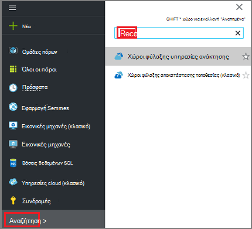  

    Λίστα των χώροι φύλαξης υπηρεσίες ανάκτησης εμφανίζονται.

3. Στο μενού **χώροι φύλαξης υπηρεσίες ανάκτησης** , κάντε κλικ στην επιλογή **Προσθήκη**.

    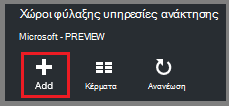

    Ανοίγει το blade θάλαμο υπηρεσίες ανάκτησης, να σας ζητήσει να δώσετε ένα **όνομα**, **τη συνδρομή**, **ομάδα πόρων**και **θέση**.

    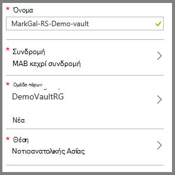

4. **Όνομα**, πληκτρολογήστε ένα φιλικό όνομα για τον προσδιορισμό του θάλαμο. Το όνομα πρέπει να είναι μοναδικό για τη συνδρομή Azure. Πληκτρολογήστε ένα όνομα που περιέχει μεταξύ 2 και 50 χαρακτήρων. Πρέπει να ξεκινούν με γράμμα και μπορούν να περιέχουν μόνο γράμματα, αριθμούς και παύλες.

5. Κάντε κλικ στην **εγγραφή** για να δείτε τη διαθέσιμη λίστα συνδρομών. Εάν δεν είστε βέβαιοι ποια συνδρομή για να χρησιμοποιήσετε, χρησιμοποιήστε την προεπιλεγμένη (ή προτεινόμενες) συνδρομής. Υπάρχουν πολλές επιλογές μόνο εάν είναι συσχετισμένη με πολλές συνδρομές Azure τον εταιρικό λογαριασμό σας.

6. Κάντε κλικ στην επιλογή **ομάδα πόρων** για να δείτε τη διαθέσιμη λίστα ομάδων πόρων ή κάντε κλικ στην επιλογή **Δημιουργία** για να δημιουργήσετε μια ομάδα πόρων. Για πλήρεις πληροφορίες σχετικά με τις ομάδες πόρων, ανατρέξτε στο θέμα [Επισκόπηση της διαχείρισης πόρων Azure](../azure-resource-manager/resource-group-overview.md)

7. Κάντε κλικ στην επιλογή **θέσης** για να επιλέξετε τη γεωγραφική περιοχή για το θάλαμο. Το θάλαμο **πρέπει να** είναι στην ίδια περιοχή ως τις εικονικές μηχανές που θέλετε να προστατεύσετε.

    >[AZURE.IMPORTANT] Εάν είστε βέβαιοι για τη θέση στην οποία υπάρχει Εικονική σας, κλείστε το από το παράθυρο διαλόγου δημιουργίας θάλαμο και μεταβείτε στη λίστα των εικονικές μηχανές στην πύλη του. Εάν έχετε εικονικές μηχανές σε πολλές περιοχές, δημιουργήστε ένα θάλαμο υπηρεσίες ανάκτησης σε κάθε περιοχή. Δημιουργήστε το θάλαμο στην πρώτη θέση προτού προχωρήσετε στην επόμενη θέση. Χωρίς να χρειάζεται να καθορίσετε τους λογαριασμούς χώρου αποθήκευσης για να αποθηκεύσετε τα δεδομένα αντιγράφου ασφαλείας--το θάλαμο υπηρεσίες ανάκτησης και της δημιουργίας αντιγράφων ασφαλείας Azure υπηρεσίας χειρίζεται αυτό αυτόματα.

8. Κάντε κλικ στην επιλογή **Δημιουργία**. Ενδέχεται να χρειαστεί κάποιος χρόνος για το θάλαμο υπηρεσίες ανάκτησης που θα δημιουργηθεί. Παρακολουθείτε τις ειδοποιήσεις κατάστασης στην επάνω δεξιά περιοχή στην πύλη. Αφού δημιουργηθεί το θάλαμο, εμφανίζεται στη λίστα των χώροι φύλαξης υπηρεσίες ανάκτησης.

    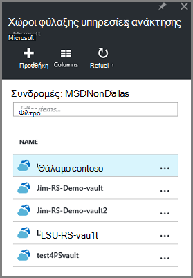

Τώρα που έχετε δημιουργήσει το θάλαμο, μάθετε πώς μπορείτε να ορίσετε την αναπαραγωγή χώρου αποθήκευσης.

### Ορισμός αναπαραγωγής χώρου αποθήκευσης

Η επιλογή αναπαραγωγή χώρου αποθήκευσης σας επιτρέπει να επιλέξετε μεταξύ των πλεοναζόντων παν χώρου αποθήκευσης και τοπικά πλεονάζοντα χώρο αποθήκευσης. Από προεπιλογή, το θάλαμο έχει παν πλεονάζοντα χώρο αποθήκευσης. Αφήστε την επιλογή που έχει οριστεί σε παν πλεονάζοντα χώρο αποθήκευσης, εάν πρόκειται για το πρωτεύον αντίγραφο ασφαλείας. Εάν θέλετε μια επιλογή κοστίζει που δεν είναι διαρκή ως, επιλέξτε τοπικά πλεονάζοντα χώρο αποθήκευσης. Διαβάστε περισσότερα σχετικά με το [παν πλεονάζοντα](../storage/storage-redundancy.md#geo-redundant-storage) και [τοπικά πλεονάζοντα](../storage/storage-redundancy.md#locally-redundant-storage) επιλογές αποθήκευσης στην [Επισκόπηση αναπαραγωγής Azure αποθήκευσης](../storage/storage-redundancy.md).

Για να επεξεργαστείτε τη ρύθμιση αναπαραγωγής χώρου αποθήκευσης:

1. Επιλέξτε το θάλαμο για να ανοίξετε τον πίνακα εργαλείων θάλαμο και το blade ρυθμίσεις. Εάν δεν ανοίξει το blade **Ρυθμίσεις** , κάντε κλικ στην επιλογή **όλες οι ρυθμίσεις** στον πίνακα εργαλείων θάλαμο.

2. Στην το blade **Ρυθμίσεις** , κάντε κλικ στην **Υποδομή δημιουργίας αντιγράφων ασφαλείας** > **Ρύθμισης παραμέτρων δημιουργίας αντιγράφων ασφαλείας** για να ανοίξετε το blade **Ρύθμισης παραμέτρων δημιουργίας αντιγράφων ασφαλείας** . Στην blade τη **Ρύθμιση παραμέτρων δημιουργίας αντιγράφων ασφαλείας** , ενεργοποιήστε την επιλογή αναπαραγωγή χώρου αποθήκευσης για το θάλαμο.

    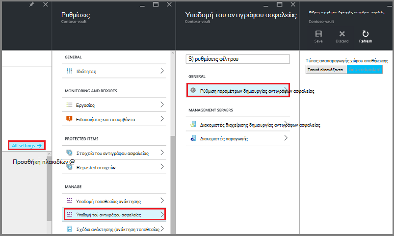

    Αφού επιλέξετε την επιλογή αποθήκευσης για το θάλαμο, είστε έτοιμοι να συσχετίσετε την εικονική Μηχανή με το θάλαμο. Για να ξεκινήσετε τη συσχέτιση, πρέπει να ανακαλύψετε και καταχώρηση του Azure εικονικές μηχανές.

## Επιλέξτε ένα στόχο δημιουργίας αντιγράφων ασφαλείας, Ορισμός πολιτικής και ορισμός στοιχείων για την προστασία

Πριν από την καταχώρηση μια Εικονική με ένα θάλαμο, εκτελέστε τη διαδικασία εντοπισμού για να βεβαιωθείτε ότι προσδιορίζονται οποιαδήποτε νέα εικονικές μηχανές που έχουν προστεθεί στη συνδρομή. Τα ερωτήματα διαδικασία Azure για τη λίστα των εικονικές μηχανές στην συνδρομής, μαζί με πρόσθετες πληροφορίες, όπως το όνομα της υπηρεσίας cloud και της περιοχής. Στην πύλη του Azure, σενάριο αναφέρεται σε τι πρόκειται να θέσετε το θάλαμο υπηρεσίες ανάκτησης. Πολιτική είναι το χρονοδιάγραμμα για τη συχνότητα και όταν λαμβάνονται σημεία αποκατάστασης. Πολιτική περιλαμβάνει επίσης την περιοχή διατήρησης για τα σημεία αποκατάστασης.

1. Εάν έχετε ήδη ένα υπηρεσίες ανάκτησης Άνοιγμα θάλαμο, προχωρήστε στο βήμα 2. Εάν δεν έχετε αποκατάστασης υπηρεσιών φύλαξης ανοιχτό, αλλά είναι στην πύλη του Azure, στο μενού διανομέα, κάντε κλικ στο κουμπί **Αναζήτηση**.

  - Στη λίστα των πόρων, πληκτρολογήστε **Υπηρεσίες ανάκτησης**.
  - Καθώς αρχίζετε να πληκτρολογείτε, η λίστα φίλτρων που βασίζονται σε δεδομένα εισόδου σας. Όταν δείτε **χώροι φύλαξης υπηρεσίες ανάκτησης**, κάντε κλικ στην επιλογή.

      

    Εμφανίζεται η λίστα των χώροι φύλαξης υπηρεσίες ανάκτησης.
  - Από τη λίστα των χώροι φύλαξης υπηρεσίες ανάκτησης, επιλέξτε ένα θάλαμο.

    Ανοίγει τον πίνακα εργαλείων του επιλεγμένου θάλαμο.

    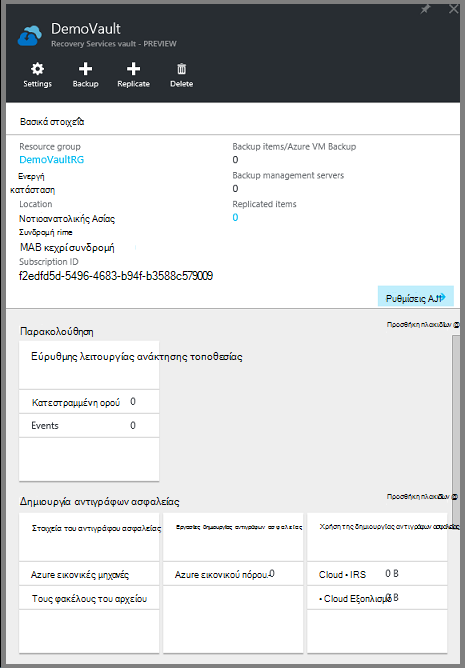

2. Από το μενού πίνακα εργαλείων θάλαμο, κάντε κλικ στην επιλογή **Δημιουργία αντιγράφων ασφαλείας** για να ανοίξετε το blade δημιουργίας αντιγράφων ασφαλείας.

    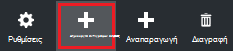

    Όταν ανοίξει το blade, την υπηρεσία δημιουργίας αντιγράφων ασφαλείας αναζητά οποιαδήποτε νέα ΣΠΣ στην συνδρομής.

    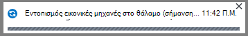

3. Στην blade το αντίγραφο ασφαλείας, κάντε κλικ στην επιλογή **στόχος δημιουργίας αντιγράφων ασφαλείας** για να ανοίξετε το blade στόχος δημιουργίας αντιγράφων ασφαλείας.

    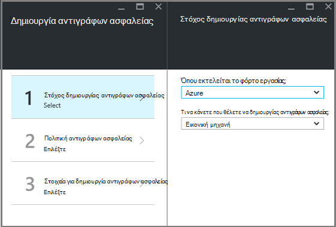

4. Στην το blade στόχος αντιγράφου ασφαλείας, ορίστε **όπου εκτελείται το φόρτο εργασίας** σε Azure και **Τι μπορείτε να κάνετε θέλετε να δημιουργίας αντιγράφων ασφαλείας** για εικονικό υπολογιστή, στη συνέχεια, κάντε κλικ στο κουμπί **OK**.

    Κλείνει το blade στόχος δημιουργίας αντιγράφων ασφαλείας και ανοίγει το blade πολιτικής δημιουργίας αντιγράφων ασφαλείας.

    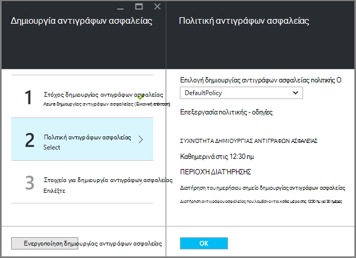

5. Στην blade πολιτικής το αντίγραφο ασφαλείας, επιλέξτε την πολιτική ασφαλείας που θέλετε να ισχύουν για το θάλαμο και κάντε κλικ στο **κουμπί OK**.

    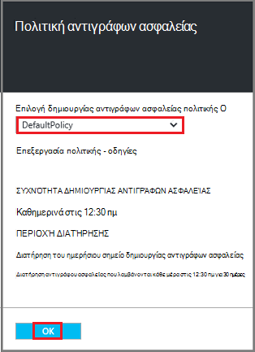

    Τις λεπτομέρειες της προεπιλεγμένης πολιτικής παρατίθενται στις λεπτομέρειες. Εάν θέλετε να δημιουργήσετε μια πολιτική, επιλέξτε **Δημιουργία νέου** από το αναπτυσσόμενο μενού. Το αναπτυσσόμενο μενού παρέχει επίσης μια επιλογή για να αλλάξετε την ώρα το στιγμιότυπο είναι λήψης, για να 7 Μ.Μ. Για οδηγίες σχετικά με τον ορισμό μια πολιτική ασφαλείας, ανατρέξτε στο θέμα [Ορισμός μια πολιτική ασφαλείας](backup-azure-vms-first-look-arm.md#defining-a-backup-policy). Αφού κάνετε κλικ στο κουμπί **OK**, η πολιτική ασφαλείας είναι συσχετισμένη με το θάλαμο.

    Στη συνέχεια, επιλέξτε το ΣΠΣ να συσχετίσετε με το θάλαμο.

6. Επιλέξτε τις εικονικές μηχανές να συσχετίσετε με την καθορισμένη πολιτική και κάντε κλικ στην **επιλογή**.

    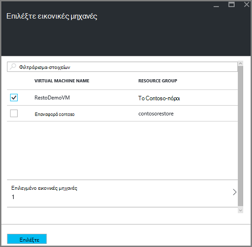

    Εάν δεν βλέπετε την επιθυμητή εικονική Μηχανή, ελέγξτε ότι υπάρχει στην ίδια θέση Azure ως το θάλαμο υπηρεσίες ανάκτησης.

7. Τώρα που έχετε καθορίσει όλες τις ρυθμίσεις για το θάλαμο, στο blade το αντίγραφο ασφαλείας, κάντε κλικ στην επιλογή **Ενεργοποίηση δημιουργίας αντιγράφων ασφαλείας** στο κάτω μέρος της σελίδας. Αυτό ανάπτυξη της πολιτικής για το θάλαμο και του ΣΠΣ.

    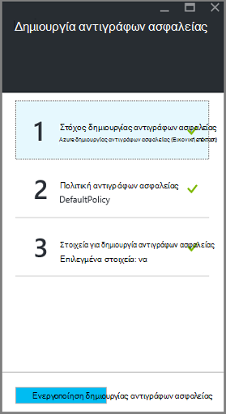

## Αρχικό αντίγραφο ασφαλείας

Όταν μια πολιτική ασφαλείας έχει αναπτυχθεί στον υπολογιστή εικονικές, που σημαίνει δεν δεδομένων έχει δημιουργηθεί αντίγραφο ασφαλείας. Από προεπιλογή, το πρώτο προγραμματισμένη δημιουργία αντιγράφων ασφαλείας (όπως ορίζεται στην πολιτική ασφαλείας) είναι το αρχικό αντίγραφο ασφαλείας. Μέχρι να παρουσιάζεται το αρχικό αντίγραφο ασφαλείας, εμφανίζεται η τελευταία κατάσταση αντιγράφου ασφαλείας σε το blade **Εργασιών δημιουργίας αντιγράφων ασφαλείας** , ως **Προειδοποίηση (αρχικό αντίγραφα ασφαλείας σε εκκρεμότητα)**.

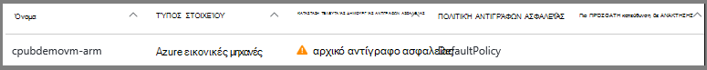

Εκτός εάν το αρχικό αντίγραφο ασφαλείας είναι παράδοσης για να ξεκινήσει η σύντομα, συνιστάται να εκτελέσετε **Δημιουργία αντιγράφου ασφαλείας τώρα**.

Για να εκτελέσετε **Δημιουργία αντιγράφου ασφαλείας τώρα**:

1. Στον πίνακα εργαλείων θάλαμο, στο πλακίδιο **αντίγραφο ασφαλείας** , κάντε κλικ στην επιλογή **εικονικές μηχανές Windows Azure**  
    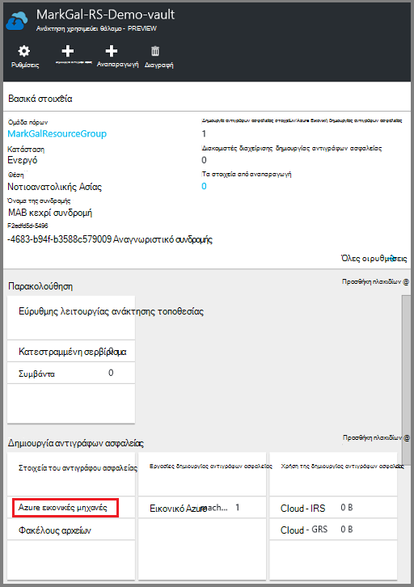

    Ανοίγει το blade **Στοιχεία δημιουργίας αντιγράφων ασφαλείας** .

2. Στην το blade **Στοιχεία αντίγραφο ασφαλείας** , κάντε δεξί κλικ το θάλαμο που θέλετε να δημιουργήσετε αντίγραφα ασφαλείας και κάντε κλικ στην επιλογή **Άμεση δημιουργία αντιγράφων ασφαλείας**.

    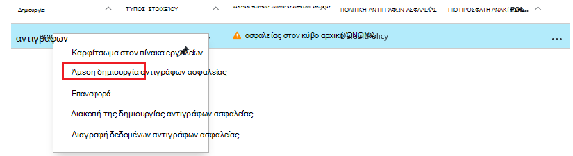

    Ενεργοποίηση της εργασίας δημιουργίας αντιγράφων ασφαλείας.  

    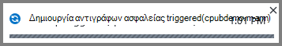

3. Για να δείτε ότι το αρχικό δημιουργία αντιγράφων ασφαλείας ολοκληρώθηκε, στον πίνακα εργαλείων θάλαμο, στο παράθυρο **Εργασιών δημιουργίας αντιγράφων ασφαλείας** , κάντε κλικ στην επιλογή **Azure εικονικές μηχανές**.

    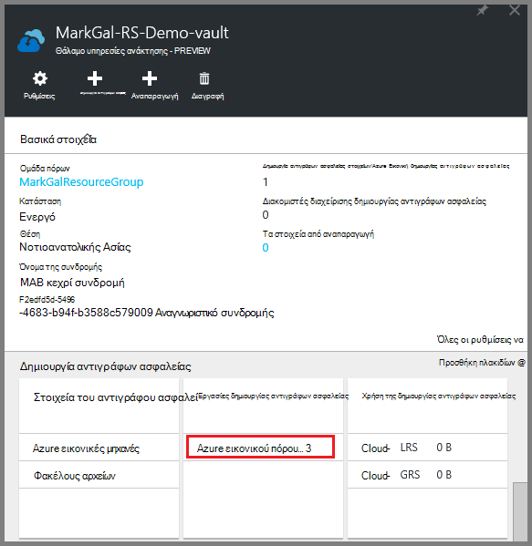

    Ανοίγει το blade εργασιών δημιουργίας αντιγράφων ασφαλείας.

4. Στο blade εργασίες το αντίγραφο ασφαλείας, μπορείτε να δείτε την κατάσταση όλων των έργων.

    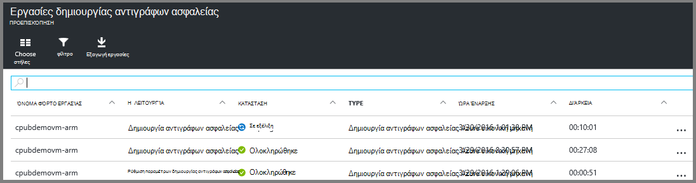

    >[AZURE.NOTE] Ως μέρος της λειτουργίας δημιουργίας αντιγράφων ασφαλείας, την υπηρεσία Azure αντιγράφου ασφαλείας θέματα μια εντολή για την επέκταση αντιγράφου ασφαλείας σε κάθε Εικονική εκκένωση όλες οι εγγραφές και να λάβετε ένα στιγμιότυπο συνεπή.

    Όταν ολοκληρώσετε την εργασία αντιγράφου ασφαλείας, η κατάσταση είναι *ολοκληρώθηκε*.

[AZURE.INCLUDE [backup-create-backup-policy-for-vm](../../includes/backup-create-backup-policy-for-vm.md)]

## Εγκατάσταση τον παράγοντα Εικονική σε η εικονική μηχανή

Αυτές οι πληροφορίες παρέχονται σε περίπτωση που είναι απαραίτητη. Ο παράγοντας Εικονική Azure πρέπει να έχει εγκατασταθεί στον υπολογιστή εικονικές Azure για την επέκταση δημιουργίας αντιγράφων ασφαλείας για να εργαστείτε. Ωστόσο, εάν σας Εικονική δημιουργήθηκε από τη συλλογή Azure, στη συνέχεια, τον παράγοντα Εικονική υπάρχει ήδη στον υπολογιστή εικονική. ΣΠΣ που μετεγκαθίστανται από κέντρα δεδομένων εσωτερικής εγκατάστασης, θα έχετε εγκατεστημένα τον παράγοντα Εικονική. Σε αυτήν την περίπτωση, τον παράγοντα Εικονική πρέπει να έχει εγκατασταθεί. Εάν αντιμετωπίζετε προβλήματα με τη δημιουργία αντιγράφων ασφαλείας του Εικονική Azure, ελέγξτε ότι ο παράγοντας Εικονική Azure έχει εγκατασταθεί σωστά στον υπολογιστή εικονικές (ανατρέξτε στον παρακάτω πίνακα). Εάν δημιουργήσετε ένα προσαρμοσμένο Εικονική, [Βεβαιωθείτε ότι είναι επιλεγμένο το πλαίσιο ελέγχου να **εγκαταστήσετε τον παράγοντα Εικονική** ](../virtual-machines/virtual-machines-windows-classic-agents-and-extensions.md) πριν από την εικονική μηχανή παρέχεται.

Μάθετε σχετικά με την [Εικονική παράγοντας](https://go.microsoft.com/fwLink/?LinkID=390493&clcid=0x409) και [πώς μπορείτε να το εγκαταστήσετε](../virtual-machines/virtual-machines-windows-classic-manage-extensions.md).

Ο παρακάτω πίνακας παρέχει πρόσθετες πληροφορίες σχετικά με την Εικονική παράγοντας για Windows και Linux ΣΠΣ.

| **Η λειτουργία** | **Windows** | **Linux** |
| --- | --- | --- |
| Κατά την εγκατάσταση του παράγοντα Εικονική | <li>Λήψη και εγκατάσταση τον [παράγοντα MSI](http://go.microsoft.com/fwlink/?LinkID=394789&clcid=0x409). Χρειάζεστε δικαιώματα διαχειριστή για να ολοκληρώσετε την εγκατάσταση. <li>[Ενημερώστε την ιδιότητα Εικονική](http://blogs.msdn.com/b/mast/archive/2014/04/08/install-the-vm-agent-on-an-existing-azure-vm.aspx) για να υποδείξει ότι έχει εγκατασταθεί τον παράγοντα. | <li> Εγκαταστήστε την πιο πρόσφατη [παράγοντας Linux](https://github.com/Azure/WALinuxAgent) από GitHub. Χρειάζεστε δικαιώματα διαχειριστή για να ολοκληρώσετε την εγκατάσταση. <li> [Ενημερώστε την ιδιότητα Εικονική](http://blogs.msdn.com/b/mast/archive/2014/04/08/install-the-vm-agent-on-an-existing-azure-vm.aspx) για να υποδείξει ότι έχει εγκατασταθεί τον παράγοντα. |
| Ενημέρωση τον παράγοντα Εικονική | Ενημέρωση τον παράγοντα εικονική Μηχανή είναι τόσο απλή όσο η επανεγκατάσταση η [Εικονική παράγοντας δυαδικά δεδομένα](http://go.microsoft.com/fwlink/?LinkID=394789&clcid=0x409).  Βεβαιωθείτε ότι δεν υπάρχει λειτουργία δημιουργίας αντιγράφων ασφαλείας εκτελείται κατά τον παράγοντα Εικονική ενημερώνεται. | Ακολουθήστε τις οδηγίες σχετικά με την [Ενημέρωση τον παράγοντα Εικονική Linux ](../virtual-machines-linux-update-agent.md).  Βεβαιωθείτε ότι δεν υπάρχει λειτουργία δημιουργίας αντιγράφων ασφαλείας εκτελείται κατά τον παράγοντα Εικονική ενημερώνεται. |
| Επικύρωση της εγκατάστασης Εικονική παράγοντα | <li>Μεταβείτε στο φάκελο *C:\WindowsAzure\Packages* σε η Εικονική Azure. <li>Πρέπει να βρείτε το αρχείο WaAppAgent.exe παρουσίαση.<li> Κάντε δεξί κλικ στο αρχείο, μεταβείτε στις **Ιδιότητες**και, στη συνέχεια, επιλέξτε την καρτέλα **Λεπτομέρειες** . Το πεδίο έκδοση προϊόντος θα πρέπει να είναι 2.6.1198.718 ή νεότερη έκδοση. | Δ/Υ |

### Επέκταση του αντιγράφου ασφαλείας

Μόλις εγκαταστήσετε τον παράγοντα Εικονική στον υπολογιστή εικονικές, την υπηρεσία Azure αντιγράφου ασφαλείας εγκαθιστά την επέκταση του αντιγράφου ασφαλείας στον παράγοντα Εικονική. Η υπηρεσία Azure αντιγράφου ασφαλείας αναβαθμίζει απρόσκοπτα και ενημερώσεις κώδικα την επέκταση δημιουργίας αντιγράφων ασφαλείας χωρίς την παρέμβαση του χρήστη επιπλέον.

Την επέκταση του αντιγράφου ασφαλείας είναι εγκατεστημένο από την υπηρεσία δημιουργίας αντιγράφων ασφαλείας Εάν εκτελείται η Εικονική. Μια Εικονική εκτελείται παρέχει η μεγαλύτερη πιθανότητα γρήγορα ένα σημείο συνεπή εφαρμογή αποκατάστασης. Ωστόσο, η υπηρεσία Azure δημιουργίας αντιγράφων ασφαλείας εξακολουθεί να δημιουργήσετε αντίγραφα ασφαλείας η Εικονική, ακόμα και αν είναι απενεργοποιημένη και δεν ήταν δυνατή η εγκατάσταση της επέκτασης. Αυτό είναι γνωστό ως Εικονική χωρίς σύνδεση. Σε αυτήν την περίπτωση, το σημείο αποκατάστασης θα είναι *συνεπείς σφάλμα*.

## Πληροφορίες αντιμετώπισης προβλημάτων
Εάν αντιμετωπίζετε προβλήματα επίτευξη ορισμένες από τις εργασίες σε αυτό το άρθρο, επικοινωνήστε με την [Αντιμετώπιση προβλημάτων καθοδήγηση](backup-azure-vms-troubleshoot.md).

## Τις τιμές
Azure αντίγραφο ασφαλείας Εικονική θα χρεωθεί με βάση προστατευμένη παρουσίες μοντέλο. Μάθετε περισσότερα σχετικά με [Τις τιμές δημιουργίας αντιγράφων ασφαλείας](https://azure.microsoft.com/pricing/details/backup/)

## Ερωτήσεις;
Εάν έχετε ερωτήσεις ή εάν υπάρχει οποιαδήποτε δυνατότητα που θέλετε να δείτε περιλαμβάνονται, [στείλτε μας τα σχόλιά](http://aka.ms/azurebackup_feedback).
