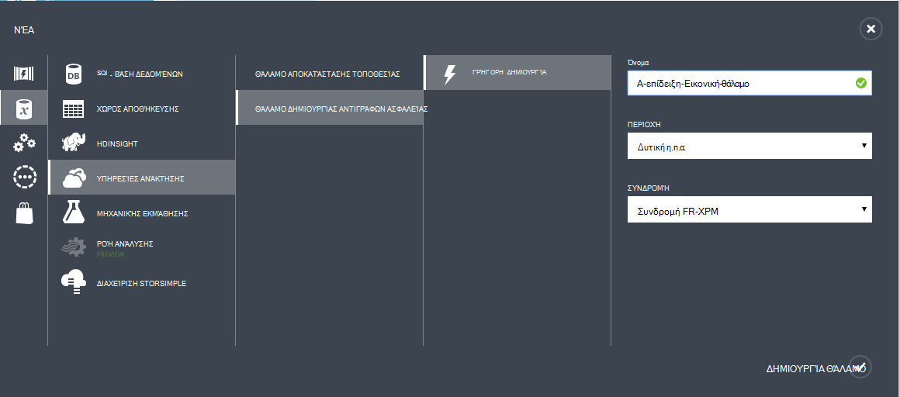
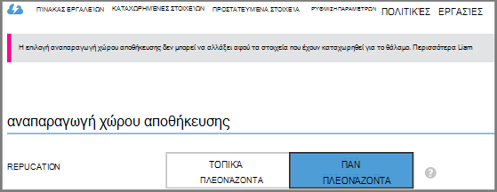
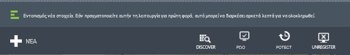
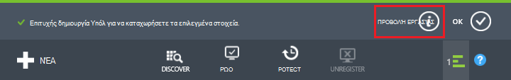
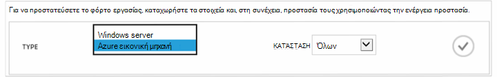
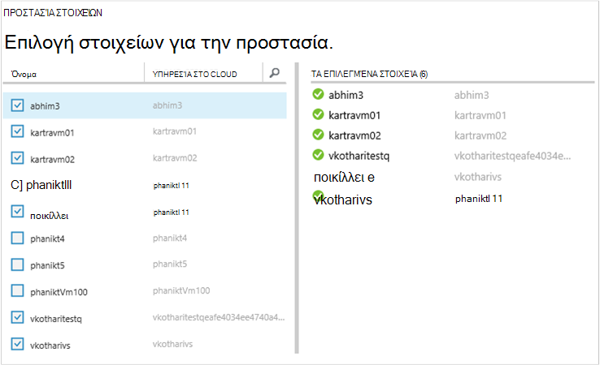
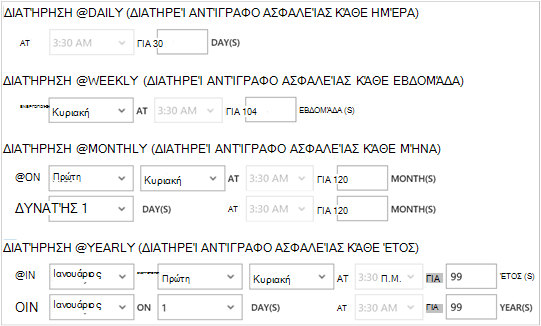
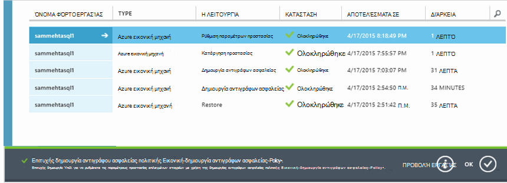
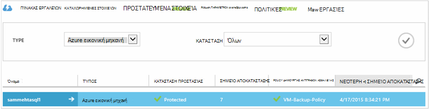

<properties
    pageTitle="Πρώτη ματιά: Προστασία ΣΠΣ Azure με ένα αντίγραφο ασφαλείας θάλαμο | Microsoft Azure"
    description="Προστασία ΣΠΣ Azure με θάλαμο δημιουργίας αντιγράφων ασφαλείας. Πρόγραμμα εκμάθησης εξηγεί δημιουργία θάλαμο, καταχώρηση ΣΠΣ, Δημιουργία πολιτικής και προστασία ΣΠΣ στο Azure."
    services="backup"
    documentationCenter=""
    authors="markgalioto"
    manager="cfreeman"
    editor=""/>

<tags
    ms.service="backup"
    ms.workload="storage-backup-recovery"
    ms.tgt_pltfrm="na"
    ms.devlang="na"
    ms.topic="hero-article"
    ms.date="09/15/2016"
    ms.author="markgal; jimpark"/>

# Πρώτα μια ματιά: δημιουργία αντιγράφων ασφαλείας Azure εικονικές μηχανές

> [AZURE.SELECTOR]
- [Προστασία ΣΠΣ με ένα θάλαμο υπηρεσίες ανάκτησης](backup-azure-vms-first-look-arm.md)
- [Προστασία ΣΠΣ Azure με ένα αντίγραφο ασφαλείας θάλαμο](backup-azure-vms-first-look.md)

Αυτό το πρόγραμμα εκμάθησης μεταφέρει τα βήματα για τη δημιουργία αντιγράφων ασφαλείας μια εικονική μηχανή Azure (Εικονική) ενός αντιγράφου ασφαλείας θάλαμο στο Azure. Σε αυτό το άρθρο περιγράφει το μοντέλο κλασική ή μοντέλο ανάπτυξης Service Manager, για τη δημιουργία αντιγράφων ασφαλείας ΣΠΣ. Εάν σας ενδιαφέρει τη δημιουργία αντιγράφων ασφαλείας μια Εικονική σε ένα θάλαμο υπηρεσίες ανάκτησης που ανήκει σε μια ομάδα πόρων, ανατρέξτε στο θέμα [πρώτα μια ματιά: προστασία ΣΠΣ με ένα θάλαμο υπηρεσίες ανάκτησης](backup-azure-vms-first-look-arm.md). Για να ολοκληρωθεί με επιτυχία αυτό το πρόγραμμα εκμάθησης, πρέπει να υπάρχει αυτές οι προϋποθέσεις:

- Έχετε δημιουργήσει μια Εικονική στο Azure τη συνδρομή σας.
- Η Εικονική έχει συνδεσιμότητας με Azure δημόσιων διευθύνσεων IP. Για περισσότερες πληροφορίες, ανατρέξτε στο θέμα [η συνδεσιμότητα του δικτύου](./backup-azure-vms-prepare.md#network-connectivity).

Για να δημιουργήσετε αντίγραφα ασφαλείας μια Εικονική, υπάρχουν πέντε βασικά βήματα:  

 δημιουργία ενός αντιγράφου ασφαλείας θάλαμο ή προσδιορίστε μια υπάρχουσα θάλαμο δημιουργίας αντιγράφων ασφαλείας.  
 χρησιμοποιήσουν την πύλη του Azure κλασική να ανακαλύψετε και να καταχωρήσετε τις εικονικές μηχανές.  
 εγκαταστήσετε τον παράγοντα Εικονική.  
 δημιουργήσετε την πολιτική για την προστασία των τις εικονικές μηχανές.  
 εκτελείτε τη δημιουργία αντιγράφων ασφαλείας.

>[AZURE.NOTE] Azure περιλαμβάνει δύο μοντέλων ανάπτυξης για τη δημιουργία και εργασία με πόρους: [Διαχείριση πόρων και κλασική](../resource-manager-deployment-model.md). Αυτό το πρόγραμμα εκμάθησης είναι για χρήση με το ΣΠΣ που μπορούν να δημιουργηθούν στην πύλη του Azure κλασική. Η υπηρεσία Azure δημιουργίας αντιγράφων ασφαλείας υποστηρίζει διαχείριση πόρων βάσει ΣΠΣ. Για λεπτομέρειες σχετικά με τη δημιουργία αντιγράφων ασφαλείας ΣΠΣ σε ένα θάλαμο υπηρεσίες ανάκτησης, ανατρέξτε στο θέμα [First Look: προστασία ΣΠΣ με ένα θάλαμο υπηρεσίες ανάκτησης](backup-azure-vms-first-look-arm.md).

## Βήμα 1 - Δημιουργήστε ένα αντίγραφο ασφαλείας θάλαμο για μια εικονική Μηχανή

Ένα αντίγραφο ασφαλείας θάλαμο είναι μια οντότητα που αποθηκεύει όλα τα αντίγραφα ασφαλείας και αποκατάστασης σημεία που έχουν δημιουργηθεί μέσα στο χρόνο. Το αντίγραφο ασφαλείας θάλαμο περιέχει επίσης τις πολιτικές ασφαλείας που εφαρμόζονται σε τις εικονικές μηχανές τη δημιουργία αντιγράφων ασφαλείας.

1. Είσοδος στην [πύλη του Azure κλασική](http://manage.windowsazure.com/).

2. Στην κάτω αριστερή γωνία της πύλης Azure, κάντε κλικ στην επιλογή **Δημιουργία**

    

3. Στον οδηγό γρήγορης δημιουργίας, κάντε κλικ στην επιλογή **Υπηρεσίες δεδομένων** > **Υπηρεσίες ανάκτησης** > **Θάλαμο δημιουργίας αντιγράφων ασφαλείας** > **Γρήγορης δημιουργίας**.

    

    Ο οδηγός σάς ζητά το **όνομα** και την **περιοχή**. Εάν διαχειρίζεστε περισσότερες από μία συνδρομές, εμφανίζεται ένα παράθυρο διαλόγου για να επιλέξετε τη συνδρομή.

4. **Όνομα**, πληκτρολογήστε ένα φιλικό όνομα για τον προσδιορισμό του θάλαμο. Το όνομα πρέπει να είναι μοναδικό για τη συνδρομή Azure.

5. Στην **περιοχή**, επιλέξτε τη γεωγραφική περιοχή για το θάλαμο. Το θάλαμο **πρέπει να** είναι στην ίδια περιοχή ως τις εικονικές μηχανές προστατεύει.

    Εάν δεν γνωρίζετε την περιοχή στην οποία υπάρχει σας Εικονική, κλείσετε τον οδηγό και κάντε κλικ στην επιλογή **εικονικές μηχανές** στη λίστα των υπηρεσιών Azure. Στήλη "θέση" παρέχει το όνομα της περιοχής. Εάν έχετε εικονικές μηχανές σε πολλές περιοχές, δημιουργήστε ένα αντίγραφο ασφαλείας θάλαμο σε κάθε περιοχή.

6. Εάν δεν υπάρχει καμία **συνδρομή στο** παράθυρο διαλόγου του οδηγού, μεταβείτε στο επόμενο βήμα. Εάν εργάζεστε με πολλές συνδρομές, επιλέξτε μια συνδρομή για να συσχετίσετε με το νέο θάλαμο δημιουργίας αντιγράφων ασφαλείας.

    

7. Κάντε κλικ στην επιλογή **Δημιουργία θάλαμο**. Ενδέχεται να χρειαστεί κάποιος χρόνος για το αντίγραφο ασφαλείας θάλαμο θα δημιουργηθεί. Παρακολουθείτε τις ειδοποιήσεις κατάστασης στο κάτω μέρος της πύλης.

    

    Ένα μήνυμα επιβεβαιώνει το θάλαμο δημιουργήθηκε με επιτυχία. Παρατίθεται στη σελίδα **υπηρεσίες ανάκτησης** ως **ενεργό**.

    

8. Στη λίστα των χώροι φύλαξης στη σελίδα **Υπηρεσίες ανάκτησης** , επιλέξτε το θάλαμο που δημιουργήσατε για να εμφανίσετε τη σελίδα **Γρήγορης εκκίνησης** .

    

9. Στη σελίδα **Γρήγορη εκκίνηση** , κάντε κλικ στην επιλογή **Ρύθμιση παραμέτρων** για να ανοίξετε την επιλογή αναπαραγωγή χώρου αποθήκευσης.
    

10. Σχετικά με την επιλογή **αναπαραγωγή χώρου αποθήκευσης** , ενεργοποιήστε την επιλογή αναπαραγωγή για το θάλαμο.

    

    Από προεπιλογή, το θάλαμο έχει παν πλεονάζοντα χώρο αποθήκευσης. Επιλέξτε παν πλεονάζοντα χώρο αποθήκευσης, εάν αυτό είναι το κύριο αντίγραφο ασφαλείας. Επιλέξτε τοπικά πλεονάζοντα χώρο αποθήκευσης, εάν θέλετε μια επιλογή κοστίζει που δεν είναι απολύτως ως διαρκή. Διαβάστε περισσότερα σχετικά με τις επιλογές αποθήκευσης παν πλεονάζοντα και τοπικά πλεονάζοντα στην [Επισκόπηση αναπαραγωγής Azure αποθήκευσης](../storage/storage-redundancy.md).

Αφού επιλέξετε την επιλογή αποθήκευσης για το θάλαμο, είστε έτοιμοι να συσχετίσετε την εικονική Μηχανή με το θάλαμο. Για να ξεκινήσετε τη συσχέτιση, ανακάλυψη και καταχώρηση του Azure εικονικές μηχανές.

## Βήμα 2 - εντοπισμός και εικονικές μηχανές Windows Azure καταχώρηση
Πριν από την καταχώρηση του Εικονική με ένα θάλαμο, εκτελέστε τη διαδικασία εντοπισμού για τον προσδιορισμό οποιαδήποτε νέα ΣΠΣ. Αυτό επιστρέφει μια λίστα με τις εικονικές μηχανές τη συνδρομή, μαζί με πρόσθετες πληροφορίες, όπως το όνομα της υπηρεσίας cloud και της περιοχής.

1. Είσοδος στην [πύλη κλασική Azure](http://manage.windowsazure.com/)

2. Στην κλασική Azure πύλη, κάντε κλικ στην επιλογή **Υπηρεσίες ανάκτησης** για να ανοίξετε τη λίστα των χώροι φύλαξης υπηρεσίες ανάκτησης.
    

3. Από τη λίστα των χώροι φύλαξης, επιλέξτε το θάλαμο για να δημιουργήσετε αντίγραφα ασφαλείας μια εικονική Μηχανή.

    Όταν επιλέγετε το θάλαμο, ανοίγει η σελίδα **Γρήγορης εκκίνησης**

4. Από το μενού θάλαμο, κάντε κλικ στην επιλογή **Στοιχεία που έχουν καταχωρηθεί**.

    

5. Από το μενού " **Τύπος** ", επιλέξτε **Azure εικονική μηχανή**.

    

6. Κάντε κλικ στην επιλογή **ΠΕΡΙΉΓΗΣΗ** στο κάτω μέρος της σελίδας.
    

    Η διαδικασία εντοπισμού ενδέχεται να χρειαστούν μερικά λεπτά, ενώ είναι που πινακοποιημένη τις εικονικές μηχανές. Υπάρχει μια ειδοποίηση στο κάτω μέρος της οθόνης που σας επιτρέπει να γνωρίζετε ότι η διεργασία εκτελείται.

    

    Ολοκληρώστε τις αλλαγές ειδοποίηση όταν η διαδικασία.

    

7. Κάντε κλικ στην επιλογή **ΚΑΤΑΧΏΡΗΣΗ** στο κάτω μέρος της σελίδας.
    

8. Στο μενού συντόμευσης **Καταχώρηση στοιχείων** , επιλέξτε τις εικονικές μηχανές που θέλετε για την καταχώρηση.

    >[AZURE.TIP] Πολλές εικονικές μηχανές μπορεί να έχει εγγραφεί σε μία φορά.

    Δημιουργείται μια εργασία για κάθε εικονική μηχανή που έχετε επιλέξει.

9. Κάντε κλικ στην επιλογή **Προβολή έργου** στην ειδοποίηση για να μεταβείτε στη σελίδα " **εργασίες** ".

    

    Η εικονική μηχανή εμφανίζεται επίσης στη λίστα των εγγεγραμμένων στοιχεία, μαζί με την κατάσταση της διαδικασίας εγγραφής.

    

    Όταν ολοκληρωθεί η λειτουργία, τις αλλαγές κατάστασης ώστε να αντικατοπτρίζει το μέλος που *έχουν καταχωρηθεί* .

    

## Βήμα 3 - εγκαταστήσετε τον παράγοντα Εικονική σε η εικονική μηχανή

Ο παράγοντας Εικονική Azure πρέπει να έχει εγκατασταθεί στον υπολογιστή εικονικές Azure για την επέκταση δημιουργίας αντιγράφων ασφαλείας για να εργαστείτε. Εάν σας Εικονική δημιουργήθηκε από τη συλλογή Azure, τον παράγοντα Εικονική υπάρχει ήδη στην η Εικονική. Μπορείτε να παραλείψετε για την [προστασία σας ΣΠΣ](backup-azure-vms-first-look.md#step-4-protect-azure-virtual-machines).

Εάν σας Εικονική μετεγκατάσταση από ένα κέντρο δεδομένων εσωτερικής εγκατάστασης, την εικονική Μηχανή μάλλον δεν έχετε εγκαταστήσει τον παράγοντα Εικονική. Πρέπει να εγκαταστήσετε τον παράγοντα Εικονική στον υπολογιστή εικονικές πριν να συνεχίσετε να προστατεύσετε την εικονική Μηχανή. Για λεπτομερείς οδηγίες σχετικά με την εγκατάσταση τον παράγοντα Εικονική, ανατρέξτε στην [ενότητα παράγοντας Εικονική αυτού του άρθρου ΣΠΣ δημιουργίας αντιγράφων ασφαλείας](backup-azure-vms-prepare.md#vm-agent).

## Βήμα 4 - Δημιουργία αντιγράφου ασφαλείας της πολιτικής
Πριν να ενεργοποιήσετε την αρχική εργασίας δημιουργίας αντιγράφων ασφαλείας, ορίστε την επιλογή χρονοδιάγραμμα όταν λαμβάνονται στιγμιότυπα δημιουργίας αντιγράφων ασφαλείας. Το χρονοδιάγραμμα όταν λαμβάνονται στιγμιότυπα δημιουργίας αντιγράφων ασφαλείας και το χρονικό διάστημα αυτά τα στιγμιότυπα διατηρούνται, είναι η πολιτική ασφαλείας. Οι πληροφορίες διατήρησης βασίζεται σε συνδυασμό παππού-πατέρας-γιο περιστροφής δημιουργίας αντιγράφων ασφαλείας.

1. Μεταβείτε το αντίγραφο ασφαλείας θάλαμο στην περιοχή **Υπηρεσίες ανάκτησης** στην πύλη του κλασική Azure και κάντε κλικ στα **Στοιχεία που έχουν καταχωρηθεί**.
2. Επιλέξτε **Azure εικονική μηχανή** από το αναπτυσσόμενο μενού.

    

3. Κάντε κλικ στην επιλογή **ΠΡΟΣΤΑΣΊΑ** στο κάτω μέρος της σελίδας.
    

    **Προστασία στοιχείων οδηγού** εμφανίζεται και παραθέτει *μόνο* εικονικές μηχανές που έχουν καταχωρηθεί και δεν προστατεύεται.

    

4. Επιλέξτε τις εικονικές μηχανές που θέλετε να προστατεύσετε.

    Εάν υπάρχουν δύο ή περισσότερες εικονικές μηχανές με το ίδιο όνομα, χρησιμοποιήστε την υπηρεσία Cloud για να διακρίνουν τις εικονικές μηχανές.

5. Στο μενού **προστασία με ρύθμιση παραμέτρων** , επιλέξτε μια υπάρχουσα πολιτική ή δημιουργήστε μια νέα πολιτική για την προστασία του εικονικές μηχανές που προσδιορίσατε.

    Νέα χώροι φύλαξης δημιουργίας αντιγράφων ασφαλείας έχει μια προεπιλεγμένη πολιτική που σχετίζεται με το θάλαμο. Αυτή η πολιτική λαμβάνει μια ημερήσια στιγμιότυπο κάθε βραδινές και το στιγμιότυπο διατηρούνται για 30 ημέρες. Κάθε πολιτική αντιγράφων ασφαλείας μπορούν να έχουν πολλές εικονικές μηχανές που σχετίζονται με αυτό. Ωστόσο, η εικονική μηχανή μπορεί μόνο να συσχετίζεται με μία πολιτικής κάθε φορά.

    

    >[AZURE.NOTE] Μια πολιτική ασφαλείας περιλαμβάνει ένα συνδυασμό διατήρησης για την προγραμματισμένη δημιουργία αντιγράφων ασφαλείας. Εάν επιλέξετε μια υπάρχουσα πολιτική ασφαλείας, δεν θα μπορείτε να τροποποιήσετε τις επιλογές διατήρησης στο επόμενο βήμα.

6. Στην **Περιοχή διατήρησης** ορίζουν την ημερήσια, εβδομαδιαία, μηνιαία και ετήσια εμβέλεια για τα συγκεκριμένα σημεία δημιουργίας αντιγράφων ασφαλείας.

    

    Πολιτική διατήρησης Καθορίζει τη διάρκεια του χρόνου για την αποθήκευση αντιγράφου ασφαλείας. Μπορείτε να καθορίσετε οι πολιτικές διατήρησης διαφορετική βάση όταν ορίζεται ως το αντίγραφο ασφαλείας.

7. Κάντε κλικ στην επιλογή **εργασίες** για να προβάλετε τη λίστα εργασιών **Προστασία με ρύθμιση παραμέτρων** .

    

    Τώρα που έχετε δημιουργήσει την πολιτική, μεταβείτε στο επόμενο βήμα και εκτελέστε το αρχικό αντίγραφο ασφαλείας.

## Βήμα 5 - αρχικό δημιουργίας αντιγράφων ασφαλείας

Όταν μια εικονική μηχανή είναι προστατευμένο με μια πολιτική, μπορείτε να προβάλετε αυτή τη σχέση στην καρτέλα **Προστασία στοιχείων** . Μέχρι το αρχικό αντίγραφο ασφαλείας που προκύπτει, εμφανίζει την **Κατάσταση προστασίας** ως **προστατευμένης - (εκκρεμεί αρχικό αντίγραφο ασφαλείας)**. Από προεπιλογή, το πρώτο προγραμματισμένη δημιουργία αντιγράφων ασφαλείας είναι το *αρχικό αντίγραφο ασφαλείας*.

Για να ξεκινήσετε το αρχικό αντίγραφο ασφαλείας τώρα:

1. Στη σελίδα **Προστασία στοιχείων** , κάντε κλικ στην επιλογή **Άμεση δημιουργία αντιγράφων ασφαλείας** στο κάτω μέρος της σελίδας.
    

    Η υπηρεσία Azure δημιουργίας αντιγράφων ασφαλείας δημιουργεί μια εργασία αντιγράφου ασφαλείας για το αρχικό λειτουργία δημιουργίας αντιγράφων ασφαλείας.

2. Κάντε κλικ στην καρτέλα " **εργασίες** " για να προβάλετε τη λίστα εργασιών.

    

    Μόλις ολοκληρωθεί η αρχική δημιουργία αντιγράφων ασφαλείας, την κατάσταση του η εικονική μηχανή στην καρτέλα **Προστασία στοιχείων** είναι *προστατευμένο*.

    

    >[AZURE.NOTE] Δημιουργία αντιγράφων ασφαλείας εικονικές μηχανές είναι μια τοπική διαδικασία. Που δεν είναι δυνατό να δημιουργήσετε αντίγραφα ασφαλείας εικονικές μηχανές από μία περιοχή σε ένα αντίγραφο ασφαλείας θάλαμο σε μια άλλη περιοχή. Επομένως, για κάθε περιοχή Azure που έχει ΣΠΣ που πρέπει να δημιουργηθεί αντίγραφο ασφαλείας, πρέπει να δημιουργηθεί τουλάχιστον μία θάλαμο αντιγράφου ασφαλείας σε αυτήν την περιοχή.

## Επόμενα βήματα
Τώρα που δημιουργήσατε με επιτυχία αντίγραφα ασφαλείας μια Εικονική, υπάρχουν αρκετές επόμενα βήματα που θα μπορούσαν να σας ενδιαφέρουν. Το πιο λογικό βήμα είναι να εξοικειωθείτε με την επαναφορά των δεδομένων σε μια Εικονική. Ωστόσο, υπάρχουν εργασίες διαχείρισης που θα σας βοηθήσει να κατανοήσετε τον τρόπο για να διατηρήσετε τα δεδομένα σας ασφαλή και να ελαχιστοποιήσετε κόστους.

- [Διαχείριση και την παρακολούθηση σας εικονικές μηχανές](backup-azure-manage-vms.md)
- [Επαναφορά εικονικές μηχανές](backup-azure-restore-vms.md)
- [Οδηγίες αντιμετώπισης προβλημάτων](backup-azure-vms-troubleshoot.md)

## Ερωτήσεις;
Εάν έχετε ερωτήσεις ή εάν υπάρχει οποιαδήποτε δυνατότητα που θέλετε να δείτε περιλαμβάνονται, [στείλτε μας τα σχόλιά](http://aka.ms/azurebackup_feedback).
