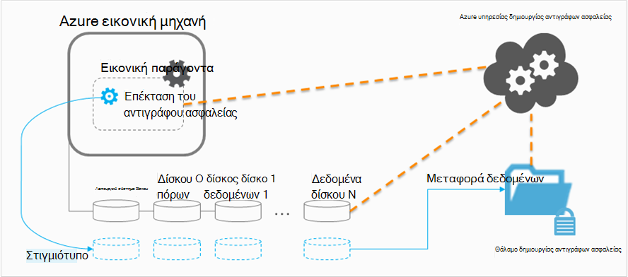

<properties
    pageTitle="Σχεδιασμός δημιουργίας αντιγράφων ασφαλείας υποδομής σας Εικονική στο Azure | Microsoft Azure"
    description="Σημαντικά θέματα κατά το σχεδιασμό για να δημιουργήσετε αντίγραφα ασφαλείας εικονικές μηχανές στο Azure"
    services="backup"
    documentationCenter=""
    authors="markgalioto"
    manager="cfreeman"
    editor=""
    keywords="Δημιουργία αντιγράφων ασφαλείας ΣΠΣ, δημιουργία αντιγράφων ασφαλείας εικονικές μηχανές"/>

<tags
    ms.service="backup"
    ms.workload="storage-backup-recovery"
    ms.tgt_pltfrm="na"
    ms.devlang="na"
    ms.topic="article"
    ms.date="10/19/2016"
    ms.author="trinadhk; jimpark; markgal;"/>

# <a name="plan-your-vm-backup-infrastructure-in-azure"></a>Σχεδιασμός δημιουργίας αντιγράφων ασφαλείας υποδομής σας Εικονική στο Azure
Σε αυτό το άρθρο παρέχει επιδόσεις και προτάσεις πόρων για να σας βοηθήσει να σχεδιάσετε την υποδομή αντιγράφου ασφαλείας σας Εικονική. Καθορίζει επίσης κλειδιού πτυχές της υπηρεσίας δημιουργίας αντιγράφων ασφαλείας. αυτά τα στοιχεία μπορεί να είναι κρίσιμης στον καθορισμό την αρχιτεκτονική, σχεδιασμού και προγραμματισμού. Εάν έχετε [προετοιμασμένοι το περιβάλλον](backup-azure-vms-prepare.md), αυτό είναι το επόμενο βήμα πριν να αρχίσετε [να ΣΠΣ δημιουργίας αντιγράφων ασφαλείας](backup-azure-vms.md). Εάν χρειάζεστε περισσότερες πληροφορίες σχετικά με το Azure εικονικές μηχανές, ανατρέξτε στην [τεκμηρίωση εικονικές μηχανές](https://azure.microsoft.com/documentation/services/virtual-machines/).

## <a name="how-does-azure-back-up-virtual-machines"></a>Πώς γνωρίζει το Azure αντίγραφα ασφαλείας εικονικές μηχανές;
Όταν η υπηρεσία Azure αντιγράφου ασφαλείας ξεκινά μια εργασία αντιγράφου ασφαλείας κατά την προγραμματισμένη ώρα, ενεργοποιεί την επέκταση δημιουργίας αντιγράφων ασφαλείας για να καταγράψετε ένα στιγμιότυπο σε δεδομένη χρονική στιγμή. Αυτό το στιγμιότυπο λαμβάνεται σε συντονισμό με την υπηρεσία αντίγραφο σκιά τόμου (VSS) για να λάβετε μια συνεπή στιγμιότυπο των δίσκων στο η εικονική μηχανή χωρίς να χρειάζεται να τερματίσετε τη λειτουργία του.

Αφού το στιγμιότυπο λαμβάνεται, τα δεδομένα μεταφέρεται από την υπηρεσία Azure αντιγράφου ασφαλείας του αντιγράφου ασφαλείας θάλαμο. Για να κάνετε πιο αποτελεσματική η διαδικασία δημιουργίας αντιγράφων ασφαλείας, η υπηρεσία προσδιορίζει και μεταφέρει μόνο τα μπλοκ δεδομένων που έχουν αλλάξει από το τελευταίο αντίγραφο ασφαλείας.



Όταν ολοκληρωθεί η μεταφορά δεδομένων, καταργείται το στιγμιότυπο και δημιουργείται ένα σημείο αποκατάστασης.

### <a name="data-consistency"></a>Συνέπεια δεδομένων
Δημιουργία αντιγράφων ασφαλείας και επαναφορά επιχειρήσεις είναι περίπλοκο κρίσιμων δεδομένων από το γεγονός ότι πρέπει να δημιουργηθούν αντίγραφα κρίσιμων επιχειρηματικών δεδομένων κατά τις εφαρμογές που παράγει τα δεδομένα εκτελούνται. Για να το αντιμετωπίσετε, δημιουργία αντιγράφων ασφαλείας Azure παρέχει συνεπή εφαρμογή δημιουργίας αντιγράφων ασφαλείας για φόρτους εργασίας του Microsoft χρησιμοποιώντας VSS για να βεβαιωθείτε ότι έχει εγγραφεί δεδομένα σωστά με το χώρο αποθήκευσης.

>[AZURE.NOTE] Για Linux εικονικές μηχανές, μόνο αρχείο συνεπή δημιουργίας αντιγράφων ασφαλείας που είναι διαθέσιμες, επειδή το Linux δεν διαθέτει μια ισοδύναμη πλατφόρμα για VSS.

Azure δημιουργίας αντιγράφων ασφαλείας τίθεται σε πλήρη αντίγραφα ασφαλείας VSS σε Windows ΣΠΣ (Διαβάστε περισσότερα σχετικά με το [πλήρες αντίγραφο ασφαλείας VSS](http://blogs.technet.com/b/filecab/archive/2008/05/21/what-is-the-difference-between-vss-full-backup-and-vss-copy-backup-in-windows-server-2008.aspx)). Για να ενεργοποιήσετε την VSS αντίγραφα ασφαλείας, την κάτω από το μητρώο πρέπει να οριστούν σε η Εικονική κλειδιού.

```
[HKEY_LOCAL_MACHINE\SOFTWARE\MICROSOFT\BCDRAGENT]
"USEVSSCOPYBACKUP"="TRUE"
```


Αυτός ο πίνακας εξηγεί τους τύπους των συνέπειας και τις συνθήκες που προκύπτουν στην περιοχή κατά τη διάρκεια Εικονική Azure αντιγράφων ασφαλείας και επαναφοράς διαδικασίες.

| Συνέπειας | Βάσει VSS | Επεξήγηση και λεπτομέρειες |
|-------------|-----------|---------|
| Εφαρμογή συνέπειας | Ναι | Αυτός είναι ο τύπος ιδανική συνέπειας για φόρτους εργασίας του Microsoft, όπως το εξασφαλίζει ότι:<ol><li> Η Εικονική *Εκκίνηση*. <li>Υπάρχει *κανένα κατεστραμμένο*. <li>Υπάρχει *καμία απώλεια δεδομένων*.<li> Τα δεδομένα είναι συνεπείς με την εφαρμογή που χρησιμοποιεί τα δεδομένα, με που αφορούν την εφαρμογή κατά το χρόνο δημιουργίας αντιγράφων ασφαλείας--χρησιμοποιώντας VSS.</ol> Οι περισσότερες φόρτους εργασίας του Microsoft έχουν εγγραφές VSS που εκτελεί ενέργειες σχετικές με φόρτο εργασίας που σχετίζονται με συνέπεια δεδομένων. Για παράδειγμα, Microsoft SQL Server διαθέτει ένα πρόγραμμα εγγραφής VSS. που εξασφαλίζει ότι οι εγγραφές για το αρχείο καταγραφής συναλλαγών και τη βάση δεδομένων γίνονται σωστά.<br><br> Για Εικονική Azure αντίγραφα ασφαλείας, γρήγορα ένα σημείο συνεπή εφαρμογή αποκατάστασης σημαίνει ότι την επέκταση αντιγράφου ασφαλείας ήταν μπορείτε να καλέσετε τη ροή εργασίας VSS και να ολοκληρωθεί *σωστά* πριν το στιγμιότυπο Εικονική τραβήξατε. Φυσικά, αυτό σημαίνει ότι οι δημιουργοί VSS του όλες τις εφαρμογές σε η Εικονική Azure έχουν ενεργοποιηθεί καθώς και.<br><br>(Μάθετε τα [βασικά στοιχεία του VSS](http://blogs.technet.com/b/josebda/archive/2007/10/10/the-basics-of-the-volume-shadow-copy-service-vss.aspx) και εμβάθυνση βαθύ σε τις λεπτομέρειες του [τρόπου λειτουργίας](https://technet.microsoft.com/library/cc785914%28v=ws.10%29.aspx)του). |
| Συνέπειας του συστήματος αρχείων | Ναι - για υπολογιστές με Windows | Υπάρχουν δύο σενάρια όπου το σημείο αποκατάστασης μπορεί να είναι *συνεπείς αρχείο συστήματος*:<ul><li>Δημιουργία αντιγράφων ασφαλείας του ΣΠΣ Linux στο Azure, επειδή το Linux δεν διαθέτει μια ισοδύναμη πλατφόρμα για VSS.<li>Αποτυχία VSS κατά τη διάρκεια δημιουργίας αντιγράφων ασφαλείας για τα Windows ΣΠΣ στο Azure.</li></ul> Και στις δύο αυτές τις περιπτώσεις, η καλύτερη που μπορεί να γίνει είναι να διασφαλιστεί ότι: <ol><li> Η Εικονική *Εκκίνηση*. <li>Υπάρχει *κανένα κατεστραμμένο*.<li>Υπάρχει *καμία απώλεια δεδομένων*.</ol> Εφαρμογές πρέπει να υλοποιήσετε το δικό τους μηχανισμό "επιδιόρθωση προς τα επάνω" στην καρτέλα επαναφέρει δεδομένα.|
| Σφάλμα συνέπειας | Όχι | Αυτή η κατάσταση είναι ισοδύναμο με μια εικονική μηχανή αντιμετωπίζει "σφάλμα" (μέσω είτε μια απαλή σκληρό επαναφορά ή). Αυτό συμβαίνει συνήθως όταν η εικονική μηχανή Azure τερματίζεται τη στιγμή της δημιουργίας αντιγράφων ασφαλείας. Για αντίγραφα ασφαλείας Azure εικονική μηχανή, γρήγορα ένα μέσο σημείο σφάλμα συνεπή αποκατάστασης που αντίγραφο ασφαλείας Azure παρέχει εγγυήσεις γύρω από τη συνέπεια των δεδομένων στο μέσο αποθήκευσης--είτε από την πλευρά του λειτουργικού συστήματος ή από την προοπτική της εφαρμογής. Μόνο τα δεδομένα που υπάρχει ήδη στο δίσκο τη στιγμή της δημιουργίας αντιγράφων ασφαλείας είναι τι λαμβάνει καταγράφονται και αντίγραφα ασφαλείας. <br/> <br/> Όταν υπάρχουν εγγυήσεις, στις περισσότερες περιπτώσεις, θα ξεκινήσει το λειτουργικό σύστημα. Αυτό συνήθως ακολουθείται από μια διαδικασία εξέτασης δίσκου, όπως το chkdsk, για να διορθώσετε σφάλματα καταστροφή. Τα δεδομένα στη μνήμη ή οι εγγραφές που δεν έχουν γίνει εκκαθάριση πλήρως στο δίσκο θα χαθούν. Η εφαρμογή ακολουθεί συνήθως με το δικό του μηχανισμού επαλήθευσης σε περίπτωση που η επαναφορά δεδομένων πρέπει να γίνει. <br><br>Ως παράδειγμα, εάν το αρχείο καταγραφής συναλλαγών περιλαμβάνει καταχωρήσεις που δεν υπάρχουν στη βάση δεδομένων, τότε το λογισμικό της βάσης δεδομένων δεν μιας επαναφοράς μέχρι να τα δεδομένα είναι συνεπείς. Όταν δεδομένων εκτείνεται σε πολλές εικονικών δίσκων (όπως διευρυμένο όγκους), ένα σημείο σφάλμα συνεπή αποκατάστασης παρέχει εγγυήσεις για της ακρίβειας των δεδομένων.|


## <a name="performance-and-resource-utilization"></a>Χρήση της απόδοσης και πόρων
Όπως το λογισμικό δημιουργίας αντιγράφων ασφαλείας που είναι ανεπτυγμένη εσωτερικής εγκατάστασης, θα πρέπει να σχεδιάζετε δυναμικότητας και χρήση των πόρων ανάγκες κατά τη δημιουργία αντιγράφων ασφαλείας ΣΠΣ στο Azure. Τα [όρια χώρου αποθήκευσης Azure](azure-subscription-service-limits.md#storage-limits) ορίσετε τον τρόπο για να δομήσετε αναπτύξεις Εικονική για να λάβετε μέγιστη απόδοση με ελάχιστη επίδραση στα φόρτους εργασίας που εκτελούνται.

Προσέξτε τα ακόλουθα όρια χώρου αποθήκευσης Azure κατά το σχεδιασμό επιδόσεις των αντιγράφων ασφαλείας:

- Max εξόδου ανά λογαριασμού χώρου αποθήκευσης
- Συνολικό αίτηση χρεώσεις ανά λογαριασμού χώρου αποθήκευσης

### <a name="storage-account-limits"></a>Όρια χώρου αποθήκευσης λογαριασμού
Κάθε φορά που δεδομένα αντιγράφου ασφαλείας αντιγράφεται από ένα λογαριασμό του χώρου αποθήκευσης, μετρά προς τις λειτουργίες εισόδου/εξόδου ανά δευτερόλεπτο (IOP Προέλευσης) και εξόδου (ή μετάδοσης) μετρικά του λογαριασμού χώρου αποθήκευσης. Την ίδια στιγμή, τις εικονικές μηχανές είναι εκτελείται και κατανάλωση IOP Προέλευσης και απόδοση. Ο στόχος είναι να διασφαλίσετε ότι η συνολική κίνηση - δημιουργίας αντιγράφων ασφαλείας και εικονικού υπολογιστή - δεν υπερβαίνει τα όρια χώρου αποθήκευσης λογαριασμού.

### <a name="number-of-disks"></a>Αριθμός δίσκων
Η διαδικασία δημιουργίας αντιγράφων ασφαλείας προσπαθεί να ολοκληρώσετε μια εργασία αντιγράφου ασφαλείας συντομότερο δυνατό. Σε αυτήν την περίπτωση, το καταναλώνει όσες πόρους μπορεί. Ωστόσο, όλες οι λειτουργίες εισόδου/εξόδου είναι περιορισμένο από *Μετάδοσης προορισμού για μία μόνο Blob*, που έχει όριο 60 MB ανά δευτερόλεπτο. Σε μια προσπάθεια για να μεγιστοποιήσετε την ταχύτητα, η διαδικασία δημιουργίας αντιγράφων ασφαλείας προσπαθεί να δημιουργήσετε αντίγραφα ασφαλείας κάθε ένα από τα Εικονική δίσκων *παράλληλα*. Έτσι, εάν μια Εικονική έχει τέσσερις δίσκων, στη συνέχεια, Azure δημιουργίας αντιγράφων ασφαλείας προσπαθεί να δημιουργήσετε αντίγραφα ασφαλείας όλων των τέσσερις δίσκων παράλληλα. Αυτόν το λόγο, ο πιο σημαντικός παράγοντας Καθορισμός αντιγράφου ασφαλείας κίνηση έξοδο ενός λογαριασμού πελάτη χώρου αποθήκευσης είναι ο **αριθμός των δίσκων** δημιουργείται αντίγραφο ασφαλείας από το λογαριασμό χώρου αποθήκευσης.

### <a name="backup-schedule"></a>Χρονοδιάγραμμα δημιουργίας αντιγράφων ασφαλείας
Ένας επιπλέον παράγοντας που επηρεάζει επιδόσεων είναι το **Χρονοδιάγραμμα δημιουργίας αντιγράφων ασφαλείας**. Εάν ρυθμίζετε τις παραμέτρους των πολιτικών, ώστε όλα ΣΠΣ δημιουργούνται αντίγραφα ασφαλείας για την ίδια στιγμή, έχετε προγραμματίσει μια εμπλοκή κίνηση. Η διαδικασία δημιουργίας αντιγράφων ασφαλείας θα επιχειρήσει να δημιουργήσετε αντίγραφα ασφαλείας όλων των δίσκων παράλληλα. Ένας τρόπος για να μειώσετε την κίνηση του αντιγράφου ασφαλείας από ένα λογαριασμό του χώρου αποθήκευσης είναι - βεβαιωθείτε ότι διαφορετικές ΣΠΣ δημιουργούνται αντίγραφα ασφαλείας σε διαφορετικές ώρες της ημέρας, με μην επικαλύπτονται.

## <a name="capacity-planning"></a>Σχεδιασμός δυνατοτήτων
Μαζί με όλα τα στοιχεία αυτά σημαίνει ότι η χρήση του λογαριασμού χώρου αποθήκευσης πρέπει να είναι προγραμματισμένη σωστά. Κάντε λήψη του [Εικονική αντιγράφου ασφαλείας χωρητικότητα σχεδιασμού υπολογιστικό φύλλο του Excel](https://gallery.technet.microsoft.com/Azure-Backup-Storage-a46d7e33) για να δείτε την επίδραση των δίσκου και επιλογές χρονοδιαγράμματος δημιουργίας αντιγράφων ασφαλείας.

### <a name="backup-throughput"></a>Μετάδοσης δημιουργίας αντιγράφων ασφαλείας
Για κάθε δίσκο τη δημιουργία αντιγράφων ασφαλείας, αντιγράφου ασφαλείας Azure διαβάζει τα μπλοκ στο δίσκο και αποθηκεύει μόνο τα δεδομένα που άλλαξαν (προσαύξησης). Αυτός ο πίνακας εμφανίζει τις τιμές μέση ταχύτητα ότι μπορείτε να περιμένετε από Azure αντίγραφο ασφαλείας. Με αυτό, μπορείτε να υπολογίσετε το σύνολο του χρόνου που θα χρειαστεί να δημιουργήσετε αντίγραφα ασφαλείας ένα δίσκο ενός δεδομένου μεγέθους.

| Λειτουργία δημιουργίας αντιγράφων ασφαλείας | Καλύτερης μετάδοσης |
| ---------------- | ---------- |
| Αρχικό αντίγραφο ασφαλείας | 160 Mbps |
| Δημιουργία αντιγράφων ασφαλείας προσαύξησης (DR) | 640 Mbps <br><br> Αυτό μετάδοσης μπορεί να μειωθεί σημαντικά εάν υπάρχουν πολλά διεσπαρμένη churn στο δίσκο που πρέπει να δημιουργηθεί αντίγραφο ασφαλείας. |

## <a name="total-vm-backup-time"></a>Συνολικός χρόνος δημιουργίας αντιγράφων ασφαλείας Εικονική
Ενώ ένα μεγαλύτερο μέρος του χρόνου δημιουργίας αντιγράφων ασφαλείας είναι που αναλώθηκε σε ανάγνωσης και αντιγραφή δεδομένων, υπάρχουν άλλες λειτουργίες που συνεισφέρουν τον συνολικό χρόνο που χρειάζεται να δημιουργήσετε αντίγραφα ασφαλείας μια Εικονική:

- Χρόνο που χρειάζεται να [εγκαταστήσετε ή να ενημερώσετε την επέκταση δημιουργίας αντιγράφων ασφαλείας](backup-azure-vms.md#offline-vms).
- Χρόνος στιγμιότυπου, το οποίο είναι ο χρόνος που λαμβάνονται για να ενεργοποιήσετε ένα στιγμιότυπο. Στιγμιότυπα ενεργοποιούνται κοντά την προγραμματισμένη ώρα δημιουργίας αντιγράφων ασφαλείας.
- Χρόνος αναμονής στην ουρά. Επειδή η υπηρεσία δημιουργίας αντιγράφων ασφαλείας επεξεργάζεται αντίγραφα ασφαλείας από πολλούς πελάτες, η αντιγραφή δεδομένων αντιγράφων ασφαλείας στιγμιότυπου στο αντίγραφο ασφαλείας ή θάλαμο υπηρεσίες ανάκτησης μπορεί να μην ξεκινά αμέσως. Σε ώρες της κορυφής φόρτωση, την αναμονή να απομακρύνετε τις άκρες έως 8 ώρες λόγω τον αριθμό των αντιγράφων ασφαλείας που υποβάλλεται σε επεξεργασία. Ωστόσο, ο συνολικός χρόνος δημιουργίας αντιγράφων ασφαλείας Εικονική θα είναι μικρότερη από 24 ώρες για τις πολιτικές ημερήσιων δημιουργίας αντιγράφων ασφαλείας.

## <a name="best-practices"></a>Βέλτιστες πρακτικές
Προτείνουμε να τα παρακολουθείτε αυτές τις πρακτικές κατά τη ρύθμιση παραμέτρων δημιουργίας αντιγράφων ασφαλείας για εικονικές μηχανές:

- Δεν Προγραμματισμός περισσότερα από τέσσερα κλασική ΣΠΣ από την ίδια υπηρεσία cloud για να δημιουργήσετε αντίγραφα ασφαλείας την ίδια στιγμή. Προτείνουμε να αναπτυγμένη παράθεση ώρες έναρξης αντιγράφου ασφαλείας κατά ώρα, εάν θέλετε να δημιουργήσετε αντίγραφα ασφαλείας ΣΠΣ πολλά από ίδια υπηρεσία στο cloud.
- Δεν να προγραμματίσετε περισσότερους από 40 ΣΠΣ αναπτυχθεί από διαχειριστή πόρων για να δημιουργήσετε αντίγραφα ασφαλείας την ίδια στιγμή.
- Προγραμματισμός δημιουργίας αντιγράφων ασφαλείας Εικονική κατά τις ώρες μη αιχμής, ώστε η υπηρεσία δημιουργίας αντιγράφων ασφαλείας χρησιμοποιεί IOP Προέλευσης για τη μεταφορά δεδομένων από το λογαριασμό του πελάτη χώρου αποθήκευσης για τη δημιουργία αντιγράφων ασφαλείας ή υπηρεσίες ανάκτησης φύλαξης.
- Βεβαιωθείτε ότι μια πολιτική διευθύνσεων ΣΠΣ που εκτείνεται λογαριασμούς διαφορετικό χώρο αποθήκευσης. Προτείνουμε να τα λιγότερα από 20 σύνολο δίσκων από ένα λογαριασμό μόνο αποθήκευσης προστατεύονται από μια πολιτική. Εάν έχετε μεγαλύτερη από 20 δίσκων σε ένα λογαριασμό του χώρου αποθήκευσης, που εκτείνεται αυτά τα ΣΠΣ πολλές πολιτικές για να λάβετε την απαιτούμενη IOP Προέλευσης κατά τη φάση μεταφορά της διαδικασίας δημιουργίας αντιγράφων ασφαλείας.
- Μην επαναφέρετε μια Εικονική εκτελούνται στο χώρο αποθήκευσης Premium στο ίδιο λογαριασμό χώρου αποθήκευσης. Εάν η διαδικασία επαναφοράς λειτουργίας συμπίπτει με τη λειτουργία δημιουργίας αντιγράφων ασφαλείας, μειώνει το διαθέσιμο IOP Προέλευσης για δημιουργία αντιγράφων ασφαλείας.
- Συνιστάται να εκτελείται κάθε Εικονική Premium σε ένα λογαριασμό του χώρου αποθήκευσης distinct premium για να διασφαλίσετε τη βέλτιστη απόδοση δημιουργίας αντιγράφων ασφαλείας.

## <a name="data-encryption"></a>Κρυπτογράφηση δεδομένων

Azure δημιουργίας αντιγράφων ασφαλείας δεν κρυπτογραφούνται τα δεδομένα ως μέρος της διαδικασίας δημιουργίας αντιγράφων ασφαλείας. Ωστόσο, μπορείτε να κρυπτογράφηση δεδομένων εντός του Εικονική και αντίγραφα ασφαλείας των δεδομένων προστατευμένο απρόσκοπτα (Διαβάστε περισσότερα σχετικά με το [αντίγραφο ασφαλείας των κρυπτογραφημένων δεδομένων](backup-azure-vms-encryption.md)).


## <a name="how-are-protected-instances-calculated"></a>Με ποιον τρόπο υπολογίζονται προστατευμένο παρουσίες;
Azure εικονικές μηχανές οι οποίες δημιουργούνται αντίγραφα ασφαλείας μέσω αντίγραφο ασφαλείας Azure υπόκεινται σε [τιμές Azure δημιουργίας αντιγράφων ασφαλείας](https://azure.microsoft.com/pricing/details/backup/). Προστατευμένο παρουσίες υπολογισμού βασίζεται σε το *πραγματικό* μέγεθος του το εικονικό υπολογιστή, που είναι το άθροισμα όλων των δεδομένων σε η εικονική μηχανή--εξαίρεση ο δίσκος"Πόρος".

Είστε *δεν* χρεώνεται με βάση το μέγιστο μέγεθος που υποστηρίζεται για κάθε δίσκο δεδομένων που έχουν επισυναφθεί σε η εικονική μηχανή, αλλά τα πραγματικά στοιχεία που είναι αποθηκευμένα στο δίσκο δεδομένων. Ομοίως, τιμολόγιο αποθήκευσης αντιγράφων ασφαλείας είναι με βάση την ποσότητα των δεδομένων που είναι αποθηκευμένα με Azure δημιουργίας αντιγράφων ασφαλείας, ποιο είναι το άθροισμα των τα πραγματικά δεδομένα σε κάθε σημείο αποκατάστασης.

Για παράδειγμα, λαμβάνουν μια τυπική A2 μεγέθους εικονικό μηχάνημα που έχει δύο δίσκων πρόσθετα δεδομένα με μέγιστο μέγεθος 1 TB. Ο παρακάτω πίνακας παρέχει τα πραγματικά δεδομένα που είναι αποθηκευμένα σε κάθε μία από αυτές τις δίσκων:

|Τύπος δίσκου|Μέγιστο μέγεθος|Παρουσίαση πραγματικά δεδομένα|
|---------|--------|------|
| Δίσκο του λειτουργικού συστήματος | 1023 GB | 17 GB |
| Στον τοπικό δίσκο / δίσκου πόρων | 135 GB | 5 GB (δεν συμπεριλαμβάνεται για δημιουργία αντιγράφων ασφαλείας) |
| Ο δίσκος δεδομένων 1 | 1023 GB | 30 GB |
| Δίσκο δεδομένων 2 | 1023 GB | 0 GB |

Το *πραγματικό* μέγεθος του η εικονική μηχανή είναι σε αυτήν την περίπτωση 17 GB + 30 GB + 0 GB = 47 GB. Αυτό γίνεται το μέγεθος προστατευμένη παρουσία που βασίζεται σε μηνιαία τιμολόγιο. Καθώς εξελίσσεται η ποσότητα των δεδομένων σε η εικονική μηχανή, το μέγεθος προστατευμένη παρουσία που χρησιμοποιείται για χρέωσης επίσης θα αλλάξει αντίστοιχα.

Χρέωση δεν ξεκινά μέχρι να ολοκληρωθεί η πρώτη επιτυχημένη δημιουργία αντιγράφου ασφαλείας. Σε αυτό το σημείο, θα ξεκινήσει η χρέωση για το χώρο αποθήκευσης και προστατευμένη παρουσίες. Χρέωση συνεχίζει με την προϋπόθεση ότι υπάρχει *οποιαδήποτε δεδομένα αντιγράφου ασφαλείας αποθηκεύονται με Azure αντιγράφου ασφαλείας* για την εικονική μηχανή. Εκτέλεση της λειτουργίας Διακοπή προστασίας διακοπεί η χρέωση, εάν διατηρούνται τα δεδομένα αντιγράφου ασφαλείας.

Η χρέωση για μια καθορισμένη εικονική μηχανή θα διακοπεί μόνο εάν η προστασία είναι διακοπεί *και* διαγράφεται και οποιαδήποτε δεδομένα αντιγράφου ασφαλείας. Όταν υπάρχουν χωρίς ενεργών εργασιών δημιουργίας αντιγράφων ασφαλείας (όταν έχει διακοπεί προστασίας), το μέγεθος της η εικονική μηχανή κατά τη διάρκεια του το τελευταίο επιτυχές αντίγραφο ασφαλείας είναι το μέγεθος προστατευμένη παρουσία που βασίζεται σε μηνιαία τιμολόγιο.

## <a name="questions"></a>Ερωτήσεις;
Εάν έχετε ερωτήσεις ή εάν υπάρχει οποιαδήποτε δυνατότητα που θέλετε να δείτε περιλαμβάνονται, [στείλτε μας τα σχόλιά](http://aka.ms/azurebackup_feedback).

## <a name="next-steps"></a>Επόμενα βήματα

- [Δημιουργία αντιγράφου ασφαλείας εικονικές μηχανές](backup-azure-vms.md)
- [Διαχείριση εικονική μηχανή δημιουργίας αντιγράφων ασφαλείας](backup-azure-manage-vms.md)
- [Επαναφορά εικονικές μηχανές](backup-azure-restore-vms.md)
- [Αντιμετώπιση προβλημάτων δημιουργίας αντιγράφων ασφαλείας Εικονική](backup-azure-vms-troubleshoot.md)
