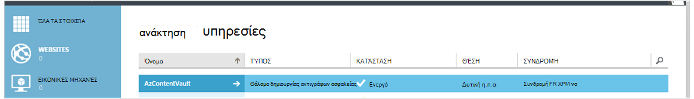

<properties
    pageTitle="Προετοιμασία του περιβάλλοντός σας για να δημιουργήσετε αντίγραφα ασφαλείας Azure εικονικές μηχανές | Microsoft Azure"
    description="Βεβαιωθείτε ότι το περιβάλλον σας είναι έτοιμη για τη δημιουργία αντιγράφων ασφαλείας εικονικές μηχανές στο Azure"
    services="backup"
    documentationCenter=""
    authors="markgalioto"
    manager="cfreeman"
    editor=""
    keywords="Δημιουργία αντιγράφων ασφαλείας; Δημιουργία αντιγράφων ασφαλείας;"/>

<tags
    ms.service="backup"
    ms.workload="storage-backup-recovery"
    ms.tgt_pltfrm="na"
    ms.devlang="na"
    ms.topic="article"
    ms.date="08/26/2016"
    ms.author="trinadhk; jimpark; markgal;"/>


# <a name="prepare-your-environment-to-back-up-azure-virtual-machines"></a>Προετοιμάσετε το περιβάλλον σας για να δημιουργήσετε αντίγραφα ασφαλείας Azure εικονικές μηχανές

> [AZURE.SELECTOR]
- [Μοντέλο διαχείρισης πόρων](backup-azure-arm-vms-prepare.md)
- [Κλασική μοντέλο](backup-azure-vms-prepare.md)

Πριν να μπορείτε να δημιουργήσετε αντίγραφα ασφαλείας μια εικονική μηχανή Azure (Εικονική), υπάρχουν τρία συνθήκες που πρέπει να υπάρχει.

- Πρέπει να δημιουργήσετε ένα αντίγραφο ασφαλείας θάλαμο ή προσδιορίστε μια υπάρχουσα αντιγράφου ασφαλείας θάλαμο *στην ίδια περιοχή ως Εικονική σας*.
- Σύνδεση του δικτύου μεταξύ Azure δημόσιες διευθύνσεις Internet και τα τελικά σημεία Azure χώρου αποθήκευσης.
- Εγκαταστήστε τον παράγοντα Εικονική στη την εικονική Μηχανή.

Εάν γνωρίζετε αυτές τις συνθήκες που υπάρχουν ήδη στο περιβάλλον σας, στη συνέχεια, συνεχίστε με τη [Δημιουργία αντιγράφου ασφαλείας σας άρθρο ΣΠΣ](backup-azure-vms.md). Διαφορετικά, συνεχίστε την ανάγνωση, αυτό το άρθρο θα σας καθοδηγήσει τα βήματα για να προετοιμάσετε το περιβάλλον σας για να δημιουργήσετε αντίγραφα ασφαλείας Εικονική μηχανή Azure.


## <a name="limitations-when-backing-up-and-restoring-a-vm"></a>Περιορισμοί κατά τη δημιουργία αντιγράφων ασφαλείας και επαναφορά μια εικονική Μηχανή

>[AZURE.NOTE] Azure περιλαμβάνει δύο μοντέλων ανάπτυξης για τη δημιουργία και εργασία με πόρους: [Διαχείριση πόρων και κλασική](../resource-manager-deployment-model.md). Η παρακάτω λίστα παρέχει τους περιορισμούς κατά την ανάπτυξη του μοντέλου κλασική.

- Δημιουργία αντιγράφων ασφαλείας εικονικές μηχανές με περισσότερους από 16 δίσκων δεδομένων δεν υποστηρίζεται.
- Δημιουργία αντιγράφων ασφαλείας εικονικές μηχανές με μια δεσμευμένη διεύθυνση IP και χωρίς ορισμένο τελικού σημείου δεν υποστηρίζεται.
- Δεδομένα αντιγράφου ασφαλείας δεν περιλαμβάνει δικτύου τοποθετηθεί μονάδες που έχουν επισυναφθεί σε Εικονική. 
- Αντικατάσταση ενός υπάρχοντος εικονική μηχανή κατά τη διάρκεια της επαναφοράς δεν υποστηρίζεται. Πρώτα να διαγράψετε την υπάρχουσα εικονική μηχανή και τις σχετικές δίσκων και, στη συνέχεια, να επαναφέρετε τα δεδομένα από το αντίγραφο ασφαλείας.
- Περιοχή σταυρό δημιουργίας αντιγράφων ασφαλείας και επαναφοράς δεν υποστηρίζεται.
- Δημιουργία αντιγράφων ασφαλείας εικονικές μηχανές, χρησιμοποιώντας την υπηρεσία δημιουργίας αντιγράφων ασφαλείας Azure υποστηρίζεται σε όλες τις δημόσιες περιοχές του Azure (δείτε τη [λίστα ελέγχου](https://azure.microsoft.com/regions/#services) των περιοχών υποστηριζόμενες). Εάν η περιοχή που αναζητάτε δεν υποστηρίζεται σήμερα, δεν θα εμφανίζεται στην αναπτυσσόμενη λίστα κατά τη δημιουργία θάλαμο.
- Δημιουργία αντιγράφων ασφαλείας εικονικές μηχανές, χρησιμοποιώντας την υπηρεσία δημιουργίας αντιγράφων ασφαλείας Azure υποστηρίζεται μόνο για τις εκδόσεις Επιλέξτε λειτουργικό σύστημα:
  - **Linux**: Azure δημιουργίας αντιγράφων ασφαλείας υποστηρίζει [μια λίστα διανομής που έχουν γίνει δεκτοί από Azure](../virtual-machines/virtual-machines-linux-endorsed-distros.md) εκτός από τις βασικές λειτουργικό σύστημα Linux. Επίσης άλλες κατανομές μεταφορά-σας-κάτοχος-Linux ενδέχεται να λειτουργούν με την προϋπόθεση ότι ο παράγοντας Εικονική είναι διαθέσιμο στον υπολογιστή εικονικές και η υποστήριξη για Python υπάρχει.
  - **Windows Server**: εκδόσεις παλαιότερων από Windows Server 2008 R2 δεν υποστηρίζονται.
- Επαναφορά ενός ελεγκτή τομέα Εικονική (ελεγκτή Τομέα) που είναι μέρος μιας ρύθμισης παραμέτρων πολλούς Συνεχούς υποστηρίζεται μόνο μέσω του PowerShell. Διαβάστε περισσότερα σχετικά με την [Επαναφορά ενός ελεγκτή τομέα πολλούς-ελεγκτή Τομέα](backup-azure-restore-vms.md#restoring-domain-controller-vms).
- Επαναφορά εικονικές μηχανές που έχουν τις ακόλουθες ρυθμίσεις παραμέτρων ειδική δικτύου υποστηρίζεται μόνο μέσω του PowerShell. ΣΠΣ που δημιουργείτε χρησιμοποιώντας τη ροή εργασίας επαναφοράς το περιβάλλον εργασίας χρήστη δεν θα έχουν αυτές τις ρυθμίσεις παραμέτρων δικτύου, μετά την ολοκλήρωση της λειτουργίας επαναφοράς. Για περισσότερες πληροφορίες, ανατρέξτε στο θέμα [Επαναφορά ΣΠΣ με ρυθμίσεις παραμέτρων ειδική δικτύου](backup-azure-restore-vms.md#restoring-vms-with-special-netwrok-configurations).
    - Εικονικές μηχανές στην περιοχή ρύθμιση παραμέτρων εξισορρόπησης φορτίου (εσωτερικές και εξωτερικές)
    - Εικονικές μηχανές με πολλαπλές διευθύνσεις IP δεσμευμένες
    - Εικονικές μηχανές με πολλών προσαρμογέων δικτύου

## <a name="create-a-backup-vault-for-a-vm"></a>Δημιουργία ενός αντιγράφου ασφαλείας θάλαμο για μια εικονική Μηχανή

Ένα αντίγραφο ασφαλείας θάλαμο είναι μια οντότητα που αποθηκεύει όλα τα αντίγραφα ασφαλείας και αποκατάστασης σημεία που έχουν δημιουργηθεί μέσα στο χρόνο. Το αντίγραφο ασφαλείας θάλαμο περιέχει επίσης τις πολιτικές δημιουργίας αντιγράφων ασφαλείας που θα εφαρμοστεί σε τις εικονικές μηχανές τη δημιουργία αντιγράφων ασφαλείας.

Η εικόνα αυτή δείχνει τις σχέσεις μεταξύ των διαφόρων οντοτήτων αντίγραφο ασφαλείας Azure:     

Για να δημιουργήσετε ένα αντίγραφο ασφαλείας θάλαμο:

1. Είσοδος στην [πύλη του Azure](http://manage.windowsazure.com/).

2. Στην πύλη του Azure, κάντε κλικ στην επιλογή **Δημιουργία** > **Ενοποίησης υβριδική** > **δημιουργίας αντιγράφων ασφαλείας**. Όταν κάνετε κλικ στο **αντίγραφο ασφαλείας**, θα αυτόματη εναλλαγή στην πύλη του κλασική (εμφανίζεται μετά τη σημείωση).

    

    >[AZURE.NOTE] Εάν τη συνδρομή σας στο τελευταίο που χρησιμοποιήθηκε στην πύλη του κλασική, στη συνέχεια, τη συνδρομή σας ενδέχεται να ανοίξει στην κλασική πύλη. Σε αυτό το συμβάν, για να δημιουργήσετε ένα αντίγραφο ασφαλείας θάλαμο, κάντε κλικ στην επιλογή **Δημιουργία** > **Υπηρεσίες δεδομένων** > **Υπηρεσίες ανάκτησης** > **Αντιγράφου ασφαλείας θάλαμο** > **Γρήγορης δημιουργίας** (ανατρέξτε στο θέμα η παρακάτω εικόνα).

    

3. **Όνομα**, πληκτρολογήστε ένα φιλικό όνομα για τον προσδιορισμό του θάλαμο. Το όνομα πρέπει να είναι μοναδικό για τη συνδρομή Azure. Πληκτρολογήστε ένα όνομα που περιέχει μεταξύ 2 και 50 χαρακτήρων. Πρέπει να ξεκινούν με γράμμα και μπορούν να περιέχουν μόνο γράμματα, αριθμούς και παύλες.

4. Στην **περιοχή**, επιλέξτε τη γεωγραφική περιοχή για το θάλαμο. Το θάλαμο πρέπει να είναι στην ίδια περιοχή ως τις εικονικές μηχανές που θέλετε να προστατεύσετε. Εάν έχετε εικονικές μηχανές σε πολλές περιοχές, πρέπει να δημιουργήσετε ένα αντίγραφο ασφαλείας θάλαμο σε κάθε περιοχή. Δεν χρειάζεται για να καθορίσετε τους λογαριασμούς χώρου αποθήκευσης για να αποθηκεύσετε τα δεδομένα αντιγράφου ασφαλείας--το θάλαμο δημιουργίας αντιγράφων ασφαλείας και της δημιουργίας αντιγράφων ασφαλείας Azure λαβής υπηρεσίας αυτό αυτόματα.

5. **Συνδρομή** , επιλέξτε τη συνδρομή που θέλετε να συσχετίσετε με το αντίγραφο ασφαλείας θάλαμο. Θα υπάρξει πολλαπλές επιλογές μόνο εάν είναι συσχετισμένη με πολλές συνδρομές Azure τον εταιρικό λογαριασμό σας.

6. Κάντε κλικ στην επιλογή **Δημιουργία θάλαμο**. Ενδέχεται να χρειαστεί κάποιος χρόνος για το αντίγραφο ασφαλείας θάλαμο θα δημιουργηθεί. Παρακολουθείτε τις ειδοποιήσεις κατάστασης στο κάτω μέρος της πύλης.

    

7. Ένα μήνυμα θα Επιβεβαιώστε ότι το θάλαμο δημιουργήθηκε με επιτυχία. Αυτό θα εμφανίζεται στη σελίδα **υπηρεσίες ανάκτησης** ως **ενεργό**. Βεβαιωθείτε ότι για να επιλέξετε το δικαίωμα επιλογή πλεονασμού κατάλληλη αποθήκευση αφού δημιουργηθεί το θάλαμο. Διαβάστε περισσότερα σχετικά με [τη ρύθμιση στην επιλογή πλεονασμού χώρου αποθήκευσης του αντιγράφου ασφαλείας θάλαμο](backup-configure-vault.md#azure-backup---storage-redundancy-options).

    

8. Κάντε κλικ στην επιλογή το θάλαμο δημιουργίας αντιγράφων ασφαλείας για να μεταβείτε στη σελίδα **Γρήγορης εκκίνησης** , όπου εμφανίζονται οι τις οδηγίες για τη δημιουργία αντιγράφων ασφαλείας Azure εικονικές μηχανές.

    


## <a name="network-connectivity"></a>Η συνδεσιμότητα του δικτύου

Για να διαχειριστείτε τα στιγμιότυπα Εικονική, την επέκταση του αντιγράφου ασφαλείας πρέπει συνδεσιμότητας με το Azure δημόσιων διευθύνσεων IP. Χωρίς το σωστό σύνδεση στο Internet, για αιτήσεις χρονικού ορίου HTTP η εικονική μηχανή και αποτύχει η λειτουργία δημιουργίας αντιγράφων ασφαλείας. Εάν την ανάπτυξη έχει περιορισμούς πρόσβασης στη θέση (μέσω δικτύου ομάδας ασφαλείας (NSG), για παράδειγμα), στη συνέχεια, επιλέξτε μία από αυτές τις επιλογές για την παροχή μια διαδρομή Απαλοιφή για την κίνηση δημιουργίας αντιγράφων ασφαλείας:

- [Περιοχές IP του κέντρου δεδομένων του Azure Whitelist](http://www.microsoft.com/en-us/download/details.aspx?id=41653) - ανατρέξτε στο άρθρο για οδηγίες σε πώς να whitelist τις διευθύνσεις IP.
- Για να αναπτύξετε ένα διακομιστή μεσολάβησης HTTP για τη δρομολόγηση της κίνησης.

Όταν αποφασίζετε για την επιλογή για να χρησιμοποιήσετε, το τα ανταλλάγματα είναι μεταξύ διαχειρισιμότητα, λεπτομερούς ελέγχου και του κόστους.

|Επιλογή|Τα πλεονεκτήματα|Μειονεκτήματα|
|------|----------|-------------|
|Περιοχές διευθύνσεων IP Whitelist| Χωρίς πρόσθετο κόστος.<br><br>Για το άνοιγμα πρόσβαση σε μια NSG, χρησιμοποιήστε το cmdlet <i>Set-AzureNetworkSecurityRule</i> . | Σύνθετη για τη Διαχείριση ως το επηρεαζόμενη περιοχές διευθύνσεων IP αλλάζουν μέσα στο χρόνο.<br><br>Παρέχει πρόσβαση το σύνολο του Azure και όχι μόνο χώρου αποθήκευσης.|
|Διακομιστής μεσολάβησης HTTP| Λεπτομερές έλεγχο στο διακομιστή μεσολάβησης διευθύνσεις URL του χώρου αποθήκευσης που επιτρέπονται.<br>Πρόσβαση μόνο σημείο Internet ΣΠΣ.<br>Δεν υπόκεινται σε αλλαγές διεύθυνση Azure IP.| Πρόσθετο κόστος για την εκτέλεση μια Εικονική με το λογισμικό διακομιστή μεσολάβησης.|

### <a name="whitelist-the-azure-datacenter-ip-ranges"></a>Περιοχές διευθύνσεων IP Whitelist το Azure κέντρο δεδομένων

Για να whitelist τις περιοχές διευθύνσεων IP του κέντρου δεδομένων του Azure, ανατρέξτε στο θέμα την [τοποθεσία Web του Azure](http://www.microsoft.com/en-us/download/details.aspx?id=41653) για λεπτομέρειες σε περιοχές διευθύνσεων IP και οδηγίες.

### <a name="using-an-http-proxy-for-vm-backups"></a>Χρήση ενός διακομιστή μεσολάβησης HTTP για αντίγραφα ασφαλείας εικονική Μηχανή
Κατά τη δημιουργία αντιγράφων ασφαλείας μια εικονική Μηχανή, την επέκταση αντιγράφου ασφαλείας σε την εικονική Μηχανή στέλνει τις εντολές διαχείρισης στιγμιότυπο αποθήκευσης Azure χρησιμοποιώντας ένα API HTTPS. Δρομολόγηση την κυκλοφορία επέκταση δημιουργίας αντιγράφων ασφαλείας μέσω του διακομιστή μεσολάβησης HTTP, αφού είναι το μόνο στοιχείο που έχει ρυθμιστεί για πρόσβαση στο Internet δημόσια.

>[AZURE.NOTE] Δεν υπάρχει καμία σύσταση για το λογισμικό διακομιστή μεσολάβησης που πρέπει να χρησιμοποιούνται. Βεβαιωθείτε ότι επιλέγετε ένα διακομιστή μεσολάβησης που είναι συμβατή με τα παρακάτω βήματα ρύθμισης παραμέτρων.

Η παρακάτω εικόνα παράδειγμα δείχνει τα βήματα τρία ρύθμισης παραμέτρων είναι απαραίτητο να χρησιμοποιήσετε ένα διακομιστή μεσολάβησης HTTP:

- Εικονική εφαρμογή δρομολογεί όλη την κυκλοφορία HTTP δεσμευμένο για τη δημόσια Internet μέσω διακομιστή μεσολάβησης Εικονική.
- Διακομιστής μεσολάβησης Εικονική επιτρέπει εισερχόμενη κυκλοφορία από ΣΠΣ στο εικονικό δίκτυο.
- Η ομάδα ασφαλείας δικτύου (NSG) με το όνομα NSF κλειδωμένες ανάγκες ενός χρεογράφου κανόνα επιτρέποντας εξερχόμενη κυκλοφορία Internet από το διακομιστή μεσολάβησης Εικονική.


Για να χρησιμοποιήσετε ένα διακομιστή μεσολάβησης HTTP για επικοινωνία δημόσια στο Internet, ακολουθήστε τα παρακάτω βήματα:

#### <a name="step-1-configure-outgoing-network-connections"></a>Βήμα 1. Ρύθμιση παραμέτρων εξερχόμενες συνδέσεις δικτύου
###### <a name="for-windows-machines"></a>Για υπολογιστές των Windows
Αυτό θα ρυθμίσετε ρύθμισης παραμέτρων διακομιστή μεσολάβησης για το λογαριασμό τοπικό σύστημα.

1. Λήψη [PsExec](https://technet.microsoft.com/sysinternals/bb897553)
2. Εκτέλεση παρακάτω εντολή από αναβαθμισμένη εντολών,

     ```
     psexec -i -s "c:\Program Files\Internet Explorer\iexplore.exe"
     ```
     Θα ανοίξει το παράθυρο του internet explorer.
3. Μεταβείτε στα Εργαλεία -> Επιλογές Internet -> συνδέσεις -> Ρυθμίσεις LAN.
4. Επαληθεύστε τις ρυθμίσεις διακομιστή μεσολάβησης για το λογαριασμό συστήματος. Ρύθμιση διακομιστή μεσολάβησης IP και τη θύρα.
5. Κλείστε τον Internet Explorer.

Αυτό θα ρυθμιστεί για μια ρύθμιση παραμέτρων διακομιστή μεσολάβησης ολόκληρο τον υπολογιστή και θα χρησιμοποιηθεί για οποιαδήποτε εξερχόμενη κυκλοφορία HTTP/HTTPS.

Εάν έχετε ρύθμιση διακομιστή μεσολάβησης σε έναν τρέχοντα λογαριασμό χρήστη (όχι ένα τοπικό λογαριασμό συστήματος), χρησιμοποιήστε την ακόλουθη δέσμη ενεργειών για να εφαρμόσετε τις SYSTEMACCOUNT:

```
   $obj = Get-ItemProperty -Path Registry::”HKEY_CURRENT_USER\Software\Microsoft\Windows\CurrentVersion\Internet Settings\Connections"
   Set-ItemProperty -Path Registry::”HKEY_USERS\S-1-5-18\Software\Microsoft\Windows\CurrentVersion\Internet Settings\Connections" -Name DefaultConnectionSettings -Value $obj.DefaultConnectionSettings
   Set-ItemProperty -Path Registry::”HKEY_USERS\S-1-5-18\Software\Microsoft\Windows\CurrentVersion\Internet Settings\Connections" -Name SavedLegacySettings -Value $obj.SavedLegacySettings
   $obj = Get-ItemProperty -Path Registry::”HKEY_CURRENT_USER\Software\Microsoft\Windows\CurrentVersion\Internet Settings"
   Set-ItemProperty -Path Registry::”HKEY_USERS\S-1-5-18\Software\Microsoft\Windows\CurrentVersion\Internet Settings" -Name ProxyEnable -Value $obj.ProxyEnable
   Set-ItemProperty -Path Registry::”HKEY_USERS\S-1-5-18\Software\Microsoft\Windows\CurrentVersion\Internet Settings" -Name Proxyserver -Value $obj.Proxyserver
```

>[AZURE.NOTE] Εάν παρατηρήσετε "(407) διακομιστή μεσολάβησης απαιτείται έλεγχος ταυτότητας" στο αρχείο καταγραφής του διακομιστή μεσολάβησης, ελέγξτε το authrntication έχει ρυθμιστεί σωστά.

######<a name="for-linux-machines"></a>Για υπολογιστές Linux

Προσθέστε την ακόλουθη γραμμή για να το ```/etc/environment``` αρχείο:

```
http_proxy=http://<proxy IP>:<proxy port>
```

Προσθέστε τις ακόλουθες γραμμές για να το ```/etc/waagent.conf``` αρχείο:

```
HttpProxy.Host=<proxy IP>
HttpProxy.Port=<proxy port>
```

#### <a name="step-2-allow-incoming-connections-on-the-proxy-server"></a>Βήμα 2. Να επιτρέπονται οι εισερχόμενες συνδέσεις στο διακομιστή μεσολάβησης:

1. Στο διακομιστή μεσολάβησης, ανοίξτε το τείχος προστασίας των Windows. Ο ευκολότερος τρόπος για να αποκτήσετε πρόσβαση το τείχος προστασίας είναι για να πραγματοποιήσετε αναζήτηση για το τείχος προστασίας των Windows με ασφάλεια για προχωρημένους.

    

2. Στο παράθυρο διαλόγου τείχος προστασίας των Windows, κάντε δεξί κλικ σε **Κανόνες εισερχομένων** και κάντε κλικ στην επιλογή **Δημιουργία κανόνα...**.

    

3. **Οδηγός νέου κανόνα εισερχομένων**, επιλέξτε **Προσαρμογή** για τον **Τύπο κανόνα** και κάντε κλικ στο κουμπί **Επόμενο**.

4. Στη σελίδα για να επιλέξετε το **πρόγραμμα**, επιλέξτε **Όλα τα προγράμματα** και κάντε κλικ στο κουμπί **Επόμενο**.

5. Στη σελίδα **πρωτόκολλο και τις θύρες** , εισαγάγετε τις παρακάτω πληροφορίες και κάντε κλικ στην επιλογή **Επόμενο**:

    

    - για το *πρωτόκολλο type* , επιλέξτε *TCP*
    - για *τοπική θύρα* επιλέξτε *Συγκεκριμένες θύρες*, στο παρακάτω πεδίο, καθορίστε το ```<Proxy Port>``` που έχει ρυθμιστεί.
    - *Απομακρυσμένη θύρα* επιλέξτε *Θύρες όλων*

    Για τα υπόλοιπα βήματα του οδηγού, κάντε κλικ στην επιλογή μέχρι το τέλος και ονομάστε αυτόν τον κανόνα.

#### <a name="step-3-add-an-exception-rule-to-the-nsg"></a>Βήμα 3. Προσθήκη κανόνα εξαίρεσης σε το NSG:

Σε μια γραμμή εντολών του PowerShell Azure, εισαγάγετε την ακόλουθη εντολή:

Την παρακάτω εντολή προσθέτει μια εξαίρεση το NSG. Η εξαίρεση αυτή επιτρέπει την κυκλοφορία TCP από οποιαδήποτε θύρα στον 10.0.0.5 σε οποιαδήποτε διεύθυνση Internet στη θύρα 80 (HTTP) ή 443 (HTTPS). Εάν χρειάζεστε μια συγκεκριμένη θύρα σε δημόσια στο Internet, φροντίστε να προσθέσετε αυτήν τη θύρα για να το ```-DestinationPortRange``` καθώς και.

```
Get-AzureNetworkSecurityGroup -Name "NSG-lockdown" |
Set-AzureNetworkSecurityRule -Name "allow-proxy " -Action Allow -Protocol TCP -Type Outbound -Priority 200 -SourceAddressPrefix "10.0.0.5/32" -SourcePortRange "*" -DestinationAddressPrefix Internet -DestinationPortRange "80-443"
```

*Βεβαιωθείτε ότι έχετε αντικαταστήσει τα ονόματα στο παράδειγμα με τις λεπτομέρειες που είναι κατάλληλη για την ανάπτυξη.*


## <a name="vm-agent"></a>Εικονική παράγοντα

Πριν μπορείτε να δημιουργήσετε αντίγραφα ασφαλείας του Azure εικονική μηχανή, θα πρέπει να βεβαιωθείτε ότι ο παράγοντας Εικονική Azure έχει εγκατασταθεί σωστά στον υπολογιστή εικονική. Επειδή ο παράγοντας Εικονική είναι προαιρετικό στοιχείο τη στιγμή που δημιουργείται η εικονική μηχανή, βεβαιωθείτε ότι είναι επιλεγμένο το πλαίσιο ελέγχου για τον παράγοντα Εικονική πριν από την παροχή της υπηρεσίας η εικονική μηχανή.

### <a name="manual-installation-and-update"></a>Μη αυτόματη εγκατάσταση και ενημέρωση

Ο παράγοντας Εικονική υπάρχει ήδη στο ΣΠΣ που έχουν δημιουργηθεί από τη συλλογή Azure. Ωστόσο, εικονικές μηχανές που μετεγκαθίστανται από κέντρα δεδομένων εσωτερικής εγκατάστασης δεν θα έχει εγκαταστήσει τον παράγοντα Εικονική. Για τέτοιου είδους ΣΠΣ, τον παράγοντα Εικονική πρέπει να έχει εγκατασταθεί ρητά. Διαβάστε περισσότερα σχετικά με [την εγκατάσταση τον παράγοντα Εικονική σε μια υπάρχουσα Εικονική](http://blogs.msdn.com/b/mast/archive/2014/04/08/install-the-vm-agent-on-an-existing-azure-vm.aspx).

| **Η λειτουργία** | **Windows** | **Linux** |
| --- | --- | --- |
| Κατά την εγκατάσταση του παράγοντα εικονική Μηχανή | <li>Λήψη και εγκατάσταση τον [παράγοντα MSI](http://go.microsoft.com/fwlink/?LinkID=394789&clcid=0x409). Θα χρειαστείτε δικαιώματα διαχειριστή για να ολοκληρώσετε την εγκατάσταση. <li>[Ενημερώστε την ιδιότητα Εικονική](http://blogs.msdn.com/b/mast/archive/2014/04/08/install-the-vm-agent-on-an-existing-azure-vm.aspx) για να υποδείξει ότι έχει εγκατασταθεί τον παράγοντα. | <li> Εγκαταστήστε την πιο πρόσφατη [παράγοντας Linux](https://github.com/Azure/WALinuxAgent) από GitHub. Θα χρειαστείτε δικαιώματα διαχειριστή για να ολοκληρώσετε την εγκατάσταση. <li> [Ενημερώστε την ιδιότητα Εικονική](http://blogs.msdn.com/b/mast/archive/2014/04/08/install-the-vm-agent-on-an-existing-azure-vm.aspx) για να υποδείξει ότι έχει εγκατασταθεί τον παράγοντα. |
| Ενημέρωση τον παράγοντα Εικονική | Ενημέρωση τον παράγοντα Εικονική είναι τόσο απλή όσο η επανεγκατάσταση τα [δυαδικά δεδομένα παράγοντας Εικονική](http://go.microsoft.com/fwlink/?LinkID=394789&clcid=0x409). <br><br>Βεβαιωθείτε ότι δεν υπάρχει λειτουργία δημιουργίας αντιγράφων ασφαλείας εκτελείται κατά τον παράγοντα Εικονική ενημερώνεται. | Ακολουθήστε τις οδηγίες σχετικά με την [Ενημέρωση τον παράγοντα Εικονική Linux ](../virtual-machines-linux-update-agent.md). <br><br>Βεβαιωθείτε ότι δεν υπάρχει λειτουργία δημιουργίας αντιγράφων ασφαλείας εκτελείται κατά τον παράγοντα Εικονική ενημερώνεται. |
| Επικύρωση της εγκατάστασης παράγοντας Εικονική | <li>Μεταβείτε στο φάκελο *C:\WindowsAzure\Packages* σε η Εικονική Azure. <li>Πρέπει να βρείτε το αρχείο WaAppAgent.exe παρουσίαση.<li> Κάντε δεξί κλικ στο αρχείο, μεταβείτε στις **Ιδιότητες**και, στη συνέχεια, επιλέξτε την καρτέλα **Λεπτομέρειες** . Το πεδίο έκδοση προϊόντος θα πρέπει να είναι 2.6.1198.718 ή νεότερη έκδοση. | Δ/Υ |


Μάθετε σχετικά με την [Εικονική παράγοντας](https://go.microsoft.com/fwLink/?LinkID=390493&clcid=0x409) και [πώς μπορείτε να το εγκαταστήσετε](https://azure.microsoft.com/blog/2014/04/15/vm-agent-and-extensions-part-2/).

### <a name="backup-extension"></a>Επέκταση του αντιγράφου ασφαλείας

Για να δημιουργήσετε αντίγραφα ασφαλείας η εικονική μηχανή, η υπηρεσία αντίγραφο ασφαλείας Azure εγκαθιστά μια επέκταση στον παράγοντα Εικονική. Η υπηρεσία Azure αντιγράφου ασφαλείας αναβαθμίζει απρόσκοπτα και ενημερώσεις κώδικα την επέκταση δημιουργίας αντιγράφων ασφαλείας χωρίς την παρέμβαση του χρήστη επιπλέον.

Η επέκταση του αντιγράφου ασφαλείας έχει εγκατασταθεί εάν εκτελείται η Εικονική. Μια Εικονική εκτελείται παρέχει επίσης η μεγαλύτερη πιθανότητα γρήγορα ένα σημείο συνεπή εφαρμογή αποκατάστασης. Ωστόσο, το αντίγραφο ασφαλείας Azure υπηρεσία θα συνεχίσει να δημιουργήσετε αντίγραφα ασφαλείας του Εικονική--ακόμα και αν είναι απενεργοποιημένη και την επέκταση δεν ήταν δυνατό να εγκατασταθεί (ή χωρίς σύνδεση Εικονική). Σε αυτήν την περίπτωση, το σημείο αποκατάστασης θα είναι *συνεπή σφάλμα* , όπως περιγράφεται παραπάνω.


## <a name="questions"></a>Ερωτήσεις;
Εάν έχετε ερωτήσεις ή εάν υπάρχει οποιαδήποτε δυνατότητα που θέλετε να δείτε περιλαμβάνονται, [στείλτε μας τα σχόλιά](http://aka.ms/azurebackup_feedback).

## <a name="next-steps"></a>Επόμενα βήματα
Τώρα που προετοιμάσετε το περιβάλλον σας για τη δημιουργία αντιγράφων ασφαλείας σας Εικονική, το επόμενο βήμα σας λογική είναι να δημιουργήσετε ένα αντίγραφο ασφαλείας. Το άρθρο σχεδιασμού παρέχει περισσότερες πληροφορίες σχετικά με τη δημιουργία αντιγράφων ασφαλείας ΣΠΣ.

- [Δημιουργία αντιγράφου ασφαλείας εικονικές μηχανές](backup-azure-vms.md)
- [Σχεδιασμός δημιουργίας αντιγράφων ασφαλείας υποδομής σας Εικονική](backup-azure-vms-introduction.md)
- [Διαχείριση εικονική μηχανή δημιουργίας αντιγράφων ασφαλείας](backup-azure-manage-vms.md)
