<properties
    pageTitle="Δημιουργία αντιγράφων ασφαλείας Azure εικονικές μηχανές | Microsoft Azure"
    description="Ανακαλύψτε, καταχώρηση και δημιουργία αντιγράφων ασφαλείας σας εικονικές μηχανές με αυτές τις διαδικασίες για δημιουργία αντιγράφων ασφαλείας Azure εικονική μηχανή."
    services="backup"
    documentationCenter=""
    authors="markgalioto"
    manager="jwhit"
    editor=""
    keywords="εικονική μηχανή αντίγραφο ασφαλείας. Δημιουργία αντιγράφου ασφαλείας εικονική μηχανή; Δημιουργία αντιγράφων ασφαλείας και καταστροφή αποκατάστασης; εικονική δημιουργίας αντιγράφων ασφαλείας"/>

<tags
    ms.service="backup"
    ms.workload="storage-backup-recovery"
    ms.tgt_pltfrm="na"
    ms.devlang="na"
    ms.topic="article"
    ms.date="09/28/2016"
    ms.author="trinadhk; jimpark; markgal;"/>

# Δημιουργία αντιγράφου ασφαλείας Azure εικονικές μηχανές

> [AZURE.SELECTOR]
- [Δημιουργήστε αντίγραφα ασφαλείας ΣΠΣ σε θάλαμο υπηρεσίες ανάκτησης](backup-azure-arm-vms.md)
- [Δημιουργήστε αντίγραφα ασφαλείας ΣΠΣ σε θάλαμο δημιουργίας αντιγράφων ασφαλείας](backup-azure-vms.md)

Σε αυτό το άρθρο παρέχει τις διαδικασίες για τη δημιουργία αντιγράφων ασφαλείας μια κλασική αναπτυχθεί Azure εικονική μηχανή (Εικονική) σε ένα θάλαμο δημιουργίας αντιγράφων ασφαλείας. Υπάρχουν μερικές εργασίες που πρέπει να αναλάβουν πριν μπορείτε να δημιουργήσετε αντίγραφα ασφαλείας μια εικονική μηχανή Azure. Εάν έχετε κάνει ήδη, ολοκληρώστε τις [προϋποθέσεις](backup-azure-vms-prepare.md) για να προετοιμάσετε το περιβάλλον σας για τη δημιουργία αντιγράφων ασφαλείας του ΣΠΣ.

Για περισσότερες πληροφορίες, ανατρέξτε στα άρθρα σε [σχεδιασμό υποδομή αντιγράφου ασφαλείας σας Εικονική στο Azure](backup-azure-vms-introduction.md) και [Azure εικονικές μηχανές](https://azure.microsoft.com/documentation/services/virtual-machines/).

>[AZURE.NOTE] Azure περιλαμβάνει δύο μοντέλων ανάπτυξης για τη δημιουργία και εργασία με πόρους: [Διαχείριση πόρων και κλασική](../resource-manager-deployment-model.md). Ένα αντίγραφο ασφαλείας θάλαμο μόνο για να προστατεύσετε αναπτυχθεί κλασική ΣΠΣ. Δεν είναι δυνατό να προστατεύετε ΣΠΣ αναπτυχθεί από διαχειριστή πόρων με ένα αντίγραφο ασφαλείας θάλαμο. Για λεπτομέρειες σχετικά με την εργασία με τις υπηρεσίες ανάκτησης χώροι φύλαξης, ανατρέξτε στο θέμα [Δημιουργία αντιγράφων ασφαλείας ΣΠΣ για υπηρεσίες ανάκτησης θάλαμο](backup-azure-arm-vms.md) .

Δημιουργία αντιγράφων ασφαλείας Azure εικονικές μηχανές περιλαμβάνει τρία βασικά βήματα:

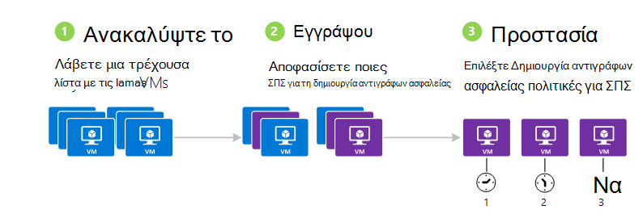

>[AZURE.NOTE] Δημιουργία αντιγράφων ασφαλείας εικονικές μηχανές είναι μια τοπική διαδικασία. Που δεν είναι δυνατό να δημιουργήσετε αντίγραφα ασφαλείας εικονικές μηχανές σε μία περιοχή σε ένα αντίγραφο ασφαλείας θάλαμο σε μια άλλη περιοχή. Επομένως, πρέπει να δημιουργήσετε ένα αντίγραφο ασφαλείας θάλαμο σε κάθε Azure περιοχής, όπου υπάρχουν ΣΠΣ που θα δημιουργηθεί αντίγραφο ασφαλείας.

## Βήμα 1 - Ανακαλύψτε Azure εικονικές μηχανές
Για να βεβαιωθείτε ότι οποιαδήποτε νέα εικονικές μηχανές (ΣΠΣ) προστεθεί στη συνδρομή προσδιορίζονται πριν από την καταχώρηση, εκτελέστε τη διαδικασία εντοπισμού. Τα ερωτήματα διαδικασία Azure για τη λίστα των εικονικές μηχανές στην συνδρομής, μαζί με πρόσθετες πληροφορίες, όπως το όνομα της υπηρεσίας cloud και της περιοχής.

1. Είσοδος στην [πύλη κλασική](http://manage.windowsazure.com/)

2. Στη λίστα των υπηρεσιών Azure, κάντε κλικ στην επιλογή **Υπηρεσίες ανάκτησης** για να ανοίξετε τη λίστα των χώροι φύλαξης δημιουργίας αντιγράφων ασφαλείας και Επαναφορά τοποθεσίας.
    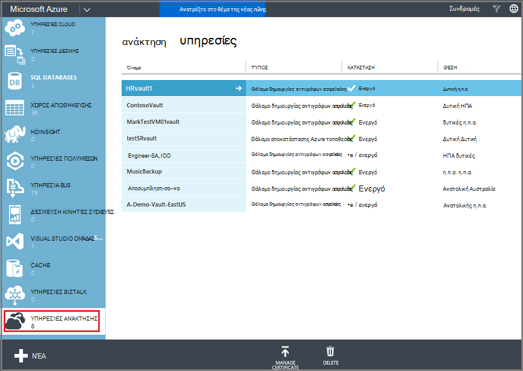

3. Στη λίστα των χώροι φύλαξης αντίγραφο ασφαλείας, επιλέξτε το θάλαμο για να δημιουργήσετε αντίγραφα ασφαλείας μια Εικονική.

    Εάν αυτή είναι μια νέα θάλαμο ανοίγει την πύλη στη σελίδα **Γρήγορη εκκίνηση** .

    

    Εάν το θάλαμο προηγουμένως έχει ρυθμιστεί, την πύλη ανοίγει το πιο πρόσφατο μενού.

4. Από το μενού θάλαμο (στο επάνω μέρος της σελίδας), κάντε κλικ στην επιλογή **Στοιχεία που έχουν καταχωρηθεί**.

    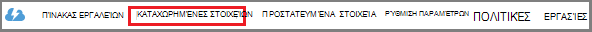

5. Από το μενού " **Τύπος** ", επιλέξτε **Azure εικονική μηχανή**.

    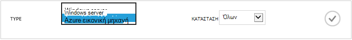

6. Κάντε κλικ στην επιλογή **ΠΕΡΙΉΓΗΣΗ** στο κάτω μέρος της σελίδας.
    

    Η διαδικασία εντοπισμού ενδέχεται να χρειαστούν μερικά λεπτά, ενώ είναι που πινακοποιημένη τις εικονικές μηχανές. Υπάρχει μια ειδοποίηση στο κάτω μέρος της οθόνης που σας επιτρέπει να γνωρίζετε ότι η διεργασία εκτελείται.

    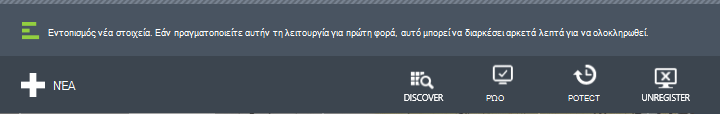

    Ολοκληρώστε τις αλλαγές ειδοποίηση όταν η διαδικασία. Εάν η διαδικασία εντοπισμού δεν βρέθηκε τις εικονικές μηχανές, πρώτα βεβαιωθείτε ότι υπάρχει του ΣΠΣ. Εάν υπάρχει του ΣΠΣ, βεβαιωθείτε ότι το ΣΠΣ είναι στην ίδια περιοχή ως το αντίγραφο ασφαλείας θάλαμο. Εάν το ΣΠΣ υπάρχει και είναι στην ίδια περιοχή, βεβαιωθείτε ότι το ΣΠΣ δεν είναι ήδη καταχωρήσει σε ένα αντίγραφο ασφαλείας θάλαμο. Εάν μια Εικονική έχει αντιστοιχιστεί σε ένα αντίγραφο ασφαλείας θάλαμο δεν είναι διαθέσιμη για να αντιστοιχίσετε σε άλλες χώροι φύλαξης δημιουργίας αντιγράφων ασφαλείας.

    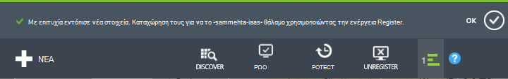

    Αφού έχετε εντόπισε τα νέα στοιχεία, μεταβείτε στο βήμα 2 και καταχώρηση ΣΠΣ σας.

##  Βήμα 2 - Register Azure εικονικές μηχανές
Μπορείτε να καταχωρήσετε μια εικονική μηχανή Azure για να συσχετίσετε με την υπηρεσία Azure δημιουργίας αντιγράφων ασφαλείας. Αυτό συνήθως είναι μια μεμονωμένη δραστηριότητα.

1. Μεταβείτε για το αντίγραφο ασφαλείας θάλαμο στην περιοχή **Υπηρεσίες ανάκτησης** στην πύλη του Azure και, στη συνέχεια, κάντε κλικ στην επιλογή **Στοιχεία που έχουν καταχωρηθεί**.

2. Επιλέξτε **Azure εικονική μηχανή** από το αναπτυσσόμενο μενού.

    

3. Κάντε κλικ στην επιλογή **ΚΑΤΑΧΏΡΗΣΗ** στο κάτω μέρος της σελίδας.
    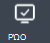

4. Στο μενού συντόμευσης **Καταχώρηση στοιχείων** , επιλέξτε τις εικονικές μηχανές που θέλετε για την καταχώρηση. Εάν υπάρχουν δύο ή περισσότερες εικονικές μηχανές με το ίδιο όνομα, χρησιμοποιήστε την υπηρεσία cloud για να διακρίνουν τους.

    >[AZURE.TIP] Πολλές εικονικές μηχανές μπορεί να έχει εγγραφεί σε μία φορά.

    Δημιουργείται μια εργασία για κάθε εικονική μηχανή που έχετε επιλέξει.

5. Κάντε κλικ στην επιλογή **Προβολή έργου** στην ειδοποίηση για να μεταβείτε στη σελίδα " **εργασίες** ".

    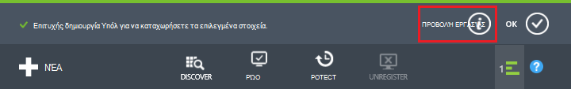

    Η εικονική μηχανή εμφανίζεται επίσης στη λίστα των εγγεγραμμένων στοιχεία, μαζί με την κατάσταση της διαδικασίας εγγραφής.

    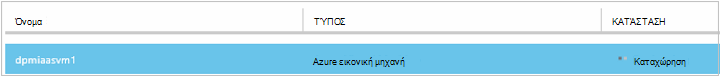

    Όταν ολοκληρωθεί η λειτουργία, τις αλλαγές κατάστασης ώστε να αντικατοπτρίζει το μέλος που *έχουν καταχωρηθεί* .

    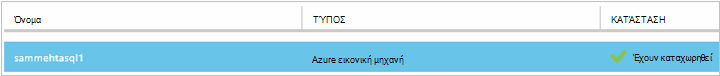

## Βήμα 3 - προστασία Azure εικονικές μηχανές
Τώρα μπορείτε να ρυθμίσετε μια πολιτική διατήρησης και αντιγράφων ασφαλείας για την εικονική μηχανή. Πολλές εικονικές μηχανές μπορούν να προστατευτούν χρησιμοποιώντας μία προστασία ενέργεια.

Azure χώροι φύλαξης δημιουργίας αντιγράφων ασφαλείας που δημιουργούνται μετά Μάιος 2015 παρέχονται με μια προεπιλεγμένη πολιτική ενσωματωμένο στο το θάλαμο. Αυτή η προεπιλεγμένη πολιτική συνοδεύεται από ένα προεπιλεγμένο διατήρησης των 30 ημέρες και ένα χρονοδιάγραμμα δημιουργίας αντιγράφων ασφαλείας ημερήσια μία φορά.

1. Μεταβείτε για το αντίγραφο ασφαλείας θάλαμο στην περιοχή **Υπηρεσίες ανάκτησης** στην πύλη του Azure και, στη συνέχεια, κάντε κλικ στην επιλογή **Στοιχεία που έχουν καταχωρηθεί**.
2. Επιλέξτε **Azure εικονική μηχανή** από το αναπτυσσόμενο μενού.

    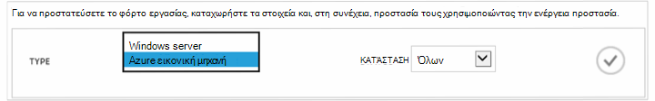

3. Κάντε κλικ στην επιλογή **ΠΡΟΣΤΑΣΊΑ** στο κάτω μέρος της σελίδας.

    Εμφανίζεται ο **Οδηγός προστασία στοιχείων** . Ο οδηγός εμφανίζει μόνο εικονικές μηχανές που έχουν καταχωρηθεί και δεν προστατεύεται. Επιλέξτε τις εικονικές μηχανές που θέλετε να προστατεύσετε.

    Εάν υπάρχουν δύο ή περισσότερες εικονικές μηχανές με το ίδιο όνομα, χρησιμοποιήστε την υπηρεσία cloud για να διακρίνουν τις εικονικές μηχανές.

    >[AZURE.TIP] Μπορείτε να προστατεύσετε πολλές εικονικές μηχανές κάθε φορά.

    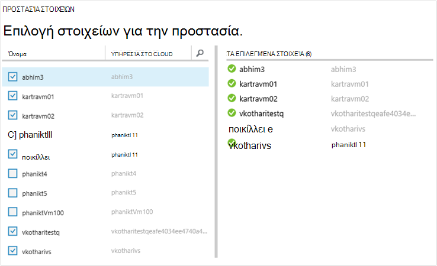

4. Επιλέξτε ένα **Χρονοδιάγραμμα δημιουργίας αντιγράφων ασφαλείας** για να δημιουργήσετε αντίγραφα ασφαλείας τις εικονικές μηχανές που έχετε επιλέξει. Μπορείτε να επιλέξετε από ένα υπάρχον σύνολο πολιτικών ή να ορίζουν ένα νέο.

    Κάθε πολιτική αντιγράφων ασφαλείας μπορούν να έχουν πολλές εικονικές μηχανές που σχετίζονται με αυτό. Ωστόσο, η εικονική μηχανή μπορούν μόνο να συσχετιστούν με μια πολιτική σε οποιοδήποτε συγκεκριμένο σημείο στο χρόνο.

    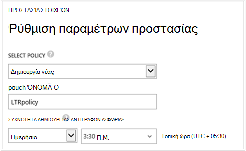

    >[AZURE.NOTE] Μια πολιτική ασφαλείας περιλαμβάνει ένα συνδυασμό διατήρησης για την προγραμματισμένη δημιουργία αντιγράφων ασφαλείας. Εάν επιλέξετε μια υπάρχουσα πολιτική ασφαλείας, δεν μπορείτε να τροποποιήσετε τις επιλογές διατήρησης στο επόμενο βήμα.

5. Επιλέξτε μια **περιοχή διατήρησης** για να συσχετίσετε με τη δημιουργία αντιγράφων ασφαλείας.

    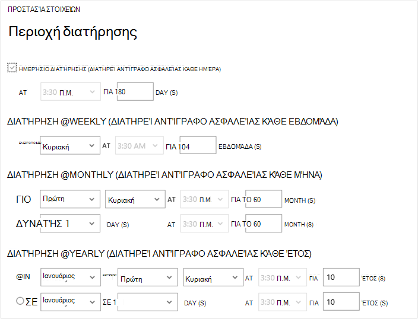

    Πολιτική διατήρησης Καθορίζει τη διάρκεια του χρόνου για την αποθήκευση αντιγράφου ασφαλείας. Μπορείτε να καθορίσετε οι πολιτικές διατήρησης διαφορετική βάση όταν ορίζεται ως το αντίγραφο ασφαλείας. Για παράδειγμα, ένα σημείο αντιγράφου ασφαλείας που λαμβάνονται καθημερινά (η οποία λειτουργεί ως ένα σημείο λειτουργίας ανάκτησης) μπορεί να διατηρηθούν για 90 ημέρες. Σε σύγκριση, ένα σημείο αντιγράφου ασφαλείας που λαμβάνονται στο τέλος του τριμήνου (για λόγους ελέγχου) ίσως χρειαστεί να διατηρηθούν για πολλούς μήνες ή έτη.

    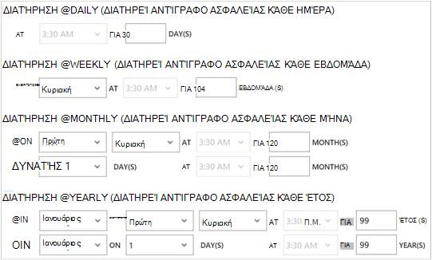

    Σε αυτό το παράδειγμα εικόνα:

    - **Ημερήσιων πολιτικής διατήρησης**: δημιουργία αντιγράφων ασφαλείας πραγματοποιήθηκε καθημερινά αποθηκεύονται για 30 ημέρες.
    - **Εβδομαδιαίο πολιτικής διατήρησης**: δημιουργία αντιγράφων ασφαλείας πραγματοποιήθηκε κάθε εβδομάδα την Κυριακή διατηρούνται για 104 εβδομάδες.
    - **Μηνιαίο πολιτικής διατήρησης**: δημιουργία αντιγράφων ασφαλείας που έχετε δημιουργήσει την τελευταία Κυριακή κάθε μήνα διατηρούνται για 120 μήνες.
    - **Ετήσιο πολιτικής διατήρησης**: δημιουργία αντιγράφων ασφαλείας που έχετε δημιουργήσει την πρώτη Κυριακή κάθε Ιανουαρίου διατηρούνται για 99 έτη.

    Δημιουργείται μια εργασία για να ρυθμίσετε την πολιτική προστασίας και να συσχετίσετε τις εικονικές μηχανές σε αυτήν την πολιτική για κάθε εικονική μηχανή που έχετε επιλέξει.

6. Για να προβάλετε τη λίστα εργασιών **Προστασία με ρύθμιση παραμέτρων** , από το μενού χώροι φύλαξης, κάντε κλικ στην επιλογή **εργασίες** και επιλέξτε **Ρύθμιση παραμέτρων προστασίας** από τη **λειτουργία** φίλτρου.

    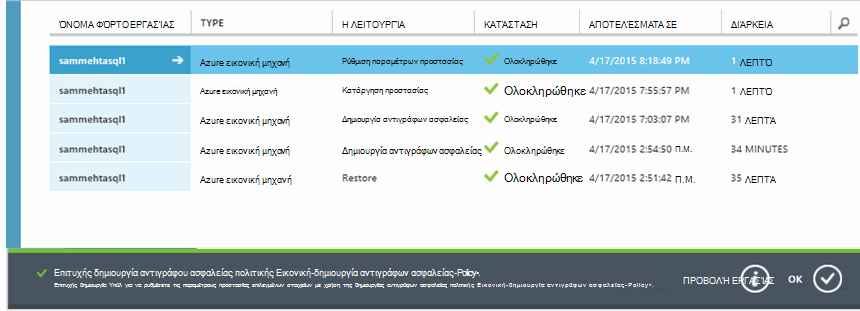

## Αρχικό αντίγραφο ασφαλείας
Όταν η εικονική μηχανή προστατεύεται με μια πολιτική, να εμφανίζεται κάτω από την καρτέλα **Προστασία στοιχείων** με την κατάσταση της *προστατευμένης - (εκκρεμεί αρχικό αντίγραφο ασφαλείας)*. Από προεπιλογή, το πρώτο προγραμματισμένη δημιουργία αντιγράφων ασφαλείας είναι το *αρχικό αντίγραφο ασφαλείας*.

Για να ενεργοποιήσετε το αρχικό αντίγραφο ασφαλείας αμέσως μετά τη ρύθμιση των παραμέτρων προστασίας:

1. Στο κάτω μέρος της σελίδας **Προστασία στοιχείων** , κάντε κλικ στην επιλογή **Άμεση δημιουργία αντιγράφων ασφαλείας**.

    Η υπηρεσία Azure δημιουργίας αντιγράφων ασφαλείας δημιουργεί μια εργασία αντιγράφου ασφαλείας για το αρχικό λειτουργία δημιουργίας αντιγράφων ασφαλείας.

2. Κάντε κλικ στην καρτέλα " **εργασίες** " για να προβάλετε τη λίστα εργασιών.

    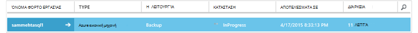

>[AZURE.NOTE] Κατά τη λειτουργία δημιουργίας αντιγράφων ασφαλείας, την υπηρεσία Azure αντιγράφου ασφαλείας θέματα μια εντολή για την επέκταση αντιγράφου ασφαλείας σε κάθε εικονική μηχανή εκκένωση όλες τις εργασίες εγγραφής και να λάβετε ένα στιγμιότυπο συνεπή.

Όταν ολοκληρωθεί το αρχικό αντίγραφο ασφαλείας, την κατάσταση του η εικονική μηχανή στην καρτέλα **Προστασία στοιχείων** είναι *προστατευμένο*.

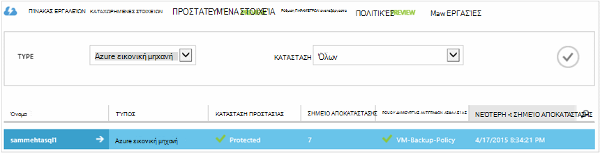

## Προβολή κατάστασης δημιουργίας αντιγράφων ασφαλείας και λεπτομέρειες
Μόλις προστατεύεται, το πλήθος εικονική μηχανή αυξάνεται επίσης στη σελίδα **πίνακα εργαλείων** σύνοψης. Η σελίδα **πίνακα εργαλείων** εμφανίζει επίσης ο αριθμός των εργασιών από τις τελευταίες 24 ώρες που ήταν *επιτυχής*, θα έχουν *απέτυχε*και βρίσκονται *σε εξέλιξη*. Στη σελίδα " **εργασίες** ", χρησιμοποιήστε την **κατάσταση**, **η λειτουργία**ή **από** και **έως** μενού για να φιλτράρετε τις εργασίες.

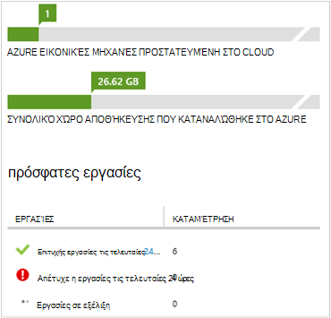

Τιμές στον πίνακα εργαλείων ανανεώνονται κάθε 24 ώρες.

## Αντιμετώπιση σφαλμάτων
Εάν αντιμετωπίσετε προβλήματα κατά τη δημιουργία αντιγράφων ασφαλείας σας εικονική μηχανή, δείτε το [άρθρο αντιμετώπισης προβλημάτων Εικονική](backup-azure-vms-troubleshoot.md) για βοήθεια.

## Επόμενα βήματα

- [Διαχείριση και την παρακολούθηση σας εικονικές μηχανές](backup-azure-manage-vms.md)
- [Επαναφορά εικονικές μηχανές](backup-azure-restore-vms.md)
