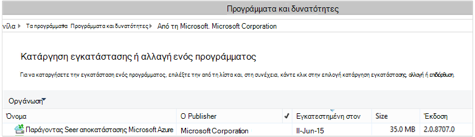

<properties
    pageTitle="Ανάπτυξη και διαχείριση δημιουργίας αντιγράφων ασφαλείας για τα Windows Server/προγράμματος-πελάτη με χρήση του PowerShell | Microsoft Azure"
    description="Μάθετε πώς μπορείτε να αναπτύξετε και να διαχειριστείτε Azure δημιουργίας αντιγράφων ασφαλείας με χρήση του PowerShell"
    services="backup"
    documentationCenter=""
    authors="saurabhsensharma"
    manager="shivamg"
    editor=""/>

<tags
    ms.service="backup"
    ms.workload="storage-backup-recovery"
    ms.tgt_pltfrm="na"
    ms.devlang="na"
    ms.topic="article"
    ms.date="09/01/2016"
    ms.author="saurabhsensharma;markgal;jimpark;nkolli;trinadhk"/>


# <a name="deploy-and-manage-backup-to-azure-for-windows-serverwindows-client-using-powershell"></a>Αναπτύξετε και να διαχειριστείτε αντίγραφα ασφαλείας για Azure για Windows Server, Windows προγράμματος-πελάτη με χρήση του PowerShell

> [AZURE.SELECTOR]
- [ARM](backup-client-automation.md)
- [Κλασικό](backup-client-automation-classic.md)

Σε αυτό το άρθρο σάς δείχνει τον τρόπο χρήσης του PowerShell για τη ρύθμιση του Azure δημιουργίας αντιγράφων ασφαλείας σε Windows Server ή ένα πρόγραμμα-πελάτη των Windows και τη Διαχείριση αντίγραφα ασφαλείας και επαναφορά.

## <a name="install-azure-powershell"></a>Εγκατάσταση του Azure PowerShell

[AZURE.INCLUDE [learn-about-deployment-models](../../includes/learn-about-deployment-models-include.md)]

Σε αυτό το άρθρο εστιάζει στην τα cmdlet του PowerShell διαχείρισης πόρων Azure (ARM) που σας επιτρέπουν να χρησιμοποιήσετε ένα θάλαμο υπηρεσίες ανάκτησης σε μια ομάδα πόρων.

Οκτωβρίου 2015, Azure PowerShell 1.0 κυκλοφορήσει. Σε αυτήν την έκδοση ολοκληρώθηκε με επιτυχία το 0.9.8 αφήστε και έφερε σχετικά με ορισμένες σημαντικές αλλαγές, ειδικά σε το μοτίβο ονομασίας του τα cmdlet. cmdlet του 1,0 ακολουθήστε το μοτίβο ονομασίας {Ρηματικές}-AzureRm {Ονοματικές} ότι, 0.9.8 τα ονόματα δεν περιλαμβάνει **Διαχείριση πόρων** (για παράδειγμα, δημιουργία-AzureRmResourceGroup αντί για το νέο AzureResourceGroup). Κατά τη χρήση του PowerShell Azure 0.9.8, πρέπει πρώτα να ενεργοποιήσετε τη λειτουργία διαχείρισης πόρων, εκτελέστε την εντολή **Μετάβαση AzureMode AzureResourceManager** . Αυτή η εντολή δεν είναι απαραίτητο στο 1.0 ή νεότερη έκδοση.

Εάν θέλετε να χρησιμοποιήσετε τις δέσμες ενεργειών που δημιουργήθηκαν με το 0.9.8 περιβάλλον, στο περιβάλλον 1.0 ή νεότερη έκδοση, πρέπει να ελέγξετε προσεκτικά τις δέσμες ενεργειών σε ένα περιβάλλον προ-παραγωγής πριν από τη χρήση της παραγωγής για να αποφύγετε την εντύπωση μη αναμενόμενα.

[Κάντε λήψη της πιο πρόσφατης έκδοσης του PowerShell](https://github.com/Azure/azure-powershell/releases) (είναι ελάχιστη απαιτούμενη έκδοση: 1.0.0)


[AZURE.INCLUDE [arm-getting-setup-powershell](../../includes/arm-getting-setup-powershell.md)]

## <a name="create-a-recovery-services-vault"></a>Δημιουργήστε ένα θάλαμο υπηρεσίες ανάκτησης

Τα παρακάτω βήματα σας καθοδηγεί στη δημιουργία ενός θάλαμο υπηρεσίες ανάκτησης. Ένα θάλαμο υπηρεσίες ανάκτησης είναι διαφορετικό από ένα αντίγραφο ασφαλείας θάλαμο.

1. Εάν χρησιμοποιείτε το αντίγραφο ασφαλείας Azure για πρώτη φορά, πρέπει να χρησιμοποιήσετε το cmdlet **Register-AzureRMResourceProvider** για την καταχώρηση της υπηρεσίας ανάκτησης Azure παροχής με τη συνδρομή σας.

    ```
    PS C:\> Register-AzureRmResourceProvider -ProviderNamespace "Microsoft.RecoveryServices"
    ```

2. Το θάλαμο υπηρεσίες ανάκτησης είναι ένας πόρος ARM, ώστε να πρέπει να το τοποθετήσετε μέσα σε μια ομάδα πόρων. Μπορείτε να χρησιμοποιήσετε μια υπάρχουσα ομάδα πόρων, ή δημιουργήστε ένα νέο. Κατά τη δημιουργία νέας ομάδας πόρων, καθορίστε το όνομα και τη θέση για την ομάδα πόρων.  

    ```
    PS C:\> New-AzureRmResourceGroup –Name "test-rg" –Location "West US"
    ```

3. Χρησιμοποιήστε το cmdlet **New-AzureRmRecoveryServicesVault** για να δημιουργήσετε το νέο θάλαμο. Φροντίστε να καθορίσετε στην ίδια θέση για το θάλαμο όπως που χρησιμοποιήθηκε για την ομάδα πόρων.

    ```
    PS C:\> New-AzureRmRecoveryServicesVault -Name "testvault" -ResourceGroupName " test-rg" -Location "West US"
    ```

4. Καθορίστε τον τύπο του χώρου αποθήκευσης πλεονασμού να χρησιμοποιήσετε. Μπορείτε να χρησιμοποιήσετε [Τοπικά πλεονάζοντα χώρο αποθήκευσης (LRS)](../storage/storage-redundancy.md#locally-redundant-storage) ή [Παν πλεονάζοντα χώρο αποθήκευσης Εξοπλισμό](../storage/storage-redundancy.md#geo-redundant-storage). Το παρακάτω παράδειγμα εμφανίζει την επιλογή - BackupStorageRedundancy testVault έχει οριστεί σε GeoRedundant.

    > [AZURE.TIP] Cmdlet για πολλά αντίγραφα ασφαλείας Azure απαιτούν το αντικείμενο θάλαμο υπηρεσίες ανάκτησης ως εισαγωγή. Για αυτόν το λόγο, είναι εύκολο να αποθηκεύσετε το αντικείμενο θάλαμο υπηρεσίες ανάκτησης αντίγραφα ασφαλείας σε μεταβλητή.

    ```
    PS C:\> $vault1 = Get-AzureRmRecoveryServicesVault –Name "testVault"
    PS C:\> Set-AzureRmRecoveryServicesBackupProperties  -vault $vault1 -BackupStorageRedundancy GeoRedundant
    ```

## <a name="view-the-vaults-in-a-subscription"></a>Προβολή του χώροι φύλαξης σε μια συνδρομή
Χρησιμοποιήστε **Get-AzureRmRecoveryServicesVault** για να προβάλετε τη λίστα των όλα χώροι φύλαξης στην τρέχουσα εγγραφή. Μπορείτε να χρησιμοποιήσετε αυτή την εντολή για να ελέγξετε ότι έχει δημιουργηθεί ένα νέο θάλαμο, ή για να δείτε ποιες χώροι φύλαξης είναι διαθέσιμες στο τη συνδρομή.

Εκτελέστε την εντολή, Get-AzureRmRecoveryServicesVault, και παρατίθενται όλες οι χώροι φύλαξης στην συνδρομής.

```
PS C:\> Get-AzureRmRecoveryServicesVault
Name              : Contoso-vault
ID                : /subscriptions/1234
Type              : Microsoft.RecoveryServices/vaults
Location          : WestUS
ResourceGroupName : Contoso-docs-rg
SubscriptionId    : 1234-567f-8910-abc
Properties        : Microsoft.Azure.Commands.RecoveryServices.ARSVaultProperties
```


## <a name="installing-the-azure-backup-agent"></a>Κατά την εγκατάσταση τον παράγοντα Azure δημιουργίας αντιγράφων ασφαλείας
Πριν να εγκαταστήσετε τον παράγοντα αντιγράφων ασφαλείας Azure, πρέπει να έχετε το πρόγραμμα εγκατάστασης που έχουν ληφθεί και παρουσίαση στο διακομιστή των Windows. Μπορείτε να λάβετε την πιο πρόσφατη έκδοση του προγράμματος εγκατάστασης από το [Κέντρο λήψης της Microsoft](http://aka.ms/azurebackup_agent) ή από τη σελίδα του θάλαμο υπηρεσίες ανάκτησης του πίνακα εργαλείων. Αποθηκεύστε το πρόγραμμα εγκατάστασης του σε μια θέση εύκολα προσβάσιμα όπως * C:\Downloads\*.

Για να εγκαταστήσετε τον παράγοντα, εκτελέστε την ακόλουθη εντολή σε ένα αναβαθμισμένο κονσόλας PowerShell:

```
PS C:\> MARSAgentInstaller.exe /q
```

Αυτό εγκαθιστά τον παράγοντα με όλες τις προεπιλεγμένες επιλογές. Η εγκατάσταση διαρκεί λίγα λεπτά στο παρασκήνιο. Εάν δεν καθορίσετε την επιλογή */nu* θα ανοίξει το παράθυρο **Windows Update** στο τέλος της εγκατάστασης για να ελέγξετε για ενημερώσεις. Μόλις εγκαταστήσετε, τον παράγοντα θα εμφανίζονται στη λίστα των εγκατεστημένων προγραμμάτων.

Για να δείτε τη λίστα των εγκατεστημένων προγραμμάτων, μεταβείτε στον **Πίνακα ελέγχου** > **προγράμματα** > **προγράμματα και δυνατότητες**.



### <a name="installation-options"></a>Επιλογές εγκατάστασης

Για να δείτε όλες τις επιλογές που είναι διαθέσιμες μέσω της γραμμής εντολών, χρησιμοποιήστε την ακόλουθη εντολή:

```
PS C:\> MARSAgentInstaller.exe /?
```

Οι διαθέσιμες επιλογές περιλαμβάνουν:

| Επιλογή | Λεπτομέρειες | Προεπιλεγμένη |
| ---- | ----- | ----- |
| / q | Εγκατάσταση χωρίς μηνύματα | - |
| /p: "θέση" | Διαδρομή προς το φάκελο εγκατάστασης για τον παράγοντα Azure δημιουργίας αντιγράφων ασφαλείας. | Παράγοντας υπηρεσιών Azure αποκατάστασης C:\Program Files\Microsoft |
| / s: "θέση" | Διαδρομή προς το φάκελο cache για τον παράγοντα Azure δημιουργίας αντιγράφων ασφαλείας. | C:\Program Files\Microsoft Azure αποκατάστασης υπηρεσίες Agent\Scratch |
| /m | Επιλογή στο Microsoft Update | - |
| /Nu | Χωρίς έλεγχο για ενημερώσεις μετά την ολοκλήρωση της εγκατάστασης | - |
| /d | Καταργεί την εγκατάσταση του Microsoft Azure παράγοντα υπηρεσίες ανάκτησης | - |
| /pH | Διεύθυνση κεντρικού υπολογιστή διακομιστή μεσολάβησης | - |
| /Po | Αριθμός θύρας κεντρικού υπολογιστή διακομιστή μεσολάβησης | - |
| /Pu | Όνομα χρήστη κεντρικού υπολογιστή διακομιστή μεσολάβησης | - |
| /pw | Κωδικός πρόσβασης διακομιστή μεσολάβησης | - |


## <a name="registering-windows-server-or-windows-client-machine-to-a-recovery-services-vault"></a>Δήλωση Windows Server ή υπολογιστή-πελάτη των Windows σε ένα θάλαμο υπηρεσίες ανάκτησης

Αφού δημιουργηθεί το θάλαμο υπηρεσίες ανάκτησης, κάντε λήψη του τελευταίου agent και τα διαπιστευτήρια θάλαμο και αποθηκεύστε το σε μια τοποθεσία που εξυπηρετεί όπως C:\Downloads.

```
PS C:\> $credspath = "C:\downloads"
PS C:\> $credsfilename = Get-AzureRmRecoveryServicesVaultSettingsFile -Backup -Vault $vault1 -Path  $credspath
PS C:\> $credsfilename C:\downloads\testvault\_Sun Apr 10 2016.VaultCredentials
```

Στον Windows Server ή υπολογιστή-πελάτη των Windows, εκτελέστε το cmdlet [OBRegistration έναρξης](https://technet.microsoft.com/library/hh770398%28v=wps.630%29.aspx) για να καταχωρήσετε τον υπολογιστή με το θάλαμο.

```
PS C:\> $cred = $credspath + $credsfilename
PS C:\> Start-OBRegistration-VaultCredentials $cred -Confirm:$false
CertThumbprint      :7a2ef2caa2e74b6ed1222a5e89288ddad438df2
SubscriptionID      : ef4ab577-c2c0-43e4-af80-af49f485f3d1
ServiceResourceName: testvault
Region              :West US
Machine registration succeeded.
```

> [AZURE.IMPORTANT] Μην χρησιμοποιείτε σχετικές διαδρομές για να καθορίσετε το αρχείο διαπιστευτήρια θάλαμο. Πρέπει να δώσετε μια απόλυτη διαδρομή ως είσοδο στο cmdlet.

## <a name="networking-settings"></a>Ρυθμίσεις δικτύου
Όταν η σύνδεση του υπολογιστή των Windows στο Internet μέσω ενός διακομιστή μεσολάβησης, οι ρυθμίσεις διακομιστή μεσολάβησης μπορεί επίσης να παρέχεται στον παράγοντα. Σε αυτό το παράδειγμα, δεν υπάρχει καμία διακομιστή μεσολάβησης, έτσι θα σας ρητά καταργώντας τις πληροφορίες που σχετίζονται με το διακομιστή μεσολάβησης.

Χρήση του εύρους ζώνης μπορεί επίσης να ελέγχεται με τις επιλογές της ```work hour bandwidth``` και ```non-work hour bandwidth``` για ένα συγκεκριμένο σύνολο ημέρες της εβδομάδας.

Ρύθμιση τις λεπτομέρειες του διακομιστή μεσολάβησης και το εύρος ζώνης γίνεται χρησιμοποιώντας το cmdlet [Set-OBMachineSetting](https://technet.microsoft.com/library/hh770409%28v=wps.630%29.aspx) :

```
PS C:\> Set-OBMachineSetting -NoProxy
Server properties updated successfully.

PS C:\> Set-OBMachineSetting -NoThrottle
Server properties updated successfully.
```

## <a name="encryption-settings"></a>Ρυθμίσεις κρυπτογράφησης
Τα δεδομένα αντιγράφου ασφαλείας που αποστέλλονται σε Azure αντιγράφου ασφαλείας είναι κρυπτογραφημένο την προστασία του απορρήτου των δεδομένων. Η φράση πρόσβασης κρυπτογράφησης είναι "κωδικός πρόσβασης" για να αποκρυπτογραφήσει τα δεδομένα κατά τη στιγμή της επαναφοράς.

```
PS C:\> ConvertTo-SecureString -String "Complex!123_STRING" -AsPlainText -Force | Set-OBMachineSetting
Server properties updated successfully
```

> [AZURE.IMPORTANT] Διατηρήστε τις πληροφορίες φράση πρόσβασης ασφαλές εφόσον έχει οριστεί. Δεν θα μπορείτε να το επαναφέρετε δεδομένα από το Azure χωρίς αυτή η φράση πρόσβασης.

## <a name="back-up-files-and-folders"></a>Δημιουργία αντιγράφων ασφαλείας αρχείων και φακέλων
Όλα τα αντίγραφα ασφαλείας από υπολογιστές-πελάτες και διακομιστές Windows Azure αντίγραφο ασφαλείας είναι διέπεται από μια πολιτική. Η πολιτική περιλαμβάνει τρία μέρη:

1. Ένα **Χρονοδιάγραμμα δημιουργίας αντιγράφων ασφαλείας** που καθορίζει πότε αντίγραφα ασφαλείας πρέπει να λαμβάνονται και να συγχρονιστούν με την υπηρεσία.
2. Ένα **Χρονοδιάγραμμα διατήρησης** που καθορίζει το χρόνο για να διατηρήσετε τα σημεία αποκατάστασης στο Azure.
3. **Προδιαγραφή συμπερίληψης/αποκλεισμού αρχείων** που καθορίζει τι θα πρέπει να δημιουργηθεί αντίγραφο ασφαλείας.

Σε αυτό το έγγραφο, επειδή θα σας αυτοματοποίηση αντίγραφο ασφαλείας, θα υποθέσουμε ότι τίποτα έχει ρυθμιστεί. Ξεκινά ο, δημιουργώντας μια νέα πολιτική ασφαλείας χρησιμοποιώντας το cmdlet [New-OBPolicy](https://technet.microsoft.com/library/hh770416.aspx) .

```
PS C:\> $newpolicy = New-OBPolicy
```

Αυτήν τη στιγμή της πολιτικής είναι κενό και άλλες cmdlet του είναι χρειάζεται για να καθορίσετε ποια στοιχεία θα συμπεριλαμβάνονται ή εξαιρούνται, όταν αντίγραφα ασφαλείας θα εκτελεστεί και το σημείο όπου θα αποθηκευτούν τα αντίγραφα ασφαλείας.

### <a name="configuring-the-backup-schedule"></a>Ρύθμιση των παραμέτρων του χρονοδιαγράμματος δημιουργίας αντιγράφων ασφαλείας
Το πρώτο από τα τρία μέρη μιας πολιτικής είναι το χρονοδιάγραμμα αντιγράφων ασφαλείας που έχει δημιουργηθεί χρησιμοποιώντας το cmdlet [New-OBSchedule](https://technet.microsoft.com/library/hh770401) . Το χρονοδιάγραμμα αντιγράφων ασφαλείας καθορίζει πότε αντίγραφα ασφαλείας πρέπει να ληφθούν. Όταν δημιουργείτε ένα χρονοδιάγραμμα που πρέπει να καθορίσετε 2 παραμέτρους εισόδου:

- **Ημέρες της εβδομάδας** που θα πρέπει να εκτελέσετε το αντίγραφο ασφαλείας. Μπορείτε να εκτελέσετε την εργασία αντιγράφου ασφαλείας μόνο μία ημέρα ή κάθε ημέρα της εβδομάδας ή οποιονδήποτε συνδυασμό μεταξύ αυτών των δύο.
- **Ώρες της ημέρας** όταν πρέπει να εκτελέσετε το αντίγραφο ασφαλείας. Μπορείτε να ορίσετε έως 3 διαφορετικές ώρες της ημέρας όταν θα ενεργοποιηθεί το αντίγραφο ασφαλείας.

Για παράδειγμα, μπορείτε να ρυθμίσετε τις παραμέτρους μια πολιτική ασφαλείας που εκτελείται στο 4 μμ κάθε Σάββατο και η Κυριακή.

```
PS C:\> $sched = New-OBSchedule -DaysofWeek Saturday, Sunday -TimesofDay 16:00
```

Το χρονοδιάγραμμα αντιγράφων ασφαλείας πρέπει να συσχετίζονται με μια πολιτική και αυτό μπορεί να είναι δυνατό, χρησιμοποιώντας το cmdlet [Set-OBSchedule](https://technet.microsoft.com/library/hh770407) .

```
PS C:> Set-OBSchedule -Policy $newpolicy -Schedule $sched
BackupSchedule : 4:00 PM Saturday, Sunday, Every 1 week(s) DsList : PolicyName : RetentionPolicy : State : New PolicyState : Valid
```
### <a name="configuring-a-retention-policy"></a>Ρύθμιση παραμέτρων πολιτικής διατήρησης
Η πολιτική διατήρησης Καθορίζει πόσο χρόνο διατηρούνται αποκατάστασης σημεία που δημιουργήθηκαν από εργασιών δημιουργίας αντιγράφων ασφαλείας. Όταν δημιουργείτε μια νέα πολιτική διατήρησης χρησιμοποιώντας το cmdlet [New-OBRetentionPolicy](https://technet.microsoft.com/library/hh770425) , μπορείτε να καθορίσετε τον αριθμό των ημερών που τα σημεία ανάκτηση αντιγράφου ασφαλείας πρέπει να διατηρηθούν με Azure δημιουργίας αντιγράφων ασφαλείας. Το παρακάτω παράδειγμα ορίζει πολιτικής διατήρησης των 7 ημερών.

```
PS C:\> $retentionpolicy = New-OBRetentionPolicy -RetentionDays 7
```

Την πολιτική διατήρησης πρέπει να σχετίζονται με την πολιτική κύριο χρησιμοποιώντας το cmdlet [Set-OBRetentionPolicy](https://technet.microsoft.com/library/hh770405):

```
PS C:\> Set-OBRetentionPolicy -Policy $newpolicy -RetentionPolicy $retentionpolicy

BackupSchedule  : 4:00 PM
                  Saturday, Sunday,
                  Every 1 week(s)
DsList          :
PolicyName      :
RetentionPolicy : Retention Days : 7

                  WeeklyLTRSchedule :
                  Weekly schedule is not set

                  MonthlyLTRSchedule :
                  Monthly schedule is not set

                  YearlyLTRSchedule :
                  Yearly schedule is not set

State           : New
PolicyState     : Valid
```
### <a name="including-and-excluding-files-to-be-backed-up"></a>Όπως και ο αποκλεισμός αρχείων για δημιουργία αντιγράφων ασφαλείας
Μια ```OBFileSpec``` αντικείμενο ορίζει τα αρχεία για να συμπεριλαμβάνεται και εξαιρείται σε ένα αντίγραφο ασφαλείας. Αυτό είναι ένα σύνολο κανόνων που εύρος τα προστατευμένα αρχεία και φακέλους σε υπολογιστή. Μπορείτε να έχετε πολλές αρχείων συμπερίληψη ή εξαίρεση κανόνες, όπως απαιτείται και συνδέετε με μια πολιτική. Κατά τη δημιουργία ενός νέου αντικειμένου OBFileSpec, μπορείτε να:

- Καθορίστε τα αρχεία και φακέλους που θα συμπεριληφθούν
- Καθορίστε τα αρχεία και φακέλους να εξαιρούνται
- Καθορίστε επαναλαμβανόμενες δημιουργίας αντιγράφων ασφαλείας των δεδομένων σε ένα φάκελο (ή) εάν θα πρέπει να είναι αντίγραφο μόνο τα ανώτατου επιπέδου αρχεία στον καθορισμένο φάκελο προς τα επάνω.

Η τελευταία είναι δυνατό με χρήση της σημαίας - μη αναδρομικά στην εντολή Δημιουργία OBFileSpec.

Στο παρακάτω παράδειγμα, θα σας θα δημιουργήσετε αντίγραφα ασφαλείας ένταση γ και δ: και να εξαιρέσετε τα δυαδικά OS αρχεία στο φάκελο των Windows και των προσωρινών φακέλων. Για να το κάνετε έτσι θα δημιουργήσουμε δύο αρχειοθετήσω προδιαγραφές χρησιμοποιώντας το cmdlet [New-OBFileSpec](https://technet.microsoft.com/library/hh770408) - μία για να συμπεριληφθούν και μία για αποκλεισμού. Αφού δημιουργηθούν οι προδιαγραφές αρχείου, αυτά συσχετίζονται με την πολιτική χρησιμοποιώντας το cmdlet [Προσθήκη OBFileSpec](https://technet.microsoft.com/library/hh770424) .

```
PS C:\> $inclusions = New-OBFileSpec -FileSpec @("C:\", "D:\")

PS C:\> $exclusions = New-OBFileSpec -FileSpec @("C:\windows", "C:\temp") -Exclude

PS C:\> Add-OBFileSpec -Policy $newpolicy -FileSpec $inclusions

BackupSchedule  : 4:00 PM
                  Saturday, Sunday,
                  Every 1 week(s)
DsList          : {DataSource
                  DatasourceId:0
                  Name:C:\
                  FileSpec:FileSpec
                  FileSpec:C:\
                  IsExclude:False
                  IsRecursive:True

                  , DataSource
                  DatasourceId:0
                  Name:D:\
                  FileSpec:FileSpec
                  FileSpec:D:\
                  IsExclude:False
                  IsRecursive:True

                  }
PolicyName      :
RetentionPolicy : Retention Days : 7

                  WeeklyLTRSchedule :
                  Weekly schedule is not set

                  MonthlyLTRSchedule :
                  Monthly schedule is not set

                  YearlyLTRSchedule :
                  Yearly schedule is not set

State           : New
PolicyState     : Valid


PS C:\> Add-OBFileSpec -Policy $newpolicy -FileSpec $exclusions

BackupSchedule  : 4:00 PM
                  Saturday, Sunday,
                  Every 1 week(s)
DsList          : {DataSource
                  DatasourceId:0
                  Name:C:\
                  FileSpec:FileSpec
                  FileSpec:C:\
                  IsExclude:False
                  IsRecursive:True
                  ,FileSpec
                  FileSpec:C:\windows
                  IsExclude:True
                  IsRecursive:True
                  ,FileSpec
                  FileSpec:C:\temp
                  IsExclude:True
                  IsRecursive:True

                  , DataSource
                  DatasourceId:0
                  Name:D:\
                  FileSpec:FileSpec
                  FileSpec:D:\
                  IsExclude:False
                  IsRecursive:True

                  }
PolicyName      :
RetentionPolicy : Retention Days : 7

                  WeeklyLTRSchedule :
                  Weekly schedule is not set

                  MonthlyLTRSchedule :
                  Monthly schedule is not set

                  YearlyLTRSchedule :
                  Yearly schedule is not set

State           : New
PolicyState     : Valid
```

### <a name="applying-the-policy"></a>Εφαρμογή της πολιτικής
Τώρα το αντικείμενο πολιτικής έχει ολοκληρωθεί και έχει ένα συσχετισμένο χρονοδιάγραμμα δημιουργίας αντιγράφων ασφαλείας, πολιτικής διατήρησης και μια λίστα συμπερίληψης/αποκλεισμού αρχείων. Τώρα μπορεί να είναι δεσμευμένη για δημιουργία αντιγράφων ασφαλείας Azure για να χρησιμοποιήσετε αυτή την πολιτική. Πριν από την εφαρμογή της πολιτικής που έχουν δημιουργηθεί πρόσφατα βεβαιωθείτε ότι υπάρχουν υπάρχουσες πολιτικές δημιουργίας αντιγράφων ασφαλείας που σχετίζονται με το διακομιστή, χρησιμοποιώντας το cmdlet [Κατάργηση OBPolicy](https://technet.microsoft.com/library/hh770415) . Κατάργηση της πολιτικής θα γίνεται ερώτηση επιβεβαίωσης. Για να παραλείψετε τη χρήση επιβεβαίωσης το ```-Confirm:$false``` σημαία με το cmdlet.

```
PS C:> Get-OBPolicy | Remove-OBPolicy
Microsoft Azure Backup Are you sure you want to remove this backup policy? This will delete all the backed up data. [Y] Yes [A] Yes to All [N] No [L] No to All [S] Suspend [?] Help (default is "Y"):
```

Την οριστικοποίηση των το αντικείμενο πολιτικής γίνεται χρησιμοποιώντας το cmdlet [Set-OBPolicy](https://technet.microsoft.com/library/hh770421) . Αυτό θα ζητήσουν επίσης επιβεβαίωσης. Για να παραλείψετε τη χρήση επιβεβαίωσης το ```-Confirm:$false``` σημαία με το cmdlet.

```
PS C:> Set-OBPolicy -Policy $newpolicy
Microsoft Azure Backup Do you want to save this backup policy ? [Y] Yes [A] Yes to All [N] No [L] No to All [S] Suspend [?] Help (default is "Y"):
BackupSchedule : 4:00 PM Saturday, Sunday, Every 1 week(s)
DsList : {DataSource
         DatasourceId:4508156004108672185
         Name:C:\
         FileSpec:FileSpec
         FileSpec:C:\
         IsExclude:False
         IsRecursive:True,

         FileSpec
         FileSpec:C:\windows
         IsExclude:True
         IsRecursive:True,

         FileSpec
         FileSpec:C:\temp
         IsExclude:True
         IsRecursive:True,

         DataSource
         DatasourceId:4508156005178868542
         Name:D:\
         FileSpec:FileSpec
         FileSpec:D:\
         IsExclude:False
         IsRecursive:True
    }
PolicyName : c2eb6568-8a06-49f4-a20e-3019ae411bac
RetentionPolicy : Retention Days : 7
              WeeklyLTRSchedule :
              Weekly schedule is not set

              MonthlyLTRSchedule :
              Monthly schedule is not set

              YearlyLTRSchedule :
              Yearly schedule is not set
State : Existing PolicyState : Valid
```

Μπορείτε να προβάλετε τις λεπτομέρειες της στην υπάρχουσα πολιτική ασφαλείας χρησιμοποιώντας το cmdlet [Get-OBPolicy](https://technet.microsoft.com/library/hh770406) . Που μπορούν να κάνουν Διερεύνηση περαιτέρω χρησιμοποιώντας το cmdlet [Get-OBSchedule](https://technet.microsoft.com/library/hh770423) για το χρονοδιάγραμμα αντιγράφων ασφαλείας και το cmdlet [Get-OBRetentionPolicy](https://technet.microsoft.com/library/hh770427) για τις πολιτικές διατήρησης

```
PS C:> Get-OBPolicy | Get-OBSchedule
SchedulePolicyName : 71944081-9950-4f7e-841d-32f0a0a1359a
ScheduleRunDays : {Saturday, Sunday}
ScheduleRunTimes : {16:00:00}
State : Existing

PS C:> Get-OBPolicy | Get-OBRetentionPolicy
RetentionDays : 7
RetentionPolicyName : ca3574ec-8331-46fd-a605-c01743a5265e
State : Existing

PS C:> Get-OBPolicy | Get-OBFileSpec
FileName : *
FilePath : \?\Volume{b835d359-a1dd-11e2-be72-2016d8d89f0f}\
FileSpec : D:\
IsExclude : False
IsRecursive : True

FileName : *
FilePath : \?\Volume{cdd41007-a22f-11e2-be6c-806e6f6e6963}\
FileSpec : C:\
IsExclude : False
IsRecursive : True

FileName : *
FilePath : \?\Volume{cdd41007-a22f-11e2-be6c-806e6f6e6963}\windows
FileSpec : C:\windows
IsExclude : True
IsRecursive : True

FileName : *
FilePath : \?\Volume{cdd41007-a22f-11e2-be6c-806e6f6e6963}\temp
FileSpec : C:\temp
IsExclude : True
IsRecursive : True
```

### <a name="performing-an-ad-hoc-backup"></a>Εκτέλεση ενός αντιγράφου ασφαλείας ad-hoc
Όταν μια πολιτική ασφαλείας έχει οριστεί η δημιουργία αντιγράφων ασφαλείας θα παρουσιαστεί ανά στο χρονοδιάγραμμα. Ενεργοποίηση ένα αντίγραφο ασφαλείας ad-hoc είναι επίσης πιθανό χρησιμοποιώντας το cmdlet [OBBackup έναρξης](https://technet.microsoft.com/library/hh770426) :

```
PS C:> Get-OBPolicy | Start-OBBackup
Taking snapshot of volumes...
Preparing storage...
Estimating size of backup items...
Estimating size of backup items...
Transferring data...
Verifying backup...
Job completed.
The backup operation completed successfully.
```

## <a name="restore-data-from-azure-backup"></a>Επαναφορά δεδομένων από αντίγραφο ασφαλείας Azure
Αυτή η ενότητα θα σας καθοδηγήσει τα βήματα για την αυτοματοποίηση της ανάκτησης δεδομένων από το Azure δημιουργίας αντιγράφων ασφαλείας. Αυτή η ενέργεια περιλαμβάνει τα παρακάτω βήματα:

1. Επιλέξτε την ένταση προέλευσης
2. Επιλέξτε ένα σημείο δημιουργίας αντιγράφων ασφαλείας για να επαναφέρετε
3. Επιλέξτε ένα στοιχείο για να επαναφέρετε
4. Ενεργοποιεί τη διαδικασία επαναφοράς

### <a name="picking-the-source-volume"></a>Επιλέγοντας την ένταση προέλευσης
Για να επαναφέρετε ένα στοιχείο από το αντίγραφο ασφαλείας Azure, πρέπει πρώτα να προσδιορίσετε την προέλευση του στοιχείου. Εφόσον μας εκτέλεση των εντολών στο περιβάλλον του Windows Server ή ένα πρόγραμμα-πελάτη των Windows, αναγνωρίζεται ήδη στον υπολογιστή. Το επόμενο βήμα κατά τον προσδιορισμό της προέλευσης είναι για να προσδιορίσετε την ένταση ήχου που την περιέχει. Μια λίστα με όγκους ή προελεύσεις τη δημιουργία αντιγράφων ασφαλείας από αυτόν τον υπολογιστή μπορούν να ανακτηθούν εκτελώντας το cmdlet [Get-OBRecoverableSource](https://technet.microsoft.com/library/hh770410) . Αυτή η εντολή επιστρέφει έναν πίνακα από όλες τις προελεύσεις αντίγραφα ασφαλείας από το διακομιστή/πρόγραμμα-πελάτη.

```
PS C:> $source = Get-OBRecoverableSource
PS C:> $source
FriendlyName : C:\
RecoverySourceName : C:\
ServerName : myserver.microsoft.com

FriendlyName : D:\
RecoverySourceName : D:\
ServerName : myserver.microsoft.com
```

### <a name="choosing-a-backup-point-to-restore"></a>Επιλογή ενός αντιγράφου ασφαλείας σημείο για την επαναφορά
Λίστα των αντιγράφων ασφαλείας σημεία μπορεί να ανακτηθεί εκτελώντας το cmdlet [Get-OBRecoverableItem](https://technet.microsoft.com/library/hh770399.aspx) με κατάλληλες παραμέτρους. Στο παράδειγμά μας, θα σας θα επιλέξετε την πιο πρόσφατη σημείο δημιουργίας αντιγράφων ασφαλείας για την ένταση ήχου προέλευσης *δ:* και να το χρησιμοποιήσετε για να ανακτήσετε ένα συγκεκριμένο αρχείο.

```
PS C:> $rps = Get-OBRecoverableItem -Source $source[1]
IsDir : False
ItemNameFriendly : D:\
ItemNameGuid : \?\Volume{b835d359-a1dd-11e2-be72-2016d8d89f0f}\
LocalMountPoint : D:\
MountPointName : D:\
Name : D:\
PointInTime : 18-Jun-15 6:41:52 AM
ServerName : myserver.microsoft.com
ItemSize :
ItemLastModifiedTime :

IsDir : False
ItemNameFriendly : D:\
ItemNameGuid : \?\Volume{b835d359-a1dd-11e2-be72-2016d8d89f0f}\
LocalMountPoint : D:\
MountPointName : D:\
Name : D:\
PointInTime : 17-Jun-15 6:31:31 AM
ServerName : myserver.microsoft.com
ItemSize :
ItemLastModifiedTime :
```
Το αντικείμενο ```$rps``` είναι ένας πίνακας με σημεία δημιουργίας αντιγράφων ασφαλείας. Το πρώτο στοιχείο είναι η πιο πρόσφατη σημείο και το στοιχείο νιοστή είναι το παλαιότερο σημείο. Για να επιλέξετε την πιο πρόσφατη σημείο, θα χρησιμοποιήσουμε ```$rps[0]```.

### <a name="choosing-an-item-to-restore"></a>Η επιλογή ενός στοιχείου για να επαναφέρετε
Για να προσδιορίσετε το ακριβές αρχείο ή φάκελο για να επαναφέρετε, σταδιακά Χρησιμοποιήστε το cmdlet [Get-OBRecoverableItem](https://technet.microsoft.com/library/hh770399.aspx) . Με αυτόν τον τρόπο ιεραρχία φακέλων είναι δυνατή η αναζήτηση αποκλειστικά χρησιμοποιώντας το ```Get-OBRecoverableItem```.

Σε αυτό το παράδειγμα, για να επαναφέρετε το αρχείο *finances.xls* θα σας να αναφέρετε που χρησιμοποιώντας το αντικείμενο ```$filesFolders[1]```.

```
PS C:> $filesFolders = Get-OBRecoverableItem $rps[0]
PS C:> $filesFolders
IsDir : True
ItemNameFriendly : D:\MyData\
ItemNameGuid : \?\Volume{b835d359-a1dd-11e2-be72-2016d8d89f0f}\MyData\
LocalMountPoint : D:\
MountPointName : D:\
Name : MyData
PointInTime : 18-Jun-15 6:41:52 AM
ServerName : myserver.microsoft.com
ItemSize :
ItemLastModifiedTime : 15-Jun-15 8:49:29 AM

PS C:> $filesFolders = Get-OBRecoverableItem $filesFolders[0]
PS C:> $filesFolders
IsDir : False
ItemNameFriendly : D:\MyData\screenshot.oxps
ItemNameGuid : \?\Volume{b835d359-a1dd-11e2-be72-2016d8d89f0f}\MyData\screenshot.oxps
LocalMountPoint : D:\
MountPointName : D:\
Name : screenshot.oxps
PointInTime : 18-Jun-15 6:41:52 AM
ServerName : myserver.microsoft.com
ItemSize : 228313
ItemLastModifiedTime : 21-Jun-14 6:45:09 AM

IsDir : False
ItemNameFriendly : D:\MyData\finances.xls
ItemNameGuid : \?\Volume{b835d359-a1dd-11e2-be72-2016d8d89f0f}\MyData\finances.xls
LocalMountPoint : D:\
MountPointName : D:\
Name : finances.xls
PointInTime : 18-Jun-15 6:41:52 AM
ServerName : myserver.microsoft.com
ItemSize : 96256
ItemLastModifiedTime : 21-Jun-14 6:43:02 AM
```

Μπορείτε επίσης να αναζητήσετε στοιχείων για να επαναφέρετε χρησιμοποιώντας το ```Get-OBRecoverableItem``` cmdlet. Στο παράδειγμά μας, για να αναζητήσετε *finances.xls* θα μπορούσατε να αποκτήσω μια λαβή στο αρχείο κατά την εκτέλεση αυτής της εντολής:

```
PS C:\> $item = Get-OBRecoverableItem -RecoveryPoint $rps[0] -Location "D:\MyData" -SearchString "finance*"
```

### <a name="triggering-the-restore-process"></a>Ενεργοποίηση η διαδικασία επαναφοράς
Για να ενεργοποιήσετε τη διαδικασία επαναφοράς, πρέπει πρώτα να καθορίσετε τις επιλογές αποκατάστασης. Αυτό μπορεί να γίνει χρησιμοποιώντας το cmdlet [New-OBRecoveryOption](https://technet.microsoft.com/library/hh770417.aspx) . Αυτό το παράδειγμα, ας υποθέσουμε ότι θέλουμε να επαναφέρετε τα αρχεία *C:\temp*. Ας επίσης λαμβάνεται ως δεδομένο ότι θέλουμε να παραλείψετε τα αρχεία που υπάρχουν ήδη στο φάκελο προορισμού *C:\temp*. Για να δημιουργήσετε μια επιλογή επαναφοράς, χρησιμοποιήστε την ακόλουθη εντολή:

```
PS C:\> $recovery_option = New-OBRecoveryOption -DestinationPath "C:\temp" -OverwriteType Skip
```

Τώρα έναυσμα επαναφορά, χρησιμοποιώντας την εντολή [Έναρξη OBRecovery](https://technet.microsoft.com/library/hh770402.aspx) στους επιλεγμένους ```$item``` από την έξοδο από το ```Get-OBRecoverableItem``` cmdlet:

```
PS C:\> Start-OBRecovery -RecoverableItem $item -RecoveryOption $recover_option
Estimating size of backup items...
Estimating size of backup items...
Estimating size of backup items...
Estimating size of backup items...
Job completed.
The recovery operation completed successfully.
```


## <a name="uninstalling-the-azure-backup-agent"></a>Κατάργηση της εγκατάστασης τον παράγοντα Azure δημιουργίας αντιγράφων ασφαλείας
Κατάργηση της εγκατάστασης τον παράγοντα αντιγράφων ασφαλείας Azure μπορεί να γίνει, χρησιμοποιώντας την ακόλουθη εντολή:

```
PS C:\> .\MARSAgentInstaller.exe /d /q
```

Κατάργηση της εγκατάστασης του παράγοντα δυαδικά δεδομένα από τον υπολογιστή έχει ορισμένες συνέπειες πρέπει να λάβετε υπόψη:

- Καταργεί το φίλτρο αρχείων από τον υπολογιστή και έχει διακοπεί η παρακολούθηση αλλαγών.
- Όλες τις πληροφορίες πολιτικής καταργείται από τον υπολογιστή, αλλά οι πληροφορίες πολιτικής εξακολουθεί να είναι αποθηκευμένο στην υπηρεσία.
- Καταργούνται όλα τα χρονοδιαγράμματα δημιουργίας αντιγράφων ασφαλείας και λαμβάνονται χωρίς περαιτέρω δημιουργίας αντιγράφων ασφαλείας.

Ωστόσο, τα δεδομένα αποθηκεύονται στο Azure παραμένει και διατηρούνται σύμφωνα με τη ρύθμιση πολιτικής διατήρησης από εσάς. Παλαιότερα σημεία, διαγράφονται αυτόματα.

## <a name="remote-management"></a>Απομακρυσμένη διαχείριση
Όλα τα διαχείρισης γύρω από το αντίγραφο ασφαλείας Azure παράγοντας πολιτικές και προελεύσεις δεδομένων μπορεί να γίνει από απόσταση μέσω του PowerShell. Υπολογιστή, στον οποίο θα γίνεται η διαχείριση απομακρυσμένα πρέπει να προετοιμαστώ σωστά.

Από προεπιλογή, η υπηρεσία WinRM έχει ρυθμιστεί για μη αυτόματη εκκίνηση. Πρέπει να οριστεί το πεδίο Τύπος εκκίνησης σε *αυτόματα* και θα πρέπει να πραγματοποιηθεί εκκίνηση της υπηρεσίας. Για να επαληθεύσετε ότι εκτελείται η υπηρεσία WinRM, η τιμή της ιδιότητας κατάστασης πρέπει να *εκτελείται*.

```
PS C:\> Get-Service WinRM

Status   Name               DisplayName
------   ----               -----------
Running  winrm              Windows Remote Management (WS-Manag...
```

PowerShell πρέπει να ρυθμιστεί για απομακρυσμένη πρόσβαση.

```
PS C:\> Enable-PSRemoting -force
WinRM is already set up to receive requests on this computer.
WinRM has been updated for remote management.
WinRM firewall exception enabled.

PS C:\> Set-ExecutionPolicy unrestricted -force
```

Υπολογιστή μπορείτε τώρα να διαχειριστείτε απομακρυσμένα - ξεκινώντας από την εγκατάσταση του παράγοντα. Για παράδειγμα, η ακόλουθη δέσμη ενεργειών αντιγράφει τον παράγοντα στον απομακρυσμένο υπολογιστή και εγκαθιστά το.

```
PS C:\> $dloc = "\\REMOTESERVER01\c$\Windows\Temp"
PS C:\> $agent = "\\REMOTESERVER01\c$\Windows\Temp\MARSAgentInstaller.exe"
PS C:\> $args = "/q"
PS C:\> Copy-Item "C:\Downloads\MARSAgentInstaller.exe" -Destination $dloc - force

PS C:\> $s = New-PSSession -ComputerName REMOTESERVER01
PS C:\> Invoke-Command -Session $s -Script { param($d, $a) Start-Process -FilePath $d $a -Wait } -ArgumentList $agent $args
```

## <a name="next-steps"></a>Επόμενα βήματα
Για περισσότερες πληροφορίες για να δείτε Azure δημιουργίας αντιγράφων ασφαλείας για τα Windows Server/προγράμματος-πελάτη

- [Εισαγωγή στις Azure δημιουργίας αντιγράφων ασφαλείας](backup-introduction-to-azure-backup.md)
- [Δημιουργία αντιγράφου ασφαλείας των Windows διακομιστών](backup-configure-vault.md)
