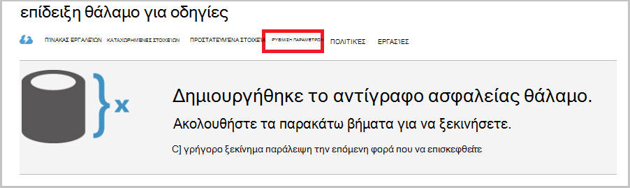

<properties
    pageTitle="Δημιουργία αντιγράφων ασφαλείας διακομιστή των Windows ή υπολογιστή-πελάτη στο Azure χρησιμοποιώντας το μοντέλο κλασική ανάπτυξης | Microsoft Azure"
    description="Δημιουργίας αντιγράφων ασφαλείας των Windows διακομιστές ή προγράμματα-πελάτες να Azure κατά τη δημιουργία ενός αντιγράφου ασφαλείας θάλαμο, τη λήψη διαπιστευτηρίων, κατά την εγκατάσταση τον παράγοντα αντιγράφων ασφαλείας και την ολοκλήρωση ένα αρχικό αντίγραφο ασφαλείας των αρχείων και φακέλων."
    services="backup"
    documentationCenter=""
    authors="markgalioto"
    manager="cfreeman"
    editor=""
    keywords="θάλαμο δημιουργίας αντιγράφων ασφαλείας; Δημιουργία αντιγράφου ασφαλείας σε Windows server; δημιουργίας αντιγράφων ασφαλείας των windows;"/>

<tags
    ms.service="backup"
    ms.workload="storage-backup-recovery"
    ms.tgt_pltfrm="na"
    ms.devlang="na"
    ms.topic="article"
    ms.date="08/08/2016"
    ms.author="jimpark; trinadhk; markgal"/>

# Επιστροφή στο πρόγραμμα-πελάτη ή Windows server Azure χρησιμοποιώντας το μοντέλο κλασική ανάπτυξης

> [AZURE.SELECTOR]
- [Κλασική πύλη](backup-configure-vault-classic.md)
- [Πύλη του Azure](backup-configure-vault.md)

Σε αυτό το άρθρο περιγράφει τις διαδικασίες που πρέπει να ακολουθήσετε για να προετοιμάσετε το περιβάλλον σας και να δημιουργήσετε αντίγραφα ασφαλείας ενός διακομιστή των Windows (ή προγράμματος-πελάτη) για να Azure. Επίσης, καλύπτει ζητήματα για την ανάπτυξη της λύσης αντιγράφου ασφαλείας σας. Εάν σας ενδιαφέρει προσπάθεια δημιουργίας αντιγράφων ασφαλείας Azure για πρώτη φορά, αυτό το άρθρο γρήγορα σάς καθοδηγεί κατά τη διαδικασία.

>[AZURE.IMPORTANT] Azure έχει δύο διαφορετικές ανάπτυξης μοντέλα για τη δημιουργία και εργασία με πόρους: Διαχείριση πόρων και κλασική. Σε αυτό το άρθρο καλύπτει χρησιμοποιώντας το μοντέλο κλασική ανάπτυξης. Η Microsoft συνιστά περισσότερες νέες αναπτύξεις χρησιμοποιείτε το μοντέλο από διαχειριστή πόρων.

## Πριν ξεκινήσετε
Να δημιουργήσετε αντίγραφα ασφαλείας διακομιστή ή προγράμματος-πελάτη για να Azure, χρειάζεστε ένα λογαριασμό Azure. Εάν δεν έχετε, μπορείτε να δημιουργήσετε έναν [δωρεάν λογαριασμό](https://azure.microsoft.com/free/) σε λίγα λεπτά.

## Βήμα 1: Δημιουργία ενός αντιγράφου ασφαλείας θάλαμο
Για να δημιουργήσετε αντίγραφα ασφαλείας αρχείων και φακέλων από ένα διακομιστή ή έναν υπολογιστή-πελάτη, χρειάζεστε για να δημιουργήσετε ένα αντίγραφο ασφαλείας θάλαμο σε γεωγραφική περιοχή όπου θέλετε να αποθηκεύσετε τα δεδομένα.

### Για να δημιουργήσετε ένα αντίγραφο ασφαλείας θάλαμο

1. Είσοδος στην [πύλη του κλασική](https://manage.windowsazure.com/).

2. Κάντε κλικ στην επιλογή **Δημιουργία** > **Υπηρεσίες δεδομένων** > **Υπηρεσίες ανάκτησης** > **Θάλαμο αντίγραφο ασφαλείας**, και, στη συνέχεια, επιλέξτε **Γρήγορης δημιουργίας**.

3. Για την παράμετρο **όνομα** , πληκτρολογήστε ένα φιλικό όνομα για το αντίγραφο ασφαλείας θάλαμο. Πληκτρολογήστε ένα όνομα που περιέχει μεταξύ 2 και 50 χαρακτήρων. Πρέπει να ξεκινούν με γράμμα και μπορούν να περιέχουν μόνο γράμματα, αριθμούς και παύλες. Αυτό το όνομα πρέπει να είναι μοναδικός για κάθε εγγραφή.

4. Για την παράμετρο **περιοχής** , επιλέξτε τη γεωγραφική περιοχή για το αντίγραφο ασφαλείας θάλαμο. Η επιλογή αυτή καθορίζει τη γεωγραφική περιοχή όπου αποστέλλονται τα δεδομένα αντιγράφου ασφαλείας σας. Επιλέγοντας μια γεωγραφική περιοχή που μοιάζει με την τοποθεσία σας, μπορείτε να μειώσετε λανθάνων χρόνος δικτύου κατά τη δημιουργία αντιγράφων ασφαλείας για να Azure.

5. Κάντε κλικ στην επιλογή **Δημιουργία θάλαμο**.

    

    Ενδέχεται να χρειαστεί κάποιος χρόνος για το αντίγραφο ασφαλείας θάλαμο θα δημιουργηθεί. Για να ελέγξετε την κατάσταση, παρακολουθήστε τις ειδοποιήσεις στο κάτω μέρος της κλασικής πύλης.

    Μετά τη δημιουργία του αντιγράφου ασφαλείας θάλαμο, θα δείτε ένα μήνυμα που σας πληροφορεί ότι το θάλαμο δημιουργήθηκε με επιτυχία. Επίσης εμφανίζεται ως **ενεργός** στη λίστα **Υπηρεσίες ανάκτησης** πόρων.

    

4. Ενεργοποιήστε την επιλογή πλεονασμού χώρου αποθήκευσης, ακολουθώντας τα βήματα που περιγράφονται εδώ.

    >[AZURE.IMPORTANT] Την καλύτερη δυνατή ώρα για τον προσδιορισμό της επιλογής πλεονασμού χώρου αποθήκευσης είναι αμέσως μετά τη δημιουργία θάλαμο και πριν από οποιοδήποτε μηχανές έχετε καταχωρήσει για να το θάλαμο. Μετά από ένα στοιχείο έχει καταχωρηθεί για το θάλαμο, η επιλογή πλεονασμού χώρου αποθήκευσης είναι κλειδωμένη και δεν μπορεί να τροποποιηθεί.

    Εάν χρησιμοποιείτε Azure ως ένα τελικό σημείο πρωτεύοντος αποθήκευσης αντιγράφων ασφαλείας (για παράδειγμα, δημιουργείτε αντίγραφα ασφαλείας σε Azure από ένα διακομιστή Windows), εξετάστε το ενδεχόμενο να επιλογή [παν πλεονάζοντα αποθήκευσης](../storage/storage-redundancy.md#geo-redundant-storage) επιλέγοντας (προεπιλογή).

    Εάν χρησιμοποιείτε Azure ως ένα τελικό σημείο τριτεύοντα αποθήκευσης αντιγράφων ασφαλείας (για παράδειγμα, χρησιμοποιείτε Διαχείριση προστασίας δεδομένων κέντρο συστήματος την store ένα τοπικό αντίγραφο ασφαλείας στην εσωτερική εγκατάσταση και τη χρήση Azure για μακροπρόθεσμη διατήρηση πρέπει), μπορείτε να επιλέξετε [τοπικά πλεονάζοντα χώρο αποθήκευσης](../storage/storage-redundancy.md#locally-redundant-storage). Αυτό μεταφέρει προς τα κάτω το κόστος με την αποθήκευση δεδομένων στο Azure, ενώ παρέχει χαμηλότερο επίπεδο διάρκεια ζωής για τα δεδομένα που ενδέχεται να είναι αποδεκτή για τριτεύοντα αντίγραφα.

    **Για να επιλέξετε την επιλογή πλεονασμού χώρου αποθήκευσης:**

    μια. Κάντε κλικ στην επιλογή το θάλαμο που μόλις δημιουργήσατε.

    β. Στη σελίδα Γρήγορη εκκίνηση, επιλέξτε **Ρύθμιση παραμέτρων**.

    

    c. Ενεργοποιήστε την επιλογή πλεονασμού κατάλληλη αποθήκευση.

    Εάν επιλέξετε **Τοπικά πλεονάζοντα**, πρέπει να κάντε κλικ στην επιλογή **Αποθήκευση** (επειδή **Πλεοναζουσών παν** είναι η προεπιλεγμένη ρύθμιση).

    d. Στο αριστερό παράθυρο περιήγησης, κάντε κλικ στην επιλογή **Υπηρεσίες ανάκτησης** για να επιστρέψετε στη λίστα των πόρων για τις υπηρεσίες ανάκτησης.

## Βήμα 2: Λήψη του αρχείου διαπιστευτηρίων θάλαμο
Υπολογιστή εσωτερικής εγκατάστασης πρέπει να υποβληθούν σε έλεγχο ταυτότητας με ένα αντίγραφο ασφαλείας θάλαμο πριν από το να δημιουργήσετε αντίγραφα ασφαλείας των δεδομένων σε Azure. Ο έλεγχος ταυτότητας είναι δυνατό μέσω *θάλαμο διαπιστευτήρια*. Το αρχείο διαπιστευτηρίων θάλαμο γίνεται λήψη μέσω ασφαλούς καναλιού από την πύλη κλασική. Το ιδιωτικό κλειδί πιστοποιητικού δεν διατηρείται στην πύλη του ή με την υπηρεσία.

Μάθετε περισσότερα σχετικά με τη [Χρήση φύλαξης διαπιστευτήρια για τον έλεγχο ταυτότητας με την υπηρεσία δημιουργίας αντιγράφων ασφαλείας](backup-introduction-to-azure-backup.md#what-is-the-vault-credential-file).

### Για να κάνετε λήψη του αρχείου διαπιστευτηρίων θάλαμο σε έναν τοπικό υπολογιστή

1. Στο αριστερό παράθυρο περιήγησης, κάντε κλικ στην επιλογή **Υπηρεσίες ανάκτησης**και, στη συνέχεια, επιλέξτε το θάλαμο αντιγράφου ασφαλείας που δημιουργήσατε.

    

2.  Στη σελίδα Γρήγορη εκκίνηση, κάντε κλικ στην επιλογή **λήψη θάλαμο διαπιστευτήρια**.

    Κλασική πύλη δημιουργεί μια πιστοποίηση θάλαμο χρησιμοποιώντας ένα συνδυασμό το όνομα θάλαμο και την τρέχουσα ημερομηνία. Το αρχείο διαπιστευτήρια θάλαμο χρησιμοποιείται μόνο κατά τη διάρκεια της ροής εργασίας εγγραφής και λήξη μετά 48 ώρες.

    Το αρχείο διαπιστευτηρίων θάλαμο μπορούν να ληφθούν από την πύλη.

3. Κάντε κλικ στο κουμπί **Αποθήκευση** για να κάνετε λήψη του αρχείου διαπιστευτηρίων θάλαμο στο φάκελο λήψεις του λογαριασμού του τοπικού. Μπορείτε επίσης να επιλέξετε **Αποθήκευση ως** από το μενού **Αποθήκευση** για να καθορίσετε μια θέση για το αρχείο διαπιστευτηρίων θάλαμο.

    >[AZURE.NOTE] Βεβαιωθείτε ότι το αρχείο διαπιστευτηρίων θάλαμο αποθηκεύεται σε μια θέση όπου είναι δυνατή η πρόσβαση από τον υπολογιστή σας. Εάν είναι αποθηκευμένο σε ένα αρχείο μπλοκ μηνύματος κοινή χρήση ή του διακομιστή, βεβαιωθείτε ότι έχετε τα δικαιώματα για την πρόσβαση σε αυτό.

## Βήμα 3: Λήψη, εγκατάσταση και καταχώρηση τον παράγοντα δημιουργίας αντιγράφων ασφαλείας
Αφού δημιουργήσετε το θάλαμο δημιουργίας αντιγράφων ασφαλείας και κάντε λήψη του αρχείου διαπιστευτηρίων θάλαμο, παράγοντας πρέπει να έχει εγκατασταθεί σε κάθε μία από τις μηχανές Windows.

### Για να κάνετε λήψη, εγκατάσταση και καταχώρηση τον παράγοντα

1. Κάντε κλικ στην επιλογή **Υπηρεσίες ανάκτησης**και, στη συνέχεια, επιλέξτε το θάλαμο αντιγράφου ασφαλείας που θέλετε να καταχωρήσετε με διακομιστή.

2. Στη σελίδα Γρήγορη εκκίνηση, κάντε κλικ στην επιλογή τον παράγοντα **παράγοντας για Windows Server ή διαχείριση προστασίας δεδομένων κέντρου συστήματος ή προγράμματος-πελάτη των Windows**. Στη συνέχεια, κάντε κλικ στην επιλογή **Αποθήκευση**.

    

3. Αφού λάβει το αρχείο MARSagentinstaller.exe, κάντε κλικ στην επιλογή **Εκτέλεση** (ή κάντε διπλό κλικ στο **MARSAgentInstaller.exe** από την αποθηκευμένη θέση).

4. Επιλέξτε το φάκελο εγκατάστασης και ένα φάκελο cache που απαιτούνται για τον παράγοντα και, στη συνέχεια, κάντε κλικ στο κουμπί **Επόμενο**. Η θέση του cache που καθορίζετε πρέπει να έχετε ελεύθερο χώρο ίσο με τουλάχιστον 5 τοις εκατό τα δεδομένα αντιγράφου ασφαλείας.

5. Μπορείτε να συνεχίσετε να συνδεθείτε στο Internet μέσω των προεπιλεγμένων ρυθμίσεων του διακομιστή μεσολάβησης.          Εάν χρησιμοποιείτε διακομιστή μεσολάβησης για να συνδεθείτε στο Internet, στη σελίδα Ρύθμιση παραμέτρων διακομιστή μεσολάβησης, επιλέξτε το πλαίσιο ελέγχου **Χρήση διακομιστή μεσολάβησης προσαρμοσμένες ρυθμίσεις** και, στη συνέχεια, πληκτρολογήστε τις λεπτομέρειες του διακομιστή μεσολάβησης. Εάν χρησιμοποιείτε ένα με έλεγχο ταυτότητας διακομιστή μεσολάβησης, πληκτρολογήστε τα στοιχεία όνομα και τον κωδικό πρόσβασης του χρήστη και, στη συνέχεια, κάντε κλικ στο κουμπί **Επόμενο**.

7. Κάντε κλικ στην επιλογή **εγκατάσταση** για να ξεκινήσετε την εγκατάσταση παράγοντα. Ο παράγοντας αντίγραφο ασφαλείας εγκαθιστά διαίρεσης 4,5 .NET Framework και του Windows PowerShell (Εάν δεν είναι ήδη εγκατεστημένο) για να ολοκληρώσετε την εγκατάσταση.

8. Μετά την εγκατάσταση του παράγοντα, κάντε κλικ στο κουμπί **συνέχεια για να την καταχώρηση** για να συνεχίσετε με τη ροή εργασίας.

9. Στη σελίδα θάλαμο αναγνώρισης, αναζητήστε και επιλέξτε το αρχείο διαπιστευτηρίων θάλαμο που λάβατε προηγουμένως.

    Το αρχείο διαπιστευτηρίων θάλαμο είναι έγκυρη μόνο 48 ώρες μετά τη λήψη του από την πύλη. Εάν παρουσιαστεί σφάλμα σε αυτήν τη σελίδα (όπως "θάλαμο διαπιστευτήρια που παρέχονται από το αρχείο έχει λήξει"), συνδεθείτε πύλη του και επαναλάβετε τη λήψη του αρχείου διαπιστευτηρίων θάλαμο.

    Βεβαιωθείτε ότι το αρχείο διαπιστευτηρίων θάλαμο είναι διαθέσιμη σε μια θέση όπου είναι δυνατή η πρόσβαση από την εφαρμογή ρύθμισης. Εάν αντιμετωπίζετε σφάλματα που σχετίζονται με την access, αντιγράψτε το αρχείο διαπιστευτηρίων θάλαμο σε μια προσωρινή θέση στον ίδιο υπολογιστή και επαναλάβετε τη λειτουργία.

    Εάν αντιμετωπίσετε ένα σφάλμα διαπιστευτηρίων θάλαμο όπως "δεν είναι έγκυρη θάλαμο διαπιστευτήρια που παρέχονται", το αρχείο έχει καταστραφεί ή δεν έχουν την πιο πρόσφατη διαπιστευτήρια που σχετίζεται με την υπηρεσία αποκατάστασης. Επανάληψη της λειτουργίας μετά τη λήψη ενός νέου αρχείου διαπιστευτηρίων θάλαμο από την πύλη. Αυτό το σφάλμα μπορεί να προκύψει εάν ένας χρήστης κάνει κλικ στην επιλογή **λήψης διαπιστευτηρίων θάλαμο** πολλές φορές στη σειρά γρήγορης. Σε αυτήν την περίπτωση, ισχύει μόνο του τελευταίου αρχείου διαπιστευτηρίων θάλαμο.

9. Στη σελίδα ρύθμιση κρυπτογράφησης, μπορείτε να δημιουργήσετε μια φράση πρόσβασης ή να δώσετε μια φράση πρόσβασης (με τουλάχιστον 16 χαρακτήρες). Να θυμάστε ότι για να αποθηκεύσετε τη φράση πρόσβασης σε ασφαλή θέση.

10. Κάντε κλικ στο κουμπί **Τέλος**. Ο οδηγός διακομιστή καταχώρηση καταχωρεί στο διακομιστή με αντίγραφα ασφαλείας.

    >[AZURE.WARNING] Εάν χάσετε ή ξεχάσετε τη φράση πρόσβασης, Microsoft δεν είναι δυνατό να σας βοηθήσουν να ανακτήσετε τα δεδομένα αντιγράφου ασφαλείας. Είστε ο κάτοχος τη φράση πρόσβασης κρυπτογράφησης και η Microsoft δεν διαθέτει ορατότητα στην τη φράση πρόσβασης που χρησιμοποιείτε. Αποθηκεύστε το αρχείο σε ασφαλή θέση, επειδή θα είναι απαιτείται κατά τη διάρκεια μιας λειτουργίας ανάκτησης.

11. Μετά τη ρύθμιση του κλειδιού κρυπτογράφησης, αφήστε επιλεγμένο το πλαίσιο ελέγχου **Εκκίνηση Microsoft Azure υπηρεσίες παράγοντα αποκατάστασης** και, στη συνέχεια, κάντε κλικ στο κουμπί **Κλείσιμο**.

## Βήμα 4: Ολοκληρώστε το αρχικό αντίγραφο ασφαλείας

Το αρχικό αντίγραφο ασφαλείας περιλαμβάνει δύο βασικές εργασίες:

- Δημιουργία αντιγράφου ασφαλείας του χρονοδιαγράμματος
- Δημιουργία αντιγράφων ασφαλείας αρχείων και φακέλων για πρώτη φορά

Μετά την πολιτική ασφαλείας ολοκληρωθεί το αρχικό αντίγραφο ασφαλείας, δημιουργεί αντίγραφο ασφαλείας σημεία που μπορείτε να χρησιμοποιήσετε εάν θέλετε να ανακτήσετε τα δεδομένα. Η πολιτική ασφαλείας το κάνει αυτό με βάση το χρονοδιάγραμμα που έχετε καθορίσει.

### Για να προγραμματίσετε τη δημιουργία αντιγράφων ασφαλείας

1. Ανοίξτε τον παράγοντα δημιουργίας αντιγράφων ασφαλείας του Microsoft Azure. (Αυτό θα ανοίξει αυτόματα εάν είχατε επιλεγμένο κατά το κλείσιμο του οδηγού διακομιστή καταχώρηση το πλαίσιο ελέγχου **Εκκίνηση Microsoft Azure υπηρεσίες παράγοντα αποκατάστασης** .) Μπορείτε να το βρείτε κάνοντας αναζήτηση τον υπολογιστή σας για **Δημιουργία αντιγράφων ασφαλείας του Microsoft Azure**.

    

2. Στον παράγοντα δημιουργίας αντιγράφων ασφαλείας, κάντε κλικ στην επιλογή **Χρονοδιάγραμμα δημιουργίας αντιγράφων ασφαλείας**.

    

3. Στη σελίδα του Οδηγού δημιουργίας αντιγράφων ασφαλείας χρονοδιάγραμμα γρήγορα αποτελέσματα, κάντε κλικ στο κουμπί **Επόμενο**.

4. Στα στοιχεία επιλογή σελίδα δημιουργίας αντιγράφων ασφαλείας, κάντε κλικ στην επιλογή **Προσθήκη στοιχείων**.

5. Επιλέξτε τα αρχεία και τους φακέλους που θέλετε να δημιουργήσετε αντίγραφα ασφαλείας και, στη συνέχεια, κάντε κλικ στην επιλογή **εντάξει**.

6. Κάντε κλικ στο κουμπί **Επόμενο**.

7. Στη σελίδα **Καθορισμός χρονοδιάγραμμα δημιουργίας αντιγράφων ασφαλείας** , καθορίστε το **Χρονοδιάγραμμα δημιουργίας αντιγράφων ασφαλείας** και κάντε κλικ στο κουμπί **Επόμενο**.

    Μπορείτε να προγραμματίσετε ημερήσια (με μέγιστη ταχύτητα τρεις φορές ανά ημέρα) ή εβδομαδιαία δημιουργίας αντιγράφων ασφαλείας.

    

    >[AZURE.NOTE] Για περισσότερες πληροφορίες σχετικά με τον τρόπο για να καθορίσετε το χρονοδιάγραμμα αντιγράφων ασφαλείας, ανατρέξτε στο άρθρο [Χρήση Azure δημιουργίας αντιγράφων ασφαλείας για να αντικαταστήσετε την υποδομή ταινίας σας](backup-azure-backup-cloud-as-tape.md).

8. Στη σελίδα **Επιλογή πολιτικής διατήρησης** , επιλέξτε την **Πολιτική διατήρησης** για το αντίγραφο ασφαλείας.

    Η πολιτική διατήρησης Καθορίζει τη διάρκεια για την οποία θα αποθηκευτεί το αντίγραφο ασφαλείας. Και όχι μόνο καθορίζοντας μια "επίπεδο πολιτική" για όλα τα σημεία αντιγράφου ασφαλείας, μπορείτε να καθορίσετε πολιτικές διατήρησης διαφορετική βάση όταν παρουσιάζεται το αντίγραφο ασφαλείας. Μπορείτε να τροποποιήσετε τις πολιτικές διατήρησης ημερήσια, εβδομαδιαία, μηνιαία και ετήσια ώστε να ανταποκρίνεται στις ανάγκες σας.

9. Στη σελίδα επιλέξτε αρχικός τύπος αντιγράφου ασφαλείας, επιλέξτε τον αρχικό τύπο αντιγράφου ασφαλείας. Αφήστε την επιλογή **Αυτόματη μέσω του δικτύου** επιλεγμένο και, στη συνέχεια, κάντε κλικ στο κουμπί **Επόμενο**.

    Μπορείτε να δημιουργήσετε αντίγραφα ασφαλείας αυτόματα στο δίκτυο ή μπορείτε να δημιουργήσετε αντίγραφα ασφαλείας για εργασία χωρίς σύνδεση. Το υπόλοιπο της σε αυτό το άρθρο περιγράφει τη διαδικασία για την αυτόματη δημιουργία αντιγράφων ασφαλείας. Εάν προτιμάτε να κάνετε ένα αντίγραφο ασφαλείας για εργασία χωρίς σύνδεση, διαβάστε το άρθρο [για εργασία χωρίς σύνδεση ροής εργασίας δημιουργίας αντιγράφων ασφαλείας στο Azure αντιγράφου ασφαλείας](backup-azure-backup-import-export.md) για πρόσθετες πληροφορίες.

10. Στη σελίδα Confirmation, ελέγξτε τις πληροφορίες και, στη συνέχεια, κάντε κλικ στο κουμπί **Τέλος**.

11. Μετά την ολοκλήρωση του Οδηγού δημιουργίας αντιγράφων ασφαλείας στο χρονοδιάγραμμα, κάντε κλικ στο κουμπί **Κλείσιμο**.

### Ενεργοποίηση δικτύου περιορισμού (προαιρετικά)

Ο παράγοντας δημιουργίας αντιγράφων ασφαλείας παρέχει περιορισμού δικτύου. Περιορισμού στοιχεία ελέγχου τον τρόπο χρήσης του εύρους ζώνης δικτύου κατά τη μεταφορά δεδομένων. Αυτό το στοιχείο ελέγχου μπορεί να είναι χρήσιμο εάν θέλετε να δημιουργήσετε αντίγραφα ασφαλείας δεδομένων κατά τη διάρκεια ώρες εργασίας, αλλά δεν θέλετε η διαδικασία δημιουργίας αντιγράφων ασφαλείας για να παρεμβάλλεται με άλλες κυκλοφορία Internet. Περιορισμού ισχύει για δημιουργία αντιγράφων ασφαλείας και επαναφορά δραστηριότητες.

**Για να ενεργοποιήσετε την επιτάχυνση δικτύου**

1. Στον παράγοντα δημιουργίας αντιγράφων ασφαλείας, κάντε κλικ στην επιλογή **Αλλαγή ιδιοτήτων**.

    

2. Στην καρτέλα **Throttling** , επιλέξτε το πλαίσιο ελέγχου **Ενεργοποίηση της χρήσης του εύρους ζώνης internet περιορισμού για λειτουργίες δημιουργίας αντιγράφων ασφαλείας** .

    

3. Αφού έχετε ενεργοποιήσει το περιορισμού, καθορίστε το επιτρεπόμενο εύρος ζώνης για μεταφορά των αντιγράφων ασφαλείας δεδομένων κατά τη διάρκεια των **ωρών εργασίας** και **μη εργάσιμες ώρες**.

    Οι τιμές εύρους ζώνης ξεκινά σε 512 kilobit ανά δευτερόλεπτο (Kbps) και να μεταβείτε προς τα επάνω στο 1,023 megabyte ανά δευτερόλεπτο (MBps). Μπορείτε επίσης να ορίσετε την έναρξη και να λήξης για τις **εργάσιμες ώρες**και ποιες ημέρες της εβδομάδας είναι εξέταση εργάσιμες ημέρες. Ώρες εκτός θεωρούνται ώρες την εργασία που έχει οριστεί ως μη-εργασίας ώρες.

4. Κάντε κλικ στο **κουμπί OK**.

### Για να δημιουργήσετε αντίγραφα ασφαλείας τώρα

1. Στον παράγοντα δημιουργίας αντιγράφων ασφαλείας, κάντε κλικ στην επιλογή **Άμεση δημιουργία αντιγράφων ασφαλείας** για να ολοκληρώσετε την αρχική καλλιέργεια μέσω του δικτύου.

    

2. Στη σελίδα Confirmation, αναθεωρήστε τις ρυθμίσεις που θα χρησιμοποιήσει η επιστροφή του τώρα οδηγό για να δημιουργήσετε αντίγραφα ασφαλείας στον υπολογιστή. Στη συνέχεια, κάντε κλικ στην επιλογή **Δημιουργία αντιγράφων ασφαλείας**.

3. Κάντε κλικ στο κουμπί **Κλείσιμο** για να κλείσετε τον οδηγό. Εάν το κάνετε αυτό πριν ολοκληρωθεί η διαδικασία δημιουργίας αντιγράφων ασφαλείας, ο οδηγός εξακολουθεί να εκτελείται στο παρασκήνιο.

Μετά την ολοκλήρωση της αρχικής δημιουργίας αντιγράφων ασφαλείας, εμφανίζεται η κατάσταση **εργασίας ολοκληρώθηκε** στην κονσόλα δημιουργίας αντιγράφων ασφαλείας.

## Επόμενα βήματα
- Εγγραφείτε για έναν [δωρεάν λογαριασμό της Azure](https://azure.microsoft.com/free/).

Για πρόσθετες πληροφορίες σχετικά με τη δημιουργία αντιγράφων ασφαλείας ΣΠΣ ή άλλες φόρτους εργασίας, ανατρέξτε στο θέμα:

- [Δημιουργία αντιγράφου ασφαλείας ΣΠΣ IaaS](backup-azure-vms-prepare.md)
- [Δημιουργία αντιγράφου ασφαλείας φόρτους εργασίας να Azure με το Microsoft Azure δημιουργίας αντιγράφων ασφαλείας διακομιστή](backup-azure-microsoft-azure-backup.md)
- [Δημιουργία αντιγράφου ασφαλείας φόρτους εργασίας να Azure με DPM](backup-azure-dpm-introduction.md)
