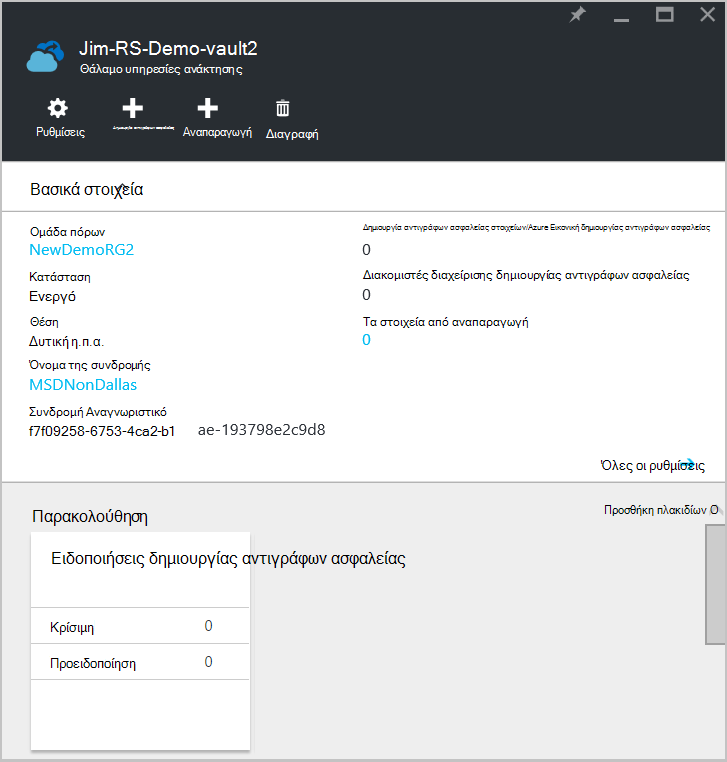

<properties
    pageTitle="Δημιουργία αντιγράφων ασφαλείας πρόγραμμα-πελάτη για να Azure με αντίγραφα ασφαλείας Azure χρησιμοποιώντας το μοντέλο ανάπτυξης για τη διαχείριση πόρων ή Windows Server | Microsoft Azure"
    description="Δημιουργίας αντιγράφων ασφαλείας των Windows διακομιστές ή προγράμματα-πελάτες να Azure κατά τη δημιουργία ενός αντιγράφου ασφαλείας θάλαμο, τη λήψη διαπιστευτηρίων, κατά την εγκατάσταση τον παράγοντα αντιγράφων ασφαλείας και την ολοκλήρωση ένα αρχικό αντίγραφο ασφαλείας των αρχείων και φακέλων."
    services="backup"
    documentationCenter=""
    authors="markgalioto"
    manager="cfreeman"
    editor=""
    keywords="δημιουργίας αντιγράφων ασφαλείας θάλαμο; Δημιουργία αντιγράφου ασφαλείας σε Windows server; δημιουργίας αντιγράφων ασφαλείας των windows;"/>

<tags
    ms.service="backup"
    ms.workload="storage-backup-recovery"
    ms.tgt_pltfrm="na"
    ms.devlang="na"
    ms.topic="article"
    ms.date="08/10/2016"
    ms.author="jimpark; trinadhk; markgal"/>

# Επιστροφή στο πρόγραμμα-πελάτη ή Windows Server Azure χρησιμοποιώντας το μοντέλο ανάπτυξης για τη διαχείριση πόρων

> [AZURE.SELECTOR]
- [Πύλη του Azure](backup-configure-vault.md)
- [Κλασική πύλη](backup-configure-vault-classic.md)

Σε αυτό το άρθρο εξηγεί πώς μπορείτε να δημιουργήσετε αντίγραφα ασφαλείας του Windows Server (ή Windows προγράμματος-πελάτη) αρχείων και φακέλων σε Azure με αντίγραφα ασφαλείας Azure χρησιμοποιώντας το μοντέλο ανάπτυξης διαχείρισης πόρων.

[AZURE.INCLUDE [learn-about-deployment-models](../../includes/backup-deployment-models.md)]

## Πριν ξεκινήσετε
Να δημιουργήσετε αντίγραφα ασφαλείας διακομιστή ή προγράμματος-πελάτη για να Azure, χρειάζεστε ένα λογαριασμό Azure. Εάν δεν έχετε, μπορείτε να δημιουργήσετε έναν [δωρεάν λογαριασμό](https://azure.microsoft.com/free/) σε λίγα λεπτά.

## Βήμα 1: Δημιουργήστε ένα θάλαμο υπηρεσίες ανάκτησης

Ένα θάλαμο υπηρεσίες ανάκτησης είναι μια οντότητα που αποθηκεύει όλα τα αντίγραφα ασφαλείας και αποκατάστασης σημεία που δημιουργείτε μέσα στο χρόνο. Το θάλαμο υπηρεσίες ανάκτησης περιέχει επίσης την πολιτική ασφαλείας εφαρμόζεται για τα προστατευμένα αρχεία και φακέλους. Όταν δημιουργείτε ένα θάλαμο υπηρεσίες ανάκτησης, θα πρέπει επίσης να επιλέξετε την επιλογή πλεονασμού κατάλληλη αποθήκευση.

### Για να δημιουργήσετε ένα θάλαμο υπηρεσίες ανάκτησης

1. Εάν έχετε ήδη κάνει, συνδεθείτε για να την [Πύλη Azure](https://portal.azure.com/) χρησιμοποιώντας το Azure τη συνδρομή σας.

2. Στο μενού διανομέα, κάντε κλικ στο κουμπί **Αναζήτηση** και στη λίστα των πόρων, πληκτρολογήστε **Υπηρεσίες ανάκτησης**. Καθώς αρχίζετε να πληκτρολογείτε, θα φιλτράρετε τη λίστα με βάση τα δεδομένα εισόδου σας. Κάντε κλικ στην επιλογή **υπηρεσίες ανάκτησης χώροι φύλαξης**.

      

    Εμφανίζεται η λίστα των χώροι φύλαξης υπηρεσίες ανάκτησης.

3. Στο μενού **χώροι φύλαξης υπηρεσίες ανάκτησης** , κάντε κλικ στην επιλογή **Προσθήκη**.

    

    Ανοίγει το blade θάλαμο υπηρεσίες ανάκτησης, να σας ζητήσει να δώσετε ένα **όνομα**, **τη συνδρομή**, **ομάδα πόρων**και **θέση**.

    

4. **Όνομα**, πληκτρολογήστε ένα φιλικό όνομα για τον προσδιορισμό του θάλαμο. Το όνομα πρέπει να είναι μοναδικό για τη συνδρομή Azure. Πληκτρολογήστε ένα όνομα που περιέχει μεταξύ 2 και 50 χαρακτήρων. Πρέπει να ξεκινούν με γράμμα και μπορούν να περιέχουν μόνο γράμματα, αριθμούς και παύλες.

5. Κάντε κλικ στην **εγγραφή** για να δείτε τη διαθέσιμη λίστα συνδρομών. Εάν δεν είστε βέβαιοι ποια συνδρομή για να χρησιμοποιήσετε, χρησιμοποιήστε την προεπιλεγμένη (ή προτεινόμενες) συνδρομής. Θα υπάρξει πολλαπλές επιλογές μόνο εάν είναι συσχετισμένη με πολλές συνδρομές Azure τον εταιρικό λογαριασμό σας.

6. Κάντε κλικ στην επιλογή **ομάδα πόρων** για να δείτε τη διαθέσιμη λίστα ομάδων πόρων ή κάντε κλικ στην επιλογή **Δημιουργία** για να δημιουργήσετε μια νέα ομάδα πόρων. Για πλήρεις πληροφορίες σχετικά με τις ομάδες πόρων, ανατρέξτε στο θέμα [Επισκόπηση της διαχείρισης πόρων Azure](../azure-resource-manager/resource-group-overview.md)

7. Κάντε κλικ στην επιλογή **θέσης** για να επιλέξετε τη γεωγραφική περιοχή για το θάλαμο. Η επιλογή αυτή καθορίζει τη γεωγραφική περιοχή όπου αποστέλλονται τα δεδομένα αντιγράφου ασφαλείας σας. Επιλέγοντας μια γεωγραφική περιοχή που μοιάζει με την τοποθεσία σας, μπορείτε να μειώσετε λανθάνων χρόνος δικτύου κατά τη δημιουργία αντιγράφων ασφαλείας για να Azure.

8. Κάντε κλικ στην επιλογή **Δημιουργία**. Ενδέχεται να χρειαστεί κάποιος χρόνος για το θάλαμο υπηρεσίες ανάκτησης που θα δημιουργηθεί. Παρακολουθείτε τις ειδοποιήσεις κατάστασης στην επάνω δεξιά περιοχή στην πύλη. Αφού δημιουργηθεί το θάλαμο, θα πρέπει να ανοίξει στην πύλη. Εάν δεν βλέπετε το θάλαμο εμφανίζεται αφού έχει ολοκληρωθεί, κάντε κλικ στην επιλογή **Ανανέωση**. Κατά την ανανέωση της λίστας, κάντε κλικ στο όνομα του θάλαμο.

### Για να προσδιορίσετε πλεονασμού χώρου αποθήκευσης
Όταν δημιουργείτε για πρώτη φορά ένα θάλαμο υπηρεσίες ανάκτησης καθορίζετε πώς γίνεται αναπαραγωγή χώρου αποθήκευσης.

1. Στο το blade **Ρυθμίσεις** , το οποίο ανοίγει αυτόματα με τον πίνακα εργαλείων σας θάλαμο, κάντε κλικ στην επιλογή **Υποδομή δημιουργίας αντιγράφων ασφαλείας**.

2. Στο το blade υποδομή αντίγραφο ασφαλείας, κάντε κλικ **Ρύθμισης παραμέτρων δημιουργίας αντιγράφων ασφαλείας** για να προβάλετε τον **τύπο αναπαραγωγής αποθήκευσης**.

    

3. Ενεργοποιήστε την επιλογή αναπαραγωγή χώρου αποθήκευσης για το θάλαμο.

    

    Από προεπιλογή, το θάλαμο έχει παν πλεονάζοντα χώρο αποθήκευσης. Εάν χρησιμοποιείτε Azure ως ένα τελικό σημείο πρωτεύοντος αποθήκευσης αντιγράφων ασφαλείας, συνεχίστε να χρησιμοποιείτε παν πλεονάζοντα χώρο αποθήκευσης. Εάν χρησιμοποιείτε Azure ως ένα τελικό σημείο αποθήκευσης αντιγράφων ασφαλείας μη πρωτεύοντος, στη συνέχεια, επιλέξτε τοπικά πλεονάζοντα χώρο αποθήκευσης, έτσι θα μειωθεί το κόστος με την αποθήκευση δεδομένων στο Azure. Διαβάστε περισσότερα σχετικά με το [παν πλεονάζοντα](../storage/storage-redundancy.md#geo-redundant-storage) και [τοπικά πλεονάζοντα](../storage/storage-redundancy.md#locally-redundant-storage) επιλογές αποθήκευσης στο αυτή η [Επισκόπηση](../storage/storage-redundancy.md).

    Αφού επιλέξετε την επιλογή αποθήκευσης για το θάλαμο, είστε έτοιμοι να συσχετίσετε αρχεία και φακέλους με την θάλαμο.

Τώρα που έχετε δημιουργήσει ένα θάλαμο, μπορείτε να προετοιμάσετε την υποδομή σας για να δημιουργήσετε αντίγραφα ασφαλείας αρχείων και φακέλων με τη λήψη και εγκατάσταση τον παράγοντα υπηρεσίες ανάκτησης του Microsoft Azure, τη λήψη θάλαμο διαπιστευτήρια και, στη συνέχεια, χρησιμοποιώντας αυτά τα διαπιστευτήρια για να καταχωρήσετε τον παράγοντα με το θάλαμο.

## Βήμα 2 - λήψη αρχείων

>[AZURE.NOTE] Ενεργοποίηση δημιουργίας αντιγράφων ασφαλείας μέσω της πύλης Azure σύντομα διαθέσιμο. Προς το παρόν, μπορείτε να χρησιμοποιήσετε το Microsoft Agent υπηρεσίες ανάκτησης Azure εσωτερικής εγκατάστασης για να δημιουργήσετε αντίγραφα ασφαλείας των αρχείων και φακέλων.

1. Κάντε κλικ στην επιλογή **Ρυθμίσεις** στον πίνακα εργαλείων θάλαμο υπηρεσίες ανάκτησης.

    

2. Κάντε κλικ στην επιλογή **Γρήγορα αποτελέσματα > Δημιουργία αντιγράφων ασφαλείας** στην το blade ρυθμίσεις.

    

3. Κάντε κλικ στην επιλογή **στόχος αντίγραφο ασφαλείας** σε blade το αντίγραφο ασφαλείας.

    

4. Επιλέξτε **εσωτερικής εγκατάστασης** από το σημείο όπου είναι το φόρτο εργασίας εκτελούνται; μενού.

5. Επιλογή **αρχείων και φακέλων** από το τι θέλετε να δημιουργίας αντιγράφων ασφαλείας; μενού, και κάντε κλικ στο **κουμπί OK**.

#### Λήψη τον παράγοντα υπηρεσίες ανάκτησης

1. Κάντε κλικ **λήψη παράγοντας για Windows Server ή Windows προγράμματος-πελάτη** του blade **Προετοιμασία υποδομής** .

    

2. Κάντε κλικ στην επιλογή **Αποθήκευση** στο αναδυόμενο παράθυρο λήψης. Από προεπιλογή, το αρχείο **MARSagentinstaller.exe** αποθηκεύεται στο φάκελο λήψεις.

#### Λήψη θάλαμο διαπιστευτήρια

1. Κάντε κλικ στην επιλογή **λήψη > Αποθήκευση** στην την προετοιμασία blade υποδομής.

    

## Βήμα 3 - εγκατάσταση και καταχώρηση τον παράγοντα

1. Εντοπίστε και κάντε διπλό κλικ το **MARSagentinstaller.exe** από το φάκελο Downloads (ή άλλη αποθηκευμένη θέση).

2. Ολοκληρώστε τον Οδηγό εγκατάστασης Microsoft Azure αποκατάστασης υπηρεσίες παράγοντα. Για να ολοκληρώσετε τον οδηγό, πρέπει να:

    - Επιλέξτε μια θέση για την εγκατάσταση και φάκελο cache.
    - Δώστε του διακομιστή μεσολάβησης πληροφορίες διακομιστή εάν χρησιμοποιείτε διακομιστή μεσολάβησης για να συνδεθείτε στο internet.
    - Δώστε χρήστη σας λεπτομέρειες για το όνομα και τον κωδικό πρόσβασης Εάν χρησιμοποιείτε ένα με έλεγχο ταυτότητας διακομιστή μεσολάβησης.
    - Δώστε τα διαπιστευτήρια που έχετε λάβει θάλαμο
    - Αποθηκεύστε τη φράση πρόσβασης κρυπτογράφησης σε ασφαλή θέση.

    >[AZURE.NOTE] Εάν χάσετε ή ξεχάσετε τη φράση πρόσβασης, η Microsoft δεν μπορεί να βοηθήσει ανακτήσετε τα δεδομένα αντιγράφου ασφαλείας. Αποθηκεύστε το αρχείο σε ασφαλή θέση. Απαιτείται για να επαναφέρετε ένα αντίγραφο ασφαλείας.

Ο παράγοντας τώρα έχει εγκατασταθεί και ο υπολογιστής σας έχει καταχωρηθεί για το θάλαμο. Είστε έτοιμοι για να ρυθμίσετε τις παραμέτρους και να προγραμματίσετε το αντίγραφο ασφαλείας.

### Επιβεβαιώστε την εγκατάσταση

Για να επιβεβαιώσετε ότι ο παράγοντας έχει εγκατασταθεί και έχουν καταχωρηθεί σωστά, μπορείτε να ελέγξετε για τα στοιχεία που είχατε δημιουργήσει αντίγραφα ασφαλείας της ενότητας **Διακομιστή παραγωγής** της πύλης διαχείρισης. Για να το κάνετε αυτό:

1. Πραγματοποιήστε είσοδο [Πύλη Azure](https://portal.azure.com/) χρησιμοποιώντας τη συνδρομή σας στο Azure.

2. Στο μενού διανομέα, κάντε κλικ στο κουμπί **Αναζήτηση** και στη λίστα των πόρων, πληκτρολογήστε **Υπηρεσίες ανάκτησης**. Καθώς αρχίζετε να πληκτρολογείτε, θα φιλτράρετε τη λίστα με βάση τα δεδομένα εισόδου σας. Κάντε κλικ στην επιλογή **υπηρεσίες ανάκτησης χώροι φύλαξης**.

      

    Εμφανίζεται η λίστα των χώροι φύλαξης υπηρεσίες ανάκτησης.

2. Επιλέξτε το όνομα του το θάλαμο που δημιουργήσατε.

    Ανοίγει το blade υπηρεσίες ανάκτησης θάλαμο πίνακα εργαλείων.

      

3. Κάντε κλικ στο κουμπί **Ρυθμίσεις** στο επάνω μέρος της σελίδας.

4. Κάντε κλικ στην επιλογή **Δημιουργία αντιγράφων ασφαλείας υποδομή > διακομιστές παραγωγής**.

    

Εάν βλέπετε τους διακομιστές σας στη λίστα, έχετε επιβεβαίωσης ότι ο παράγοντας έχει εγκατασταθεί και έχουν καταχωρηθεί σωστά.

## Βήμα 4: Ολοκληρώστε το αρχικό αντίγραφο ασφαλείας

Το αρχικό αντίγραφο ασφαλείας περιλαμβάνει δύο βασικές εργασίες:

- Προγραμματισμός της δημιουργίας αντιγράφων ασφαλείας
- Δημιουργία αντιγράφων ασφαλείας αρχείων και φακέλων για πρώτη φορά

Για να ολοκληρώσετε το αρχικό αντίγραφο ασφαλείας, μπορείτε να χρησιμοποιήσετε τον παράγοντα αντιγράφων ασφαλείας του Microsoft Azure.

### Για να προγραμματίσετε τη δημιουργία αντιγράφων ασφαλείας

1. Ανοίξτε τον παράγοντα δημιουργίας αντιγράφων ασφαλείας του Microsoft Azure. Μπορείτε να το βρείτε κάνοντας αναζήτηση τον υπολογιστή σας για **Δημιουργία αντιγράφων ασφαλείας του Microsoft Azure**.

    

2. Στον παράγοντα δημιουργίας αντιγράφων ασφαλείας, κάντε κλικ στην επιλογή **Χρονοδιάγραμμα δημιουργίας αντιγράφων ασφαλείας**.

    

3. Στη σελίδα του Οδηγού δημιουργίας αντιγράφων ασφαλείας χρονοδιάγραμμα γρήγορα αποτελέσματα, κάντε κλικ στο κουμπί **Επόμενο**.

4. Στα στοιχεία επιλογή σελίδα δημιουργίας αντιγράφων ασφαλείας, κάντε κλικ στην επιλογή **Προσθήκη στοιχείων**.

5. Επιλέξτε τα αρχεία και τους φακέλους που θέλετε να δημιουργήσετε αντίγραφα ασφαλείας και, στη συνέχεια, κάντε κλικ στην επιλογή **εντάξει**.

6. Κάντε κλικ στο κουμπί **Επόμενο**.

7. Στη σελίδα **Καθορισμός χρονοδιάγραμμα δημιουργίας αντιγράφων ασφαλείας** , καθορίστε το **Χρονοδιάγραμμα δημιουργίας αντιγράφων ασφαλείας** και κάντε κλικ στο κουμπί **Επόμενο**.

    Μπορείτε να προγραμματίσετε ημερήσια (με μέγιστη ταχύτητα τρεις φορές ανά ημέρα) ή εβδομαδιαία δημιουργίας αντιγράφων ασφαλείας.

    

    >[AZURE.NOTE] Για περισσότερες πληροφορίες σχετικά με τον τρόπο για να καθορίσετε το χρονοδιάγραμμα αντιγράφων ασφαλείας, ανατρέξτε στο άρθρο [Χρήση Azure δημιουργίας αντιγράφων ασφαλείας για να αντικαταστήσετε την υποδομή ταινία σας](backup-azure-backup-cloud-as-tape.md).

8. Στη σελίδα **Επιλογή πολιτικής διατήρησης** , επιλέξτε την **Πολιτική διατήρησης** για το αντίγραφο ασφαλείας.

    Η πολιτική διατήρησης Καθορίζει τη διάρκεια για την οποία θα αποθηκευτεί το αντίγραφο ασφαλείας. Και όχι μόνο καθορίζοντας μια "επίπεδο πολιτική" για όλα τα σημεία αντιγράφου ασφαλείας, μπορείτε να καθορίσετε πολιτικές διατήρησης διαφορετική βάση όταν παρουσιάζεται το αντίγραφο ασφαλείας. Μπορείτε να τροποποιήσετε τις πολιτικές διατήρησης ημερήσια, εβδομαδιαία, μηνιαία και ετήσια ώστε να ανταποκρίνεται στις ανάγκες σας.

9. Στη σελίδα επιλέξτε αρχικός τύπος αντιγράφου ασφαλείας, επιλέξτε τον αρχικό τύπο αντιγράφου ασφαλείας. Αφήστε την επιλογή **Αυτόματη μέσω του δικτύου** επιλεγμένο και, στη συνέχεια, κάντε κλικ στο κουμπί **Επόμενο**.

    Μπορείτε να δημιουργήσετε αντίγραφα ασφαλείας αυτόματα στο δίκτυο ή μπορείτε να δημιουργήσετε αντίγραφα ασφαλείας για εργασία χωρίς σύνδεση. Το υπόλοιπο της σε αυτό το άρθρο περιγράφει τη διαδικασία για την αυτόματη δημιουργία αντιγράφων ασφαλείας. Εάν προτιμάτε να κάνετε ένα αντίγραφο ασφαλείας για εργασία χωρίς σύνδεση, διαβάστε το άρθρο [για εργασία χωρίς σύνδεση ροής εργασίας δημιουργίας αντιγράφων ασφαλείας στο Azure αντιγράφου ασφαλείας](backup-azure-backup-import-export.md) για πρόσθετες πληροφορίες.

10. Στη σελίδα Confirmation, ελέγξτε τις πληροφορίες και, στη συνέχεια, κάντε κλικ στο κουμπί **Τέλος**.

11. Μετά την ολοκλήρωση του Οδηγού δημιουργίας αντιγράφων ασφαλείας στο χρονοδιάγραμμα, κάντε κλικ στο κουμπί **Κλείσιμο**.

### Ενεργοποίηση δικτύου περιορισμού (προαιρετικά)

Τον παράγοντα αντιγράφων ασφαλείας παρέχει περιορισμού δικτύου. Περιορισμού στοιχεία ελέγχου τον τρόπο χρήσης του εύρους ζώνης δικτύου κατά τη μεταφορά δεδομένων. Αυτό το στοιχείο ελέγχου μπορεί να είναι χρήσιμο εάν θέλετε να δημιουργήσετε αντίγραφα ασφαλείας δεδομένων κατά τη διάρκεια ώρες εργασίας, αλλά δεν θέλετε η διαδικασία δημιουργίας αντιγράφων ασφαλείας για να παρεμβάλλεται με άλλες κυκλοφορία Internet. Περιορισμού ισχύει για δημιουργία αντιγράφων ασφαλείας και επαναφορά δραστηριότητες.

>[AZURE.NOTE] Περιορισμού δικτύου δεν είναι διαθέσιμη σε Windows Server 2008 R2 SP1, Windows Server 2008 SP2 ή τα Windows 7 (με service pack). Το δίκτυο αντίγραφο ασφαλείας Azure περιορισμού δυνατότητα εμπλέκεται ποιότητα υπηρεσίας (ποιότητας υπηρεσίας) στο τοπικό λειτουργικό σύστημα. Αν και δημιουργία αντιγράφων ασφαλείας Azure να προστατεύσετε αυτά τα λειτουργικά συστήματα, την έκδοση του ποιότητας υπηρεσίας που είναι διαθέσιμες σε αυτές τις πλατφόρμες δεν λειτουργεί με το αντίγραφο ασφαλείας Azure δικτύου περιορισμού. Περιορισμού δικτύου μπορεί να χρησιμοποιηθεί σε όλους άλλα [λειτουργικά συστήματα που υποστηρίζονται](backup-azure-backup-faq.md#installation-amp-configuration).

**Για να ενεργοποιήσετε την επιτάχυνση δικτύου**

1. Στο τον παράγοντα αντιγράφων ασφαλείας, κάντε κλικ στην επιλογή **Αλλαγή ιδιοτήτων**.

    

2. Στην καρτέλα **Throttling** , επιλέξτε το πλαίσιο ελέγχου **Ενεργοποίηση της χρήσης του εύρους ζώνης internet περιορισμού για λειτουργίες δημιουργίας αντιγράφων ασφαλείας** .

    

3. Αφού έχετε ενεργοποιήσει το περιορισμού, καθορίστε το επιτρεπόμενο εύρος ζώνης για μεταφορά των αντιγράφων ασφαλείας δεδομένων κατά τη διάρκεια των **ωρών εργασίας** και **μη εργάσιμες ώρες**.

    Οι τιμές εύρους ζώνης ξεκινά σε 512 kilobit ανά δευτερόλεπτο (Kbps) και να μεταβείτε προς τα επάνω στο 1,023 megabyte ανά δευτερόλεπτο (MBps). Μπορείτε επίσης να ορίσετε την έναρξη και να λήξης για τις **εργάσιμες ώρες**και ποιες ημέρες της εβδομάδας είναι εξέταση εργάσιμες ημέρες. Ώρες εκτός θεωρούνται ώρες την εργασία που έχει οριστεί ως μη-εργασίας ώρες.

4. Κάντε κλικ στο **κουμπί OK**.

### Για να δημιουργήσετε αντίγραφα ασφαλείας αρχείων και φακέλων για πρώτη φορά

1. Στο τον παράγοντα αντιγράφων ασφαλείας, κάντε κλικ στην επιλογή **Άμεση δημιουργία αντιγράφων ασφαλείας** για να ολοκληρώσετε την αρχική καλλιέργεια μέσω του δικτύου.

    

2. Στη σελίδα Confirmation, αναθεωρήστε τις ρυθμίσεις που θα χρησιμοποιήσει η επιστροφή του τώρα οδηγό για να δημιουργήσετε αντίγραφα ασφαλείας στον υπολογιστή. Στη συνέχεια, κάντε κλικ στην επιλογή **Δημιουργία αντιγράφων ασφαλείας**.

3. Κάντε κλικ στο κουμπί **Κλείσιμο** για να κλείσετε τον οδηγό. Εάν το κάνετε αυτό πριν ολοκληρωθεί η διαδικασία δημιουργίας αντιγράφων ασφαλείας, ο οδηγός εξακολουθεί να εκτελείται στο παρασκήνιο.

Μετά την ολοκλήρωση της αρχικής δημιουργίας αντιγράφων ασφαλείας, εμφανίζεται η κατάσταση **εργασίας ολοκληρώθηκε** στην κονσόλα δημιουργίας αντιγράφων ασφαλείας.

## Ερωτήσεις;
Εάν έχετε ερωτήσεις ή εάν υπάρχει οποιαδήποτε δυνατότητα που θέλετε να δείτε περιλαμβάνονται, [στείλτε μας τα σχόλιά](http://aka.ms/azurebackup_feedback).

## Επόμενα βήματα
Για πρόσθετες πληροφορίες σχετικά με τη δημιουργία αντιγράφων ασφαλείας ΣΠΣ ή άλλες φόρτους εργασίας, ανατρέξτε στο θέμα:

- Τώρα που έχετε δημιουργήσει αντίγραφα ασφαλείας των αρχείων και φακέλων, μπορείτε να [διαχειριστείτε τις χώροι φύλαξης και διακομιστές](backup-azure-manage-windows-server.md).
- Εάν θέλετε να επαναφέρετε ένα αντίγραφο ασφαλείας, χρησιμοποιήστε αυτό το άρθρο για να [επαναφέρετε αρχεία σε έναν υπολογιστή Windows](backup-azure-restore-windows-server.md).
