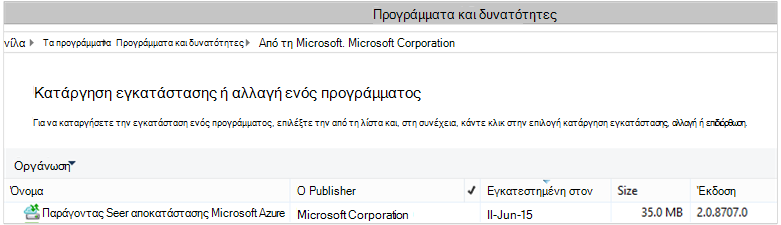

<properties
    pageTitle="Azure αντιγράφων ασφαλείας - ανάπτυξη και διαχείριση ξανά για χρήση με χρήση του PowerShell DPM | Microsoft Azure"
    description="Μάθετε πώς μπορείτε να αναπτύξετε και να διαχειριστείτε Azure δημιουργίας αντιγράφων ασφαλείας για χρήση του PowerShell τη Διαχείριση προστασίας δεδομένων (DPM)"
    services="backup"
    documentationCenter=""
    authors="NKolli1"
    manager="shreeshd"
    editor=""/>

<tags
    ms.service="backup"
    ms.workload="storage-backup-recovery"
    ms.tgt_pltfrm="na"
    ms.devlang="na"
    ms.topic="article"
    ms.date="09/01/2016"
    ms.author="jimpark; anuragm;trinadhk;markgal"/>


# <a name="deploy-and-manage-backup-to-azure-for-data-protection-manager-dpm-servers-using-powershell"></a>Αναπτύξετε και να διαχειριστείτε αντίγραφα ασφαλείας για Azure για χρήση του PowerShell διακομιστές Manager προστασία δεδομένων (DPM)

> [AZURE.SELECTOR]
- [ARM](backup-dpm-automation.md)
- [Κλασικό](backup-dpm-automation-classic.md)

Σε αυτό το άρθρο σάς δείχνει τον τρόπο χρήσης του PowerShell για να τη ρύθμιση Azure αντιγράφου ασφαλείας σε ένα διακομιστή DPM και να διαχειριστείτε αντίγραφα ασφαλείας και επαναφορά.

## <a name="setting-up-the-powershell-environment"></a>Ρύθμιση του περιβάλλοντος του PowerShell

[AZURE.INCLUDE [learn-about-deployment-models](../../includes/learn-about-deployment-models-include.md)]

Για να χρησιμοποιήσετε PowerShell για τη Διαχείριση αντιγράφων ασφαλείας από τη Διαχείριση προστασίας δεδομένων για να Azure, πρέπει να έχετε το σωστό περιβάλλον στο PowerShell. Κατά την έναρξη της περιόδου λειτουργίας PowerShell, βεβαιωθείτε ότι εκτελείτε την παρακάτω εντολή για να εισαγάγετε το σωστό λειτουργικές μονάδες και σας επιτρέπει να αναφέρονται σωστά τα cmdlet DPM:

```
PS C:> & "C:\Program Files\Microsoft System Center 2012 R2\DPM\DPM\bin\DpmCliInitScript.ps1"

Welcome to the DPM Management Shell!

Full list of cmdlets: Get-Command
Only DPM cmdlets: Get-DPMCommand
Get general help: help
Get help for a cmdlet: help <cmdlet-name> or <cmdlet-name> -?
Get definition of a cmdlet: Get-Command <cmdlet-name> -Syntax
Sample DPM scripts: Get-DPMSampleScript
```

## <a name="setup-and-registration"></a>Εγκατάσταση και καταχώρηση
Για να ξεκινήσετε:

1. [Λήψη πιο πρόσφατη PowerShell](https://github.com/Azure/azure-powershell/releases) (είναι ελάχιστη απαιτούμενη έκδοση: 1.0.0)
2. Ενεργοποίηση του commandlets Azure αντίγραφο ασφαλείας, μεταβαίνοντας σε λειτουργία *AzureResourceManager* με τη χρήση του **Διακόπτη AzureMode** commandlet:

```
PS C:\> Switch-AzureMode AzureResourceManager
```

Τις ακόλουθες εργασίες εγκατάσταση και καταχώρηση μπορεί να γίνει αυτόματα με το PowerShell:

- Δημιουργήστε ένα θάλαμο υπηρεσίες ανάκτησης
- Κατά την εγκατάσταση τον παράγοντα Azure δημιουργίας αντιγράφων ασφαλείας
- Εγγραφή με την υπηρεσία Azure δημιουργίας αντιγράφων ασφαλείας
- Ρυθμίσεις δικτύου
- Ρυθμίσεις κρυπτογράφησης

## <a name="create-a-recovery-services-vault"></a>Δημιουργήστε ένα θάλαμο υπηρεσίες ανάκτησης

Τα παρακάτω βήματα σας καθοδηγεί στη δημιουργία ενός θάλαμο υπηρεσίες ανάκτησης. Ένα θάλαμο υπηρεσίες ανάκτησης είναι διαφορετικό από ένα αντίγραφο ασφαλείας θάλαμο.

1. Εάν χρησιμοποιείτε το αντίγραφο ασφαλείας Azure για πρώτη φορά, πρέπει να χρησιμοποιήσετε το cmdlet **Register-AzureRMResourceProvider** για την καταχώρηση της υπηρεσίας ανάκτησης Azure παροχής με τη συνδρομή σας.

    ```
    PS C:\> Register-AzureRmResourceProvider -ProviderNamespace "Microsoft.RecoveryServices"
    ```

2. Το θάλαμο υπηρεσίες ανάκτησης είναι ένας πόρος ARM, ώστε να πρέπει να το τοποθετήσετε μέσα σε μια ομάδα πόρων. Μπορείτε να χρησιμοποιήσετε μια υπάρχουσα ομάδα πόρων, ή δημιουργήστε ένα νέο. Κατά τη δημιουργία νέας ομάδας πόρων, καθορίστε το όνομα και τη θέση για την ομάδα πόρων.  

    ```
    PS C:\> New-AzureRmResourceGroup –Name "test-rg" –Location "West US"
    ```

3. Χρησιμοποιήστε το cmdlet **New-AzureRmRecoveryServicesVault** για να δημιουργήσετε μια νέα θάλαμο. Φροντίστε να καθορίσετε στην ίδια θέση για το θάλαμο όπως που χρησιμοποιήθηκε για την ομάδα πόρων.

    ```
    PS C:\> New-AzureRmRecoveryServicesVault -Name "testvault" -ResourceGroupName " test-rg" -Location "West US"
    ```

4. Καθορίστε τον τύπο του χώρου αποθήκευσης πλεονασμού να χρησιμοποιήσετε. Μπορείτε να χρησιμοποιήσετε [Τοπικά πλεονάζοντα χώρο αποθήκευσης (LRS)](../storage/storage-redundancy.md#locally-redundant-storage) ή [Παν πλεονάζοντα χώρο αποθήκευσης Εξοπλισμό](../storage/storage-redundancy.md#geo-redundant-storage). Το παρακάτω παράδειγμα εμφανίζει την επιλογή - BackupStorageRedundancy testVault έχει οριστεί σε GeoRedundant.

    > [AZURE.TIP] Cmdlet για πολλά αντίγραφα ασφαλείας Azure απαιτούν το αντικείμενο θάλαμο υπηρεσίες ανάκτησης ως εισαγωγή. Για αυτόν το λόγο, είναι εύκολο να αποθηκεύσετε το αντικείμενο θάλαμο υπηρεσίες ανάκτησης αντίγραφα ασφαλείας σε μεταβλητή.

    ```
    PS C:\> $vault1 = Get-AzureRmRecoveryServicesVault –Name "testVault"
    PS C:\> Set-AzureRmRecoveryServicesBackupProperties  -vault $vault1 -BackupStorageRedundancy GeoRedundant
    ```


## <a name="view-the-vaults-in-a-subscription"></a>Προβολή του χώροι φύλαξης σε μια συνδρομή
Χρησιμοποιήστε **Get-AzureRmRecoveryServicesVault** για να προβάλετε τη λίστα των όλα χώροι φύλαξης στην τρέχουσα εγγραφή. Μπορείτε να χρησιμοποιήσετε αυτή την εντολή για να ελέγξετε ότι έχει δημιουργηθεί ένα νέο θάλαμο, ή για να δείτε ποιες χώροι φύλαξης είναι διαθέσιμες στο τη συνδρομή.

Εκτελέστε την εντολή, Get-AzureRmRecoveryServicesVault, και παρατίθενται όλες οι χώροι φύλαξης στην συνδρομής.

```
PS C:\> Get-AzureRmRecoveryServicesVault
Name              : Contoso-vault
ID                : /subscriptions/1234
Type              : Microsoft.RecoveryServices/vaults
Location          : WestUS
ResourceGroupName : Contoso-docs-rg
SubscriptionId    : 1234-567f-8910-abc
Properties        : Microsoft.Azure.Commands.RecoveryServices.ARSVaultProperties
```


## <a name="installing-the-azure-backup-agent-on-a-dpm-server"></a>Κατά την εγκατάσταση τον παράγοντα Azure αντίγραφα ασφαλείας σε ένα διακομιστή DPM
Πριν να εγκαταστήσετε τον παράγοντα αντιγράφων ασφαλείας Azure, πρέπει να έχετε το πρόγραμμα εγκατάστασης που έχουν ληφθεί και παρουσίαση στο διακομιστή των Windows. Μπορείτε να λάβετε την πιο πρόσφατη έκδοση του προγράμματος εγκατάστασης από το [Κέντρο λήψης της Microsoft](http://aka.ms/azurebackup_agent) ή από τη σελίδα του θάλαμο υπηρεσίες ανάκτησης του πίνακα εργαλείων. Αποθηκεύστε το πρόγραμμα εγκατάστασης του σε μια θέση εύκολα προσβάσιμα όπως * C:\Downloads\*.

Για να εγκαταστήσετε τον παράγοντα, εκτελέστε την ακόλουθη εντολή σε ένα αναβαθμισμένο PowerShell κονσόλας **στο διακομιστή DPM**:

```
PS C:\> MARSAgentInstaller.exe /q
```

Αυτό εγκαθιστά τον παράγοντα με όλες τις προεπιλεγμένες επιλογές. Η εγκατάσταση διαρκεί λίγα λεπτά στο παρασκήνιο. Εάν δεν καθορίσετε την επιλογή */nu* ανοίγει το παράθυρο του **Windows Update** στο τέλος της εγκατάστασης για να ελέγξετε για ενημερώσεις.

Ο παράγοντας εμφανίζεται στη λίστα των εγκατεστημένων προγραμμάτων. Για να δείτε τη λίστα των εγκατεστημένων προγραμμάτων, μεταβείτε στον **Πίνακα ελέγχου** > **προγράμματα** > **προγράμματα και δυνατότητες**.



### <a name="installation-options"></a>Επιλογές εγκατάστασης
Για να δείτε όλες τις επιλογές που είναι διαθέσιμες μέσω γραμμή εντολών, χρησιμοποιήστε την ακόλουθη εντολή:

```
PS C:\> MARSAgentInstaller.exe /?
```

Οι διαθέσιμες επιλογές περιλαμβάνουν:

| Επιλογή | Λεπτομέρειες | Προεπιλεγμένη |
| ---- | ----- | ----- |
| / q | Εγκατάσταση χωρίς μηνύματα | - |
| /p: "θέση" | Διαδρομή προς το φάκελο εγκατάστασης για τον παράγοντα Azure δημιουργίας αντιγράφων ασφαλείας. | Παράγοντας υπηρεσιών Azure αποκατάστασης C:\Program Files\Microsoft |
| / s: "θέση" | Διαδρομή προς το φάκελο cache για τον παράγοντα Azure δημιουργίας αντιγράφων ασφαλείας. | C:\Program Files\Microsoft Azure αποκατάστασης υπηρεσίες Agent\Scratch |
| /m | Επιλογή στο Microsoft Update | - |
| /Nu | Χωρίς έλεγχο για ενημερώσεις μετά την ολοκλήρωση της εγκατάστασης | - |
| /d | Καταργεί την εγκατάσταση του Microsoft Azure παράγοντα υπηρεσίες ανάκτησης | - |
| /pH | Διεύθυνση κεντρικού υπολογιστή διακομιστή μεσολάβησης | - |
| /Po | Αριθμός θύρας κεντρικού υπολογιστή διακομιστή μεσολάβησης | - |
| /Pu | Όνομα χρήστη κεντρικού υπολογιστή διακομιστή μεσολάβησης | - |
| /pw | Κωδικός πρόσβασης διακομιστή μεσολάβησης | - |

## <a name="registering-dpm-to-a-recovery-services-vault"></a>Καταγραφή DPM να αποκατάστασης των υπηρεσιών θάλαμο

Αφού δημιουργηθεί το θάλαμο υπηρεσίες ανάκτησης, κάντε λήψη του τελευταίου agent και τα διαπιστευτήρια θάλαμο και αποθηκεύστε το σε μια τοποθεσία που εξυπηρετεί όπως C:\Downloads.

```
PS C:\> $credspath = "C:\downloads"
PS C:\> $credsfilename = Get-AzureRmRecoveryServicesVaultSettingsFile -Backup -Vault $vault1 -Path  $credspath
PS C:\> $credsfilename
C:\downloads\testvault\_Sun Apr 10 2016.VaultCredentials
```

Στο διακομιστή DPM, εκτελέστε το cmdlet [OBRegistration έναρξης](https://technet.microsoft.com/library/hh770398%28v=wps.630%29.aspx) για να καταχωρήσετε τον υπολογιστή με το θάλαμο.

```
PS C:\> $cred = $credspath + $credsfilename
PS C:\> Start-OBRegistration-VaultCredentials $cred -Confirm:$false
CertThumbprint      :7a2ef2caa2e74b6ed1222a5e89288ddad438df2
SubscriptionID      : ef4ab577-c2c0-43e4-af80-af49f485f3d1
ServiceResourceName: testvault
Region              :West US
Machine registration succeeded.
```

### <a name="initial-configuration-settings"></a>Αρχική ρύθμιση παραμέτρων ρυθμίσεων
Όταν ο διακομιστής DPM έχει καταχωρηθεί με το θάλαμο υπηρεσίες ανάκτησης, ξεκινά με τις προεπιλεγμένες ρυθμίσεις συνδρομής. Αυτές οι ρυθμίσεις συνδρομή περιλαμβάνουν κοινωνικής δικτύωσης, κρυπτογράφησης και στην περιοχή ενδιάμεσου σταδίου. Για να αλλάξετε τις ρυθμίσεις εγγραφής πρέπει να πρώτα ελέγχετε τις υπάρχουσες ρυθμίσεις (προεπιλογή) χρησιμοποιώντας το cmdlet [Get-DPMCloudSubscriptionSetting](https://technet.microsoft.com/library/jj612793) :

```
$setting = Get-DPMCloudSubscriptionSetting -DPMServerName "TestingServer"
```

Όλες οι τροποποιήσεις πραγματοποιούνται σε αυτό το τοπικό αντικείμενο PowerShell ```$setting``` και, στη συνέχεια, το πλήρες αντικείμενο είναι δεσμευμένη DPM και δημιουργία αντιγράφων ασφαλείας Azure να τις αποθηκεύσετε χρησιμοποιώντας το cmdlet [Set-DPMCloudSubscriptionSetting](https://technet.microsoft.com/library/jj612791) . Πρέπει να χρησιμοποιήσετε το ```–Commit``` σημαία για να βεβαιωθείτε ότι διατηρούνται οι αλλαγές. Οι ρυθμίσεις θα δεν εφαρμόζεται και θα χρησιμοποιείται από το Azure αντίγραφο ασφαλείας, εκτός εάν δεσμευμένου.

```
PS C:\> Set-DPMCloudSubscriptionSetting -DPMServerName "TestingServer" -SubscriptionSetting $setting -Commit
```

## <a name="networking"></a>Δικτύωση
Εάν είναι η σύνδεση του υπολογιστή DPM στην υπηρεσία Azure δημιουργίας αντιγράφων ασφαλείας στο internet μέσω ενός διακομιστή μεσολάβησης, πρέπει να παρέχονται των ρυθμίσεων διακομιστή μεσολάβησης για επιτυχή δημιουργία αντιγράφων ασφαλείας. Αυτό γίνεται με τη χρήση του ```-ProxyServer```και ```-ProxyPort```, ```-ProxyUsername``` και το ```ProxyPassword``` παραμέτρους με το cmdlet [Set-DPMCloudSubscriptionSetting](https://technet.microsoft.com/library/jj612791) . Σε αυτό το παράδειγμα, δεν υπάρχει καμία διακομιστή μεσολάβησης, ώστε να σας ρητά καταργώντας τις πληροφορίες που σχετίζονται με το διακομιστή μεσολάβησης.

```
PS C:\> Set-DPMCloudSubscriptionSetting -DPMServerName "TestingServer" -SubscriptionSetting $setting -NoProxy
```

Χρήση του εύρους ζώνης μπορεί επίσης να ελέγχεται με τις επιλογές της ```-WorkHourBandwidth``` και ```-NonWorkHourBandwidth``` για ένα συγκεκριμένο σύνολο ημέρες της εβδομάδας. Σε αυτό το παράδειγμα, γίνεται δεν ρύθμιση οποιαδήποτε περιορισμού.

```
PS C:\> Set-DPMCloudSubscriptionSetting -DPMServerName "TestingServer" -SubscriptionSetting $setting -NoThrottle
```

## <a name="configuring-the-staging-area"></a>Ρύθμιση παραμέτρων στην περιοχή ενδιάμεσου σταδίου
Ο παράγοντας Azure δημιουργίας αντιγράφων ασφαλείας που εκτελείται στο διακομιστή DPM ανάγκες προσωρινής αποθήκευσης για τα δεδομένα που έχουν ανακτηθεί από το cloud (τοπική περιοχή ενδιάμεσου σταδίου). Ρύθμιση παραμέτρων στην περιοχή ενδιάμεσου σταδίου χρησιμοποιώντας το cmdlet [Set-DPMCloudSubscriptionSetting](https://technet.microsoft.com/library/jj612791) και το ```-StagingAreaPath``` παραμέτρου.

```
PS C:\> Set-DPMCloudSubscriptionSetting -DPMServerName "TestingServer" -SubscriptionSetting $setting -StagingAreaPath "C:\StagingArea"
```

Στο παραπάνω παράδειγμα, στην περιοχή ενδιάμεσου σταδίου θα οριστεί σε *C:\StagingArea* στο αντικείμενο του PowerShell ```$setting```. Βεβαιωθείτε ότι υπάρχει ήδη στον καθορισμένο φάκελο, διαφορετικά η τελική ολοκλήρωσης από τις ρυθμίσεις συνδρομή θα αποτύχει.


### <a name="encryption-settings"></a>Ρυθμίσεις κρυπτογράφησης
Τα δεδομένα αντιγράφου ασφαλείας που αποστέλλονται σε Azure αντιγράφου ασφαλείας είναι κρυπτογραφημένο την προστασία του απορρήτου των δεδομένων. Η φράση πρόσβασης κρυπτογράφησης είναι "κωδικός πρόσβασης" για να αποκρυπτογραφήσει τα δεδομένα κατά τη στιγμή της επαναφοράς. Είναι σημαντικό να λάβετε αυτές τις πληροφορίες ασφαλές εφόσον έχει οριστεί.

Στο παρακάτω παράδειγμα, η πρώτη εντολή μετατρέπει τη συμβολοσειρά ```passphrase123456789``` για μια συμβολοσειρά ασφαλούς και αντιστοιχίζει τη συμβολοσειρά ασφαλούς στη μεταβλητή με το όνομα ```$Passphrase```. η δεύτερη εντολή ορίζει τη συμβολοσειρά ασφαλή ```$Passphrase``` ως τον κωδικό πρόσβασης για την κρυπτογράφηση των αντιγράφων ασφαλείας.

```
PS C:\> $Passphrase = ConvertTo-SecureString -string "passphrase123456789" -AsPlainText -Force

PS C:\> Set-DPMCloudSubscriptionSetting -DPMServerName "TestingServer" -SubscriptionSetting $setting -EncryptionPassphrase $Passphrase
```

> [AZURE.IMPORTANT] Διατηρήστε τις πληροφορίες φράση πρόσβασης ασφαλές εφόσον έχει οριστεί. Δεν θα μπορείτε να το επαναφέρετε δεδομένα από το Azure χωρίς αυτή η φράση πρόσβασης.

Σε αυτό το σημείο, θα πρέπει να έχετε κάνει όλες τις απαραίτητες αλλαγές για να το ```$setting``` αντικειμένου. Μην ξεχάσετε να δεσμεύσετε τις αλλαγές.

```
PS C:\> Set-DPMCloudSubscriptionSetting -DPMServerName "TestingServer" -SubscriptionSetting $setting -Commit
```

## <a name="protect-data-to-azure-backup"></a>Προστατεύστε τα δεδομένα για δημιουργία αντιγράφων ασφαλείας Azure
Σε αυτήν την ενότητα, θα προσθέσετε ένα διακομιστή παραγωγής DPM και, στη συνέχεια, να προστατεύσετε τα δεδομένα με τον τοπικό χώρο αποθήκευσης DPM και, στη συνέχεια, να Azure δημιουργίας αντιγράφων ασφαλείας. Στα παραδείγματα, θα σας θα δείχνουν πώς μπορείτε να δημιουργήσετε αντίγραφα ασφαλείας αρχείων και φακέλων. Η λογική μπορεί εύκολα να επεκταθεί για δημιουργία αντιγράφων ασφαλείας οποιαδήποτε προέλευση δεδομένων που υποστηρίζονται DPM. Όλα τα αντίγραφα ασφαλείας DPM είναι διέπεται από μια προστασίας ομάδας (ΣΕΛΊΔΩΝ) με τέσσερα τμήματα:

1. **Τα μέλη της ομάδας** είναι μια λίστα με όλα τα αντικείμενο αντικείμενα (γνωστό και ως *αρχεία προέλευσης δεδομένων* στο DPM) που θέλετε να προστατεύσετε στην ίδια ομάδα προστασίας. Για παράδειγμα, μπορεί να θέλετε να προστατεύσετε παραγωγής ΣΠΣ σε μία ομάδα προστασία και βάσεις δεδομένων SQL Server σε μια άλλη ομάδα προστασίας που ενδέχεται να έχουν διαφορετικές απαιτήσεις δημιουργίας αντιγράφων ασφαλείας. Πριν να μπορείτε να δημιουργήσετε αντίγραφα ασφαλείας οποιαδήποτε προέλευση δεδομένων σε ένα διακομιστή παραγωγής πρέπει να βεβαιωθείτε ότι ο παράγοντας DPM είναι εγκατεστημένα στο διακομιστή και γίνεται από DPM. Ακολουθήστε τα βήματα για [την εγκατάσταση του τον παράγοντα DPM](https://technet.microsoft.com/library/bb870935.aspx) και τη σύνδεσή της στον κατάλληλο διακομιστή DPM.
2. **Μέθοδος προστασίας δεδομένων** καθορίζει τις προορισμού αντιγράφου ασφαλείας θέσεις - ταινίας, δίσκου και cloud. Στο παράδειγμά μας, θα σας θα προστασία δεδομένων στον τοπικό δίσκο και στο cloud.
3. Ένα **Χρονοδιάγραμμα δημιουργίας αντιγράφων ασφαλείας** που καθορίζει πότε αντίγραφα ασφαλείας πρέπει να ληφθούν και πόσο συχνά τα δεδομένα θα πρέπει να συγχρονίζονται μεταξύ του διακομιστή DPM και στο διακομιστή παραγωγής.
4. Ένα **Χρονοδιάγραμμα διατήρησης** που καθορίζει το χρόνο για να διατηρήσετε τα σημεία αποκατάστασης στο Azure.

### <a name="creating-a-protection-group"></a>Δημιουργία μιας ομάδας προστασίας
Ξεκινήστε με τη δημιουργία νέας ομάδας προστασίας χρησιμοποιώντας το cmdlet [New-DPMProtectionGroup](https://technet.microsoft.com/library/hh881722) .

```
PS C:\> $PG = New-DPMProtectionGroup -DPMServerName " TestingServer " -Name "ProtectGroup01"
```

Το παραπάνω cmdlet θα δημιουργήσετε μια ομάδα προστασία με το όνομα *ProtectGroup01*. Μια υπάρχουσα ομάδα προστασίας να τροποποιηθούν αργότερα για να προσθέσετε δημιουργίας αντιγράφων ασφαλείας στο cloud Azure. Ωστόσο, για να κάνετε αλλαγές στην ομάδα "Προστασία" - νέα ή υπάρχουσα - πρέπει να λάβετε μια λαβή σε ένα αντικείμενο *δυνατότητα τροποποίησης* χρησιμοποιώντας το cmdlet [Get-DPMModifiableProtectionGroup](https://technet.microsoft.com/library/hh881713) .

```
PS C:\> $MPG = Get-ModifiableProtectionGroup $PG
```

### <a name="adding-group-members-to-the-protection-group"></a>Προσθήκη μελών ομάδας στην ομάδα "Προστασία"
Κάθε παράγοντα DPM γνωρίζει αρχεία προέλευσης δεδομένων στο διακομιστή που είναι εγκατεστημένο στη λίστα. Για να προσθέσετε μια προέλευση δεδομένων, στην ομάδα προστασία, τον παράγοντα DPM πρέπει να πρώτα να στείλετε μια λίστα με τα αρχεία προέλευσης δεδομένων στο διακομιστή DPM. Ένα ή περισσότερα αρχεία προέλευσης δεδομένων, στη συνέχεια, είναι επιλεγμένο και να προσθέσει στην ομάδα προστασία. Είναι τα βήματα του PowerShell που απαιτούνται για να επιτύχετε το εξής:

1. Λήψη μια λίστα με όλους τους διακομιστές που ελέγχονται από DPM έως τον παράγοντα DPM.
2. Επιλέξτε έναν συγκεκριμένο διακομιστή.
3. Λήψη μια λίστα με όλα αρχεία προέλευσης δεδομένων στο διακομιστή.
4. Επιλέξτε ένα ή περισσότερα αρχεία προέλευσης δεδομένων και να τις προσθέσετε στην ομάδα "Προστασία"

Στη λίστα των διακομιστών στον οποίο είναι εγκατεστημένο τον παράγοντα DPM και γίνεται από το διακομιστή DPM λαμβάνεται με το cmdlet [Get-DPMProductionServer](https://technet.microsoft.com/library/hh881600) . Σε αυτό το παράδειγμα θα φιλτράρετε και ρυθμίσετε τις παραμέτρους μόνο PS με όνομα *productionserver01* για δημιουργία αντιγράφων ασφαλείας.

```
PS C:\> $server = Get-ProductionServer -DPMServerName "TestingServer" | where {($_.servername) –contains “productionserver01”
```

Λήψη τώρα τη λίστα αρχεία προέλευσης δεδομένων σε ```$server``` χρησιμοποιώντας το cmdlet [Get-DPMDatasource](https://technet.microsoft.com/library/hh881605) . Σε αυτό το παράδειγμα θα σας φιλτραρίσματος για την ένταση ήχου *δ:\* που θέλετε να ρυθμίσετε τις παραμέτρους για δημιουργία αντιγράφων ασφαλείας. Αυτή η προέλευση δεδομένων, στη συνέχεια, προστίθεται στην ομάδα προστασία χρησιμοποιώντας το cmdlet [Προσθήκη DPMChildDatasource](https://technet.microsoft.com/library/hh881732) . Μην ξεχάσετε να χρησιμοποιήσετε το *δυνατότητα τροποποίησης * αντικειμένου ομάδας προστασίας ```$MPG``` για να κάνετε τις προσθήκες.

```
PS C:\> $DS = Get-Datasource -ProductionServer $server -Inquire | where { $_.Name -contains “D:\” }

PS C:\> Add-DPMChildDatasource -ProtectionGroup $MPG -ChildDatasource $DS
```

Επαναλάβετε αυτό το βήμα όσες φορές απαιτείται, μέχρι να προσθέσετε όλα τα επιλεγμένα αρχεία προέλευσης δεδομένων στην ομάδα προστασία. Μπορείτε επίσης να ξεκινήσετε με ένα μόνο αρχείο προέλευσης δεδομένων, και ολοκλήρωση της ροής εργασίας για τη δημιουργία της ομάδας προστασίας και αργότερα προσθέσετε περισσότερες αρχεία προέλευσης δεδομένων στην ομάδα προστασία.

### <a name="selecting-the-data-protection-method"></a>Επιλογή της μεθόδου προστασία δεδομένων
Όταν τα αρχεία προέλευσης δεδομένων έχουν προστεθεί στην ομάδα προστασία, το επόμενο βήμα είναι να καθορίσετε τη μέθοδο προστασίας χρησιμοποιώντας το cmdlet [Set-DPMProtectionType](https://technet.microsoft.com/library/hh881725) . Σε αυτό το παράδειγμα, η ομάδα προστασίας είναι το πρόγραμμα εγκατάστασης για στον τοπικό δίσκο και δημιουργία αντιγράφων ασφαλείας cloud. Πρέπει επίσης να καθορίσετε την προέλευση δεδομένων που θέλετε να προστατεύσετε cloud χρησιμοποιώντας το cmdlet [Προσθήκη DPMChildDatasource](https://technet.microsoft.com/library/hh881732.aspx) με - Online σημαία.

```
PS C:\> Set-DPMProtectionType -ProtectionGroup $MPG -ShortTerm Disk –LongTerm Online
PS C:\> Add-DPMChildDatasource -ProtectionGroup $MPG -ChildDatasource $DS –Online
```

### <a name="setting-the-retention-range"></a>Ρύθμιση της περιοχής διατήρησης
Ορίστε το διατήρησης για τα σημεία αντιγράφου ασφαλείας χρησιμοποιώντας το cmdlet [Set-DPMPolicyObjective](https://technet.microsoft.com/library/hh881762) . Ενώ ίσως σας φανεί odd για να ορίσετε το διατήρησης πριν από το χρονοδιάγραμμα αντιγράφων ασφαλείας έχει οριστεί, χρησιμοποιώντας το ```Set-DPMPolicyObjective``` cmdlet ορίζει αυτόματα ένα προεπιλεγμένο χρονοδιάγραμμα δημιουργίας αντιγράφων ασφαλείας που, στη συνέχεια, μπορεί να τροποποιηθεί. Είναι πάντα δυνατή σύνολο Προγραμματισμός πρώτα το αντίγραφο ασφαλείας και την πολιτική διατήρησης μετά.

Στο παρακάτω παράδειγμα, το cmdlet ορίζει τις παραμέτρους διατήρησης για αντίγραφα ασφαλείας δίσκου. Αυτό θα διατηρήσει αντίγραφα ασφαλείας για 10 ημερών και συγχρονισμός δεδομένων μεταξύ του διακομιστή παραγωγής και ο διακομιστής DPM κάθε 6 ώρες. Το ```SynchronizationFrequencyMinutes``` δεν ορίζουν τη συχνότητα δημιουργίας αντιγράφων ασφαλείας δημιουργείται ένα σημείο, αλλά πώς συχνά δεδομένα αντιγράφονται στο διακομιστή DPM.  Αυτή η ρύθμιση αποτρέπει πώς να γίνετε πολύ μεγάλο δημιουργίας αντιγράφων ασφαλείας.

```
PS C:\> Set-DPMPolicyObjective –ProtectionGroup $MPG -RetentionRangeInDays 10 -SynchronizationFrequencyMinutes 360
```

Για αντίγραφα ασφαλείας, μεταβαίνοντας στο Azure (DPM αναφέρεται σε αυτά ως Online δημιουργίας αντιγράφων ασφαλείας) τις περιοχές διατήρησης μπορεί να ρυθμιστεί για [μακροπρόθεσμη διατήρησης χρησιμοποιώντας έναν συνδυασμό παππού-πατέρας-γιο (GFS)](backup-azure-backup-cloud-as-tape.md). Αυτό σημαίνει ότι μπορείτε να ορίσετε μια πολιτική διατήρησης συνδυασμένο που αφορούν ημερήσια, εβδομαδιαία, μηνιαία και ετήσια πολιτικές διατήρησης. Σε αυτό το παράδειγμα, θα σας Δημιουργήστε έναν πίνακα που αντιπροσωπεύει το συνδυασμό σύνθετες διατήρησης που θέλετε και, στη συνέχεια, ρύθμιση παραμέτρων της περιοχής διατήρησης χρησιμοποιώντας το cmdlet [Set-DPMPolicyObjective](https://technet.microsoft.com/library/hh881762) .

```
PS C:\> $RRlist = @()
PS C:\> $RRList += (New-Object -TypeName Microsoft.Internal.EnterpriseStorage.Dls.UI.ObjectModel.OMCommon.RetentionRange -ArgumentList 180, Days)
PS C:\> $RRList += (New-Object -TypeName Microsoft.Internal.EnterpriseStorage.Dls.UI.ObjectModel.OMCommon.RetentionRange -ArgumentList 104, Weeks)
PS C:\> $RRList += (New-Object -TypeName Microsoft.Internal.EnterpriseStorage.Dls.UI.ObjectModel.OMCommon.RetentionRange -ArgumentList 60, Month)
PS C:\> $RRList += (New-Object -TypeName Microsoft.Internal.EnterpriseStorage.Dls.UI.ObjectModel.OMCommon.RetentionRange -ArgumentList 10, Years)
PS C:\> Set-DPMPolicyObjective –ProtectionGroup $MPG -OnlineRetentionRangeList $RRlist
```

### <a name="set-the-backup-schedule"></a>Ορίστε την επιλογή χρονοδιάγραμμα δημιουργίας αντιγράφων ασφαλείας
DPM ορίζει ένα προεπιλεγμένο χρονοδιάγραμμα δημιουργίας αντιγράφων ασφαλείας αυτόματα εάν καθορίσετε την προστασία στόχου χρησιμοποιώντας την ```Set-DPMPolicyObjective``` cmdlet. Για να αλλάξετε την προεπιλεγμένη χρονοδιαγραμμάτων, χρησιμοποιήστε το cmdlet [Get-DPMPolicySchedule](https://technet.microsoft.com/library/hh881749) ακολουθούμενο από το cmdlet [Set-DPMPolicySchedule](https://technet.microsoft.com/library/hh881723) .

```
PS C:\> $onlineSch = Get-DPMPolicySchedule -ProtectionGroup $mpg -LongTerm Online
PS C:\> Set-DPMPolicySchedule -ProtectionGroup $MPG -Schedule $onlineSch[0] -TimesOfDay 02:00
PS C:\> Set-DPMPolicySchedule -ProtectionGroup $MPG -Schedule $onlineSch[1] -TimesOfDay 02:00 -DaysOfWeek Sa,Su –Interval 1
PS C:\> Set-DPMPolicySchedule -ProtectionGroup $MPG -Schedule $onlineSch[2] -TimesOfDay 02:00 -RelativeIntervals First,Third –DaysOfWeek Sa
PS C:\> Set-DPMPolicySchedule -ProtectionGroup $MPG -Schedule $onlineSch[3] -TimesOfDay 02:00 -DaysOfMonth 2,5,8,9 -Months Jan,Jul
PS C:\> Set-DPMProtectionGroup -ProtectionGroup $MPG
```

Στο παραπάνω παράδειγμα, ```$onlineSch``` είναι ένας πίνακας με τέσσερις στοιχεία που περιέχει το υπάρχον χρονοδιάγραμμα online προστασίας για την ομάδα προστασίας στο συνδυασμό GFS:

1. ```$onlineSch[0]```περιέχει το ημερήσιο χρονοδιάγραμμα
2. ```$onlineSch[1]```περιέχει το εβδομαδιαίο χρονοδιάγραμμα
3. ```$onlineSch[2]```περιέχει το μηνιαίο χρονοδιάγραμμα
4. ```$onlineSch[3]```περιέχει το ετήσιο χρονοδιάγραμμα

Έτσι εάν πρέπει να τροποποιήσετε το εβδομαδιαίο χρονοδιάγραμμα, πρέπει να αναφέρεται το ```$onlineSch[1]```.

### <a name="initial-backup"></a>Αρχικό αντίγραφο ασφαλείας
Κατά τη δημιουργία αντιγράφων ασφαλείας μια προέλευση δεδομένων για πρώτη φορά, ανάγκες DPM δημιουργεί αρχική ρεπλίκα που δημιουργεί ένα πλήρες αντίγραφο στην προέλευση δεδομένων να προστατεύονται DPM ρεπλίκα τόμου. Αυτή η δραστηριότητα μπορεί να προγραμματιστεί είτε για μια συγκεκριμένη ώρα ή μπορεί να ενεργοποιηθεί με μη αυτόματο τρόπο, χρησιμοποιώντας το cmdlet [Set-DPMReplicaCreationMethod](https://technet.microsoft.com/library/hh881715) με την παράμετρο ```-NOW```.

```
PS C:\> Set-DPMReplicaCreationMethod -ProtectionGroup $MPG -NOW
```
### <a name="changing-the-size-of-dpm-replica--recovery-point-volume"></a>Αλλαγή του μεγέθους του DPM ρεπλίκα & ένταση σημείο αποκατάστασης
Μπορείτε επίσης να αλλάξετε το μέγεθος του αντιγράφου DPM και όγκου σκιώδες αντίγραφο χρησιμοποιώντας το cmdlet [Set-DPMDatasourceDiskAllocation](https://technet.microsoft.com/library/hh881618.aspx) όπως στο ακόλουθο παράδειγμα: Get-DatasourceDiskAllocation - Datasource $DS Set-DatasourceDiskAllocation - Datasource $DS - ProtectionGroup $MPG-μη αυτόματη - ReplicaArea (2 gb) - ShadowCopyArea (2 gb)

### <a name="committing-the-changes-to-the-protection-group"></a>Την οριστικοποίηση των τις αλλαγές στην ομάδα "Προστασία"
Τέλος, οι αλλαγές πρέπει να είναι δεσμευμένη πριν DPM μπορεί να διαρκέσει η δημιουργία αντιγράφων ασφαλείας ανά τη νέα ρύθμιση παραμέτρων προστασίας ομάδας. Έτσι μπορείτε να επιτύχετε χρησιμοποιώντας το cmdlet [Set-DPMProtectionGroup](https://technet.microsoft.com/library/hh881758) .

```
PS C:\> Set-DPMProtectionGroup -ProtectionGroup $MPG
```
## <a name="view-the-backup-points"></a>Προβάλετε τα σημεία δημιουργίας αντιγράφων ασφαλείας
Μπορείτε να χρησιμοποιήσετε το cmdlet [Get-DPMRecoveryPoint](https://technet.microsoft.com/library/hh881746) για να λάβετε μια λίστα με όλα τα σημεία ανάκτησης για μια προέλευση δεδομένων. Σε αυτό το παράδειγμα, θα:
- λήψη όλα τα PGs στο διακομιστή DPM και είναι αποθηκευμένα σε έναν πίνακα```$PG```
- λάβετε τα αρχεία προέλευσης δεδομένων που αντιστοιχεί στο το```$PG[0]```
- λήψη όλων των σημείων ανάκτησης για μια προέλευση δεδομένων.

```
PS C:\> $PG = Get-DPMProtectionGroup –DPMServerName "TestingServer"
PS C:\> $DS = Get-DPMDatasource -ProtectionGroup $PG[0]
PS C:\> $RecoveryPoints = Get-DPMRecoverypoint -Datasource $DS[0] -Online
```

## <a name="restore-data-protected-on-azure"></a>Επαναφορά δεδομένων που προστατεύονται στο Azure
Επαναφορά δεδομένων είναι ένας συνδυασμός από μια ```RecoverableItem``` αντικειμένου και μια ```RecoveryOption``` αντικειμένου. Στην προηγούμενη ενότητα, θα σας στη διάθεσή σας μια λίστα με τα σημεία αντιγράφου ασφαλείας για μια προέλευση δεδομένων.

Στο παρακάτω παράδειγμα, θα σας δείχνουν πώς μπορείτε να επαναφέρετε μια εικονική μηχανή Hyper-V από το Azure αντιγράφου ασφαλείας συνδυάζοντας αντιγράφου ασφαλείας σημεία με προορισμού για την ανάκτηση. Αυτό το παράδειγμα περιλαμβάνει τα εξής:

- Δημιουργία μια επιλογή επαναφοράς χρησιμοποιώντας το cmdlet [New-DPMRecoveryOption](https://technet.microsoft.com/library/hh881592) .
- Λήψη έναν πίνακα του αντιγράφου ασφαλείας σημεία χρησιμοποιώντας το ```Get-DPMRecoveryPoint``` cmdlet.
- Επιλέγοντας ένα σημείο δημιουργίας αντιγράφων ασφαλείας για να επαναφέρετε από.

```
PS C:\> $RecoveryOption = New-DPMRecoveryOption -HyperVDatasource -TargetServer "HVDCenter02" -RecoveryLocation AlternateHyperVServer -RecoveryType Recover -TargetLocation “C:\VMRecovery”

PS C:\> $PG = Get-DPMProtectionGroup –DPMServerName "TestingServer"
PS C:\> $DS = Get-DPMDatasource -ProtectionGroup $PG[0]
PS C:\> $RecoveryPoints = Get-DPMRecoverypoint -Datasource $DS[0] -Online

PS C:\> Restore-DPMRecoverableItem -RecoverableItem $RecoveryPoints[0] -RecoveryOption $RecoveryOption
```

Οι εντολές μπορεί εύκολα να επεκταθεί για οποιονδήποτε τύπο προέλευσης δεδομένων.

## <a name="next-steps"></a>Επόμενα βήματα

- Για περισσότερες πληροφορίες σχετικά με DPM για δημιουργία αντιγράφων ασφαλείας Azure ανατρέξτε στο θέμα [Εισαγωγή στις DPM δημιουργίας αντιγράφων ασφαλείας](backup-azure-dpm-introduction.md)
