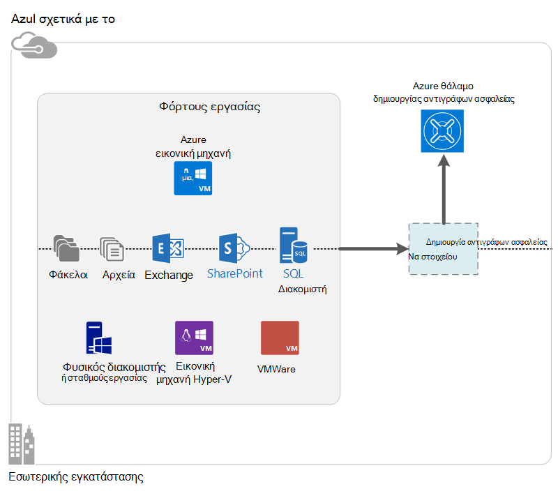

<properties
    pageTitle="Τι είναι το αντίγραφο ασφαλείας Azure; | Microsoft Azure"
    description="Χρησιμοποιώντας Azure δημιουργίας αντιγράφων ασφαλείας και οι υπηρεσίες ανάκτησης, μπορείτε να δημιουργήσετε αντίγραφα ασφαλείας και επαναφορά δεδομένα και τις εφαρμογές από διακομιστές Windows, Windows υπολογιστές-πελάτες, DPM κέντρο συστήματος και Azure εικονικές μηχανές."
    services="backup"
    documentationCenter=""
    authors="markgalioto"
    manager="cfreeman"
    editor="tysonn"
    keywords="Δημιουργία αντιγράφων ασφαλείας και επαναφορά; υπηρεσίες ανάκτησης. λύσεις δημιουργίας αντιγράφων ασφαλείας"/>

<tags
    ms.service="backup"
    ms.workload="storage-backup-recovery"
    ms.tgt_pltfrm="na"
    ms.devlang="na"
    ms.topic="get-started-article"
    ms.date="10/19/2016"
    ms.author="jimpark; trinadhk"/>

# Τι είναι το αντίγραφο ασφαλείας Azure;
Δημιουργία αντιγράφων ασφαλείας Azure είναι η υπηρεσία που χρησιμοποιείτε για να δημιουργήσετε αντίγραφα ασφαλείας και επαναφορά των δεδομένων σας στο cloud της Microsoft. Αντικαθιστά το υπάρχον εσωτερικής εγκατάστασης ή άλλη λύση δημιουργίας αντιγράφων ασφαλείας με μια λύση που βασίζεται στο cloud, η οποία είναι αξιόπιστο, ασφαλή και κόστος ανταγωνισμού. Επίσης, συμβάλλει στην προστασία περιουσιακών στοιχείων που εκτελούνται στο cloud. Azure δημιουργίας αντιγράφων ασφαλείας παρέχει υπηρεσίες ανάκτησης ενσωματωμένη σε μια παγκόσμια υποδομή που είναι μεταβλητού μεγέθους διαρκή και ιδιαίτερα διαθέσιμη.

[Παρακολουθήστε ένα βίντεο Επισκόπηση της δημιουργίας αντιγράφων ασφαλείας Azure](https://azure.microsoft.com/documentation/videos/what-is-azure-backup/)

## Γιατί να χρησιμοποιήσετε Azure δημιουργίας αντιγράφων ασφαλείας;
Παραδοσιακή λύσεις δημιουργίας αντιγράφων ασφαλείας έχει εξελιχθεί να χειριστείτε cloud ως παρόμοια με δίσκων ή ταινίας τελικού σημείου. Ενώ αυτή η προσέγγιση είναι απλή, επίσης, είναι περιορισμένη. Το δεν εκμεταλλευτείτε πλήρως ένα υποκείμενο πλατφόρμα cloud και μεταφράζεται σε λύση αποτελεσματική και ακριβό.
Αντίθετα, Azure δημιουργίας αντιγράφων ασφαλείας παρέχει όλα τα πλεονεκτήματα μιας λύσης ισχυρές και οικονομική cloud δημιουργίας αντιγράφων ασφαλείας. Εδώ θα βρείτε ορισμένα από τα βασικά πλεονεκτήματα που παρέχει το Azure δημιουργίας αντιγράφων ασφαλείας.

| Η δυνατότητα | Οφέλη του |
| ------- | ------- |
| Διαχείριση αυτόματης αποθήκευσης | Δεν υπάρχει δαπανών κεφαλαίο απαιτείται για συσκευές αποθήκευσης εσωτερικής εγκατάστασης. Azure αντίγραφο ασφαλείας εκχωρεί αυτόματα και διαχειρίζεται αποθήκευσης αντιγράφων ασφαλείας και χρησιμοποιεί ένα μοντέλο κατανάλωση πληρωμή ως-που-χρήση. |
| Απεριόριστος χώρος κλιμάκωση | Εκμεταλλευτείτε τις εγγυήσεις υψηλή διαθεσιμότητα χωρίς επιβάρυνσης συντήρησης και παρακολούθησης. Azure δημιουργίας αντιγράφων ασφαλείας χρησιμοποιεί τον υποκείμενο power και κλίμακας του Azure cloud, με τις δυνατότητές του nonintrusive autoscaling. |
| Πολλές επιλογές αποθήκευσης | Επιλέξτε το αποθήκευσης αντιγράφων ασφαλείας ανάλογα με τις ανάγκες:<li>Ένα τοπικά πλεονάζοντα χώρο αποθήκευσης blob μπλοκ είναι ιδανική για τους πελάτες τιμή χρημάτων και αυτό εξακολουθεί να συμβάλλει στην προστασία δεδομένων σύμφωνα με την τοπική υλικού αποτυχίες. <li>Ένα blob μπλοκ αποθήκευσης παν αναπαραγωγής παρέχει τρία περισσότερων αντιγράφων σε ένα κέντρο δεδομένων ζεύγη. Αυτά τα πρόσθετα αντίγραφα να εξασφαλίσετε ότι τα δεδομένα αντιγράφου ασφαλείας σας είναι ιδιαίτερα διαθέσιμη ακόμα και εάν παρουσιάζεται μια Azure καταστροφής επίπεδο τοποθεσίας. |
| Μεταφορά απεριόριστες δεδομένων | Δεν υπάρχει χωρίς χρέωση για κάθε μεταβίβαση (εξερχόμενη) δεδομένων εξόδου στη διάρκεια μιας λειτουργίας επαναφοράς από το θάλαμο δημιουργίας αντιγράφων ασφαλείας. Δεδομένα εισερχομένων για να Azure είναι επίσης δωρεάν. Λειτουργεί με την υπηρεσία εισαγωγής του ώστε να είναι διαθέσιμη. |
| Κρυπτογράφηση δεδομένων | Κρυπτογράφηση δεδομένων επιτρέπει ασφαλούς μεταφοράς και αποθήκευσης των δεδομένων πελατών στο cloud δημόσια. Η φράση πρόσβασης κρυπτογράφησης είναι αποθηκευμένη στο αρχείο προέλευσης και είναι ποτέ μεταδίδονται ή είναι αποθηκευμένο στο Azure. Απαιτείται για να επαναφέρετε οποιοδήποτε από τα δεδομένα του κλειδιού κρυπτογράφησης και μόνο ο πελάτης έχει πλήρη πρόσβαση στα δεδομένα στην υπηρεσία. |  
| Συνεπή εφαρμογή δημιουργίας αντιγράφων ασφαλείας | Εφαρμογή συνεπή αντίγραφα ασφαλείας των Windows να εξασφαλίσετε ότι δεν είναι απαραίτητα επιδιορθώσεις τη στιγμή της επαναφοράς, μειώνοντας έτσι το στόχο χρόνου αποκατάστασης. Αυτό σας επιτρέπει στους πελάτες να επιστρέψετε σε κατάσταση λειτουργίας πιο γρήγορα. |
| Μακροπρόθεσμες διατήρησης | Αντί να πληρώσετε για λύσεις δημιουργίας αντιγράφων ασφαλείας εκτός ταινίας, μπορούν οι πελάτες πίσω έως Azure, η οποία παρέχει μια λύση συναρπαστικές μοιάζει με ταινία μικρό κόστος. |

## Azure στοιχεία δημιουργίας αντιγράφων ασφαλείας
Επειδή το αντίγραφο ασφαλείας είναι μια υβριδική λύση δημιουργίας αντιγράφων ασφαλείας, αποτελείται από πολλά στοιχεία που συνεργάζονται για να ενεργοποιήσετε ολοκληρωμένες για δημιουργία αντιγράφων ασφαλείας και επαναφορά ροές εργασίας.

### Σενάρια ανάπτυξης

| Το στοιχείο | Μπορούν να αναπτυχθούν στο Azure; | Μπορεί να είναι ανεπτυγμένη εσωτερικής εγκατάστασης; | Υποστηρίζονται αποθήκευσης προορισμού|
| --- | --- | --- | --- |
| Azure παράγοντα δημιουργίας αντιγράφων ασφαλείας | 
**Ναι**
 
Ο παράγοντας Azure δημιουργίας αντιγράφων ασφαλείας μπορούν να αναπτυχθούν σε οποιαδήποτε Εικονική διακομιστή των Windows που εκτελείται στο Azure.
 | 
**Ναι**
 
Ο παράγοντας δημιουργίας αντιγράφων ασφαλείας μπορούν να αναπτυχθούν σε οποιαδήποτε Windows Server Εικονική ή φυσική υπολογιστή.
 | 
Azure θάλαμο δημιουργίας αντιγράφων ασφαλείας
 |
| Διαχείριση προστασίας δεδομένων κέντρο του συστήματος (DPM) | 
**Ναι**

Μάθετε περισσότερα σχετικά με το [Πώς να προστατεύσετε φόρτους εργασίας στο Azure χρησιμοποιώντας DPM κέντρο συστήματος](http://blogs.technet.com/b/dpm/archive/2014/09/02/azure-iaas-workload-protection-using-data-protection-manager.aspx).
 | 
**Ναι**
 
Μάθετε περισσότερα σχετικά με το [Πώς να προστατεύσετε όγκου εργασίας και ΣΠΣ στο κέντρο δεδομένων σας](https://technet.microsoft.com/library/hh758173.aspx).
 | 
Τοπικά προσαρτημένο δίσκο,
 
Azure θάλαμο αντίγραφο ασφαλείας,
 
ταινία (εσωτερικής εγκατάστασης μόνο)
 |
| Διακομιστής Azure αντιγράφων ασφαλείας | 
**Ναι**

Μάθετε περισσότερα σχετικά με το [Πώς να προστατεύσετε φόρτους εργασίας στο Azure χρησιμοποιώντας Azure δημιουργίας αντιγράφων ασφαλείας διακομιστή](backup-azure-microsoft-azure-backup.md).
 | 
**Ναι**
 
Μάθετε περισσότερα σχετικά με το [Πώς να προστατεύσετε φόρτους εργασίας στο Azure χρησιμοποιώντας Azure δημιουργίας αντιγράφων ασφαλείας διακομιστή](backup-azure-microsoft-azure-backup.md).
 | 
Τοπικό συνδεδεμένο δίσκο,
 
Azure θάλαμο δημιουργίας αντιγράφων ασφαλείας
 |
| Azure δημιουργίας αντιγράφων ασφαλείας (Εικονική επέκταση) | 
**Ναι**

Τμήμα του Azure ύφασμα

Ειδικές για το [αντίγραφο ασφαλείας της υποδομής Azure ως εικονικές μηχανές μιας υπηρεσίας (IaaS)](backup-azure-vms-introduction.md).
 | 
**Όχι**
 
Χρησιμοποιήστε DPM κέντρο συστήματος για να δημιουργήσετε αντίγραφα ασφαλείας εικονικές μηχανές στο κέντρο δεδομένων σας.
 | 
Azure θάλαμο δημιουργίας αντιγράφων ασφαλείας
 |

### Στοιχείο επιπέδου πλεονεκτήματα και τους περιορισμούς

| Το στοιχείο | Πλεονεκτήματα | Περιορισμοί | Δυνατότητα αποκατάστασης υποδιαίρεσης |
| --- | --- | --- | --- |
| Azure παράγοντα δημιουργίας αντιγράφων ασφαλείας (MARS) | <li>Να δημιουργήσετε αντίγραφο ασφαλείας αρχείων και φακέλων σε έναν υπολογιστή λειτουργικού Συστήματος των Windows, είτε πρόκειται για φυσικό ή εικονικό (ΣΠΣ μπορεί να είναι σε οποιοδήποτε σημείο στην εσωτερική εγκατάσταση ή Azure)<li>Δεν απαιτείται ξεχωριστή αντιγράφου ασφαλείας server<li>Χρησιμοποιεί Azure θάλαμο δημιουργίας αντιγράφων ασφαλείας | <li>Επαναφορά τρεις φορές ημέρα/αρχείου αντιγράφου ασφαλείας επιπέδου<li>Αρχείο/φάκελος ένταση επιπέδου Επαναφορά μόνο, δεν εφαρμογής υπόψη<li>Δεν υπάρχει υποστήριξη για Linux | αρχεία/φάκελοι όγκους |
| Κέντρο του συστήματος διαχείρισης προστασία δεδομένων | <li>Εφαρμογή υπόψη στιγμιότυπα (VSS)<li>Πλήρη ευελιξία για το πότε θα διαρκέσει δημιουργίας αντιγράφων ασφαλείας<li>Ανάκτηση υποδιαίρεση (όλα)<li>Να χρησιμοποιήσετε θάλαμο Azure δημιουργίας αντιγράφων ασφαλείας<li>Υποστήριξη Linux (εάν φιλοξενούνται σε Hyper-V) | <li>Έλλειψη ετερογενή υποστήριξης (VMware Εικονική δημιουργία αντιγράφου ασφαλείας, Oracle φόρτο εργασίας δημιουργίας αντιγράφων ασφαλείας).  | αρχεία/φάκελοι όγκους / ΣΠΣ/εφαρμογές |
| Διακομιστής αντιγράφων ασφαλείας του Microsoft Azure | <li>Εφαρμογή υπόψη στιγμιότυπα (VSS)<li>Πλήρη ευελιξία για το πότε θα διαρκέσει δημιουργίας αντιγράφων ασφαλείας<li>Ανάκτηση υποδιαίρεση (όλα)<li>Να χρησιμοποιήσετε θάλαμο Azure δημιουργίας αντιγράφων ασφαλείας<li>Υποστήριξη Linux (εάν φιλοξενούνται σε Hyper-V)<li>Δεν απαιτεί μια άδεια χρήσης κέντρο του συστήματος | <li>Έλλειψη ετερογενή υποστήριξης (VMware Εικονική δημιουργία αντιγράφου ασφαλείας, Oracle φόρτο εργασίας δημιουργίας αντιγράφων ασφαλείας).<li>Απαιτεί πάντα ζωντανή Azure συνδρομή<li>Δεν υπάρχει υποστήριξη για δημιουργία αντιγράφων ασφαλείας ταινίας | αρχεία/φάκελοι όγκους / ΣΠΣ/εφαρμογών |
| Δημιουργία αντιγράφων ασφαλείας Azure Εικονική IaaS | <li>Εγγενής αντίγραφα ασφαλείας για τα Windows/Linux<li>Δεν απαιτείται εγκατάσταση συγκεκριμένες παράγοντα<li>Ύφασμα επιπέδου δημιουργίας αντιγράφων ασφαλείας με χωρίς απαιτούμενης υποδομής δημιουργίας αντιγράφων ασφαλείας | <li>Μία φορά την ημέρα πίσω επάνω/δίσκος επιπέδου επαναφοράς<li>Δεν είναι δυνατή η δημιουργία αντιγράφου ασφαλείας εσωτερικής εγκατάστασης | ΣΠΣ Όλων των δίσκων (με χρήση του PowerShell) |

## Ποιες εφαρμογές και φόρτους εργασίας μπορούν να δημιουργηθούν αντίγραφα ασφαλείας;

| Φόρτο εργασίας | Μηχανή προέλευσης | Azure λύση δημιουργίας αντιγράφων ασφαλείας |
| --- | --- |---|
| Αρχεία και φάκελοι | Windows Server | 
[Παράγοντας azure Backup](backup-configure-vault.md),
 
[DPM κέντρο του συστήματος](backup-azure-dpm-introduction.md) (+ τον παράγοντα Azure δημιουργίας αντιγράφων ασφαλείας),
 
[Διακομιστής Azure αντιγράφων ασφαλείας](backup-azure-microsoft-azure-backup.md) (περιλαμβάνει τον παράγοντα αντιγράφων ασφαλείας Azure)
  |
| Αρχεία και φάκελοι | Πρόγραμμα-πελάτη των Windows | 
[Παράγοντας azure Backup](backup-configure-vault.md),
 
[DPM κέντρο του συστήματος](backup-azure-dpm-introduction.md) (+ τον παράγοντα Azure δημιουργίας αντιγράφων ασφαλείας),
 
[Διακομιστής Azure αντιγράφων ασφαλείας](backup-azure-microsoft-azure-backup.md) (περιλαμβάνει τον παράγοντα αντιγράφων ασφαλείας Azure)
  |
| Το Hyper-V εικονική μηχανή (Windows) | Windows Server | 
[DPM κέντρο του συστήματος](backup-azure-backup-sql.md) (+ τον παράγοντα Azure δημιουργίας αντιγράφων ασφαλείας),
 
[Διακομιστής Azure αντιγράφων ασφαλείας](backup-azure-microsoft-azure-backup.md) (περιλαμβάνει τον παράγοντα αντιγράφων ασφαλείας Azure)
 |
| Το Hyper-V εικονική μηχανή (Linux) | Windows Server | 
[DPM κέντρο του συστήματος](backup-azure-backup-sql.md) (+ τον παράγοντα Azure δημιουργίας αντιγράφων ασφαλείας),
 
[Διακομιστής Azure αντιγράφων ασφαλείας](backup-azure-microsoft-azure-backup.md) (περιλαμβάνει τον παράγοντα αντιγράφων ασφαλείας Azure)
  |
| Microsoft SQL Server | Windows Server | 
[DPM κέντρο του συστήματος](backup-azure-backup-sql.md) (+ τον παράγοντα Azure δημιουργίας αντιγράφων ασφαλείας),
 
[Διακομιστής Azure αντιγράφων ασφαλείας](backup-azure-microsoft-azure-backup.md) (περιλαμβάνει τον παράγοντα αντιγράφων ασφαλείας Azure)
  |
| Microsoft SharePoint | Windows Server | 
[DPM κέντρο του συστήματος](backup-azure-backup-sql.md) (+ τον παράγοντα Azure δημιουργίας αντιγράφων ασφαλείας),
 
[Διακομιστής Azure αντιγράφων ασφαλείας](backup-azure-microsoft-azure-backup.md) (περιλαμβάνει τον παράγοντα αντιγράφων ασφαλείας Azure)
   |
| Microsoft Exchange |  Windows Server | 
[DPM κέντρο του συστήματος](backup-azure-backup-sql.md) (+ τον παράγοντα Azure δημιουργίας αντιγράφων ασφαλείας),
 
[Διακομιστής Azure αντιγράφων ασφαλείας](backup-azure-microsoft-azure-backup.md) (περιλαμβάνει τον παράγοντα αντιγράφων ασφαλείας Azure)
   |
| Azure IaaS ΣΠΣ (Windows) | - | [Azure δημιουργίας αντιγράφων ασφαλείας (Εικονική επέκταση)](backup-azure-vms-introduction.md) |
| Azure IaaS ΣΠΣ (Linux) | - | [Azure δημιουργίας αντιγράφων ασφαλείας (Εικονική επέκταση)](backup-azure-vms-introduction.md) |

## Υποστήριξη ARM και Linux

| Το στοιχείο | Υποστήριξη ARM | Linux (Azure θεωρηθεί) υποστήριξης |
| --- | --- | --- |
| Azure παράγοντα δημιουργίας αντιγράφων ασφαλείας (MARS) | Ναι | Δεν υπάρχει (agent μόνο με βάση τα Windows) |
| Κέντρο του συστήματος διαχείρισης προστασία δεδομένων | Ναι (Agent στο επισκέπτη) | Είναι δυνατή μόνο Hyper-V (δεν Azure Εικονική) μόνο αρχείο συνεπείς δημιουργίας αντιγράφων ασφαλείας |
| Διακομιστής Azure αντιγράφων ασφαλείας (MABS) | Ναι (Agent στο επισκέπτη) | Μόνο για αντίγραφα ασφαλείας μόνο αρχείο συνεπείς Hyper-V (δεν Azure Εικονική) είναι δυνατό (ίδιο με DPM) |
| Δημιουργία αντιγράφων ασφαλείας Azure Εικονική IaaS | Ναι | Ναι |

[AZURE.INCLUDE [learn-about-deployment-models](../../includes/learn-about-deployment-models-include.md)]

## Δημιουργία αντιγράφων ασφαλείας και επαναφορά ΣΠΣ Premium χώρου αποθήκευσης

Η υπηρεσία αντίγραφο ασφαλείας Azure προστατεύει τώρα Premium ΣΠΣ χώρου αποθήκευσης.

### Δημιουργία αντιγράφου ασφαλείας Premium ΣΠΣ χώρου αποθήκευσης

Κατά τη δημιουργία αντιγράφων ασφαλείας Premium ΣΠΣ χώρου αποθήκευσης, η υπηρεσία δημιουργίας αντιγράφων ασφαλείας δημιουργεί μια προσωρινή θέση ενδιάμεσου σταδίου το λογαριασμό χώρου αποθήκευσης Premium. Τη θέση του ενδιάμεσου σταδίου, με το όνομα "AzureBackup-", είναι ίση με το μέγεθος συνόλου δεδομένων των δίσκων premium συνδέονται με την εικονική Μηχανή.

>[AZURE.NOTE] Μην τροποποιείτε ή επεξεργάζεστε τη θέση ενδιάμεσου σταδίου.

Μόλις ολοκληρωθεί η εργασία δημιουργίας αντιγράφων ασφαλείας, διαγράφεται και τη θέση ενδιάμεσου σταδίου. Η τιμή του χώρου αποθήκευσης που χρησιμοποιείται για τη θέση ενδιάμεσου σταδίου είναι συνεπείς με όλες [τις τιμές αποθήκευσης Premium](../storage/storage-premium-storage.md#pricing-and-billing).

### Επαναφορά Premium ΣΠΣ χώρου αποθήκευσης

Εικονική αποθήκευσης Premium μπορούν να αποκατασταθούν σε κάποιο χώρο αποθήκευσης Premium ή σε κανονική χώρου αποθήκευσης. Επαναφορά ενός σημείου αποκατάστασης Premium Εικονική χώρου αποθήκευσης σε Premium χώρου αποθήκευσης είναι η τυπική διαδικασία επαναφοράς. Ωστόσο, μπορεί να είναι κόστους αποτελεσματικές για να επαναφέρετε ένα σημείο αποκατάστασης Premium Εικονική χώρου αποθήκευσης σε τυπική χώρου αποθήκευσης. Αυτός ο τύπος της επαναφοράς μπορεί να χρησιμοποιηθεί, εάν χρειάζεστε ένα υποσύνολο των αρχείων από την εικονική Μηχανή.

## Λειτουργίες
Αυτά τα πέντε στους πίνακες συνοψίζονται οι λειτουργίες δημιουργίας αντιγράφων ασφαλείας πώς γίνεται με κάθε στοιχείο.

### Χώρος αποθήκευσης

| Η δυνατότητα | Azure παράγοντα δημιουργίας αντιγράφων ασφαλείας | DPM κέντρο του συστήματος | Διακομιστής Azure αντιγράφων ασφαλείας | Azure δημιουργίας αντιγράφων ασφαλείας (Εικονική επέκταση) |
| ------- | --- | --- | --- | ---- |
| Azure θάλαμο δημιουργίας αντιγράφων ασφαλείας | ![Ναι][green] | ![Ναι][green] | ![Ναι][green] | ![Ναι][green] |
| Αποθήκευση σε δίσκο | | ![Ναι][green] | ![Ναι][green] |  |
| Αποθήκευση σε ταινία | | ![Ναι][green] |  | |
| Συμπίεση (στο αντίγραφο ασφαλείας θάλαμο) | ![Ναι][green] | ![Ναι][green]| ![Ναι][green] | |
| Δημιουργία αντιγράφων ασφαλείας προσαύξησης | ![Ναι][green] | ![Ναι][green] | ![Ναι][green] | ![Ναι][green] |
| Απαλοιφή διπλοτύπων δίσκου | | ![Μερικώς][yellow] | ![Μερικώς][yellow]| | |

Το αντίγραφο ασφαλείας θάλαμο είναι ο προορισμός προτιμώμενη χώρου αποθήκευσης σε όλα τα στοιχεία. DPM κέντρο του συστήματος και δημιουργία αντιγράφων ασφαλείας διακομιστή παρέχουν επίσης την επιλογή για να διατηρήσετε ένα αντίγραφο στον τοπικό δίσκο. Ωστόσο, μόνο σύστημα DPM κέντρο παρέχει την επιλογή για την εγγραφή δεδομένων σε μια συσκευή αποθήκευσης ταινίας.

#### Δημιουργία αντιγράφων ασφαλείας προσαύξησης
Κάθε στοιχείο υποστηρίζει προσαύξησης ανεξάρτητα από το χώρο αποθήκευσης προορισμού (δίσκο, ταινίας, θάλαμο δημιουργίας αντιγράφων ασφαλείας). Προσαύξησης εξασφαλίζει ότι αντίγραφα ασφαλείας είναι χώρο αποθήκευσης και χρόνο αποτελεσματική, με μεταφορά μόνο αυτές τις αλλαγές που έγιναν από το τελευταίο αντίγραφο ασφαλείας.

#### Συμπίεση
Δημιουργία αντιγράφων ασφαλείας συμπιέζονται για να μειώσουμε το χώρο αποθήκευσης απαιτείται. Το μόνο στοιχείο που δεν χρησιμοποιεί τη συμπίεση είναι η επέκταση Εικονική. Με επέκταση Εικονική, όλα τα δεδομένα αντιγράφου ασφαλείας αντιγράφεται από το λογαριασμό του πελάτη χώρου αποθήκευσης για το αντίγραφο ασφαλείας θάλαμο στην ίδια περιοχή χωρίς να συμπιέσετε το. Ενώ μεταβαίνοντας χωρίς συμπίεση ελαφρώς προσθέτει όγκο σε χώρος αποθήκευσης που χρησιμοποιείται, την αποθήκευση των δεδομένων χωρίς συμπίεση επιτρέπει για ταχύτερους χρόνους επαναφορά.

#### Απαλοιφή διπλοτύπων
Απαλοιφή διπλοτύπων υποστηρίζεται για DPM κέντρο συστήματος και δημιουργία αντιγράφων ασφαλείας Server όταν είναι [αναπτυχθεί σε μια εικονική μηχανή Hyper-V](http://blogs.technet.com/b/dpm/archive/2015/01/06/deduplication-of-dpm-storage-reduce-dpm-storage-consumption.aspx). Απαλοιφή διπλοτύπων εκτελείται στο επίπεδο κεντρικού υπολογιστή, χρησιμοποιώντας το Windows Server Απαλοιφή διπλοτύπων στον εικονικό σκληρό δίσκων (VHD που είναι συνημμένα σε η εικονική μηχανή ως αποθήκευσης αντιγράφων ασφαλείας).

>[AZURE.WARNING] Απαλοιφή διπλοτύπων δεν είναι διαθέσιμη στο Azure για οποιοδήποτε από τα στοιχεία δημιουργίας αντιγράφων ασφαλείας. Όταν DPM κέντρο συστήματος και δημιουργία αντιγράφων ασφαλείας διακομιστή αναπτύσσονται στο Azure, δεν είναι δυνατό να deduplicated δίσκων χώρου αποθήκευσης που έχουν επισυναφθεί σε η Εικονική.

### Ασφάλεια

| Η δυνατότητα | Azure παράγοντα δημιουργίας αντιγράφων ασφαλείας | DPM κέντρο του συστήματος | Διακομιστής Azure αντιγράφων ασφαλείας | Azure δημιουργίας αντιγράφων ασφαλείας (Εικονική επέκταση) |
| ------- | --- | --- | --- | ---- |
| Ασφάλεια δικτύου (για να Azure) | ![Ναι][green] |![Ναι][green] | ![Ναι][green] | ![Μερικώς][yellow]|
| Ασφάλεια των δεδομένων (Azure) | ![Ναι][green] |![Ναι][green] | ![Ναι][green] | ![Μερικώς][yellow]|

Όλη την κυκλοφορία δημιουργίας αντιγράφων ασφαλείας από τους διακομιστές σας για τη δημιουργία αντιγράφων ασφαλείας θάλαμο είναι κρυπτογραφημένη χρησιμοποιώντας για προχωρημένους τυπική 256 κρυπτογράφησης. Τα δεδομένα αποστέλλονται μέσω ασφαλούς σύνδεσης HTTPS. Τα δεδομένα αντιγράφου ασφαλείας αποθηκεύεται επίσης στο το θάλαμο αντίγραφα ασφαλείας σε κρυπτογραφημένη μορφή. Μόνο ο πελάτης διατηρεί τη φράση πρόσβασης για να ξεκλειδώσετε αυτών των δεδομένων. Δεν είναι δυνατό να αποκρυπτογραφήσετε τα δεδομένα αντιγράφου ασφαλείας σε οποιοδήποτε σημείο της Microsoft.

>[AZURE.WARNING] Το κλειδί που χρησιμοποιείται για την κρυπτογράφηση των δεδομένων αντιγράφων ασφαλείας υπάρχει μόνο με τον πελάτη. Η Microsoft δεν διατηρεί αντίγραφο στο Azure και δεν έχει οποιαδήποτε πρόσβαση στο κλειδί. Εάν το κλειδί είναι λάθος, Microsoft δεν είναι δυνατό να ανακτήσετε τα δεδομένα αντιγράφου ασφαλείας.

Δημιουργία αντιγράφων ασφαλείας ΣΠΣ Azure απαιτεί ρύθμιση κρυπτογράφησης *εντός* η εικονική μηχανή. Χρήση BitLocker σε εικονικές μηχανές Windows και **dm κρυπτογραφημένου** σε εικονικές μηχανές Linux. Azure δημιουργίας αντιγράφων ασφαλείας δεν κρυπτογραφούνται αυτόματα τα δεδομένα αντιγράφου ασφαλείας που παρέχεται μέσω αυτής της διαδρομής.

### Υποστηριζόμενες φόρτους εργασίας

| Η δυνατότητα | Azure παράγοντα δημιουργίας αντιγράφων ασφαλείας | DPM κέντρο του συστήματος | Διακομιστής Azure αντιγράφων ασφαλείας | Azure δημιουργίας αντιγράφων ασφαλείας (Εικονική επέκταση) |
| ------- | --- | --- | --- | ---- |
| Windows Server υπολογιστή--αρχείων και φακέλων | ![Ναι][green] | ![Ναι][green] | ![Ναι][green] | |
| Υπολογιστή-πελάτη Windows--αρχείων και φακέλων | ![Ναι][green] | ![Ναι][green] | ![Ναι][green] | |
| Το Hyper-V εικονική μηχανή (Windows) | | ![Ναι][green] | ![Ναι][green] | |
| Το Hyper-V εικονική μηχανή (Linux) | | ![Ναι][green] | ![Ναι][green] | |
| Microsoft SQL Server | | ![Ναι][green] | ![Ναι][green] | |
| Microsoft SharePoint | | ![Ναι][green] | ![Ναι][green] | |
| Microsoft Exchange  | | ![Ναι][green] | ![Ναι][green] | |
| Azure εικονική μηχανή (Windows) | | | | ![Ναι][green] |
| Azure εικονική μηχανή (Linux) | | | | ![Ναι][green] |

### Δικτύου

| Η δυνατότητα | Azure παράγοντα δημιουργίας αντιγράφων ασφαλείας | DPM κέντρο του συστήματος | Διακομιστής Azure αντιγράφων ασφαλείας | Azure δημιουργίας αντιγράφων ασφαλείας (Εικονική επέκταση) |
| ------- | --- | --- | --- | ---- |
| Συμπίεση δικτύου (για το αντίγραφο ασφαλείας διακομιστή) | | ![Ναι][green] | ![Ναι][green] | |
| Συμπίεση δικτύου (για το αντίγραφο ασφαλείας θάλαμο) | ![Ναι][green] | ![Ναι][green] | ![Ναι][green] | |
| Πρωτόκολλο δικτύου (για το αντίγραφο ασφαλείας διακομιστή) | | TCP | TCP | |
| Πρωτόκολλο δικτύου (για το αντίγραφο ασφαλείας θάλαμο) | HTTPS | HTTPS | HTTPS | HTTPS |

Επειδή η επέκταση Εικονική διαβάζει τα δεδομένα απευθείας από το λογαριασμό χώρου αποθήκευσης Azure μέσω του δικτύου του χώρου αποθήκευσης, δεν είναι απαραίτητο για να βελτιστοποιήσετε την κυκλοφορία. Η κυκλοφορία είναι μέσω του τοπικού χώρου αποθήκευσης δικτύου στο Azure κέντρο δεδομένων, ώστε να μην υπάρχει μικρή ανάγκη για τη συμπίεση λόγω ζητήματα εύρους ζώνης.

Εάν δημιουργείτε αντίγραφα ασφαλείας των δεδομένων σας σε ένα αντίγραφο ασφαλείας διακομιστή (DPM ή δημιουργίας αντιγράφων ασφαλείας διακομιστή), μπορεί να είναι συμπίεση κίνησης από τον πρωτεύοντα διακομιστή αντιγράφων ασφαλείας διακομιστή για να αποθηκεύσετε στο εύρος ζώνης.

#### Διαχείριση ρυθμίσεων δικτύου
Ο παράγοντας Azure δημιουργίας αντιγράφων ασφαλείας παρέχει δυνατότητα επιτάχυνσης, η οποία σας επιτρέπει να ελέγχετε τον τρόπο χρήσης του εύρους ζώνης δικτύου κατά τη μεταφορά δεδομένων. Περιορισμού μπορεί να είναι χρήσιμο εάν θέλετε να δημιουργήσετε αντίγραφα ασφαλείας δεδομένων κατά τη διάρκεια ώρες εργασίας, αλλά δεν θέλετε η διαδικασία δημιουργίας αντιγράφων ασφαλείας για να παρεμβάλλεται με άλλες κυκλοφορία internet. Περιορισμού για δεδομένα μεταφοράς ισχύει για δημιουργία αντιγράφων ασφαλείας και επαναφορά δραστηριότητες.

### Δημιουργία αντιγράφων ασφαλείας και διατήρησης

|  | Azure παράγοντα δημιουργίας αντιγράφων ασφαλείας | DPM κέντρο του συστήματος | Διακομιστής Azure αντιγράφων ασφαλείας | Azure δημιουργίας αντιγράφων ασφαλείας (Εικονική επέκταση) |
| --- | --- | --- | --- | --- |
| Συχνότητας δημιουργίας αντιγράφων ασφαλείας (για το αντίγραφο ασφαλείας θάλαμο) | Τρεις δημιουργίας αντιγράφων ασφαλείας ανά ημέρα | Δύο αντιγράφων ασφαλείας ανά ημέρα |Δύο αντιγράφων ασφαλείας ανά ημέρα | Ένα αντίγραφο ασφαλείας ανά ημέρα |
| Συχνότητας δημιουργίας αντιγράφων ασφαλείας (σε δίσκο) | Δεν ισχύει | 
Κάθε 15 λεπτά για τον SQL Server
 
Κάθε ώρα για άλλες φόρτους εργασίας
 | 
Κάθε 15 λεπτά για τον SQL Server
 
Κάθε ώρα για άλλες φόρτους εργασίας
 |Δεν ισχύει |
| Επιλογές διατήρησης | Ημερήσια, εβδομαδιαία, μηνιαία, ετήσια | Ημερήσια, εβδομαδιαία, μηνιαία, ετήσια | Ημερήσια, εβδομαδιαία, μηνιαία, ετήσια |Ημερήσια, εβδομαδιαία, μηνιαία, ετήσια |
| Περίοδος διατήρησης | Έως 99 έτη | Έως 99 έτη | Έως 99 έτη | Έως 99 έτη |
| Ανάκτηση σημείων θάλαμο δημιουργίας αντιγράφων ασφαλείας | Απεριόριστος χώρος | Απεριόριστος χώρος | Απεριόριστος χώρος | Απεριόριστος χώρος |
| Σημεία αποκατάστασης στον τοπικό δίσκο | Δεν ισχύει | 64 για διακομιστές αρχείων,  448 για διακομιστές εφαρμογών | 64 για διακομιστές αρχείων,  448 για διακομιστές εφαρμογών |Δεν ισχύει |
| Σημεία αποκατάστασης στην ταινία | Δεν ισχύει | Απεριόριστος χώρος | Δεν ισχύει | Δεν ισχύει |

## Τι είναι το αρχείο διαπιστευτηρίων θάλαμο;

Το αρχείο διαπιστευτήρια θάλαμο είναι ένα πιστοποιητικό που δημιουργούνται από την πύλη για κάθε θάλαμο δημιουργίας αντιγράφων ασφαλείας. Η πύλη αποστέλλει, στη συνέχεια, το δημόσιο κλειδί για να την υπηρεσία ελέγχου πρόσβασης (ACS). Το ιδιωτικό κλειδί είναι που παρέχονται στο χρήστη κατά τη λήψη τα διαπιστευτήρια και, στη συνέχεια, να εισαγάγει κατά την καταχώρηση του υπολογιστή. Το ιδιωτικό κλειδί πραγματοποιεί έλεγχο ταυτότητας υπολογιστή για να στείλετε δεδομένα αντιγράφου ασφαλείας σε ένα προσδιορισμένο θάλαμο στην υπηρεσία Azure δημιουργίας αντιγράφων ασφαλείας.

Τα διαπιστευτήρια θάλαμο χρησιμοποιείται μόνο κατά τη διάρκεια της ροής εργασίας εγγραφής. Είναι δική σας ευθύνη για να βεβαιωθείτε ότι το αρχείο διαπιστευτήρια θάλαμο δεν έχει παραβιαστεί. Εάν χωρά στα χέρια οποιοσδήποτε χρήστης επικίνδυνο, το αρχείο διαπιστευτήρια θάλαμο μπορεί να χρησιμοποιηθεί για την καταχώρηση άλλους υπολογιστές σε σχέση με το ίδιο θάλαμο. Ωστόσο, επειδή τα δεδομένα αντιγράφου ασφαλείας είναι κρυπτογραφημένη χρησιμοποιώντας μια φράση πρόσβασης που ανήκουν μόνο για τον πελάτη, δεν είναι δυνατό να παραβιαστεί υπάρχοντα δεδομένα αντιγράφου ασφαλείας. Να συμβάλει στην αντιμετώπιση σε αυτό το πρόβλημα, τα διαπιστευτήρια θάλαμο έχουν οριστεί ώστε να μην λήγει σε 48 ώρες. Ενώ μπορείτε να κάνετε λήψη των διαπιστευτηρίων θάλαμο του αντιγράφου ασφαλείας φύλαξης οποιονδήποτε αριθμό φορών, εφαρμόζεται μόνο το πιο πρόσφατο αρχείο κατά τη διάρκεια της ροής εργασίας εγγραφής.

## Σε τι διαφέρει το Azure δημιουργίας αντιγράφων ασφαλείας από το Azure Επαναφορά τοποθεσίας;
Πολλοί πελάτες συγχέετε αποκατάστασης δημιουργίας αντιγράφων ασφαλείας και αποκατάσταση. Και τα δύο καταγραφή δεδομένων και δώστε σημασιολογία επαναφορά, αλλά διαφέρουν τους όρους τιμή πυρήνα.

Azure αντιγραφή δημιουργεί ένα αντίγραφο ασφαλείας των δεδομένων εσωτερικής εγκατάστασης και στο cloud. Azure Επαναφορά τοποθεσίας συντεταγμένες εικονικού υπολογιστή και φυσικά διακομιστή αναπαραγωγή, ανακατεύθυνσης και επιστροφή σε αυτόν. Και τις δύο υπηρεσίες είναι σημαντικό, επειδή η λύση αποκατάστασης από καταστροφή πρέπει να διατηρήσετε τα δεδομένα σας ασφαλή και ανακτήσιμα (δημιουργία αντιγράφων ασφαλείας) *και* διατήρηση σας φόρτους εργασίας διαθέσιμη (Επαναφορά τοποθεσίας) όταν υπάρχουν διακοπές.

Οι ακόλουθες έννοιες σας βοηθήσουν να σημαντικών αποφάσεων γύρω από τη δημιουργία αντιγράφων ασφαλείας και καταστροφή αποκατάστασης.

| Έννοια | Λεπτομέρειες | Δημιουργία αντιγράφων ασφαλείας | Αποκατάσταση (DR) |
| ------- | ------- | ------ | ----------------- |
| Στόχος σημείου αποκατάστασης (RPO) | Το ποσό της απώλειας δεδομένων αποδεκτό εάν αποκατάστασης πρέπει να γίνει. | Λύσεις δημιουργίας αντιγράφων ασφαλείας έχετε μεγάλη τη μεταβλητότητα στο τους αποδεκτή RPO. Εικονική μηχανή δημιουργίας αντιγράφων ασφαλείας έχουν συνήθως μια RPO από μία ημέρα, ενώ τα αντίγραφα ασφαλείας της βάσης δεδομένων έχουν RPOs μέχρι 15 λεπτά. | Λύσεων αποκατάστασης από καταστροφή έχουν χαμηλής RPOs. Το αντίγραφο DR μπορεί να είναι πίσω από κατά μερικά δευτερόλεπτα ή μερικά λεπτά. |
| Στόχος χρόνου αποκατάστασης (RTO) | Το χρονικό διάστημα που απαιτείται για την ολοκλήρωση της αποκατάστασης ή να επαναφέρετε. | Επειδή το μεγαλύτερο RPO, την ποσότητα των δεδομένων που χρειάζεται μια λύση δημιουργίας αντιγράφων ασφαλείας για την επεξεργασία είναι συνήθως πολύ υψηλότερη, που οδηγεί σε περισσότερο RTOs. Για παράδειγμα, αυτό μπορεί να διαρκέσει ημέρες για να επαναφέρετε τα δεδομένα από ταινίες, ανάλογα με το χρόνο που χρειάζεται για τη μεταφορά την ταινία από μια άλλη θέση. | Λύσεων αποκατάστασης από καταστροφή έχετε μικρότερο RTOs, επειδή είναι πιο σε συγχρονισμό με την προέλευση. Λιγότερες αλλαγές πρέπει να γίνει επεξεργασία. |
| Διατήρησης | Πόσο χρόνο πρέπει να είναι αποθηκευμένα τα δεδομένα | Για σενάρια που απαιτούν λειτουργικές αποκατάστασης (καταστροφή δεδομένων, διαγραφή ακούσια αρχείων, αποτυχία OS), δεδομένα αντιγράφου ασφαλείας συνήθως διατηρούνται για 30 ημέρες ή λιγότερο. Από την πλευρά συμμόρφωσης, ενδέχεται να πρέπει να αποθηκεύονται για μήνες ή ακόμη και έτη δεδομένων. Δεδομένα αντιγράφου ασφαλείας είναι ιδανική για την αρχειοθέτηση του σε αυτές τις περιπτώσεις. | Αποκατάσταση ανάγκες μόνο δεδομένων λειτουργίας ανάκτησης, το οποίο συνήθως διαρκεί μερικές ώρες ή έως και την ημέρα. Επειδή η καταγραφή λεπτομερή δεδομένα που χρησιμοποιείται σε DR λύσεις, χρησιμοποιώντας δεδομένα DR για μακροπρόθεσμη διατήρηση δεν συνιστάται. |

## Επόμενα βήματα

Δοκιμάστε μια απλή δημιουργία αντιγράφων ασφαλείας Azure. Για οδηγίες, ανατρέξτε σε ένα από αυτά τα προγράμματα εκμάθησης:

- [Δοκιμάστε Azure δημιουργίας αντιγράφων ασφαλείας](backup-try-azure-backup-in-10-mins.md)
- [Δοκιμάστε Azure Εικονική δημιουργίας αντιγράφων ασφαλείας](backup-azure-vms-first-look.md)

Επειδή αυτά τα προγράμματα εκμάθησης για να επιστρέψετε στο προηγούμενο γρήγορα, εμφανίζονται μπορείτε μόνο η πιο άμεσο διαδρομή για τη δημιουργία αντιγράφων ασφαλείας των δεδομένων σας. Για πρόσθετες πληροφορίες σχετικά με τον τύπο του αντιγράφου ασφαλείας που θέλετε να κάνετε, ανατρέξτε στο θέμα:

- [Δημιουργία αντιγράφων ασφαλείας υπολογιστή των Windows](backup-configure-vault.md)
- [Δημιουργία αντιγράφου ασφαλείας φόρτους εργασίας εφαρμογών](backup-azure-microsoft-azure-backup.md)
- [ΣΠΣ δημιουργίας αντιγράφων ασφαλείας IaaS Azure](backup-azure-vms-prepare.md)

[green]: ./media/backup-introduction-to-azure-backup/green.png
[yellow]: ./media/backup-introduction-to-azure-backup/yellow.png
[red]: ./media/backup-introduction-to-azure-backup/red.png
