<properties
   pageTitle="Μάθετε για δημιουργία αντιγράφου ασφαλείας αρχείων και φακέλων από το Windows Azure με αντίγραφα ασφαλείας Azure χρησιμοποιώντας το μοντέλο ανάπτυξης διαχείρισης πόρων | Microsoft Azure"
   description="Μάθετε τον τρόπο δημιουργίας αντιγράφων ασφαλείας των δεδομένων του Windows Server, δημιουργώντας μια θάλαμο, κατά την εγκατάσταση του παράγοντα υπηρεσίες ανάκτησης και δημιουργία αντιγράφων ασφαλείας αρχεία και φακέλους σε Azure."
   services="backup"
   documentationCenter=""
   authors="markgalioto"
   manager="cfreeman"
   editor=""
   keywords="Πώς να αντίγραφο ασφαλείας. Τρόπος δημιουργίας αντιγράφων ασφαλείας"/>

<tags
   ms.service="backup"
   ms.workload="storage-backup-recovery"
   ms.tgt_pltfrm="na"
   ms.devlang="na"
   ms.topic="hero-article"
   ms.date="09/27/2016"
   ms.author="markgal;"/>

# Πρώτα μια ματιά: δημιουργία αντιγράφων ασφαλείας αρχείων και φακέλων με το αντίγραφο ασφαλείας Azure χρησιμοποιώντας το μοντέλο ανάπτυξης για τη διαχείριση πόρων

Σε αυτό το άρθρο εξηγεί πώς μπορείτε να δημιουργήσετε αντίγραφα ασφαλείας του Windows Server (ή Windows προγράμματος-πελάτη) αρχείων και φακέλων σε Azure με αντίγραφα ασφαλείας Azure χρησιμοποιώντας τη διαχείριση πόρων. Είναι ένα πρόγραμμα εκμάθησης που προορίζονται για να σας καθοδηγήσει σχετικά με τα βασικά στοιχεία. Εάν θέλετε να επιτύχετε γρήγορα αποτελέσματα με τη χρήση των αντιγράφων ασφαλείας Azure, είστε στο σωστό μέρος.

Εάν θέλετε να μάθετε περισσότερα σχετικά με τη δημιουργία αντιγράφων ασφαλείας Azure, διαβάστε αυτή η [Επισκόπηση](backup-introduction-to-azure-backup.md).

Δημιουργία αντιγράφων ασφαλείας αρχείων και φακέλων για να Azure απαιτεί αυτές τις δραστηριότητες:

 αποκτήσω μια συνδρομή του Azure (Εάν δεν έχετε ήδη ένα). 
 Δημιουργήστε ένα θάλαμο υπηρεσίες ανάκτησης. 
 λήψης των απαραίτητων αρχείων. 
 εγκατάσταση και register τον παράγοντα υπηρεσίες ανάκτησης. 
 αντίγραφα ασφαλείας αρχεία και φακέλους.

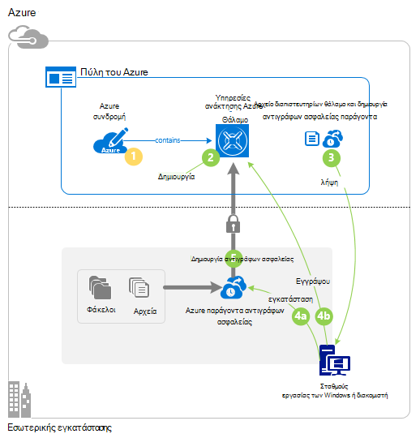

## Βήμα 1: Λήψη μια συνδρομή του Azure

Εάν δεν έχετε μια συνδρομή του Azure, δημιουργήστε ένα [δωρεάν λογαριασμό](https://azure.microsoft.com/free/) που σας επιτρέπει να αποκτήσετε πρόσβαση σε οποιαδήποτε υπηρεσία Azure.

## Βήμα 2: Δημιουργία ενός θάλαμο υπηρεσίες ανάκτησης

Για να δημιουργήσετε αντίγραφα ασφαλείας των αρχείων και φακέλων, πρέπει να δημιουργήσετε ένα θάλαμο υπηρεσίες ανάκτησης στην περιοχή όπου θέλετε να αποθηκεύσετε τα δεδομένα. Πρέπει επίσης να καθορίσετε πώς θέλετε το χώρο αποθήκευσης από αναπαραγωγή.

### Για να δημιουργήσετε ένα θάλαμο υπηρεσίες ανάκτησης

1. Εάν έχετε ήδη κάνει, συνδεθείτε για να την [Πύλη Azure](https://portal.azure.com/) χρησιμοποιώντας το Azure τη συνδρομή σας.

2. Στο μενού διανομέα, κάντε κλικ στο κουμπί **Αναζήτηση** και στη λίστα των πόρων, πληκτρολογήστε **Υπηρεσίες ανάκτησης** και κάντε κλικ στην επιλογή **υπηρεσίες ανάκτησης χώροι φύλαξης**.

    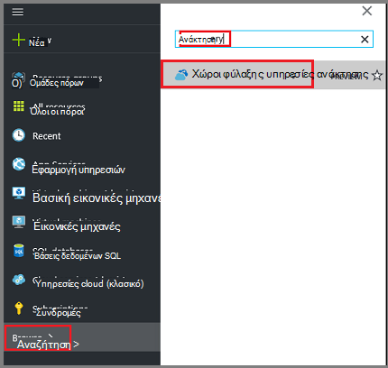  

3. Στο μενού **χώροι φύλαξης υπηρεσίες ανάκτησης** , κάντε κλικ στην επιλογή **Προσθήκη**.

    

    Ανοίγει το blade θάλαμο υπηρεσίες ανάκτησης, να σας ζητήσει να δώσετε ένα **όνομα**, **τη συνδρομή**, **ομάδα πόρων**και **θέση**.

    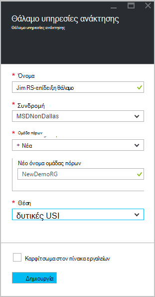

4. **Όνομα**, πληκτρολογήστε ένα φιλικό όνομα για τον προσδιορισμό του θάλαμο.

5. Κάντε κλικ στην **εγγραφή** για να δείτε τη διαθέσιμη λίστα συνδρομών.

6. Κάντε κλικ στην επιλογή **ομάδα πόρων** για να δείτε τη διαθέσιμη λίστα ομάδων πόρων ή κάντε κλικ στην επιλογή **Δημιουργία** για να δημιουργήσετε μια νέα ομάδα πόρων.

7. Κάντε κλικ στην επιλογή **θέσης** για να επιλέξετε τη γεωγραφική περιοχή για το θάλαμο. Η επιλογή αυτή καθορίζει τη γεωγραφική περιοχή όπου αποστέλλονται τα δεδομένα αντιγράφου ασφαλείας σας.

8. Κάντε κλικ στην επιλογή **Δημιουργία**.

    Εάν δεν βλέπετε το θάλαμο εμφανίζεται αφού έχει ολοκληρωθεί, κάντε κλικ στην επιλογή **Ανανέωση**. Κατά την ανανέωση της λίστας, κάντε κλικ στο όνομα του θάλαμο.

### Για να προσδιορίσετε πλεονασμού χώρου αποθήκευσης
Όταν δημιουργείτε για πρώτη φορά ένα θάλαμο υπηρεσίες ανάκτησης καθορίζετε πώς γίνεται αναπαραγωγή χώρου αποθήκευσης.

1. Κάντε κλικ στο το νέο θάλαμο για να ανοίξετε τον πίνακα εργαλείων.

2. Στο το blade **Ρυθμίσεις** , το οποίο ανοίγει αυτόματα με τον πίνακα εργαλείων σας θάλαμο, κάντε κλικ στην επιλογή **Υποδομή δημιουργίας αντιγράφων ασφαλείας**.

3. Στο το blade υποδομή αντίγραφο ασφαλείας, κάντε κλικ **Ρύθμισης παραμέτρων δημιουργίας αντιγράφων ασφαλείας** για να προβάλετε τον **τύπο αναπαραγωγής αποθήκευσης**.

    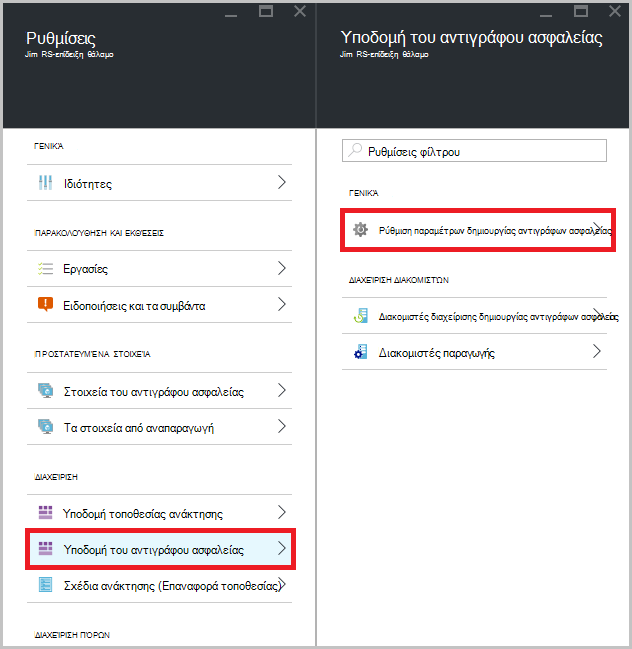

4. Ενεργοποιήστε την επιλογή αναπαραγωγή κατάλληλο χώρου αποθήκευσης για το θάλαμο.

    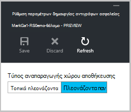

    Από προεπιλογή, το θάλαμο έχει παν πλεονάζοντα χώρο αποθήκευσης. Εάν χρησιμοποιείτε Azure ως ένα τελικό σημείο πρωτεύοντος αποθήκευσης αντιγράφων ασφαλείας, συνεχίστε να χρησιμοποιείτε παν πλεονάζοντα χώρο αποθήκευσης. Εάν χρησιμοποιείτε Azure ως ένα τελικό σημείο αποθήκευσης αντιγράφων ασφαλείας μη πρωτεύοντος, στη συνέχεια, επιλέξτε τοπικά πλεονάζοντα χώρο αποθήκευσης, έτσι θα μειωθεί το κόστος με την αποθήκευση δεδομένων στο Azure. Διαβάστε περισσότερα σχετικά με το [παν πλεονάζοντα](../storage/storage-redundancy.md#geo-redundant-storage) και [τοπικά πλεονάζοντα](../storage/storage-redundancy.md#locally-redundant-storage) επιλογές αποθήκευσης στο αυτή η [Επισκόπηση](../storage/storage-redundancy.md).

Τώρα που έχετε δημιουργήσει ένα θάλαμο, μπορείτε να προετοιμάσετε την υποδομή σας για να δημιουργήσετε αντίγραφα ασφαλείας αρχείων και φακέλων με τη λήψη τα διαπιστευτήρια υπηρεσίες ανάκτησης του Microsoft Azure παράγοντα και θάλαμο.

## Βήμα 3 - λήψη αρχείων

1. Κάντε κλικ στην επιλογή **Ρυθμίσεις** στον πίνακα εργαλείων θάλαμο υπηρεσίες ανάκτησης.

    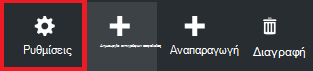

2. Κάντε κλικ στην επιλογή **Γρήγορα αποτελέσματα > Δημιουργία αντιγράφων ασφαλείας** στην το blade ρυθμίσεις.

    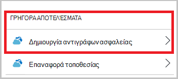

3. Κάντε κλικ στην επιλογή **στόχος αντίγραφο ασφαλείας** σε blade το αντίγραφο ασφαλείας.

    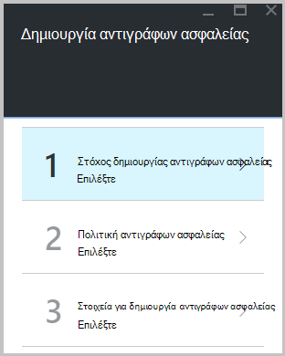

4. Επιλέξτε **εσωτερικής εγκατάστασης** από το σημείο όπου είναι το φόρτο εργασίας εκτελούνται; μενού.

5. Επιλογή **αρχείων και φακέλων** από το τι θέλετε να δημιουργίας αντιγράφων ασφαλείας; μενού, και κάντε κλικ στο **κουμπί OK**.

### Λήψη τον παράγοντα υπηρεσίες ανάκτησης

1. Κάντε κλικ **λήψη παράγοντας για Windows Server ή Windows προγράμματος-πελάτη** του blade **Προετοιμασία υποδομής** .

    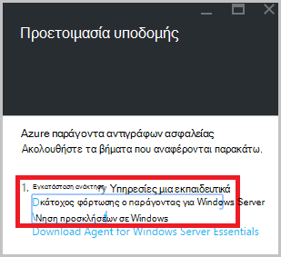

2. Κάντε κλικ στην επιλογή **Αποθήκευση** στο αναδυόμενο παράθυρο λήψης. Από προεπιλογή, το αρχείο **MARSagentinstaller.exe** αποθηκεύεται στο φάκελο λήψεις.

### Λήψη θάλαμο διαπιστευτήρια

1. Κάντε κλικ στην επιλογή **λήψη > Αποθήκευση** στην την προετοιμασία blade υποδομής.

    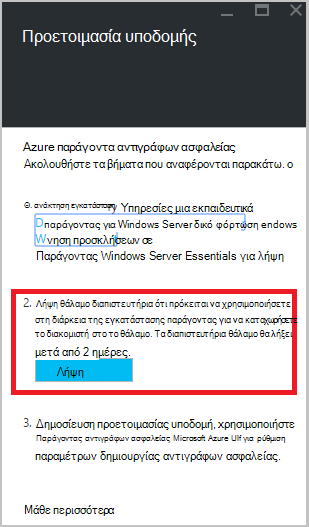

## Βήμα 4 - εγκατάσταση και καταχώρηση τον παράγοντα

>[AZURE.NOTE] Ενεργοποίηση δημιουργίας αντιγράφων ασφαλείας μέσω της πύλης Azure σύντομα διαθέσιμο. Προς το παρόν, μπορείτε να χρησιμοποιήσετε το Microsoft Agent υπηρεσίες ανάκτησης Azure εσωτερικής εγκατάστασης για να δημιουργήσετε αντίγραφα ασφαλείας των αρχείων και φακέλων.

1. Εντοπίστε και κάντε διπλό κλικ το **MARSagentinstaller.exe** από το φάκελο Downloads (ή άλλη αποθηκευμένη θέση).

2. Ολοκληρώστε τον Οδηγό εγκατάστασης Microsoft Azure αποκατάστασης υπηρεσίες παράγοντα. Για να ολοκληρώσετε τον οδηγό, πρέπει να:

    - Επιλέξτε μια θέση για την εγκατάσταση και φάκελο cache.
    - Δώστε του διακομιστή μεσολάβησης πληροφορίες διακομιστή εάν χρησιμοποιείτε διακομιστή μεσολάβησης για να συνδεθείτε στο internet.
    - Δώστε χρήστη σας λεπτομέρειες για το όνομα και τον κωδικό πρόσβασης Εάν χρησιμοποιείτε ένα με έλεγχο ταυτότητας διακομιστή μεσολάβησης.
    - Δώστε τα διαπιστευτήρια που έχετε λάβει θάλαμο
    - Αποθηκεύστε τη φράση πρόσβασης κρυπτογράφησης σε ασφαλή θέση.

    >[AZURE.NOTE] Εάν χάσετε ή ξεχάσετε τη φράση πρόσβασης, η Microsoft δεν μπορεί να βοηθήσει ανακτήσετε τα δεδομένα αντιγράφου ασφαλείας. Αποθηκεύστε το αρχείο σε ασφαλή θέση. Απαιτείται για να επαναφέρετε ένα αντίγραφο ασφαλείας.

Ο παράγοντας τώρα έχει εγκατασταθεί και ο υπολογιστής σας έχει καταχωρηθεί για το θάλαμο. Είστε έτοιμοι για να ρυθμίσετε τις παραμέτρους και να προγραμματίσετε το αντίγραφο ασφαλείας.

## Βήμα 5: Δημιουργία αντιγράφου ασφαλείας των αρχείων και φακέλων

Το αρχικό αντίγραφο ασφαλείας περιλαμβάνει δύο βασικές εργασίες:

- Προγραμματισμός της δημιουργίας αντιγράφων ασφαλείας
- Δημιουργία αντιγράφων ασφαλείας αρχείων και φακέλων για πρώτη φορά

Για να ολοκληρώσετε το αρχικό αντίγραφο ασφαλείας, μπορείτε να χρησιμοποιήσετε τον παράγοντα υπηρεσίες ανάκτησης του Microsoft Azure.

### Για να προγραμματίσετε τη δημιουργία αντιγράφων ασφαλείας

1. Ανοίξτε τον παράγοντα υπηρεσίες ανάκτησης του Microsoft Azure. Μπορείτε να το βρείτε κάνοντας αναζήτηση τον υπολογιστή σας για **Δημιουργία αντιγράφων ασφαλείας του Microsoft Azure**.

    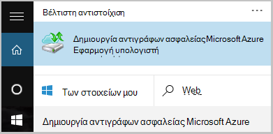

2. Στον παράγοντα υπηρεσίες ανάκτησης, κάντε κλικ στην επιλογή **Χρονοδιάγραμμα δημιουργίας αντιγράφων ασφαλείας**.

    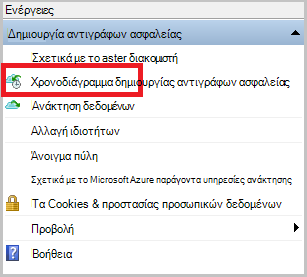

3. Στη σελίδα του Οδηγού δημιουργίας αντιγράφων ασφαλείας χρονοδιάγραμμα γρήγορα αποτελέσματα, κάντε κλικ στο κουμπί **Επόμενο**.

4. Στα στοιχεία επιλογή σελίδα δημιουργίας αντιγράφων ασφαλείας, κάντε κλικ στην επιλογή **Προσθήκη στοιχείων**.

5. Επιλέξτε τα αρχεία και τους φακέλους που θέλετε να δημιουργήσετε αντίγραφα ασφαλείας και, στη συνέχεια, κάντε κλικ στην επιλογή **εντάξει**.

6. Κάντε κλικ στο κουμπί **Επόμενο**.

7. Στη σελίδα **Καθορισμός χρονοδιάγραμμα δημιουργίας αντιγράφων ασφαλείας** , καθορίστε το **Χρονοδιάγραμμα δημιουργίας αντιγράφων ασφαλείας** και κάντε κλικ στο κουμπί **Επόμενο**.

    Μπορείτε να προγραμματίσετε ημερήσια (με μέγιστη ταχύτητα τρεις φορές ανά ημέρα) ή εβδομαδιαία δημιουργίας αντιγράφων ασφαλείας.

    

    >[AZURE.NOTE] Για περισσότερες πληροφορίες σχετικά με τον τρόπο για να καθορίσετε το χρονοδιάγραμμα αντιγράφων ασφαλείας, ανατρέξτε στο άρθρο [Χρήση Azure δημιουργίας αντιγράφων ασφαλείας για να αντικαταστήσετε την υποδομή ταινίας σας](backup-azure-backup-cloud-as-tape.md).

8. Στη σελίδα **Επιλογή πολιτικής διατήρησης** , επιλέξτε την **Πολιτική διατήρησης** για το αντίγραφο ασφαλείας.

    Η πολιτική διατήρησης Καθορίζει τη διάρκεια για την οποία θα αποθηκευτεί το αντίγραφο ασφαλείας. Και όχι μόνο καθορίζοντας μια "επίπεδο πολιτική" για όλα τα σημεία αντιγράφου ασφαλείας, μπορείτε να καθορίσετε πολιτικές διατήρησης διαφορετική βάση όταν παρουσιάζεται το αντίγραφο ασφαλείας. Μπορείτε να τροποποιήσετε τις πολιτικές διατήρησης ημερήσια, εβδομαδιαία, μηνιαία και ετήσια ώστε να ανταποκρίνεται στις ανάγκες σας.

9. Στη σελίδα επιλέξτε αρχικός τύπος αντιγράφου ασφαλείας, επιλέξτε τον αρχικό τύπο αντιγράφου ασφαλείας. Αφήστε την επιλογή **Αυτόματη μέσω του δικτύου** επιλεγμένο και, στη συνέχεια, κάντε κλικ στο κουμπί **Επόμενο**.

    Μπορείτε να δημιουργήσετε αντίγραφα ασφαλείας αυτόματα στο δίκτυο ή μπορείτε να δημιουργήσετε αντίγραφα ασφαλείας για εργασία χωρίς σύνδεση. Το υπόλοιπο της σε αυτό το άρθρο περιγράφει τη διαδικασία για την αυτόματη δημιουργία αντιγράφων ασφαλείας. Εάν προτιμάτε να κάνετε ένα αντίγραφο ασφαλείας για εργασία χωρίς σύνδεση, διαβάστε το άρθρο [για εργασία χωρίς σύνδεση ροής εργασίας δημιουργίας αντιγράφων ασφαλείας στο Azure αντιγράφου ασφαλείας](backup-azure-backup-import-export.md) για πρόσθετες πληροφορίες.

10. Στη σελίδα Confirmation, ελέγξτε τις πληροφορίες και, στη συνέχεια, κάντε κλικ στο κουμπί **Τέλος**.

11. Μετά την ολοκλήρωση του Οδηγού δημιουργίας αντιγράφων ασφαλείας στο χρονοδιάγραμμα, κάντε κλικ στο κουμπί **Κλείσιμο**.

### Για να δημιουργήσετε αντίγραφα ασφαλείας αρχείων και φακέλων για πρώτη φορά

1. Στον παράγοντα υπηρεσίες ανάκτησης, κάντε κλικ στην επιλογή **Άμεση δημιουργία αντιγράφων ασφαλείας** για να ολοκληρώσετε την αρχική καλλιέργεια μέσω του δικτύου.

    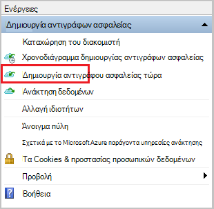

2. Στη σελίδα Confirmation, αναθεωρήστε τις ρυθμίσεις που θα χρησιμοποιήσει η επιστροφή του τώρα οδηγό για να δημιουργήσετε αντίγραφα ασφαλείας στον υπολογιστή. Στη συνέχεια, κάντε κλικ στην επιλογή **Δημιουργία αντιγράφων ασφαλείας**.

3. Κάντε κλικ στο κουμπί **Κλείσιμο** για να κλείσετε τον οδηγό. Εάν το κάνετε αυτό πριν ολοκληρωθεί η διαδικασία δημιουργίας αντιγράφων ασφαλείας, ο οδηγός εξακολουθεί να εκτελείται στο παρασκήνιο.

Μετά την ολοκλήρωση της αρχικής δημιουργίας αντιγράφων ασφαλείας, εμφανίζεται η κατάσταση **εργασίας ολοκληρώθηκε** στην κονσόλα δημιουργίας αντιγράφων ασφαλείας.

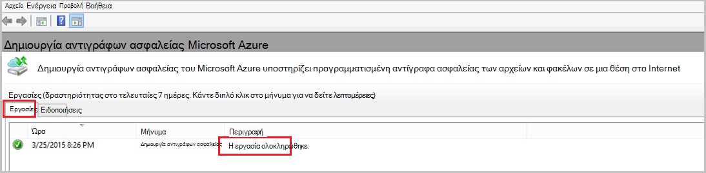

## Ερωτήσεις;
Εάν έχετε ερωτήσεις ή εάν υπάρχει οποιαδήποτε δυνατότητα που θέλετε να δείτε περιλαμβάνονται, [στείλτε μας τα σχόλιά](http://aka.ms/azurebackup_feedback).

## Επόμενα βήματα
- Λάβετε περισσότερες λεπτομέρειες σχετικά με [τη δημιουργία αντιγράφων ασφαλείας μηχανές Windows](backup-configure-vault.md).
- Τώρα που έχετε δημιουργήσει αντίγραφα ασφαλείας των αρχείων και φακέλων, μπορείτε να [διαχειριστείτε τις χώροι φύλαξης και διακομιστές](backup-azure-manage-windows-server.md).
- Εάν θέλετε να επαναφέρετε ένα αντίγραφο ασφαλείας, χρησιμοποιήστε αυτό το άρθρο για να [επαναφέρετε αρχεία σε έναν υπολογιστή Windows](backup-azure-restore-windows-server.md).
