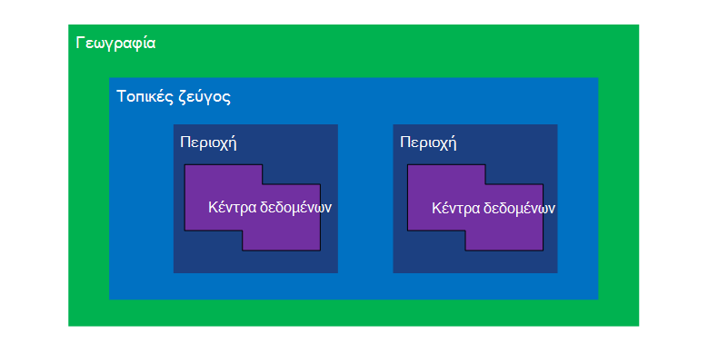
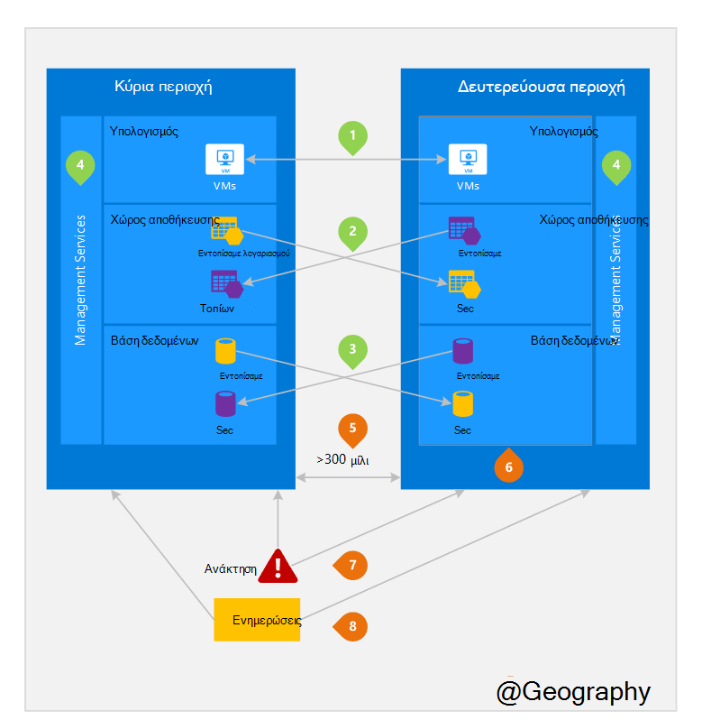

<properties
    pageTitle="Επιχειρήσεις συνέχειας και καταστροφή ανάκτησης (BCDR): περιοχές σύζευξη του Azure | Microsoft Azure"
    description="Azure τοπικές ζεύγη εξασφαλίζουν ότι εφαρμογές είναι ανθεκτικά κατά τη διάρκεια αποτυχίες κέντρου δεδομένων."
    services="site-recovery"
    documentationCenter=""
    authors="rayne-wiselman"
    manager="jwhit"
    editor=""/>

<tags
    ms.service="site-recovery"
    ms.workload="storage-backup-recovery"
    ms.tgt_pltfrm="na"
    ms.devlang="na"
    ms.topic="article"
    ms.date="08/23/2016"
    ms.author="raynew"/>

# Επιχειρήσεις συνέχειας και καταστροφή ανάκτησης (BCDR): περιοχές σύζευξη του Azure

## Τι είναι οι σύζευξη περιοχές;

Azure λειτουργεί σε πολλές geographies όλο τον κόσμο. Μια Azure Γεωγραφία είναι μια καθορισμένη περιοχή του κόσμου που περιέχει τουλάχιστον μία περιοχή Azure. Μια περιοχή Azure είναι μια περιοχή εντός μιας geography που περιέχει ένα ή περισσότερα κέντρα δεδομένων.

Κάθε Azure περιοχής είναι συνδεδεμένη με μια άλλη περιοχή εντός το ίδιο Γεωγραφία, καθιστώντας μαζί ένα ζεύγος τοπικές ρυθμίσεις. Η εξαίρεση είναι Νότια Βραζιλίας που είναι συνδεδεμένη με μια περιοχή έξω από τη Γεωγραφία.

Σχήμα 1 – Azure τοπικές ζεύγος διαγράμματος

| Γεωγραφία     |  Ζεύγη περιοχές  |                     |
| :-------------| :-------------   | :-------------      |
| Βόρεια Αμερική | Βόρεια κεντρική η.π.α. | Νότια κεντρικής η.π.α.    |
| Βόρεια Αμερική | Ανατολικής η.π.α.          | Δυτική η.π.α.             |
| Βόρεια Αμερική | ΗΠΑ Ανατολή 2        | Κεντρική η.π.α.          |
| Βόρεια Αμερική | 2 Δυτική η.π.α.        | Δυτική κεντρικής η.π.α.     |
| Ευρώπη        | Βόρεια Ευρώπη     | Δυτική Ευρώπη         |
| Χώρες Ασίας και          | Νότια Ανατολικής Ασίας  | Ανατολικής Ασίας           |
| Κίνα         | Ανατολικής Κίνα       | Βόρεια Κίνα         |
| Ιαπωνία         | Ιαπωνία Ανατολή       | Δυτική Ιαπωνία          |
| Βραζιλία        | Βραζιλία Νότια (1) | Νότια κεντρικής η.π.α.    |
| Αυστραλία     | Ανατολική Αυστραλία   | Αυστραλία νοτιοανατολικής |
| Κυβέρνηση των η.π.α. | Iowa Gov η.π.α.      | Βιρτζίνια Gov η.π.α.     |
| Ινδία         | Κεντρική Ινδίας    | Νότια Ινδίας         |
| Καναδάς        | Κεντρική ώρα Καναδά   | Καναδάς Ανατολή         |
| ΗΝΩΜΈΝΟ ΒΑΣΊΛΕΙΟ            | Δυτική ΗΒ          | Νότια ΗΒ            |

Πίνακας 1 - αντιστοίχιση του azure ζεύγη τοπικές ρυθμίσεις

> (1) Νότια Βραζιλίας είναι μοναδικό επειδή αυτό είναι συνδεδεμένη με μια περιοχή εκτός Γεωγραφία δικό του. Δευτερεύουσα της Βραζιλίας Νότια περιοχή είναι Νότια κεντρικής ΜΑΣ αλλά δευτερεύουσα περιοχή Νότια κεντρικής ΜΑΣ του δεν είναι Νότια Βραζιλίας.

Συνιστάται να κάνετε αναπαραγωγή φόρτους εργασίας σε ζεύγη τοπικές ρυθμίσεις για να επωφεληθείτε από τις πολιτικές απομόνωσης και τη διαθεσιμότητα του Azure. Για παράδειγμα, ενημερώσεις προγραμματισμένες Azure συστήματος αναπτύσσονται διαδοχικά (όχι την ίδια στιγμή) σε ζεύγη περιοχές. Αυτό σημαίνει ότι ακόμη και σε σπάνια περίπτωση μιας ελαττωματική ενημέρωσης, δύο περιοχές δεν θα επηρεαστεί ταυτόχρονα. Επιπλέον, στο πιθανό συμβάν από μια ευρεία μη διαθεσιμότητα, έχει προτεραιότητα αποκατάστασης της περιοχής τουλάχιστον μία από κάθε ζεύγος.

## Παράδειγμα ζεύγη περιοχές
Εικόνα 2 παρακάτω εμφανίζει μια υποθετική εφαρμογή που χρησιμοποιεί το τοπικές ζεύγος για αποκατάσταση. Οι αριθμοί πράσινο επισημάνετε τις δραστηριότητες σταυρό περιοχή τρεις Azure υπηρεσιών (τον υπολογισμό Azure, αποθήκευση και βάσης δεδομένων) και πώς να έχουν ρυθμιστεί για την αναπαραγωγή σε περιοχές. Το μοναδικό πλεονεκτήματα της ανάπτυξη σε ζεύγη περιοχές επισημαίνονται με τους αριθμούς πορτοκαλί.

Εικόνα 2-υποθετική Azure ζεύγος τοπικές ρυθμίσεις

## Δραστηριότητες σταυρό περιοχής
Που αναφέρεται στο σχήμα 2.

 **Azure τον υπολογισμό (PaaS)** – πρέπει να προμηθεύσουν υπολογισμού επιπλέον πόρους εκ των προτέρων, για να βεβαιωθείτε ότι υπάρχουν διαθέσιμοι πόροι σε μια άλλη περιοχή κατά τη διάρκεια μιας καταστροφής. Για περισσότερες πληροφορίες, ανατρέξτε στο θέμα [τεχνική καθοδήγηση Azure υποστηρίζεται](./resiliency/resiliency-technical-guidance.md).

 **Αποθήκευσης Azure** - παν πλεονάζοντα χώρο αποθήκευσης (Εξοπλισμό) έχει ρυθμιστεί από προεπιλογή, όταν δημιουργείται ένας λογαριασμός Azure χώρου αποθήκευσης. Με Εξοπλισμό, τα δεδομένα σας είναι αυτόματη αναπαραγωγή τρεις φορές μέσα στην κύρια περιοχή και τρεις φορές στην περιοχή ζεύγη. Για περισσότερες πληροφορίες, ανατρέξτε στο θέμα [Επιλογές πλεονασμού αποθήκευσης Azure](storage/storage-redundancy.md).

 **Βάσεις δεδομένων SQL Azure** – με Azure SQL τυπική παν-αναπαραγωγής, μπορείτε να ρυθμίσετε ασύγχρονης αναπαραγωγής των συναλλαγών σε ζεύγη περιοχή. Με παν Premium-αναπαραγωγής, μπορείτε να ρυθμίσετε αναπαραγωγής οποιαδήποτε περιοχή στον κόσμο; Ωστόσο, συνιστάται να αναπτύξετε αυτοί οι πόροι σε μια περιοχή ζεύγη για τα περισσότερα σενάρια αποκατάστασης από καταστροφή. Για περισσότερες πληροφορίες, ανατρέξτε στο θέμα [Παν-αναπαραγωγή σε βάση δεδομένων SQL Azure](./sql-database/sql-database-geo-replication-overview.md).

 **Διαχείρισης πόρων Azure (ARM)** - ARM παρέχει εγγενώς λογικές απομόνωσης της υπηρεσίας διαχείρισης στοιχεία σε περιοχές. Αυτό σημαίνει ότι λογική αποτυχίες σε μία περιοχή είναι λιγότερο πιθανό να επηρεάσουν την άλλη.

## Πλεονεκτήματα της ζεύγη περιοχές
Που αναφέρεται στο σχήμα 2.  

**φυσική απομόνωσης** – όταν είναι δυνατό, Azure προτιμά τουλάχιστον 300 μίλια διαχωρισμού μεταξύ κέντρα δεδομένων σε ένα ζεύγος τοπικές, παρόλο που δεν είναι πρακτικές ή δυνατές σε όλους geographies. Διαχωρισμός φυσικής κέντρο δεδομένων μειώνει την πιθανότητα θεομηνίες, αστικών unrest, διακοπων ΡΕΥΜΑΤΟΣ ή διακοπές του δικτύου φυσική επηρεάζει ταυτόχρονα δύο περιοχές. Απομόνωσης υπόκειται σε τους περιορισμούς εντός τη γεωγραφία (μέγεθος Γεωγραφία, διαθεσιμότητα υποδομή του power/δικτύου, κανονισμών, κ.λπ.).  

αυτόματης αναπαραγωγής στην περιοχή ζεύγη παρέχουν**που παρέχονται από την πλατφόρμα αναπαραγωγής** - ορισμένες υπηρεσίες, όπως τα πλεονάζοντα παν χώρου αποθήκευσης.

**περιοχή αποκατάστασης σειρά** – σε περίπτωση μια ευρεία μη διαθεσιμότητα, αποκατάστασης από μία περιοχή είναι δυνατός ο καθορισμός προτεραιότητας από κάθε ζεύγος. Εφαρμογές που έχουν αναπτυχθεί σε ζεύγη περιοχές είναι εγγυημένη να έχετε μία από τις περιοχές ανάκτησης με προτεραιότητα. Εάν μια εφαρμογή έχει αναπτυχθεί σε περιοχές, οι οποίες δεν είναι κατά ζεύγη, αποκατάστασης μπορεί να καθυστερήσουν – στην περίπτωση χειρότερες τις επιλεγμένες περιοχές μπορεί να είναι τα τελευταία δύο πρέπει να ανακτηθεί.

**Sequential ενημερώνει** – ενημερώσεις αναπτύσσονται στις περιοχές ζεύγη διαδοχικά σύστημα προγραμματισμένη Azure (όχι την ίδια στιγμή) για να ελαχιστοποιήσετε το χρόνο εκτός λειτουργίας, το αποτέλεσμα των σφαλμάτων και λογική αποτυχίες στην σπάνια περίπτωση μιας εσφαλμένες ενημέρωσης.

**τον τόπο διαμονής δεδομένων** – μια περιοχή βρίσκεται μέσα σε το ίδιο Γεωγραφία ως το ζεύγος (με την εξαίρεση της Βραζιλίας Νότια) προκειμένου να πληροί τις απαιτήσεις τον τόπο διαμονής δεδομένων για σκοπούς δικαιοδοσία επιβολής φόρου και δίκαιο.

