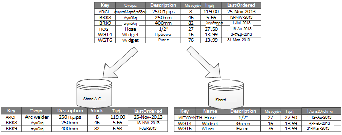
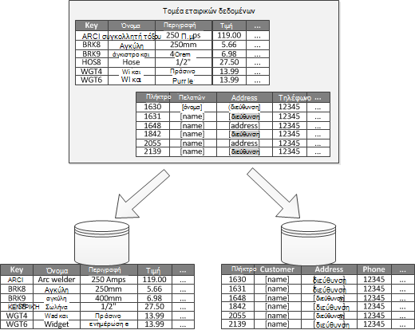
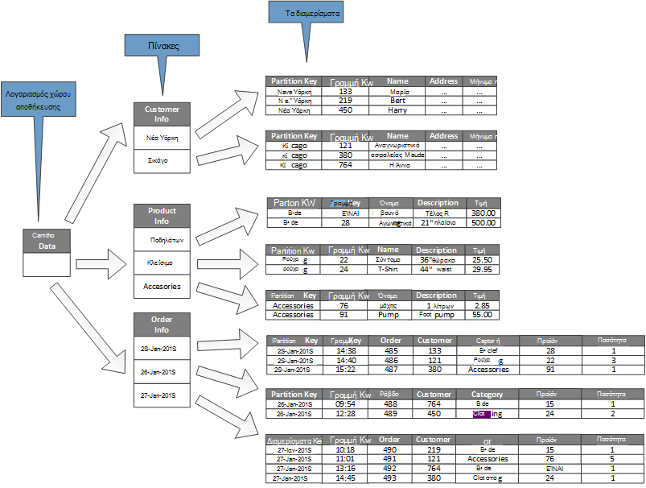

<properties
   pageTitle="Δεδομένα διαμερισμάτων καθοδήγηση | Microsoft Azure"
   description="Οδηγίες για τον τρόπο για να διαχωρίσετε τα διαμερίσματα για διαχείριση και η πρόσβαση σε ξεχωριστά."
   services=""
   documentationCenter="na"
   authors="dragon119"
   manager="christb"
   editor=""
   tags=""/>

<tags
   ms.service="best-practice"
   ms.devlang="na"
   ms.topic="article"
   ms.tgt_pltfrm="na"
   ms.workload="na"
   ms.date="07/14/2016"
   ms.author="masashin"/>

# Καθοδήγηση διαμερισμού δεδομένων

[AZURE.INCLUDE [pnp-header](../includes/guidance-pnp-header-include.md)]

## Επισκόπηση

Σε πολλές λύσεις ευρείας κλίμακας, δεδομένων χωρίζεται σε ξεχωριστά διαμερίσματα που μπορούν να διαχειριζόμενων και να αποκτήσετε πρόσβαση σε αυτές ξεχωριστά. Πρέπει να επιλέξετε τη στρατηγική διαμερισμού προσεκτικά για να μεγιστοποιήσετε τα οφέλη κατά την ελαχιστοποίηση αρνητικές συνέπειες. Δημιουργία διαμερισμάτων μπορούν να σας βοηθήσουν βελτίωση κλιμάκωση και μείωση ασυμφωνίας βελτιστοποίηση των επιδόσεων. Ένα άλλο πλεονέκτημα των διαμερισμάτων είναι ότι μπορεί να παρέχει μηχανισμό για τη διαίρεση δεδομένων με το μοτίβο χρήσης. Για παράδειγμα, μπορείτε να αρχειοθετήσετε παλαιότερα, λιγότερο ενεργό (ψυχρές) δεδομένων σε κοστίζει χώρος αποθήκευσης δεδομένων.

## Γιατί διαμερίσματα δεδομένων;

Οι περισσότερες cloud εφαρμογές και υπηρεσίες αποθήκευση και ανάκτηση δεδομένων ως μέρος των δραστηριοτήτων τους. Η σχεδίαση του τους χώρους αποθήκευσης δεδομένων που χρησιμοποιεί μια εφαρμογή μπορεί να έχει σημαντικές επιπτώσεις στις επιδόσεις, μετάδοσης, και κλιμάκωση ενός συστήματος. Μια τεχνική που εφαρμόζεται συνήθως σε ευρείας κλίμακας συστήματα είναι για να διαιρέσετε τα δεδομένα σε ξεχωριστά διαμερίσματα.

> Το όρων _διαμερισμάτων_ που χρησιμοποιείται σε αυτές τις οδηγίες αναφέρεται σε φυσική διαίρεση δεδομένων σε ξεχωριστά δεδομένα αποθηκεύει τη διαδικασία. Αυτό δεν είναι ίδια με τη δημιουργία διαμερισμάτων πίνακα SQL Server που είναι μια διαφορετική έννοια.

Δημιουργία διαμερισμάτων δεδομένων μπορεί να προσφέρουν διάφορα πλεονεκτήματα. Για παράδειγμα, μπορούν να εφαρμοστούν προκειμένου να:

- **Βελτίωση κλιμάκωση**. Κατά την κλίμακα ενός συστήματος μία βάση δεδομένων, αυτή θα εμφανίσει φτάσει όριο φυσικό υλικό. Εάν διαίρεση δεδομένων σε πολλά διαμερίσματα, καθένα από τα οποία φιλοξενείται σε διαφορετικό διακομιστή, μπορείτε να κλίμακα του συστήματος σχεδόν απεριόριστο χρονικό διάστημα.
- **Βελτίωση απόδοσης**. Λειτουργίες πρόσβασης δεδομένων σε κάθε partition πραγματοποιείται πάνω από ένα μικρότερο όγκο δεδομένων. Υπό την προϋπόθεση ότι τα δεδομένα είναι διαμερίσματα με κατάλληλο τρόπο, διαμερισμάτων μπορεί να σύστημά σας πιο αποτελεσματική. Να εκτελέσετε λειτουργίες που επηρεάζουν περισσότερα από ένα διαμερίσματα παράλληλα. Κάθε διαμερίσματα μπορεί να βρίσκεται κοντά την εφαρμογή που χρησιμοποιεί το για να ελαχιστοποιήσετε την αδράνεια δικτύου.
- **Βελτίωση διαθεσιμότητα**. Διαχωρισμό δεδομένων σε πολλούς διακομιστές αποφεύγεται ένα μοναδικό σημείο αποτυχίας. Εάν αποτύχει ένα διακομιστή, ή γίνεται προγραμματισμένη συντήρηση, μόνο τα δεδομένα σε που διαμερίσματα δεν είναι διαθέσιμη. Λειτουργίες σε άλλα διαμερίσματα να συνεχίσετε. Αύξηση του αριθμού των διαμερισμάτων που μειώνει τις σχετικές επιπτώσεις των αποτυχία μεμονωμένο διακομιστή, μειώνοντας το ποσοστό των δεδομένων που δεν θα είναι διαθέσιμη. Αναπαραγωγή κάθε διαμερίσματα να μειώσετε περαιτέρω τις πιθανότητες να αποτυχία μία διαμερισμάτων που επηρεάζουν λειτουργίες. Αυτό σας επιτρέπει επίσης για το διαχωρισμό κρίσιμων δεδομένων που πρέπει να είναι συνεχή και ιδιαίτερα διαθέσιμη από τη χαμηλή τιμή δεδομένων που έχει κάτω διαθεσιμότητα απαιτήσεις (για παράδειγμα, αρχεία καταγραφής).
- **Βελτίωση ασφαλείας**. Ανάλογα με τη φύση των δεδομένων και πώς έχει διαμερίσματα, είναι πιθανό να διαχωρίσετε διάκριση πεζών-κεφαλαίων και μη ευαίσθητα δεδομένα σε διαφορετικά διαμερίσματα και, επομένως, σε διαφορετικούς διακομιστές ή τα δεδομένα αποθηκεύονται. Ασφάλεια μπορεί, στη συνέχεια, να βελτιστοποιηθεί για τα ευαίσθητα δεδομένα συγκεκριμένα.
- **Παροχή λειτουργικές ευελιξία**. Δημιουργία διαμερισμάτων προσφέρει πολλές ευκαιρίες για λεπτομερές ρύθμισης λειτουργίες Μεγιστοποίηση διοικητικής αποτελεσματικότητας και την ελαχιστοποίηση κόστος. Για παράδειγμα, μπορείτε να ορίσετε διάφορες στρατηγικές για διαχείριση, παρακολούθηση, δημιουργία αντιγράφων ασφαλείας και επαναφορά και άλλες διαχειριστικές εργασίες με βάση τη σπουδαιότητα των δεδομένων σε κάθε διαμερίσματα.
- **Ταίριασμα αποθήκευση των δεδομένων για το μοτίβο χρήσης**. Δημιουργία διαμερισμάτων επιτρέπει κάθε διαμερισμάτων που θα αναπτυχθεί σε διαφορετικό τύπο χώρου αποθήκευσης δεδομένων, με βάση κόστος και τις ενσωματωμένες δυνατότητες που δεδομένα αποθηκεύουν προσφορές. Για παράδειγμα, μεγάλο δυαδικά δεδομένα μπορούν να αποθηκευτούν σε ένα χώρο αποθήκευσης δεδομένων blob, ενώ μπορούν να διατηρηθούν πιο δομημένα δεδομένα σε μια βάση δεδομένων του εγγράφου. Για περισσότερες πληροφορίες, ανατρέξτε στο θέμα [Δημιουργία μιας λύσης polyglot] στον Οδηγό μοτίβα & πρακτικές και [δεδομένων της access για ιδιαίτερα μεταβλητού μεγέθους λύσεις: χρήση SQL, NoSQL και polyglot διατήρησης] στην τοποθεσία Web της Microsoft.

Ορισμένα συστήματα υλοποιεί διαμερισμάτων επειδή θεωρείται ένα κόστος και όχι ένα πλεονέκτημα. Συνηθισμένες αιτίες για αυτό σκεπτικό περιλαμβάνουν τα εξής:

- Πολλά συστήματα χώρου αποθήκευσης δεδομένων δεν υποστηρίζουν σύνδεσμοι σε διαμερίσματα και μπορεί να είναι δύσκολο για τη διατήρηση της ακεραιότητας αναφορών σε ένα σύστημα διαμερίσματα. Είναι συχνά απαραίτητο για την υλοποίηση σύνδεσμοι και ακεραιότητα μεταβιβάζει τον κώδικα της εφαρμογής (στο διαμερισμού επίπεδο), που μπορεί να οδηγήσει σε επιπλέον εισόδου/εξόδου και την πολυπλοκότητα της εφαρμογής.
- Λαμβάνοντας υπόψη τα διαμερίσματα δεν είναι πάντα trivial εργασίας. Σε ένα σύστημα όπου τα δεδομένα είναι δυναμικές, ίσως χρειαστεί να νέα εξισορρόπηση διαμερίσματα περιοδικά για να μειώσετε διένεξη και ενεργά σημεία.
- Ορισμένα κοινά εργαλεία δεν λειτουργεί ομαλά με διαμερίσματα δεδομένων.

## Σχεδίαση διαμερίσματα

Μπορεί να είναι διαμερίσματα δεδομένα με διαφορετικούς τρόπους: οριζόντια, κατακόρυφα ή λειτουργικά. Η στρατηγική που επιλέγετε εξαρτάται από το λόγο για τη δημιουργία διαμερισμάτων τα δεδομένα και τις απαιτήσεις των εφαρμογών και των υπηρεσιών που θα χρησιμοποιούν τα δεδομένα.

> [AZURE.NOTE] Με τον τρόπο που είναι ανεξάρτητο από τα υποκείμενα τεχνολογία αποθήκευσης δεδομένων εξηγούνται οι συνδυασμοί διαμερισμάτων που περιγράφονται σε αυτές τις οδηγίες. Μπορούν να εφαρμοστούν σε πολλούς τύπους δεδομένων αποθηκεύει, συμπεριλαμβανομένων των σχεσιακών και NoSQL βάσεις δεδομένων.

### Στρατηγικές διαμερισμού

Οι τρεις τυπικές στρατηγικές για τη δημιουργία διαμερισμάτων δεδομένων είναι οι εξής:

- **Οριζόντια διαμερισμάτων** (συχνά ονομάζονται _sharding_). Σε αυτή τη στρατηγική, κάθε διαμερίσματα είναι ένα χώρο αποθήκευσης δεδομένων στο δικό του δεξιά, αλλά όλα τα διαμερίσματα έχουν το ίδιο σχήμα. Κάθε διαμερισμάτων που είναι γνωστό ως ένα _shard_ και διατηρεί ένα συγκεκριμένο υποσύνολο των δεδομένων, όπως όλες τις παραγγελίες για ένα συγκεκριμένο σύνολο των πελατών σε μια εφαρμογή του ηλεκτρονικού εμπορίου.
- **Κατακόρυφη διαμερισμάτων**. Σε αυτή τη στρατηγική, κάθε partition περιέχει ένα υποσύνολο των πεδίων για τα στοιχεία στο χώρο αποθήκευσης δεδομένων. Τα πεδία χωρίζονται σύμφωνα με τους μοτίβο χρήσης. Για παράδειγμα, συχνά πρόσβαση πεδία μπορεί να τοποθετηθεί στο ένα διαμερίσματα κατακόρυφη και λιγότερο συχνά πρόσβαση πεδίων σε έναν άλλο.
- **Δημιουργία διαμερισμάτων λειτουργικές**. Σε αυτή τη στρατηγική, δεδομένα συναθροίζεται ανάλογα με το πώς χρησιμοποιείται από κάθε περιβάλλον ορίζεται στο σύστημα. Για παράδειγμα, ένα ηλεκτρονικές σύστημα που υλοποιεί διαχωρισμό των επιχειρηματικών λειτουργιών για την τιμολόγηση και τη Διαχείριση αποθεμάτων προϊόντος ενδέχεται να αποθηκεύονται δεδομένα τιμολόγιο σε ένα διαμερίσματα και προϊόντος απόθεμα δεδομένα σε μια άλλη.

Είναι σημαντικό να λάβετε υπόψη ότι μπορεί να συνδυαστεί τις τρεις στρατηγικές που περιγράφονται εδώ. Δεν είναι αμοιβαία αποκλειόμενα και συνιστάται να σκέφτεστε τις όλες κατά τη σχεδίαση ενός συνδυασμού διαμερισμού. Για παράδειγμα, που μπορεί να χωρίσετε δεδομένων σε shards και χρησιμοποιήστε κατακόρυφη διαμερισμάτων για την περαιτέρω υποδιαίρεση των δεδομένων σε κάθε shard. Ομοίως, τα δεδομένα σε μια λειτουργική διαμερίσματα μπορεί να διαιρεθεί σε shards (το οποίο μπορεί επίσης να κατακόρυφα διαμερίσματα).

Ωστόσο, οι διαφορετικές απαιτήσεις κάθε στρατηγικής να ύψωση αριθμού των θεμάτων που βρίσκονται σε διένεξη. Πρέπει να αξιολογήσετε και να υπόλοιπο όλες αυτές τις διαδικασίες κατά τη σχεδίαση ενός συνδυασμού διαμερισμού που πληρούν τους στόχους απόδοσης συνολική επεξεργασίας δεδομένων για το σύστημα. Οι παρακάτω ενότητες Εξερευνήστε κάθε μία από τις στρατηγικές με περισσότερες λεπτομέρειες.

### Οριζόντια διαμερισμάτων (sharding)

Σχήμα 1 εμφανίζει μια επισκόπηση των διαμερισμάτων οριζόντια ή sharding. Σε αυτό το παράδειγμα, δεδομένα απογραφής προϊόντων χωρίζεται σε shards βάσει του αριθμού-κλειδιού προϊόντος. Κάθε shard περιέχει τα δεδομένα για μια συνεχόμενη περιοχή shard πλήκτρα (A-G και H-Z), οργανωμένες με αλφαβητική σειρά.

_Σχήμα 1. Οριζόντια διαμερισμάτων που βασίζεται σε έναν αριθμό-κλειδί διαμερίσματα δεδομένων (sharding)_

Sharding σάς βοηθά να κατανέμονται περισσότερους υπολογιστές, το οποίο μειώνει ασυμφωνίας και βελτιώνει τις επιδόσεις, η φόρτωση. Μπορείτε να κλιμάκωση το σύστημα ανάληψη προσθέτοντας περαιτέρω shards που εκτελούνται σε πρόσθετους διακομιστές.

Ο πιο σημαντικός παράγοντας κατά την εφαρμογή του διαμερισμού στρατηγική αυτή είναι η επιλογή του αριθμού-κλειδιού sharding. Μπορεί να είναι δύσκολο να αλλάξετε τον αριθμό-κλειδί μετά το σύστημα είναι σε λειτουργία. Το κλειδί πρέπει να βεβαιωθείτε ότι έχει διαμερίσματα δεδομένων, έτσι ώστε το φόρτο εργασίας ως ακόμα είναι όσο το δυνατόν κατά μήκος του shards.

Σημειώστε ότι διαφορετικές shards δεν χρειάζεται να περιέχουν παρόμοια όγκους δεδομένων. Αντίθετα, το πιο σημαντικό είναι να εξισορροπήσετε ο αριθμός των αιτήσεων. Ορισμένες shards μπορεί να είναι πολύ μεγάλο, αλλά κάθε στοιχείο είναι το θέμα του χαμηλό αριθμό λειτουργίες της access. Άλλες shards μπορεί να είναι μικρότερο, αλλά η πρόσβαση σε κάθε στοιχείο είναι πολύ πιο συχνά. Είναι επίσης σημαντικό για να βεβαιωθείτε ότι ένα μεμονωμένο shard δεν υπερβαίνει τα όρια κλίμακα (όσον αφορά την ικανότητα και επεξεργασίας πόρων) του χώρου αποθήκευσης δεδομένων που χρησιμοποιείται για τη φιλοξενία που shard.

Εάν χρησιμοποιείτε ένα συνδυασμό sharding, αποφύγετε τη δημιουργία ενεργά σημεία (ή τα διαμερίσματα συντόμευσης) που μπορεί να επηρεάζουν τις επιδόσεις και διαθεσιμότητα. Για παράδειγμα, εάν χρησιμοποιείτε μια κατακερματισμός του ένα αναγνωριστικό πελάτη αντί για το πρώτο γράμμα του ονόματος ενός πελάτη, μπορείτε να αποτρέψετε τη μη ισορροπημένες διανομής που προκύπτει από συνήθεις και λιγότερο κοινές πρώτα γράμματα. Αυτή είναι μια τυπική τεχνική που σας βοηθά να διανείμετε τα δεδομένα πιο ομοιόμορφα κατά μήκος τα διαμερίσματα.

Επιλέξτε έναν αριθμό-κλειδί sharding που ελαχιστοποιεί τις μελλοντικές απαιτήσεις για να διαιρέσετε μεγάλη shards σε μικρότερα τμήματα, τη συνένωση μικρές shards σε μεγαλύτερα διαμερίσματα ή να αλλάξετε το σχήμα που περιγράφει τα δεδομένα που είναι αποθηκευμένα σε ένα σύνολο από τα διαμερίσματα. Αυτές οι λειτουργίες μπορεί να είναι πολύ χρονοβόρα και ενδέχεται να απαιτείται η αποσύνδεση μία ή περισσότερες shards ενώ εκτελούνται.

Εάν shards αναπαράγονται, είναι πιθανό να διατηρήσετε ορισμένα από τα αντίγραφα online, ενώ άλλοι είναι διαίρεση, συγχωνευμένη ή εκ νέου ρύθμιση παραμέτρων. Ωστόσο, το σύστημα ίσως χρειαστεί να περιορίσετε τις ενέργειες που μπορούν να εκτελεστούν τα δεδομένα σε αυτά τα shards ενώ γίνεται η αλλαγή των ρυθμίσεων παραμέτρων. Για παράδειγμα, τα δεδομένα στο τα αντίγραφα μπορούν να επισημανθούν ως μόνο για ανάγνωση για να περιορίσετε το εύρος της inconsistences που ενδέχεται να προκύψουν ενώ είναι που αναδιάρθρωση shards.

> Για πιο λεπτομερείς πληροφορίες και καθοδήγηση σχετικά με πολλά από αυτά τα ζητήματα και τεχνικές καλή πρακτική για τη σχεδίαση χώροι αποθήκευσης δεδομένων που υλοποίηση οριζόντια διαμερισμάτων, ανατρέξτε στο θέμα [Sharding μοτίβο].

### Κατακόρυφη διαμερισμάτων

Η πιο κοινή χρήση για τη δημιουργία κατακόρυφης διαμερισμάτων είναι να μειωθεί η είσοδος/έξοδος και απόδοσης κόστους που σχετίζονται με τη λήψη των στοιχείων που είναι δυνατή η πρόσβαση στις πιο συχνά. Εικόνα 2 παρουσιάζει ένα παράδειγμα κατακόρυφη διαμερισμάτων. Σε αυτό το παράδειγμα, πραγματοποιούνται διαφορετικές ιδιότητες για κάθε στοιχείο δεδομένων σε διαφορετικά διαμερίσματα. Ένα διαμερίσματα περιέχει δεδομένα που είναι δυνατή η πρόσβαση στις πιο συχνά, συμπεριλαμβάνοντας το όνομα, περιγραφή και πληροφορίες τιμών για τα προϊόντα. Μια άλλη διατηρεί την ένταση ήχου σε απόθεμα και την τελευταία ημερομηνία ταξινομημένη.

_Εικόνα 2. Κατακόρυφη διαμερισμού δεδομένων κατά το μοτίβο χρήσης_

Σε αυτό το παράδειγμα, η εφαρμογή τακτικά ερωτήματα το όνομα του προϊόντος, περιγραφή και τιμή κατά την εμφάνιση των λεπτομερειών προϊόντος στους πελάτες. Το επίπεδο μετοχών και την ημερομηνία όταν το προϊόν έχει παραγγελθεί τελευταία από τον κατασκευαστή διατηρούνται σε ένα ξεχωριστό partition επειδή αυτά τα δύο στοιχεία είναι συχνά χρησιμοποιούμενα μαζί.

Αυτός ο συνδυασμός διαμερισμάτων έχει το πλεονέκτημα ότι τα δεδομένα σχετικά επιβραδύνει-Μετακίνηση (όνομα προϊόντος, περιγραφή και τιμή) διαχωρίζονται από τα δεδομένα πιο δυναμική (στοκ και τελευταία ημερομηνία ταξινομημένη). Μια εφαρμογή μπορεί να βρείτε χρήσιμα σε προσωρινή αποθήκευση των δεδομένων επιβραδύνει-μετακίνηση στη μνήμη εάν γίνεται συχνά.

Ένα άλλο τυπικό σενάριο για αυτήν τη στρατηγική διαμερισμού είναι να μεγιστοποιήσετε την ασφάλεια των ευαίσθητα δεδομένα. Για παράδειγμα, μπορείτε να κάνετε αυτό, αποθηκεύοντας αριθμοί πιστωτικών καρτών και το αντίστοιχο αριθμούς επαλήθευσης ασφαλείας κάρτα σε ξεχωριστά διαμερίσματα.

Κατακόρυφη διαμερισμάτων επίσης να μειώσετε το μέγεθος του ταυτόχρονης πρόσβασης που απαιτείται για τα δεδομένα.

> Κατακόρυφη διαμερισμάτων λειτουργεί στο επίπεδο οντότητα μέσα σε ένα χώρο αποθήκευσης δεδομένων, εν μέρει κανονικοποίηση μια οντότητα να αναλυθεί από μια _ευρεία_ στοιχείο σε ένα σύνολο _περιορίσετε_ στοιχείων. Είναι ιδανικό για καταστήματα προσανατολισμένος σε στήλη δεδομένων όπως HBase και Cassandra. Εάν τα δεδομένα σε μια συλλογή από στήλες είναι πιθανό να αλλάξετε, επίσης μπορείτε να χρησιμοποιήσετε στήλη αποθηκεύει στον SQL Server.

### Λειτουργική διαμερισμάτων

Για συστήματα όπου είναι δυνατό να αναγνωρίσετε μια όρια περιβάλλοντος για κάθε διακριτές επιχειρηματικό τομέα ή η υπηρεσία στην εφαρμογή, λειτουργική διαμερισμάτων παρέχει μια τεχνική για τη βελτίωση της απόδοσης access απομόνωσης και των δεδομένων. Μια άλλη κοινή χρήση των διαμερισμάτων λειτουργική είναι για το διαχωρισμό ανάγνωση και εγγραφή δεδομένων από τα δεδομένα μόνο για ανάγνωση που χρησιμοποιείται για σκοπούς αναφοράς. Εικόνα 3 εμφανίζει μια επισκόπηση των διαμερισμάτων λειτουργική όπου διαχωρίζονται τα δεδομένα απογραφής από δεδομένα πελάτη.

_Εικόνα 3. Λειτουργικά διαμερισμού δεδομένων από συνδεδεμένες περιβάλλοντος ή ο δευτερεύων τομέας_

Αυτή η διαμερισμού στρατηγική μπορεί να σας βοηθήσει να μειώσετε ασυμφωνίας πρόσβαση δεδομένων σε διαφορετικά τμήματα ενός συστήματος.

## Σχεδίαση διαμερίσματα για κλιμάκωση

Είναι απαραίτητο να εξετάσετε μέγεθος και φόρτο εργασίας για κάθε διαμερίσματα και υπόλοιπο τους, ώστε να κατανέμεται δεδομένων για να επιτύχετε μέγιστο κλιμάκωση. Ωστόσο, πρέπει επίσης να διαμερίσματα τα δεδομένα, ώστε να δεν υπερβαίνει τα όρια κλίμακας ενός χώρου αποθήκευσης μόνο διαμερίσματα.

Κατά τη σχεδίαση διαμερίσματα για κλιμάκωση, ακολουθήστε τα παρακάτω βήματα:

1. Ανάλυση της εφαρμογής για να κατανοήσετε τα μοτίβα πρόσβασης δεδομένων, όπως το μέγεθος του συνόλου αποτελεσμάτων που επιστρέφονται από κάθε ερώτημα, η συχνότητα της access, τα εγγενή λανθάνοντα χρόνο και την πλευρά του διακομιστή υπολογιστική απαιτήσεις επεξεργασίας. Σε πολλές περιπτώσεις, μερικά κύρια οντοτήτων απαιτούν περισσότερους πόρους επεξεργασίας.
2. Χρησιμοποιήστε αυτήν την ανάλυση για να καθορίσετε τους στόχους τρέχουσες και μελλοντικές κλιμάκωση, όπως το μέγεθος δεδομένων και το φόρτο εργασίας. Διανομή, στη συνέχεια, τα δεδομένα κατά μήκος τα διαμερίσματα ώστε να ανταποκρίνεται κλιμάκωση προορισμού. Η οριζόντια διαμερισμού στρατηγική, επιλέγοντας το κατάλληλο shard κλειδί είναι σημαντικό για να βεβαιωθείτε ότι είναι ακόμα και διανομής. Για περισσότερες πληροφορίες, ανατρέξτε στο θέμα το [μοτίβο Sharding].
3. Βεβαιωθείτε ότι είναι αρκετό ώστε να διαχειρίζεστε τις απαιτήσεις κλιμάκωση όσον αφορά το μέγεθος του δεδομένων και μεταγωγή τους πόρους που είναι διαθέσιμες σε κάθε διαμερίσματα. Για παράδειγμα, ο κόμβος που φιλοξενεί ένα διαμερίσματα ενδέχεται να επιβάλλει ένα όριο στην ποσότητα του χώρου αποθήκευσης, επεξεργασίας power ή το εύρος ζώνης δικτύου που παρέχει. Εάν οι απαιτήσεις αποθήκευσης και επεξεργασίας δεδομένων είναι πιθανό να υπερβούν αυτά τα όρια, αυτό μπορεί να είναι απαραίτητο για να βελτιώσετε διαμερισμού στρατηγική σας ή διαίρεση δεδομένων ανάληψη περαιτέρω. Για παράδειγμα, μία προσέγγιση κλιμάκωση μπορεί να για να διαχωρίσετε καταγραφή δεδομένων από τις βασικές δυνατότητες της εφαρμογής. Μπορείτε να το κάνετε αυτό με τη χρήση αποθηκεύει χωριστά δεδομένα για να αποτρέψετε τις απαιτήσεις αποθήκευσης στο σύνολο των δεδομένων από την υπέρβαση του ορίου κλίμακας του κόμβου. Εάν ο συνολικός αριθμός των δεδομένων αποθηκεύει υπερβαίνει το όριο κόμβου, μπορεί να χρειαστεί να χρησιμοποιήσετε κόμβους ξεχωριστή χώρου αποθήκευσης.
4. Παρακολούθηση του συστήματος στην περιοχή χρήση για να επαληθεύσετε ότι τα δεδομένα διανέμεται με τον αναμενόμενο τρόπο και ότι τα διαμερίσματα μπορεί να χειρίζεται το φόρτο που είναι που επιβάλλονται σε αυτά. Είναι πιθανό ότι η χρήση δεν ταιριάζουν με τη χρήση που αναμένεται κατά την ανάλυση. Σε αυτή την περίπτωση, ίσως είναι δυνατή η νέα εξισορρόπηση τα διαμερίσματα. Άλλως, μπορεί να χρειαστεί να σχεδιάσετε εκ νέου ορισμένα τμήματα του συστήματος να αποκτήσει το υπόλοιπο απαιτείται.

Σημειώστε ότι ορισμένα περιβάλλοντα cloud εκχώρηση πόρων όσον αφορά την υποδομή όρια. Βεβαιωθείτε ότι τα όρια του επιλεγμένου όριο προσφέρει αρκετό χώρο για οποιαδήποτε αναμενόμενη ανάπτυξη του όγκου των δεδομένων, όσον αφορά την αποθήκευση δεδομένων, ισχύος επεξεργασίας και το εύρος ζώνης.

Για παράδειγμα, εάν χρησιμοποιείτε το χώρο αποθήκευσης πινάκων του Azure, μια απασχολημένος shard ενδέχεται να απαιτεί περισσότερους πόρους από αυτές που είναι διαθέσιμες σε ένα μεμονωμένο partition χειρισμού των αιτήσεων. (Υπάρχει όριο στον όγκο των αιτήσεων που αντιμετώπισης από ένα διαμερίσματα μόνο ένα συγκεκριμένο χρονικό διάστημα. Ανατρέξτε στη σελίδα [των προορισμών κλιμάκωση και επιδόσεων Azure χώρου αποθήκευσης] στην τοποθεσία Web της Microsoft για περισσότερες λεπτομέρειες.)

 Εάν πρόκειται για την περίπτωση, το shard ίσως χρειαστεί να χωριστεί για να διαδώσετε η φόρτωση. Εάν το συνολικό μέγεθος ή μετάδοσης από αυτούς τους πίνακες υπερβαίνει η δυναμικότητα ενός λογαριασμού χώρου αποθήκευσης, μπορεί να χρειαστεί να δημιουργήσετε επιπλέον χώρο αποθήκευσης λογαριασμούς και τους πίνακες που εκτείνεται αυτούς τους λογαριασμούς. Εάν ο αριθμός των λογαριασμών αποθήκευσης υπερβαίνει τον αριθμό των λογαριασμών που είναι διαθέσιμες σε μια συνδρομή, στη συνέχεια, μπορεί να χρειαστεί να χρησιμοποιήσετε πολλές συνδρομές.

## Σχεδίαση διαμερίσματα για την απόδοση του ερωτήματος

Επιδόσεις ερωτημάτων μπορεί να είναι ενισχύεται συχνά με τη χρήση μικρότερο σύνολα δεδομένων και εκτελώντας παράλληλη ερωτήματα. Κάθε partition πρέπει να περιέχει ένα μικρό τμήμα των ολόκληρο το σύνολο δεδομένων. Αυτή η μείωση της έντασης ήχου να βελτιώσετε τις επιδόσεις ερωτημάτων. Ωστόσο, διαμερισμάτων δεν είναι μια εναλλακτική λύση για το σχεδιασμό και τη ρύθμιση των παραμέτρων μιας βάσης δεδομένων σωστά. Για παράδειγμα, βεβαιωθείτε ότι έχετε τα απαραίτητα ευρετήρια στη θέση, εάν χρησιμοποιείτε μια σχεσιακή βάση δεδομένων.

Κατά τη σχεδίαση διαμερίσματα για την απόδοση του ερωτήματος, ακολουθήστε τα παρακάτω βήματα:

1. Εξετάστε την απαιτήσεις της εφαρμογής και την απόδοση:
    - Χρησιμοποιήστε τις απαιτήσεις επιχειρήσεις για να προσδιορίσετε τα ερωτήματα κρίσιμων που πρέπει να εκτελείτε πάντα γρήγορα.
    - Παρακολουθεί το σύστημα για τον προσδιορισμό τυχόν ερωτήματα που εκτελούν αργά.
    - Καθορίσετε ποια ερωτήματα εκτελούνται πιο συχνά. Μια μεμονωμένη περίοδο λειτουργίας του κάθε ερώτημα μπορεί να έχει το ελάχιστο κόστος, αλλά η αθροιστική κατανάλωση πόρων θα μπορούσε να είναι σημαντική. Ίσως είναι προτιμότερο να διαχωρίσετε τα δεδομένα που έχει ανακτηθεί από αυτά τα ερωτήματα σε μια διακριτού διαμερίσματα ή ακόμη και ένα cache.
2. Τα δεδομένα που προκαλεί αργές επιδόσεις διαμερίσματα:
    - Περιορίσετε το μέγεθος του κάθε διαμερίσματα, έτσι ώστε το χρόνο απόκρισης ερωτήματος είναι εντός προορισμού.
    - Σχεδιάστε το κλειδί shard, έτσι ώστε η εφαρμογή να βρίσκετε εύκολα τα διαμερίσματα Εάν εφαρμόζετε οριζόντια διαμερισμάτων. Αυτό εμποδίζει το ερώτημα από χρειάζεται να εξετάζω κάθε διαμερίσματα.
    - Εξετάστε το ενδεχόμενο στη θέση του ένα διαμερίσματα. Εάν είναι δυνατό, προσπαθήστε να διατηρείτε τα δεδομένα σε διαμερίσματα που είναι γεωγραφικά Κλείσιμο για τις εφαρμογές και τους χρήστες που έχουν πρόσβαση σε αυτήν.
3. Εάν μια οντότητα έχει μετάδοσης και ερώτημα απαιτήσεις επιδόσεων, χρησιμοποιήστε λειτουργική διαμερισμάτων που βασίζεται σε αυτήν την οντότητα. Εάν αυτό εξακολουθεί να δεν πληροί τις απαιτήσεις, εφαρμόστε καθώς και οριζόντια διαμερισμάτων. Στις περισσότερες περιπτώσεις αρκεί μια μεμονωμένη διαμερισμού στρατηγική, αλλά σε ορισμένες περιπτώσεις είναι πιο αποτελεσματική για να συνδυάσετε δύο στρατηγικές.
4. Εξετάστε το ενδεχόμενο χρήσης ασύγχρονης ερωτήματα που εκτελούνται παράλληλα σε διαμερίσματα για βελτίωση της απόδοσης.

## Σχεδίαση διαμερίσματα για διαθεσιμότητα

Δημιουργία διαμερισμάτων δεδομένων μπορεί να βελτιώσει τη διαθεσιμότητα των εφαρμογών διασφαλίζοντας ότι το ολόκληρο σύνολο δεδομένων δεν αποτελεί ένα μοναδικό σημείο αποτυχίας και ότι μπορεί να γίνει ανεξάρτητα Διαχείριση μεμονωμένα υποσύνολα του συνόλου δεδομένων. Αναπαραγωγή τα διαμερίσματα που περιέχουν κρίσιμων δεδομένων επίσης να βελτιώσετε διαθεσιμότητα.

Κατά το σχεδιασμό και υλοποίηση διαμερίσματα, εξετάστε τους εξής παράγοντες που επηρεάζουν διαθεσιμότητα:

- **Πόσο σημαντικό είναι τα δεδομένα να επιχειρηματικές δραστηριότητες**. Ορισμένα δεδομένα ενδέχεται να περιλαμβάνουν κρίσιμες επιχειρηματικές πληροφορίες όπως λεπτομέρειες τιμολογίου ή συναλλαγές τράπεζας. Άλλα δεδομένα ενδέχεται να περιλαμβάνουν λιγότερο κρίσιμες δεδομένων λειτουργίας, όπως αρχεία καταγραφής, ανιχνεύσεις επιδόσεων και ούτω καθεξής. Μετά από τον προσδιορισμό κάθε τύπο δεδομένων, εξετάστε το ενδεχόμενο να:
    - Αποθήκευση κρίσιμων δεδομένων σε ιδιαίτερα διαθέσιμα τα διαμερίσματα με ένα κατάλληλο πρόγραμμα δημιουργίας αντιγράφων ασφαλείας.
    - Για τον καθορισμό χωριστή διαχείριση και την παρακολούθηση μηχανισμούς ή διαδικασίες για τη διαφορετική criticalities κάθε σύνολο δεδομένων. Τοποθετήστε τα δεδομένα που έχουν το ίδιο επίπεδο κρισιμότητα στο ίδιο τα διαμερίσματα, έτσι ώστε το μπορούν να δημιουργηθούν αντίγραφα ασφαλείας μαζί με μια κατάλληλη συχνότητα. Για παράδειγμα, τα διαμερίσματα που περιέχουν δεδομένα για συναλλαγές τράπεζα ίσως χρειαστεί να αντίγραφα ασφαλείας συχνότερα από τα διαμερίσματα που κρατήστε πατημένο το πλήκτρο καταγραφή ή ανίχνευση πληροφορίες.
- **Πώς μπορείτε να διαχειριστείτε τις μεμονωμένες τα διαμερίσματα**. Σχεδίαση διαμερίσματα για την υποστήριξη ανεξάρτητη διαχείρισης και συντήρησης παρέχει πολλά πλεονεκτήματα. Για παράδειγμα:
    - Εάν αποτύχει μια διαμερίσματα, μπορεί να ανακτηθεί ανεξάρτητα χωρίς να επηρεαστούν τα παρουσίες των εφαρμογών που έχουν πρόσβαση σε δεδομένα σε άλλα διαμερίσματα.
    - Δημιουργία διαμερισμάτων δεδομένων κατά γεωγραφική περιοχή επιτρέπει προγραμματισμένη συντήρηση εργασίες ώστε να εμφανίζονται στο ωρών αιχμής για κάθε θέση. Βεβαιωθείτε ότι τα διαμερίσματα δεν είναι πολύ μεγάλο για να αποτρέψετε την ολοκλήρωση κατά τη διάρκεια αυτής της περιόδου οποιαδήποτε προγραμματισμένη συντήρηση.
- **Εάν θέλετε να κάνετε αναπαραγωγή κρίσιμων δεδομένων σε διαμερίσματα**. Αυτή η στρατηγική μπορεί να βελτιώσει διαθεσιμότητα και επιδόσεων, παρόλο που να μπορεί να προκαλέσει επίσης συνέπειας θέματα. Ο χρόνος για αλλαγές που γίνονται σε δεδομένα σε ένα διαμερίσματα να συγχρονιστούν με κάθε ρεπλίκα. Κατά τη διάρκεια αυτής της περιόδου, διαφορετικά διαμερίσματα θα περιέχει τιμές διαφορετικών δεδομένων.

## Κατανόηση των διαμερισμάτων επηρεάζει τον τρόπο σχεδιασμού και ανάπτυξης

Χρήση διαμερισμάτων προσθέτει πολυπλοκότητα τη σχεδίαση και ανάπτυξη του συστήματος. Εξετάστε το ενδεχόμενο διαμερισμάτων ως θεμελιώδεις μέρος του συστήματος σχεδίαση ακόμα και αν το σύστημα αρχικά περιέχει μόνο ένα μεμονωμένο διαμερίσματα. Εάν αντιμετωπίσετε διαμερισμάτων ως δεύτερη σκέψη, όταν ξεκινά το σύστημα να υφίσταται επιδόσεις και κλιμάκωση θέματα, την πολυπλοκότητα αυξάνει επειδή έχετε ήδη μια ζωντανή συστήματος για να διατηρήσετε.

Εάν ενημερώσετε το σύστημα να ενσωματώσετε διαμερισμάτων σε αυτό το περιβάλλον, απαιτεί τροποποίηση της λογικής πρόσβασης δεδομένων. Μπορεί να περιλαμβάνει επίσης τη μετεγκατάσταση μεγάλες ποσότητες από υπάρχοντα δεδομένα προκειμένου να τη διανείμετε σε διαμερίσματα, συχνά ενώ αναμένουν οι χρήστες να μπορούν να συνεχίσετε να χρησιμοποιείτε το σύστημα.

Σε ορισμένες περιπτώσεις, διαμερισμάτων δεν θεωρείται σημαντικό επειδή το αρχικό σύνολο δεδομένων είναι μικρό και μπορούν να χρησιμοποιήσουν εύκολα με ένα διακομιστή. Αυτό μπορεί να είναι αληθή σε ένα σύστημα που δεν αναμένεται για να κλιμακωθεί πέρα από το αρχικό του μέγεθος, αλλά πολλά εμπορική συστήματα πρέπει να αναπτύξετε ως ο αριθμός των χρηστών αυξάνεται. Αυτό επέκτασης συνήθως συνοδεύεται από αύξηση της έντασης ήχου δεδομένων.

Είναι επίσης σημαντικό να κατανοήσετε ότι διαμερισμάτων δεν είναι πάντα μια συνάρτηση της αποθηκεύει μεγάλου όγκου δεδομένων. Για παράδειγμα, ένα χώρο αποθήκευσης μικρές δεδομένων μπορεί να έχει πρόσβαση σε μεγάλο βαθμό από εκατοντάδες ταυτόχρονες προγράμματα-πελάτες. Δημιουργία διαμερισμάτων τα δεδομένα σε αυτήν την περίπτωση μπορεί να σας βοηθήσει να μειώσετε ασυμφωνίας και να βελτιώσετε τη μεταγωγή.

Κατά τη σχεδίαση ενός συνδυασμού διαμερισμού δεδομένων, λάβετε υπόψη τα εξής σημεία:

- **Όπου είναι δυνατό, διατήρηση δεδομένων για τις πιο κοινές λειτουργίες βάσης δεδομένων στην κάθε διαμερίσματα για να ελαχιστοποιήσετε λειτουργιών πρόσβασης σε σταυρό διαμερισμάτων δεδομένα**. Υποβολή ερωτημάτων σε διαμερίσματα μπορεί να είναι περισσότερο χρονοβόρα από την υποβολή ερωτημάτων μόνο μέσα σε ένα μεμονωμένο διαμερίσματα, αλλά βελτιστοποίηση διαμερίσματα για ένα σύνολο ερωτημάτων μπορεί να επηρεάσουν αρνητικά άλλα σύνολα ερωτημάτων. Όταν δεν μπορείτε να αποφύγετε την υποβολή ερωτημάτων σε διαμερίσματα, ελαχιστοποίηση χρόνος ερωτήματος, εκτελώντας παράλληλη ερωτήματα και συγκέντρωση των αποτελεσμάτων μέσα από την εφαρμογή. Αυτή η προσέγγιση ενδέχεται να μην είναι δυνατό να εκτελεστεί σε ορισμένες περιπτώσεις, όπως όταν είναι απαραίτητο να αποκτήσετε ένα αποτέλεσμα από ένα ερώτημα και να το χρησιμοποιήσετε στο επόμενο ερώτημα.
- **Εάν τα ερωτήματα βεβαιωθείτε Χρησιμοποιήστε σχετικά στατικά αναφοράς δεδομένων, όπως πίνακες Ταχυδρομικός κώδικας ή λίστες προϊόντος, εξετάστε το ενδεχόμενο να αναπαραγωγή αυτών των δεδομένων σε όλα τα διαμερίσματα για να μειώσετε την απαίτηση για λειτουργίες ξεχωριστή αναζήτησης σε διαφορετικά διαμερίσματα**. Αυτή η προσέγγιση επίσης να μειώσετε την πιθανότητα των δεδομένων αναφοράς πώς να γίνετε ένα σύνολο δεδομένων "συντόμευσης" που υπόκειται μεγάλη κυκλοφορία από σε ολόκληρο το σύστημα. Ωστόσο, υπάρχει ένα πρόσθετο κόστος που σχετίζεται με το συγχρονισμό τυχόν αλλαγές που ενδέχεται να προκύψουν σε αυτά τα δεδομένα αναφοράς.
- **Εάν είναι δυνατόν, ελαχιστοποίηση απαιτήσεις για την ακεραιότητα αναφορών σε κατακόρυφη και λειτουργική διαμερίσματα**. Σε αυτούς τους συνδυασμούς, την ίδια την εφαρμογή είναι υπεύθυνος για τη διατήρηση της ακεραιότητας αναφορών σε διαμερίσματα κατά την ενημέρωση και που καταναλώθηκε δεδομένων. Τα ερωτήματα που πρέπει να συμμετάσχετε σε δεδομένα σε περισσότερα από ένα διαμερίσματα εκτελούνται πιο αργά από ερωτήματα που ενώνονται δεδομένα μόνο εντός του ίδιου διαμερίσματα, επειδή η εφαρμογή συνήθως πρέπει να εκτελέσετε διαδοχικές ερωτήματα που βασίζονται σε έναν αριθμό-κλειδί και, στη συνέχεια, σε ένα εξωτερικό κλειδί. Αντί για αυτό, μπορείτε να κάνετε αναπαραγωγή ή καταργήστε την κανονικοποίηση των σχετικών δεδομένων. Για να ελαχιστοποιήσετε την ώρα ερωτήματος όπου σύνδεσμοι σταυρό διαμερίσματα είναι απαραίτητα, εκτέλεση ερωτημάτων παράλληλες επάνω από τα διαμερίσματα και τη συμμετοχή των δεδομένων μέσα από την εφαρμογή.
- **Μπορείτε να το εφέ που ενδέχεται να διαθέτουν του συνδυασμού διαμερισμάτων της συνέπειας δεδομένων σε διαμερίσματα.** Αξιολόγηση εάν ισχυρό συνέπειας είναι στην πραγματικότητα μια απαίτηση. Αντί για αυτό, είναι μια κοινή προσέγγιση στο cloud για την υλοποίηση ενδεχόμενη συνέπειας. Τα δεδομένα σε κάθε partition ενημερώνονται ξεχωριστά και της λογικής εφαρμογή εξασφαλίζει ότι οι ενημερώσεις είναι όλα ολοκληρώθηκε με επιτυχία. Χειρίζεται επίσης τις ασυνέπειες που μπορεί να προκύψουν από την υποβολή ερωτημάτων δεδομένων κατά την εκτέλεση μιας λειτουργίας τελικά συνεπή. Για περισσότερες πληροφορίες σχετικά με την εφαρμογή ενδεχόμενη συνέπειας, ανατρέξτε στο θέμα το [κύριο βήμα συνέπειας δεδομένων].
- **Εξετάστε το ενδεχόμενο να πώς ερωτήματα εντοπίστε τη σωστή διαμερίσματα**. Εάν ένα ερώτημα πρέπει να σαρώσετε όλα τα διαμερίσματα για να εντοπίσετε τα απαιτούμενα δεδομένα, υπάρχει σημαντικές επιπτώσεις στις επιδόσεις, ακόμα και όταν εκτελούνται πολλών ερωτημάτων παράλληλες. Ερωτήματα που χρησιμοποιούνται με κατακόρυφη και λειτουργική διαμερισμού στρατηγικές ομαλά να καθορίσετε τα διαμερίσματα. Ωστόσο, οριζόντια διαμερισμάτων (sharding) μπορούν να κάνουν τον εντοπισμό ενός στοιχείου που είναι δύσκολη, επειδή κάθε shard έχει το ίδιο σχήμα. Μια τυπική λύση για sharding είναι για να διατηρήσετε ένα χάρτη που μπορούν να χρησιμοποιηθούν για να αναζητήσετε τη θέση shard για συγκεκριμένα στοιχεία των δεδομένων. Αυτή η αντιστοίχιση μπορεί να υλοποιηθεί σε της λογικής sharding της εφαρμογής ή να διατηρούνται από το χώρο αποθήκευσης δεδομένων εάν υποστηρίζει διαφανή sharding.
- **Όταν χρησιμοποιείτε μια οριζόντια διαμερισμού στρατηγική, εξετάστε το ενδεχόμενο να περιοδικά εξισορρόπηση του shards**. Αυτό σας βοηθά ομοιόμορφη κατανομή των δεδομένων με μέγεθος και με φόρτο εργασίας για να ελαχιστοποιήσετε ενεργά σημεία, μεγιστοποίηση επιδόσεις ερωτημάτων και παράκαμψη περιορισμών φυσικός χώρος αποθήκευσης. Ωστόσο, αυτή είναι μια σύνθετη εργασία που συχνά απαιτεί τη χρήση ενός προσαρμοσμένου εργαλείου ή διαδικασία.
- **Εάν κάνετε αναπαραγωγή κάθε διαμερίσματα, παρέχει επιπλέον προστασία από αποτυχία**. Εάν αποτύχει μια μεμονωμένη ρεπλίκα, τα ερωτήματα μπορεί να κατευθύνεται προς ένα αντίγραφο εργασίας.
- **Εάν προσεγγιστούν τα όρια φυσικής διαμερισμού στρατηγικής, ίσως χρειαστεί να επεκτείνετε την κλιμάκωση σε διαφορετικό επίπεδο**. Για παράδειγμα, εάν διαμερισμάτων είναι στο επίπεδο της βάσης δεδομένων, ίσως χρειαστεί να εντοπίσετε ή να αναπαραγάγετε τα διαμερίσματα σε πολλές βάσεις δεδομένων. Εάν διαμερισμάτων είναι ήδη στο επίπεδο της βάσης δεδομένων και φυσική περιορισμοί είναι ένα ζήτημα, αυτό μπορεί να σημαίνει ότι πρέπει να εντοπίσετε ή να αναπαραγάγετε τα διαμερίσματα σε πολλούς λογαριασμούς φιλοξενίας.
- **Αποφύγετε συναλλαγές που έχουν πρόσβαση σε δεδομένα σε περισσότερα από ένα διαμερίσματα**. Ορισμένα δεδομένα αποθηκεύει υλοποίηση συναλλαγών συνέπεια και την ακεραιότητα για λειτουργίες που τροποποίηση των δεδομένων, αλλά μόνο όταν τα δεδομένα που βρίσκονται σε μια μεμονωμένη διαμερίσματα. Εάν χρειάζεστε υποστήριξη συναλλαγών σε περισσότερα από ένα διαμερίσματα, πιθανότατα θα πρέπει να υλοποιήσετε ως μέρος της λογικής της εφαρμογής σας επειδή πιο διαμερισμού συστήματα δεν παρέχουν εγγενή υποστήριξη.

Όλα τα δεδομένα καταστήματα απαιτούν ορισμένες λειτουργικές διαχείρισης και την παρακολούθηση της δραστηριότητας. Οι εργασίες μπορεί να κυμαίνεται από γίνεται φόρτωση των δεδομένων, δημιουργία αντιγράφων ασφαλείας και επαναφορά των δεδομένων, αναδιοργάνωση δεδομένων και διασφάλιση ότι το σύστημα εκτελεί σωστά και αποτελεσματικά.

Εξετάστε τους εξής παράγοντες που επηρεάζουν λειτουργικές διαχείρισης:

- **Πώς μπορείτε να υλοποιήσετε κατάλληλο εργασιών διαχείρισης και λειτουργίας όταν έχει διαμερίσματα τα δεδομένα**. Αυτές οι εργασίες ενδέχεται να περιλαμβάνουν δημιουργίας αντιγράφων ασφαλείας και επαναφορά, αρχειοθέτηση δεδομένων, παρακολούθηση του συστήματος και άλλες εργασίες διαχείρισης. Για παράδειγμα, διατηρώντας λογική συνέπειας κατά τη διάρκεια δημιουργίας αντιγράφων ασφαλείας και επαναφορά των λειτουργιών μπορεί να είναι δύσκολο.
- **Πώς να φορτώσετε τα δεδομένα σε πολλά διαμερίσματα και να προσθέσετε νέα δεδομένα που φτάνει από άλλες προελεύσεις**. Ορισμένα εργαλεία και βοηθητικά προγράμματα ίσως δεν υποστηρίζει λειτουργίες sharded δεδομένων όπως γίνεται φόρτωση των δεδομένων σε τη σωστή διαμερίσματα. Αυτό σημαίνει ότι ίσως χρειαστεί να δημιουργήσετε ή να αποκτήσετε νέα εργαλεία και βοηθητικά προγράμματα.
- **Πώς μπορείτε να αρχειοθετήσετε και να διαγράψετε τα δεδομένα σε τακτική βάση**. Για να αποτρέψετε την πλεονάζουσα ανάπτυξη τα διαμερίσματα, πρέπει να αρχειοθετήσετε και διαγραφή δεδομένων σε τακτική βάση (ίσως μηνιαία). Μπορεί να χρειαστεί να μετασχηματισμός των δεδομένων ώστε να ταιριάζει με ένα σχήμα διαφορετικό αρχειοθέτησης.
- **Πώς να εντοπίζετε προβλημάτων ακεραιότητας δεδομένων**. Εξετάστε το ενδεχόμενο να εκτελείται μια περιοδική διαδικασία για τον εντοπισμό τυχόν προβλημάτων ακεραιότητας δεδομένων όπως δεδομένων σε ένα διαμερίσματα που αναφέρεται πληροφοριών που λείπουν σε ένα άλλο. Η διαδικασία μπορεί να είτε να προσπαθήσει να διορθώσει αυτόματα αυτά τα προβλήματα ή να αυξήσετε μια ειδοποίηση ώστε να τελεστή για να διορθώσετε τα προβλήματα με μη αυτόματο τρόπο. Για παράδειγμα, σε μια εφαρμογή ηλεκτρονικού εμπορίου, πληροφορίες παραγγελίας μπορεί να διατηρηθούν στο ένα διαμερίσματα, αλλά τα στοιχεία γραμμής που αποτελούν κάθε παραγγελία μπορεί να διατηρηθούν στο άλλο. Η διαδικασία τοποθετώντας διάταξη πρέπει να προσθέσετε δεδομένα σε άλλα διαμερίσματα. Εάν αυτή η διαδικασία αποτύχει, μπορεί να στοιχεία γραμμής αποθηκεύονται για το οποίο υπάρχει χωρίς αντίστοιχη σειρά.

Τεχνολογίες αποθήκευσης διαφορετικά δεδομένα παρέχουν συνήθως τις δικές τους δυνατότητες για την υποστήριξη διαμερισμάτων. Οι παρακάτω ενότητες συνοψίζουν τις επιλογές που εφαρμόζονται με αποθηκεύει δεδομένα που χρησιμοποιούνται συνήθως από Azure εφαρμογές. Επίσης περιγράφουν ζητήματα σχετικά με τη σχεδίαση εφαρμογών που καλύτερα επωφεληθείτε από αυτές τις δυνατότητες.

## Δημιουργία διαμερισμάτων στρατηγικές για βάση δεδομένων SQL Azure

Βάση δεδομένων SQL του Azure είναι μια σχεσιακή βάση δεδομένων-ως-a-υπηρεσία που εκτελείται στο cloud. Βασίζεται σε Microsoft SQL Server. Σχεσιακή βάση δεδομένων διαιρεί τις πληροφορίες σε πίνακες και κάθε πίνακας περιέχει πληροφορίες σχετικά με οντοτήτων ως μια σειρά των γραμμών. Κάθε γραμμή περιέχει στήλες που περιέχουν τα δεδομένα για τα μεμονωμένα πεδία νομικού. Στη σελίδα [Τι είναι η βάση δεδομένων SQL Azure;] του Microsoft τοποθεσία Web παρέχει λεπτομερείς τεκμηρίωση σχετικά με τη δημιουργία και χρήση βάσεις δεδομένων SQL.

## Οριζόντια διαμερισμάτων με ελαστικά βάσης δεδομένων

Μία βάση δεδομένων SQL έχει όριο τον όγκο των δεδομένων που μπορεί να περιέχει. Μετάδοσης περιορίζεται από αρχιτεκτονική παράγοντες και τον αριθμό των ταυτόχρονες συνδέσεις που υποστηρίζει. Η δυνατότητα ελαστικότητας βάσης δεδομένων της βάσης δεδομένων SQL υποστηρίζει οριζόντια κλιμάκωση για μια βάση δεδομένων SQL. Χρήση ελαστικότητας βάσης δεδομένων, μπορείτε να δημιουργήσετε διαμερίσματα των δεδομένων σας σε shards που εκτείνονται σε πολλές βάσεις δεδομένων SQL. Μπορείτε επίσης να προσθέσετε ή να καταργήσετε shards, όπως τον όγκο δεδομένων που χρειάζεστε για να χειριστείτε αναπτύσσεται και συρρικνώνεται. Χρήση ελαστικότητας βάσης δεδομένων μπορεί να βοηθήσει επίσης μείωση διένεξη με τη διανομή η φόρτωση σε βάσεις δεδομένων.

> [AZURE.NOTE] Ελαστική βάση δεδομένων είναι αντικαθιστά τη δυνατότητα ομοσπονδίες της βάσης δεδομένων SQL Azure. Υπάρχοντα Ομοσπονδία βάσης δεδομένων SQL εγκαταστάσεις μπορείτε να μετεγκαταστήσετε ελαστικότητας βάση δεδομένων, χρησιμοποιώντας το βοηθητικό πρόγραμμα μετεγκατάστασης ομοσπονδίες. Εναλλακτικά, μπορείτε να εφαρμόσετε τον δικό σας μηχανισμό sharding εάν το σενάριό σας δεν ο δανεισμός ίδια ομαλά στις δυνατότητες που παρέχονται από ελαστικότητας βάσης δεδομένων.

Κάθε shard έχει υλοποιηθεί ως μια βάση δεδομένων SQL. Μια shard μπορεί να περιέχει περισσότερα από ένα σύνολο δεδομένων (αναφέρεται ως μια _shardlet_). Κάθε βάση δεδομένων διατηρεί μετα-δεδομένων που περιγράφει την shardlets που περιέχει. Μια shardlet μπορεί να είναι ένα στοιχείο μόνο δεδομένων ή μπορεί να είναι μια ομάδα στοιχείων που έχουν το ίδιο κλειδί shardlet. Για παράδειγμα, εάν είστε sharding δεδομένων σε μια εφαρμογή multitenant, το πλήκτρο shardlet μπορεί να είναι το Αναγνωριστικό του μισθωτή και όλα τα δεδομένα για ένα δεδομένο μισθωτή μπορούν να διατηρηθούν ως μέρος του ίδιου shardlet. Δεδομένα για άλλες μισθωτές θα διατηρούνται σε διαφορετικές shardlets.

Είναι ευθύνη τον προγραμματιστή για να συσχετίσετε ένα σύνολο δεδομένων με έναν αριθμό-κλειδί shardlet. Μια ξεχωριστή βάση δεδομένων SQL λειτουργεί ως διαχειριστής χάρτης καθολικής shard. Αυτή η βάση δεδομένων περιέχει μια λίστα με όλα τα shards και shardlets στο σύστημα. Μια εφαρμογή προγράμματος-πελάτη που έχει πρόσβαση σε δεδομένα πρώτα συνδέεται με την καθολική shard χάρτη manager βάση δεδομένων για να αποκτήσετε ένα αντίγραφο του χάρτη shard (καταχώρηση shards και shardlets), που αποθηκεύει, στη συνέχεια, τοπικά.

Η εφαρμογή, στη συνέχεια, χρησιμοποιεί αυτές τις πληροφορίες σε αιτήσεις δρομολόγηση δεδομένων για το κατάλληλο shard. Αυτή η λειτουργία είναι ορατή πίσω από μια σειρά από API που περιέχονται στη Azure SQL βάσης δεδομένων ελαστικότητας βάση δεδομένων προγράμματος-πελάτη βιβλιοθήκη, που είναι διαθέσιμη ως ένα πακέτο NuGet. Η σελίδα [επισκόπηση δυνατοτήτων ελαστικότητας βάσης δεδομένων] στην τοποθεσία Web της Microsoft παρέχει μια πιο ολοκληρωμένη εισαγωγή ελαστικότητας βάσης δεδομένων.

> [AZURE.NOTE] Μπορείτε να αναπαραγάγετε την καθολική shard χάρτη βάσης δεδομένων της διαχείρισης μείωση λανθάνοντα χρόνο και τη βελτίωση διαθεσιμότητα. Εάν εφαρμόσετε τη βάση δεδομένων, χρησιμοποιώντας μία από τις σειρές τιμολόγησης Premium, μπορείτε να ρυθμίσετε ενεργό παν αναπαραγωγής για να αντιγράψετε συνεχώς δεδομένα σε βάσεις δεδομένων με διαφορετικές περιοχές. Δημιουργήστε ένα αντίγραφο της βάσης δεδομένων σε κάθε περιοχή στην οποία βασίζονται οι χρήστες. Στη συνέχεια, ρυθμίστε τις παραμέτρους την εφαρμογή σας για να συνδεθείτε με αυτό το αντίγραφο για να αποκτήσετε το χάρτη shard.

> Εναλλακτική προσέγγιση είναι να χρησιμοποιήσετε συγχρονισμού δεδομένων SQL Azure ή μια διοχέτευση Azure εργοστασίου δεδομένων για να αναπαραγάγετε τη βάση δεδομένων διαχείρισης χάρτη shard σε περιοχές. Αυτή η μορφή της αναπαραγωγής εκτελείται περιοδικά και είναι πιο κατάλληλη εάν ο χάρτης shard αλλάζει συχνά. Επιπλέον, η βάση δεδομένων shard χάρτη manager δεν έχει να δημιουργηθούν με τη χρήση μιας Premium τις τιμές σε επίπεδο.

Ελαστικά βάσης δεδομένων παρέχει δύο συστήματα για αντιστοίχιση των δεδομένων σε shardlets και την αποθήκευσή τους σε shards:

- **Λίστα shard χάρτη** περιγράφει μια συσχέτιση μεταξύ ένα μεμονωμένο κλειδί και ένα shardlet. Για παράδειγμα, σε ένα σύστημα multitenant, τα δεδομένα για κάθε μισθωτή μπορεί να είναι που σχετίζεται με ένα μοναδικό κλειδί και είναι αποθηκευμένο στο δικό του shardlet. Για να εξασφαλίσετε απομόνωση και προστασίας προσωπικών δεδομένων (δηλαδή, για να αποτρέψετε ένα μισθωτή του από το να καταναλώνει διαθέσιμα σε άλλους πόρους χώρου αποθήκευσης δεδομένων), κάθε shardlet μπορούν να διατηρηθούν μέσα σε δικό του shard.

_Εικόνα 4. Χρήση αντιστοίχισης shard λίστα για την αποθήκευση δεδομένων του μισθωτή σε ξεχωριστή shards_

- Ένα **χάρτη shard περιοχή** περιγράφει μια συσχέτιση ανάμεσα σε ένα σύνολο συνεχόμενων βασικές τιμές και ένα shardlet. Στο παράδειγμα multitenant που περιγράφονται προηγουμένως, ως εναλλακτική λύση την υλοποίηση αποκλειστικό shardlets, μπορείτε να ομαδοποιήσετε τα δεδομένα για ένα σύνολο μισθωτές (κάθε μία με το δικό τους αριθμό-κλειδί) εντός του ίδιου shardlet. Αυτός ο συνδυασμός είναι λιγότερο ακριβή από την πρώτη γραμμή (επειδή μισθωτές κοινή χρήση πόρων χώρου αποθήκευσης δεδομένων), αλλά δημιουργεί επίσης κίνδυνος μειωμένη δεδομένων προστασίας προσωπικών δεδομένων και την απομόνωση.

_Εικόνα 5. Χρήση αντιστοίχισης shard περιοχή για την αποθήκευση δεδομένων για μια περιοχή μισθωτές σε ένα shard_

Σημειώστε ότι ένα μεμονωμένο shard μπορεί να περιέχει τα δεδομένα για πολλές shardlets. Για παράδειγμα, μπορείτε να χρησιμοποιήσετε shardlets λίστα για την αποθήκευση δεδομένων για διαφορετικές μη συνεχόμενων μισθωτές σε το ίδιο shard. Μπορείτε επίσης να συνδυάσετε περιοχή shardlets και λίστα shardlets στο ίδιο το shard, παρόλο που θα αποσταλεί μέσω διαφορετικό χάρτες στη βάση δεδομένων διαχείρισης καθολικού shard χάρτη. (Βάση δεδομένων του καθολικού shard χάρτη manager μπορεί να περιέχει πολλές αντιστοιχίσεις shard.) Εικόνα 6 απεικονίζει αυτήν την προσέγγιση.

_Εικόνα 6. Εφαρμογή πολλών shard χαρτών_

Του συνδυασμού διαμερισμάτων που εφαρμόζετε μπορούν να έχουν σημαντική σχέση με τις επιδόσεις του συστήματος. Μπορεί επίσης να επηρεάσει τη χρέωση στην οποία έχετε shards για να προσθέσετε ή να καταργηθούν ή τη χρέωση, την οποία πρέπει να χωριστεί δεδομένων σε shards. Όταν χρησιμοποιείτε ελαστικότητας βάσης δεδομένων για να διαμερίσματα δεδομένων, λάβετε υπόψη τα εξής σημεία:

- Ομαδοποίηση δεδομένων που χρησιμοποιείται μαζί σε το ίδιο shard και αποφύγετε την εργασίες που πρέπει να έχουν πρόσβαση σε δεδομένα που είναι που θα διατηρούνται στα πολλών shards. Λάβετε υπόψη ότι με ελαστική βάση δεδομένων, μια shard είναι μια βάση δεδομένων SQL στο δικό του δεξιά και βάση δεδομένων SQL Azure δεν υποστηρίζει συνδέσμους μεταξύ-βάση δεδομένων (το οποίο πρέπει να εκτελεστούν στην πλευρά του προγράμματος-πελάτη). Να θυμάστε επίσης ότι σε βάση δεδομένων SQL Azure, τους περιορισμούς της ακεραιότητας αναφορών, εναύσματα και αποθηκευμένες διαδικασίες σε μία βάση δεδομένων δεν πρέπει να παραπέμπει αντικειμένων σε μια άλλη. Επομένως, δεν σχεδίαση ενός συστήματος που έχει εξαρτήσεις μεταξύ shards. Μια βάση δεδομένων SQL μπορεί να, ωστόσο, περιέχει τους πίνακες που περιέχουν αντίγραφα των δεδομένων αναφοράς που χρησιμοποιείτε συχνά, ερωτήματα και άλλες λειτουργίες. Σε αυτούς τους πίνακες δεν χρειάζεται να ανήκουν σε οποιαδήποτε συγκεκριμένη shardlet. Αναπαραγωγή αυτών των δεδομένων σε shards μπορεί να σας βοηθήσει να καταργήσετε την ανάγκη για συμμετοχή σε δεδομένα που εκτείνονται σε βάσεις δεδομένων. Ιδανικά, τα δεδομένα αυτά πρέπει να είναι στατική ή αργές-Μετακίνηση για να ελαχιστοποιήσετε την προσπάθεια αναπαραγωγής και να μειώσετε τις πιθανότητες το πώς να γίνετε μη ενημερωμένες.

    > [AZURE.NOTE] Παρόλο που η βάση δεδομένων SQL δεν υποστηρίζει συνδέσμους μεταξύ-βάσης δεδομένων, μπορείτε να εκτελέσετε σταυρό shard ερωτημάτων με το ελαστικότητας API της βάσης δεδομένων. Αυτά τα ερωτήματα να επαναλάβετε με διαφάνεια σε τα δεδομένα που θα διατηρούνται στα όλα τα shardlets που αναφέρονται από ένα χάρτη shard. Διασταυρούμενο αλλαγές ελαστικότητας API της βάσης δεδομένων shard ερωτήματα προς τα κάτω σε μια σειρά από μεμονωμένες ερωτήματα (μία για κάθε βάση δεδομένων) και, στη συνέχεια, συγχωνεύει τα αποτελέσματα. Για περισσότερες πληροφορίες, ανατρέξτε στη σελίδα [πολλών shard υποβολή ερωτημάτων] στην τοποθεσία Web της Microsoft.

- Τα δεδομένα που είναι αποθηκευμένα σε shardlets που ανήκουν στο ίδιο χάρτης shard πρέπει να έχει το ίδιο σχήμα. Για παράδειγμα, δεν δημιουργήσετε ένα χάρτη shard λίστας που οδηγεί σε ορισμένες shardlets που περιέχει τα δεδομένα μισθωτή και άλλες shardlets που περιέχει πληροφορίες προϊόντος. Αυτός ο κανόνας δεν εφαρμόζονται από ελαστικότητας βάσης δεδομένων, αλλά διαχείρισης δεδομένων και υποβολή ερωτημάτων γίνεται πολύ σύνθετα εάν κάθε shardlet έχει μια διαφορετική διάταξη. Στο παράδειγμα που αναφέρονται απλώς, κατάλληλη είναι λύση είναι να δημιουργήσετε δύο χάρτες shard λίστας: ένα που αναφέρεται σε δεδομένα μισθωτή και ένα άλλο που οδηγεί σε πληροφορίες προϊόντος. Να θυμάστε ότι τα δεδομένα που ανήκουν σε διαφορετικές shardlets μπορούν να αποθηκευτούν σε το ίδιο shard.

    > [AZURE.NOTE] Τη λειτουργικότητα ερωτήματος σταυρό shard το ελαστικότητας API της βάσης δεδομένων εξαρτάται από κάθε shardlet στο χάρτη shard που περιέχει το ίδιο σχήμα.

- Συναλλαγές λειτουργίες υποστηρίζονται μόνο για τα δεδομένα που διατηρείται εντός του ίδιου shard, και όχι μέσω shards. Συναλλαγές μπορεί να εκτείνεται σε shardlets με την προϋπόθεση ότι αποτελούν μέρος του το ίδιο shard. Γι ' αυτό, της επιχειρηματικής λογικής σας πρέπει να εκτελέσετε συναλλαγές, αποθήκευση των δεδομένων που επηρεάζονται σε το ίδιο shard ή υλοποίηση ενδεχόμενη συνέπειας. Για περισσότερες πληροφορίες, ανατρέξτε στο θέμα το [κύριο βήμα συνέπειας δεδομένων].
- Τοποθετήστε shards Κλείσιμο για τους χρήστες που έχουν πρόσβαση των δεδομένων σε αυτές τις shards (με άλλα λόγια, παν-εντοπίστε το shards). Αυτή η στρατηγική βοηθά στη μείωση της λανθάνοντος χρόνου.
- Αποφύγετε την διάφορες ιδιαίτερα ενεργό (ενεργά σημεία) και σχετικά ανενεργός shards. Προσπαθήστε να εκτείνεται η φόρτωση ομοιόμορφα shards. Αυτό μπορεί να απαιτεί ο κατακερματισμός τα πλήκτρα shardlet.
- Εάν είστε εντοπισμός παν shards, βεβαιωθείτε ότι τα πλήκτρα διαγραμμισμένο αντιστοίχιση με shardlets που θα διατηρούνται στα shards αποθηκευμένο Κλείσιμο για τους χρήστες που έχουν πρόσβαση σε αυτά τα δεδομένα.
- Προς το παρόν, μόνο ένα περιορισμένο σύνολο δεδομένων SQL τύποι υποστηρίζονται ως πλήκτρα shardlet. _int, bigint, varbinary,_ και _uniqueidentifier_. Οι τύποι _int_ και _bigint_ SQL αντιστοιχούν στους τύπους δεδομένων _int_ και _long_ σε C# και έχετε τις ίδιες περιοχές. Ο τύπος _varbinary_ SQL αντιμετώπισης, χρησιμοποιώντας έναν πίνακα _Byte_ σε C# και ο τύπος _uniqueidentier_ SQL που αντιστοιχεί στην κατηγορία _Guid_ στο .NET Framework.

Όπως υποδηλώνει το όνομα, ελαστικά βάσης δεδομένων δίνει τη δυνατότητα για ένα σύστημα για να προσθέσετε και να καταργήσετε shards, όπως τον όγκο δεδομένων συρρικνώνεται και εξελίσσεται. Το API στη βιβλιοθήκη του προγράμματος-πελάτη βάσης δεδομένων ελαστικότητας βάση δεδομένων SQL Azure επιτρέπουν μια εφαρμογή για δημιουργία και διαγραφή shards δυναμικά (και να ενημερώσετε με διαφάνεια της διαχείρισης χάρτη shard). Ωστόσο, η κατάργηση ενός shard είναι μια λειτουργία καταστροφής που πρέπει επίσης να διαγράψετε όλα τα δεδομένα στο συγκεκριμένο shard.

Εάν μια εφαρμογή πρέπει να διαιρέσετε μια shard σε δύο ξεχωριστές shards ή να συνδυάσετε shards, ελαστικά βάσης δεδομένων παρέχει μια ξεχωριστή υπηρεσία διαίρεσης συγχώνευσης. Αυτή η υπηρεσία εκτελείται σε μια υπηρεσία που φιλοξενείται στο cloud (το οποίο πρέπει να δημιουργηθεί από τον προγραμματιστή) και μετεγκαθιστά τα δεδομένα με ασφάλεια μεταξύ shards. Για περισσότερες πληροφορίες, ανατρέξτε στο θέμα [Κλιμάκωση με το εργαλείο διαίρεσης συγχώνευσης ελαστικότητας βάσης δεδομένων] στην τοποθεσία Web της Microsoft.

## Δημιουργία διαμερισμάτων στρατηγικές για το χώρο αποθήκευσης Azure

Azure αποθήκευσης παρέχει τρία αντλήσεις για τη διαχείριση δεδομένων:

- Χώρος αποθήκευσης πινάκων, που εφαρμόζει χώρου αποθήκευσης με δομή. Ένας πίνακας περιέχει μια συλλογή οντοτήτων, κάθε μία από τις οποίες μπορούν να περιλαμβάνουν ένα σύνολο ιδιοτήτων και τιμών.
- Χώρος αποθήκευσης αντικειμένων blob, που παρέχει χώρο αποθήκευσης για μεγάλα αντικείμενα και αρχεία.
- Ουρές χώρου αποθήκευσης, οι οποίες υποστηρίζουν αξιόπιστη ασύγχρονης μηνυμάτων μεταξύ των εφαρμογών.

Χώρος αποθήκευσης πινάκων και το χώρο αποθήκευσης αντικειμένων blob είναι αποθηκεύει ουσιαστικά κλειδιού-τιμής που είναι βελτιστοποιημένες για τη διατήρηση δομημένα και μη δομημένα δεδομένα, αντίστοιχα. Χώρος αποθήκευσης ουρές παρέχουν ένα μηχανισμό για τη δημιουργία εφαρμογών ευελιξία τα συνδεδεμένα, μεταβλητού μεγέθους. Χώρος αποθήκευσης πινάκων, χώρος αποθήκευσης αντικειμένων blob και ουρές αποθήκευσης δημιουργούνται στο περιβάλλον του λογαριασμού Azure χώρου αποθήκευσης. Λογαριασμοί χώρου αποθήκευσης υποστηρίζει τρεις μορφές πλεονασμού:

- **Τοπικά πλεονάζοντα χώρο αποθήκευσης**, που διατηρεί τρία αντίγραφα των δεδομένων μέσα σε ένα μεμονωμένο κέντρο δεδομένων. Αυτή η μορφή πλεονασμού προστατεύει από αποτυχία υλικού, αλλά όχι σε σχέση με μια καταστροφή που περιλαμβάνει το ολόκληρο κέντρο δεδομένων.
- **Ζώνη πλεονάζοντα χώρο αποθήκευσης**, που διατηρεί τρία αντίγραφα των δεδομένων ανακοίνωση σε διαφορετικά κέντρα δεδομένων μέσα στην ίδια περιοχή (ή σε δύο περιοχές γεωγραφικά κλείσιμο). Αυτή η μορφή πλεονασμού να προστατευτείτε από καταστροφές που προκύπτουν μέσα σε ένα μεμονωμένο κέντρο δεδομένων, αλλά δεν είναι δυνατό να προστατευτώ από αποσυνδέει ευρείας κλίμακας δικτύου που επηρεάζουν μια ολόκληρη την περιοχή. Σημειώστε ότι ζώνη πλεονάζοντα χώρο αποθήκευσης αυτήν τη στιγμή είναι μόνο αυτήν τη στιγμή διαθέσιμα για αντικείμενα BLOB μπλοκ.
- **Παν πλεονάζοντα χώρο αποθήκευσης**, που διατηρεί έξι αντίγραφα των δεδομένων: τρία αντίγραφα σε μία περιοχή (τοπική περιοχή σας), και μια άλλη τρία αντίγραφα σε μια απομακρυσμένη περιοχή. Αυτή η μορφή πλεονασμού παρέχει το υψηλότερο επίπεδο προστασίας από καταστροφή.

Η Microsoft έχει δημοσιεύσει προορισμών κλιμάκωση για το χώρο αποθήκευσης Azure. Για περισσότερες πληροφορίες, ανατρέξτε στη σελίδα [των προορισμών κλιμάκωση και επιδόσεων αποθήκευσης Azure] στην τοποθεσία Web της Microsoft. Προς το παρόν, η συνολική χωρητικότητα λογαριασμού δεν πρέπει να υπερβαίνει 500 TB. (Αυτό περιλαμβάνει το μέγεθος των δεδομένων που είναι που θα διατηρούνται στο χώρο αποθήκευσης πινάκων και χώρος αποθήκευσης αντικειμένων blob, καθώς και εκκρεμή μηνύματα που πραγματοποιούνται στην ουρά χώρο αποθήκευσης).

Ο συντελεστής μέγιστο αίτημα (αν υποθέσουμε ότι ένα 1-KB οντότητα, blob ή μέγεθος του μηνύματος) είναι 20 KBps. Εάν το σύστημά σας είναι πιθανό να υπερβούν αυτά τα όρια, εξετάστε το ενδεχόμενο δημιουργίας διαμερισμάτων η φόρτωση σε πολλαπλούς λογαριασμούς χώρου αποθήκευσης. Μια μεμονωμένη συνδρομή Azure να δημιουργήσετε λογαριασμούς έως 100 χώρου αποθήκευσης. Ωστόσο, σημειώστε ότι αυτά τα όρια ενδέχεται να αλλάξουν μέσα στο χρόνο.

## Δημιουργία διαμερισμάτων χώρος αποθήκευσης πινάκων του Azure

Ο χώρος αποθήκευσης πινάκων του Azure είναι ένα χώρο αποθήκευσης κλειδιού-τιμής που σχεδιάζεται γύρω από διαμερισμάτων. Όλα οντοτήτων είναι αποθηκευμένες σε ένα διαμερίσματα και τα διαμερίσματα πραγματοποιείται εσωτερικά από χώρο αποθήκευσης πινάκων του Azure. Κάθε οντότητα που είναι αποθηκευμένο σε έναν πίνακα πρέπει να δώσετε έναν αριθμό-κλειδί αποτελείται από δύο μέρη που περιλαμβάνει:

- **Το κλειδί διαμερίσματα**. Αυτή είναι μια τιμή συμβολοσειρά που καθορίζει σε ποια διαμερίσματα χώρος αποθήκευσης πινάκων του Azure θα τοποθετήσετε η οντότητα. Όλα οντοτήτων με το ίδιο κλειδί διαμερίσματα θα αποθηκευτούν στο ίδιο τα διαμερίσματα.
- **Το κλειδί της γραμμής**. Αυτή είναι μια άλλη τιμή συμβολοσειράς που προσδιορίζει η οντότητα εντός τα διαμερίσματα. Όλα οντοτήτων μέσα σε ένα διαμερίσματα ταξινομούνται lexically, σε αύξουσα σειρά, από αυτό το κλειδί. Ο συνδυασμός πλήκτρων partition κλειδί/γραμμής πρέπει να είναι μοναδικός για κάθε οντότητα και δεν πρέπει να υπερβαίνει 1 KB μήκος.

Το υπόλοιπο των δεδομένων για μια οντότητα αποτελείται από τα πεδία που ορίζονται από την εφαρμογή. Δεν υπάρχει συγκεκριμένο σχήματα επιβάλλονται και κάθε γραμμή μπορεί να περιέχει ένα διαφορετικό σύνολο πεδίων που ορίζονται από την εφαρμογή. Ο μοναδικός περιορισμός είναι ότι το μέγιστο μέγεθος μιας οντότητας (συμπεριλαμβανομένων των τα πλήκτρα διαμερίσματα και γραμμή) είναι αυτήν τη στιγμή 1 MB. Το μέγιστο μέγεθος του πίνακα είναι 200 TB, παρόλο που οι αριθμοί μπορεί να αλλάξει στο μέλλον. (Ο έλεγχος της σελίδας [αποθήκευσης Azure κλιμάκωση και απόδοση των προορισμών] στην τοποθεσία Web της Microsoft για τις πιο πρόσφατες πληροφορίες σχετικά με αυτά τα όρια.)

Εάν προσπαθείτε να αποθηκεύσετε οντοτήτων που υπερβαίνουν αυτό χωρητικότητα, στη συνέχεια, εξετάστε το ενδεχόμενο διαίρεση τους σε πολλούς πίνακες. Χρήση κατακόρυφου διαμερισμάτων για να διαιρέσετε τα πεδία σε τις ομάδες που είναι πιο πιθανό να έχει πρόσβαση μαζί.

Εικόνα 7 εμφανίζει τη λογική δομή του λογαριασμού χώρου αποθήκευσης παράδειγμα (δεδομένων Contoso) για μια εφαρμογή φανταστικά ηλεκτρονικές. Ο λογαριασμός χώρου αποθήκευσης περιέχει τριών πινάκων: πληροφορίες πελατών, πληροφορίες προϊόντος και πληροφορίες παραγγελίας. Κάθε πίνακας έχει περισσότερα από ένα διαμερίσματα.

Στον πίνακα πληροφοριών πελάτη, τα δεδομένα είναι διαμερίσματα σύμφωνα με την πόλη στην οποία βρίσκεται ο πελάτης και τον αριθμό-κλειδί γραμμή περιέχει το αναγνωριστικό πελάτη. Στον πίνακα πληροφορίες προϊόντος, δημιουργούνται διαμερίσματα τα προϊόντα κατά κατηγορία προϊόντος και τον αριθμό-κλειδί γραμμή περιέχει τον αριθμό προϊόντος. Στον πίνακα πληροφορίες παραγγελίας, οι παραγγελίες δημιουργούνται διαμερίσματα με την ημερομηνία κατά την οποία αυτές έχουν τοποθετηθεί, και τον αριθμό-κλειδί γραμμής Καθορίζει την ώρα παραλαβής τη σειρά. Σημειώστε ότι όλα τα δεδομένα που είναι σύμφωνα με το πλήκτρο γραμμής σε κάθε διαμερίσματα.

_Εικόνα 7. Οι πίνακες και τα διαμερίσματα στο παράδειγμα λογαριασμού χώρου αποθήκευσης_

> [AZURE.NOTE] Χώρος αποθήκευσης πινάκων του Azure προσθέτει επίσης ένα πεδίο χρονικής σήμανσης σε κάθε οντότητα. Το πεδίο σήμανσης χρόνου διατηρούνται από χώρο αποθήκευσης πινάκων και ενημερώνεται κάθε φορά που η οντότητα τροποποιείται και η εγγραφή ξανά ένα διαμερίσματα. Η υπηρεσία αποθήκευσης πίνακα χρησιμοποιεί αυτό το πεδίο για την υλοποίηση βέλτιστου. (Κάθε φορά που μια εφαρμογή γράφει μια οντότητα σε χώρο αποθήκευσης πινάκων, την υπηρεσία αποθήκευσης πίνακα συγκρίνει την τιμή από τη χρονική σήμανση στην οντότητα που την εγγραφή με την τιμή που διατηρείται στο χώρο αποθήκευσης πινάκων. Εάν οι τιμές είναι διαφορετικό, αυτό σημαίνει ότι μια άλλη εφαρμογή πρέπει να έχουν τροποποιηθεί η οντότητα μετά την τελευταία ανάκτησή και αποτύχει η λειτουργία εγγραφής. Μην τροποποιείτε αυτό το πεδίο στο δικό σας κώδικα και δεν το καθορίσετε μια τιμή για αυτό το πεδίο όταν δημιουργείτε μια νέα οντότητα.

Χώρος αποθήκευσης πινάκων του Azure χρησιμοποιεί το κλειδί διαμερίσματα για να καθορίσετε τον τρόπο αποθήκευσης των δεδομένων. Εάν μια οντότητα προστίθεται σε έναν πίνακα με αριθμό-κλειδί που δεν χρησιμοποιείται ήδη διαμερίσματα, χώρος αποθήκευσης πινάκων του Azure δημιουργεί μια νέα διαμερίσματα για αυτήν την οντότητα. Άλλων οντοτήτων με το ίδιο κλειδί διαμερίσματα θα αποθηκευτούν στο ίδιο τα διαμερίσματα.

Αυτός ο μηχανισμός υλοποιεί αποτελεσματική μια στρατηγική αυτόματης κλιμάκωσης. Κάθε διαμερίσματα είναι αποθηκευμένο σε ένα διακομιστή σε ένα κέντρο δεδομένων του Azure για να εξασφαλίσετε ότι τα ερωτήματα που ανάκτηση δεδομένων από ένα μεμονωμένο partition εκτελέσετε γρήγορα. Ωστόσο, διαφορετικά διαμερίσματα μπορούν να διανεμηθούν σε πολλούς διακομιστές. Επιπλέον, ένα διακομιστή να φιλοξενήσετε πολλά διαμερίσματα εάν αυτά τα διαμερίσματα περιορίζονται σε μέγεθος.

Κατά τη σχεδίαση του οντοτήτων για χώρο αποθήκευσης πινάκων του Azure, λάβετε υπόψη τα εξής σημεία:

- Της επιλογής των διαμερισμάτων κλειδί και γραμμή βασικές τιμές πρέπει να ελέγχεται από τον τρόπο στο οποίο έχουν πρόσβαση στα δεδομένα του. Επιλέξτε ένα συνδυασμό πλήκτρων κλειδί/γραμμή διαμερισμάτων που υποστηρίζει το μεγαλύτερο μέρος των ερωτημάτων σας. Τα ερωτήματα πιο αποδοτικό ανάκτηση δεδομένων, καθορίζοντας τα διαμερίσματα και του κλειδιού γραμμής. Ερωτήματα που καθορίσετε έναν αριθμό-κλειδί διαμερίσματα και μια περιοχή γραμμής πλήκτρα μπορεί να ολοκληρωθεί, σαρώνοντας ένα μεμονωμένο διαμερίσματα. Αυτό είναι σχετικά γρήγορη επειδή τα δεδομένα είναι που θα διατηρούνται στα σειρά κλειδιού γραμμής. Εάν δεν το καθορίσετε ποια διαμερίσματα για να σαρώσετε ερωτήματα, το πλήκτρο partition ενδέχεται να απαιτεί χώρο αποθήκευσης πινάκων του Azure για να σαρώσετε κάθε διαμερίσματα για τα δεδομένα σας.

    > [AZURE.TIP] Εάν μια οντότητα έχει ένα πλήκτρο φυσικά, χρησιμοποιήσετε ως το κλειδί διαμερίσματα και καθορίστε μια κενή συμβολοσειρά ως το κλειδί γραμμής. Εάν μια οντότητα έχει ένα σύνθετο κλειδί που αποτελείται από δύο ιδιότητες, επιλέξτε την ιδιότητα βραδύτερη αλλαγή ως το κλειδί διαμερίσματα και το άλλο ως το κλειδί γραμμής. Εάν μια οντότητα έχει περισσότερες από δύο βασικές ιδιότητες, χρησιμοποιήστε μια συνένωση ιδιότητες για την παροχή τα πλήκτρα διαμερίσματα και της γραμμής.

- Εάν εκτελείτε τακτικά ερωτήματα που αναζήτηση δεδομένων χρησιμοποιώντας πεδία εκτός από τα πλήκτρα διαμερίσματα και γραμμή, εξετάστε την εφαρμογή το [μοτίβο πίνακα με ευρετήριο].
- Εάν δημιουργείτε αριθμούς-κλειδιά διαμερισμάτων χρησιμοποιώντας μια μονότονη αύξουσα ή φθίνουσα σειρά (όπως "0001", "0002", "0003" και ούτω καθεξής) και κάθε partition περιέχει μόνο ένα περιορισμένο χρονικό δεδομένων, χώρος αποθήκευσης πινάκων του Azure να ομαδοποιήσετε φυσικά αυτά τα διαμερίσματα μαζί στον ίδιο διακομιστή. Αυτός ο μηχανισμός προϋποθέτει ότι η εφαρμογή είναι πιο πιθανό να εκτελέσετε ερωτήματα σε μια συνεχόμενη περιοχή διαμερίσματα (περιοχή ερωτήματα) και είναι βελτιστοποιημένη για αυτήν την περίπτωση. Ωστόσο, αυτή η προσέγγιση μπορεί να οδηγήσει σε ενεργά σημεία εστιασμένη σε ένα διακομιστή, επειδή όλες εισαγωγές νέων οντοτήτων είναι πιθανό να είναι πυκνό στο ένα άκρο ή την άλλη συνεχόμενες περιοχές. Μπορεί επίσης να μειώσει κλιμάκωση. Για να διαδώσετε πιο ομοιόμορφα η φόρτωση στους διακομιστές, εξετάστε το ενδεχόμενο ο κατακερματισμός το κλειδί διαμερίσματα για να κάνετε πιο τυχαία την ακολουθία.
- Χώρος αποθήκευσης πινάκων του Azure υποστηρίζει συναλλαγών λειτουργίες για οντοτήτων που ανήκουν σε το ίδιο διαμερίσματα. Αυτό σημαίνει ότι μια εφαρμογή μπορεί να εκτελεί πολλές εισαγωγή, ενημέρωση, διαγραφή, αντικατάσταση ή λειτουργίες συγχώνευσης ως μονάδα ατομικής (με την προϋπόθεση ότι η συναλλαγή δεν περιλαμβάνει λιγότερα από 100 οντοτήτων και το φορτίο της αίτησης δεν υπερβαίνει 4 MB). Λειτουργίες που εκτείνονται σε περισσότερα από ένα διαμερίσματα δεν είναι συναλλαγών και ενδέχεται να απαιτεί την υλοποίηση ενδεχόμενη συνέπειας, όπως περιγράφεται από το [κύριο βήμα συνέπειας δεδομένων]. Για περισσότερες πληροφορίες σχετικά με το χώρο αποθήκευσης πινάκων και συναλλαγές, μεταβείτε στη σελίδα [συναλλαγές ομάδα οντότητα Performing] στην τοποθεσία Web της Microsoft.
- Δώστε Προσέξτε την προσοχή σε το επίπεδο λεπτομερειών του αριθμού-κλειδιού partition λόγω τους παρακάτω λόγους:
    - Χρήση του ίδιου κλειδιού διαμερίσματα για κάθε οντότητα έχει ως αποτέλεσμα την υπηρεσία αποθήκευσης πίνακα για να δημιουργήσετε ένα μεμονωμένο μεγάλο διαμερισμάτων που διατηρείται σε ένα διακομιστή. Αυτό αποτρέπει την κλιμάκωση ανάληψη και αντί για αυτό εστιάζει η φόρτωση σε ένα διακομιστή. Ως αποτέλεσμα, αυτή η προσέγγιση μόνο είναι κατάλληλη για συστήματα που διαχειρίζονται ένα μικρό αριθμό των οντοτήτων. Ωστόσο, αυτή η προσέγγιση εξασφαλίζει ότι όλα οντοτήτων να συμμετάσχετε σε συναλλαγές ομάδα οντότητα.
    - Χρησιμοποιώντας έναν αριθμό-κλειδί μοναδικό διαμερίσματα για κάθε οντότητα έχει ως αποτέλεσμα την υπηρεσία αποθήκευσης πίνακα για να δημιουργήσετε μια ξεχωριστή διαμερίσματα για κάθε οντότητα, πιθανώς που προκύπτουν στο μεγάλο αριθμό μικρές διαμερίσματα (ανάλογα με το μέγεθος των οντοτήτων). Αυτή η προσέγγιση είναι πιο μεταβλητού μεγέθους από χρησιμοποιώντας έναν αριθμό-κλειδί μόνο διαμερίσματα, αλλά δεν είναι δυνατή η οντότητα ομάδα συναλλαγές. Επίσης, τα ερωτήματα που λήψη περισσότερες από μία οντότητα ενδέχεται να περιλαμβάνουν ανάγνωσης από περισσότερα από ένα διακομιστή. Ωστόσο, εάν η εφαρμογή εκτελεί περιοχή ερωτήματα, στη συνέχεια, χρησιμοποιώντας μια ακολουθία μονότονη για τη δημιουργία των κλειδιών διαμερίσματα μπορεί να σας βοηθήσουν να βελτιστοποιήσετε αυτά τα ερωτήματα.
    - Κοινή χρήση του αριθμού-κλειδιού διαμερίσματα σε ένα υποσύνολο των οντοτήτων δίνει τη δυνατότητα να ομαδοποιήσετε σχετικά οντοτήτων το ίδιο διαμερίσματα. Λειτουργίες που αφορούν σχετικών οντοτήτων μπορούν να πραγματοποιηθούν με τη χρήση συναλλαγές ομάδα οντότητα και ερωτήματα που λήψη ένα σύνολο σχετικών οντοτήτων μπορεί να πληρούνται από την πρόσβαση σε ένα διακομιστή.

Για πρόσθετες πληροφορίες σχετικά με τα δεδομένα στο χώρο αποθήκευσης πινάκων του Azure διαμερισμού, ανατρέξτε στο άρθρο [Οδηγός σχεδίασης πίνακα Azure χώρου αποθήκευσης] στην τοποθεσία Web της Microsoft.

## Δημιουργία διαμερισμάτων χώρο αποθήκευσης αντικειμένων blob του Azure

Χώρος αποθήκευσης αντικειμένων blob του Azure δίνει τη δυνατότητα να χωρά μεγάλα δυαδικά αντικείμενα--αυτήν τη στιγμή έως 200 GB μεγέθους για αντικείμενα BLOB μπλοκ και 1 TB για αντικείμενα BLOB σελίδας. (Για τις πιο πρόσφατες πληροφορίες, μεταβείτε στη σελίδα [των προορισμών κλιμάκωση και επιδόσεων αποθήκευσης Azure] στην τοποθεσία Web της Microsoft.) Χρησιμοποιήστε αντικείμενα BLOB μπλοκ σε σενάρια όπως ροής όπου πρέπει αποστολή ή λήψη γρήγορα μεγάλους όγκους δεδομένων. Χρησιμοποιήστε τη σελίδα αντικείμενα BLOB για εφαρμογές που απαιτούν τυχαία και όχι σειριακή πρόσβαση σε τμήματα των δεδομένων.

Κάθε blob (αποκλεισμός ή σελίδα) είναι σε αναμονή σε ένα κοντέινερ σε ένα λογαριασμό Azure χώρου αποθήκευσης. Μπορείτε να χρησιμοποιήσετε κοντέινερ για να ομαδοποιήσετε σχετικά αντικείμενα BLOB που έχουν τις ίδιες απαιτήσεις ασφαλείας, παρόλο που αυτή η ομάδα είναι λογική και όχι φυσικής. Μέσα σε ένα κοντέινερ, κάθε blob έχει ένα μοναδικό όνομα.

Χώρος αποθήκευσης αντικειμένων blob έχει διαμερίσματα αυτόματα με βάση το όνομα blob. Κάθε blob παραμένει στο δικό του διαμερίσματα. Αντικείμενα blob στο ίδιο κοντέινερ δεν κάνετε κοινή χρήση ενός διαμερίσματα. Αυτή η αρχιτεκτονική βοηθά χώρο αποθήκευσης αντικειμένων blob του Azure για εξισορρόπηση του φόρτου σε διακομιστές με διαφάνεια, επειδή διαφορετικά αντικείμενα blob στο ίδιο δοχείο μπορούν να διανεμηθούν σε διαφορετικούς διακομιστές.

Οι ενέργειες γραφής ένα μεμονωμένο μπλοκ (μπλοκ blob) ή μια σελίδα (σελίδα blob) είναι ατομικής, αλλά δεν είναι λειτουργίες που εκτείνονται σε μπλοκ, σελίδων ή αντικείμενα blob. Εάν θέλετε να διασφαλίσετε συνέπεια κατά την εκτέλεση λειτουργιών εγγραφής σε μπλοκ, σελίδες και αντικείμενα blob, απομάκρυνση κλείδωμα εγγραφής, χρησιμοποιώντας μια μίσθωση blob.

Χώρος αποθήκευσης αντικειμένων blob του Azure υποστηρίζει ταχύτητες μεταφοράς του έως 60 MB ανά δεύτερη ή 500 αιτήσεις ανά δευτερόλεπτο για κάθε blob. Εάν σκοπεύετε να surpassing αυτά τα όρια και τα δεδομένα blob είναι σχετικά στατικά, στη συνέχεια, εξετάστε το ενδεχόμενο αναπαραγωγή αντικείμενα blob με τη χρήση του δικτύου Azure περιεχομένου παράδοσης. Για περισσότερες πληροφορίες, ανατρέξτε στη σελίδα [χρήση περιεχομένου δίκτυο παροχής για Azure] στην τοποθεσία Web της Microsoft. Για πρόσθετες οδηγίες και τα θέματα, ανατρέξτε στο θέμα [χρήση περιεχομένου δίκτυο παροχής για Azure].

## Δημιουργία διαμερισμάτων ουρές Azure χώρου αποθήκευσης

Ουρές Azure χώρου αποθήκευσης σάς επιτρέπουν να υλοποιήσετε ασύγχρονης μηνυμάτων μεταξύ διεργασιών. Ένα λογαριασμό Azure αποθήκευσης μπορούν να περιέχουν οποιονδήποτε αριθμό ουρές και κάθε ουρά μπορούν να περιέχουν οποιονδήποτε αριθμό των μηνυμάτων. Ο μοναδικός περιορισμός είναι το χώρο που είναι διαθέσιμες στο λογαριασμό χώρου αποθήκευσης. Το μέγιστο μέγεθος των ένα μεμονωμένο μήνυμα είναι 64 KB. Εάν χρειάζεστε μηνύματα μεγαλύτερο από αυτό, στη συνέχεια, μπορείτε να χρησιμοποιήσετε ουρές Azure Service Bus αντί για αυτό.

Κάθε ουρά αποθήκευσης έχει ένα μοναδικό όνομα στο λογαριασμό χώρου αποθήκευσης που την περιέχει. Azure διαμερίσματα ουρές με βάση το όνομα. Όλα τα μηνύματα για την ίδια ουρά αποθηκεύονται στο το ίδιο διαμερίσματα, που ελέγχονται από ένα διακομιστή. Διαφορετικές ουρές μπορούν να διαχειρίζονται από διαφορετικούς διακομιστές για να εξισορροπήσετε το φορτίο. Η κατανομή των ουρές στους διακομιστές είναι διαφανής για εφαρμογές και τους χρήστες.

 Σε μια εφαρμογή ευρείας κλίμακας, δεν χρησιμοποιούν την ίδια ουρά χώρου αποθήκευσης για όλες τις εμφανίσεις της εφαρμογής επειδή αυτή η προσέγγιση ενδέχεται να προκαλέσει το διακομιστή που φιλοξενεί την ουρά για να γίνετε ένα ενεργό σημείο. Εναλλακτικά, χρησιμοποιήστε διαφορετικό ουρές για διαφορετικές λειτουργικές περιοχές της εφαρμογής. Ουρές Azure χώρου αποθήκευσης δεν υποστηρίζουν συναλλαγές, ώστε να που κατευθύνει μηνύματα για διαφορετικές ουρές θα πρέπει να έχετε μικρή επίδραση στο μηνυμάτων συνέπειας.

Μπορούν να χειριστούν μια ουρά Azure χώρο αποθήκευσης έως και 2.000 μηνύματα ανά δευτερόλεπτο.  Εάν χρειάζεστε για την επεξεργασία των μηνυμάτων σε μεγαλύτερο ποσοστό από αυτό, μπορείτε να δημιουργήσετε πολλαπλές ουρές. Για παράδειγμα, σε μια εφαρμογή του καθολικού, δημιουργήσετε ξεχωριστές αποθήκευσης ουρές στους λογαριασμούς ξεχωριστή χώρου αποθήκευσης για το χειρισμό παρουσιών της εφαρμογής που εκτελούνται σε κάθε περιοχή.

## Δημιουργία διαμερισμάτων στρατηγικές για Bus υπηρεσίας Azure

Azure Bus υπηρεσία χρησιμοποιεί broker ένα μήνυμα για να χειριστείτε τα μηνύματα που αποστέλλονται σε μια υπηρεσία Bus ουρά ή ένα θέμα. Από προεπιλογή, όλα τα μηνύματα που αποστέλλονται σε μια ουρά ή ένα θέμα χειρίζεται την ίδια διαδικασία broker μήνυμα. Αυτή η αρχιτεκτονική να τοποθετήσετε έναν περιορισμό σε τη συνολική απόδοση της λίστας μηνυμάτων. Ωστόσο, μπορείτε επίσης να δημιουργήσετε διαμερίσματα ουρά ή το θέμα κατά τη δημιουργία. Μπορείτε να το κάνετε αυτό, ορίζοντας την ιδιότητα _EnablePartitioning_ της περιγραφής ουρά ή το θέμα στην _τιμή true_.

Διαμερίσματα ουρά ή το θέμα χωρίζεται σε πολλά τμήματα, καθένα από τα οποία δημιουργείται αντίγραφο από ένα ξεχωριστό μήνυμα αποθήκευσης και broker μήνυμα. Υπηρεσία Bus μεταφέρει ευθύνη για τη δημιουργία και διαχείριση αυτά τα τμήματα. Όταν μια εφαρμογή δημοσιεύσει ένα μήνυμα σε ουρά διαμερίσματα ή το θέμα, υπηρεσία Bus εκχωρεί το μήνυμα σε ένα τμήμα για τη συγκεκριμένη ουρά ή το θέμα. Όταν μια εφαρμογή λάβει ένα μήνυμα από μια ουρά ή τη συνδρομή, υπηρεσία Bus ελέγχει κάθε τμήμα για το επόμενο διαθέσιμο μήνυμα και, στη συνέχεια, μεταφέρει το στην εφαρμογή για επεξεργασία.

Αυτήν τη δομή σας βοηθά να διανείμετε η φόρτωση σε μήνυμα μεσίτες και οι χώροι αποθήκευσης μηνυμάτων, αυξάνοντας κλιμάκωση και τη βελτίωση της διαθεσιμότητας. Εάν το μήνυμα store broker ή του μηνύματος για ένα τμήμα είναι προσωρινά μη διαθέσιμος, υπηρεσία Bus να ανακτήσετε μηνύματα από ένα από τα υπόλοιπα διαθέσιμη τμήματα.

Υπηρεσία Bus αντιστοιχίζει ένα μήνυμα σε ένα τμήμα ως εξής:

- Εάν το μήνυμα που ανήκει σε μια περίοδο λειτουργίας, όλα τα μηνύματα με την ίδια τιμή για την ιδιότητα _αναγνωριστικό περιόδου λειτουργίας_ αποστέλλονται στο ίδιο τμήμα.
- Εάν το μήνυμα δεν ανήκουν σε μια περίοδο λειτουργίας, αλλά ο αποστολέας έχει καθοριστεί μια τιμή για την ιδιότητα _PartitionKey_ , στη συνέχεια, όλα τα μηνύματα με την ίδια τιμή _PartitionKey_ αποστέλλονται στο ίδιο τμήμα.

    > [AZURE.NOTE] Εάν οι ιδιότητες _αναγνωριστικό περιόδου λειτουργίας_ και _PartitionKey_ έχουν καθοριστεί και τα δύο, στη συνέχεια, πρέπει να οριστούν στην ίδια τιμή ή το μήνυμα θα απορρίπτονται.
- Εάν δεν καθορίζονται τις ιδιότητες _αναγνωριστικού περιόδου λειτουργίας_ και _PartitionKey_ για ένα μήνυμα, αλλά είναι ενεργοποιημένος ο εντοπισμός διπλοτύπων, θα χρησιμοποιηθεί η ιδιότητα _αναγνωριστικού μηνύματος_ . Όλα τα μηνύματα με το ίδιο _αναγνωριστικού μηνύματος_ θα κατευθύνεται προς το ίδιο τμήμα.
- Εάν τα μηνύματα δεν περιλαμβάνει μια ιδιότητα _αναγνωριστικό περιόδου λειτουργίας, PartitionKey,_ ή _αναγνωριστικού μηνύματος_ , στη συνέχεια, Bus υπηρεσίας αντιστοιχίζει μηνύματα σε τμήματα διαδοχικά. Εάν ένα τμήμα δεν είναι διαθέσιμη, υπηρεσία Bus θα Μετακίνηση στην επόμενη. Αυτό σημαίνει ότι ένα προσωρινό σφάλμα στο την υποδομή ανταλλαγής μηνυμάτων δεν προκαλούν την αποτυχία της λειτουργίας Αποστολή μηνύματος.

Λάβετε υπόψη τα εξής σημεία όταν αποφασίζετε εάν ή τον τρόπο δημιουργίας διαμερισμάτων ουρά μήνυμα Bus υπηρεσία ή το θέμα:

- Υπηρεσία Bus ουρές και θέματα δημιουργούνται εντός του πεδίου εφαρμογής ενός χώρου ονομάτων Bus υπηρεσίας. Υπηρεσία Bus επιτρέπει αυτήν τη στιγμή έως 100 διαμερίσματα ουρές ή τα θέματα ανά χώρο ονομάτων.
- Κάθε χώρος ονομάτων υπηρεσίας Bus επιβάλλει ορίων στις τους διαθέσιμους πόρους, όπως τον αριθμό των εγγραφών ανά θέμα, τον αριθμό των ταυτόχρονη αποστολή και λήψη αιτήσεις ανά δευτερόλεπτο, καθώς και τον μέγιστο αριθμό ταυτόχρονες συνδέσεις που μπορεί να δημιουργηθεί. Αυτά τα όρια τεκμηριώνονται στην τοποθεσία Web της Microsoft στη σελίδα [ορίων Bus υπηρεσίας]. Εάν σκοπεύετε να υπερβαίνει αυτές τις τιμές, στη συνέχεια, δημιουργήστε επιπλέον πεδία ονομάτων με τις δικές τους ουρές και τα θέματα και την εργασία που εκτείνεται αυτά τα πεδία ονομάτων. Για παράδειγμα, σε μια καθολική εφαρμογή, δημιουργήστε ξεχωριστά πεδία ονομάτων σε κάθε περιοχή και ρύθμιση παραμέτρων παρουσιών της εφαρμογής για να χρησιμοποιήσετε τις ουρές και θέματα στο πλησιέστερο χώρο ονομάτων.
- Μηνύματα που αποστέλλονται ως μέρος μιας συναλλαγής πρέπει να καθορίσετε έναν αριθμό-κλειδί διαμερίσματα. Αυτό μπορεί να είναι μια ιδιότητα _αναγνωριστικό περιόδου λειτουργίας_, _PartitionKey_ή _αναγνωριστικού μηνύματος_ . Όλα τα μηνύματα που αποστέλλονται ως μέρος της ίδιας πράξης πρέπει να καθορίσετε το ίδιο κλειδί διαμερίσματα, επειδή πρέπει να γίνεται με την ίδια διαδικασία broker μηνύματος. Δεν μπορείτε να στείλετε μηνύματα για διαφορετικές ουρές ή τα θέματα στην ίδια συναλλαγή.
- Διαμερίσματα ουρές και θέματα δεν μπορεί να ρυθμιστεί για να διαγραφούν αυτόματα κατά θα μετατραπούν σε αδράνεια.
- Διαμερίσματα ουρές και θέματα δεν είναι δυνατό να αυτήν τη στιγμή να χρησιμοποιηθεί με το Advanced μήνυμα ουράς Protocol (AMQP) Εάν δημιουργείτε πλατφόρμες ή υβριδικό λύσεις.

## Δημιουργία διαμερισμάτων στρατηγικές για βάσεις δεδομένων Azure DocumentDB

Azure DocumentDB είναι μια βάση δεδομένων NoSQL που μπορούν να αποθηκεύουν έγγραφα. Ένα έγγραφο σε μια βάση δεδομένων DocumentDB είναι μια αναπαράσταση σειριοποιημένο JSON του αντικειμένου ή άλλο τμήμα δεδομένων. Δεν υπάρχει σταθερό σχήματα επιβάλλονται με τη διαφορά ότι κάθε έγγραφο πρέπει να περιέχει ένα μοναδικό αναγνωριστικό.

Έγγραφα είναι οργανωμένα σε συλλογές. Μπορείτε να ομαδοποιήσετε σχετικά έγγραφα μαζί σε μια συλλογή. Για παράδειγμα, σε ένα σύστημα που διατηρεί τις καταχωρήσεις ιστολογίου, μπορείτε να αποθηκεύσετε τα περιεχόμενα του κάθε δημοσίευση ιστολογίου ως έγγραφο σε μια συλλογή. Μπορείτε επίσης να δημιουργήσετε συλλογές για κάθε τύπο θέμα. Εναλλακτικά, σε μια εφαρμογή multitenant, όπως ένα σύστημα όπου διαφορετικό συντάκτες έλεγχος και διαχείριση τις δικές τους καταχωρήσεων ιστολογίου, μπορείτε να δημιουργήσετε διαμερίσματα ιστολόγια κατά συντάκτη και να δημιουργήσετε ξεχωριστές συλλογές για κάθε συντάκτη. Το χώρο αποθήκευσης που έχει εκχωρηθεί σε συλλογές είναι ελαστικότητας και να σμίκρυνση ή μεγέθυνση σύμφωνα με τις ανάγκες.

Συλλογές εγγράφων παρέχουν ένα φυσικό μηχανισμό για τη δημιουργία διαμερισμάτων δεδομένων μέσα σε μια μεμονωμένη βάση δεδομένων. Εσωτερικά, DocumentDB βάσης δεδομένων μπορεί να εκτείνεται σε πολλές διακομιστές και ενδέχεται να προσπαθήσει να μεταδίδονται η φόρτωση με τη διανομή συλλογές σε διακομιστές. Ο πιο απλός τρόπος για την υλοποίηση της sharding είναι να δημιουργήσετε μια συλλογή για κάθε shard.

> [AZURE.NOTE] Κάθε βάση δεδομένων DocumentDB έχει ένα _επίπεδο επιδόσεων_ που καθορίζει το ποσό των πόρων που λαμβάνει. Ένα επίπεδο επιδόσεων σχετίζεται με ένα όριο χρεώσεων _μονάδας αίτηση_ (RU). Το όριο επιτόκιο RU Καθορίζει το ύψος των πόρων που έχουν περάσει δεσμευμένο και είναι διαθέσιμη για αποκλειστική χρήση από αυτήν τη συλλογή. Το κόστος μιας συλλογής εξαρτάται από το επίπεδο απόδοσης που έχει επιλεγεί για αυτήν τη συλλογή. Όσο υψηλότερη τις επιδόσεις επίπεδο (και το όριο επιτόκιο RU) όσο υψηλότερη την χρέωση. Μπορείτε να προσαρμόσετε το επίπεδο επιδόσεων μιας συλλογής χρησιμοποιώντας την πύλη του Azure. Για περισσότερες πληροφορίες, ανατρέξτε στη σελίδα [επίπεδα επιδόσεων στο DocumentDB] στην τοποθεσία Web της Microsoft.

Όλες τις βάσεις δεδομένων δημιουργούνται στο περιβάλλον ενός λογαριασμού DocumentDB. Ένα λογαριασμό DocumentDB μπορούν να περιέχουν διάφορες βάσεις δεδομένων και καθορίζει σε ποια περιοχή δημιουργούνται οι βάσεις δεδομένων. Κάθε λογαριασμό DocumentDB επιβάλλει επίσης το δικό του ελέγχου πρόσβασης. Μπορείτε να χρησιμοποιήσετε τους λογαριασμούς DocumentDB ώστε να παν-εντοπίστε shards (συλλογές μέσα σε βάσεις δεδομένων) Κλείσιμο για τους χρήστες που χρειάζονται για να αποκτήσετε πρόσβαση σε αυτά και επιβάλετε περιορισμούς, έτσι ώστε μόνο οι χρήστες μπορούν να συνδεθούν με αυτά.

Κάθε λογαριασμό DocumentDB έχει ένα όριο που περιορίζει τον αριθμό των βάσεων δεδομένων και συλλογές που μπορεί να περιέχει και το μέγεθος του χώρου αποθήκευσης εγγράφων που είναι διαθέσιμη. Αυτά τα όρια υπόκεινται σε αλλαγές, αλλά περιγράφονται στη σελίδα [DocumentDB περιορισμοί και όρια] στην τοποθεσία Web της Microsoft. Είναι θεωρητικά που Εάν υλοποιήσετε ένα σύστημα όπου όλα shards ανήκουν στην ίδια βάση δεδομένων, θα μπορεί να φτάσουν το όριο χωρητικότητα αποθήκευσης του λογαριασμού.

Σε αυτήν την περίπτωση, ίσως χρειαστεί να δημιουργήσετε επιπλέον λογαριασμούς DocumentDB και των βάσεων δεδομένων, και να διανείμετε το shards σε αυτές τις βάσεις δεδομένων. Ωστόσο, παρόλο που δεν είναι πιθανό να φτάσετε την χωρητικότητα αποθήκευσης μιας βάσης δεδομένων, είναι καλό να χρησιμοποιείτε πολλές βάσεις δεδομένων. Αυτό συμβαίνει επειδή κάθε βάση δεδομένων έχει το δικό της σύνολο χρηστών και δικαιωμάτων και μπορείτε να χρησιμοποιήσετε αυτόν τον μηχανισμό για την απομόνωση πρόσβασης σε συλλογές με βάση ανά βάση δεδομένων.

Εικόνα 8 απεικονίζει τη δομή υψηλού επιπέδου της αρχιτεκτονικής DocumentDB.

_Εικόνα 8.  Η δομή της αρχιτεκτονικής DocumentDB_

Είναι η εργασία από την εφαρμογή-πελάτη για να κατευθύνουν αιτήσεις για το κατάλληλο shard, συνήθως με την εφαρμογή δικό του μηχανισμό αντιστοίχισης που βασίζεται σε ορισμένα χαρακτηριστικά των δεδομένων που ορίζουν το πλήκτρο shard. Σχήμα 9 εμφανίζει δύο DocumentDB βάσεις δεδομένων, κάθε μία που περιέχει δύο συλλογές που ενεργούν ως shards. Τα δεδομένα είναι sharded κατά ένα Αναγνωριστικό μισθωτή και περιέχει τα δεδομένα για ένα συγκεκριμένο μισθωτή. Οι βάσεις δεδομένων δημιουργούνται στο ξεχωριστό DocumentDB λογαριασμοί. Αυτοί οι λογαριασμοί βρίσκονται στην ίδια περιοχή ως το μισθωτές για τα οποία περιέχουν δεδομένα. Η δρομολόγηση λογική στην εφαρμογή υπολογιστή-πελάτη χρησιμοποιεί το Αναγνωριστικό μισθωτή ως το κλειδί shard.

_Σχήμα 9. Εφαρμογή sharding χρήσης μιας βάσης δεδομένων Azure DocumentDB_

Όταν αποφασίζετε για τον τρόπο δημιουργίας διαμερισμάτων δεδομένων με μια βάση δεδομένων DocumentDB, λάβετε υπόψη τα εξής σημεία:

- **Τους πόρους που είναι διαθέσιμες σε μια βάση δεδομένων DocumentDB υπόκεινται τους περιορισμούς ορίου του λογαριασμού DocumentDB**. Κάθε βάση δεδομένων μπορεί να περιέχει έναν αριθμό συλλογών (ξανά, υπάρχει όριο), και κάθε συλλογή σχετίζεται με ένα επίπεδο επιδόσεων που καθορίζει το όριο επιτόκιο RU (δεσμευμένη μετάδοσης) για αυτήν τη συλλογή. Για περισσότερες πληροφορίες, μεταβείτε στη σελίδα [DocumentDB περιορισμοί και όρια] στην τοποθεσία Web της Microsoft.
- **Κάθε έγγραφο πρέπει να έχει ένα χαρακτηριστικό που μπορεί να χρησιμοποιηθεί για να προσδιορίσει μοναδικά μέσα στη συλλογή με την οποία πραγματοποιείται αυτό το έγγραφο**. Το χαρακτηριστικό είναι διαφορετικό από το κλειδί shard, η οποία καθορίζει ποιο συλλογής διατηρείται το έγγραφο. Μια συλλογή μπορεί να περιέχει ένα μεγάλο αριθμό εγγράφων. Θεωρητικά, περιορίζεται μόνο από το μέγιστο μήκος του αναγνωριστικού εγγράφου. Το Αναγνωριστικό εγγράφου μπορεί να είναι έως 255 χαρακτήρες.
- **Όλες οι λειτουργίες σε σχέση με ένα έγγραφο που εκτελούνται στο περιβάλλον του συναλλαγή. Συναλλαγές σε βάσεις δεδομένων DocumentDB περιορίζονται στη συλλογή στην οποία περιλαμβάνεται το έγγραφο.** Εάν αποτύχει μια πράξη, την εργασία που την εκτέλεση επανέρχεται. Όταν ένα έγγραφο είναι υπόκεινται σε μια λειτουργία, τυχόν αλλαγές που πραγματοποιούνται υπόκεινται στιγμιότυπο επιπέδου απομόνωσης. Αυτός ο μηχανισμός εγγυάται ότι εάν, για παράδειγμα, μια αίτηση για να δημιουργήσετε ένα νέο έγγραφο αποτύχει, άλλο χρήστη που ερώτημα ταυτόχρονα τη βάση δεδομένων δεν θα βλέπετε ένα μερική έγγραφο που έχει καταργηθεί, στη συνέχεια.
- **Ερωτήματα βάσης δεδομένων DocumentDB επίσης περιορίζονται σε επίπεδο της συλλογής**. Ένα ερώτημα να ανακτήσετε δεδομένα από μία μόνο συλλογή. Εάν θέλετε να ανακτήσετε δεδομένα από πολλές συλλογές, πρέπει να ερωτήματος μεμονωμένα κάθε συλλογή και να συγχωνεύσετε τα αποτελέσματα σε κώδικα της εφαρμογής σας.
- **Βάσεις δεδομένων DocumentDB υποστηρίζει προγραμματιζόμενο στοιχεία που μπορούν να όλες να αποθηκευτούν σε μια συλλογή μαζί με τα έγγραφα**. Αυτά περιλαμβάνουν αποθηκευμένες διαδικασίες, συναρτήσεις που ορίζονται από το χρήστη και εναύσματα (γραμμένο σε JavaScript). Αυτά τα στοιχεία να αποκτήσετε πρόσβαση σε οποιοδήποτε έγγραφο μέσα στην ίδια συλλογή. Επιπλέον, αυτά τα στοιχεία εκτελέσετε είτε μέσα το εύρος της κίνησης του περιβάλλοντος (στην περίπτωση ένα έναυσμα που ενεργοποιείται ως το αποτέλεσμα μιας δημιουργία, διαγραφή ή αντικατάσταση λειτουργία που εκτελείται σε σχέση με ένα έγγραφο), ή από την εκκίνηση μιας νέας συναλλαγής (στην περίπτωση μιας αποθηκευμένης διαδικασίας που εκτελείται ως το αποτέλεσμα μιας αίτησης ρητή προγράμματος-πελάτη). Εάν ο κωδικός σε ένα στοιχείο προγραμματιζόμενο δημιουργεί μια εξαίρεση, η συναλλαγή ακυρώνεται. Μπορείτε να χρησιμοποιήσετε τις αποθηκευμένες διαδικασίες και εναύσματα για τη διατήρηση της ακεραιότητας και τη συνέπεια μεταξύ των εγγράφων, αλλά αυτά τα έγγραφα πρέπει να είναι μέρος της στην ίδια συλλογή.
- **Οι συλλογές που σκοπεύετε να κρατήστε πατημένο το πλήκτρο στις βάσεις δεδομένων σε ένα λογαριασμό DocumentDB πρέπει να είναι πιθανό να υπερβαίνουν τα όρια μετάδοσης που ορίζονται από τα επίπεδα απόδοσης των συλλογών**. Αυτά τα όρια περιγράφονται στη σελίδα [Διαχείριση DocumentDB χωρητικότητα πρέπει] στην τοποθεσία Web της Microsoft. Εάν σκοπεύετε να επικοινωνούν μαζί αυτά τα όρια, εξετάστε το ενδεχόμενο διαίρεση συλλογές σε βάσεις δεδομένων σε διαφορετικούς λογαριασμούς DocumentDB για να μειώσετε το φορτίο ανά συλλογή.

## Δημιουργία διαμερισμάτων στρατηγικές για την αναζήτηση Azure

Η δυνατότητα για να αναζητήσετε δεδομένα συχνά είναι η κύρια μέθοδος περιήγησης και Εξερεύνηση που παρέχεται από πολλές εφαρμογές web. Βοηθά τους χρήστες να βρίσκουν πόρους γρήγορα (για παράδειγμα, τα προϊόντα σε μια εφαρμογή του ηλεκτρονικού εμπορίου) που βασίζονται σε συνδυασμούς κριτηρίων αναζήτησης. Η υπηρεσία αναζήτησης Azure παρέχει δυνατότητες αναζήτησης πλήρους κειμένου επάνω σε περιεχόμενο web και περιλαμβάνει δυνατότητες όπως πρόβλεψης, προτεινόμενες ερωτήματα που βασίζονται σε κοντά συμφωνίες και περιήγηση με συνθήκη. Πλήρη περιγραφή αυτές οι δυνατότητες είναι διαθέσιμο στη σελίδα [Τι είναι η αναζήτηση Azure;] στην τοποθεσία Web της Microsoft.

Azure αναζήτησης αποθηκεύει περιεχομένου με δυνατότητα αναζήτησης ως JSON έγγραφα σε μια βάση δεδομένων. Μπορείτε να ορίσετε ευρετήρια που Καθορίστε τα πεδία με δυνατότητα αναζήτησης σε αυτά τα έγγραφα και δώστε αυτοί οι ορισμοί Azure αναζήτησης. Όταν ο χρήστης υποβάλλει μια αίτηση αναζήτησης, η αναζήτηση Azure χρησιμοποιεί το κατάλληλο ευρετήρια για να βρείτε τα αντίστοιχα στοιχεία.

Για να μειώσετε διένεξης, το χώρο αποθήκευσης που χρησιμοποιείται από το Azure αναζήτησης μπορεί να διαιρεθεί σε 1, 2, 3, 4, 6 ή 12 διαμερίσματα και κάθε διαμερίσματα μπορούν να αναπαραχθούν έως 6 ώρες. Το γινόμενο των ο αριθμός των διαμερισμάτων πολλαπλασιασμένο με τον αριθμό των αντίγραφα ονομάζεται τη _μονάδα αναζήτησης_ (SU). Μια μεμονωμένη παρουσία Azure αναζήτησης μπορεί να περιέχει έως 36 SUs (βάσης δεδομένων με 12 διαμερίσματα υποστηρίζει μόνο έως 3 αντίγραφα).

Χρέωσης για κάθε SU που έχει εκχωρηθεί στην υπηρεσία σας. Καθώς εξελίσσεται η ένταση των αυξήσεων με δυνατότητα αναζήτησης περιεχομένου ή το ποσοστό των αιτήσεων αναζήτησης, μπορείτε να προσθέσετε SUs σε μια υπάρχουσα εμφάνιση του Azure αναζήτησης για να χειριστείτε τα επιπλέον φόρτωση. Azure ίδια την αναζήτηση κατανέμει τα έγγραφα ομοιόμορφα τα διαμερίσματα. Δεν υπάρχει μη αυτόματης δημιουργίας διαμερισμάτων στρατηγικές υποστηρίζονται αυτήν τη στιγμή.

Κάθε διαμερίσματα μπορεί να περιέχει έως 15 εκατομμύρια έγγραφα ή να καταλάβει 300 GB χώρου αποθήκευσης (όποιο από τα δύο είναι μικρότερο). Μπορείτε να δημιουργήσετε έως και 50 ευρετήρια. Οι επιδόσεις της υπηρεσίας ποικίλλει και εξαρτάται από την πολυπλοκότητα του τα έγγραφα, τα διαθέσιμα ευρετήρια και τα εφέ λανθάνων χρόνος δικτύου. Κατά μέσο όρο, μια μεμονωμένη ρεπλίκα (1 SU) πρέπει να μπορείτε να χειριστείτε 15 ερωτημάτων ανά δευτερόλεπτο (QPS), αλλά συνιστάται να εκτελούν πρωτοποριακά με τα δικά σας δεδομένα για να αποκτήσετε μια πιο ακριβή μέτρηση της απόδοσης. Για περισσότερες πληροφορίες, ανατρέξτε στη σελίδα [όρια υπηρεσίας του Azure αναζήτησης] στην τοποθεσία Web της Microsoft.

> [AZURE.NOTE] Μπορείτε να αποθηκεύσετε ένα περιορισμένο σύνολο τύπων δεδομένων σε έγγραφα με δυνατότητα αναζήτησης, συμπεριλαμβανομένων των συμβολοσειρές, δυαδικές τιμές, αριθμητικά δεδομένα, δεδομένα ημερομηνίας/ώρας και ορισμένα γεωγραφικά δεδομένα. Για περισσότερες λεπτομέρειες, ανατρέξτε στη σελίδα [υποστηριζόμενοι τύποι δεδομένων (Azure αναζήτηση)] στην τοποθεσία Web της Microsoft.

Έχετε περιορισμένο έλεγχο πώς αναζήτησης Azure διαμερίσματα δεδομένων για κάθε παρουσία της υπηρεσίας. Ωστόσο, σε περιβάλλον καθολικού που ίσως να βελτιώσετε την απόδοση και μείωση λανθάνων χρόνος και ασυμφωνίας περαιτέρω με διαμερισμάτων της υπηρεσίας ίδια χρησιμοποιώντας μία από τις παρακάτω στρατηγικές:

- Δημιουργήστε μια παρουσία του Azure αναζήτησης σε κάθε γεωγραφική περιοχή και βεβαιωθείτε ότι οι εφαρμογές προγράμματος-πελάτη είναι κατευθύνεται προς το πλησιέστερο διαθέσιμο παρουσία. Αυτή η στρατηγική απαιτεί ότι οι ενημερώσεις περιεχομένου με δυνατότητα αναζήτησης αναπαράγονται έγκαιρα σε όλες τις εμφανίσεις της υπηρεσίας.

- Δημιουργήστε δύο σειρές Azure αναζήτησης:
    - Μια τοπική υπηρεσία σε κάθε περιοχή που περιέχει τα δεδομένα που είναι προσβάσιμη πιο συχνά από τους χρήστες σε αυτήν την περιοχή. Οι χρήστες να κατευθύνετε αιτήσεις για γρήγορη αλλά περιορισμένα αποτελέσματα.
    - Καθολική υπηρεσία που περιλαμβάνει όλα τα δεδομένα. Οι χρήστες να κατευθύνετε αιτήσεις για πιο αργά αλλά πληρέστερη αποτελέσματα.

Αυτή η προσέγγιση είναι πιο κατάλληλη όταν υπάρχει μια σημαντική τοπικές παραλλαγή των δεδομένων που πραγματοποιείται αναζήτηση.

## Διαμερισμού στρατηγικές για την Azure Redis Cache

Azure Redis Cache παρέχει μια κοινόχρηστη σε cache υπηρεσία στο cloud που βασίζεται στο χώρο αποθήκευσης δεδομένων τιμή του αριθμού-κλειδιού Redis. Όπως υποδηλώνει το όνομά της, Azure Redis Cache προορίζεται ως λύση σε cache. Χρησιμοποιήστε τον μόνο για τη διατήρηση μεταβατικές δεδομένων και όχι ως ένα χώρο αποθήκευσης μόνιμο δεδομένων. Εφαρμογές που χρησιμοποιούν Azure Redis Cache πρέπει να είναι σε θέση να συνεχίσει να λειτουργεί εάν δεν είναι διαθέσιμο το cache. Azure Redis Cache υποστηρίζει πρωτεύον/δευτερεύον αναπαραγωγής για την παροχή υψηλής διαθεσιμότητας, αλλά αυτήν τη στιγμή περιορίζει το μέγιστο μέγεθος cache έως 53 GB. Εάν χρειάζεστε περισσότερο χώρο από αυτό, πρέπει να δημιουργήσετε επιπλέον μνήμης cache. Για περισσότερες πληροφορίες, μεταβείτε στη σελίδα [Azure Redis Cache] στην τοποθεσία Web της Microsoft.

Δημιουργία διαμερισμάτων σε ένα χώρο αποθήκευσης δεδομένων Redis περιλαμβάνει η διαίρεση των δεδομένων όλων των παρουσιών της υπηρεσίας Redis. Κάθε παρουσία αποτελεί ένα μεμονωμένο διαμερίσματα. Azure Redis Cache συνοψίζει τις υπηρεσίες Redis πίσω από ένα πρόσοψη και δεν εκθέτει τους απευθείας. Ο πιο απλός τρόπος για την υλοποίηση διαμερισμάτων είναι να δημιουργήσετε πολλές παρουσίες Azure Redis Cache και που εκτείνεται τα δεδομένα τους.

Μπορείτε να συσχετίσετε κάθε στοιχείο δεδομένων με ένα αναγνωριστικό (ένα πλήκτρο partition) που καθορίζει ποιες cache αποθηκεύει το στοιχείο δεδομένων. Η λογική εφαρμογή προγράμματος-πελάτη, στη συνέχεια, να χρησιμοποιήσετε αυτό το αναγνωριστικό για τη δρομολόγηση αιτήσεων για το κατάλληλο διαμερίσματα. Αυτό το σχήμα είναι πολύ απλή, αλλά εάν του συνδυασμού διαμερισμάτων αλλάζει (για παράδειγμα, εάν δημιουργούνται πρόσθετες εμφανίσεις αυτής της Azure Redis Cache), εφαρμογές προγράμματος-πελάτη ίσως χρειαστεί να ρυθμιστούν.

Εγγενής Redis (δεν Azure Redis μνήμη Cache) υποστηρίζει διακομιστή διαμερισμάτων που βασίζεται σε σύμπλεγμα Redis. Σε αυτήν την προσέγγιση, μπορείτε να διαιρέσετε τα δεδομένα ομοιόμορφα σε διακομιστές χρησιμοποιώντας το μηχανισμό κλειδώματος. Κάθε διακομιστής Redis αποθηκεύει μετα-δεδομένων που περιγράφει την περιοχή των πλήκτρων κατακερματισμός που διατηρεί τα διαμερίσματα, και περιλαμβάνει επίσης πληροφορίες σχετικά με το ποια κατακερματισμός πλήκτρα βρίσκονται στην επιλογή τα διαμερίσματα σε άλλους διακομιστές.

Εφαρμογές προγράμματος-πελάτη στέλνετε απλώς αιτήσεις για οποιονδήποτε από τους διακομιστές Redis συμμετέχοντα (πιθανότατα πλησιέστερη αυτό). Ο διακομιστής Redis εξετάζει την αίτηση προγράμματος-πελάτη. Εάν μπορούν να επιλυθούν τοπικά, εκτελεί τη λειτουργία που ζητήθηκε. Διαφορετικά προωθεί την αίτηση στο κατάλληλο διακομιστή.

Αυτό το μοντέλο έχει υλοποιηθεί με τη χρήση Redis σύμπλεγμα και περιγράφεται με περισσότερες λεπτομέρειες στη σελίδα [Redis σύμπλεγμα πρόγραμμα εκμάθησης] στην τοποθεσία Web του Redis. Σύμπλεγμα redis είναι διαφανή σε εφαρμογές προγράμματος-πελάτη. Επιπλέον διακομιστές Redis μπορούν να προστεθούν στο σύμπλεγμα (και τα δεδομένα να είναι εκ νέου διαμερίσματα) χωρίς να χρειάζεται να αλλάξετε τις παραμέτρους των υπολογιστών-πελατών.

> [AZURE.IMPORTANT] Azure Redis Cache δεν υποστηρίζει τη συγκεκριμένη στιγμή σύμπλεγμα Redis. Στη συνέχεια, εάν θέλετε να υλοποιήσετε αυτήν την προσέγγιση με Azure, πρέπει να υλοποιήσετε το δικό σας διακομιστές Redis κατά την εγκατάσταση του Redis σε ένα σύνολο Azure εικονικές μηχανές και τη ρύθμιση των παραμέτρων τους με μη αυτόματο τρόπο. Η σελίδα [Εκτελείται Redis σε μια Εικονική Linux CentOS στα Azure] στην τοποθεσία Web του Microsoft καθοδηγεί σε ένα παράδειγμα που δείχνει πώς μπορείτε να δημιουργήσετε και να ρυθμίσετε έναν κόμβο Redis εκτελείται ως Εικονική μηχανή Azure.

Στη σελίδα [διαμέριση: Τρόπος για να διαιρέσετε δεδομένα μεταξύ πολλών παρουσιών Redis] σε Redis την τοποθεσία Web παρέχει περισσότερες πληροφορίες σχετικά με την εφαρμογή διαμερισμάτων με Redis. Το υπόλοιπο της αυτή η ενότητα προϋποθέτει ότι εφαρμόζετε διαμερισμάτων πλευρά του προγράμματος-πελάτη ή μέσω διακομιστή μεσολάβησης.

Όταν αποφασίζετε για τον τρόπο δημιουργίας διαμερισμάτων δεδομένα με Azure Redis Cache, λάβετε υπόψη τα εξής σημεία:

- Azure Redis Cache δεν προορίζεται για την εκτέλεση ενεργειών ως χώρος αποθήκευσης δεδομένων μόνιμο, ώστε να όποιο συνδυασμού διαμερισμού υλοποιήσετε, κώδικα της εφαρμογής σας πρέπει να μπορούν να ανακτήσετε δεδομένα από μια θέση που δεν είναι το cache.
- Δεδομένα που είναι συχνά η πρόσβαση μαζί πρέπει να διατηρούνται στο ίδιο τα διαμερίσματα. Redis είναι μια ισχυρή Αποθήκευση κλειδιού-τιμής που παρέχει διάφορες μηχανισμούς ιδιαίτερα βελτιστοποιημένη για τη δομή δεδομένων. Αυτοί οι μηχανισμοί μπορεί να είναι ένα από τα εξής:
    - Απλή συμβολοσειρές (δυαδικά δεδομένα έως 512 MB μήκος)
    - Τύποι συγκεντρωτικών αποτελεσμάτων όπως οι λίστες (το οποίο μπορεί να λειτουργήσει ως ουρές και στοίβες)
    - Ορίζει (ταξινομημένη και χωρίς σειρά)
    - Κατακερματισμοί (το οποίο μπορεί να ομαδοποιήσετε σχετικά πεδία, όπως τα στοιχεία που αντιπροσωπεύουν τα πεδία του αντικειμένου)

- Οι τύποι συγκεντρωτικών αποτελεσμάτων σάς επιτρέπουν να συσχετίσετε πολλές τιμές σχετικά με τον ίδιο αριθμό-κλειδί. Ένα κλειδί Redis προσδιορίζει μια λίστα, ορισμός, ή κατακερματισμός αντί για τα στοιχεία δεδομένων που περιέχει. Αυτοί οι τύποι είναι διαθέσιμα με Azure Redis Cache και περιγράφονται από τη σελίδα [τύποι δεδομένων] στην τοποθεσία Web του Redis. Για παράδειγμα, σε ένα τμήμα του συστήματος ηλεκτρονικού εμπορίου που παρακολουθεί τις παραγγελίες που γίνονται από πελάτες, τις λεπτομέρειες του κάθε πελάτη μπορούν να αποθηκευτούν σε κατακερματισμός Redis που έχει ρυθμιστεί, χρησιμοποιώντας το αναγνωριστικό πελάτη. Κάθε κατακερματισμός μπορεί να περιέχει μια συλλογή από σειρά αναγνωριστικών για τον πελάτη. Ένα νέο σύνολο Redis μπορεί να διατηρήσει τις παραγγελίες, ξανά δομημένες ως Κατακερματισμοί και ρυθμιστεί, χρησιμοποιώντας το αναγνωριστικό παραγγελίας. Εικόνα 10 εμφανίζει αυτήν τη δομή. Σημειώστε ότι Redis δεν υλοποιεί οποιαδήποτε μορφή της ακεραιότητας αναφορών, ώστε να είναι ευθύνη του προγραμματιστή για να διατηρήσετε τις σχέσεις μεταξύ τους πελάτες και παραγγελίες.

_Εικόνα 10. Προτεινόμενη δομή στο χώρο αποθήκευσης Redis για παραγγελίες των πελατών και τις σχετικές λεπτομέρειες εγγραφών_

> [AZURE.NOTE] Στο Redis, όλα τα κλειδιά είναι τιμές δυαδικά δεδομένα (όπως συμβολοσειρές Redis) και μπορεί να περιέχει έως 512 MB δεδομένων. Θεωρητικά, έναν αριθμό-κλειδί μπορεί να περιέχει σχεδόν οποιαδήποτε πληροφορίες. Ωστόσο, συνιστάται να έγκριση μια συνεπή κανόνες ονοματοθεσίας για τα πλήκτρα που είναι περιγραφικό από τον τύπο δεδομένων και που προσδιορίζει την οντότητα, αλλά δεν είναι υπερβολικά μεγάλο. Μια κοινή προσέγγιση είναι να χρησιμοποιήσετε τα πλήκτρα της φόρμας "entity_type:ID". Για παράδειγμα, μπορείτε να χρησιμοποιήσετε "πελατών: 99" για να υποδείξετε ότι το κλειδί για έναν πελάτη με το Αναγνωριστικό 99.

- Μπορείτε να υλοποιήσετε κατακόρυφη διαμερισμάτων αποθηκεύοντας σχετικές πληροφορίες σε διαφορετικές συναθροίσεις στην ίδια βάση δεδομένων. Για παράδειγμα, σε μια εφαρμογή ηλεκτρονικού εμπορίου, μπορείτε να αποθηκεύσετε συνήθως πρόσβαση πληροφορίες σχετικά με τα προϊόντα σε μία κατακερματισμός Redis και λιγότερο συχνά χρησιμοποιούμενες λεπτομερείς πληροφορίες σε ένα άλλο.
Και οι δύο Κατακερματισμοί να χρησιμοποιήσετε το ίδιο Αναγνωριστικό προϊόντος ως μέρος του αριθμού-κλειδιού. Για παράδειγμα, μπορείτε να χρησιμοποιήσετε "προϊόν: _nn_" (όπου _nn_ είναι το Αναγνωριστικό προϊόντος) για τις πληροφορίες προϊόντος και "product_details: _nn_" για τα λεπτομερή δεδομένα. Αυτή η στρατηγική μπορεί να σας βοηθήσει να μειώσετε τον όγκο δεδομένων που είναι πιθανό να ανακτήσετε περισσότερα ερωτήματα.
- Μπορείτε να διαμερισμάτων μια Redis αποθήκευση δεδομένων, αλλά μην ξεχνάτε ότι είναι μια σύνθετη και χρονοβόρα εργασία. Σύμπλεγμα redis να διαμερισμάτων δεδομένων αυτόματα, αλλά αυτή η δυνατότητα δεν είναι διαθέσιμη με το Azure Redis Cache. Γι ' αυτό, κατά τη σχεδίαση του σχήματος διαμερισμού, δοκιμάστε να αφήσετε επαρκής ελεύθερος χώρος σε κάθε διαμερίσματα για να επιτρέψετε για ανάπτυξη αναμενόμενα δεδομένα μέσα στο χρόνο. Ωστόσο, να θυμάστε ότι Azure Redis Cache προορίζεται για προσωρινή αποθήκευση δεδομένων προσωρινά και ότι τα δεδομένα που περιέχονται στο cache μπορούν να έχουν περιορισμένη διάρκεια ζωής που καθορίζεται ως τιμή time to live (TTL). Για σχετικά δυναμικές δεδομένων, την τιμή TTL μπορεί να είναι σύντομα, αλλά για στατικά δεδομένα μπορεί να είναι πολύ περισσότερο την τιμή TTL. Αποφεύγετε την αποθήκευση μεγάλες ποσότητες δεδομένων μεγάλης διάρκειας στο cache, εάν η ένταση αυτών των δεδομένων είναι πιθανό να συμπληρώσετε το cache. Μπορείτε να καθορίσετε μια πολιτική eviction που προκαλεί Azure Redis μνήμης Cache για να καταργήσετε δεδομένα, εάν είναι κενό διάστημα στο μια premium.

    > [AZURE.NOTE] Όταν χρησιμοποιείτε Azure Redis cache, μπορείτε να καθορίσετε το μέγιστο μέγεθος του cache (από 250 MB έως 53 GB), επιλέγοντας το κατάλληλο επίπεδο τις πληροφορίες τιμολόγησης. Ωστόσο, μετά τη δημιουργία μιας Cache Redis Azure, δεν μπορείτε να αυξήσετε (ή μείωση) το μέγεθός του.

- Δέσμες redis και οι συναλλαγές δεν είναι δυνατό να εκτείνεται σε πολλές συνδέσεις, ώστε όλα τα δεδομένα που επηρεάζεται από μια δέσμη ή συναλλαγή θα διατηρούνται στην ίδια βάση δεδομένων (shard).

    > [AZURE.NOTE] Μια σειρά των εργασιών σε μια συναλλαγή Redis δεν είναι απαραίτητα ατομικής. Οι εντολές που συνθέτουν συναλλαγή επαληθεύονται και στην ουρά πριν από την εκτέλεση. Εάν προκύψει σφάλμα κατά τη διάρκεια αυτής της φάσης, απορρίπτονται ολόκληρο ουρά. Ωστόσο, μετά τη συναλλαγή υποβλήθηκε με επιτυχία, εκτελέστε τις εντολές σε ουρά με τη σειρά. Εάν οποιαδήποτε εντολή αποτύχει, μόνο αυτήν την εντολή διακόπτει την εκτέλεση. Όλες οι εντολές προηγούμενες και επόμενες στην ουρά που εκτελούνται. Για περισσότερες πληροφορίες, μεταβείτε στη σελίδα [συναλλαγές] στην τοποθεσία Web του Redis.

- Redis υποστηρίζει περιορισμένο αριθμό ατομικής λειτουργίες. Οι λειτουργίες μόνο αυτού του τύπου που υποστηρίζουν πολλαπλές κλειδιά και τιμές είναι λειτουργίες MGET και MSET. Λειτουργίες MGET επιστρέφουν μια συλλογή των τιμών για μια καθορισμένη λίστα με τα πλήκτρα και λειτουργίες MSET αποθηκεύσετε μια συλλογή των τιμών για μια καθορισμένη λίστα με τα πλήκτρα. Εάν θέλετε να χρησιμοποιήσετε αυτές τις λειτουργίες, πρέπει να αποθηκεύονται τα ζεύγη κλειδιού-τιμής που αναφέρονται σύμφωνα με τις εντολές MSET και MGET μέσα στην ίδια βάση δεδομένων.

## Εξισορρόπηση διαμερίσματα

Καθώς μεγαλώνει ενός συστήματος και μπορείτε να κατανοήσετε καλύτερα τα μοτίβα χρήσης, ίσως χρειαστεί να προσαρμόσετε το συνδυασμό διαμερισμού. Για παράδειγμα, μεμονωμένα διαμερίσματα μπορεί να ξεκινήσετε προσέλκυση δυσανάλογη όγκου κίνηση και να γίνουν συντόμευσης, αποτέλεσμα πλεονάζουσα ασυμφωνίας. Επιπλέον, που μπορεί να έχουν underestimated τον όγκο των δεδομένων σε ορισμένα διαμερίσματα, προκαλεί να προσεγγίσετε τα όρια του χωρητικότητα αποθήκευσης σε αυτά τα διαμερίσματα. Ανεξάρτητα από την αιτία, μερικές φορές είναι απαραίτητο να νέα εξισορρόπηση διαμερίσματα για να διαδώσετε το φορτίο πιο ομοιόμορφα.

Σε ορισμένες περιπτώσεις, συστήματα αποθήκευσης δεδομένων που δεν εκθέτουν στο κοινό πώς δεδομένων που έχει εκχωρηθεί σε διακομιστές να νέα αυτόματα εξισορρόπηση διαμερίσματα εντός των ορίων των διαθέσιμων πόρων. Σε άλλες περιπτώσεις, η εξισορρόπηση είναι μια εργασία διαχείρισης που αποτελείται από δύο φάσεις:

1. Καθορισμός της νέας διαμερισμού στρατηγικής για να βεβαιωθείτε ότι:
    - Ποια διαμερίσματα μπορεί να χρειάζεται να διαιρέσετε (ή να είναι δυνατόν να συνδυάζονται).
    - Μάθετε πώς να εκχωρήσει δεδομένα σε αυτά τα νέα διαμερίσματα με το σχεδιασμό νέα κλειδιά διαμερίσματα.
2. Μετεγκατάσταση των δεδομένων που επηρεάζεται από τον παλιό διαμερισμού συνδυασμό για το νέο σύνολο των διαμερισμάτων.

> [AZURE.NOTE] Την αντιστοίχιση των συλλογών βάσης δεδομένων DocumentDB στους διακομιστές είναι διαφανή, αλλά να εξακολουθείτε να φτάσετε τα όρια μετάδοσης ενός λογαριασμού DocumentDB και χωρητικότητα αποθήκευσης. Αν συμβεί αυτό, ίσως χρειαστεί να σχεδιάσετε εκ νέου το διαμερισμού συνδυασμό και να μετεγκαταστήσετε τα δεδομένα.

Ανάλογα με την τεχνολογία αποθήκευσης δεδομένων και τη σχεδίαση του συστήματος αποθήκευσης δεδομένων, μπορείτε ίσως για τη μετεγκατάσταση δεδομένων μεταξύ διαμερίσματα ενώ χρησιμοποιούνται (online μετεγκατάστασης). Εάν αυτό δεν είναι δυνατό, ίσως χρειαστεί να κάνετε τα διαμερίσματα που επηρεάζεται προσωρινά μη διαθέσιμος, ενώ τα δεδομένα είναι έχουν μετακινηθεί (χωρίς σύνδεση μετεγκατάστασης).

## Μετεγκατάσταση για εργασία χωρίς σύνδεση

Χωρίς σύνδεση μετεγκατάστασης αναμφισβήτητα είναι η πιο απλός προσέγγιση, επειδή μειώνει τις πιθανότητες που μεσολαβούν διένεξης. Να μην γίνουν αλλαγές στα δεδομένα κατά τη διάρκεια μετακινηθεί και αναδιάρθρωση.

Εννοιολογικά, αυτή η διαδικασία περιλαμβάνει τα παρακάτω βήματα:

1. Επισημάνετε το shard χωρίς σύνδεση.
2. Διαίρεση συγχώνευσης και μετακινήστε τα δεδομένα για τη νέα shards.
3. Επαλήθευση των δεδομένων.
4. Μεταφέρετε το νέο shards online.
5. Καταργήστε την παλιά shard.

Για να διατηρήσετε ορισμένες διαθεσιμότητας, μπορείτε να επισημάνετε το αρχικό shard ως μόνο για ανάγνωση στο βήμα 1 και όχι να καταστεί μη διαθέσιμο. Αυτό σας επιτρέπει εφαρμογές για να διαβάσετε τα δεδομένα κατά τη μετακίνηση αλλά όχι να το αλλάξετε.

## Online μετεγκατάστασης

Μετεγκατάσταση Online είναι πιο σύνθετη για να εκτελέσετε αλλά μικρότερος ενδέχεται να διακόψουν χρήστες, επειδή τα δεδομένα παραμένουν διαθέσιμα κατά τη διάρκεια όλη τη διαδικασία. Η διαδικασία είναι παρόμοια με που χρησιμοποιούνται από μετεγκατάστασης για εργασία χωρίς σύνδεση, με τη διαφορά ότι το αρχικό shard δεν έχει επισημανθεί για εργασία χωρίς σύνδεση (βήμα 1). Ανάλογα με το επίπεδο λεπτομερειών της διαδικασίας μετεγκατάστασης (για παράδειγμα, εάν γίνεται ανά στοιχείο ή shard με shard), ο κωδικός πρόσβασης δεδομένων στις εφαρμογές προγράμματος-πελάτη ίσως χρειαστεί να χειριστείτε ανάγνωση και εγγραφή δεδομένων που διατηρείται σε δύο θέσεις (το αρχικό shard και το νέο shard).

Για ένα παράδειγμα μιας λύσης που υποστηρίζει online μετεγκατάστασης, ανατρέξτε στο άρθρο [Κλιμάκωση με το εργαλείο διαίρεσης συγχώνευσης ελαστικότητας βάσης δεδομένων] στην τοποθεσία Web της Microsoft.

## Σχετικές μοτίβα και καθοδήγηση

Όταν εξετάζετε στρατηγικές για την εφαρμογή συνέπεια δεδομένων, τα ακόλουθα μοτίβα μπορεί επίσης να σχετικά με το σενάριό σας:

- [Δεδομένα συνέπειας κύρια] σελίδα στην τοποθεσία Web του Microsoft περιγράφονται στρατηγικές για τη διατήρηση συνέπειας στο κατανεμημένο περιβάλλον όπως στο cloud.
- Η σελίδα [διαμερισμού καθοδήγηση δεδομένων] στην τοποθεσία Web της Microsoft παρέχει μια γενική επισκόπηση του τρόπου για τη σχεδίαση διαμερίσματα ώστε να ανταποκρίνεται στις διάφορες κριτήρια σε μια λύση κατανέμεται.
- Το [μοτίβο sharding] όπως περιγράφεται στην τοποθεσία Web του Microsoft συνοψίζει ορισμένες κοινές στρατηγικές για την sharding δεδομένων.
- Το [μοτίβο πίνακα με ευρετήριο] όπως περιγράφεται στην τοποθεσία Web του Microsoft παρουσιάζει πώς μπορείτε να δημιουργήσετε δευτερεύων ευρετήρια στα δεδομένα. Μια εφαρμογή μπορεί να ανακτήσετε γρήγορα δεδομένα με αυτήν την προσέγγιση, χρησιμοποιώντας τα ερωτήματα που να μην γίνεται αναφορά το πρωτεύον κλειδί μιας συλλογής.
- Το [μοτίβο προβολή επελεύσεως] όπως περιγράφεται στην τοποθεσία Web της Microsoft περιγράφει τον τρόπο για να δημιουργήσετε εκ των προτέρων συμπληρωμένες προβολές που σύνοψη δεδομένων για την υποστήριξη λειτουργιών fast ερωτημάτων. Αυτή η προσέγγιση μπορεί να είναι χρήσιμη σε ένα χώρο αποθήκευσης διαμερίσματα δεδομένων εάν τα διαμερίσματα που περιέχουν τα δεδομένα που συνοψίζεται διανέμονται σε πολλές τοποθεσίες.
- Στο άρθρο [Χρήση Azure περιεχομένου δίκτυο παροχής] στην τοποθεσία Web της Microsoft παρέχει πρόσθετες οδηγίες σχετικά με τη ρύθμιση παραμέτρων και χρήση του περιεχομένου δίκτυο παροχής με Azure.

## Περισσότερες πληροφορίες

- Στη σελίδα [Τι είναι η βάση δεδομένων SQL Azure;] του Microsoft τοποθεσία Web παρέχει λεπτομερείς τεκμηρίωση που περιγράφει τον τρόπο δημιουργίας και χρήσης βάσεις δεδομένων SQL.
- Η σελίδα [επισκόπηση δυνατοτήτων ελαστικότητας βάσης δεδομένων] στην τοποθεσία Web της Microsoft παρέχει μια ολοκληρωμένη εισαγωγή ελαστικότητας βάσης δεδομένων.
- Στη σελίδα [Κλιμάκωση χρησιμοποιώντας το εργαλείο διαίρεσης συγχώνευσης ελαστικότητας βάσης δεδομένων] στην τοποθεσία Web της Microsoft περιέχει πληροφορίες σχετικά με τη χρήση της υπηρεσίας διαίρεσης συγχώνευσης για τη Διαχείριση shards ελαστικά βάσης δεδομένων.
- Η σελίδα [των προορισμών κλιμάκωση και επιδόσεων Azure χώρου αποθήκευσης](https://msdn.microsoft.com/library/azure/dn249410.aspx) στην τοποθεσία Web του Microsoft έγγραφα τα τρέχοντα όρια αλλαγής μεγέθους και απόδοση Azure χώρου αποθήκευσης.
- Η σελίδα [Performing οντότητα ομάδα συναλλαγές] στην τοποθεσία Web της Microsoft παρέχει λεπτομερείς πληροφορίες σχετικά με την εφαρμογή συναλλαγών λειτουργίες μέσω οντοτήτων που είναι αποθηκευμένα στο χώρο αποθήκευσης πινάκων του Azure.
- Στο άρθρο [Οδηγός σχεδίασης πίνακα αποθήκευσης Azure] στην τοποθεσία Web της Microsoft περιέχει λεπτομερείς πληροφορίες σχετικά με τα δεδομένα στο χώρο αποθήκευσης πινάκων του Azure διαμερισμού.
- Η σελίδα [Χρησιμοποιώντας Azure περιεχομένου δίκτυο παροχής] στην τοποθεσία Web της Microsoft περιγράφει τον τρόπο για την αναπαραγωγή δεδομένων που διατηρείται στο χώρο αποθήκευσης αντικειμένων blob του Azure χρησιμοποιώντας το δίκτυο Azure περιεχομένου παράδοσης.
- Η σελίδα [Διαχείριση DocumentDB χωρητικότητα πρέπει] στην τοποθεσία Web της Microsoft περιέχει πληροφορίες σχετικά με τον τρόπο βάσεις δεδομένων Azure DocumentDB εκχώρηση πόρων.
- Στη σελίδα [Τι είναι η αναζήτηση Azure;] του Microsoft παρέχει πλήρη περιγραφή τις δυνατότητες που είναι διαθέσιμες στο πλαίσιο Αναζήτηση Azure η τοποθεσία Web.
- Η σελίδα [όρια υπηρεσίας στην αναζήτηση Azure] στην τοποθεσία Web του Microsoft περιέχει πληροφορίες σχετικά με τη δυναμικότητα των κάθε παρουσία του Azure αναζήτησης.
- Η σελίδα [υποστηριζόμενοι τύποι δεδομένων (Azure αναζήτηση)] στην τοποθεσία Web της Microsoft συνοψίζει τους τύπους δεδομένων που μπορείτε να χρησιμοποιήσετε σε έγγραφα με δυνατότητα αναζήτησης και ευρετήρια.
- Η σελίδα [Azure Redis Cache] στην τοποθεσία Web της Microsoft παρέχει μια εισαγωγή στη μνήμη Cache Redis Azure.
- Το [διαμέριση: Τρόπος για να διαιρέσετε δεδομένα μεταξύ πολλών παρουσιών Redis] σελίδας στην τοποθεσία Web του Redis παρέχει πληροφορίες σχετικά με το πώς μπορείτε να υλοποιήσετε διαμερισμάτων με Redis.
- Η σελίδα [Εκτελείται Redis σε μια Εικονική Linux CentOS στα Azure] στην τοποθεσία Web του Microsoft καθοδηγεί σε ένα παράδειγμα που δείχνει πώς μπορείτε να δημιουργήσετε και να ρυθμίσετε έναν κόμβο Redis εκτελείται ως Εικονική μηχανή Azure.
- Σελίδα [τύποι δεδομένων] στην τοποθεσία Web του Redis περιγράφει τους τύπους δεδομένων που είναι διαθέσιμες με Redis και Azure Redis Cache.

[Azure Redis Cache]: http://azure.microsoft.com/services/cache/
[Κλιμάκωση Azure χώρου αποθήκευσης και τους στόχους επιδόσεων]: storage/storage-scalability-targets.md
[Οδηγός σχεδίασης πίνακα Azure χώρου αποθήκευσης]: storage/storage-table-design-guide.md
[Δημιουργία μιας λύσης Polyglot]: https://msdn.microsoft.com/library/dn313279.aspx
[Πρόσβαση σε δεδομένα για ιδιαίτερα μεταβλητού μεγέθους λύσεις: χρήση SQL, NoSQL και Polyglot διατήρησης]: https://msdn.microsoft.com/library/dn271399.aspx
[Κύριο βήμα συνέπειας δεδομένων]: http://aka.ms/Data-Consistency-Primer
[Καθοδήγηση διαμερισμού δεδομένων]: https://msdn.microsoft.com/library/dn589795.aspx
[Τύποι δεδομένων]: http://redis.io/topics/data-types
[Όρια DocumentDB και ορίων]: documentdb/documentdb-limits.md
[Επισκόπηση δυνατοτήτων ελαστικότητας βάσης δεδομένων]: sql-database/sql-database-elastic-scale-introduction.md
[Federations Migration Utility]: https://code.msdn.microsoft.com/vstudio/Federations-Migration-ce61e9c1
[Μοτίβο πίνακα με ευρετήριο]: http://aka.ms/Index-Table-Pattern
[Διαχείριση αναγκών δυναμικότητας DocumentDB]: documentdb/documentdb-manage.md
[Προβολή επελεύσεως μοτίβου]: http://aka.ms/Materialized-View-Pattern
[Υποβολή ερωτημάτων πολλών shard]: sql-database/sql-database-elastic-scale-multishard-querying.md
[Δημιουργία διαμερισμάτων: Τρόπος για να διαιρέσετε δεδομένα μεταξύ πολλών παρουσιών Redis]: http://redis.io/topics/partitioning
[Επίπεδα επιδόσεων στο DocumentDB]: documentdb/documentdb-performance-levels.md
[Εκτέλεση συναλλαγές οντότητα ομάδας]: https://msdn.microsoft.com/library/azure/dd894038.aspx
[Redis πρόγραμμα εκμάθησης συμπλέγματος]: http://redis.io/topics/cluster-tutorial
[Εκτέλεση Redis σε μια Εικονική Linux CentOS στα Azure]: http://blogs.msdn.com/b/tconte/archive/2012/06/08/running-redis-on-a-centos-linux-vm-in-windows-azure.aspx
[Κλιμάκωση με το εργαλείο διαίρεσης συγχώνευσης ελαστικότητας βάσης δεδομένων]: sql-database/sql-database-elastic-scale-overview-split-and-merge.md
[Χρήση δίκτυο παροχής περιεχομένου Azure]: cdn/cdn-create-new-endpoint.md
[Υπηρεσία Bus ορίων]: service-bus/service-bus-quotas.md
[Όρια υπηρεσίας στην αναζήτηση Azure]:  search/search-limits-quotas-capacity.md
[Μοτίβο sharding]: http://aka.ms/Sharding-Pattern
[Υποστηριζόμενοι τύποι δεδομένων (Azure αναζήτηση)]:  https://msdn.microsoft.com/library/azure/dn798938.aspx
[Συναλλαγές]: http://redis.io/topics/transactions
[Τι είναι η αναζήτηση Azure;]: search/search-what-is-azure-search.md
[Τι είναι η βάση δεδομένων SQL Azure;]: sql-database/sql-database-technical-overview.md
