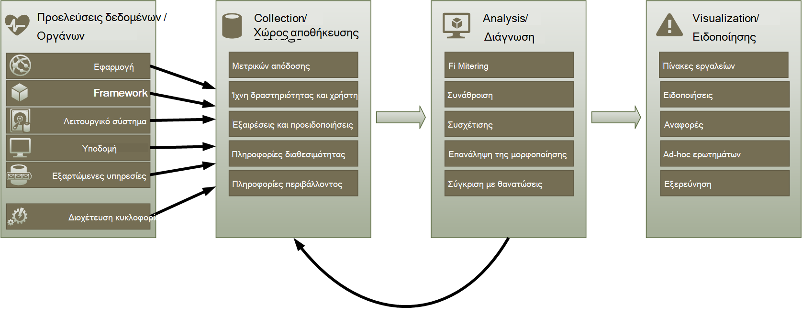
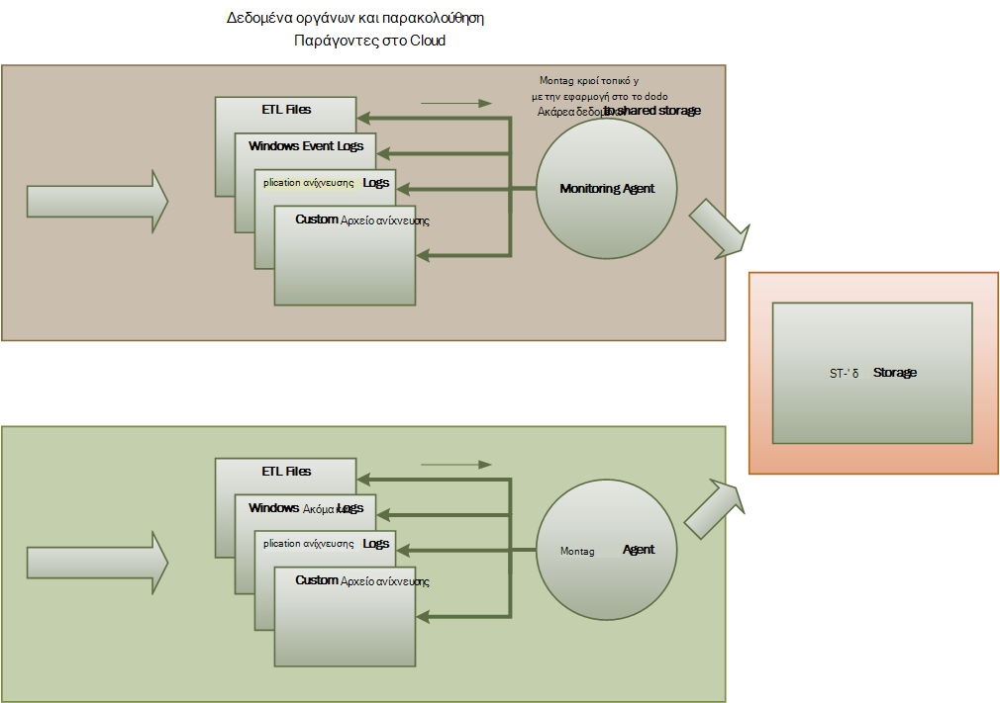
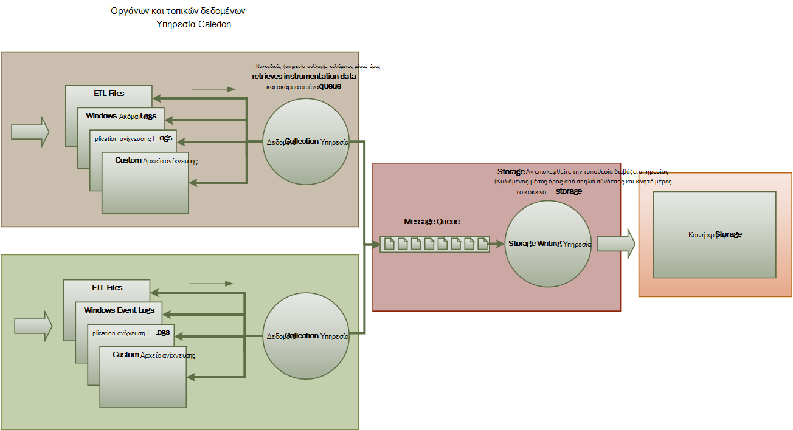
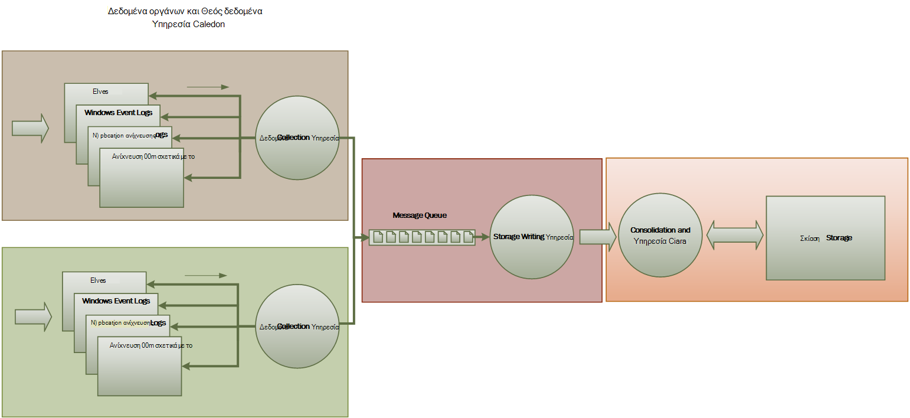

<properties
   pageTitle="Παρακολούθηση και τα Διαγνωστικά καθοδήγηση | Microsoft Azure"
   description="Βέλτιστες πρακτικές για την παρακολούθηση κατανεμημένες εφαρμογές στο cloud."
   services=""
   documentationCenter="na"
   authors="dragon119"
   manager="christb"
   editor=""
   tags=""/>

<tags
   ms.service="best-practice"
   ms.devlang="na"
   ms.topic="article"
   ms.tgt_pltfrm="na"
   ms.workload="na"
   ms.date="07/13/2016"
   ms.author="masashin"/>

# <a name="monitoring-and-diagnostics-guidance"></a>Καθοδήγηση παρακολούθησης και διαγνωστικών

[AZURE.INCLUDE [pnp-header](../includes/guidance-pnp-header-include.md)]

## <a name="overview"></a>Επισκόπηση
Κατανεμημένες εφαρμογές και υπηρεσίες που εκτελούνται στο cloud είναι, από τη φύση τους, σύνθετες τμήματα του λογισμικού που περιλαμβάνει πολλά μέρη μετακίνησης. Σε ένα περιβάλλον παραγωγής, είναι σημαντικό να έχετε τη δυνατότητα να παρακολουθήσετε τον τρόπο στην οποία οι χρήστες χρησιμοποιούν το σύστημα, χρήση των πόρων ανίχνευση και, γενικά παρακολουθεί την εύρυθμη λειτουργία και την απόδοση του συστήματος. Μπορείτε να χρησιμοποιήσετε αυτές τις πληροφορίες ως βοήθημα διαγνωστικών για τον εντοπισμό και διόρθωση προβλημάτων, και επίσης για να βοηθήσει σημείο πιθανά προβλήματα και να αποτρέψετε τους.

## <a name="monitoring-and-diagnostics-scenarios"></a>Σενάρια παρακολούθησης και διαγνωστικών
Μπορείτε να χρησιμοποιήσετε την παρακολούθηση για να αποκτήσετε μια πληροφορίες για πόσο καλά λειτουργεί ένα σύστημα. Παρακολούθηση είναι κρίσιμης σημασίας μέρος τη διατήρηση των προορισμών ποιότητα υπηρεσίας. Συνηθισμένα σενάρια για τη συλλογή δεδομένων παρακολούθησης περιλαμβάνουν τα εξής:

- Διασφάλιση ότι το σύστημα παραμένει σε καλή κατάσταση.
- Παρακολούθηση τη διαθεσιμότητα του συστήματος και τα στοιχεία του στοιχείου.
- Συντήρηση των επιδόσεων του για να βεβαιωθείτε ότι η απόδοση του συστήματος δεν υποβαθμίζονται απροσδόκητα ως ο όγκος εργασίας αυξάνεται.
- Διασφάλιση ότι το σύστημα πληροί τις συμφωνίες επιπέδου υπηρεσιών (SLA) έχει δημιουργηθεί με πελάτες.
- Προστασία των προσωπικών δεδομένων και ασφάλειας του συστήματος, οι χρήστες και τα δεδομένα τους.
- Παρακολούθηση τις λειτουργίες που εκτελούνται για σκοπούς ελέγχου ή ρυθμιστικές.
- Παρακολούθηση του καθημερινή χρήση του συστήματος και πώς να εντοπίζετε τις τάσεις που μπορεί να προκαλέσει προβλήματα εάν αυτές δεν είστε απαντήσει.
- Παρακολούθηση θεμάτων που προκύπτουν από αρχική αναφορά μέσω για ανάλυση πιθανές αιτίες, διόρθωσης, ενημερώσεις λογισμικού επακόλουθη και ανάπτυξη.
- Ανίχνευση λειτουργίες και τον εντοπισμό σφαλμάτων σε εκδόσεις λογισμικού.

> [AZURE.NOTE] Αυτή η λίστα δεν προορίζεται για να ολοκληρωμένη. Αυτό το έγγραφο εστιάζει σε αυτά τα σενάρια ως τις πιο συνηθισμένες καταστάσεις για την εκτέλεση παρακολούθησης. Ενδέχεται να υπάρχουν άλλα άτομα που είναι λιγότερο συχνές ή είναι ειδικές για το περιβάλλον σας.

Οι παρακάτω ενότητες περιγράφουν αυτά τα σενάρια με περισσότερες λεπτομέρειες. Οι πληροφορίες για κάθε σενάριο περιγράφονται με την εξής μορφή:

1. Μια σύντομη επισκόπηση του σεναρίου
2. Τις τυπικές απαιτήσεις της αυτό το σενάριο
3. Τα ανεπεξέργαστα οργάνων δεδομένα που είναι απαραίτητη για την υποστήριξη του σεναρίου και πιθανές πηγές από αυτές τις πληροφορίες
4. Πώς αυτό ανεπεξέργαστα δεδομένα μπορεί να αναλυθεί και να συνδυάζονται για τη δημιουργία χρήσιμων πληροφοριών διαγνωστικών

## <a name="health-monitoring"></a>Παρακολούθηση εύρυθμης λειτουργίας
Ένα σύστημα είναι σε καλή κατάσταση, εάν είναι εκτελείται και με δυνατότητα επεξεργασίας αιτήσεις. Ο σκοπός της εύρυθμης λειτουργίας παρακολούθησης είναι να δημιουργήσετε ένα στιγμιότυπο από την τρέχουσα εύρυθμη λειτουργία του συστήματος, ώστε να μπορείτε να επαληθεύσετε ότι όλα τα στοιχεία του συστήματος λειτουργούν όπως αναμένεται.

### <a name="requirements-for-health-monitoring"></a>Απαιτήσεις για παρακολούθηση εύρυθμης λειτουργίας
Θα πρέπει να λαμβάνετε ειδοποιήσεις τελεστή γρήγορα (μέσα σε λίγα δευτερόλεπτα) Εάν οποιοδήποτε τμήμα του συστήματος θεωρείται κατεστραμμένες. Τον τελεστή πρέπει να μπορείτε να διαπιστωθεί ποια τμήματα του συστήματος λειτουργούν κανονικά, και τα τμήματα αντιμετωπίζετε προβλήματα. Εύρυθμη λειτουργία συστήματος μπορούν να επισημανθούν μέσω ενός συστήματος light κίνηση:

- Κόκκινο για κατεστραμμένες (το σύστημα έχει διακοπεί)
- Κίτρινο για μερικώς σε καλή κατάσταση (το σύστημα λειτουργεί με μειωμένη λειτουργικότητα)
- Πράσινο για εντελώς σε καλή κατάσταση

Μια ολοκληρωμένη παρακολούθηση εύρυθμης λειτουργίας συστήματος επιτρέπει τελεστή για να κάνετε Διερεύνηση μέσω του συστήματος για να προβάλετε την κατάσταση εύρυθμης λειτουργίας υποσυστημάτων και των στοιχείων. Για παράδειγμα, εάν το συνολικό σύστημα απεικονίζεται ως μερικώς σε καλή κατάσταση, τον τελεστή πρέπει να μπορείτε να μεγεθύνετε και να προσδιορίσετε ποιες λειτουργίες που είναι διαθέσιμη αυτήν τη στιγμή.

### <a name="data-sources-instrumentation-and-data-collection-requirements"></a>Προελεύσεις δεδομένων, οργάνων και τις απαιτήσεις συλλογής δεδομένων
Τα ανεπεξέργαστα δεδομένα που είναι απαραίτητη για την υποστήριξη παρακολούθηση εύρυθμης λειτουργίας μπορεί να δημιουργηθεί ως αποτέλεσμα του:

- Παρακολούθηση εκτέλεσης των αιτήσεων χρήστη. Αυτές οι πληροφορίες μπορεί να χρησιμοποιηθεί για να προσδιορίσετε ποια αιτήσεις έχουν ολοκληρώθηκε με επιτυχία, που έχουν αποτύχει και χρονικό διάστημα που χρειάζεται κάθε αίτηση.
- Παρακολούθηση σύνθετων χρήστη. Αυτή η διαδικασία προσομοιώνει τα βήματα που εκτελούνται από το χρήστη και ακολουθεί μια προκαθορισμένη σειρά βημάτων. Θα πρέπει να καταγράφονται τα αποτελέσματα της κάθε βήμα.
- Εξαιρέσεις καταγραφής σφαλμάτων και προειδοποιήσεων. Αυτές οι πληροφορίες μπορούν να καταγραφούν ως αποτέλεσμα της ανίχνευσης δηλώσεις ενσωματωμένο στον κώδικα εφαρμογής, καθώς και με ανάκτηση των πληροφοριών από τα αρχεία καταγραφής συμβάντων των υπηρεσιών που αναφέρεται στο σύστημα.
- Παρακολούθηση της εύρυθμης λειτουργίας υπηρεσιών τρίτων κατασκευαστών που χρησιμοποιεί το σύστημα. Η παρακολούθηση ενδέχεται να απαιτεί την ανάκτηση και την ανάλυση δεδομένων εύρυθμης λειτουργίας που παρέχετε αυτές τις υπηρεσίες. Αυτές οι πληροφορίες ενδέχεται να χρειαστούν διάφορες μορφές αρχείων.
- Παρακολούθηση τελικού σημείου. Αυτός ο μηχανισμός περιγράφεται με περισσότερες λεπτομέρειες στην ενότητα "Διαθεσιμότητα παρακολούθησης".
- Συλλογή επιδόσεων του περιβάλλοντος πληροφοριών, όπως η χρήση της CPU φόντου ή δραστηριότητα εισόδου/εξόδου (συμπεριλαμβανομένου του δικτύου).

### <a name="analyzing-health-data"></a>Την ανάλυση δεδομένων εύρυθμης λειτουργίας
Εστίαση της εύρυθμης λειτουργίας παρακολούθησης είναι να υποδείξετε γρήγορα εάν εκτελείται το σύστημα. Συντόμευσης ανάλυση των δεδομένων άμεση μπορεί να ενεργοποιήσει μια ειδοποίηση, σε περίπτωση που ένα κρίσιμο στοιχείο εντοπιστεί ως κατεστραμμένες. (Αυτό δεν ανταποκρίνεται σε μια σειρά διαδοχικών ping που, για παράδειγμα.) Τον τελεστή, στη συνέχεια, μπορεί να διαρκέσει τις κατάλληλες διορθωτικές ενέργειες.

Μια πιο σύνθετη συστήματος ενδέχεται να περιλαμβάνουν ένα στοιχείο πρόβλεψης που εκτελεί μια ανάλυση ψυχρές μέσω πρόσφατες και τρέχουσες φόρτους εργασίας. Μια ανάλυση ψυχρές να εντοπίζετε τις τάσεις και να προσδιορίσετε αν το σύστημα είναι πιθανό να παραμένουν σε καλή κατάσταση ή αν το σύστημα θα χρειαστεί επιπλέον πόρους. Αυτό το στοιχείο πρόβλεψης πρέπει να βασίζεται σε μετρήσεις κρίσιμες επιδόσεων, όπως:

- Ο ρυθμός των αιτήσεων που απευθύνονται σε κάθε υπηρεσία ή υποσυστήματος.
- Οι χρόνοι απόκρισης αυτών των αιτήσεων.
- Η ένταση των δεδομένων ρέουν προς και από κάθε υπηρεσία.

Εάν η τιμή του οποιοδήποτε μετρικό υπερβαίνει ένα καθορισμένο όριο, το σύστημα να βελτιώσετε μια ειδοποίηση για να ενεργοποιήσετε έναν τελεστή ή autoscaling (εάν υπάρχει) για να εκτελέσετε την προληπτική ενέργειες είναι απαραίτητο για να διατηρήσετε εύρυθμης λειτουργίας του συστήματος. Αυτές οι ενέργειες ενδέχεται να περιλαμβάνουν την προσθήκη πόρων, επανεκκίνηση μίας ή περισσότερων υπηρεσιών που έχουν αποτυγχάνει ή εφαρμογή περιορισμού σε προσκλήσεις χαμηλότερης προτεραιότητας.

## <a name="availability-monitoring"></a>Παρακολούθηση διαθεσιμότητα
Ένα σύστημα πραγματικά σε καλή κατάσταση απαιτεί τα στοιχεία και υποσυστημάτων που συνθέτουν το σύστημα είναι διαθέσιμη. Παρακολούθηση διαθεσιμότητα σχετίζεται με παρακολούθηση εύρυθμης λειτουργίας. Αλλά ότι παρακολούθηση εύρυθμης λειτουργίας παρέχει μια άμεση προβολή την τρέχουσα εύρυθμη λειτουργία του συστήματος, παρακολούθηση διαθεσιμότητα αφορά την παρακολούθηση τη διαθεσιμότητα του συστήματος και τα στοιχεία για τη δημιουργία στατιστικά στοιχεία σχετικά με το χρόνο λειτουργίας του συστήματος.

Σε πολλά συστήματα, ορισμένα στοιχεία (όπως μια βάση δεδομένων) έχουν ρυθμιστεί με ενσωματωμένα πλεονασμού ώστε να επιτρέπει γρήγορη ανακατεύθυνση σε περίπτωση σφάλματος σοβαρές ή απώλεια σύνδεσης. Ιδανικά, οι χρήστες δεν πρέπει να γνωρίζουν ότι έχει παρουσιαστεί όπως αποτυχία. Αλλά από μια διαθεσιμότητα παρακολούθηση προοπτική, είναι απαραίτητο να συγκεντρώσετε ως δυνατόν περισσότερες πληροφορίες σχετικά με τέτοιες αποτυχίες για να προσδιορίσετε την αιτία και να λαμβάνουν διορθωτικές ενέργειες για να αποτρέψετε τη περιοδική.

Τα δεδομένα που είναι απαραίτητη για την παρακολούθηση διαθεσιμότητα ενδέχεται να εξαρτώνται από διάφορους παράγοντες κατώτερου επιπέδου. Πολλά από τους παρακάτω παράγοντες ενδέχεται να είναι συγκεκριμένες για την εφαρμογή του συστήματος και περιβάλλον. Ένα αποτελεσματικό σύστημα παρακολούθησης καταγράφει τα δεδομένα διαθεσιμότητας που αντιστοιχεί σε αυτούς τους παράγοντες χαμηλού επιπέδου και, στη συνέχεια, συγκεντρώνει να σας δώσει μια γενική εικόνα του συστήματος. Για παράδειγμα, σε ένα σύστημα ηλεκτρονικού εμπορίου, τη λειτουργικότητα επιχειρήσεις που επιτρέπει σε έναν πελάτη για να τοποθετήσετε τις παραγγελίες ενδέχεται να εξαρτώνται από το χώρο αποθήκευσης όπου είναι αποθηκευμένες οι λεπτομέρειες παραγγελίας και το σύστημα πληρωμής που χειρίζεται το χρηματικές συναλλαγές για την πληρωμή για αυτές τις εντολές. Η διαθεσιμότητα του τμήματος σειρά θέση του συστήματος, επομένως, είναι μια συνάρτηση της διαθεσιμότητας των το χώρο αποθήκευσης και του υποσυστήματος πληρωμής.

### <a name="requirements-for-availability-monitoring"></a>Απαιτήσεις για την παρακολούθηση διαθεσιμότητα
Έναν τελεστή πρέπει επίσης να μπορείτε να δείτε τη διαθεσιμότητα ιστορικού κάθε συστήματος και υποσυστήματος και να χρησιμοποιήσετε αυτές τις πληροφορίες για να εντοπίσετε τις τάσεις που ενδέχεται να προκαλέσει ένα ή περισσότερα υποσυστημάτων περιοδικά αποτυχία. (Υπηρεσίες ξεκινά αποτυχία μια συγκεκριμένη ώρα της ημέρας που αντιστοιχεί σε ώρες επεξεργασίας κορύφωσης;)

Λύση παρακολούθησης θα πρέπει να παρέχουν μια άμεση και ιστορικού προβολή της διαθεσιμότητας ή μη διαθεσιμότητα του κάθε υποσυστήματος. Θα πρέπει επίσης να μπορούν να προειδοποιεί γρήγορα έναν τελεστή όταν μία ή περισσότερες υπηρεσίες ΑΠΟΤΥΧΙΑ ή όταν οι χρήστες δεν μπορεί να συνδεθεί με τις υπηρεσίες. Αυτό είναι ένα θέμα όχι μόνο παρακολούθηση κάθε υπηρεσίας, αλλά επίσης εξετάζοντας τις ενέργειες που εκτελεί κάθε χρήστη εάν αυτές οι ενέργειες αποτύχει όταν προσπαθήσουν να επικοινωνήσετε με μια υπηρεσία. Σε κάποιο βαθμό, ένα βαθμό συνδεσιμότητας αποτυχία είναι κανονική και μπορεί να οφείλεται σε μεταβατικές σφάλματα. Αλλά μπορεί να είναι χρήσιμο για να επιτρέψετε στο σύστημα για να βελτιώσετε μια ειδοποίηση για τον αριθμό αποτυχιών συνδεσιμότητας σε μια καθορισμένη υποσυστήματος που προκύπτουν κατά τη διάρκεια μιας συγκεκριμένης περιόδου.

### <a name="data-sources-instrumentation-and-data-collection-requirements"></a>Προελεύσεις δεδομένων, οργάνων και τις απαιτήσεις συλλογής δεδομένων
Όπως με παρακολούθηση εύρυθμης λειτουργίας, μπορεί να δημιουργηθεί το ανεπεξέργαστα δεδομένα που είναι απαραίτητη για την υποστήριξη παρακολούθηση διαθεσιμότητα λόγω σύνθετων χρήστη παρακολούθηση και καταγραφή τυχόν εξαιρέσεις σφαλμάτων και προειδοποιήσεων που ενδέχεται να προκύψουν. Επιπλέον, μπορεί να ληφθεί διαθεσιμότητα δεδομένων από την εκτέλεση παρακολούθηση τελικού σημείου. Η εφαρμογή μπορεί να εκθέσει μία ή περισσότερες τελικά σημεία εύρυθμης λειτουργίας, κάθε δοκιμής πρόσβαση σε μια λειτουργική περιοχή εντός του συστήματος. Το σύστημα παρακολούθησης να ping κάθε τελικό σημείο, ακολουθώντας ένα καθορισμένο χρονοδιάγραμμα και να συλλέξετε τα αποτελέσματα (επιτυχίας ή αποτυχίας).

Πρέπει να καταγράφονται όλα χρονικών ορίων αποτυχίες συνδεσιμότητας δικτύου και οι προσπάθειες σύνδεσης. Όλα τα δεδομένα που θα πρέπει να χρονική σήμανση.

<a name="analyzing-availability-data"></a>
### <a name="analyzing-availability-data"></a>Την ανάλυση δεδομένων διαθεσιμότητας
Τα δεδομένα των οργάνων πρέπει να συναθροιστεί και συσχετισμένης για την υποστήριξη των παρακάτω τύπων ανάλυσης:

- Άμεση διαθεσιμότητα του συστήματος και υποσυστημάτων.
- Οι συντελεστές αποτυχία διαθεσιμότητα του συστήματος και υποσυστημάτων. Ιδανικά, πρέπει να μπορείτε να συσχετίζονται αποτυχίες με συγκεκριμένες δραστηριότητες έναν τελεστή: τι συμβαίνει όταν το σύστημα απέτυχε;
- Μια προβολή ιστορικού χρεώσεων αποτυχία του συστήματος ή οποιαδήποτε υποσυστημάτων σε οποιαδήποτε καθορίζεται η περίοδος και η φόρτωση στο σύστημα (αριθμός των αιτήσεων χρήστη, για παράδειγμα) όταν προκύψει σφάλμα.
- Τους λόγους για μη διαθεσιμότητα του συστήματος ή οποιαδήποτε υποσυστημάτων. Για παράδειγμα, οι λόγοι μπορεί να είναι η υπηρεσία δεν εκτελείται, συνδεσιμότητας χαθεί, συνδεδεμένες αλλά λήξει το χρονικό όριο και συνδεδεμένοι, αλλά επιστροφής σφάλματα.

Μπορείτε να υπολογίσετε το ποσοστό διαθεσιμότητα μιας υπηρεσίας σε μια χρονική περίοδο, χρησιμοποιώντας τον παρακάτω τύπο:

```
%Availability =  ((Total Time – Total Downtime) / Total Time ) * 100
```

Αυτό είναι χρήσιμο για σκοπούς SLA. ([SLA παρακολούθηση](#SLA-monitoring) περιγράφεται με περισσότερες λεπτομέρειες αργότερα σε αυτές τις οδηγίες.) Ο ορισμός του _χρόνου εκτός λειτουργίας_ εξαρτάται από την υπηρεσία. Για παράδειγμα, Visual Studio ομάδας υπηρεσίες Δόμηση Service ορίζει χρόνου εκτός λειτουργίας της περιόδου (συνολικό αθροιστικό λεπτά) κατά την οποία δημιουργείτε υπηρεσία δεν είναι διαθέσιμη. Ένα λεπτό θεωρείται ότι είναι διαθέσιμη εάν όλα συνεχής αιτήσεις HTTP, για να δημιουργήσετε υπηρεσία για την εκτέλεση λειτουργιών που ξεκινούν από πελάτη σε όλο το λεπτό ως αποτέλεσμα έναν κωδικό σφάλματος είτε δεν επιστρέφουν μια απάντηση.

## <a name="performance-monitoring"></a>Παρακολούθηση των επιδόσεων
Καθώς το σύστημα τοποθετείται σε περισσότερες και περισσότερες φόρτο (αυξάνοντας τον όγκο των χρηστών), το μέγεθος του τα σύνολα δεδομένων που αναπτύσσεται αυτές τις στους χρήστες πρόσβαση και την πιθανότητα των αποτυχία από ένα ή περισσότερα στοιχεία γίνεται πιο πιθανό. Συχνά, αποτυχία στοιχείου προηγείται μείωση των επιδόσεων. Εάν είστε σε θέση να εντοπίσει μείωση, μπορείτε να λάβετε προληπτικά βήματα για την αντιμετώπιση της κατάστασης.

Απόδοση του συστήματος εξαρτάται από διάφορους παράγοντες. Κάθε παραγόντων μετράται συνήθως μέσω βασικοί δείκτες απόδοσης (KPI), όπως τον αριθμό των συναλλαγές της βάσης δεδομένων ανά δευτερόλεπτο ή τον όγκο των αιτήσεων δικτύου που είναι επιτυχής τεχνική υποστήριξη σε ένα συγκεκριμένο χρονικό διάστημα. Ορισμένες από αυτές τις KPI ενδέχεται να είναι διαθέσιμες ως μετρήσεις επιδόσεων που αφορούν συγκεκριμένα το, ενώ άλλοι ενδέχεται να προκύψουν από έναν συνδυασμό των μετρήσεων.

> [AZURE.NOTE] Καθορισμός κακή ή καλές επιδόσεις απαιτεί να κατανοήσετε το επίπεδο επιδόσεων στην οποία θα πρέπει να είναι δυνατότητα χρήσης του συστήματος. Απαιτείται παρακολούθηση του συστήματος ενώ λειτουργεί με τον συνηθισμένο φόρτο και καταγραφή τα δεδομένα για κάθε δείκτη KPI σε μια χρονική περίοδο. Αυτό μπορεί να περιλαμβάνει εκτελεί το σύστημα φόρτος προσομοιωμένη σε περιβάλλον δοκιμής και συγκεντρώνοντας τα κατάλληλα δεδομένα πριν από την ανάπτυξη του συστήματος σε ένα περιβάλλον παραγωγής.

> Επίσης, θα πρέπει να βεβαιωθείτε ότι η παρακολούθηση για σκοπούς επιδόσεις δεν γίνεται βάρος του συστήματος. Μπορείτε ίσως να προσαρμόσετε δυναμικά το επίπεδο λεπτομερειών για τα δεδομένα τα οποία συγκεντρώνει τη διεργασία εποπτείας επιδόσεων.

### <a name="requirements-for-performance-monitoring"></a>Απαιτήσεις για την παρακολούθηση των επιδόσεων
Για να εξετάσετε τις επιδόσεις του συστήματος, έναν τελεστή πρέπει συνήθως να δει τις πληροφορίες που περιλαμβάνει:

- Οι συντελεστές απόκρισης για αιτήσεις χρήστη.
- Ο αριθμός των αιτήσεων ταυτόχρονες χρήστη.
- Η ένταση του κίνηση του δικτύου.
- Οι συντελεστές στο οποίο business που ολοκληρώνονται συναλλαγές.
- Ο μέσος χρόνος επεξεργασίας για αιτήσεις.

Μπορεί να είναι χρήσιμες για την παροχή εργαλεία που σας επιτρέπουν έναν τελεστή για την σημείο συσχετίσεων, όπως:

- Ο αριθμός των χρηστών ταυτόχρονες έναντι της αίτησης λανθάνων χρόνος ώρες (πόσος χρόνος χρειάζεται για να ξεκινήσετε την επεξεργασία μιας αίτησης αφού ο χρήστης έχει το έστειλε).
- Ο αριθμός των χρηστών ταυτόχρονες έναντι του μέσος χρόνος απόκρισης (πόσος χρόνος χρειάζεται για να ολοκληρώσετε μια αίτηση αφού έχει ξεκινήσει επεξεργασία).
- Η ένταση των αιτήσεων και ο αριθμός των σφαλμάτων επεξεργασίας.

Μαζί με αυτό υψηλού επιπέδου λειτουργική πληροφορίες, πρέπει να μπορούν να λαμβάνουν μια λεπτομερή προβολή της απόδοσης για κάθε στοιχείο στο σύστημα του τελεστή. Αυτά τα δεδομένα συνήθως παρέχεται μέσω μετρητών επιδόσεων χαμηλού επιπέδου που παρακολουθείτε πληροφορίες όπως:

- Χρήση μνήμης.
- Αριθμός νήματα.
- Χρόνος επεξεργασίας CPU.
- Μήκος ουράς αιτήσεων.
- Χρεώσεις εισόδου/εξόδου δίσκου ή δικτύου και σφάλματα.
- Αριθμός των byte που έχουν εγγραφεί ή να διαβάσουν.
- Ενδιάμεσο δείκτες, όπως το μήκος ουράς.

Όλες τις απεικονίσεις θα πρέπει να επιτρέπουν έναν τελεστή για να καθορίσετε μια χρονική περίοδο. Τα εμφανιζόμενα δεδομένα μπορεί να είναι ένα στιγμιότυπο της τρέχουσας κατάστασης ή/και του ιστορικού προβολής των επιδόσεων.

Έναν τελεστή πρέπει να μπορείτε να βελτιώσετε μια ειδοποίηση που βασίζονται σε οποιαδήποτε μέτρηση επιδόσεων για οποιαδήποτε καθορισμένη τιμή κατά τη διάρκεια κάθε καθορισμένο χρονικό διάστημα.

### <a name="data-sources-instrumentation-and-data-collection-requirements"></a>Προελεύσεις δεδομένων, οργάνων και τις απαιτήσεις συλλογής δεδομένων
Μπορείτε να συγκεντρώσετε δεδομένα επιδόσεων υψηλού επιπέδου (μετάδοσης, αριθμό ταυτόχρονες χρηστών, τον αριθμό των επιχειρηματικές συναλλαγές, χρεώσεις σφάλματος και ούτω καθεξής) με την παρακολούθηση της προόδου των αιτήσεων των χρηστών, όπως παραδίδεται και μεταβιβάζουν μέσω του συστήματος. Αυτό περιλαμβάνει την ενσωμάτωση δηλώσεις ανίχνευση σε βασικά σημεία τον κώδικα της εφαρμογής, μαζί με το χρονισμό πληροφορίες. Όλα τα σφάλματα, εξαιρέσεις και προειδοποιήσεις θα πρέπει να καταγράφονται επαρκή δεδομένα για τους αντιστοιχίας με τις αιτήσεις που προκάλεσαν τους. Το αρχείο καταγραφής Internet Information Services (IIS) είναι μια άλλη προέλευση χρήσιμες.

Εάν είναι δυνατόν, θα πρέπει να μπορείτε να καταγράψετε επίσης τα δεδομένα επιδόσεων για οποιαδήποτε εξωτερικά συστήματα που χρησιμοποιεί η εφαρμογή. Αυτά τα εξωτερικά συστήματα ενδέχεται να παρέχετε τις δικές τους μετρητές επιδόσεων ή άλλες δυνατότητες για την αίτηση δεδομένων για τις επιδόσεις. Εάν αυτό δεν είναι δυνατό, εγγραφή πληροφορίες όπως την ώρα έναρξης και ώρα λήξης της κάθε αίτηση που έγιναν σε ένα εξωτερικό σύστημα, μαζί με την κατάσταση (επιτυχίας, αποτυχίας ή προειδοποίηση) της λειτουργίας. Για παράδειγμα, μπορείτε να χρησιμοποιήσετε μια προσέγγιση χρονόμετρου για αιτήσεις χρόνου: Έναρξη χρονομέτρου κατά την εκκίνηση της αίτησης και, στη συνέχεια, να διακόψετε το χρονόμετρο όταν ολοκληρωθεί η αίτηση.

Δεδομένα επιδόσεων χαμηλού επιπέδου για τα μεμονωμένα στοιχεία σε ένα σύστημα μπορεί να είναι διαθέσιμα στις δυνατότητες και τις υπηρεσίες, όπως μετρητών επιδόσεων των Windows και τα Διαγνωστικά Azure.

### <a name="analyzing-performance-data"></a>Ανάλυση δεδομένων επιδόσεων
Μεγαλύτερο μέρος της ανάλυσης εργασίας αποτελείται από συνάθροιση δεδομένων επιδόσεων κατά τύπο αίτησης χρήστη ή/και του υποσυστήματος ή της υπηρεσίας στην οποία αποστέλλονται κάθε αίτηση. Ένα παράδειγμα μιας αίτησης του χρήστη είναι Προσθήκη ενός στοιχείου σε ένα καλάθι ή εκτέλεση της διαδικασίας ανάληψης ελέγχου σε ένα σύστημα ηλεκτρονικού εμπορίου.

Μια άλλη συνηθισμένη απαίτηση σύνοψη δεδομένων επιδόσεων σε επιλεγμένο εκατοστημόριου. Για παράδειγμα, έναν τελεστή ενδέχεται να καθορίσετε τις ώρες απόκρισης για 99 τοις εκατό των αιτήσεων, 95 τοις εκατό των αιτήσεων και 70 τοις εκατό των αιτήσεων. Ενδέχεται να υπάρχουν προορισμών SLA ή ορίστε άλλες στόχους για κάθε εκατοστημόριο. Τα αποτελέσματα σε εξέλιξη θα πρέπει να αναφέρεται σε άμεσο πραγματικό χρόνο για τον εντοπισμό άμεση θέματα. Τα αποτελέσματα θα πρέπει επίσης να Συγκεντρωτικό πάνω από το περισσότερο χρόνο για σκοπούς στατιστικής.

Στην περίπτωση λανθάνων χρόνος προβλήματα να επηρεάσει την απόδοση, με τελεστή πρέπει να μπορείτε να εντοπίσετε γρήγορα την αιτία της το συμφόρηση εξετάζοντας η αδράνεια των κάθε βήμα που εκτελεί κάθε αίτηση. Τα δεδομένα επιδόσεων, επομένως, πρέπει να παρέχει ένα μέσο αντιστοιχίας μετρήσεις επιδόσεων για κάθε βήμα για να συνδέσετε τους σε μια συγκεκριμένη αίτηση.

Ανάλογα με τις απαιτήσεις απεικόνισης, ίσως είναι χρήσιμο να δημιουργήσετε και να αποθηκεύσετε έναν κύβο δεδομένων που περιέχει προβολές τα ανεπεξέργαστα δεδομένα. Αυτόν τον κύβο δεδομένων να επιτρέψετε σύνθετες ad hoc ερωτημάτων και ανάλυση των πληροφοριών επιδόσεων.

## <a name="security-monitoring"></a>Παρακολούθηση ασφαλείας
Όλα τα συστήματα εμπορική που περιλαμβάνουν ευαίσθητα δεδομένα πρέπει να υλοποιήσει μια δομή ασφαλείας. Την πολυπλοκότητα του μηχανισμού ασφαλείας είναι συνήθως μια συνάρτηση της την ευαισθησία των δεδομένων. Σε ένα σύστημα που απαιτείται από τους χρήστες να γίνει έλεγχος ταυτότητας, θα πρέπει να καταγράφετε:

- Όλες τις προσπάθειες εισόδου, εάν αποτύχει ή ολοκληρωθεί με επιτυχία.
- Όλες οι λειτουργίες που εκτελούνται από--και τις λεπτομέρειες της όλους τους πόρους που είναι προσβάσιμη από--ένα χρήστη με έλεγχο ταυτότητας.
- Όταν ένας χρήστης τελειώνει μια περίοδο λειτουργίας και πραγματοποιεί.

Παρακολούθηση ίσως για τον εντοπισμό επιθέσεις στο σύστημα. Για παράδειγμα, μεγάλο αριθμό αποτυχημένων προσπαθειών εισόδου μπορεί να υποδεικνύουν μια επίθεση βίαιες ενέργειες ισχύ. Ένα μη αναμενόμενο αύξησης της αιτήσεις μπορεί να είναι το αποτέλεσμα της μια κατανεμημένη επίθεση άρνησης υπηρεσίας (DDoS). Πρέπει να προετοιμαστείτε για την παρακολούθηση της όλες τις αιτήσεις για όλους τους πόρους, ανεξάρτητα από την προέλευση αυτών των αιτήσεων. Ένα σύστημα που έχει μια ευπάθεια είσοδος κατά λάθος ενδέχεται να εκθέσει πόρους στον εξωτερικό κόσμο χωρίς να απαιτείται χρήστη για να εισέλθετε στην πραγματικότητα.

### <a name="requirements-for-security-monitoring"></a>Απαιτήσεις για παρακολούθηση ασφαλείας
Το πιο σημαντικές πτυχές της Παρακολούθηση ασφαλείας θα πρέπει να ενεργοποιήσετε γρήγορα έναν τελεστή για να:

- Εντοπισμός Επιχειρήθηκε παραβιάσεις από μια οντότητα χωρίς έλεγχο ταυτότητας.
- Προσδιορισμός προσπάθειες από οντοτήτων για την εκτέλεση λειτουργιών σε δεδομένα για τα οποία τους δεν έχουν εκχωρηθεί πρόσβαση.
- Καθορισμός του συστήματος ή ένα τμήμα του συστήματος, στην περιοχή επίθεση από εκτός ή εντός. (Για παράδειγμα, κακόβουλο χρήστη με έλεγχο ταυτότητας μπορεί να προσπαθείτε να μεταφέρετε το σύστημα προς τα κάτω.)

Για να υποστηρίζουν αυτές τις απαιτήσεις, θα πρέπει να ειδοποιηθεί έναν τελεστή:

- Εάν ένα λογαριασμό καθιστά επαναλαμβανόμενους απέτυχε η είσοδος προσπάθειες μέσα σε μια συγκεκριμένη χρονική περίοδο.
- Εάν ένα λογαριασμό με έλεγχο ταυτότητας επανειλημμένα προσπαθεί να αποκτήσει πρόσβαση απαγορευμένη πόρου σε μια καθορισμένη περίοδο.
- Εάν ένα μεγάλο αριθμό χωρίς έλεγχο ταυτότητας ή μη εξουσιοδοτημένη αιτήσεις προκύπτουν κατά τη διάρκεια σε συγκεκριμένη χρονική περίοδο.

Οι πληροφορίες που παρέχεται σε έναν τελεστή πρέπει να συμπεριλάβετε τη διεύθυνση κεντρικού υπολογιστή του αρχείου προέλευσης για κάθε αίτηση. Εάν προκύψουν τακτικά παραβιάσεις ασφαλείας από μια συγκεκριμένη περιοχή διευθύνσεων, μπορεί να έχει αποκλειστεί αυτούς τους κεντρικούς υπολογιστές.

Ένα βασικό μέρος τη διατήρηση της ασφάλειας ενός συστήματος τη δυνατότητα για να εντοπίσετε γρήγορα ενέργειες που αποκλίνει από τη συνήθη μοτίβο. Πληροφορίες, όπως ο αριθμός των αποτυχημένων ή/και επιτυχής αιτήσεις εισόδου μπορεί να εμφανίζεται οπτικά για τον εντοπισμό εάν υπάρχει μια Συλλέκτη στη δραστηριότητα μια στιγμή ασυνήθιστο. (Παράδειγμα αυτήν τη δραστηριότητα είναι χρήστες είσοδο στη διεύθυνση 3:00 πμ και της εκτέλεσης λειτουργιών μεγάλου αριθμού κατά την εκκίνηση του τους εργάσιμη ημέρα στις 9:00 πμ). Αυτές οι πληροφορίες μπορεί να χρησιμοποιηθεί επίσης για να ρυθμίσετε τις παραμέτρους autoscaling βάσει χρόνου. Για παράδειγμα, εάν τελεστή τηρεί που μεγάλου αριθμού χρηστών τακτικά Πραγματοποιήστε είσοδο μια συγκεκριμένη ώρα της ημέρας, τον τελεστή μπορούν να τακτοποιήσουν για να ξεκινήσετε υπηρεσίες επιπλέον ελέγχου ταυτότητας για να χειρισμού του όγκου εργασίας και, στη συνέχεια, τερματίζονται αυτές τις πρόσθετες υπηρεσίες, όταν έχει παρέλθει κορυφής.

### <a name="data-sources-instrumentation-and-data-collection-requirements"></a>Προελεύσεις δεδομένων, οργάνων και τις απαιτήσεις συλλογής δεδομένων
Ασφαλείας είναι πτυχή περιλαμβάνουν όλων των πιο κατανεμημένων συστημάτων. Τα κατάλληλα δεδομένα είναι πιθανό να δημιουργηθούν σε πολλά σημεία σε όλο το σύστημα. Πρέπει να λάβετε υπόψη έγκριση μια προσέγγιση πληροφορίες ασφαλείας και διαχείρισης συμβάντων (SIEM) για να συγκεντρώσετε τις πληροφορίες που σχετίζονται με την ασφάλεια που προκύπτει από συμβάντα που προκύπτουν από την εφαρμογή, εξοπλισμού δικτύου, διακομιστές, τείχη προστασίας, λογισμικό προστασίας από ιούς και άλλα στοιχεία αποτροπής προεξοχή.

Παρακολούθηση ασφαλείας μπορούν να ενσωμάτωση δεδομένων από τα εργαλεία που δεν αποτελούν μέρος της εφαρμογής σας. Αυτά τα εργαλεία μπορούν να περιλαμβάνουν βοηθητικά προγράμματα που προσδιορίζουν ανίχνευση θυρών δραστηριότητες, εξωτερικές υπηρεσίες ή φίλτρα δικτύου που εντοπίζουν προσπάθειες για να αποκτήσετε πρόσβαση χωρίς έλεγχο ταυτότητας για την εφαρμογή και δεδομένων.

Σε όλες τις περιπτώσεις, τα δεδομένα που συλλέγονται πρέπει να ενεργοποιήσετε ένα διαχειριστή για να προσδιορίσει τη φύση των τυχόν επιθέσεις και να λαμβάνουν τα κατάλληλα μέτρα.

### <a name="analyzing-security-data"></a>Την ανάλυση δεδομένων ασφαλείας
Μια δυνατότητα της παρακολούθησης ασφαλείας είναι το ποικιλία προελεύσεων, από την οποία προκύπτει τα δεδομένα. Το επίπεδο λεπτομερειών και διαφορετικές μορφές συχνά απαιτούν σύνθετη ανάλυση των δεδομένων τραβήξατε για να συνδέσετε μαζί σε ένα νήμα συνεκτική των πληροφοριών. Εκτός από το πιο απλός υποθέσεων (όπως εντοπισμός μεγάλου αριθμού αποτυχίας εισόδου πρόσθετα ή επανειλημμένες προσπάθειες για να αποκτήσει μη εξουσιοδοτημένη πρόσβαση σε πόρους κρίσιμες), μπορεί να μην είναι δυνατό να εκτελέσετε οποιαδήποτε σύνθετες αυτοματοποιημένης επεξεργασίας δεδομένων ασφαλείας. Αντί για αυτό, ίσως είναι προτιμότερο να γράψετε αυτά τα δεδομένα, χρονική σήμανση αλλά διαφορετικά στην αρχική του μορφή, σε ένα ασφαλές αποθετήριο δεδομένων για να επιτρέψετε για expert μη αυτόματη ανάλυσης.

<a name="SLA-monitoring"></a>

## <a name="sla-monitoring"></a>Παρακολούθηση SLA
Πολλά εμπορική συστήματα που υποστηρίζουν πελάτες που πληρώνουν εγγύηση σχετικά με τις επιδόσεις του συστήματος με τη μορφή SLA. Ουσιαστικά, SLA αναφέρει ότι το σύστημα μπορεί να χειριστεί καθορισμένος όγκος εργασίας μέσα σε ένα χρονικό πλαίσιο αποδεκτής και χωρίς να χάσετε σημαντικές πληροφορίες. Παρακολούθηση SLA αφορά την εξασφάλιση ότι το σύστημα μπορεί να ανταποκρίνονται μετρήσιμων SLA.

> [AZURE.NOTE] Παρακολούθηση SLA σχετίζεται με παρακολούθηση των επιδόσεων. Αλλά ότι Εποπτεία επιδόσεων με εξασφαλίζει ότι το σύστημα συναρτήσεις _βέλτιστη_, παρακολούθηση SLA διέπεται από μια συμβατικές υποχρέωση που καθορίζει ποιες _βέλτιστη_ σημαίνει στην πραγματικότητα.

SLA ορίζονται συχνά όσον αφορά:

- Συνολική διαθεσιμότητα συστήματος. Για παράδειγμα, μια εταιρεία μπορεί να εξασφαλίσετε ότι το σύστημα θα είναι διαθέσιμο για το ποσοστό 99,9 του χρόνου. Αυτό ισούται με λιγότερα από 9 ώρες ανά έτος ή περίπου 10 λεπτά εβδομάδα του χρόνου εκτός λειτουργίας.
- Λειτουργικές μεταγωγή. Αυτό αναλογίες συχνά εκφράζεται ως μία ή περισσότερες υψηλής – νερό σημάδια, όπως ότι το σύστημα να υποστηρίζει έως 100.000 χρήστη ταυτόχρονες αιτήσεις ή χειρισμού 10.000 ταυτόχρονες επιχειρηματικές συναλλαγές.
- Χρόνος απόκρισης λειτουργικές. Το σύστημα ενδέχεται να επίσης εγγύηση για το συντελεστή κατά την επεξεργασία αιτήσεων. Ένα παράδειγμα είναι ότι ποσοστό 99 από όλες τις συναλλαγές επιχειρήσεις θα ολοκληρωθεί μέσα σε 2 δευτερόλεπτα και δεν υπάρχει μία συναλλαγή θα διαρκέσει περισσότερο από 10 δευτερόλεπτα.

> [AZURE.NOTE] Ορισμένες συμβάσεις για εμπορική συστήματα ενδέχεται να περιλαμβάνουν SLA για την υποστήριξη πελατών. Ένα παράδειγμα είναι ότι όλες οι αιτήσεις υπηρεσία Βοήθειας θα προκαλούν απόκριση σε 5 λεπτά και ότι ποσοστό 99 όλα τα προβλήματα θα αποσταλεί πλήρως εντός 1 εργάσιμης ημέρας. Αποτελεσματική [Παρακολούθηση θεμάτων](#issue-tracking) (που περιγράφεται αργότερα σε αυτήν την ενότητα) είναι κλειδί για την ικανοποίηση SLA όπως οι εξής.

### <a name="requirements-for-sla-monitoring"></a>Απαιτήσεις για την παρακολούθηση SLA
Στο υψηλότερο επίπεδο, έναν τελεστή πρέπει να μπορείτε να δείτε με μια ματιά εάν το σύστημα είναι σύσκεψης τη συμφωνία SLA ή όχι. Και εάν όχι, πρέπει να μπορείτε να κάνετε γενίκευση τον τελεστή προς τα κάτω και να εξετάσετε τα υποκείμενα παράγοντες για να καθορίσετε τους λόγους για των επιδόσεων.

Τυπικές υψηλού επιπέδου δείκτες που μπορεί να παρουσιάζεται οπτικά περιλαμβάνουν τα εξής:

- Το ποσοστό της χρόνος λειτουργίας της υπηρεσίας.
- Η εφαρμογή μετάδοσης (υπολογίζεται όσον αφορά την επιτυχή συναλλαγές ή/και λειτουργίες ανά δευτερόλεπτο).
- Ο αριθμός των αιτήσεων εφαρμογή που επιτυχής/αποτυγχάνει.
- Ο αριθμός των εφαρμογών και του συστήματος σφάλματα, εξαιρέσεις και προειδοποιήσεων.

Όλες αυτές τις ενδείξεις πρέπει να είναι σε θέση να φιλτράρονται από ένα καθορισμένο χρονικό διάστημα.

Μια εφαρμογή cloud πιθανώς θα περιλαμβάνουν έναν αριθμό υποσυστημάτων και των στοιχείων. Έναν τελεστή πρέπει να μπορείτε να επιλέξετε μια ένδειξη υψηλού επιπέδου και να δείτε πώς αποτελείται από την εύρυθμη λειτουργία των υποκείμενων στοιχείων. Για παράδειγμα, αν η του χρόνου διαθεσιμότητας του συνολικού συστήματος βρίσκεται κάτω από μια αποδεκτή τιμή, έναν τελεστή πρέπει να μπορείτε να μεγεθύνετε και να καθορίσετε ποια στοιχεία συνεισφέρουν σε αυτό το σφάλμα.

> [AZURE.NOTE] Χρόνος λειτουργίας του συστήματος πρέπει να οριστούν προσεκτικά. Σε ένα σύστημα που χρησιμοποιεί πλεονασμού για να βεβαιωθείτε ότι το μέγιστο διαθεσιμότητα, μπορεί να αποτύχει ξεχωριστές παρουσίες των στοιχείων, αλλά το σύστημα μπορεί να παραμείνει λειτουργική. Χρόνος λειτουργίας του συστήματος κατά την παρουσίαση από παρακολούθηση εύρυθμης λειτουργίας θα πρέπει να υποδείξετε τη συγκέντρωση συνεχούς κάθε στοιχείο και όχι απαραίτητα εάν έχει στην πραγματικότητα διακοπούν του συστήματος. Επιπλέον, μπορεί να είναι απομόνωσης αποτυχίες. Επομένως, ακόμα και αν δεν είναι διαθέσιμη από το συγκεκριμένο σύστημα, το υπόλοιπο του συστήματος μπορεί να παραμένουν διαθέσιμα, παρόλο που με μειωμένη λειτουργικότητα. (Σε ένα σύστημα ηλεκτρονικού εμπορίου, αποτυχία στο σύστημα ενδέχεται να εμποδίζουν το πελάτη τοποθετώντας παραγγελίες, αλλά ο πελάτης μπορεί να έχετε τη δυνατότητα να μεταβείτε στον κατάλογο προϊόντων.)

Για να ειδοποιεί σκοπούς, το σύστημα πρέπει να μπορείτε να ενεργοποιήσετε ένα συμβάν, εάν οποιαδήποτε από τις ενδείξεις υψηλού επιπέδου υπερβαίνει ένα συγκεκριμένο όριο. Τις λεπτομέρειες επιπέδου κάτω από τους διάφορους παράγοντες που συνθέτουν τη λήξη της ένδειξης υψηλού επιπέδου πρέπει να είναι διαθέσιμα ως δεδομένα με βάση τα συμφραζόμενα στο σύστημα προειδοποίησης.

### <a name="data-sources-instrumentation-and-data-collection-requirements"></a>Προελεύσεις δεδομένων, οργάνων και τις απαιτήσεις συλλογής δεδομένων
Τα ανεπεξέργαστα δεδομένα που είναι απαραίτητη για την υποστήριξη SLA παρακολούθηση είναι παρόμοια με τα ανεπεξέργαστα δεδομένα που είναι απαραίτητη για την Εποπτεία επιδόσεων, μαζί με ορισμένα στοιχεία της εύρυθμης λειτουργίας και διαθεσιμότητα παρακολούθησης. (Δείτε αυτές τις ενότητες για περισσότερες λεπτομέρειες.) Μπορείτε να καταγράψετε αυτών των δεδομένων από:

- Εκτέλεση παρακολούθηση τελικού σημείου.
- Εξαιρέσεις καταγραφής σφαλμάτων και προειδοποιήσεων.
- Παρακολούθηση της εκτέλεσης των αιτήσεων χρήστη.
- Παρακολούθηση τη διαθεσιμότητα υπηρεσιών τρίτων κατασκευαστών που χρησιμοποιεί το σύστημα.
- Χρήση μετρικών απόδοσης και μετρητές.

Όλα τα δεδομένα πρέπει να είναι το χρονικό όριο και χρονική σήμανση.

### <a name="analyzing-sla-data"></a>Την ανάλυση δεδομένων SLA
Τα δεδομένα των οργάνων πρέπει να είναι συναθροιστεί για να δημιουργήσετε μια εικόνα από τη συνολική απόδοση του συστήματος. Συγκεντρωτικά δεδομένα πρέπει επίσης να υποστηρίζει Διερεύνηση για να ενεργοποιήσετε την εξέταση των επιδόσεων των υποκείμενων υποσυστημάτων. Για παράδειγμα, θα πρέπει να μπορείτε να:

- Υπολογισμός τον συνολικό αριθμό των αιτήσεων χρήστη σε μια καθορισμένη περίοδο και να καθορίσετε το συντελεστή επιτυχίας και αποτυχίας αυτών των αιτήσεων.
- Συνδυάστε τις ώρες απόκρισης των αιτήσεων χρήστη για να δημιουργήσετε μια συνολική προβολή χρόνους απόκρισης συστήματος.
- Ανάλυση της προόδου των αιτήσεων χρήστη για να αναλύσετε το χρόνο απόκρισης συνολική μιας αίτησης σε τις χρονικές περιόδους απόκριση τα μεμονωμένα στοιχεία εργασίας της αίτησης.  
- Για να προσδιορίσετε τη συνολική διαθεσιμότητα του συστήματος ως ποσοστό του χρόνου διαθεσιμότητας για οποιαδήποτε συγκεκριμένη χρονική περίοδο.
- Ανάλυση τη διαθεσιμότητα χρόνου ποσοστό των μεμονωμένων στοιχείων και των υπηρεσιών του συστήματος. Αυτό μπορεί να περιλαμβάνει την ανάλυση των αρχείων καταγραφής που έχουν δημιουργηθεί υπηρεσιών τρίτων.

Πολλά συστήματα εμπορική απαιτείται αναφορά πραγματικό επιδόσεων ποσά σε σχέση με αποδεκτής SLA για καθορισμένη περίοδο, συνήθως σε μήνες. Αυτές οι πληροφορίες μπορεί να χρησιμοποιηθεί για τον υπολογισμό πιστώσεων ή άλλες μορφές επιστροφές για τους πελάτες σας Εάν δεν πληρούνται τα SLA κατά τη διάρκεια αυτής της περιόδου. Μπορείτε να υπολογίσετε διαθεσιμότητας για μια υπηρεσία, χρησιμοποιώντας την τεχνική που περιγράφεται στην ενότητα [δεδομένα διαθεσιμότητας ανάλυση δεδομένων](#analyzing-availability-data).

Για εσωτερικές σκοπούς, μια εταιρεία μπορεί να παρακολούθηση επίσης το αριθμό και τη φύση των συμβάντων που προκάλεσαν υπηρεσίες αποτυχία. Μάθετε πώς να επιλύσετε αυτά τα θέματα γρήγορα ή να καταργήσει πλήρως, θα σας βοηθήσει να μειώσετε χρόνου εκτός λειτουργίας και να ανταποκρίνεται SLA.

## <a name="auditing"></a>Έλεγχος
Ανάλογα με τη φύση της εφαρμογής, ενδέχεται να υπάρχουν νόμου ή άλλη νομική κανονισμούς που καθορίζουν απαιτήσεις για τον έλεγχο των χρηστών λειτουργίες και καταγραφή όλων πρόσβαση σε δεδομένα. Έλεγχος μπορεί να αποδείξει ότι οι πελάτες συνδέσεις με συγκεκριμένες αιτήσεις. Χωρίς αποκήρυξη ταυτότητας είναι σημαντικό παράγοντα σε πολλά συστήματα e-business για να διατηρήσετε αξιοπιστίας είναι μεταξύ ενός πελάτη και την εταιρεία που είναι υπεύθυνος για την εφαρμογή ή υπηρεσία.

### <a name="requirements-for-auditing"></a>Απαιτήσεις για τον έλεγχο
Ένας αναλυτής που πρέπει να μπορούν να ανιχνεύσετε τη σειρά των εργασιών επιχειρήσεις που πραγματοποιούν οι χρήστες, έτσι ώστε να μπορείτε να την αναδομήσετε ενέργειες των χρηστών. Αυτό μπορεί να είναι απαραίτητο, απλώς ως θέμα της εγγραφής, ή ως μέρος μιας ιατροδικαστικής έρευνα.

Οι πληροφορίες ελέγχου είναι ιδιαίτερα ευαίσθητα. Το πιθανώς θα περιλαμβάνουν δεδομένα που προσδιορίζει τους χρήστες του συστήματος, μαζί με τις εργασίες που εκτελείτε τους. Για αυτόν το λόγο, πληροφορίες ελέγχου πιθανότατα θα λάβουν τη μορφή των αναφορών που είναι διαθέσιμες μόνο για την αξιόπιστη τους αναλυτές και όχι ως ένα αλληλεπιδραστικό σύστημα που υποστηρίζει Διερεύνηση γραφικών λειτουργιών. Ένας αναλυτής που πρέπει να μπορείτε να δημιουργήσετε μια ποικιλία αναφορών. Για παράδειγμα, αναφορές μπορεί να αναφέρετε δραστηριότητες όλων των χρηστών που συμβαίνουν κατά τη διάρκεια ενός συγκεκριμένου χρονικού πλαισίου, το ιστορικό της δραστηριότητας για ένα μεμονωμένο χρήστη με λεπτομέρειες, ή τη λίστα τη σειρά των εργασιών που εκτελούνται σε σχέση με έναν ή περισσότερους πόρους.

### <a name="data-sources-instrumentation-and-data-collection-requirements"></a>Προελεύσεις δεδομένων, οργάνων και τις απαιτήσεις συλλογής δεδομένων
Τα κύρια πηγές πληροφοριών για τον έλεγχο μπορούν να περιλαμβάνουν:

- Το σύστημα ασφαλείας που διαχειρίζεται τον έλεγχο ταυτότητας χρήστη.
- Αρχεία καταγραφής ανίχνευσης που εγγραφή δραστηριότητας χρήστη.
- Αρχεία καταγραφής ασφαλείας που παρακολουθούν όλες τις αιτήσεις αναγνωρίσιμα και προσδιορισθείσα δικτύου.

Η μορφή των δεδομένων ελέγχου και τον τρόπο στην οποία είναι αποθηκευμένο μπορεί να ελέγχεται από ρυθμιστικές απαιτήσεις. Για παράδειγμα, μπορεί να μην είναι δυνατό να εκκαθαρίσετε τα δεδομένα με οποιονδήποτε τρόπο. (Αυτό πρέπει να καταγράφεται στην αρχική του μορφή.) Πρόσβαση στο αρχείο φύλαξης όπου διατηρείται πρέπει να προστατεύονται να αποτρέπετε την αλλοίωση των.

### <a name="analyzing-audit-data"></a>Ανάλυση ελέγχου δεδομένων
Ένας αναλυτής που πρέπει να μπορούν να έχουν πρόσβαση τα ανεπεξέργαστα δεδομένα στο σύνολό, στην αρχική του μορφή. Εκτός από την απαίτηση για τη δημιουργία συνήθεις αναφορές ελέγχου, τα εργαλεία για την ανάλυση δεδομένων σε αυτό είναι πιθανό να είναι εξειδικευμένες και διατηρούνται εξωτερικών στο σύστημα.

## <a name="usage-monitoring"></a>Παρακολούθηση χρήσης
Παρακολούθηση χρήσης παρακολουθεί πώς χρησιμοποιούνται οι δυνατότητες και τα στοιχεία μιας εφαρμογής του. Έναν τελεστή να χρησιμοποιήσετε τα δεδομένα που συλλέγονται για:

- Να καθορίσετε ποιες δυνατότητες είναι εντατική και να προσδιορίζουν τις πιθανές ενεργά σημεία στο σύστημα. Στοιχεία υψηλής κυκλοφορίας δεδομένων μπορεί να επωφεληθούν από λειτουργική διαμερισμάτων ή ακόμα και αναπαραγωγής για να διαδώσετε το φορτίο πιο ομοιόμορφα. Έναν τελεστή επίσης να χρησιμοποιήσετε αυτές τις πληροφορίες για να διαπιστώσετε ποιες δυνατότητες που χρησιμοποιούνται συχνά και είναι δυνατό υποψήφιοι για συνταξιοδότηση ή αντικατάστασης σε μια μελλοντική έκδοση του συστήματος.
- Λήψη πληροφοριών σχετικά με τα συμβάντα λειτουργίας του συστήματος στην περιοχή κανονική χρήση. Για παράδειγμα, σε μια τοποθεσία ηλεκτρονικού εμπορίου, μπορείτε να καταγράψετε τις στατιστικές πληροφορίες σχετικά με τον αριθμό των συναλλαγών και η ένταση των πελατών που είναι υπεύθυνος για τους. Αυτές οι πληροφορίες μπορεί να χρησιμοποιηθεί για προγραμματισμό δυνατοτήτων καθώς εξελίσσεται το πλήθος των πελατών.
- Εντοπισμός (πιθανώς έμμεσα) ικανοποίηση του χρήστη με τις επιδόσεις ή τη λειτουργικότητα του συστήματος. Για παράδειγμα, εάν πολλοί πελάτες σε ένα σύστημα ηλεκτρονικού εμπορίου εγκαταλείψετε τακτικά τους καλάθια, αυτό μπορεί να οφείλεται σε ένα πρόβλημα με τη λειτουργικότητα της ανάληψης ελέγχου.
- Δημιουργήστε τις πληροφορίες χρέωσης. Μια εμπορική εφαρμογή ή υπηρεσία multitenant ενδέχεται να έχουν χρέωση πελάτες για τους πόρους που χρησιμοποιούν.
- Επιβολή ορίων. Εάν ένας χρήστης σε ένα σύστημα multitenant υπερβαίνει το όριο επί πληρωμή επεξεργασίας χρήση χρόνου ή πόρου σε μια καθορισμένη περίοδο, την πρόσβασή τους μπορεί να είναι περιορισμένο ή μπορεί να επιβραδύνει επεξεργασίας.

### <a name="requirements-for-usage-monitoring"></a>Απαιτήσεις για την παρακολούθηση χρήσης
Για να εξετάσετε τη χρήση του συστήματος, έναν τελεστή συνήθως πρέπει να δει τις πληροφορίες που περιλαμβάνει:

- Ο αριθμός των αιτήσεων που έχουν υποβληθεί σε επεξεργασία από κάθε υποσυστήματος και να κατευθύνουν σε κάθε πόρο.
- Ο όγκος εργασίας που εκτελεί κάθε χρήστη.
- Η ένταση του χώρου αποθήκευσης δεδομένων που καταλαμβάνει κάθε χρήστη.
- Οι πόροι που έχει πρόσβαση σε κάθε χρήστη.

Έναν τελεστή επίσης πρέπει να μπορείτε να δημιουργήσετε γραφήματα. Για παράδειγμα, ένα γράφημα μπορεί να εμφανίζονται οι χρήστες χρειάζονται πόρων πιο ή πιο συχνά πρόσβαση σε πόρους ή δυνατότητες του συστήματος.

### <a name="data-sources-instrumentation-and-data-collection-requirements"></a>Προελεύσεις δεδομένων, οργάνων και τις απαιτήσεις συλλογής δεδομένων
Χρήση παρακολούθησης μπορεί να εκτελεστεί σε σχετικά υψηλό επίπεδο. Μπορεί να λάβετε υπόψη τις ώρες έναρξης και λήξης κάθε αίτησης και τη φύση της αίτησης (ανάγνωση, να συντάξουν και ούτω καθεξής, ανάλογα με τον συγκεκριμένο πόρο). Μπορείτε να αποκτήσετε αυτές τις πληροφορίες από:

- Παρακολούθηση δραστηριοτήτων χρήστη.
- Καταγραφή μετρητών επιδόσεων που μετρούν τη χρήση για κάθε πόρο.
- Παρακολούθηση την κατανάλωση πόρων από κάθε χρήστη.

Για τη μέτρηση σκοπούς, πρέπει επίσης να έχετε τη δυνατότητα για τον προσδιορισμό τους χρήστες που είναι υπεύθυνος για την εκτέλεση των λειτουργιών και τους πόρους που χρησιμοποιούν αυτές τις λειτουργίες. Πρέπει να είναι η συνολική πληροφορίες λεπτομερείς αρκετά για να ενεργοποιήσετε την ακριβή χρέωση.

<a name="issue-tracking"></a>
## <a name="issue-tracking"></a>Παρακολούθηση θεμάτων
Πελάτες και οι άλλοι χρήστες μπορεί να αναφέρει προβλημάτων Εάν παρουσιαστεί μη αναμενόμενων συμβάντων ή τη συμπεριφορά του συστήματος. Παρακολούθηση θεμάτων αφορά τη Διαχείριση αυτά τα θέματα και συσχετισμού με προσπάθειες για να επιλύσετε τυχόν προβλήματα υποκείμενα στο σύστημα που σας ενημερώνει τους πελάτες του πιθανές λύσεις.

### <a name="requirements-for-issue-tracking"></a>Απαιτήσεις για παρακολούθηση θεμάτων
Τελεστές εκτέλεση συχνότητας ζήτημα παρακολούθηση χρησιμοποιώντας ένα ξεχωριστό σύστημα που επιτρέπει τους για την εγγραφή και εκτύπωση των λεπτομερειών των προβλημάτων που οι χρήστες αναφέρουν. Αυτές οι λεπτομέρειες μπορούν να περιλαμβάνουν τις εργασίες που ο χρήστης έχει προσπαθεί να εκτελέσει, συμπτώματα το πρόβλημα, η ακολουθία συμβάντων, και οποιαδήποτε σφάλματος ή μηνύματα προειδοποίησης που έχουν εκδοθεί.

### <a name="data-sources-instrumentation-and-data-collection-requirements"></a>Προελεύσεις δεδομένων, οργάνων και τις απαιτήσεις συλλογής δεδομένων
Το αρχείο προέλευσης δεδομένων αρχικό για τα δεδομένα παρακολούθησης θεμάτων είναι ο χρήστης που αναφέρονται αρχικά το ζήτημα. Ο χρήστης μπορεί να μπορούν να παρέχουν πρόσθετα δεδομένα όπως:

- Μια ένδειξη σφαλμάτων (Εάν η εφαρμογή περιλαμβάνει ένα στοιχείο που εκτελείται στον υπολογιστή του χρήστη).
- Στιγμιότυπο οθόνης.
- Η ημερομηνία και ώρα που παρουσιάστηκε το σφάλμα, μαζί με τυχόν άλλες πληροφορίες περιβάλλοντος, όπως τη θέση του χρήστη.

Αυτές οι πληροφορίες μπορεί να χρησιμοποιηθεί για βοήθεια της προσπάθειας εντοπισμού σφαλμάτων και για να διευκολυνθείτε συσσώρευση μεγάλου όγκου για μελλοντικές εκδόσεις του λογισμικού.

### <a name="analyzing-issue-tracking-data"></a>Την ανάλυση δεδομένων παρακολούθησης θεμάτων
Διαφορετικούς χρήστες ενδέχεται να αναφέρετε το ίδιο πρόβλημα. Το σύστημα παρακολούθησης θεμάτων θα πρέπει να συσχετίσετε κοινών αναφορών.

Θα πρέπει να καταγράφονται την πρόοδο των προσπαθειών εντοπισμού σφαλμάτων σε σχέση με κάθε αναφορά το ζήτημα. Όταν το πρόβλημα επιλυθεί, ο πελάτης μπορεί να ενημερώνεται η λύση.

Εάν ένας χρήστης αναφέρει ένα θέμα που έχει μια γνωστή λύση στο σύστημα παρακολούθησης θεμάτων, ο διαχειριστής πρέπει να μπορούν να σας ενημερώσει για το χρήστη της λύσης αμέσως.

## <a name="tracing-operations-and-debugging-software-releases"></a>Ανίχνευση λειτουργίες και τον εντοπισμό σφαλμάτων εκδόσεις λογισμικού
Όταν ένας χρήστης αναφέρει κάποιο πρόβλημα, ο χρήστης συχνά μόνο δεν γνωρίζετε την άμεση επίδραση που έχει τις δραστηριότητές τους. Ο χρήστης μπορεί να μόνο αναφέρει τα αποτελέσματα της εμπειρίας με το δικό τους πάλι έναν τελεστή που είναι υπεύθυνος για τη συντήρηση του συστήματος. Αυτές οι εμπειρίες είναι συνήθως μόνο ένα ορατό σύμπτωμα ενός ή περισσότερων βασικών προβλημάτων. Σε πολλές περιπτώσεις, ένας αναλυτής που θα χρειαστεί για να ψάξετε έως το ιστορικό των υποκείμενων λειτουργιών για να δημιουργήσετε τη ρίζα του προβλήματος. Αυτή η διαδικασία ονομάζεται _ριζικό προκαλέσει ανάλυσης_.

> [AZURE.NOTE] Ανάλυση αιτία ρίζας ενδέχεται να αποκαλύψετε δυσκολιών κατά το σχεδιασμό μιας εφαρμογής του. Σε αυτές τις περιπτώσεις, ίσως είναι δυνατό να τροποποιήστε τα στοιχεία που επηρεάζεται και αναπτύξτε τους ως μέρος μια επόμενη έκδοση. Αυτή η διαδικασία απαιτεί Προσέξτε ελέγχου και τα ενημερωμένα στοιχεία θα πρέπει να παρακολουθείται στενά.

### <a name="requirements-for-tracing-and-debugging"></a>Απαιτήσεις για εντοπισμού σφαλμάτων και ανίχνευσης
Για την ανίχνευση μη αναμενόμενων συμβάντων και άλλα προβλήματα, είναι απαραίτητο ότι τα δεδομένα παρακολούθησης παρέχει επαρκείς πληροφορίες για να ενεργοποιήσετε ένας αναλυτής για ανίχνευση ξανά για να το προελεύσεις από αυτά τα θέματα και να την αναδομήσετε την ακολουθία της συμβάντα που προέκυψαν. Αυτές οι πληροφορίες πρέπει να είναι επαρκές ώστε να μπορέσει ένας αναλυτής για τη διάγνωση τη ρίζα του τυχόν προβλήματα. Ο προγραμματιστής, στη συνέχεια, να κάνετε τις απαραίτητες τροποποιήσεις για να αποτρέψετε τη περιοδική.

### <a name="data-sources-instrumentation-and-data-collection-requirements"></a>Προελεύσεις δεδομένων, οργάνων και τις απαιτήσεις συλλογής δεδομένων
Αντιμετώπιση προβλημάτων μπορεί να περιλαμβάνει όλες τις μεθόδους (και τους παραμέτρους) που χρησιμοποιούνται ως μέρος μιας λειτουργίας για να δημιουργήσετε ένα δέντρο που απεικονίζει τη λογική ροή μέσω του συστήματος όταν ένας πελάτης δημιουργεί μια συγκεκριμένη αίτηση ανίχνευση. Εξαιρέσεις και προειδοποιήσεις που δημιουργείται από το σύστημα ως αποτέλεσμα αυτήν τη ροή πρέπει να είναι καταγράφονται και είστε συνδεδεμένοι.

Για την υποστήριξη εντοπισμού, το σύστημα να παράσχετε άγκιστρα με δυνατότητα τελεστή για να καταγράψετε πληροφορίες κατάστασης σε κρίσιμης σημασίας σημεία στο σύστημα. Εναλλακτικά, το σύστημα μπορούν να παρέχουν λεπτομερείς πληροφορίες βήμα προς βήμα ως επιλεγμένο λειτουργίες προόδου. Καταγραφή δεδομένων σε αυτό το επίπεδο λεπτομερειών να επιβάλετε πρόσθετο φορτίο στο σύστημα και πρέπει να είναι ένα προσωρινό διαδικασία. Έναν τελεστή χρησιμοποιεί αυτήν τη διαδικασία κυρίως όταν μια ιδιαίτερα ασυνήθιστο σειρά από συμβάντα που προκύπτει και είναι δύσκολο να αναπαραγάγετε ή όταν μια νέα έκδοση της ένα ή περισσότερα στοιχεία σε ένα σύστημα απαιτεί Προσέξτε παρακολούθηση ώστε να βεβαιωθείτε ότι τα στοιχεία θα λειτουργούν όπως αναμένεται.

## <a name="the-monitoring-and-diagnostics-pipeline"></a>Τη διαδικασία παρακολούθησης και διαγνωστικών
Παρακολούθηση ενός συστήματος ευρείας κλίμακας κατανέμεται δημιουργεί μια σημαντική πρόκληση. Κάθε ένα από τα σενάρια που περιγράφονται στην προηγούμενη ενότητα δεν πρέπει απαραίτητα να θεωρείται μεμονωμένα. Υπάρχει ενδέχεται να είναι μια σημαντική επικάλυψη στο παράθυρο παρακολούθησης και διαγνωστικών δεδομένων που είναι απαραίτητη για κάθε περίπτωση, παρόλο που τα δεδομένα ενδέχεται να πρέπει να υποβάλλονται σε επεξεργασία και παρουσιάζονται με διάφορους τρόπους. Για αυτούς τους λόγους, θα πρέπει να λάβετε μια ολοκληρωμένη προβολή της παρακολούθησης και διαγνωστικά.

Μπορείτε να μια της ολόκληρο παρακολούθησης και διαγνωστικά διαδικασία ως μια διαδικασία που αποτελείται από τα στάδια που φαίνεται στην εικόνα 1.



_Σχήμα 1. Τα στάδια στη διοχέτευση παρακολούθησης και διαγνωστικών_

Σχήμα 1 επισημαίνει πώς τα δεδομένα για την παρακολούθηση και διαγνωστικά μπορεί να προέρχονται από μια ποικιλία προελεύσεων δεδομένων. Τα στάδια οργάνων και συλλογή ανησυχούν με τον προσδιορισμό των προελεύσεων από όπου τα δεδομένα πρέπει να είναι καταγράφονται, τον προσδιορισμό των δεδομένων για να καταγράψετε, πώς μπορείτε να καταγράψετε και πώς μπορείτε να μορφοποιήσετε τα δεδομένα, έτσι ώστε να εξετάζονται εύκολα. Στάδιο της ανάλυσης/διάγνωση λαμβάνει τα ανεπεξέργαστα δεδομένα και το χρησιμοποιεί για τη δημιουργία χρήσιμων πληροφοριών που τελεστή να χρησιμοποιήσετε για να προσδιορίσετε την κατάσταση του συστήματος. Τον τελεστή μπορεί να χρησιμοποιήσει αυτές τις πληροφορίες για τη λήψη αποφάσεων σχετικά με τις πιθανές ενέργειες για να και, στη συνέχεια, τροφοδοτεί τα αποτελέσματα ξανά τα στάδια οργάνων και τη συλλογή. Η φάση στάδιο απεικόνισης/ειδοποίησης παρουσιάζει μια ΑΝΑΛΩΣΙΜΩΝ προβολή της κατάστασης του συστήματος. Το να εμφανίσετε πληροφορίες σε άμεσο πραγματικό χρόνο, χρησιμοποιώντας μια σειρά από πίνακες εργαλείων. Και το μπορεί να δημιουργήσει αναφορές, γραφήματα και γραφήματα για να παρέχουν μια προβολή ιστορικού των δεδομένων που βοηθά στον προσδιορισμό μακροπρόθεσμες τάσεις. Εάν πληροφοριών υποδεικνύει ότι KPI είναι πιθανό να υπερβαίνει τα όρια αποδεκτή, αυτό το στάδιο επίσης μπορεί να ενεργοποιήσει μια ειδοποίηση ώστε να τελεστή. Σε ορισμένες περιπτώσεις, μια ειδοποίηση επίσης μπορεί να χρησιμοποιηθεί για να ενεργοποιήσετε μια αυτοματοποιημένη διαδικασία που προσπαθεί να εκτελέσετε διορθωτικές ενέργειες, όπως autoscaling.

Σημειώστε ότι αυτά τα βήματα αποτελούν μια διαδικασία συνεχούς ροής όπου τα στάδια συμβαίνει παράλληλα. Ιδανικά, όλες οι φάσεις πρέπει να είναι δυναμικά με δυνατότητα ρύθμισης παραμέτρων. Σε ορισμένα σημεία, ιδίως όταν ένα σύστημα έχει αναπτυχθεί που μόλις ή αντιμετωπίζει προβλήματα, μπορεί να χρειαστεί να συγκεντρώσετε εκτεταμένο δεδομένων με βάση τη πιο συχνά. Άλλες φορές, πρέπει να είναι δυνατή η επαναφορά για να καταγράφετε επιπέδου βάσης βασικών πληροφοριών για να επιβεβαιώσετε ότι το σύστημα λειτουργεί σωστά.

Επιπλέον, ολόκληρη τη διαδικασία παρακολούθησης πρέπει να θεωρείται μια ζωντανή βρίσκεται σε εξέλιξη λύση, η οποία υπόκεινται λεπτομερή ρύθμιση και βελτιώσεις ως αποτέλεσμα σχολίων. Για παράδειγμα, μπορείτε να ξεκινήσετε με μέτρησης πολλοί παράγοντες για να προσδιορίσετε εύρυθμης λειτουργίας του συστήματος. Ανάλυσης μέσα στο χρόνο ενδέχεται να οδηγήσει σε μια περιορισμού κατά την απόρριψη μετρήσεων που δεν είναι σχετική, επιτρέποντάς σας να μεγαλύτερη ακρίβεια εστίαση στα δεδομένα που χρειάζεστε κατά την ελαχιστοποίηση θόρυβος παρασκηνίου.

## <a name="sources-of-monitoring-and-diagnostic-data"></a>Προελεύσεις δεδομένων παρακολούθησης και διαγνωστικών
Τις πληροφορίες που χρησιμοποιεί τη διαδικασία παρακολούθησης μπορεί να προέρχονται από πολλές προελεύσεις, όπως φαίνεται στην εικόνα 1. Στο επίπεδο εφαρμογής, πληροφορίες προέρχονται από αρχεία καταγραφής ανίχνευσης ενσωματώνονται στον κώδικα του συστήματος. Οι προγραμματιστές πρέπει να ακολουθήσετε μια τυπική προσέγγιση για την παρακολούθηση της ροής του στοιχείου ελέγχου μέσω κώδικά τους. Για παράδειγμα, μια καταχώρηση σε μια μέθοδο να εκπέμπει ένα μήνυμα ανίχνευση που καθορίζει το όνομα της μεθόδου, την τρέχουσα ώρα, η τιμή του κάθε παράμετρο, καθώς και τυχόν άλλες σχετικές πληροφορίες. Καταγραφή τις ώρες εισόδου και εξόδου επίσης να αποδείξετε χρήσιμες.

Που θα πρέπει να συνδεθείτε όλες οι εξαιρέσεις και οι προειδοποιήσεις και βεβαιωθείτε ότι θα διατηρήσετε μιας πλήρους ανίχνευσης οποιαδήποτε ένθετου εξαιρέσεις και προειδοποιήσεων. Ιδανικά, θα πρέπει να μπορείτε να καταγράψετε επίσης πληροφορίες που προσδιορίζει το χρήστη που εκτελεί τον κωδικό, μαζί με πληροφορίες συσχέτισης δραστηριότητας (για να παρακολουθείτε αιτήσεις όπως αυτά μεταβιβάζουν μέσω του συστήματος). Και θα πρέπει να συνδεθείτε προσπάθειες πρόσβασης σε όλους τους πόρους, όπως ουρές μηνυμάτων, βάσεις δεδομένων, αρχεία και άλλες υπηρεσίες εξαρτώμενα. Αυτές οι πληροφορίες μπορεί να χρησιμοποιηθεί για τον έλεγχο σκοπούς και μέτρησης.

Πολλές εφαρμογές κάνετε χρήση των πλαισίων και βιβλιοθήκες, να εκτελείτε συνήθεις εργασίες όπως η πρόσβαση σε ένα χώρο αποθήκευσης δεδομένων ή επικοινωνία μέσω δικτύου. Αυτά τα πλαίσια μπορεί να είναι δυνατό να ρυθμιστούν για να δώσετε τις δικές τους μηνύματα ανίχνευσης και τα ανεπεξέργαστα διαγνωστικών πληροφοριών, όπως συναλλαγής χρεώσεις και τις επιτυχίες μετάδοση δεδομένων και αποτυχίες.

> [AZURE.NOTE] Πολλά πλαίσια σύγχρονο δημοσίευση αυτόματα επιδόσεων και ανίχνευση συμβάντων. Καταγράφετε αυτές οι πληροφορίες είναι απλώς ένα θέμα παρέχοντας ένα μέσο για να ανακτήσετε και αποθηκεύστε το σημείο όπου μπορεί να υποβάλλονται σε επεξεργασία και να αναλύσετε.

Το λειτουργικό σύστημα όπου εκτελείται η εφαρμογή μπορεί να είναι ένα αρχείο προέλευσης χαμηλού επιπέδου πληροφοριών σε ολόκληρο το σύστημα, όπως μετρητές επιδόσεων που δηλώνουν χρεώσεις εισόδου/εξόδου, τη χρήση μνήμης και η χρήση της CPU. Επίσης μπορεί να αναφερθεί σφάλματα του λειτουργικού συστήματος (όπως την αποτυχία για να ανοίξετε ένα αρχείο σωστά).

Επίσης, θα πρέπει να το υποκείμενο υποδομή και τα στοιχεία στην οποία εκτελείται το σύστημά σας. Εικονικές μηχανές, εικονικό δίκτυα και υπηρεσίες αποθήκευσης μπορεί να όλα είναι προελεύσεις μετρητών σημαντικές υποδομή επιπέδου επιδόσεων και άλλων διαγνωστικών δεδομένων.

Εάν άλλες εξωτερικές υπηρεσίες, όπως ένα διακομιστή web ή το σύστημα διαχείρισης βάσεων δεδομένων, η εφαρμογή σας χρησιμοποιεί αυτές τις υπηρεσίες ενδέχεται να δημοσιεύσετε τις δικές τους πληροφορίες ανίχνευσης, αρχεία καταγραφής και μετρητές επιδόσεων. Παραδείγματα δυναμικών προβολών διαχείρισης του SQL Server για την παρακολούθηση των εργασιών που εκτελούνται σε σχέση με μια βάση δεδομένων SQL Server και τα αρχεία καταγραφής των υπηρεσιών IIS ανιχνεύσεων για την καταγραφή αιτήσεις σε ένα διακομιστή web.

Καθώς τα στοιχεία ενός συστήματος τροποποιούνται και αναπτύσσονται νέες εκδόσεις, είναι σημαντικό να μπορούν να θέματα χαρακτηριστικό, συμβάντων και των μετρήσεων για κάθε έκδοση. Αυτές οι πληροφορίες θα πρέπει να είναι συνδεδεμένη ξανά με της διοχέτευσης τελική έκδοση ώστε να μπορούν να παρακολουθούνται γρήγορα και να αποκατασταθούν προβλήματα με μια συγκεκριμένη έκδοση ενός στοιχείου.

Ζητήματα ασφαλείας ενδέχεται να προκύψουν σε οποιοδήποτε σημείο στο σύστημα. Για παράδειγμα, ένας χρήστης μπορεί να επιχειρήσετε να συνδεθείτε με τον κωδικό πρόσβασης ή ένα Αναγνωριστικό χρήστη δεν είναι έγκυρο. Ένα χρήστη με έλεγχο ταυτότητας ενδέχεται να δοκιμάσετε για να αποκτήσετε μη εξουσιοδοτημένη πρόσβαση σε έναν πόρο. Ή ένας χρήστης μπορεί να σας παρέχει ένα κλειδί δεν είναι έγκυρη ή μη ενημερωμένων για να αποκτήσετε πρόσβαση σε κρυπτογραφημένο πληροφορίες. Πληροφορίες σχετικά με την ασφάλεια για αιτήσεις επιτυχής και σφάλματος πάντα θα πρέπει να είστε συνδεδεμένοι.

Η ενότητα [Instrumenting μια εφαρμογή](#instrumenting-an-application) περιέχει περισσότερες οδηγίες σχετικά με τις πληροφορίες που θα πρέπει να καταγράψετε. Ωστόσο, μπορείτε να χρησιμοποιήσετε μια ποικιλία στρατηγικών για τη συγκέντρωση αυτών των πληροφοριών:

- **Παρακολούθηση εφαρμογών/συστήματος**. Αυτή η στρατηγική χρησιμοποιεί εσωτερικές προελεύσεις εντός την εφαρμογή, πλαίσια εφαρμογής, το λειτουργικό σύστημα και υποδομή. Ο κώδικας εφαρμογής μπορεί να δημιουργήσουν τη δική παρακολούθηση δεδομένων σε σημεία αξιοσημείωτες κατά τη διάρκεια του κύκλου ζωής μιας αίτησης προγράμματος-πελάτη. Η εφαρμογή μπορεί να περιλαμβάνει δηλώσεις ανίχνευση που μπορεί να ενεργοποιηθεί ή να απενεργοποιηθεί κατά τη διάρκεια της υπαγόρευσης συνθήκες επιλεκτικής. Ίσως επίσης είναι δυνατή η εισαγωγή Διαγνωστικά δυναμικά, χρησιμοποιώντας ένα πλαίσιο Διαγνωστικά. Αυτά τα πλαίσια παράσχετε συνήθως προσθήκες που μπορούν να επισυνάψετε σε διάφορα σημεία οργάνων στον κώδικά σας και να καταγράψετε ανίχνευση δεδομένα σε αυτά τα σημεία.

    Επιπλέον, τον κωδικό ή/και το υποκείμενο υποδομή μπορεί να ενεργοποιούν συμβάντα στα κρίσιμα σημεία. Παρακολούθηση παραγόντων που έχουν ρυθμιστεί για να ακούσετε για αυτά τα συμβάντα να καταγράψετε τις πληροφορίες συμβάντων.

- **Παρακολούθηση πραγματικού χρήστη**. Αυτή η προσέγγιση τις εγγραφές των επικοινωνιών μεταξύ ενός χρήστη και της εφαρμογής και τηρεί τη ροή κάθε αίτησης και απόκρισης. Αυτές οι πληροφορίες μπορούν να έχουν σκοπό δύο-δίπλωμα στο πλάι: μπορεί να χρησιμοποιηθεί για τη μέτρηση χρήση από κάθε χρήστη και μπορεί να χρησιμοποιηθεί για να προσδιορίσετε εάν οι χρήστες λαμβάνουν κατάλληλο ποιότητα υπηρεσίας (για παράδειγμα, ώρες γρήγορη απάντηση χαμηλή λανθάνων χρόνος και ελάχιστους σφάλματα). Μπορείτε να χρησιμοποιήσετε τα δεδομένα για να προσδιορίσετε περιοχές ενδιαφέροντος όπου αποτυχίες προκύψουν πιο συχνά. Μπορείτε επίσης να χρησιμοποιήσετε τα δεδομένα για τον προσδιορισμό στοιχεία όπου το σύστημα καθυστερεί, είναι δυνατόν να οφείλεται σε ενεργά σημεία στο της εφαρμογής ή κάποια άλλη μορφή συμφόρηση. Εάν εφαρμόσετε προσεκτικά αυτήν την προσέγγιση, είναι πιθανό να την αναδομήσετε ροών των χρηστών μέσω της εφαρμογής για τον εντοπισμό σφαλμάτων και για σκοπούς δοκιμής.

    > [AZURE.IMPORTANT] Πρέπει να λάβετε υπόψη τα δεδομένα που είναι καταγράφονται, παρακολουθώντας πραγματικούς χρήστες να είναι ιδιαίτερα ευαίσθητα, επειδή μπορεί να περιλαμβάνει εμπιστευτικό υλικό. Εάν αποθηκεύετε δεδομένων που έχουν καταγραφεί, αποθηκεύσετε με ασφάλεια. Εάν θέλετε να χρησιμοποιήσετε τα δεδομένα για τις επιδόσεις παρακολούθηση ή σκοπούς εντοπισμού σφαλμάτων, καταργήσει πρώτα όλα αναγνωρίσιμων προσωπικών πληροφοριών.

- **Παρακολούθηση σύνθετων χρήστη**. Σε αυτήν την προσέγγιση, μπορείτε να συντάξετε το δικό σας υπολογιστή-πελάτη δοκιμής που προσομοιώνει ένα χρήστη και εκτελεί μια σειρά με δυνατότητα ρύθμισης παραμέτρων αλλά τυπικές λειτουργίες. Μπορείτε να παρακολουθείτε τις επιδόσεις του προγράμματος-πελάτη δοκιμή για να καθορίσετε την κατάσταση του συστήματος. Μπορείτε επίσης να χρησιμοποιήσετε πολλές παρουσίες του προγράμματος-πελάτη δοκιμής ως μέρος μιας λειτουργίας φόρτωσης δοκιμή για να καθορίσετε τον τρόπο που το σύστημα αποκρίνεται φόρτο και το είδος της παρακολούθησης εξόδου που δημιουργούνται από αυτές τις συνθήκες.

    > [AZURE.NOTE] Μπορείτε να υλοποιήσετε παρακολούθηση πραγματικό και σύνθετων χρήστη, συμπεριλαμβανομένου του κώδικα που παρακολουθεί και τις ώρες την εκτέλεση της μεθόδου κλήσεις και άλλα κρίσιμες τμήματα μιας εφαρμογής του.

- **Δημιουργία προφίλ**. Αυτή η προσέγγιση είναι κυρίως στοχευμένες σε παρακολούθηση και τη βελτίωση της απόδοσης της εφαρμογής. Αντί να λειτουργούν με το λειτουργικό επίπεδο της παρακολούθησης πραγματικό και σύνθετων χρήστη, να συλλέγει κατώτερου επιπέδου πληροφορίες όπως η εφαρμογή εκτελείται. Μπορείτε να εφαρμόσετε τη δημιουργία προφίλ, χρησιμοποιώντας περιοδικό δειγματοληψία από την κατάσταση εκτέλεσης μιας εφαρμογής (Καθορισμός ποιο τμήμα κώδικα που εκτελείται η εφαρμογή σε μια δεδομένη χρονική στιγμή). Μπορείτε επίσης να χρησιμοποιήσετε οργάνων που εισάγει καθετήρες στον κώδικα στο σημαντικές junctures (όπως την έναρξη και λήξη μιας κλήσης μεθόδου) και εγγραφών ποιες από τις μεθόδους πραγματοποιήθηκε κλήση, την ώρα, και πόσος χρόνος εκτελέσατε κάθε κλήση. Στη συνέχεια, μπορείτε να αναλύσετε αυτά τα δεδομένα για να προσδιορίσετε ποια μέρη της εφαρμογής ενδέχεται να προκαλέσει προβλήματα επιδόσεων.

- **Παρακολούθηση τελικού σημείου**. Αυτή η τεχνική χρησιμοποιεί ένα ή περισσότερα διαγνωστικών τα τελικά σημεία που η εφαρμογή εκθέτει ειδικά για να ενεργοποιήσετε την παρακολούθηση. Ένα τελικό σημείο παρέχει μια μονοπάτι στον κώδικα εφαρμογή και να επιστρέψετε πληροφορίες σχετικά με την εύρυθμη λειτουργία του συστήματος. Διαφορετικά τελικά σημεία να εστιάσετε σε διάφορες πτυχές των τη λειτουργικότητα. Για να γράψετε το δικό σας υπολογιστή-πελάτη διαγνωστικά που στέλνει περιοδικό αιτήσεις σε αυτά τα τελικά σημεία και αφομοίωση ενσωμάτωση των αποκρίσεων. Αυτή η προσέγγιση περιγράφεται πιο με [Μοτίβο παρακολούθηση εύρυθμης λειτουργίας τελικό σημείο](https://msdn.microsoft.com/library/dn589789.aspx) στην τοποθεσία Web της Microsoft.

Για το μέγιστο κάλυψη, πρέπει να χρησιμοποιήσετε ένα συνδυασμό από αυτές τις τεχνικές.

<a name="instrumenting-an-application"></a>
## <a name="instrumenting-an-application"></a>Instrumenting μια εφαρμογή
Οργάνων είναι ένα σημαντικό τμήμα της διαδικασίας παρακολούθησης. Μπορείτε να κάνετε χαρακτηριστικό αποφάσεις σχετικά με τις επιδόσεις και την εύρυθμη λειτουργία συστήματος μόνο εάν καταγράφετε πρώτα τα δεδομένα που σας επιτρέπει να λάβετε αυτές τις αποφάσεις. Οι πληροφορίες που μπορείτε να συγκεντρώσετε με τη χρήση των οργάνων θα πρέπει να επαρκούν για να μπορέσετε να Αξιολογήστε επιδόσεων, διάγνωση προβλημάτων και λήψη αποφάσεων χωρίς να χρειάζεται να πραγματοποιήσετε είσοδο σε ένα διακομιστή απομακρυσμένης παραγωγής για να εκτελέσετε (εντοπισμού σφαλμάτων και ανίχνευσης) με μη αυτόματο τρόπο. Δεδομένα οργάνων συνήθως περιλαμβάνει τις μετρήσεις και τις πληροφορίες που είναι γραμμένο σε αρχεία καταγραφής ανίχνευσης.

Τα περιεχόμενα του αρχείου καταγραφής ανίχνευσης μπορεί να είναι το αποτέλεσμα της δεδομένα κειμένου που έχει συνταχθεί από την εφαρμογή ή τα δυαδικά δεδομένα που δημιουργείται ως το αποτέλεσμα ενός συμβάντος ανίχνευση (Εάν η εφαρμογή χρησιμοποιεί το συμβάν ανίχνευσης για Windows--ETW). Μπορεί επίσης να δημιουργηθεί από το σύστημα αρχείων καταγραφής που καταγραφή συμβάντων που προκύπτουν από τα τμήματα της υποδομής, όπως σε διακομιστή web. Μηνύματα που περιέχουν κείμενο καταγραφής συχνά σχεδιάζονται ώστε να είναι αναγνώσιμο, αλλά επίσης πρέπει να γράφονται σε μορφή που επιτρέπει σε ένα αυτοματοποιημένο σύστημα ανάλυση τους εύκολα.

Θα πρέπει να μπορείτε να κατηγοριοποιήσετε επίσης αρχεία καταγραφής. Δεν εγγραφή όλα τα δεδομένα ανίχνευσης σε ένα μεμονωμένο αρχείο καταγραφής, αλλά χρησιμοποιήστε ξεχωριστά αρχεία καταγραφής για να καταγράψετε την ανίχνευση έξοδο από διαφορετικές πτυχές λειτουργίας του συστήματος. Στη συνέχεια, να φιλτράρετε γρήγορα μηνύματα καταγραφής ανάγνωσης από το κατάλληλο αρχείο καταγραφής, αντί να χρειάζεται να επεξεργαστείτε ένα μεμονωμένο μακροσκελείς αρχείο. Ποτέ εγγραφής πληροφορίες που περιλαμβάνει τις απαιτήσεις ασφαλείας διαφορετικό (όπως τα στοιχεία ελέγχου και τον εντοπισμό σφαλμάτων δεδομένων) στο ίδιο αρχείο καταγραφής.

> [AZURE.NOTE] Ένα αρχείο καταγραφής μπορεί να εφαρμοστεί ως αρχείου στο σύστημα αρχείων ή μπορεί να διατηρούνται σε κάποια άλλη μορφή, όπως ένα blob στο χώρο αποθήκευσης αντικειμένων blob. Πληροφορίες αρχείου καταγραφής επίσης μπορεί να είναι που θα διατηρούνται στα περισσότερα δομημένες χώρο αποθήκευσης, όπως γραμμών σε έναν πίνακα.

Μετρικά γενικά θα μέτρο ή πλήθος ορισμένες αναλογίες ή πόρο στο σύστημα μια συγκεκριμένη ώρα, με μία ή περισσότερες συσχετισμένες ετικέτες ή διαστάσεις (μερικές φορές ονομάζεται ένα _δείγμα_). Μια μεμονωμένη παρουσία μιας μέτρησης δεν είναι χρήσιμη για την απομόνωση συνήθως. Αντί για αυτό, μετρικά πρέπει να είναι καταγράφονται μέσα στο χρόνο. Το σημαντικό θέμα που πρέπει να λάβετε υπόψη είναι ποια μετρικά πρέπει να καταγράψετε και πόσο συχνά. Δημιουργία δεδομένων για μετρικά πολύ συχνά να επιβάλετε μια σημαντική επιπλέον φόρτωση στο σύστημα, ότι η καταγραφή μετρικά σπάνια ενδέχεται να προκαλέσει να χάσετε τις περιπτώσεις που υποψήφιου πελάτη σε ένα σημαντικό συμβάν. Τα ζητήματα διαφέρουν από μετρικό μετρικό σύστημα. Για παράδειγμα, η χρήση της CPU σε ένα διακομιστή ενδέχεται να διαφέρουν σημαντικά από το δεύτερο δευτερόλεπτα, αλλά υψηλή χρήση γίνεται ένα ζήτημα μόνο εάν είναι μεγάλης διάρκειας πάνω από έναν αριθμό λεπτών.

<a name="information-for-correlating-data"></a>
### <a name="information-for-correlating-data"></a>Πληροφορίες για το αντιστοιχίας δεδομένων
Μπορείτε εύκολα εποπτεία των μετρητών επιδόσεων μεμονωμένα επιπέδου συστήματος, καταγραφή μετρικά για τους πόρους, και να αποκτήσετε πληροφορίες ανίχνευση εφαρμογής από διάφορα αρχεία καταγραφής. Αλλά μερικές φόρμες παρακολούθησης απαιτούν την ανάλυση και τα Διαγνωστικά στάδιο στη διοχέτευση παρακολούθησης για να συσχετίσετε τα δεδομένα που ανακτώνται από πολλές προελεύσεις. Αυτά τα δεδομένα μπορεί να διαρκέσει πολλές φόρμες σε τα ανεπεξέργαστα δεδομένα και τη διαδικασία ανάλυσης πρέπει να διαθέτουν επαρκή οργάνων δεδομένα να είναι σε θέση να αντιστοιχίσετε αυτές τις διαφορετικές μορφές. Για παράδειγμα, στο πλαίσιο επίπεδο εφαρμογής, μια εργασία μπορεί να γίνει αναγνώριση των στοιχείων από ένα αναγνωριστικό νήματος. Μέσα σε μια εφαρμογή, η ίδια εργασία μπορεί να είναι συσχετισμένη με το Αναγνωριστικό χρήστη για το χρήστη που εκτελεί αυτήν την εργασία.

Επίσης, είναι πιθανό να είναι μια αντιστοίχιση 1:1 μεταξύ νήματα και στις αιτήσεις χρήστη, επειδή ασύγχρονων λειτουργιών ενδέχεται να χρησιμοποιήσετε ξανά τα ίδια νήματα για την εκτέλεση λειτουργιών εκ μέρους περισσότερα από ένα χρήστη. Για να περιπλέξει θέματα περαιτέρω, μιας μεμονωμένης αίτησης μπορεί να να διαχειρίζεται περισσότερα από ένα νήμα ως εκτέλεσης ροών μέσω του συστήματος. Εάν είναι δυνατόν, μπορείτε να συσχετίσετε κάθε αίτηση με ένα μοναδικό δραστηριότητας ID που αντιγράφεται μέσω του συστήματος ως μέρος του το περιβάλλον της αίτησης. (Η τεχνική για τη δημιουργία και συμπερίληψη δραστηριότητας αναγνωριστικά σε πληροφορίες ανίχνευσης εξαρτάται από την τεχνολογία που χρησιμοποιείται για να καταγράψετε τα δεδομένα ανίχνευσης.)

Όλα τα δεδομένα παρακολούθησης πρέπει να είναι χρονική σήμανση με τον ίδιο τρόπο. Για συνέπεια, εγγραφή όλες οι ημερομηνίες και ώρες, χρησιμοποιώντας Συντονισμένη παγκόσμια ώρα. Αυτό θα σας βοηθήσει να πιο εύκολα ανίχνευση ακολουθία συμβάντων.

> [AZURE.NOTE] Υπολογιστές που λειτουργούν σε διαφορετικές ζώνες ώρας και δίκτυα δεν μπορεί να συγχρονιστούν. Δεν εξαρτώνται από με χρονικές σημάνσεις μόνο για αντιστοιχίας οργάνων δεδομένα που εκτείνονται σε πολλούς υπολογιστές.

### <a name="information-to-include-in-the-instrumentation-data"></a>Πληροφορίες για να συμπεριλάβετε στα δεδομένα των οργάνων
Όταν πρόκειται να αποφασίσετε ποια δεδομένα οργάνων που χρειάζεστε για τη συλλογή, λάβετε υπόψη τα εξής σημεία:

- Βεβαιωθείτε ότι οι πληροφορίες που καταγράφονται από τα συμβάντα ανίχνευσης είναι υπολογιστή και αναγνώσιμο. Εγκρίνει ευδιάκριτο σχήματα για αυτές τις πληροφορίες για τη διευκόλυνση αυτοματοποιημένης επεξεργασίας δεδομένων αρχείου καταγραφής σε συστήματα και για την παροχή συνέπειας για λειτουργίες και μηχανική προσωπικού ανάγνωσης των αρχείων καταγραφής. Συμπεριλάβετε περιβαλλοντικό πληροφοριών, όπως το περιβάλλον ανάπτυξης, υπολογιστή στον οποίο εκτελείται η διαδικασία, τις λεπτομέρειες της διαδικασίας και, στη στοίβα κλήσης.  
- Ενεργοποίηση δημιουργίας προφίλ μόνο όταν είναι απαραίτητο, επειδή αυτό μπορεί να επιβάλει μια σημαντική επιβάρυνσης στο σύστημα. Δημιουργία προφίλ με τη χρήση των οργάνων καταγράφει ένα συμβάν (όπως μια κλήση μεθόδου) κάθε φορά που εμφανίζεται, ενώ το δειγματοληψία εγγραφές μόνο τα επιλεγμένα συμβάντα. Η επιλογή μπορεί να είναι βάσει χρόνου (μία φορά κάθε *ν* δευτερόλεπτα), ή συχνότητα βασίζεται (αφού κάθε *ν* αιτημάτων). Εάν συμβαίνουν πολύ συχνά, δημιουργία προφίλ από οργάνων μπορεί να προκαλέσει πάρα πολύ βάρος και ίδια επηρεάζουν συνολική απόδοση. Σε αυτήν την περίπτωση, μπορεί να είναι προτιμότερη η προσέγγιση δειγματοληψία. Ωστόσο, εάν η συχνότητα των συμβάντων είναι χαμηλή, δειγματοληψία ενδέχεται να χάσετε τους. Σε αυτήν την περίπτωση, οργάνων μπορεί να είναι η καλύτερη προσέγγιση.
- Δώστε αρκετό περιβάλλοντος για να ενεργοποιήσετε έναν προγραμματιστή ή διαχειριστή για να προσδιορίσετε την προέλευση κάθε αίτησης. Αυτό μπορεί να περιλαμβάνει κάποια μορφή Αναγνωριστικό δραστηριότητας που προσδιορίζει μια συγκεκριμένη παρουσία της αίτησης. Μπορεί επίσης να περιλαμβάνει πληροφορίες που μπορούν να χρησιμοποιηθούν για να συσχετίσετε αυτήν τη δραστηριότητα με το υπολογιστικό υλοποιημένης εργασίας και τους πόρους που χρησιμοποιούνται. Σημειώστε ότι αυτή η εργασία ενδέχεται να cross διεργασίας και παραγωγής όρια. Για τη μέτρηση, θα πρέπει να περιλαμβάνουν επίσης το περιβάλλον (άμεσα ή έμμεσα μέσω άλλο συσχετισμένης πληροφορίες) μια αναφορά στον πελάτη που προκάλεσε την αίτηση πρέπει να γίνουν. Αυτό το περιβάλλον παρέχει πολύτιμες πληροφορίες σχετικά με την κατάσταση εφαρμογής την ώρα που έχει καταγράφονται παρακολούθησης των δεδομένων.
- Εγγραφή όλες τις αιτήσεις, και τις θέσεις ή περιοχές από την οποία αυτά τα αιτήματα. Αυτές οι πληροφορίες μπορεί να βοηθήσει στον καθορισμό αν υπάρχουν οποιαδήποτε συγκεκριμένη θέση ενεργά σημεία. Μπορεί επίσης να είναι χρήσιμο αν θέλετε να δημιουργήσετε νέα διαμερίσματα μια εφαρμογή ή τα δεδομένα που χρησιμοποιεί αυτές τις πληροφορίες.
- Εγγραφή και να καταγράψετε τις λεπτομέρειες εξαιρέσεις προσεκτικά. Συχνά, χάνονται πληροφορίες κρίσιμες εντοπισμού σφαλμάτων ως αποτέλεσμα χειρισμού κακή εξαίρεσης. Καταγραφή όλων των εξαιρέσεις που προκαλεί την εφαρμογή, συμπεριλαμβανομένων τυχόν εξαιρέσεις εσωτερική και άλλες πληροφορίες περιβάλλοντος λεπτομερειών. Εάν είναι δυνατόν περιλαμβάνουν στοίβας κλήσεων.
- Είναι συνεπείς στα δεδομένα που καταγραφή των διαφορετικών στοιχείων της εφαρμογής σας, επειδή αυτό μπορεί να βοηθήσει στην ανάλυση συμβάντα και αντιστοιχίας τις αιτήσεις του χρήστη. Εξετάστε το ενδεχόμενο χρήσης ενός πακέτου ολοκληρωμένη και με δυνατότητα ρύθμισης παραμέτρων καταγραφής για συλλογή πληροφοριών, αντί να ανάλογα με τους προγραμματιστές να χρησιμοποιούν την ίδια προσέγγιση, όπως εφαρμόζουν διαφορετικά τμήματα του συστήματος. Συλλογή δεδομένων από μετρητές κλειδιού επιδόσεων, όπως την ένταση ήχου της εισόδου/εξόδου που εκτελούνται, χρήση δικτύου, τον αριθμό των αιτήσεων, χρήση μνήμη και η χρήση της CPU. Ορισμένες υπηρεσίες υποδομής μπορεί να παρέχει τις δικές τους συγκεκριμένους μετρητές επιδόσεων, όπως τον αριθμό των συνδέσεων σε μια βάση δεδομένων, το επιτόκιο την οποία πραγματοποιείται συναλλαγές και ο αριθμός των συναλλαγών που ακολουθεί ή αποτύχει. Εφαρμογές μπορεί επίσης να ορίσετε τις δικές τους συγκεκριμένους μετρητές επιδόσεων.
- Συνδεθείτε όλες τις κλήσεις που έχουν γίνει στις εξωτερικές υπηρεσίες, όπως συστήματα βάσεων δεδομένων, υπηρεσίες web ή άλλες υπηρεσίες επιπέδου συστήματος που αποτελούν μέρος της υποδομής. Καταγραφή πληροφοριών σχετικά με την ώρα που λαμβάνονται για να εκτελέσετε κάθε κλήσης, και την επιτυχία ή την αποτυχία της κλήσης. Εάν είναι δυνατόν, καταγράφει πληροφορίες σχετικά με όλες τις προσπάθειες επανάληψης και αποτυχιών για μεταβατικές σφάλματα που προκύπτουν.

### <a name="ensuring-compatibility-with-telemetry-systems"></a>Διασφάλιση ότι συμβατότητας με συστήματα τηλεμετρίας
Σε πολλές περιπτώσεις, οι πληροφορίες που παράγει οργάνων που δημιουργούνται με μια σειρά από συμβάντα και περνούν σε ένα ξεχωριστό τηλεμετρίας σύστημα για επεξεργασία και η ανάλυση. Ένα σύστημα τηλεμετρίας είναι συνήθως ανεξάρτητα από οποιαδήποτε συγκεκριμένη εφαρμογή ή τεχνολογία, αλλά το αναμένει πληροφορίες για να παρακολουθήσετε μια συγκεκριμένη μορφή που είναι συνήθως ορίζονται από ένα σχήμα. Το σχήμα καθορίζει αποτελεσματική ένα συμβόλαιο που ορίζει τα πεδία δεδομένων και τους τύπους που μπορεί να ingest το σύστημα τηλεμετρίας. Το σχήμα θα πρέπει να είναι γενίκευση για να επιτρέψετε για δεδομένα παραδίδονται από μια ποικιλία πλατφόρμες και συσκευές.

Ένα σχήμα κοινές πρέπει να περιλαμβάνει πεδία που είναι κοινά και για όλα τα συμβάντα οργάνων, όπως το όνομα του συμβάντος, την ώρα της εκδήλωσης, τη διεύθυνση IP του αποστολέα, και τις λεπτομέρειες που απαιτούνται για συσχέτιση με άλλα συμβάντα (όπως ένα Αναγνωριστικό χρήστη, ένα Αναγνωριστικό συσκευής και Αναγνωριστικό εφαρμογής). Να θυμάστε ότι οποιοσδήποτε αριθμός συσκευών ενδέχεται να ενεργοποιούν συμβάντα, έτσι ώστε το σχήμα θα πρέπει να εξαρτάται από τον τύπο της συσκευής. Επιπλέον, διάφορες συσκευές ενδέχεται να ενεργοποιούν συμβάντα για την ίδια εφαρμογή; η εφαρμογή μπορεί να υποστηρίζει περιαγωγής ή κάποια άλλη μορφή διανομής σταυρό συσκευή.

Το σχήμα ενδέχεται να περιλαμβάνουν πεδία τομέα που σχετίζονται με ένα συγκεκριμένο σενάριο που είναι κοινά σε διαφορετικές εφαρμογές. Αυτό μπορεί να είναι πληροφορίες σχετικά με τις εξαιρέσεις, έναρξη εφαρμογής και τελικών συμβάντων, και επιτυχίας ή/και αποτυχία κλήσεων API της υπηρεσίας web. Όλες οι εφαρμογές που χρησιμοποιούν το ίδιο σύνολο πεδίων τομέα πρέπει να εκπέμπει το ίδιο σύνολο συμβάντα, ενεργοποίηση ενός συνόλου κοινών αναφορές και τις αναλύσεις για να δημιουργηθεί.

Τέλος, ένα σχήμα ενδέχεται να περιέχουν προσαρμοσμένα πεδία για την καταγραφή τις λεπτομέρειες της συγκεκριμένης εφαρμογής συμβάντα.

### <a name="best-practices-for-instrumenting-applications"></a>Βέλτιστες πρακτικές για instrumenting εφαρμογές
Λίστα που ακολουθεί συνοψίζει βέλτιστες πρακτικές για instrumenting μια κατανεμημένη εφαρμογή εκτελείται στο cloud.

- Διευκολύνουν αρχεία καταγραφής από την ανάγνωση και την εύκολη ανάλυση. Χρήση δομημένες καταγραφή όπου είναι δυνατό. Να συνοπτικών και περιγραφικό σε μηνύματα του αρχείου καταγραφής.
- Σε όλα τα αρχεία καταγραφής, προσδιορίστε το αρχείο προέλευσης και παρέχουν περιβάλλον πληροφορίες και χρονισμού όπως έχει συνταχθεί κάθε εγγραφή αρχείου καταγραφής.
- Χρησιμοποιήστε την ίδια ζώνη ώρας και μορφοποίηση για όλες τις χρονικές σημάνσεις. Αυτό θα σας βοηθήσει να συσχετίσετε συμβάντα για λειτουργίες που εκτείνονται σε υλικό και υπηρεσίες που εκτελούνται σε διαφορετικές γεωγραφικές περιοχές.
- Κατηγοριοποίηση αρχείων καταγραφής και να συντάξετε μηνύματα στο αρχείο καταγραφής κατάλληλο.
- Μην αποκαλύπτετε ευαίσθητες πληροφορίες σχετικά με το σύστημα ή προσωπικές πληροφορίες σχετικά με τους χρήστες. Ακυρώστε αυτές τις πληροφορίες πριν είναι συνδεδεμένοι, αλλά βεβαιωθείτε ότι διατηρούνται τις σχετικές λεπτομέρειες. Για παράδειγμα, καταργήστε το Αναγνωριστικό και τον κωδικό πρόσβασης από τυχόν συμβολοσειρές σύνδεσης βάσης δεδομένων, αλλά γράψτε τις υπόλοιπες πληροφορίες στο αρχείο καταγραφής, ώστε να ένας αναλυτής που μπορεί να καθορίσει ότι το σύστημα έχει πρόσβαση στη σωστή βάση δεδομένων. Συνδεθείτε όλες τις κρίσιμες εξαιρέσεις, αλλά ενεργοποιήσετε το διαχειριστή για την ενεργοποίηση και απενεργοποίηση της καταγραφής για χαμηλότερα επίπεδα εξαιρέσεις και προειδοποιήσεων. Επίσης, καταγράψτε και καταγραφή όλων των πληροφοριών λογικής "Επανάληψη". Αυτά τα δεδομένα μπορεί να είναι χρήσιμη για την παρακολούθηση της μεταβατικές εύρυθμης λειτουργίας του συστήματος.
- Να ανιχνεύσετε εκτός κλήσεις διεργασίας, όπως αιτήσεις για υπηρεσίες εξωτερικών web ή σε βάσεις δεδομένων.
- Μην συνδυάζετε μηνύματα καταγραφής με τις απαιτήσεις ασφαλείας διαφορετικό στο ίδιο αρχείο καταγραφής. Για παράδειγμα, δεν Γράψτε εντοπισμού σφαλμάτων και πληροφορίες στο αρχείο καταγραφής ελέγχου.
- Με την εξαίρεση τον έλεγχο συμβάντων, βεβαιωθείτε ότι όλες οι κλήσεις καταγραφής είναι fire και ξεχάσετε λειτουργίες που αποκλείει την πρόοδο των εργασιών επιχειρήσεις. Τα συμβάντα ελέγχου είναι εξαιρετικές επειδή είναι σημαντικές για την επιχείρηση και μπορούν να ταξινομηθούν ως βασικό τμήμα λειτουργιών για επιχειρήσεις.
- Βεβαιωθείτε ότι η καταγραφή είναι επεκτάσιμη και δεν έχει τυχόν εξαρτήσεις απευθείας σε μια συγκεκριμένη προορισμού. Για παράδειγμα, και όχι εγγραφή πληροφοριών με τη χρήση _System.Diagnostics.Trace_, ορισμός ενός αποσπάσματος περιβάλλοντος εργασίας (όπως _ILogger_) που εκθέτει μεθόδους καταγραφής και που μπορεί να εφαρμοστεί σε οποιοδήποτε κατάλληλο μέσο.
- Βεβαιωθείτε ότι όλα καταγραφής είναι ασφαλής και ενεργοποιεί ποτέ επικαλυπτόμενου σφάλματα. Καταγραφή δεν πρέπει να εμφανίσουν τυχόν εξαιρέσεις.
- Χειρισμός των οργάνων ως μια συνεχής διαδικασία επαναληπτικού και εξετάστε αρχεία καταγραφής τακτικά, όχι μόνο όταν υπάρχει κάποιο πρόβλημα.

## <a name="collecting-and-storing-data"></a>Η συλλογή και την αποθήκευση των δεδομένων
Το στάδιο συλλογής της διαδικασίας παρακολούθησης αφορά την ανάκτηση των πληροφοριών που δημιουργεί το οργάνων, μορφοποίηση αυτών των δεδομένων ώστε να είναι πιο εύκολη για το στάδιο ανάλυσης/διάγνωση για την εκμετάλλευση και αποθήκευση των δεδομένων που έχουν μετατραπεί σε αξιόπιστη χώρου αποθήκευσης. Τα δεδομένα των οργάνων που συγκεντρώσετε από διαφορετικά τμήματα ενός συστήματος κατανέμεται μπορούν να διατηρηθούν σε διάφορες θέσεις και με διαφορετικές μορφές. Για παράδειγμα, κώδικα της εφαρμογής σας μπορεί να δημιουργήσει αρχεία καταγραφής ανίχνευσης και δημιουργία δεδομένων αρχείο καταγραφής συμβάντων εφαρμογής, ότι μπορούν να καταγραφούν μετρητών επιδόσεων που παρακολουθείτε κλειδιού πτυχές της υποδομής που χρησιμοποιεί την εφαρμογή σας μέσω άλλες τεχνολογίες. Οποιαδήποτε στοιχεία τρίτων κατασκευαστών και τις υπηρεσίες που χρησιμοποιεί η εφαρμογή μπορεί να παρέχουν πληροφορίες οργάνων σε διαφορετικές μορφές, με τη χρήση ανίχνευση ξεχωριστά αρχεία, αντικειμένων blob χώρου αποθήκευσης ή ακόμη και ένα προσαρμοσμένο χώρο αποθήκευσης δεδομένων.

Συλλογή δεδομένων εκτελείται συχνά μέσω της υπηρεσίας συλλογής που μπορεί να εκτελούνται αυτόνομα από την εφαρμογή που δημιουργεί τα δεδομένα των οργάνων. Εικόνα 2 παρουσιάζει ένα παράδειγμα αυτής της αρχιτεκτονικής, επισήμανση του υποσυστήματος οργάνων συλλογής δεδομένων.


_Εικόνα 2. Συλλογή δεδομένων οργάνων_

Σημειώστε ότι αυτή είναι μια απλοποιημένη προβολή. Η υπηρεσία συλλογής δεν είναι απαραίτητα μια απλή διαδικασία και μπορεί να περιλαμβάνει πολλές απαρτίζουν μέρη που εκτελούνται σε διαφορετικούς υπολογιστές, όπως περιγράφεται στις παρακάτω ενότητες. Επιπλέον, εάν η ανάλυση της ορισμένα δεδομένα τηλεμετρίας πρέπει να εκτελεστούν γρήγορα (ζεστού ανάλυση, όπως περιγράφεται στην ενότητα [υποστήριξης θερμές, και ζεστού ανάλυσης επείγουσα,](#supporting-hot-warm-and-cold-analysis) παρακάτω σε αυτό το έγγραφο), τοπικό στοιχεία που λειτουργούν έξω από την υπηρεσία συλλογής ενδέχεται να εκτελέσετε τις εργασίες ανάλυσης αμέσως. Εικόνα 2 απεικονίζει αυτήν την περίπτωση επιλεγμένων συμβάντων. Μετά την αναλυτική επεξεργασία, τα αποτελέσματα μπορούν να αποσταλούν απευθείας για την απεικόνιση και προειδοποίησης υποσυστήματος. Δεδομένα που υποβάλλεται για ανάλυση θερμά ή ψυχρές παραμένει στο χώρο αποθήκευσης ενώ περιμένει επεξεργασίας.

Για Azure εφαρμογές και υπηρεσίες, Azure Διαγνωστικά παρέχει μια πιθανή λύση για την καταγραφή δεδομένων. Διαγνωστικά του Azure συγκεντρώνει δεδομένα από τις ακόλουθες προελεύσεις για κάθε κόμβος συγκεντρώνει το και, στη συνέχεια, αποστέλλει αποθήκευσης Azure:

- Αρχεία καταγραφής των υπηρεσιών IIS
- Απέτυχε η αίτηση των υπηρεσιών IIS αρχείων καταγραφής
- Αρχεία καταγραφής συμβάντων των Windows
- Μετρητές επιδόσεων
- Ενδείξεις σφαλμάτων
- Azure αρχεία καταγραφής από την υποδομή Διαγνωστικά  
- Αρχεία καταγραφής προσαρμοσμένου σφάλματος
- Προέλευση_συμβάντος .NET
- Βάσει δηλωτικό ETW

Για περισσότερες πληροφορίες, ανατρέξτε στο άρθρο [Azure: βασικά στοιχεία Τηλεμετρίας και αντιμετώπιση προβλημάτων](http://social.technet.microsoft.com/wiki/contents/articles/18146.windows-azure-telemetry-basics-and-troubleshooting.aspx).

### <a name="strategies-for-collecting-instrumentation-data"></a>Στρατηγικές για τη συλλογή δεδομένων οργάνων
Δεδομένων της ελαστικότητας φύσης του στο cloud και για να αποφύγετε την ανάγκη να με μη αυτόματο τρόπο την ανάκτηση δεδομένων τηλεμετρίας από κάθε κόμβο στο σύστημα, θα πρέπει να τακτοποιήσετε για τα δεδομένα που είναι δυνατό να μεταφερθούν σε μια κεντρική θέση και ενοποιημένα. Σε ένα σύστημα που εκτείνεται σε πολλές κέντρα δεδομένων, ίσως είναι χρήσιμο να συλλέξετε πρώτα, τη συνολική εικόνα, και αποθήκευση δεδομένων με βάση μια περιοχή, περιφέρεια και, στη συνέχεια, να συγκεντρώσετε τα τοπικά δεδομένα σε ένα κεντρικό σύστημα.

Για να βελτιστοποιήσετε τη χρήση του εύρους ζώνης, μπορείτε να επιλέξετε για να μεταφέρετε λιγότερο επείγοντα δεδομένα σε τμήματα, ως δέσμες. Ωστόσο, τα δεδομένα πρέπει να μην να καθυστερήσει απεριόριστο χρονικό διάστημα, ιδίως αν περιέχει χρονικά ευαίσθητες πληροφορίες.

#### <a name="pulling-and-pushing-instrumentation-data"></a>_Έλξη και Ώθηση οργάνων δεδομένων_
Συλλογή δεδομένων υποσυστήματος οργάνων ενεργά να ανακτήσετε δεδομένα οργάνων από τα διάφορα αρχεία καταγραφής και άλλες πηγές για κάθε παρουσία της εφαρμογής (το _μοντέλο ελκυστική_). Εναλλακτικά, μπορεί να λειτουργήσει ως ένα παθητικές δέκτη που χρειάζεται να περιμένει για τα δεδομένα που έχουν αποσταλεί από τα στοιχεία που αποτελούν κάθε παρουσία της εφαρμογής (το _μοντέλο push_).

Μία προσέγγιση για την εφαρμογή του μοντέλου ελκυστική είναι να χρησιμοποιήσετε παρακολούθησης παράγοντες που εκτελούνται τοπικά με κάθε παρουσία της εφαρμογής. Παράγοντας παρακολούθησης είναι μια ξεχωριστή διεργασία που περιοδικά ανακτά (χρησιμοποιεί τα) τηλεμετρίας δεδομένα που συλλέγονται στο τον τοπικό κόμβο και συντάσσει αυτές τις πληροφορίες απευθείας στο κεντρικό χώρου αποθήκευσης που κάνουν κοινή χρήση όλες τις εμφανίσεις της εφαρμογής. Αυτό είναι το μηχανισμό που υλοποιεί Διαγνωστικά Azure. Κάθε παρουσία του ρόλου Azure web ή εργασίας μπορούν να ρυθμιστούν για να καταγραφής διαγνωστικών και άλλων πληροφοριών παρακολούθησης που είναι αποθηκευμένα τοπικά. Ο παράγοντας παρακολούθησης που εκτελείται μαζί με κάθε παρουσία αντιγράφει τα καθορισμένα δεδομένα με το χώρο αποθήκευσης Azure. Στο άρθρο [Ενεργοποίηση Διαγνωστικά στις υπηρεσίες Cloud Azure και εικονικές μηχανές](./cloud-services/cloud-services-dotnet-diagnostics.md) παρέχει περισσότερες λεπτομέρειες σχετικά με αυτήν τη διαδικασία. Ορισμένα στοιχεία, όπως αρχεία καταγραφής των υπηρεσιών IIS, ενδείξεις σφαλμάτων και αρχεία καταγραφής σφαλμάτων προσαρμοσμένο, εγγράφονται στο χώρο αποθήκευσης blob. Δεδομένα από το αρχείο καταγραφής συμβάντων των Windows, τα συμβάντα ETW και μετρητές επιδόσεων έχει καταγραφεί στο χώρο αποθήκευσης πινάκων. Εικόνα 3 απεικονίζει αυτός ο μηχανισμός.



_Εικόνα 3. Χρησιμοποιώντας έναν παράγοντα παρακολούθησης για να εισαγάγετε πληροφορίες και εγγραφή σε κοινόχρηστο χώρο αποθήκευσης_

> [AZURE.NOTE] Χρησιμοποιώντας έναν παράγοντα παρακολούθησης είναι ιδανική για να καταγράφετε οργάνων δεδομένα που είναι ομαλά τα μηνύματα μεταφέρονται από μια προέλευση δεδομένων. Ένα παράδειγμα είναι πληροφορίες από δυναμικών προβολών διαχείρισης του SQL Server ή το μήκος μιας Azure Bus υπηρεσία ουράς.


Είναι εφικτό να χρησιμοποιούν την προσέγγιση περιγράφεται απλώς να αποθηκεύσετε δεδομένα τηλεμετρίας για μια εφαρμογή μικρού μεγέθους εκτελείται σε περιορισμένο αριθμό κόμβους σε μία μόνο θέση. Ωστόσο, μια εφαρμογή σύνθετη, ιδιαίτερα μεταβλητού μεγέθους, καθολικού cloud μπορεί να δημιουργήσει τεράστιες όγκους δεδομένων από εκατοντάδες web και εργαζόμενου ρόλους, shards βάσης δεδομένων και άλλες υπηρεσίες. Αυτό μεγάλη ποσότητα δεδομένων μπορεί να κατακλύζω εύκολα το εύρος ζώνης εισόδου/εξόδου που είναι διαθέσιμες με μια κεντρική θέση. Γι ' αυτό, η λύση τηλεμετρίας πρέπει να είναι μεταβλητού μεγέθους ώστε να μην λειτουργούν συμφόρηση ως επεκτείνει το σύστημα. Ιδανικά, τη λύση σας θα πρέπει να ενσωματώσετε ένα βαθμό πλεονασμού για να μειώσετε τους κινδύνους που ενέχει να χάσετε σημαντικές πληροφορίες παρακολούθησης (όπως δεδομένα ελέγχου ή χρεώσεων) εάν αποτύχει η μέρος του συστήματος.

Για να επιλύσετε αυτά τα θέματα, μπορείτε να υλοποιήσετε υπηρεσία ουράς, όπως φαίνεται στην εικόνα 4. Σε αυτήν την αρχιτεκτονική, το τοπικό παρακολούθησης παράγοντας (εάν μπορεί να ρυθμιστεί σωστά) ή συλλογής δεδομένων υπηρεσίας (Εάν δεν) δεδομένων δημοσιεύσεις σε ουρά. Μια ξεχωριστή διεργασία ασύγχρονη εκτέλεση (το χώρο αποθήκευσης γράφετε υπηρεσίας σε σχήμα 4) λαμβάνει τα δεδομένα σε αυτήν την ουρά και την εγγράφει κοινόχρηστο χώρο αποθήκευσης. Μια ουρά μηνυμάτων είναι κατάλληλη για αυτό το σενάριο, επειδή παρέχει "τουλάχιστον μία φορά" σημασιολογία που σας βοηθούν να εξασφαλίσετε ότι τα δεδομένα σε ουρά δεν θα χαθούν μετά την καταχώρηση. Μπορείτε να υλοποιήσετε το χώρο αποθήκευσης γράφετε υπηρεσία, χρησιμοποιώντας ένα ξεχωριστό εργαζόμενου ρόλο.



_Εικόνα 4. Χρησιμοποιώντας μια ουρά με τα δεδομένα των οργάνων buffer_

Η υπηρεσία τοπικό συλλογής δεδομένων να προσθέσετε δεδομένα σε μια ουρά αμέσως μετά τη λήψη. Ουρά λειτουργεί ως buffer και την αποθήκευση γράφετε υπηρεσίας να ανακτήσετε και να γράφετε τα δεδομένα με το δικό της ρυθμό. Από προεπιλογή, μια ουρά λειτουργεί με βάση εισόδου του. Αλλά μπορείτε να δώσετε προτεραιότητα μηνυμάτων για να επιταχύνετε μέσω ουρά, εάν περιέχουν δεδομένα που πρέπει να γίνεται πιο γρήγορα. Για περισσότερες πληροφορίες, ανατρέξτε στο θέμα το μοτίβο [Ουρά προτεραιότητα](https://msdn.microsoft.com/library/dn589794.aspx) . Εναλλακτικά, μπορείτε να χρησιμοποιήσετε διαφορετικά κανάλια (όπως θέματα υπηρεσίας Bus) για να κατευθύνετε τα δεδομένα σε διαφορετικούς προορισμούς ανάλογα με τη μορφή αναλυτικής επεξεργασίας που είναι απαραίτητη.

Για κλιμάκωση, μπορείτε να εκτελέσετε πολλές παρουσίες του χώρου αποθήκευσης γράφετε υπηρεσίας. Εάν υπάρχει ενός μεγάλου όγκου συμβάντα, μπορείτε να χρησιμοποιήσετε ένα συμβάν διανομέα αποστολή των δεδομένων σε διαφορετική υπολογισμού πόρους για επεξεργασία και την αποθήκευση.

<a name="consolidating-instrumentation-data"></a>
#### <a name="consolidating-instrumentation-data"></a>_Ενοποίηση δεδομένων οργάνων_
Τα δεδομένα των οργάνων που ανακτά την υπηρεσία συλλογής δεδομένων από μια μεμονωμένη εμφάνιση μιας εφαρμογής παρέχει μεταφρασμένα προβολής της υγείας και τις επιδόσεις του αυτήν την παρουσία. Για την αξιολόγηση της συνολικής εύρυθμης λειτουργίας του συστήματος, είναι απαραίτητο για τη συνολική εικόνα ορισμένες πτυχές των δεδομένων στον τοπικό προβολών. Μπορείτε να εκτελέσετε μετά τα δεδομένα να έχει αποθηκευτεί, αλλά σε ορισμένες περιπτώσεις, μπορείτε να επίσης επιτύχετε το με τα δεδομένα που συλλέγονται. Αντί να που εγγράφονται απευθείας στο κοινόχρηστο χώρο αποθήκευσης, τα δεδομένα των οργάνων μπορεί να περάσει μέσω της υπηρεσίας ενοποίησης χωριστά δεδομένα που συνδυάζει δεδομένα και λειτουργεί ως μια διαδικασία φίλτρο και εκκαθάριση. Για παράδειγμα, μπορεί να συγχωνευθούν οργάνων δεδομένων που περιλαμβάνει τις ίδιες πληροφορίες συσχέτισης όπως Αναγνωριστικό δραστηριότητας. (Είναι πιθανό ότι ένας χρήστης ξεκινά την εκτέλεση της λειτουργίας επιχειρήσεις σε έναν κόμβο και, στη συνέχεια, λαμβάνει μεταφέρονται σε άλλο κόμβο σε περίπτωση αποτυχίας κόμβου ή ανάλογα με τον τρόπο εξισορρόπηση φόρτου έχει ρυθμιστεί.) Αυτή η διαδικασία μπορεί να επίσης εντοπισμό και την κατάργηση διπλότυπων δεδομένων (πάντα πιθανότητα εάν η υπηρεσία τηλεμετρίας χρησιμοποιεί ουρές μηνυμάτων με τα δεδομένα των οργάνων push ανάληψη με το χώρο αποθήκευσης). Εικόνα 5 παρουσιάζει ένα παράδειγμα αυτής της δομής.



_Εικόνα 5. Χρησιμοποιώντας μια ξεχωριστή υπηρεσία για να δημιουργήσετε συνολική εικόνα και εκκαθάριση δεδομένων οργάνων_

### <a name="storing-instrumentation-data"></a>Αποθήκευση δεδομένων οργάνων
Το προηγούμενο συζητήσεις έχουν παρουσιάζεται προτιμάτε simplistic προβολής του τρόπου με τον στην οποία είναι αποθηκευμένο οργάνων δεδομένων. Στην πραγματικότητα, αυτό μπορεί να έχει νόημα να αποθηκεύσετε τους διαφορετικούς τύπους πληροφοριών χρησιμοποιώντας τις τεχνολογίες που είναι πιο κατάλληλο για τον τρόπο με την οποία είναι πιθανό να χρησιμοποιηθεί κάθε τύπο.

Για παράδειγμα, Azure χώρο αποθήκευσης αντικειμένων blob και πίνακα έχουν ομοιότητες με τον τρόπο με την οποία θα κάνετε πρόσβαση σε αυτά. Αλλά έχουν περιορισμούς στις εργασίες που μπορείτε να εκτελέσετε με τη χρήση τους και το επίπεδο λεπτομερειών των δεδομένων που διαθέτουν είναι αρκετά διαφορετική. Εάν πρέπει να εκτελέσετε περισσότερες λειτουργίες αναλυτικής ή απαιτούν δυνατότητες αναζήτησης πλήρους κειμένου στην καρτέλα δεδομένα, ίσως είναι πιο κατάλληλο να χρησιμοποιήσετε χώρος αποθήκευσης δεδομένων που παρέχει δυνατότητες που είναι βελτιστοποιημένες για συγκεκριμένους τύπους ερωτημάτων και πρόσβαση σε δεδομένα. Για παράδειγμα:

- Δεδομένα του μετρητή επιδόσεων μπορούν να αποθηκευτούν σε μια βάση δεδομένων SQL για να ενεργοποιήσετε την ad hoc ανάλυσης.
- Αρχεία καταγραφής ανίχνευσης μπορούν να αποθηκευτούν καλύτερα στο Azure DocumentDB.
- Πληροφορίες ασφαλείας μπορούν να εγγραφούν σε HDFS.
- Πληροφορίες που απαιτεί την αναζήτηση πλήρους κειμένου μπορούν να αποθηκευτούν μέσω Elasticsearch (το οποίο μπορεί να επίσης επιταχύνει αναζητήσεις χρησιμοποιώντας τη Δημιουργία εμπλουτισμένων ευρετηρίου).

Μπορείτε να εφαρμόσετε μια επιπλέον υπηρεσία που περιοδικά ανακτά τα δεδομένα από το κοινόχρηστο χώρο αποθήκευσης, τα διαμερίσματα και φιλτράρει τα δεδομένα σύμφωνα με το σκοπό του και, στη συνέχεια, εγγράφει ένα κατάλληλο σύνολο χώροι αποθήκευσης δεδομένων, όπως φαίνεται στην εικόνα 6. Εναλλακτική προσέγγιση είναι να περιλαμβάνουν αυτήν τη λειτουργικότητα της συνολικής εικόνας και εκκαθάριση διεργασίας και γράψτε τα δεδομένα απευθείας σε αυτά τα καταστήματα, όπως το έχει ανακτηθεί και όχι αποθήκευση με ένα ενδιάμεσο κοινόχρηστο χώρο αποθήκευσης. Κάθε προσέγγιση έχει τα πλεονεκτήματα και μειονεκτήματα. Εφαρμογή μια ξεχωριστή υπηρεσία διαμερισμού μειώνει η φόρτωση στη συνολική εικόνα και εκκαθάριση υπηρεσίας, και δίνει τη δυνατότητα τουλάχιστον ορισμένα από τα διαμερίσματα δεδομένα να δημιουργηθεί ξανά, εάν είναι απαραίτητο (ανάλογα με τον όγκο δεδομένα διατηρούνται στο κοινόχρηστο χώρο αποθήκευσης). Ωστόσο, καταναλώνει επιπλέον πόρους. Επίσης, μπορεί να υπάρχει μια καθυστέρηση μεταξύ την παραλαβή οργάνων δεδομένα από κάθε παρουσία της εφαρμογής και τη μετατροπή αυτών των δεδομένων σε πληροφορίες δυνατότητα επεξεργασίας.


_Εικόνα 6. Δημιουργία διαμερισμάτων δεδομένων σύμφωνα με αναλυτική και απαιτήσεις αποθήκευσης_

Τα ίδια δεδομένα οργάνων ενδεχομένως να απαιτούνται για το σκοπό περισσότερες από μία. Για παράδειγμα, μετρητές επιδόσεων μπορεί να χρησιμοποιηθεί για την παροχή μια προβολή ιστορικού των επιδόσεων του συστήματος μέσα στο χρόνο. Αυτές οι πληροφορίες μπορεί να συνδυαστεί με άλλες δεδομένων χρήσης για να δημιουργήσετε τις πληροφορίες χρέωσης πελάτη. Σε αυτές τις περιπτώσεις, ενδέχεται να αποστέλλονται τα ίδια δεδομένα σε περισσότερους από έναν προορισμό, όπως μια βάση δεδομένων του εγγράφου που μπορεί να λειτουργήσει ως ενός μακροπρόθεσμες χώρου αποθήκευσης για τη διατήρηση των πληροφοριών χρέωσης και ένα πολυδιάστατο χώρο αποθήκευσης για το χειρισμό των επιδόσεων σύνθετη ανάλυση.

Επίσης, θα πρέπει να πώς επειγόντως τα δεδομένα είναι απαραίτητη. Δεδομένα που παρέχει πληροφορίες για να ειδοποιεί πρέπει να είναι η πρόσβαση γρήγορα, και θα πρέπει να που θα διατηρούνται στο χώρο αποθήκευσης δεδομένων γρήγορα και με ευρετήριο ή δομή, ώστε να βελτιστοποιήσει τα ερωτήματα που εκτελεί το σύστημα προειδοποίησης. Σε ορισμένες περιπτώσεις, ίσως είναι απαραίτητες για την υπηρεσία τηλεμετρίας που συγκεντρώνει τα δεδομένα σε κάθε κόμβο για να μορφοποιήσετε και να αποθηκεύσετε τοπικά δεδομένα ώστε να μιας τοπικής παρουσίας του συστήματος προειδοποίησης γρήγορα να ειδοποιήσετε τυχόν θέματα. Τα ίδια δεδομένα μπορεί να αποσταλεί για την αποθήκευση γράφετε υπηρεσία φαίνεται στην προηγούμενη τα διαγράμματα και αποθηκευμένα κεντρικά εάν είναι επίσης απαραίτητο για άλλους σκοπούς.

Πληροφορίες που χρησιμοποιούνται για περισσότερες πληροφορίες θεωρούνται ανάλυση, για την αναφορά, καθώς και για το πώς να εντοπίζετε τις τάσεις ιστορικού είναι λιγότερο επείγοντα και μπορούν να αποθηκευτούν με τρόπο που υποστηρίζει εξόρυξης δεδομένων και ad hoc ερωτημάτων. Για περισσότερες πληροφορίες, ανατρέξτε στην ενότητα [βοηθητικές κρύου, θερμές, και ζεστού ανάλυσης](#supporting-hot-warm-and-cold-analysis) παρακάτω σε αυτό το έγγραφο.

#### <a name="log-rotation-and-data-retention"></a>_Αρχείο καταγραφής περιστροφής και διατήρηση δεδομένων_
Οργάνων μπορεί να δημιουργήσουν αξιοσημείωτη όγκους δεδομένων. Αυτά τα δεδομένα μπορούν να διατηρηθούν σε πολλές θέσεις, ξεκινώντας με τα αρχεία καταγραφής ανεπεξέργαστα, αρχεία ανίχνευσης, και άλλες πληροφορίες που καταγράφονται σε κάθε κόμβο για τη συνολική εικόνα, καθαρισμό και διαμερίσματα προβολή αυτών των δεδομένων που θα διατηρούνται στο κοινόχρηστο χώρο αποθήκευσης. Σε ορισμένες περιπτώσεις, αφού τα δεδομένα έχουν υποβάλλονται σε επεξεργασία και μεταφερθεί, τα αρχικά δεδομένα προέλευσης ανεπεξέργαστα μπορούν να καταργηθούν από κάθε κόμβο. Σε άλλες περιπτώσεις, ίσως είναι απαραίτητες ή απλώς χρήσιμες για να αποθηκεύσετε τις πληροφορίες ανεπεξέργαστα. Για παράδειγμα, τα δεδομένα που δημιουργείται για σκοπούς εντοπισμού σφαλμάτων μπορεί να είναι καλύτερα προς τα αριστερά σε τα ανεπεξέργαστα μορφή αλλά μπορεί, στη συνέχεια, να απορριφθεί γρήγορα αφού έχουν αποκατασταθεί τυχόν σφάλματα.

Δεδομένα επιδόσεων έχει συχνά μεγαλύτερη διάρκεια ζωής ώστε να μπορούν να χρησιμοποιηθούν για το πώς να εντοπίζετε τις τάσεις απόδοσης και για προγραμματισμό δυνατοτήτων. Η ενοποιημένη προβολή αυτών των δεδομένων είναι συνήθως διατηρούνται online για μια καθορισμένη περίοδο για να ενεργοποιήσετε την γρήγορη πρόσβαση. Μετά από αυτό, είναι δυνατό να αρχειοθετηθούν ή απορρίπτονται. Δεδομένα που συλλέγονται για τη μέτρηση και χρεώσεων πελάτες μπορεί να χρειαστεί να αποθηκευτούν απεριόριστο χρονικό διάστημα. Επιπλέον, ρυθμιστικές απαιτήσεις μπορεί να διάρκεια της υπαγόρευσης ότι πληροφορίες που συλλέγονται για σκοπούς ελέγχου και ασφάλειας πρέπει επίσης να αρχειοθετηθούν και να αποθηκευτεί. Αυτά τα δεδομένα είναι επίσης διάκριση πεζών-κεφαλαίων και ίσως χρειαστεί να είναι κρυπτογραφημένα ή αλλιώς προστατευμένο να αποτρέπετε την αλλοίωση των. Ποτέ πρέπει να καταγράφετε κωδικών πρόσβασης χρηστών ή άλλες πληροφορίες που μπορεί να χρησιμοποιηθεί για να οριστικοποιήσετε απάτη ταυτότητα. Οι λεπτομέρειες θα πρέπει να είναι ακύρωσε από τα δεδομένα πριν από την αποθήκευσή τους.

#### <a name="down-sampling"></a>_Δειγματοληψία προς τα κάτω_
Είναι χρήσιμο για την αποθήκευση ιστορικού δεδομένων, ώστε να μπορείτε να εντοπίσετε μακροπρόθεσμες τάσεις. Και όχι αποθήκευση παλιά δεδομένα στο σύνολό, είναι πιθανό να τα δεδομένα για να μειώσετε την ανάλυση και αποθήκευση έξοδα αποθήκευσης δειγμάτων προς τα κάτω. Ως παράδειγμα, όχι αποθήκευση δείκτες απόδοσης λεπτό, λεπτό, μπορείτε να ενοποιήσετε δεδομένα που είναι περισσότερο από ένα παλιό για να σχηματίσουν μια ώρα με ώρα προβολή μήνα.

### <a name="best-practices-for-collecting-and-storing-logging-information"></a>Βέλτιστες πρακτικές για τη συλλογή και την αποθήκευση πληροφορίες των αρχείων καταγραφής
Λίστα που ακολουθεί συνοψίζει βέλτιστες πρακτικές για την καταγραφή και την αποθήκευση πληροφορίες σύνδεσης:

- Το παρακολούθησης παράγοντας ή την υπηρεσία συλλογής δεδομένων θα πρέπει να εκτελούνται ως υπηρεσία εκτός της διαδικασίας και πρέπει να είναι απλή για την ανάπτυξη.
- Όλες τις εξόδου από τον παράγοντα παρακολούθησης ή υπηρεσία συλλογής δεδομένων πρέπει να είναι μια μορφή είναι ανεξάρτητο που είναι ανεξάρτητο από το υπολογιστή, το λειτουργικό σύστημα ή το πρωτόκολλο δικτύου. Για παράδειγμα, αποστολή πληροφοριών σε μορφή που αυτο-περιγράφει όπως JSON, MessagePack, ή Protobuf αντί ETL/ETW. Χρησιμοποιώντας μια τυπική μορφή επιτρέπει στο σύστημα για να δημιουργήσετε δικτύου αγωγών επεξεργασίας- στοιχεία που ανάγνωση, μετασχηματισμός και αποστολή δεδομένων σε μορφή αποδεκτής μπορεί να ενσωματωθεί εύκολα.
- Η διαδικασία παρακολούθησης και συλλογής δεδομένων πρέπει να είναι ασφαλής και δεν πρέπει να ενεργοποιείτε τις διαδοχικές συνθήκες σφάλματος.
- Σε περίπτωση αποτυχίας μεταβατικές αποστολή πληροφοριών για ένα δέκτη δεδομένων, το παρακολούθησης παράγοντας ή την υπηρεσία συλλογής δεδομένων θα πρέπει να προετοιμαστείτε για να αναδιατάξετε δεδομένα τηλεμετρίας ώστε να αποστέλλονται πρώτα τις πιο πρόσφατες πληροφορίες. (Η υπηρεσία συλλογής δεδομένων/παράγοντας παρακολούθησης μπορεί να επιλέξει αποθέστε τα παλαιότερα δεδομένα, ή να το αποθηκεύσετε τοπικά και μετάδοσης αργότερα, για να ενημερωθείτε προς τα επάνω, κατά το δικό της ευχέρεια.)

## <a name="analyzing-data-and-diagnosing-issues"></a>Την ανάλυση δεδομένων και τη διάγνωση θεμάτων
Ένα σημαντικό μέρος της διαδικασίας παρακολούθησης και τα Διαγνωστικά αναλύει τα δεδομένα που συλλέγονται για να αποκτήσετε μια εικόνα από τη συνολική καλά η του συστήματος. Θα πρέπει να έχετε ορίσει τις δικές σας KPI και μετρικών απόδοσης και, είναι σημαντικό να κατανοήσετε πώς μπορείτε να οργανώσετε τα δεδομένα που έχει έχει συγκεντρώσει να πληροί τις απαιτήσεις ανάλυσης. Επίσης, είναι σημαντικό να κατανοήσετε τον τρόπο συσχετισμένης τα δεδομένα που είναι καταγράφονται σε διαφορετικές μετρήσεις και τα αρχεία καταγραφής, επειδή αυτές οι πληροφορίες μπορεί να είναι κλειδί με την παρακολούθηση μια ακολουθία συμβάντων και βοηθά στη διάγνωση προβλημάτων που ανακύπτουν.

Όπως περιγράφεται στην ενότητα [Consolidating οργάνων δεδομένων](#consolidating-instrumentation-data), τα δεδομένα για κάθε τμήμα του συστήματος είναι συνήθως καταγράφονται τοπικά, αλλά γενικά χρειάζεται να συνδυάζονται με τα δεδομένα που δημιουργούνται σε άλλες τοποθεσίες που συμμετέχουν στο σύστημα. Αυτές οι πληροφορίες απαιτεί Προσέξτε συσχέτισης για να βεβαιωθείτε ότι δεδομένων συνδυάζεται με ακρίβεια. Για παράδειγμα, τα δεδομένα χρήσης για μια λειτουργία μπορεί να εκτείνεται σε έναν κόμβο που φιλοξενεί μια τοποθεσία Web με τον οποίο ένας χρήστης συνδέεται, έναν κόμβο που εκτελεί μια ξεχωριστή υπηρεσία προσβάσιμη ως μέρος αυτού του λειτουργίας και αποθήκευση δεδομένων που θα διατηρούνται σε έναν άλλο κόμβο. Αυτές οι πληροφορίες που πρέπει να είναι συνδεδεμένη μαζί για την παροχή μια συνολική προβολή χρήσης πόρων και επεξεργασίας για τη λειτουργία. Ορισμένες προ-επεξεργασία και το φιλτράρισμα των δεδομένων ενδέχεται να προκύψουν στον κόμβο στον οποίο είναι καταγράφονται τα δεδομένα, ενώ το συνάθροισης και η μορφοποίηση είναι πιο πιθανό να προκύψει σε έναν κεντρικό κόμβο.

<a name="supporting-hot-warm-and-cold-analysis"></a>
### <a name="supporting-hot-warm-and-cold-analysis"></a>Υποστήριξη κρύου, θερμή και ζεστού ανάλυσης
Την ανάλυση και να μορφοποιήσετε ξανά τα δεδομένα για απεικόνιση, δημιουργία αναφορών και ειδοποίησης σκοπούς μπορεί να είναι μια σύνθετη διαδικασία που χρησιμοποιεί το δικό της σύνολο πόρων. Ορισμένες φόρμες παρακολούθησης είναι κρίσιμες ώρα και απαιτούν άμεση ανάλυση των δεδομένων να είναι αποτελεσματικές. Αυτό είναι γνωστό ως _συντόμευσης ανάλυσης_. Παραδείγματα τις αναλύσεις που απαιτούνται για ειδοποίησης και ορισμένα στοιχεία Παρακολούθηση ασφαλείας (όπως τον εντοπισμό επίθεση στο σύστημα). Τα δεδομένα που είναι απαραίτητη για αυτούς τους σκοπούς πρέπει να είναι διαθέσιμα γρήγορα και να δομημένες για αποτελεσματική επεξεργασία. Σε ορισμένες περιπτώσεις, μπορεί να χρειαστεί να μετακινήσετε την ανάλυση επεξεργασίας στους επιμέρους κόμβους όπου διατηρείται τα δεδομένα.

Άλλες μορφές ανάλυσης είναι λιγότερο χρόνο-κρίσιμες και ενδέχεται να απαιτήσει ορισμένες υπολογισμού και συνάθροιση μετά τα αρχικά δεδομένα έχουν ληφθεί. Αυτή η διαδικασία ονομάζεται _θερμά ανάλυσης_. Ανάλυση απόδοσης συχνά εμπίπτουν σε αυτήν την κατηγορία. Σε αυτήν την περίπτωση, ένα συμβάν απομόνωσης, μονής επιδόσεων είναι πιθανό να έχον. (Αυτό ίσως οφείλεται σε απότομη Συλλέκτη ή πρόβλημα.) Τα δεδομένα από μια σειρά από συμβάντα θα πρέπει να παρέχουν μια πιο αξιόπιστη εικόνα των επιδόσεων του συστήματος.

Ευχές ανάλυσης μπορεί επίσης να χρησιμοποιηθεί για να βοηθά στη διάγνωση προβλημάτων εύρυθμης λειτουργίας. Ένα συμβάν εύρυθμης λειτουργίας συνήθως υποβάλλονται σε επεξεργασία μέσω συντόμευσης ανάλυσης και να βελτιώσετε μια ειδοποίηση αμέσως. Έναν τελεστή πρέπει να μπορείτε να διερευνήσουν τους λόγους για το συμβάν εύρυθμης λειτουργίας εξετάζοντας τα δεδομένα από τη διαδρομή ως θερμές. Αυτά τα δεδομένα πρέπει να περιέχει πληροφορίες σχετικά με τα συμβάντα που μπορεί να αντικατοπτρίζει το πρόβλημα που προκάλεσε το συμβάν εύρυθμης λειτουργίας.

Ορισμένοι τύποι παρακολούθηση δημιουργία πιο μακροπρόθεσμες δεδομένων. Αυτή η ανάλυση μπορεί να πραγματοποιηθεί αργότερα, πιθανώς σύμφωνα με μια προκαθορισμένη χρονοδιάγραμμα. Σε ορισμένες περιπτώσεις, την ανάλυση ίσως χρειαστεί να εκτελέσετε σύνθετες φιλτράρισμα μεγάλους όγκους δεδομένων καταγράφονται σε μια χρονική περίοδο. Αυτή η διαδικασία ονομάζεται _ψυχρές ανάλυσης_. Η απαίτηση κλειδιού είναι ότι τα δεδομένα αποθηκεύονται με ασφάλεια μετά την καταγραφή. Για παράδειγμα, χρήση παρακολούθησης και ελέγχου απαιτείται μια ακριβή εικόνα της κατάστασης του συστήματος σε κανονική σημεία σε χρόνο, αλλά αυτές οι πληροφορίες κατάστασης δεν χρειάζεται να είναι διαθέσιμα για επεξεργασία αμέσως μετά τη έχει έχει συγκεντρώσει.

Έναν τελεστή επίσης να χρησιμοποιήσετε ψυχρές ανάλυσης για την παροχή των δεδομένων για την ανάλυση πρόβλεψης εύρυθμης λειτουργίας. Τον τελεστή να συλλογή πληροφοριών ιστορικού για μια καθορισμένη περίοδο και να χρησιμοποιήσετε σε συνδυασμό με τα τρέχοντα δεδομένα εύρυθμης λειτουργίας (ανακτώνται από τη διαδρομή συντόμευσης) για να εντοπίσετε τάσεις που σύντομα ενδέχεται να προκαλέσει ζητήματα υγείας. Σε αυτές τις περιπτώσεις, ίσως είναι απαραίτητες για να βελτιώσετε μια ειδοποίηση ώστε να μπορούν να ληφθούν διορθωτικές ενέργειες.

### <a name="correlating-data"></a>Συσχέτιση δεδομένων
Τα δεδομένα που καταγράφει οργάνων μπορούν να παρέχουν ένα στιγμιότυπο της κατάστασης του συστήματος, αλλά είναι ο σκοπός της ανάλυσης για να κάνετε αυτά τα δεδομένα δυνατότητα επεξεργασίας. Για παράδειγμα:

- Τι προκάλεσε ένα έντονο εισόδου/εξόδου κατά τη φόρτωση στο επίπεδο του συστήματος σε μια συγκεκριμένη χρονική στιγμή;
- Είναι το αποτέλεσμα ενός μεγάλου αριθμού λειτουργιών της βάσης δεδομένων;
- Είναι αυτό αντικατοπτρίζονται στην απάντηση βάσης δεδομένων φορές, ο αριθμός των συναλλαγών ανά δευτερόλεπτο και ο χρόνος ανταπόκρισης εφαρμογή με το ίδιο juncture;

Εάν Ναι, μία ενέργεια επιδιόρθωσης που μπορεί να μειωθεί η φόρτωση μπορεί να είναι να shard τα δεδομένα μέσω περισσότερων διακομιστών. Επιπλέον, εξαιρέσεις μπορεί να προκύψουν ως αποτέλεσμα ένα σφάλμα σε οποιοδήποτε επίπεδο του συστήματος. Μια εξαίρεση σε ένα επίπεδο συχνά ενεργοποιεί ένα άλλο σφάλμα στο επίπεδο παραπάνω.

Για αυτούς τους λόγους, πρέπει να έχετε τη δυνατότητα να συσχετισμός τους διαφορετικούς τύπους παρακολούθηση δεδομένων σε κάθε επίπεδο για να δημιουργήσετε μια συνολική προβολή της κατάστασης του συστήματος και τις εφαρμογές που εκτελούνται σε αυτό. Στη συνέχεια, μπορείτε να χρησιμοποιήσετε αυτές τις πληροφορίες για τη λήψη αποφάσεων σχετικά με το εάν η λειτουργία του συστήματος μιας αποδεκτής ή όχι και να καθορίζουν τι μπορεί να γίνει για να βελτιώσω την ποιότητα του συστήματος.

Όπως περιγράφεται στην ενότητα [πληροφορίες για τα δεδομένα αντιστοιχίας](#information-for-correlating-data), θα πρέπει να βεβαιωθείτε ότι τα δεδομένα ανεπεξέργαστα οργάνων περιλαμβάνει επαρκείς πληροφορίες Αναγνωριστικό περιβάλλοντος και δραστηριότητας ώστε να υποστηρίζει την απαιτούμενη συναθροίσεις για αντιστοιχίας συμβάντα. Επιπλέον, μπορεί να διατηρούνται τα δεδομένα σε διαφορετικές μορφές και μπορεί να χρειαστεί ανάλυση αυτές τις πληροφορίες για να τον μετατρέψετε σε μια τυποποιημένη μορφή για την ανάλυση.

### <a name="troubleshooting-and-diagnosing-issues"></a>Αντιμετώπιση προβλημάτων και διάγνωση θεμάτων
Διάγνωση απαιτεί τη δυνατότητα να προσδιορίσετε την αιτία της σφάλματα ή μη αναμενόμενη συμπεριφορά, συμπεριλαμβανομένης της εκτέλεσης ανάλυσης αιτία ριζικό κατάλογο. Οι πληροφορίες που είναι απαραίτητη συνήθως περιλαμβάνουν:

- Λεπτομερείς πληροφορίες από τα αρχεία καταγραφής συμβάντων και ανιχνεύσεις, είτε για ολόκληρο το σύστημα ή για μια καθορισμένη υποσυστήματος κατά τη διάρκεια ενός καθορισμένου χρονικού διαστήματος.
- Ολοκλήρωση ίχνη στοίβας που προκύπτει από εξαιρέσεις και σφάλματα οποιοδήποτε συγκεκριμένο επίπεδο που προκύπτουν εντός του συστήματος ή μια καθορισμένη υποσυστήματος κατά μια συγκεκριμένη χρονική περίοδο.
- Σφάλμα Αποτυπώνει για τις διαδικασίες αποτυχίας σε οποιοδήποτε σημείο στο σύστημα του ή για μια καθορισμένη υποσυστήματος κατά τη διάρκεια ενός καθορισμένου χρονικού διαστήματος.
- Δραστηριότητα καταγράφει τις λειτουργίες που εκτελούνται με όλους τους χρήστες ή για επιλεγμένους χρήστες σε μια καθορισμένη περίοδο εγγραφής.

Την ανάλυση δεδομένων για την αντιμετώπιση προβλημάτων συχνά απαιτεί βαθύ τεχνική κατανοήσει την αρχιτεκτονική system και τα διάφορα στοιχεία που συνθέτουν τη λύση. Ως αποτέλεσμα, σε μεγάλο βαθμό μη αυτόματη παρέμβαση συχνά απαιτείται για την ερμηνεία των δεδομένων, να πραγματοποιήσει η αιτία για προβλήματα και να την κατάλληλη στρατηγική για να τα διορθώσετε. Μπορεί να είναι κατάλληλες απλώς για να αποθηκεύσετε ένα αντίγραφο του αυτές τις πληροφορίες στην αρχική του μορφή και να την κάνετε διαθέσιμη για ψυχρές ανάλυσης από έναν ειδικό.

## <a name="visualizing-data-and-raising-alerts"></a>Απεικόνιση δεδομένων και ενεργοποίηση ειδοποιήσεων
Σημαντική πτυχή οποιαδήποτε συστήματος παρακολούθησης είναι η δυνατότητα να παρουσιάσετε τα δεδομένα με τρόπο που μπορεί να εντοπίζετε γρήγορα έναν τελεστή οποιαδήποτε τάσεις ή προβλήματα. Σημαντικό είναι επίσης τη δυνατότητα να ενημερώνουν γρήγορα έναν τελεστή εάν Παρουσιάστηκε ένα σημαντικό συμβάν που ενδέχεται να απαιτείται προσοχή.

Παρουσίαση δεδομένων μπορεί να διαρκέσει πολλές φόρμες, συμπεριλαμβανομένων των απεικόνιση χρησιμοποιώντας πίνακες εργαλείων, ειδοποίησης και δημιουργία αναφορών.

### <a name="visualization-by-using-dashboards"></a>Απεικόνιση χρησιμοποιώντας πίνακες εργαλείων
Τα πιο συνηθισμένα τρόπος για την απεικόνιση δεδομένων είναι να χρησιμοποιήσετε πίνακες εργαλείων που μπορούν να εμφανίζουν πληροφορίες ως μια σειρά από γραφήματα, γραφήματα ή ορισμένες άλλες εικόνα. Αυτά τα στοιχεία μπορούν να είναι με παραμέτρους και ένας αναλυτής που πρέπει να μπορείτε να επιλέξετε τις σημαντικές παραμέτρους (όπως τη χρονική περίοδο) για οποιαδήποτε συγκεκριμένη κατάσταση.

Πίνακες εργαλείων μπορεί να είναι οργανωμένο ιεραρχικά. Ανώτατου επιπέδου πίνακες εργαλείων μπορεί να σας δώσει μια συνολική προβολή κάθε πτυχή του συστήματος αλλά να ενεργοποιήσετε έναν τελεστή για διερεύνηση τις λεπτομέρειες. Για παράδειγμα, ενός πίνακα εργαλείων που απεικονίζει το συνολικό δίσκο εισόδου/εξόδου για το σύστημα θα πρέπει να επιτρέπουν ένας αναλυτής για να προβάλετε τις χρεώσεις εισόδου/εξόδου για κάθε μεμονωμένα δίσκου για να διαπιστώσετε εάν μία ή πιο συγκεκριμένες συσκευές λογαριασμού για μια δυσανάλογη όγκος κυκλοφορίας. Ιδανικά, στον πίνακα εργαλείων θα πρέπει να εμφανίζουν επίσης σχετικές πληροφορίες, όπως την προέλευση κάθε αίτησης (στο χρήστη ή δραστηριότητα) που δημιουργεί αυτό εισόδου/εξόδου. Αυτές οι πληροφορίες μπορούν να χρησιμοποιηθούν, στη συνέχεια, για να προσδιορίσετε αν (και πώς) για να εκτείνεται η φόρτωση πιο ομοιόμορφα συσκευές, και αν το σύστημα θα είναι καλύτερη εάν έχουν προστεθεί περισσότερες συσκευές.

Έναν πίνακα εργαλείων μπορεί επίσης να χρησιμοποιήσετε χρωματική κωδικοποίηση ή κάποια άλλα οπτικά δεσμών για να υποδείξετε τιμές που εμφανίζονται ύπαρξη ή που βρίσκονται εκτός μιας περιοχής αναμενόμενο. Χρησιμοποιώντας το προηγούμενο παράδειγμα:

- Ένα δίσκο με ένα συντελεστή εισόδου/εξόδου ότι πλησιάζει τη μέγιστη χωρητικότητα σε ένα εκτεταμένο χρονικό (συντόμευσης δίσκο) μπορούν να επισημανθούν με κόκκινο χρώμα.
- Ένα δίσκο με ένα συντελεστή εισόδου/εξόδου που περιοδικά εκτελείται κατά το μέγιστο όριο επάνω σε μικρά χρονικά διαστήματα (θερμή δίσκο) μπορούν να επισημανθούν με κίτρινο χρώμα.
- Ένα δίσκο που που παρουσιάζει κανονική χρήση μπορεί να εμφανίζεται με πράσινο χρώμα.

Σημειώστε ότι για να εργάζεστε αποτελεσματικά ένα σύστημα πίνακα εργαλείων, πρέπει να έχει τα ανεπεξέργαστα δεδομένα για να εργαστείτε με. Εάν δημιουργείτε το δικό σας σύστημα πίνακα εργαλείων, ή χρησιμοποιώντας τον πίνακα εργαλείων που αναπτύχθηκε από κάποιαν άλλη εταιρεία, θα πρέπει να κατανοήσετε ποια δεδομένα οργάνων που χρειάζεστε για τη συλλογή, σε ποια επίπεδα λεπτομέρειας και πώς πρέπει να μορφοποιηθούν για τον πίνακα εργαλείων για την εκμετάλλευση.

Μια καλή πίνακα εργαλείων δεν εμφανίζονται μόνο οι πληροφορίες, επιτρέπει επίσης ένας αναλυτής για να θέσει ad hoc ερωτήσεις σχετικά με αυτές τις πληροφορίες. Ορισμένα συστήματα παρέχουν εργαλεία διαχείρισης που τελεστή να χρησιμοποιήσετε για να εκτελέσετε αυτές τις εργασίες και να εξερευνήσετε τα υποκείμενα δεδομένα. Εναλλακτικά, ανάλογα με το αποθετήριο δεδομένων που χρησιμοποιείται για τη διατήρηση αυτών των πληροφοριών, είναι πιθανό να ερωτήματος απευθείας αυτά τα δεδομένα ή εισαγάγετέ το σε εργαλεία όπως το Microsoft Excel για περαιτέρω ανάλυση και δημιουργία αναφορών.

> [AZURE.NOTE] Θα πρέπει να περιορίσετε την πρόσβαση σε πίνακες εργαλείων εξουσιοδοτημένοι προσωπικό, επειδή αυτές οι πληροφορίες μπορεί να είναι εμπορικά ευαίσθητων. Επίσης, θα πρέπει να προστατεύσετε τα υποκείμενα δεδομένα για τους πίνακες εργαλείων για να αποτρέψετε την αλλαγή του χρηστών.

### <a name="raising-alerts"></a>Αύξηση ειδοποιήσεων
Ειδοποίησης είναι η διαδικασία την ανάλυση των δεδομένων παρακολούθησης και οργάνων και δημιουργεί μια ειδοποίηση, σε περίπτωση που εντοπιστεί ένα σημαντικό συμβάν.

Προειδοποίηση βοηθά να εξασφαλίσετε ότι το σύστημα παραμένει σε καλή κατάσταση αποκρίνεται και ασφαλή. Είναι σημαντικό μέρος της οποιοδήποτε σύστημα που κάνει τις εγγυήσεις της απόδοσης, διαθεσιμότητα και προστασίας προσωπικών δεδομένων στους χρήστες όπου τα δεδομένα ενδέχεται να χρειαστεί να θα πραγματοποιηθούν αμέσως. Έναν τελεστή ίσως χρειαστεί να ειδοποιείστε για το συμβάν που την ενεργοποίησε την ειδοποίηση. Προειδοποίηση μπορεί επίσης να χρησιμοποιηθεί για να καλέσετε συναρτήσεις συστήματος όπως autoscaling.

Προειδοποίηση συνήθως εξαρτάται από τα εξής δεδομένα οργάνων:

- Συμβάντα ασφαλείας. Εάν υποδείξετε τα αρχεία καταγραφής συμβάντων που επαναλαμβάνεται ο έλεγχος ταυτότητας ή/και παρουσιάζονται αποτυχίες εξουσιοδότησης, το σύστημα μπορεί να δέχεται επίθεση και τελεστή θα πρέπει να ενημερώνονται.
- Μετρικών απόδοσης. Το σύστημα πρέπει να απαντήσετε γρήγορα εάν ένα συγκεκριμένο επιδόσεων μετρικό υπερβαίνει ένα συγκεκριμένο όριο.
- Πληροφορίες διαθεσιμότητας. Εάν εντοπιστεί ένα σφάλμα, αυτό μπορεί να είναι απαραίτητο για να επανεκκινήσετε μία ή περισσότερες υποσυστημάτων ή ανακατευθύνει σε έναν πόρο δημιουργίας αντιγράφων ασφαλείας. Επαναλαμβανόμενες σφάλματα σε έναν υποσυστήματος μπορεί να υποδεικνύουν πιο σοβαρές ανησυχίες.

Τελεστές ενδέχεται να λάβετε ειδοποίηση πληροφορίες χρησιμοποιώντας πολλά κανάλια παράδοσης, όπως το ηλεκτρονικό ταχυδρομείο, μια συσκευή Τηλεειδοποίηση ή ένα μήνυμα κειμένου SMS. Μια ειδοποίηση ενδέχεται να περιλαμβάνουν μια ένδειξη του πόσο σημαντικό είναι μια κατάσταση. Πολλά συστήματα προειδοποίησης υποστηρίζει ομάδες συνδρομητή και όλους τους παράγοντες που είναι μέλη της ίδιας ομάδας μπορεί να λάβει το ίδιο σύνολο των ειδοποιήσεων.

Ένα σύστημα προειδοποίησης θα πρέπει να προσαρμοστεί και τις κατάλληλες τιμές από τα υποκείμενα δεδομένα οργάνων μπορεί να παρέχεται ως παράμετροι. Αυτή η προσέγγιση δίνει τη δυνατότητα τελεστή για να φιλτράρετε δεδομένα και να εστιάσετε σε αυτά τα όρια ή συνδυασμούς των τιμών που σας ενδιαφέρουν. Σημειώστε ότι σε ορισμένες περιπτώσεις, τα οργάνων ανεπεξέργαστα δεδομένα μπορεί να είναι παρέχονται στο σύστημα προειδοποίησης. Σε άλλες περιπτώσεις, ίσως είναι πιο κατάλληλο να παρέχετε συγκεντρωτικά δεδομένα. (Για παράδειγμα, μια ειδοποίηση μπορεί να ενεργοποιηθεί εάν η χρήση της CPU για έναν κόμβο έχει υπερβεί 90 τοις εκατό επάνω από τα τελευταία 10 λεπτά). Οι λεπτομέρειες που παρέχονται στο σύστημα προειδοποίησης πρέπει επίσης να περιλαμβάνει τις κατάλληλες πληροφορίες σύνοψης και περιβάλλον. Αυτά τα δεδομένα μπορεί να σας βοηθήσει να μειώσετε την πιθανότητα ότι συμβάντα λανθασμένα θετικά θα ενεργοποιούνται ειδοποίησης.

### <a name="reporting"></a>Δημιουργία αναφορών
Δημιουργία αναφορών χρησιμοποιείται για να δημιουργήσετε μια συνολική προβολή του συστήματος. Αυτό μπορεί να ενσωμάτωση ιστορικού δεδομένων εκτός από τις τρέχουσες πληροφορίες. Δημιουργία αναφορών απαιτήσεις τον εαυτό τους εμπίπτουν σε δύο ευρείες κατηγορίες: λειτουργικές αναφορές και δημιουργία αναφορών ασφαλείας.

Συνήθως λειτουργικές αναφοράς το περιλαμβάνει τα ακόλουθα στοιχεία:

- Συνάθροιση στατιστικά στοιχεία που μπορείτε να χρησιμοποιήσετε για να κατανοήσετε χρήσης πόρων του συνολικού συστήματος ή καθορισμένη υποσυστημάτων κατά τη διάρκεια ενός καθορισμένου χρονικού διαστήματος
- Εντοπισμός τάσεις σε χρήση πόρων για τη συνολική συστήματος ή καθορισμένη υποσυστημάτων σε μια καθορισμένη περίοδο
- Παρακολούθηση τις εξαιρέσεις που έγιναν σε ολόκληρο το σύστημα ή στο καθορίσατε υποσυστημάτων κατά την καθορισμένη περίοδο
- Καθορισμός της αποτελεσματικότητας της εφαρμογής όσον αφορά την ανάπτυξη πόρους και κατανόηση αν το ύψος των πόρων (και το σχετικό κόστος) μπορεί να μειωθεί χωρίς να επηρεαστούν άσκοπα επιδόσεων

Δημιουργία αναφορών ασφαλείας αφορά την παρακολούθηση της χρήσης των πελατών του συστήματος. Μπορεί να περιλαμβάνει:

- Έλεγχος χρήστη των λειτουργιών. Απαιτείται εγγραφή τα μεμονωμένα αιτήματα που εκτελεί κάθε χρήστη, μαζί με ημερομηνίες και ώρες. Τα δεδομένα πρέπει να είναι δομημένα για να ενεργοποιήσετε ένα διαχειριστή να γρήγορα την αναδομήσετε τη σειρά των εργασιών που ένας χρήστης πραγματοποιεί μια καθορισμένη περίοδο.
- Παρακολούθηση χρήσης πόρων από το χρήστη. Απαιτείται εγγραφή πώς κάθε αίτηση για ένα χρήστη, αποκτά πρόσβαση σε τους διάφορους πόρους που συνθέτουν το σύστημα και για πόσο χρόνο. Ο διαχειριστής πρέπει να μπορούν να χρησιμοποιήσετε αυτά τα δεδομένα για να δημιουργήσετε μια αναφορά χρήσης από το χρήστη σε μια καθορισμένη περίοδο, πιθανώς για σκοπούς χρέωσης.

Σε πολλές περιπτώσεις, δέσμη διεργασίες μπορεί να δημιουργήσει αναφορές σύμφωνα με ένα καθορισμένο χρονοδιάγραμμα. (Λανθάνων χρόνος δεν είναι συνήθως ένα ζήτημα.) Αλλά θα πρέπει επίσης να διαθέσιμη για την παραγωγή σε ad hoc βάση εάν είναι απαραίτητο. Ως παράδειγμα, εάν την αποθήκευση των δεδομένων σε μια σχεσιακή βάση δεδομένων, όπως η βάση δεδομένων SQL Azure, μπορείτε να χρησιμοποιήσετε ένα εργαλείο όπως υπηρεσιών αναφοράς του SQL Server για να εξαγάγετε και μορφοποιήστε τα δεδομένα και να εμφανίζεται ένα σύνολο αναφορών.

## <a name="related-patterns-and-guidance"></a>Σχετικές μοτίβα και καθοδήγηση
- [Καθοδήγηση Autoscaling](best-practices-auto-scaling.md) περιγράφει τον τρόπο για να μειώσετε διαχείρισης επιβάρυνσης, μειώνοντας την ανάγκη για έναν τελεστή σε συνεχή παρακολουθεί τις επιδόσεις του συστήματος και λήψη αποφάσεων σχετικά με την προσθήκη ή την κατάργηση πόρων.
- [Μοτίβο παρακολούθηση εύρυθμης λειτουργίας τελικό σημείο](https://msdn.microsoft.com/library/dn589789.aspx) περιγράφει πώς μπορείτε να υλοποιήσετε λειτουργική έλεγχοι μέσα σε μια εφαρμογή που εξωτερικά εργαλεία να αποκτήσετε πρόσβαση μέσω εκτεθειμένης τελικά σημεία σε τακτά χρονικά διαστήματα.
- [Προτεραιότητα ουρά μοτίβο](https://msdn.microsoft.com/library/dn589794.aspx) δείχνει πώς μπορείτε να δίνετε προτεραιότητα σε μηνύματα σε ουρά ώστε επείγοντα αιτήσεις λαμβάνονται και είναι δυνατή η επεξεργασία πριν από την μικρότερη επείγοντα μηνύματα.

## <a name="more-information"></a>Περισσότερες πληροφορίες
- [Παρακολούθηση, διάγνωση και αντιμετώπιση προβλημάτων χώρος αποθήκευσης Microsoft Azure](./storage/storage-monitoring-diagnosing-troubleshooting.md)
- [Azure: Βασικά στοιχεία Τηλεμετρίας και αντιμετώπιση προβλημάτων](http://social.technet.microsoft.com/wiki/contents/articles/18146.windows-azure-telemetry-basics-and-troubleshooting.aspx)
- [Ενεργοποίηση Διαγνωστικά στις υπηρεσίες Azure Cloud και εικονικές μηχανές](./cloud-services/cloud-services-dotnet-diagnostics.md)
- [Azure Redis Cache](https://azure.microsoft.com/services/cache/) [Azure DocumentDB](https://azure.microsoft.com/services/documentdb/)και [HDInsight](https://azure.microsoft.com/services/hdinsight/)
- [Πώς μπορείτε να χρησιμοποιήσετε ουρές Bus υπηρεσίας](./service-bus-messaging/service-bus-dotnet-get-started-with-queues.md)
- [Επιχειρηματική ευφυΐα SQL Server σε εικονικές μηχανές Windows Azure](./virtual-machines/virtual-machines-windows-classic-ps-sql-bi.md)
- [Λήψη ειδοποίησης ειδοποιήσεων](./monitoring-and-diagnostics/insights-receive-alert-notifications.md) και [Παρακολούθηση εύρυθμης λειτουργίας υπηρεσιών](./monitoring-and-diagnostics/insights-service-health.md)
- [Εφαρμογή ιδέες](./application-insights/app-insights-overview.md)
