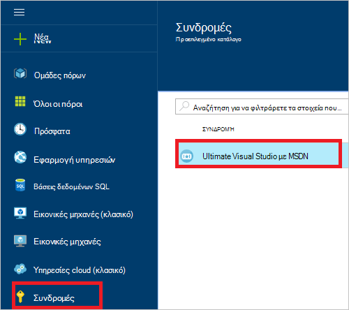
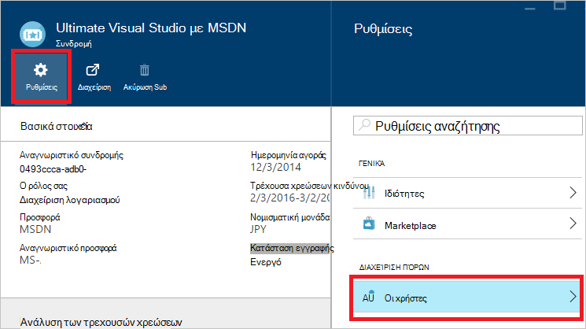
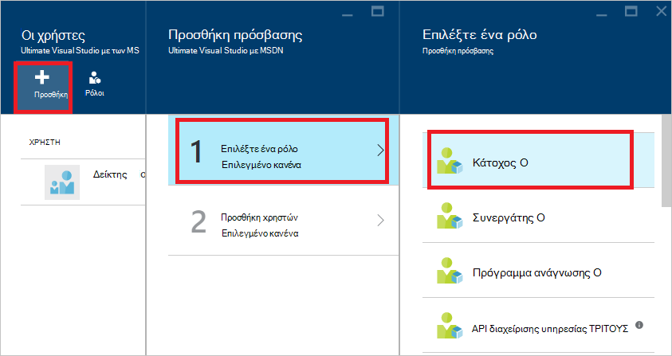
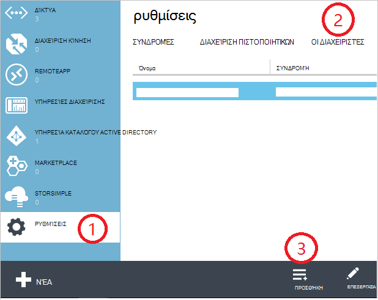
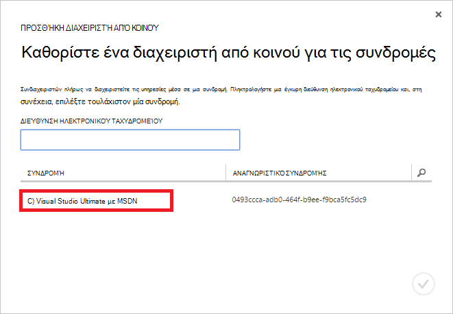
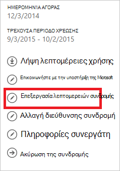
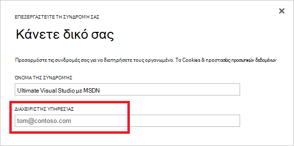

<properties
    pageTitle="Πώς μπορείτε να προσθέσετε ή να αλλάξετε τους ρόλους διαχειριστή του Azure | Microsoft Azure"
    description="Περιγράφει τον τρόπο για να προσθέσετε ή να αλλάξετε από κοινού διαχειριστή Azure, διαχειριστή της υπηρεσίας και το λογαριασμό διαχειριστή"
    services=""
    documentationCenter=""
    authors="genlin"
    manager="mbaldwin"
    editor=""
    tags="billing"/>

<tags
    ms.service="billing"
    ms.workload="na"
    ms.tgt_pltfrm="na"
    ms.devlang="na"
    ms.topic="article"
    ms.date="08/17/2016"
    ms.author="genli"/>

# Πώς μπορείτε να προσθέσετε ή να αλλάξετε τους ρόλους διαχειριστή του Azure

Υπάρχουν τρία είδη ρόλων διαχειριστή στο Microsoft Azure:

| Ρόλος διαχειριστή   | Όριο  | Περιγραφή
| ------------- | ------------- |---------------|
|Λογαριασμός διαχειριστή (ΑΑ)  | 1 ανά λογαριασμού Azure  |Αυτό είναι το άτομο που εγγραφήκατε ή αγοράσατε Azure συνδρομές και είναι εξουσιοδοτημένοι να αποκτήσετε πρόσβαση στο [Κέντρο το λογαριασμό](https://account.windowsazure.com/Home/Index) και να εκτελέσετε διάφορες εργασίες διαχείρισης. Αυτά περιλαμβάνουν τη δυνατότητα να δημιουργήσετε συνδρομές, Ακύρωση συνδρομές, η χρέωση για συνδρομή για την αλλαγή και αλλάξτε το διαχειριστή της υπηρεσίας.
| Διαχειριστής υπηρεσίας (σα) | 1 ανά Azure συνδρομή  |Αυτός ο ρόλος έχει δικαιώματα για τη Διαχείριση υπηρεσιών στην [πύλη του Azure](https://portal.azure.com). Από προεπιλογή, για μια νέα εγγραφή, ο διαχειριστής του λογαριασμού είναι επίσης το διαχειριστή της υπηρεσίας.|
|Από το διαχειριστή (CA) στην [πύλη του Azure κλασική](https://manage.windowsazure.com)|200 ανά συνδρομή| Ο ρόλος αυτός έχει τα ίδια δικαιώματα πρόσβασης ως διαχειριστή της υπηρεσίας, αλλά δεν είναι δυνατό να αλλάξετε τη συσχέτιση των συνδρομών σε καταλόγους Azure. |

> [AZURE.NOTE] Azure βάσει ρόλων Active Directory Access ελέγχου (RBAC) επιτρέπει στους χρήστες να προστίθεται σε πολλούς ρόλους. Για περισσότερες πληροφορίες, ανατρέξτε στο θέμα [Έλεγχος πρόσβασης βάσει ρόλων Active Directory Azure](./active-directory/role-based-access-control-configure.md).

> [AZURE.NOTE] Εάν χρειάζεστε περισσότερη βοήθεια σε οποιοδήποτε σημείο σε αυτό το άρθρο, επικοινωνήστε με [επικοινωνία με την υποστήριξη](https://portal.azure.com/?#blade/Microsoft_Azure_Support/HelpAndSupportBlade) για να λάβετε το πρόβλημα επιλυθεί γρήγορα.

## Πώς μπορείτε να προσθέσετε ένα διαχειριστή για μια συνδρομή

**Πύλη του Azure**

1. Είσοδος στην [πύλη του Azure](https://portal.azure.com).

2. Στο μενού διανομέα, επιλέξτε **συνδρομή** > *τη συνδρομή στην οποία θέλετε ο διαχειριστής για να αποκτήσετε πρόσβαση*.

    

3. Στην blade τη συνδρομή, επιλέξτε **Ρυθμίσεις**> **χρήστες**.

    
4. Στο το blade χρήστες, επιλέξτε **Προσθήκη**>**επιλέξετε ένα ρόλο** > **κατόχου**.

    

    **Σημείωση**
    - Ο ρόλος κατόχου έχει τα ίδια δικαιώματα πρόσβασης ως διαχειριστής από κοινού. Αυτός ο ρόλος δεν έχει δικαίωμα πρόσβασης στο [Κέντρο λογαριασμός Azure](https://account.windowsazure.com/subscriptions).
    - Οι κάτοχοι που προσθέσατε μέσω του [Azure πύλη](https://portal.azure.com) δεν είναι δυνατό να Διαχείριση υπηρεσιών στην [πύλη του Azure κλασική](https://manage.windowsazure.com).  

5. Πληκτρολογήστε τη διεύθυνση ηλεκτρονικού ταχυδρομείου του χρήστη που θέλετε να προσθέσετε ως κάτοχος, κάντε κλικ στο χρήστη και, στη συνέχεια, κάντε κλικ στην **επιλογή**.

    

**Azure κλασική πύλη**

1. Πραγματοποιήστε είσοδο στο [Azure κλασική πύλη](https://manage.windowsazure.com/).

2. Στο παράθυρο περιήγησης, επιλέξτε **Ρυθμίσεις**> **διαχειριστές**> **Προσθήκη**.  

    

3. Πληκτρολογήστε τη διεύθυνση ηλεκτρονικού ταχυδρομείου του ατόμου που θέλετε να προσθέσετε ως διαχειριστής από κοινού και, στη συνέχεια, επιλέξτε τη συνδρομή στην οποία θέλετε η από κοινού διαχειριστή για να αποκτήσετε πρόσβαση. 

     

Η ακόλουθη διεύθυνση ηλεκτρονικού ταχυδρομείου μπορούν να προστεθούν ως διαχειριστής από κοινού:

* **Λογαριασμός Microsoft** (πρώην Windows Live ID)  
 Μπορείτε να χρησιμοποιήσετε ένα λογαριασμό Microsoft για να συνδεθείτε όλα τα προϊόντα Microsoft προσανατολισμένος καταναλωτή και στο cloud services, όπως το Outlook (Hotmail), Skype (MSN), το OneDrive, Windows Phone και το Xbox LIVE.
* **Εταιρικός λογαριασμός** 
 Έναν εταιρικό λογαριασμό είναι ένας λογαριασμός που δημιουργείται στην περιοχή Azure Active Directory. Η διεύθυνση εταιρικό λογαριασμό σας, παρόμοια με την ακόλουθη: user@ &lt;τον τομέα σας&gt;. onmicrosoft.com

### Περιορισμοί και περιορισμούς

 * Κάθε συνδρομής σχετίζεται με έναν κατάλογο Azure AD (γνωστό και ως την προεπιλεγμένη στον κατάλογο). Για να βρείτε τον κατάλογο προεπιλεγμένη που είναι συσχετισμένη με τη συνδρομή, μεταβείτε στην [πύλη του Azure κλασική](https://manage.windowsazure.com/), επιλέξτε **Ρυθμίσεις** > **συνδρομές**. Ελέγξτε το Αναγνωριστικό εγγραφής για να βρείτε τον κατάλογο προεπιλεγμένη.

 * Εάν είστε συνδεδεμένοι με ένα λογαριασμό Microsoft, μπορείτε μόνο να προσθέσετε άλλους λογαριασμούς Microsoft ή τους χρήστες στον κατάλογο του προεπιλεγμένου ως διαχειριστής από κοινού.

 * Εάν είστε συνδεδεμένοι με έναν εταιρικό λογαριασμό, μπορείτε να προσθέσετε άλλα εταιρικοί λογαριασμοί της εταιρείας σας ως διαχειριστής από κοινού. Για παράδειγμα, abby@contoso.com να προσθέσετε bob@contoso.com ως διαχειριστή της υπηρεσίας ή διαχειριστής από κοινού, αλλά δεν είναι δυνατό να προσθέσετε john@notcontoso.com , εκτός εάν john@noncontoso.com είναι ο χρήστης στον προεπιλεγμένο κατάλογο. Οι χρήστες που έχουν συνδεθεί με εταιρικοί λογαριασμοί να συνεχίσετε για να προσθέσετε χρήστες λογαριασμό Microsoft ως διαχειριστή της υπηρεσίας ή από το διαχειριστή.

 * Τώρα που είναι δυνατό να συνδεθείτε στο Azure με εταιρικό λογαριασμό, εδώ θα βρείτε τις αλλαγές σε απαιτήσεις λογαριασμό διαχειριστή της υπηρεσίας και από κοινού διαχειριστή:

    Μέθοδος σύνδεσης| Προσθήκη λογαριασμού Microsoft ή τους χρήστες στον κατάλογο προεπιλεγμένη ως αρχή έκδοσης Πιστοποιητικών ή σα;  |Προσθήκη εταιρικό λογαριασμό στον ίδιο οργανισμό ως αρχή έκδοσης Πιστοποιητικών ή σα; |Προσθήκη εταιρικό λογαριασμό διαφορετικό εταιρείας ως αρχή έκδοσης Πιστοποιητικών ή σα;
    ------------- | ------------- |---------------|---------------
    Λογαριασμός Microsoft |Ναι|Όχι|Όχι
    Εταιρικός λογαριασμός|Ναι|Ναι|Όχι

## Πώς μπορείτε να αλλάξετε το διαχειριστή της υπηρεσίας για μια συνδρομή

Μόνο ο διαχειριστής λογαριασμού μπορεί να αλλάξει ο διαχειριστής της υπηρεσίας για μια συνδρομή.

1. Συνδεθείτε στο [Κέντρο λογαριασμός Azure](https://account.windowsazure.com/subscriptions) χρησιμοποιώντας το λογαριασμό διαχειριστή.

2. Επιλέξτε τη συνδρομή που θέλετε να αλλάξετε.

3. Στη δεξιά πλευρά, κάντε κλικ στην επιλογή **Επεξεργασία συνδρομή** λεπτομερειών.  

    

4. Στο πλαίσιο **ΔΙΑΧΕΙΡΙΣΤΉ της ΥΠΗΡΕΣΊΑΣ** , πληκτρολογήστε τη διεύθυνση ηλεκτρονικού ταχυδρομείου του νέου διαχειριστή της υπηρεσίας.  

    

## Πώς μπορείτε να αλλάξετε το λογαριασμό διαχειριστή

Για να μεταφέρετε όσον αφορά την κατοχή του Azure λογαριασμού σε άλλο λογαριασμό, ανατρέξτε στο θέμα [Μεταφορά όσον αφορά την κατοχή μια συνδρομή του Azure](billing-subscription-transfer.md).

## Επόμενα βήματα

* Για να μάθετε περισσότερα σχετικά με τον τρόπο ελέγχου της access πόρων στο Microsoft Azure, ανατρέξτε στο θέμα [Κατανόηση των πόρων πρόσβαση στο Azure](./active-directory/active-directory-understanding-resource-access.md)

* Για περισσότερες πληροφορίες σχετικά με τον τρόπο Azure Active Directory σχετίζεται με τη συνδρομή σας στο Azure, ανατρέξτε στο θέμα [Πώς Azure συνδρομές συσχετίζονται με Azure Active Directory](./active-directory/active-directory-how-subscriptions-associated-directory.md)

* Για περισσότερες πληροφορίες σχετικά με τον τρόπο Azure Active Directory σχετίζεται με τη συνδρομή σας στο Azure, ανατρέξτε στο θέμα [Εκχώρηση ρόλων διαχειριστή στο Azure Active Directory](./active-directory/active-directory-assign-admin-roles.md)

> [AZURE.NOTE] Εάν εξακολουθείτε να έχετε περισσότερες ερωτήσεις, λάβετε [Επικοινωνήστε με την υποστήριξη](https://portal.azure.com/?#blade/Microsoft_Azure_Support/HelpAndSupportBlade) για να λάβετε το πρόβλημα επιλυθεί γρήγορα.
