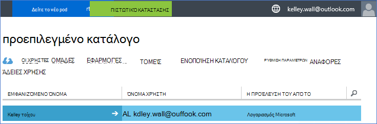
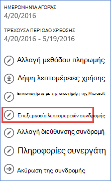

<properties
    pageTitle="Χρησιμοποιήστε ένα μισθωτή του Office 365 με μια συνδρομή στο Azure | Microsoft Azure"
    description="Μάθετε πώς μπορείτε να προσθέσετε έναν κατάλογο του Office 365 (μισθωτής) σε μια συνδρομή του Azure για να κάνετε τη συσχέτιση."
    services=""
    documentationCenter=""
    authors="JiangChen79"
    manager="mbaldwin"
    editor=""
    tags="billing,top-support-issue"/>

<tags
    ms.service="billing"
    ms.workload="na"
    ms.tgt_pltfrm="ibiza"
    ms.devlang="na"
    ms.topic="article"
    ms.date="09/16/2016"
    ms.author="cjiang"/>

# Συσχετισμός ένα μισθωτή του Office 365 με μια συνδρομή του Azure
Εάν αποκτήσατε Azure και το Office 365 συνδρομές ξεχωριστά στο παρελθόν και τώρα θέλετε να μπορεί να αποκτήσει πρόσβαση μισθωτή του Office 365 από το Azure συνδρομή, είναι εύκολο να το κάνετε. Σε αυτό το άρθρο σάς δείχνει πώς.

> [AZURE.NOTE] Σε αυτό το άρθρο δεν ισχύει για τους πελάτες σύμβαση Enterprise (EA).

## Σύντομη καθοδήγηση
Για να συσχετίσετε το μισθωτή του Office 365 με τη συνδρομή σας Azure, χρησιμοποιήστε το Azure λογαριασμό για να προσθέσετε το μισθωτή του Office 365 και, στη συνέχεια, να συσχετίσετε Azure τη συνδρομή σας με το μισθωτή του Office 365.

## Λεπτομερείς οδηγίες
Σε αυτό το σενάριο, ο τοίχος Kelley είναι ένας χρήστης που έχει μια συνδρομή με το λογαριασμό του Azure kelley.wall@outlook.com. Kelley περιλαμβάνει επίσης μια συνδρομή στο Office 365 στην περιοχή ο λογαριασμός kelley.wall@contoso.onmicrosoft.com. Τώρα Kelley θέλει να πρόσβαση στο μισθωτή του Office 365 με τη συνδρομή Azure.

### Προαπαιτούμενα στοιχεία
Για τη συσχέτιση για να λειτουργήσει σωστά, απαιτούνται οι ακόλουθες προϋποθέσεις:

- Χρειάζεστε τα διαπιστευτήρια του διαχειριστή της υπηρεσίας της Azure συνδρομής. Συνδιαχειριστών δεν μπορεί να εκτελέσει ένα υποσύνολο των βημάτων.
- Χρειάζεστε τα διαπιστευτήρια του ο Καθολικός διαχειριστής του μισθωτή του Office 365.
- Τη διεύθυνση ηλεκτρονικού ταχυδρομείου από το διαχειριστή της υπηρεσίας δεν πρέπει να περιλαμβάνονται στο μισθωτή του Office 365.
- Τη διεύθυνση ηλεκτρονικού ταχυδρομείου από το διαχειριστή της υπηρεσίας δεν πρέπει να αντιστοιχεί από οποιαδήποτε καθολικού διαχειριστή του μισθωτή του Office 365.
- Εάν χρησιμοποιείτε τη συγκεκριμένη στιγμή μια διεύθυνση ηλεκτρονικού ταχυδρομείου που είναι ένα λογαριασμό Microsoft και έναν εταιρικό λογαριασμό, να αλλάξετε προσωρινά το διαχειριστή της υπηρεσίας της συνδρομής σας στο Azure για να χρησιμοποιήσετε έναν άλλο λογαριασμό Microsoft. Μπορείτε να δημιουργήσετε ένα νέο λογαριασμό Microsoft στη [σελίδα εγγραφής λογαριασμού Microsoft](https://signup.live.com/).

Για να αλλάξετε το διαχειριστή της υπηρεσίας, ακολουθήστε τα παρακάτω βήματα:

1. Είσοδος στην [πύλη Διαχείριση λογαριασμού](https://account.windowsazure.com/subscriptions).
2. Επιλέξτε τη συνδρομή που θέλετε να αλλάξετε.
3. Επιλέξτε **Επεξεργασία λεπτομερειών συνδρομής**.

    

4. Στο πλαίσιο **ΔΙΑΧΕΙΡΙΣΤΉ της ΥΠΗΡΕΣΊΑΣ** , πληκτρολογήστε τη διεύθυνση ηλεκτρονικού ταχυδρομείου του νέου διαχειριστή υπηρεσίας.

    

### Συσχετισμός μισθωτή του Office 365 με τη συνδρομή του Azure
Για να συσχετίσετε το μισθωτή του Office 365 με τη συνδρομή Azure, ακολουθήστε τα παρακάτω βήματα:

1.  Είσοδος στην [πύλη διαχείρισης λογαριασμό](https://account.windowsazure.com/subscriptions) με τα διαπιστευτήρια διαχειριστή υπηρεσίας.
2.  Στο αριστερό παράθυρο, επιλέξτε την **Υπηρεσία καταλόγου ACTIVE DIRECTORY**.

    

    > [AZURE.NOTE] Δεν θα πρέπει να βλέπετε το μισθωτή του Office 365. Εάν βλέπετε το, μεταβείτε στο επόμενο βήμα.

    

3. Προσθέστε μισθωτή του Office 365 Azure τη συνδρομή σας.

    μια. Επιλέξτε **ΔΗΜΙΟΥΡΓΊΑ** > **ΚΑΤΑΛΌΓΟΥ** > **ΔΗΜΙΟΥΡΓΊΑ ΠΡΟΣΑΡΜΟΣΜΈΝΟΥ**.

    

    β. Στη σελίδα **Προσθήκη καταλόγου** , στην περιοχή **ΚΑΤΑΛΌΓΟΥ**, επιλέξτε **Χρήση υπάρχουσας καταλόγου**. Στη συνέχεια, επιλέξτε **είμαι έτοιμος να πραγματοποιήσει έξοδο τώρα**και επιλέξτε **ολοκλήρωσης** .

    

    c. Αφού έχετε πραγματοποιήσει έξοδο, πραγματοποιήστε είσοδο με τα διαπιστευτήρια του καθολικού διαχειριστή του μισθωτή του Office 365.

    

    d. Επιλέξτε **συνέχεια**.

    

    ε. Επιλέξτε **Έξοδος τώρα**.

    

    f. Είσοδος στην [πύλη διαχείρισης λογαριασμό](https://account.windowsazure.com/subscriptions) με τα διαπιστευτήρια διαχειριστή υπηρεσίας.

    

    γ. Θα πρέπει να βλέπετε μισθωτή του Office 365 στον πίνακα εργαλείων.

    

4. Αλλάξτε τον κατάλογο που σχετίζεται με τη συνδρομή του Azure.

    μια. Επιλέξτε **Ρυθμίσεις**.

    

    β. Επιλέξτε τη συνδρομή σας στο Azure και, στη συνέχεια, επιλέξτε **ΕΠΕΞΕΡΓΑΣΊΑ ΚΑΤΑΛΌΓΟΥ**.
    

    c. Επιλέξτε **Επόμενο** .

    

    > [AZURE.WARNING] Θα λάβετε μια προειδοποίηση ότι θα καταργηθούν όλες οι διαχειριστές από κοινού.

    

    >[AZURE.WARNING] Επιπλέον, όλοι οι χρήστες [έλεγχο πρόσβασης βάσει ρόλων (RBAC)](./active-directory/role-based-access-control-configure.md) με την access εκχωρημένες στις υπάρχουσες ομάδες πόρων επίσης θα καταργηθούν. Ωστόσο, η προειδοποίηση που λαμβάνετε αναφορές μόνο την κατάργηση των διαχειριστών από κοινού.

    

    d. Επιλέξτε **Ολοκλήρωση** .

5. Τώρα μπορείτε να προσθέσετε το εταιρικοί λογαριασμοί Office 365 ως συνδιαχειριστών στο μισθωτή του Azure Active Directory.

    μια. Επιλέξτε την καρτέλα **ΔΙΑΧΕΙΡΙΣΤΈΣ** και, στη συνέχεια, επιλέξτε **ΠΡΟΣΘΉΚΗ**.

    

    β. Εισαγάγετε έναν εταιρικό λογαριασμό του μισθωτή του Office 365, επιλέξτε τη συνδρομή Azure και, στη συνέχεια, επιλέξτε **ολοκλήρωσης** .

    

    c. Επιστρέψτε στην καρτέλα **ΔΙΑΧΕΙΡΙΣΤΈΣ** . Θα πρέπει να βλέπετε το εταιρικό λογαριασμό σας εμφανίζονται ως διαχειριστής από κοινού.

    

6. Στη συνέχεια, μπορείτε να ελέγξετε πρόσβασης με το διαχειριστή του από κοινού.

    μια. Έξοδος από την πύλη Διαχείριση λογαριασμού.

    β. Ανοίξτε την [πύλη διαχείρισης λογαριασμό](https://account.windowsazure.com/subscriptions) ή την [πύλη του Azure](https://portal.azure.com/).

    c. Εάν το Azure στη σελίδα εισόδου έχει μια σύνδεση **Πραγματοποιήστε είσοδο με τον εταιρικό λογαριασμό σας**, επιλέξτε τη σύνδεση. Διαφορετικά, μεταβείτε σε αυτό το βήμα.

    

    d. Πληκτρολογήστε τα διαπιστευτήρια του διαχειριστή από κοινού και, στη συνέχεια, επιλέξτε **Είσοδος**.

    

## Επόμενα βήματα
Σχετικές σενάρια περιλαμβάνουν τα εξής:

- Έχετε ήδη μια συνδρομή στο Office 365 και είστε έτοιμοι για μια συνδρομή στο Azure, αλλά θέλετε να χρησιμοποιήσετε τους υπάρχοντες λογαριασμούς χρήστη του Office 365 για τη συνδρομή σας Azure.
- Είστε ένα Azure συνδρομητή και θέλετε να λάβετε μια συνδρομή στο Office 365 για τους χρήστες στην υπάρχουσα παρουσία Azure Active Directory.

Για να μάθετε πώς μπορείτε να εκτελέσετε αυτές τις εργασίες, ανατρέξτε στο θέμα [Χρήση λογαριασμού του υπάρχοντος Office 365 με τη συνδρομή σας Azure, ή το αντίστροφο](billing-use-existing-office-365-account-azure-subscription.md).
