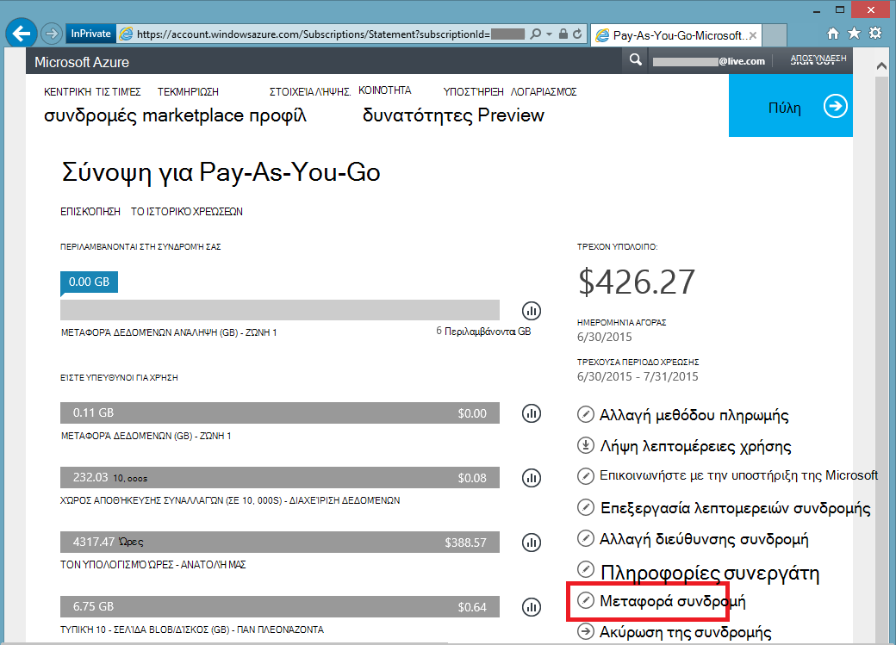

<properties
   pageTitle="Η μεταβίβαση της ιδιοκτησίας της συνδρομής Azure | Microsoft Azure"
   description="Πώς μπορείτε να μεταφέρετε μια συνδρομή του Azure σε άλλο χρήστη, καθώς και ορισμένα συχνά ζητηθεί ερωτήσεις σχετικά με τη διαδικασία"
   services=""
   documentationCenter=""
   authors="genlin"
   manager="stevenpo"
   editor=""
   tags="billing,top-support-issue"/>

<tags
   ms.service="billing"
   ms.workload="na"
   ms.tgt_pltfrm="na"
   ms.devlang="na"
   ms.topic="article"
   ms.date="10/10/2016"
   ms.author="genli"/>

# Η μεταβίβαση της ιδιοκτησίας της συνδρομής Azure

Κάντε μπορείτε:

- Πρέπει να χέρι μέσω χρεώσεις όσον αφορά την κατοχή Azure τη συνδρομή σας σε κάποιον άλλο;
- Θέλετε να αλλάξετε το λογαριασμό που χρησιμοποιείται για να εγγραφείτε για Azure; Ίσως χρησιμοποιείται το λογαριασμό σας Microsoft αλλά σκοπεύατε να χρησιμοποιήστε τον εταιρικό ή σχολικό λογαριασμό αντί για αυτό;
- Θέλετε να μετακινήσετε τη συνδρομή σας στο Azure από έναν κατάλογο σε ένα άλλο;
- Έχετε Azure και το Office 365 σε διαφορετική μισθωτές και για τη συνολική εικόνα;

Μπορείτε τώρα να κάνετε αυτό εύκολα σε το Microsoft Azure λογαριασμό Κέντρο - για Pay-As-You-Go, MSDN, πακέτο ενέργειας ή BizSpark συνδρομές.  Έχουμε προσθέσει τη δυνατότητα να μεταφέρετε τη συνδρομή σας σε κάποιον άλλο χρήστη. Με άλλα λόγια, μπορείτε να αλλάξετε το λογαριασμό διαχείρισης σε οποιαδήποτε Pay-As-You-Go, MSDN, πακέτο ενέργειας ή BizSpark συνδρομή που διαθέτετε, ανεξάρτητα από το ποια χώρα που λειτουργούν σε τώρα. Υποστηρίζουμε τώρα τη μεταφορά του Azure Marketplace αγορές για αυτούς τους τύπους συνδρομή καθώς και.

> [AZURE.NOTE] Για να αλλάξετε τη συνδρομή σας σε μια διαφορετική προσφορά, ανατρέξτε στο θέμα [Αλλαγή Azure τη συνδρομή σας σε άλλη προσφορά](billing-how-to-switch-azure-offer.md) για περισσότερες πληροφορίες. Εάν χρειάζεστε περισσότερη βοήθεια σε οποιοδήποτε σημείο σε αυτό το άρθρο, επικοινωνήστε [Επικοινωνήστε με την υποστήριξη](https://portal.azure.com/?#blade/Microsoft_Azure_Support/HelpAndSupportBlade) για να λάβετε το πρόβλημα επιλυθεί γρήγορα.

## Πώς μπορείτε να μεταφέρετε όσον αφορά την κατοχή μια συνδρομή του Azure

> [AZURE.VIDEO transfer-an-azure-subscription]

1.  Πραγματοποιήστε είσοδο στην <https://account.windowsazure.com/Subscriptions>. Πρέπει να είναι ο διαχειριστής του λογαριασμού για να εκτελέσετε μεταβίβασης κυριότητας. Για περισσότερες πληροφορίες σχετικά με τον τρόπο για να εντοπίσω ποιος είναι ο διαχειριστής του λογαριασμού της συνδρομής, ανατρέξτε στο θέμα [Συνήθεις ερωτήσεις για](#faq)το.

2.  Επιλέξτε τη συνδρομή για τη μεταφορά.

3.  Κάντε κλικ στην επιλογή **Μεταφορά συνδρομής** .

    

4.  Ακολουθήστε τις οδηγίες για να καθορίσετε τον παραλήπτη.

    

5.  Ο παραλήπτης θα λάβουν αυτόματα ένα μήνυμα ηλεκτρονικού ταχυδρομείου με μια σύνδεση αποδοχής.

    

6.  Ο παραλήπτης κάνει κλικ στη σύνδεση και ακολουθεί τις οδηγίες, όπως την εισαγωγή τους πληροφορίες πληρωμής.

    

    

7. Επιτυχίας! Η συνδρομή μεταφέρεται τώρα.

## Συνήθεις ερωτήσεις

-   **Πώς μπορώ να ξέρω ποιος είναι ο διαχειριστής του λογαριασμού της συνδρομής;**

    Μπορείτε να επιβεβαιώσετε ποιος είναι ο διαχειριστής του λογαριασμού της συνδρομής ως εξής:

    1. Είσοδος στην [πύλη του Azure](https://portal.azure.com).
    2. Στο μενού διανομέα, επιλέξτε **τη συνδρομή**.
    3. Επιλέξτε τη συνδρομή που θέλετε να ελέγξετε και, στη συνέχεια, επιλέξτε **Ρυθμίσεις**.
    4. Επιλέξτε την εντολή **Ιδιότητες**. Ο διαχειριστής του λογαριασμού της συνδρομής θα εμφανιστεί στο πλαίσιο **Διαχείριση λογαριασμού** .  

-   **Η μεταβίβαση συνδρομή έχει ως αποτέλεσμα οποιαδήποτε υπηρεσία χρόνου εκτός λειτουργίας;**

    Δεν υπάρχει καμία επίδραση στην υπηρεσία. Αυτό αποτελεσματική ακυρώνει τη συνδρομή κάτω από τον τρέχοντα λογαριασμό διαχειριστή και δημιουργεί ένα νέο λογαριασμό του παραλήπτη, αλλά συσχετίζει των υποκείμενων υπηρεσιών Azure με τη νέα εγγραφή. Το Αναγνωριστικό συνδρομής παραμένει ίδια.

-   **Πώς χρησιμοποιώ αυτός ο μηχανισμός για να αλλάξετε τον κατάλογο για τη συνδρομή;**-   
    Μια συνδρομή του Azure δημιουργείται στον κατάλογο στην οποία ανήκει το λογαριασμό διαχειριστή. Επομένως, για να αλλάξετε τον κατάλογο, απλώς μεταφέρετε τη συνδρομή σε ένα λογαριασμό χρήστη στον κατάλογο προορισμού. Όταν ο χρήστης ολοκληρώσει τα βήματα για να αποδεχτείτε μεταφοράς, η συνδρομή θα μετακινηθούν αυτόματα τον κατάλογο προορισμού.

-   **Εάν να αναλάβετε τον έλεγχο χρεώσεων όσον αφορά την κατοχή συνδρομής από κάποιαν άλλη εταιρεία, θα εξακολουθούν να έχουν πρόσβαση στους πόρους μου;**

    Εάν η συνδρομή μεταφερθεί σε ένα άλλο μισθωτή, οι χρήστες που σχετίζεται με το προηγούμενο μισθωτή θα χάσουν την πρόσβαση στη συνδρομή. Ακόμα και αν ένας χρήστης δεν είναι διαχειριστής υπηρεσίας ή διαχείρισης από κοινού πλέον, ενδέχεται να εξακολουθούν να έχουν πρόσβαση στη συνδρομή μέσω άλλων μηχανισμών ασφαλείας. Περιλαμβάνουν τα εξής:
    - Διαχείριση πιστοποιητικών που Παραχωρήστε στο χρήστη δικαιώματα διαχειριστή για να τους πόρους συνδρομής. Για περισσότερες πληροφορίες, ανατρέξτε στο θέμα [Δημιουργία και αποστολή ενός πιστοποιητικού διαχείρισης για το Azure](https://msdn.microsoft.com/library/azure/gg551722.aspx)
    -   Πλήκτρα πρόσβασης για τις υπηρεσίες όπως το χώρο αποθήκευσης. Για περισσότερες πληροφορίες, ανατρέξτε στο θέμα [Προβολή "," Αντιγραφή "και" πλήκτρα πρόσβασης regenerate χώρου αποθήκευσης](storage-create-storage-account.md#view-copy-and-regenerate-storage-access-keys)
    -   Απομακρυσμένη πρόσβαση διαπιστευτηρίων για τις υπηρεσίες όπως εικονικές μηχανές Windows Azure

    Δεν πρόκειται για μια πλήρη λίστα. Ο παραλήπτης πρέπει να λάβετε υπόψη ενημέρωση οποιαδήποτε απορρήτου που σχετίζεται με την υπηρεσία, εάν πρέπει να περιορίσετε την πρόσβαση για τους πόρους. Περισσότεροι πόροι μπορούν να ενημερωθούν ως εξής:

    1.   Μεταβείτε στην πύλη του Azure: [ *https://portal.azure.com*](https://portal.azure.com)

    2.    Κάντε κλικ στην επιλογή Αναζήτηση όλων -&gt; όλους τους πόρους

    3.    Επιλέξτε τον πόρο. Έτσι ανοίγει το blade πόρων.

    4.    Στο το blade πόρων, κάντε κλικ στην επιλογή **Ρυθμίσεις**. Εδώ μπορείτε να προβάλετε και να ενημερώσετε υπάρχοντα απορρήτου.

-   **Εάν να μεταφέρω τη συνδρομή στο μέσο τον κύκλο χρεώσεων, του παραλήπτη πληρωμή για ολόκληρη η χρέωση κυκλική εναλλαγή;**

    Ο αποστολέας είναι υπεύθυνος για πληρωμή για οποιαδήποτε χρήση που αναφέρθηκε μέχρι το σημείο που έχει ολοκληρωθεί η μεταφορά. Ο παραλήπτης είναι υπεύθυνο για χρήση αναφερθεί από τη στιγμή της μεταφοράς και μετά. Μπορεί να υπάρχουν ορισμένες χρήση που πραγματοποιήθηκαν πριν μεταφοράς αλλά αναφέρθηκε αργότερα. Αυτό θα συμπεριληφθούν στην τεχνική του παραλήπτη.

-   **Ο παραλήπτης διαθέτει πρόσβαση σε χρήση και το ιστορικό χρεώσεων;**

    Προς το παρόν, τις πληροφορίες μόνο διαπιστωθεί προς τον παραλήπτη είναι η ποσότητα του τελευταίου τιμολόγιο (ή το τρέχον υπόλοιπο, εάν η συνδρομή έχει μεταφερθεί πριν από την πρώτη τιμολόγιο δημιουργήθηκε). Το υπόλοιπο της χρήσης και το ιστορικό χρεώσεων δεν μεταφέρει με τη συνδρομή.

-   **Η προσφορά μπορεί να αλλάξει κατά τη διάρκεια μιας μεταφοράς;**

    Η προσφορά πρέπει να παραμείνουν τα ίδια. Για να αλλάξετε την προσφορά, πρέπει να [επικοινωνήσετε με την υποστήριξη](http://go.microsoft.com/fwlink/?LinkID=619338).

-   **Μπορώ να μεταφέρω μια συνδρομή σε ένα λογαριασμό χρήστη σε άλλη χώρα;**

    Όχι, δεν υποστηρίζεται αυτήν τη στιγμή. Λογαριασμός χρήστη ο παραλήπτης πρέπει να είναι στην ίδια χώρα.

-   **Ο παραλήπτης να χρησιμοποιήσετε ένα διαφορετικό πληρωμής μηχανισμό;**

    Ναι. Υπάρχουν περιορισμοί εδώ: τώρα το ιστορικό χρεώσεων συνδρομή χωρίζεται σε δύο λογαριασμούς. Αλλά το πλεονέκτημα είναι ότι μπορείτε να το κάνετε χωρίς να χρειάζεται να [επικοινωνήσετε με την υποστήριξη](http://go.microsoft.com/fwlink/?LinkID=619338).

-   **Θα τη μέθοδο πληρωμής να αντιμετωπίσουν προβλήματα αφού είναι δυνατό να μεταφερθούν μια συνδρομή του Azure;**

    Για να αποδεχτείτε μια μεταφορά συνδρομή, μια πιστωτική κάρτα ή μια παρόμοια μέθοδο πληρωμής πρέπει να δοθεί να πληρώσετε για τη συνδρομή. Για παράδειγμα, εάν ο Μπάμπης μεταφέρει μια συνδρομή στο Μαρία και Μαρία αποδέχεται τη μεταφορά, Μαρία πρέπει επίσης να παρέχει μια μέθοδο πληρωμής που που θα χρησιμοποιήσετε για να πληρώσετε για τη συνδρομή. Όταν ολοκληρωθεί η μεταφορά, ο Μπάμπης δεν είναι πλέον θα χρεωθεί για τη συνδρομή που εσείς μεταφερθεί Μαρία.

## Επόμενα βήματα μετά την αποδοχή όσον αφορά την κατοχή μια συνδρομή

1. Τώρα είστε ο διαχειριστής του λογαριασμού. Αναθεώρηση και ενημερώστε το διαχειριστή της υπηρεσίας και Συνδιαχειριστών. Διαχείριση διαχειριστές στην [πύλη του Azure κλασική](https://manage.windowsazure.com) , μεταβαίνοντας στις ρυθμίσεις. [Μάθετε περισσότερα](http://go.microsoft.com/fwlink/?LinkID=533293).
2. Μπορείτε επίσης να χρησιμοποιήσετε τον έλεγχο πρόσβασης βάσει ρόλων (RBAC) για τη συνδρομή και τις υπηρεσίες σας. Επισκεφθείτε την [πύλη του Azure](https://portal.azure.com) [Μάθετε περισσότερα σχετικά με το RBAC](http://go.microsoft.com/fwlink/?LinkID=544802)
3. Ενημέρωση διαπιστευτηρίων που σχετίζονται με τις υπηρεσίες του αυτής της συνδρομής. Περιλαμβάνουν τα εξής:
    - Διαχείριση πιστοποιητικών που Παραχωρήστε στο χρήστη δικαιώματα διαχειριστή για να τους πόρους συνδρομής. Για περισσότερες πληροφορίες, ανατρέξτε στο θέμα [Δημιουργία και αποστολή ενός διαχείρισης πιστοποιητικού για Azure](https://msdn.microsoft.com/library/azure/gg551722.aspx)
    -   Πλήκτρα πρόσβασης για τις υπηρεσίες όπως το χώρο αποθήκευσης. Για περισσότερες πληροφορίες, ανατρέξτε στο θέμα [Προβολή "," Αντιγραφή "και" πλήκτρα πρόσβασης regenerate χώρου αποθήκευσης](storage-create-storage-account.md#view-copy-and-regenerate-storage-access-keys)
    -   Απομακρυσμένη πρόσβαση διαπιστευτηρίων για τις υπηρεσίες όπως εικονικές μηχανές Windows Azure
4. Ενημέρωση χρεώσεων ειδοποιήσεων για αυτήν τη συνδρομή, με το [Κέντρο λογαριασμός Azure](https://account.windowsazure.com/Subscriptions)  [Μάθετε περισσότερα](http://go.microsoft.com/fwlink/?LinkID=533292)
5.  Εάν εργάζεστε με ένα συνεργάτη, μπορείτε να ενημερώσετε το Αναγνωριστικό συνεργάτη σε αυτήν τη συνδρομή. Μπορείτε να το κάνετε στο [Κέντρο λογαριασμός Azure](https://account.windowsazure.com/Subscriptions).

> [AZURE.NOTE] Εάν εξακολουθείτε να έχετε περισσότερες ερωτήσεις, λάβετε [Επικοινωνήστε με την υποστήριξη](https://portal.azure.com/?#blade/Microsoft_Azure_Support/HelpAndSupportBlade) για να λάβετε το πρόβλημα επιλυθεί γρήγορα.
