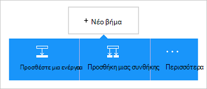

<properties
    pageTitle="Προσθέστε το χώρο αποθήκευσης αντικειμένων blob του Azure σύνδεσης στο εφαρμογές σας λογικής | Microsoft Azure"
    description="Επισκόπηση του χώρου αποθήκευσης αντικειμένων blob του Azure σύνδεσης με παραμέτρους REST API"
    services=""
    documentationCenter="" 
    authors="MandiOhlinger"
    manager="anneta"
    editor=""
    tags="connectors"/>

<tags
   ms.service="logic-apps"
   ms.devlang="na"
   ms.topic="article"
   ms.tgt_pltfrm="na"
   ms.workload="integration" 
   ms.date="10/18/2016"
   ms.author="mandia"/>

# Γρήγορα αποτελέσματα με τη γραμμή σύνδεσης χώρο αποθήκευσης αντικειμένων blob του Azure
Χώρο αποθήκευσης Blob του Azure είναι μια υπηρεσία για την αποθήκευση μεγάλου όγκου μη δομημένα δεδομένα. Εκτελέστε διάφορες ενέργειες όπως η αποστολή, ενημέρωση, λήψη και διαγραφή αντικειμένων blob στο χώρο αποθήκευσης αντικειμένων blob του Azure. 

Με το χώρο αποθήκευσης αντικειμένων blob του Azure, μπορείτε:

- Δημιουργία ροής εργασίας με τα νέα έργα αποστολή ή λήψη αρχείων που έχουν ενημερωθεί πρόσφατα.
- Χρήση ενεργειών για τη λήψη αρχείου μετα-δεδομένων, να διαγράψετε ένα αρχείο, αντιγραφή αρχείων και πολλά άλλα. Για παράδειγμα, όταν ενημερώνεται ένα εργαλείο σε μια τοποθεσία web Azure (ένα έναυσμα), στη συνέχεια, ενημερώστε ένα αρχείο στο χώρο αποθήκευσης αντικειμένων blob (μια ενέργεια). 

Αυτό το θέμα δείχνει πώς μπορείτε να χρησιμοποιήσετε τη γραμμή σύνδεσης χώρο αποθήκευσης αντικειμένων blob σε μια εφαρμογή λογικής και εμφανίζει επίσης τις ενέργειες.

>[AZURE.NOTE] Αυτή η έκδοση του άρθρου ισχύει για εφαρμογές λογικής γενικής διαθεσιμότητας (GA). 

Για να μάθετε περισσότερα σχετικά με τις εφαρμογές λογικής, ανατρέξτε στο θέμα [Τι είναι οι εφαρμογές λογικής](../app-service-logic/app-service-logic-what-are-logic-apps.md) και να [δημιουργήσετε μια εφαρμογή λογικής](../app-service-logic/app-service-logic-create-a-logic-app.md).

## Σύνδεση στο χώρο αποθήκευσης αντικειμένων blob του Azure

Πριν από την εφαρμογή της λογικής να αποκτήσετε πρόσβαση σε οποιαδήποτε υπηρεσία, μπορείτε πρώτα να δημιουργήσετε μια *σύνδεση* με την υπηρεσία. Μια σύνδεση παρέχει σύνδεση ανάμεσα σε μια εφαρμογή λογικής και μια άλλη υπηρεσία. Για παράδειγμα, για να συνδεθείτε σε ένα λογαριασμό του χώρου αποθήκευσης, μπορείτε πρώτα να δημιουργήσετε χώρο αποθήκευσης αντικειμένων blob *σύνδεσης*. Για να δημιουργήσετε μια σύνδεση, εισαγάγετε τα διαπιστευτήρια που χρησιμοποιείτε συνήθως για να αποκτήσετε πρόσβαση στην υπηρεσία που πρόκειται να συνδεθείτε με. Επομένως, με Azure χώρο αποθήκευσης, πληκτρολογήστε τα διαπιστευτήρια για το λογαριασμό χώρου αποθήκευσης για να δημιουργήσετε τη σύνδεση. 

#### Δημιουργία της σύνδεσης

>[AZURE.INCLUDE [Create a connection to Azure blob storage](../../includes/connectors-create-api-azureblobstorage.md)]
 
## Χρησιμοποιήστε ένα έναυσμα

Αυτή η γραμμή σύνδεσης δεν διαθέτει τα εναύσματα. Χρήση άλλων εναυσμάτων για να ξεκινήσετε την εφαρμογή λογικής, όπως ένα έναυσμα Περιοδικότητα, ένα έναυσμα HTTP Webhook, εναύσματα είναι διαθέσιμη με άλλες γραμμές σύνδεσης και πολλά άλλα. [Δημιουργία μιας εφαρμογής λογική](../app-service-logic/app-service-logic-create-a-logic-app.md) παρέχει ένα παράδειγμα.

## Χρησιμοποιήστε μια ενέργεια
    
Μια ενέργεια είναι μια ενέργεια που εκτελείται από τη ροή εργασίας που ορίζονται από το σε μια εφαρμογή για λογική.

1. Επιλέξτε το σύμβολο συν. Μπορείτε να δείτε διάφορες επιλογές: **Προσθήκη μιας ενέργειας**, **Προσθήκη συνθήκης**ή μία από τις **περισσότερες** επιλογές.

    

2. Επιλέξτε **Προσθήκη μιας ενέργειας**.

3. Στο πλαίσιο κειμένου, πληκτρολογήστε "αντικειμένων blob" για να λάβετε μια λίστα με όλες τις διαθέσιμες ενέργειες.

     

4. Στο παράδειγμά μας, επιλέξτε **AzureBlob - λήψη αρχείου μετα-δεδομένων χρησιμοποιώντας διαδρομή**. Εάν υπάρχει ήδη μια σύνδεση, στη συνέχεια, επιλέξτε το **...** Κουμπί (Εμφάνιση επιλογής) για να επιλέξετε ένα αρχείο.

    

    Εάν σας ζητηθεί για τις πληροφορίες σύνδεσης, στη συνέχεια, πληκτρολογήστε τις λεπτομέρειες για να δημιουργήσετε τη σύνδεση. [Δημιουργία της σύνδεσης](connectors-create-api-azureblobstorage.md#create-the-connection) σε αυτό το θέμα περιγράφει αυτές τις ιδιότητες. 

    > [AZURE.NOTE] Σε αυτό το παράδειγμα, λαμβάνουμε τα μετα-δεδομένα του αρχείου. Για να δείτε τα μετα-δεδομένα, προσθέστε μια άλλη ενέργεια που δημιουργεί ένα νέο αρχείο χρησιμοποιώντας μια άλλη γραμμή σύνδεσης. Για παράδειγμα, προσθέστε μια ενέργεια OneDrive που δημιουργεί ένα νέο αρχείο "δοκιμή" με βάση τα μετα-δεδομένα. 

5. **Αποθηκεύστε** τις αλλαγές σας (επάνω αριστερή γωνία της γραμμής εργαλείων). Εφαρμογή της λογικής αποθηκεύεται και μπορεί να ενεργοποιηθεί αυτόματα.

> [AZURE.TIP] [Εξερεύνηση χώρου αποθήκευσης](http://storageexplorer.com/) είναι ένα εξαιρετικό εργαλείο για να διαχειριστείτε πολλούς λογαριασμούς χώρου αποθήκευσης.

## Τεχνικές λεπτομέρειες

## Χώρος αποθήκευσης αντικειμένων Blob ενέργειες

|Ενέργεια|Περιγραφή|
|--- | ---|
|[Λήψη αρχείων μετα-δεδομένων](connectors-create-api-azureblobstorage.md#get-file-metadata)|Αυτή η λειτουργία αποκτά αρχείο μετα-δεδομένων με χρήση του αναγνωριστικού αρχείου.|
|[Ενημέρωση αρχείων](connectors-create-api-azureblobstorage.md#update-file)|Αυτή η λειτουργία ενημερώνει ένα αρχείο.|
|[Διαγραφή αρχείου](connectors-create-api-azureblobstorage.md#delete-file)|Αυτή η λειτουργία διαγράφει ένα αρχείο.|
|[Λήψη αρχείων μετα-δεδομένων χρησιμοποιώντας διαδρομή](connectors-create-api-azureblobstorage.md#get-file-metadata-using-path)|Αυτή η λειτουργία αποκτά αρχείο μετα-δεδομένων χρησιμοποιώντας τη διαδρομή του.|
|[Λάβετε το περιεχόμενο του αρχείου χρησιμοποιώντας διαδρομή](connectors-create-api-azureblobstorage.md#get-file-content-using-path)|Αυτή η λειτουργία αποκτά περιεχόμενα χρησιμοποιώντας τη διαδρομή του αρχείου.|
|[Λήψη περιεχομένου αρχείου](connectors-create-api-azureblobstorage.md#get-file-content)|Αυτή η λειτουργία λαμβάνει το αναγνωριστικό περιεχόμενα του αρχείου.|
|[Δημιουργία αρχείου](connectors-create-api-azureblobstorage.md#create-file)|Αυτή η λειτουργία αποστέλλει ένα αρχείο.|
|[Αντιγραφή αρχείου](connectors-create-api-azureblobstorage.md#copy-file)|Αυτή η λειτουργία αντιγράφει ένα αρχείο με το χώρο αποθήκευσης αντικειμένων Blob Azure.|
|[Εξαγάγετε αρχειοθέτησης σε φάκελο](connectors-create-api-azureblobstorage.md#extract-archive-to-folder)|Αυτή η λειτουργία εξάγει ένα αρχείο αρχειοθέτησης σε ένα φάκελο (παράδειγμα: .zip).|

### Λεπτομέρειες ενέργειας

Σε αυτήν την ενότητα, ανατρέξτε στο θέμα τις συγκεκριμένες λεπτομέρειες σχετικά με κάθε ενέργεια, συμπεριλαμβανομένων τυχόν απαιτούμενου ή προαιρετικού εισαγωγής ιδιότητες και τις αντίστοιχες εξόδου που σχετίζεται με τη γραμμή σύνδεσης.

#### Λήψη αρχείων μετα-δεδομένων
Αυτή η λειτουργία αποκτά αρχείο μετα-δεδομένων με χρήση του αναγνωριστικού αρχείου.  

|Όνομα ιδιότητας| Εμφανιζόμενο όνομα|Περιγραφή|
| ---|---|---|
|αναγνωριστικό *|Αρχείο|Επιλέξτε ένα αρχείο|

Έναν αστερίσκο (*) σημαίνει ότι η ιδιότητα απαιτείται.

##### Λεπτομέρειες εξόδου
BlobMetadata

| Όνομα ιδιότητας | Τύπος δεδομένων |
|---|---|
|Αναγνωριστικό|συμβολοσειρά|
|Όνομα|συμβολοσειρά|
|Εμφανιζόμενο όνομα|συμβολοσειρά|
|Διαδρομή|συμβολοσειρά|
|Τελευταία τροποποίηση|συμβολοσειρά|
|Μέγεθος|Ακέραιος αριθμός|
|MediaType|συμβολοσειρά|
|IsFolder|δυαδική τιμή|
|ETag|συμβολοσειρά|
|FileLocator|συμβολοσειρά|

#### Ενημέρωση αρχείων
Αυτή η λειτουργία ενημερώνει ένα αρχείο.  

|Όνομα ιδιότητας| Εμφανιζόμενο όνομα|Περιγραφή|
| ---|---|---|
|αναγνωριστικό *|Αρχείο|Επιλέξτε ένα αρχείο|
|σώμα *|Το περιεχόμενο του αρχείου|Περιεχόμενο του αρχείου για να ενημερώσετε|

Έναν αστερίσκο (*) σημαίνει ότι η ιδιότητα απαιτείται.

##### Λεπτομέρειες εξόδου
BlobMetadata

| Όνομα ιδιότητας | Τύπος δεδομένων |
|---|---|
|Αναγνωριστικό|συμβολοσειρά|
|Όνομα|συμβολοσειρά|
|Εμφανιζόμενο όνομα|συμβολοσειρά|
|Διαδρομή|συμβολοσειρά|
|Τελευταία τροποποίηση|συμβολοσειρά|
|Μέγεθος|Ακέραιος αριθμός|
|MediaType|συμβολοσειρά|
|IsFolder|δυαδική τιμή|
|ETag|συμβολοσειρά|
|FileLocator|συμβολοσειρά|

#### Διαγραφή αρχείου
Αυτή η λειτουργία διαγράφει ένα αρχείο.  

|Όνομα ιδιότητας| Εμφανιζόμενο όνομα|Περιγραφή|
| ---|---|---|
|αναγνωριστικό *|Αρχείο|Επιλέξτε ένα αρχείο|

Έναν αστερίσκο (*) σημαίνει ότι η ιδιότητα απαιτείται.

##### Λεπτομέρειες εξόδου
Κανένα.

#### Λήψη αρχείων μετα-δεδομένων χρησιμοποιώντας διαδρομή
Αυτή η λειτουργία αποκτά αρχείο μετα-δεδομένων χρησιμοποιώντας τη διαδρομή του.  

|Όνομα ιδιότητας| Εμφανιζόμενο όνομα|Περιγραφή|
| ---|---|---|
|διαδρομή *|Διαδρομή του αρχείου|Επιλέξτε ένα αρχείο|

Έναν αστερίσκο (*) σημαίνει ότι η ιδιότητα απαιτείται.

##### Λεπτομέρειες εξόδου
BlobMetadata

| Όνομα ιδιότητας | Τύπος δεδομένων |
|---|---|
|Αναγνωριστικό|συμβολοσειρά|
|Όνομα|συμβολοσειρά|
|Εμφανιζόμενο όνομα|συμβολοσειρά|
|Διαδρομή|συμβολοσειρά|
|Τελευταία τροποποίηση|συμβολοσειρά|
|Μέγεθος|Ακέραιος αριθμός|
|MediaType|συμβολοσειρά|
|IsFolder|δυαδική τιμή|
|ETag|συμβολοσειρά|
|FileLocator|συμβολοσειρά|

#### Λάβετε το περιεχόμενο του αρχείου χρησιμοποιώντας διαδρομή
Αυτή η λειτουργία αποκτά περιεχόμενα χρησιμοποιώντας τη διαδρομή του αρχείου.  

|Όνομα ιδιότητας| Εμφανιζόμενο όνομα|Περιγραφή|
| ---|---|---|
|διαδρομή *|Διαδρομή του αρχείου|Επιλέξτε ένα αρχείο|

Έναν αστερίσκο (*) σημαίνει ότι η ιδιότητα απαιτείται.

##### Λεπτομέρειες εξόδου
Κανένα.

#### Λήψη περιεχομένου αρχείου
Αυτή η λειτουργία λαμβάνει το αναγνωριστικό περιεχόμενα του αρχείου.  

|Όνομα ιδιότητας| Τύπος δεδομένων|Περιγραφή|
| ---|---|---|
|αναγνωριστικό *|συμβολοσειρά|Επιλέξτε ένα αρχείο|

Έναν αστερίσκο (*) σημαίνει ότι η ιδιότητα απαιτείται.

##### Λεπτομέρειες εξόδου
Κανένα.

#### Δημιουργία αρχείου
Αυτή η λειτουργία αποστέλλει ένα αρχείο.  

|Όνομα ιδιότητας| Εμφανιζόμενο όνομα|Περιγραφή|
| ---|---|---|
|folderPath *|Η διαδρομή του φακέλου|Επιλέξτε ένα φάκελο|
|όνομα *|Όνομα αρχείου|Το όνομα του αρχείου για αποστολή|
|σώμα *|Το περιεχόμενο του αρχείου|Περιεχόμενο του αρχείου για αποστολή|

Έναν αστερίσκο (*) σημαίνει ότι η ιδιότητα απαιτείται.

##### Λεπτομέρειες εξόδου
BlobMetadata

| Όνομα ιδιότητας | Τύπος δεδομένων | 
|---|---|
|Αναγνωριστικό|συμβολοσειρά|
|Όνομα|συμβολοσειρά|
|Εμφανιζόμενο όνομα|συμβολοσειρά|
|Διαδρομή|συμβολοσειρά|
|Τελευταία τροποποίηση|συμβολοσειρά|
|Μέγεθος|Ακέραιος αριθμός|
|MediaType|συμβολοσειρά|
|IsFolder|δυαδική τιμή|
|ETag|συμβολοσειρά|
|FileLocator|συμβολοσειρά|

#### Αντιγραφή αρχείου
Αυτή η λειτουργία αντιγράφει ένα αρχείο με το χώρο αποθήκευσης αντικειμένων Blob Azure.  

|Όνομα ιδιότητας| Εμφανιζόμενο όνομα|Περιγραφή|
| ---|---|---|
|προέλευση *|Η διεύθυνση url προέλευσης|Καθορισμός διεύθυνσης Url στο αρχείο προέλευσης|
|προορισμός *|Η διαδρομή του αρχείου προορισμού|Καθορίστε τη διαδρομή του αρχείου προορισμού, συμπεριλαμβανομένων των όνομα αρχείου προορισμού|
|Αντικατάσταση|Αντικατάσταση;|Ένα υπάρχον αρχείο προορισμού, πρέπει να αντικατασταθούν (true/false);  |

Έναν αστερίσκο (*) σημαίνει ότι η ιδιότητα απαιτείται.

##### Λεπτομέρειες εξόδου
BlobMetadata

| Όνομα ιδιότητας | Τύπος δεδομένων |
|---|---|
|Αναγνωριστικό|συμβολοσειρά|
|Όνομα|συμβολοσειρά|
|Εμφανιζόμενο όνομα|συμβολοσειρά|
|Διαδρομή|συμβολοσειρά|
|Τελευταία τροποποίηση|συμβολοσειρά|
|Μέγεθος|Ακέραιος αριθμός|
|MediaType|συμβολοσειρά|
|IsFolder|δυαδική τιμή|
|ETag|συμβολοσειρά|
|FileLocator|συμβολοσειρά|

#### Εξαγάγετε αρχειοθέτησης σε φάκελο
Αυτή η λειτουργία εξάγει ένα αρχείο αρχειοθέτησης σε ένα φάκελο (παράδειγμα: .zip).  

|Όνομα ιδιότητας| Εμφανιζόμενο όνομα|Περιγραφή|
| ---|---|---|
|προέλευση *|Διαδρομή αρχείου προέλευσης αρχειοθέτησης|Επιλέξτε ένα αρχείο αρχειοθέτησης|
|προορισμός *|Διαδρομή του φακέλου προορισμού|Επιλογή του περιεχομένου για να εξαγάγετε|
|Αντικατάσταση|Αντικατάσταση;|Ένα υπάρχον αρχείο προορισμού, πρέπει να αντικατασταθούν (true/false);|

Έναν αστερίσκο (*) σημαίνει ότι η ιδιότητα απαιτείται.

##### Λεπτομέρειες εξόδου
BlobMetadata

| Όνομα ιδιότητας | Τύπος δεδομένων |
|---|---|
|Αναγνωριστικό|συμβολοσειρά|
|Όνομα|συμβολοσειρά|
|Εμφανιζόμενο όνομα|συμβολοσειρά|
|Διαδρομή|συμβολοσειρά|
|Τελευταία τροποποίηση|συμβολοσειρά|
|Μέγεθος|Ακέραιος αριθμός|
|MediaType|συμβολοσειρά|
|IsFolder|δυαδική τιμή|
|ETag|συμβολοσειρά|
|FileLocator|συμβολοσειρά|

## HTTP απαντήσεων

Κατά την πραγματοποίηση κλήσεων για τις διαφορετικές ενέργειες, ενδέχεται να λάβετε ορισμένες απαντήσεις. Ο παρακάτω πίνακας περιγράφει τις απαντήσεις και τις περιγραφές τους:  

|Όνομα|Περιγραφή|
|---|---|
|200|Ok|
|202|Αποδοχή|
|400|Ακατάλληλη αίτηση|
|401|Μη εξουσιοδοτημένο|
|403|Δεν επιτρέπεται|
|404|Δεν βρέθηκε|
|500|Εσωτερικό σφάλμα διακομιστή. Άγνωστο σφάλμα|
|προεπιλεγμένη|Απέτυχε η λειτουργία.|

## Επόμενα βήματα

[Δημιουργία μιας εφαρμογής λογικής](../app-service-logic/app-service-logic-create-a-logic-app.md). Εξερευνήστε τις διαθέσιμες συνδέσεις σε εφαρμογές της λογικής στο μας [APIs λίστα](apis-list.md).

