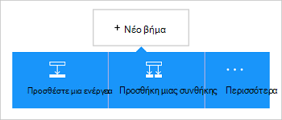

<properties
    pageTitle="Προσθήκη του Office 365 Outlook connector στο εφαρμογές σας λογικής | Microsoft Azure"
    description="Δημιουργία λογικής εφαρμογών με το Office 365 connector για να ενεργοποιήσετε την αλληλεπίδραση με το Office 365. Για παράδειγμα: δημιουργία, επεξεργασία και ενημέρωση των επαφών και των στοιχείων του ημερολογίου."
    services=""    
    documentationCenter=""     
    authors="MandiOhlinger"    
    manager="anneta"    
    editor="" 
    tags="connectors" />

<tags
ms.service="logic-apps"
ms.devlang="na"
ms.topic="article"
ms.tgt_pltfrm="na"
ms.workload="integration"
ms.date="10/18/2016"
ms.author="mandia"/>

# Γρήγορα αποτελέσματα με το Office 365 Outlook connector 

Το Office 365 Outlook connector δίνει τη δυνατότητα επικοινωνίας με το Outlook στο Office 365. Χρησιμοποιήστε αυτή η γραμμή σύνδεσης για να δημιουργήσετε, επεξεργαστείτε, και ενημερώστε τις επαφές και τα στοιχεία ημερολογίου, και, λαμβάνουν επίσης, αποστολή και απάντηση σε μηνύματα ηλεκτρονικού ταχυδρομείου.

Με το Office 365 Outlook, μπορείτε:

- Δημιουργήστε τη ροή εργασίας σας χρησιμοποιώντας τις δυνατότητες ηλεκτρονικού ταχυδρομείου και ημερολογίου στο Office 365. 
- Χρήση εναυσμάτων για να ξεκινήσετε τη ροή εργασίας, όταν υπάρχει ένα νέο μήνυμα ηλεκτρονικού ταχυδρομείου, όταν ενημερώνεται ένα στοιχείο ημερολογίου και πολλά άλλα.
- Χρησιμοποιήστε ενέργειες για να στείλετε ένα μήνυμα ηλεκτρονικού ταχυδρομείου, δημιουργήστε ένα νέο συμβάν ημερολογίου, και πολλά άλλα. Για παράδειγμα, όταν υπάρχει ένα νέο αντικείμενο στο Salesforce (ένα έναυσμα), στείλτε ένα μήνυμα ηλεκτρονικού ταχυδρομείου για το Office 365 Outlook (μια ενέργεια). 

Αυτό το θέμα δείχνει πώς μπορείτε να χρησιμοποιήσετε το Office 365 Outlook connector σε μια εφαρμογή λογικής και εμφανίζει επίσης τις εναύσματα και ενέργειες.

>[AZURE.NOTE] Αυτή η έκδοση του άρθρου ισχύει για εφαρμογές λογικής γενικής διαθεσιμότητας (GA).

Για να μάθετε περισσότερα σχετικά με τις εφαρμογές λογικής, ανατρέξτε στο θέμα [Τι είναι οι εφαρμογές λογικής](../app-service-logic/app-service-logic-what-are-logic-apps.md) και να [δημιουργήσετε μια εφαρμογή λογικής](../app-service-logic/app-service-logic-create-a-logic-app.md).

## Σύνδεση στο Office 365

Πριν από την εφαρμογή της λογικής να αποκτήσετε πρόσβαση σε οποιαδήποτε υπηρεσία, μπορείτε πρώτα να δημιουργήσετε μια *σύνδεση* με την υπηρεσία. Μια σύνδεση παρέχει σύνδεση ανάμεσα σε μια εφαρμογή λογικής και μια άλλη υπηρεσία. Για παράδειγμα, για να συνδεθείτε στο Office 365 στο Outlook, πρέπει πρώτα μια *σύνδεση*στο Office 365. Για να δημιουργήσετε μια σύνδεση, εισαγάγετε τα διαπιστευτήρια που χρησιμοποιείτε για πρόσβαση στην υπηρεσία που θέλετε να συνδεθείτε με κανονικά. Επομένως, με το Office 365 Outlook, πληκτρολογήστε τα διαπιστευτήρια για το λογαριασμό Office 365 για να δημιουργήσετε τη σύνδεση.

## Δημιουργία της σύνδεσης

>[AZURE.INCLUDE [Steps to create a connection to Office 365](../../includes/connectors-create-api-office365-outlook.md)]

## Χρησιμοποιήστε ένα έναυσμα

Ένα έναυσμα είναι ένα συμβάν που μπορούν να χρησιμοποιηθούν για να ξεκινήσετε τη ροή εργασίας που ορίζονται από το σε μια εφαρμογή για λογική. Εναύσματα "ψηφοφορία" της υπηρεσίας στο ένα διάστημα και τη συχνότητα που θέλετε. [Μάθετε περισσότερα σχετικά με τα εναύσματα](../app-service-logic/app-service-logic-what-are-logic-apps.md#logic-app-concepts).

1. Στην εφαρμογή λογικής, πληκτρολογήστε "office 365" για να λάβετε μια λίστα με τα εναύσματα:  

    

2. Επιλέξτε **Office 365 του Outlook - κατά την εκκίνηση του συμβάντος επερχόμενες σύντομα**. Εάν υπάρχει ήδη μια σύνδεση, στη συνέχεια, επιλέξτε ένα ημερολόγιο από την αναπτυσσόμενη λίστα.

    

    Εάν σας ζητηθεί να εισέλθετε, στη συνέχεια, εισαγάγετε το σύμβολο στις λεπτομέρειες για να δημιουργήσετε τη σύνδεση. [Δημιουργία της σύνδεσης](connectors-create-api-office365-outlook.md#create-the-connection) σε αυτό το θέμα παραθέτει τα βήματα. 

    > [AZURE.NOTE] Σε αυτό το παράδειγμα, η εφαρμογή λογικής εκτελείται όταν ενημερώνεται ένα συμβάν ημερολογίου. Για να δείτε τα αποτελέσματα από αυτό το έναυσμα, προσθέστε μια άλλη ενέργεια που σας στέλνει ένα μήνυμα κειμένου. Για παράδειγμα, να προσθέσετε την ενέργεια Twilio *Αποστολή μηνύματος* που κειμένων όταν ξεκινά το συμβάν ημερολογίου σε 15 λεπτά. 

3. Επιλέξτε το κουμπί " **Επεξεργασία** " και ορίστε τις τιμές **συχνότητα** και **διάστημα** . Για παράδειγμα, εάν θέλετε το έναυσμα προς απάντηση κάθε 15 λεπτά, στη συνέχεια ορίστε τη **συχνότητα** **λεπτό**και ορίστε το **χρονικό διάστημα** σε **15**. 

    

4. **Αποθηκεύστε** τις αλλαγές σας (επάνω αριστερή γωνία της γραμμής εργαλείων). Εφαρμογή της λογικής αποθηκεύεται και μπορεί να ενεργοποιηθεί αυτόματα.

## Χρησιμοποιήστε μια ενέργεια

Μια ενέργεια είναι μια ενέργεια που εκτελείται από τη ροή εργασίας που ορίζονται από το σε μια εφαρμογή για λογική. [Μάθετε περισσότερα σχετικά με τις ενέργειες](../app-service-logic/app-service-logic-what-are-logic-apps.md#logic-app-concepts).

1. Επιλέξτε το σύμβολο συν. Μπορείτε να δείτε διάφορες επιλογές: **Προσθήκη μιας ενέργειας**, **Προσθήκη συνθήκης**ή μία από τις **περισσότερες** επιλογές.

    

2. Επιλέξτε **Προσθήκη μιας ενέργειας**.

3. Στο πλαίσιο κειμένου, πληκτρολογήστε "office 365" για να λάβετε μια λίστα με όλες τις διαθέσιμες ενέργειες.

     

4. Στο παράδειγμά μας, επιλέξτε **Office 365 Outlook - Δημιουργία επαφής**. Εάν υπάρχει ήδη μια σύνδεση, στη συνέχεια, επιλέξτε το **Φάκελο Αναγνωριστικό**, **όνομα**και άλλες ιδιότητες:  

    

    Εάν σας ζητηθεί για τις πληροφορίες σύνδεσης, στη συνέχεια, πληκτρολογήστε τις λεπτομέρειες για να δημιουργήσετε τη σύνδεση. [Δημιουργία της σύνδεσης](connectors-create-api-office365-outlook.md#create-the-connection) σε αυτό το θέμα περιγράφει αυτές τις ιδιότητες. 

    > [AZURE.NOTE] Σε αυτό το παράδειγμα, μπορούμε να δημιουργήσουμε μια νέα επαφή στο Office 365 στο Outlook. Μπορείτε να χρησιμοποιήσετε το αποτέλεσμα από κάποιο άλλο έναυσμα για να δημιουργήσετε την επαφή. Για παράδειγμα, προσθέστε το έναυσμα SalesForce *όταν δημιουργείται ένα αντικείμενο* . Στη συνέχεια, προσθέστε την ενέργεια Office 365 Outlook *Δημιουργία επαφής* που χρησιμοποιεί τα πεδία SalesForce για να δημιουργήσετε τη νέα νέα επαφή στο Office 365. 

5. **Αποθηκεύστε** τις αλλαγές σας (επάνω αριστερή γωνία της γραμμής εργαλείων). Εφαρμογή της λογικής αποθηκεύεται και μπορεί να ενεργοποιηθεί αυτόματα.

## Τεχνικές λεπτομέρειες

Εδώ θα βρείτε τις λεπτομέρειες σχετικά με τα εναύσματα, ενέργειες και απαντήσεων που υποστηρίζει αυτήν τη σύνδεση:

## Office 365 εναυσμάτων

|Έναυσμα | Περιγραφή|
|--- | ---|
|[Όταν μια προσεχή εκδήλωση ξεκινήσουν σύντομα](connectors-create-api-office365-outlook.md#when-an-upcoming-event-is-starting-soon)|Αυτή η λειτουργία ενεργοποιεί μια ροή κατά την εκκίνηση του συμβάντος επερχόμενες ημερολογίου.|
|[Όταν φτάνει ένα νέο μήνυμα ηλεκτρονικού ταχυδρομείου](connectors-create-api-office365-outlook.md#when-a-new-email-arrives)|Αυτή η λειτουργία ενεργοποιεί μια ροή όταν λαμβάνετε ένα νέο μήνυμα ηλεκτρονικού ταχυδρομείου|
|[Όταν δημιουργηθεί ένα νέο συμβάν](connectors-create-api-office365-outlook.md#when-a-new-event-is-created)|Αυτή η λειτουργία εκκινεί μια ροή όταν δημιουργείται ένα νέο συμβάν σε ένα ημερολόγιο.|
|[Κατά την τροποποίηση συμβάντος](connectors-create-api-office365-outlook.md#when-an-event-is-modified)|Αυτή η λειτουργία εκκινεί μια ροή όταν ένα συμβάν έχει τροποποιηθεί σε ένα ημερολόγιο.|

## Ενέργειες του Office 365

|Ενέργεια|Περιγραφή|
|--- | ---|
|[Λήψη μηνυμάτων ηλεκτρονικού ταχυδρομείου](connectors-create-api-office365-outlook.md#get-emails)|Αυτή η λειτουργία λαμβάνει μηνύματα ηλεκτρονικού ταχυδρομείου από ένα φάκελο.|
|[Αποστολή μηνύματος ηλεκτρονικού ταχυδρομείου](connectors-create-api-office365-outlook.md#send-an-email)|Αυτή η λειτουργία στέλνει ένα μήνυμα ηλεκτρονικού ταχυδρομείου.|
|[Διαγραφή ηλεκτρονικού ταχυδρομείου](connectors-create-api-office365-outlook.md#delete-email)|Αυτή η λειτουργία διαγράφει ένα μήνυμα ηλεκτρονικού ταχυδρομείου κατά αναγνωριστικό.|
|[Σήμανση ως αναγνωσμένου](connectors-create-api-office365-outlook.md#mark-as-read)|Αυτή η λειτουργία επισημαίνει ένα μήνυμα ηλεκτρονικού ταχυδρομείου ως αναγνωσμένων.|
|[Απάντηση σε μήνυμα ηλεκτρονικού ταχυδρομείου](connectors-create-api-office365-outlook.md#reply-to-email)|Αυτή η λειτουργία απαντήσεις σε μήνυμα ηλεκτρονικού ταχυδρομείου.|
|[Λήψη συνημμένου](connectors-create-api-office365-outlook.md#get-attachment)|Αυτή η λειτουργία αποκτά συνημμένο μηνύματος ηλεκτρονικού ταχυδρομείου κατά αναγνωριστικό.|
|[Αποστολή μηνύματος ηλεκτρονικού ταχυδρομείου με επιλογές](connectors-create-api-office365-outlook.md#send-email-with-options)|Αυτή η λειτουργία στέλνει ένα μήνυμα ηλεκτρονικού ταχυδρομείου με πολλές επιλογές και περιμένει ο παραλήπτης να απαντήσετε ξανά με μία από τις επιλογές.|
|[Αποστολή μηνύματος ηλεκτρονικού ταχυδρομείου έγκρισης](connectors-create-api-office365-outlook.md#send-approval-email)|Αυτή η λειτουργία στέλνει ένα μήνυμα ηλεκτρονικού ταχυδρομείου έγκρισης και περιμένει την απάντηση από τον παραλήπτη.|
|[Λήψη ημερολογίων](connectors-create-api-office365-outlook.md#get-calendars)|Αυτή η λειτουργία παραθέτει τα διαθέσιμα ημερολόγια.|
|[Λήψη συμβάντα](connectors-create-api-office365-outlook.md#get-events)|Αυτή η λειτουργία λαμβάνει συμβάντα από ένα ημερολόγιο.|
|[Δημιουργία συμβάντος](connectors-create-api-office365-outlook.md#create-event)|Αυτή η λειτουργία δημιουργεί ένα νέο συμβάν σε ένα ημερολόγιο.|
|[Λήψη συμβάντος](connectors-create-api-office365-outlook.md#get-event)|Αυτή η λειτουργία λαμβάνει ένα συγκεκριμένο συμβάν από ένα ημερολόγιο.|
|[Διαγραφή συμβάντος](connectors-create-api-office365-outlook.md#delete-event)|Αυτή η λειτουργία διαγράφει ένα συμβάν σε ένα ημερολόγιο.|
|[Ενημέρωση συμβάντος](connectors-create-api-office365-outlook.md#update-event)|Αυτή η λειτουργία ενημερώνει ένα συμβάν σε ένα ημερολόγιο.|
|[Λήψη φακέλους επαφών](connectors-create-api-office365-outlook.md#get-contact-folders)|Αυτή η λειτουργία παραθέτει τους φακέλους οι διαθέσιμες επαφές.|
|[Λήψη επαφών](connectors-create-api-office365-outlook.md#get-contacts)|Αυτή η λειτουργία λαμβάνει τις επαφές από το φάκελο "Επαφές".|
|[Δημιουργία επαφής](connectors-create-api-office365-outlook.md#create-contact)|Αυτή η λειτουργία δημιουργεί μια νέα επαφή στο φάκελο Επαφές.|
|[Λήψη επαφών](connectors-create-api-office365-outlook.md#get-contact)|Αυτή η λειτουργία λαμβάνει μια συγκεκριμένη επαφή από το φάκελο "Επαφές".|
|[Διαγραφή επαφής](connectors-create-api-office365-outlook.md#delete-contact)|Αυτή η λειτουργία διαγράφει μια επαφή από το φάκελο "Επαφές".|
|[Ενημέρωση της επαφής](connectors-create-api-office365-outlook.md#update-contact)|Αυτή η λειτουργία ενημερώνει μια επαφή στο φάκελο Επαφές.|

### Λεπτομέρειες έναυσμα και μια ενέργεια

Σε αυτήν την ενότητα, ανατρέξτε στο θέμα τις συγκεκριμένες λεπτομέρειες σχετικά με κάθε έναυσμα και ενέργεια, συμπεριλαμβανομένων τυχόν απαιτούμενου ή προαιρετικού εισαγωγής ιδιότητες και τις αντίστοιχες εξόδου που σχετίζεται με τη γραμμή σύνδεσης.

#### Σύντομα όταν ξεκινά μια προσεχή εκδήλωση
Αυτή η λειτουργία ενεργοποιεί μια ροή κατά την εκκίνηση του συμβάντος επερχόμενες ημερολογίου. 

|Όνομα ιδιότητας| Εμφανιζόμενο όνομα|Περιγραφή|
| ---|---|---|
|Πίνακας *|Αναγνωριστικό ημερολογίου|Μοναδικό αναγνωριστικό του ημερολογίου|
|lookAheadTimeInMinutes|Εμφάνιση ahead χρόνου|Χρόνος (σε λεπτά) για να αναζητήσετε στο μέλλον προσεχή συμβάντα|

Έναν αστερίσκο (*) σημαίνει ότι η ιδιότητα απαιτείται.

##### Λεπτομέρειες εξόδου
CalendarItemsList: Η λίστα των στοιχείων ημερολογίου

| Όνομα ιδιότητας | Τύπος δεδομένων | Περιγραφή |
|---|---|---|
|τιμή|πίνακα|Λίστα των στοιχείων ημερολογίου|

#### Λήψη μηνυμάτων ηλεκτρονικού ταχυδρομείου
Αυτή η λειτουργία λαμβάνει μηνύματα ηλεκτρονικού ταχυδρομείου από ένα φάκελο. 

|Όνομα ιδιότητας| Εμφανιζόμενο όνομα|Περιγραφή|
| ---|---|---|
|folderPath|Η διαδρομή του φακέλου|Διαδρομή του φακέλου για να ανακτήσετε μηνύματα ηλεκτρονικού ταχυδρομείου (προεπιλογή: "Εισερχόμενα")|
|αρχή|Αρχή|Αριθμός των μηνυμάτων ηλεκτρονικού ταχυδρομείου για να ανακτήσετε (προεπιλογή: 10)|
|fetchOnlyUnread|Λήψη μόνο μη αναγνωσμένων μηνυμάτων|Ανάκτηση μόνο μη αναγνωσμένων μηνυμάτων ηλεκτρονικού ταχυδρομείου;|
|includeAttachments|Συμπερίληψη συνημμένων|Εάν οριστεί στην τιμή true, συνημμένα θα ανακτηθούν επίσης μαζί με το μήνυμα ηλεκτρονικού ταχυδρομείου|
|searchQuery|Ερώτημα αναζήτησης|Ερώτημα αναζήτησης για να φιλτράρετε μηνύματα ηλεκτρονικού ταχυδρομείου|
|Παράλειψη|Παράλειψη|Αριθμός των μηνυμάτων ηλεκτρονικού ταχυδρομείου για να παραλείψετε (προεπιλογή: 0)|
|skipToken|Παράλειψη διακριτικού|Παράλειψη διακριτικό σε νέα σελίδα λήψης|

Έναν αστερίσκο (*) σημαίνει ότι η ιδιότητα απαιτείται.

##### Λεπτομέρειες εξόδου
ReceiveMessage: Λήψη μηνυμάτων ηλεκτρονικού ταχυδρομείου

| Όνομα ιδιότητας | Τύπος δεδομένων | Περιγραφή |
|---|---|---|
|Από το|συμβολοσειρά|Από το|
|Για να|συμβολοσειρά|Για να|
|Θέμα|συμβολοσειρά|Θέμα|
|Σώμα|συμβολοσειρά|Σώμα|
|Σπουδαιότητα|συμβολοσειρά|Σπουδαιότητα|
|HasAttachment|δυαδική τιμή|Έχει συνημμένο|
|Αναγνωριστικό|συμβολοσειρά|Αναγνωριστικό μηνύματος|
|IsRead|δυαδική τιμή|Είναι για ανάγνωση|
|DateTimeReceived|συμβολοσειρά|Ημερομηνία ώρα παραλαβής|
|Συνημμένα|πίνακα|Συνημμένα|
|"Κοιν."|συμβολοσειρά|Καθορίστε διευθύνσεις ηλεκτρονικού ταχυδρομείου, διαχωρισμένα με ελληνικά ερωτηματικά όπωςsomeone@contoso.com|
|Ιδιαίτερη κοινοποίηση|συμβολοσειρά|Καθορίστε διευθύνσεις ηλεκτρονικού ταχυδρομείου, διαχωρισμένα με ελληνικά ερωτηματικά όπωςsomeone@contoso.com|
|IsHtml|δυαδική τιμή|Είναι Html|

#### Αποστολή μηνύματος ηλεκτρονικού ταχυδρομείου
Αυτή η λειτουργία στέλνει ένα μήνυμα ηλεκτρονικού ταχυδρομείου. 

|Όνομα ιδιότητας| Εμφανιζόμενο όνομα|Περιγραφή|
| ---|---|---|
|από το emailMessage *|Μήνυμα ηλεκτρονικού ταχυδρομείου|Μήνυμα ηλεκτρονικού ταχυδρομείου|

Έναν αστερίσκο (*) σημαίνει ότι η ιδιότητα απαιτείται.

##### Λεπτομέρειες εξόδου
Κανένα.

#### Διαγραφή ηλεκτρονικού ταχυδρομείου
Αυτή η λειτουργία διαγράφει ένα μήνυμα ηλεκτρονικού ταχυδρομείου κατά αναγνωριστικό. 

|Όνομα ιδιότητας| Εμφανιζόμενο όνομα|Περιγραφή|
| ---|---|---|
|αναγνωριστικού μηνύματος *|Αναγνωριστικό μηνύματος|Αναγνωριστικό από το μήνυμα ηλεκτρονικού ταχυδρομείου για να διαγράψετε|

Έναν αστερίσκο (*) σημαίνει ότι η ιδιότητα απαιτείται.

##### Λεπτομέρειες εξόδου
Κανένα.

#### Σήμανση ως αναγνωσμένου
Αυτή η λειτουργία επισημαίνει ένα μήνυμα ηλεκτρονικού ταχυδρομείου ως αναγνωσμένων. 

|Όνομα ιδιότητας| Εμφανιζόμενο όνομα|Περιγραφή|
| ---|---|---|
|αναγνωριστικού μηνύματος *|Αναγνωριστικό μηνύματος|Διαβάστε το αναγνωριστικό του μηνύματος ηλεκτρονικού ταχυδρομείου να επισημανθεί ως|

Έναν αστερίσκο (*) σημαίνει ότι η ιδιότητα απαιτείται.

##### Λεπτομέρειες εξόδου
Κανένα.

#### Απάντηση σε μήνυμα ηλεκτρονικού ταχυδρομείου
Αυτή η λειτουργία απαντήσεις σε μήνυμα ηλεκτρονικού ταχυδρομείου. 

|Όνομα ιδιότητας| Εμφανιζόμενο όνομα|Περιγραφή|
| ---|---|---|
|αναγνωριστικού μηνύματος *|Αναγνωριστικό μηνύματος|Αναγνωριστικό από το μήνυμα ηλεκτρονικού ταχυδρομείου για να απαντήσετε σε|
|σχόλιο *|Σχόλιο|Απάντηση σχόλιο|
|replyAll|Απάντηση σε όλους|Απάντηση σε όλους τους παραλήπτες|

Έναν αστερίσκο (*) σημαίνει ότι η ιδιότητα απαιτείται.

##### Λεπτομέρειες εξόδου
Κανένα.

#### Λήψη συνημμένου
Αυτή η λειτουργία αποκτά συνημμένο μηνύματος ηλεκτρονικού ταχυδρομείου κατά αναγνωριστικό. 

|Όνομα ιδιότητας| Εμφανιζόμενο όνομα|Περιγραφή|
| ---|---|---|
|αναγνωριστικού μηνύματος *|Αναγνωριστικό μηνύματος|Αναγνωριστικό από το μήνυμα ηλεκτρονικού ταχυδρομείου|
|attachmentId *|Αναγνωριστικό συνημμένου|Αναγνωριστικό του συνημμένου για να κάνετε λήψη|

Έναν αστερίσκο (*) σημαίνει ότι η ιδιότητα απαιτείται.

##### Λεπτομέρειες εξόδου
Κανένα.

#### Όταν φτάνει ένα νέο μήνυμα ηλεκτρονικού ταχυδρομείου
Αυτή η λειτουργία ενεργοποιεί μια ροή όταν λαμβάνετε ένα νέο μήνυμα ηλεκτρονικού ταχυδρομείου.

|Όνομα ιδιότητας| Εμφανιζόμενο όνομα|Περιγραφή|
| ---|---|---|
|folderPath|Η διαδρομή του φακέλου|Φακέλου ηλεκτρονικού ταχυδρομείου για να ανακτήσετε (προεπιλογή: Εισερχόμενα)|
|Για να|Για να|Διευθύνσεις παραληπτών ηλεκτρονικού ταχυδρομείου|
|από το|Από το|Από τη διεύθυνση|
|Σπουδαιότητα|Σπουδαιότητα|Σπουδαιότητα του μηνύματος ηλεκτρονικού ταχυδρομείου (υψηλή, χαμηλή κανονική) (προεπιλογή: κανονική)|
|fetchOnlyWithAttachment|Έχει συνημμένα|Ανάκτηση μόνο τα μηνύματα ηλεκτρονικού ταχυδρομείου με συνημμένο|
|includeAttachments|Συμπερίληψη συνημμένων|Συμπερίληψη συνημμένων|
|subjectFilter|Θέμα φίλτρου|Συμβολοσειρά για την αναζήτηση στο θέμα|

Έναν αστερίσκο (*) σημαίνει ότι η ιδιότητα απαιτείται.

##### Λεπτομέρειες εξόδου
TriggerBatchResponse [ReceiveMessage]

| Όνομα ιδιότητας | Τύπος δεδομένων |
|---|---|
|τιμή|πίνακα|

#### Αποστολή μηνύματος ηλεκτρονικού ταχυδρομείου με επιλογές
Αυτή η λειτουργία στέλνει ένα μήνυμα ηλεκτρονικού ταχυδρομείου με πολλές επιλογές και περιμένει ο παραλήπτης να απαντήσετε ξανά με μία από τις επιλογές. 

|Όνομα ιδιότητας| Εμφανιζόμενο όνομα|Περιγραφή|
| ---|---|---|
|optionsEmailSubscription *|Αίτηση εγγραφής για το ηλεκτρονικό ταχυδρομείο επιλογές|Αίτηση εγγραφής για το ηλεκτρονικό ταχυδρομείο επιλογές|

Έναν αστερίσκο (*) σημαίνει ότι η ιδιότητα απαιτείται.

##### Λεπτομέρειες εξόδου
SubscriptionResponse: Μοντέλου για εγγραφή στο ηλεκτρονικό ταχυδρομείο έγκρισης

| Όνομα ιδιότητας | Τύπος δεδομένων | Περιγραφή |
|---|---|---|
|αναγνωριστικό|συμβολοσειρά|Αναγνωριστικό της συνδρομής|
|πόρων|συμβολοσειρά|Πόρων της αίτησης συνδρομή|
|notificationType|συμβολοσειρά|Τύπος ειδοποίησης|
|notificationUrl|συμβολοσειρά|Ειδοποίηση διεύθυνσης Url|

#### Αποστολή μηνύματος ηλεκτρονικού ταχυδρομείου έγκρισης
Αυτή η λειτουργία στέλνει ένα μήνυμα ηλεκτρονικού ταχυδρομείου έγκρισης και περιμένει την απάντηση από τον παραλήπτη. 

|Όνομα ιδιότητας| Εμφανιζόμενο όνομα|Περιγραφή|
| ---|---|---|
|approvalEmailSubscription *|Αίτηση εγγραφής για το ηλεκτρονικό ταχυδρομείο έγκρισης|Αίτηση εγγραφής για το ηλεκτρονικό ταχυδρομείο έγκρισης|

Έναν αστερίσκο (*) σημαίνει ότι η ιδιότητα απαιτείται.

##### Λεπτομέρειες εξόδου
SubscriptionResponse: Μοντέλου για εγγραφή στο ηλεκτρονικό ταχυδρομείο έγκρισης

| Όνομα ιδιότητας | Τύπος δεδομένων | Περιγραφή |
|---|---|---|
|αναγνωριστικό|συμβολοσειρά|Αναγνωριστικό της συνδρομής|
|πόρων|συμβολοσειρά|Πόρων της αίτησης συνδρομή|
|notificationType|συμβολοσειρά|Τύπος ειδοποίησης|
|notificationUrl|συμβολοσειρά|Ειδοποίηση διεύθυνσης Url|

#### Λήψη ημερολογίων
Αυτή η λειτουργία παραθέτει τα διαθέσιμα ημερολόγια. 

Δεν υπάρχουν παράμετροι για αυτήν την κλήση.

##### Λεπτομέρειες εξόδου
TablesList

| Όνομα ιδιότητας | Τύπος δεδομένων |
|---|---|
|τιμή|πίνακα|

#### Λήψη συμβάντα
Αυτή η λειτουργία λαμβάνει συμβάντα από ένα ημερολόγιο. 

|Όνομα ιδιότητας| Εμφανιζόμενο όνομα|Περιγραφή|
| ---|---|---|
|Πίνακας *|Αναγνωριστικό ημερολογίου|Επιλέξτε ένα ημερολόγιο|
|$filter|Ερώτημα φίλτρου|Ένα ερώτημα ODATA φίλτρο για να περιορίσετε τις εγγραφές που επιστρέφονται|
|$orderby|Κατάταξη κατά|Ένα ερώτημα orderBy ODATA για να καθορίσετε τη σειρά των καταχωρήσεων|
|$skip|Παράλειψη μέτρησης|Αριθμός καταχωρήσεων για να παραλείψετε (προεπιλογή = 0)|
|$top|Καταμέτρηση μέγιστο λήψη|Μέγιστος αριθμός καταχωρήσεων για την ανάκτηση (προεπιλογή = 256)|

Έναν αστερίσκο (*) σημαίνει ότι η ιδιότητα απαιτείται.

##### Λεπτομέρειες εξόδου
CalendarEventList: Η λίστα των στοιχείων ημερολογίου

| Όνομα ιδιότητας | Τύπος δεδομένων | Περιγραφή |
|---|---|---|
|τιμή|πίνακα|Λίστα των στοιχείων ημερολογίου|

#### Δημιουργία συμβάντος
Αυτή η λειτουργία δημιουργεί ένα νέο συμβάν σε ένα ημερολόγιο. 

|Όνομα ιδιότητας| Εμφανιζόμενο όνομα|Περιγραφή|
| ---|---|---|
|Πίνακας *|Αναγνωριστικό ημερολογίου|Επιλέξτε ένα ημερολόγιο|
|στοιχείο *|Στοιχείο|Για να δημιουργήσετε το συμβάν|

Έναν αστερίσκο (*) σημαίνει ότι η ιδιότητα απαιτείται.

##### Λεπτομέρειες εξόδου
CalendarEvent: Κλάση μοντέλο του σύνδεσης συγκεκριμένο ημερολόγιο συμβάντων.

| Όνομα ιδιότητας | Τύπος δεδομένων | Περιγραφή |
|---|---|---|
|Αναγνωριστικό|συμβολοσειρά|Μοναδικό αναγνωριστικό του συμβάντος.|
|Οι συμμετέχοντες|πίνακα|Λίστα συμμετεχόντων για το συμβάν.|
|Σώμα|δεν έχει οριστεί|Στο σώμα του μηνύματος που σχετίζεται με το συμβάν.|
|BodyPreview|συμβολοσειρά|Η προεπισκόπηση του μηνύματος που σχετίζεται με το συμβάν.|
|Κατηγορίες|πίνακα|Οι κατηγορίες που σχετίζεται με το συμβάν.|
|ChangeKey|συμβολοσειρά|Προσδιορίζει την έκδοση του αντικειμένου συμβάντος. Κάθε φορά που αλλάζει το συμβάν, ChangeKey αλλάζει επίσης.|
|DateTimeCreated|συμβολοσειρά|Η ημερομηνία και ώρα που δημιουργήθηκε το συμβάν.|
|DateTimeLastModified|συμβολοσειρά|Η ημερομηνία και ώρα τελευταίας τροποποίησης το συμβάν.|
|Τέλος|συμβολοσειρά|Την ώρα λήξης του συμβάντος.|
|EndTimeZone|συμβολοσειρά|Καθορίζει τη ζώνη ώρας της σύσκεψης ώρα λήξης. Αυτή η τιμή πρέπει να είναι όπως καθορίζεται στα Windows (παράδειγμα: 'Ώρα Ειρηνικού').|
|HasAttachments|δυαδική τιμή|Ορίστε την τιμή true αν το συμβάν έχει συνημμένα.|
|Σπουδαιότητα|συμβολοσειρά|Τη σπουδαιότητα του συμβάντος: Χαμηλή, κανονική ή υψηλή.|
|IsAllDay|δυαδική τιμή|Ρύθμιση true εάν το συμβάν διαρκεί όλη την ημέρα.|
|IsCancelled|δυαδική τιμή|Ορίστε την τιμή true αν το συμβάν έχει ακυρωθεί.|
|IsOrganizer|δυαδική τιμή|Ρύθμιση true εάν ο αποστολέας του μηνύματος είναι επίσης το διοργανωτή.|
|Θέση|δεν έχει οριστεί|Η θέση του συμβάντος.|
|Οργάνωση|δεν έχει οριστεί|Ο διοργανωτής του συμβάντος.|
|Περιοδικότητας|δεν έχει οριστεί|Το μοτίβο περιοδικότητας για το συμβάν.|
|Υπενθύμιση|Ακέραιος αριθμός|Ώρα σε λεπτά πριν από την έναρξη συμβάντος για να υπενθυμίσετε.|
|ResponseRequested|δυαδική τιμή|Ρύθμιση true εάν ο αποστολέας θέλετε απάντηση όταν το συμβάν είναι έχουν αποδεχτεί ή απορρίψει.|
|ResponseStatus|δεν έχει οριστεί|Υποδεικνύει τον τύπο της απόκρισης στάλθηκαν ως απάντηση σε ένα μήνυμα συμβάντος.|
|SeriesMasterId|συμβολοσειρά|Μοναδικό αναγνωριστικό για τον τύπο υπόδειγμα σειρά συμβάντων.|
|Εμφάνιση ως|συμβολοσειρά|Εμφανίζει ως διαθεσιμότητας.|
|Έναρξη|συμβολοσειρά|Την ώρα έναρξης του συμβάντος.|
|StartTimeZone|συμβολοσειρά|Καθορίζει το χρόνο ώρα έναρξης ζώνη της σύσκεψης. Αυτή η τιμή πρέπει να είναι όπως καθορίζεται στα Windows (παράδειγμα: "Ώρα Ειρηνικού").|
|Θέμα|συμβολοσειρά|Θέμα συμβάν.|
|Τύπος|συμβολοσειρά|Ο τύπος συμβάντος: μία παρουσία, εμφάνιση, εξαίρεση ή υπόδειγμα σειρά.|
|Σύνδεσης Web|συμβολοσειρά|Η προεπισκόπηση του μηνύματος που σχετίζεται με το συμβάν.|

#### Λήψη συμβάντος
Αυτή η λειτουργία λαμβάνει ένα συγκεκριμένο συμβάν από ένα ημερολόγιο. 

|Όνομα ιδιότητας| Εμφανιζόμενο όνομα|Περιγραφή|
| ---|---|---|
|Πίνακας *|Αναγνωριστικό ημερολογίου|Επιλέξτε ένα ημερολόγιο|
|αναγνωριστικό *|Αναγνωριστικό στοιχείου|Επιλέξτε ένα συμβάν|

Έναν αστερίσκο (*) σημαίνει ότι η ιδιότητα απαιτείται.

##### Λεπτομέρειες εξόδου
CalendarEvent: Κλάση μοντέλο του σύνδεσης συγκεκριμένο ημερολόγιο συμβάντων.

| Όνομα ιδιότητας | Τύπος δεδομένων | Περιγραφή |
|---|---|---|
|Αναγνωριστικό|συμβολοσειρά|Μοναδικό αναγνωριστικό του συμβάντος.|
|Οι συμμετέχοντες|πίνακα|Λίστα συμμετεχόντων για το συμβάν.|
|Σώμα|δεν έχει οριστεί|Στο σώμα του μηνύματος που σχετίζεται με το συμβάν.|
|BodyPreview|συμβολοσειρά|Η προεπισκόπηση του μηνύματος που σχετίζεται με το συμβάν.|
|Κατηγορίες|πίνακα|Οι κατηγορίες που σχετίζεται με το συμβάν.|
|ChangeKey|συμβολοσειρά|Προσδιορίζει την έκδοση του αντικειμένου συμβάντος. Κάθε φορά που αλλάζει το συμβάν, ChangeKey αλλάζει επίσης.|
|DateTimeCreated|συμβολοσειρά|Η ημερομηνία και ώρα που δημιουργήθηκε το συμβάν.|
|DateTimeLastModified|συμβολοσειρά|Η ημερομηνία και ώρα τελευταίας τροποποίησης το συμβάν.|
|Τέλος|συμβολοσειρά|Την ώρα λήξης του συμβάντος.|
|EndTimeZone|συμβολοσειρά|Καθορίζει τη ζώνη ώρας της σύσκεψης ώρα λήξης. Αυτή η τιμή πρέπει να είναι όπως καθορίζεται στα Windows (παράδειγμα: 'Ώρα Ειρηνικού').|
|HasAttachments|δυαδική τιμή|Ορίστε την τιμή true αν το συμβάν έχει συνημμένα.|
|Σπουδαιότητα|συμβολοσειρά|Τη σπουδαιότητα του συμβάντος: Χαμηλή, κανονική ή υψηλή.|
|IsAllDay|δυαδική τιμή|Ρύθμιση true εάν το συμβάν διαρκεί όλη την ημέρα.|
|IsCancelled|δυαδική τιμή|Ορίστε την τιμή true αν το συμβάν έχει ακυρωθεί.|
|IsOrganizer|δυαδική τιμή|Ρύθμιση true εάν ο αποστολέας του μηνύματος είναι επίσης το διοργανωτή.|
|Θέση|δεν έχει οριστεί|Η θέση του συμβάντος.|
|Οργάνωση|δεν έχει οριστεί|Ο διοργανωτής του συμβάντος.|
|Περιοδικότητας|δεν έχει οριστεί|Το μοτίβο περιοδικότητας για το συμβάν.|
|Υπενθύμιση|Ακέραιος αριθμός|Ώρα σε λεπτά πριν από την έναρξη συμβάντος για να υπενθυμίσετε.|
|ResponseRequested|δυαδική τιμή|Ρύθμιση true εάν ο αποστολέας θέλετε απάντηση όταν το συμβάν είναι έχουν αποδεχτεί ή απορρίψει.|
|ResponseStatus|δεν έχει οριστεί|Υποδεικνύει τον τύπο της απόκρισης στάλθηκαν ως απάντηση σε ένα μήνυμα συμβάντος.|
|SeriesMasterId|συμβολοσειρά|Μοναδικό αναγνωριστικό για τον τύπο υπόδειγμα σειρά συμβάντων.|
|Εμφάνιση ως|συμβολοσειρά|Εμφανίζει ως διαθεσιμότητας.|
|Έναρξη|συμβολοσειρά|Την ώρα έναρξης του συμβάντος.|
|StartTimeZone|συμβολοσειρά|Καθορίζει το χρόνο ώρα έναρξης ζώνη της σύσκεψης. Αυτή η τιμή πρέπει να είναι όπως καθορίζεται στα Windows (παράδειγμα: "Ώρα Ειρηνικού").|
|Θέμα|συμβολοσειρά|Θέμα συμβάν.|
|Τύπος|συμβολοσειρά|Ο τύπος συμβάντος: μία παρουσία, εμφάνιση, εξαίρεση ή υπόδειγμα σειρά.|
|Σύνδεσης Web|συμβολοσειρά|Η προεπισκόπηση του μηνύματος που σχετίζεται με το συμβάν.|

#### Διαγραφή συμβάντος
Αυτή η λειτουργία διαγράφει ένα συμβάν σε ένα ημερολόγιο. 

|Όνομα ιδιότητας| Εμφανιζόμενο όνομα|Περιγραφή|
| ---|---|---|
|Πίνακας *|Αναγνωριστικό ημερολογίου|Επιλέξτε ένα ημερολόγιο|
|αναγνωριστικό *|Αναγνωριστικό|Επιλέξτε ένα συμβάν|

Έναν αστερίσκο (*) σημαίνει ότι η ιδιότητα απαιτείται.

##### Λεπτομέρειες εξόδου
Κανένα.

#### Ενημέρωση συμβάντος
Αυτή η λειτουργία ενημερώνει ένα συμβάν σε ένα ημερολόγιο. 

|Όνομα ιδιότητας| Εμφανιζόμενο όνομα|Περιγραφή|
| ---|---|---|
|Πίνακας *|Αναγνωριστικό ημερολογίου|Επιλέξτε ένα ημερολόγιο|
|αναγνωριστικό *|Αναγνωριστικό|Επιλέξτε ένα συμβάν|
|στοιχείο *|Στοιχείο|Για να ενημερώσετε το συμβάν|

Έναν αστερίσκο (*) σημαίνει ότι η ιδιότητα απαιτείται.

##### Λεπτομέρειες εξόδου
CalendarEvent: Κλάση μοντέλο του σύνδεσης συγκεκριμένο ημερολόγιο συμβάντων.

| Όνομα ιδιότητας | Τύπος δεδομένων | Περιγραφή |
|---|---|---|
|Αναγνωριστικό|συμβολοσειρά|Μοναδικό αναγνωριστικό του συμβάντος.|
|Οι συμμετέχοντες|πίνακα|Λίστα συμμετεχόντων για το συμβάν.|
|Σώμα|δεν έχει οριστεί|Στο σώμα του μηνύματος που σχετίζεται με το συμβάν.|
|BodyPreview|συμβολοσειρά|Η προεπισκόπηση του μηνύματος που σχετίζεται με το συμβάν.|
|Κατηγορίες|πίνακα|Οι κατηγορίες που σχετίζεται με το συμβάν.|
|ChangeKey|συμβολοσειρά|Προσδιορίζει την έκδοση του αντικειμένου συμβάντος. Κάθε φορά που αλλάζει το συμβάν, ChangeKey αλλάζει επίσης.|
|DateTimeCreated|συμβολοσειρά|Η ημερομηνία και ώρα που δημιουργήθηκε το συμβάν.|
|DateTimeLastModified|συμβολοσειρά|Η ημερομηνία και ώρα τελευταίας τροποποίησης το συμβάν.|
|Τέλος|συμβολοσειρά|Την ώρα λήξης του συμβάντος.|
|EndTimeZone|συμβολοσειρά|Καθορίζει τη ζώνη ώρας της σύσκεψης ώρα λήξης. Αυτή η τιμή πρέπει να είναι όπως καθορίζεται στα Windows (παράδειγμα: 'Ώρα Ειρηνικού').|
|HasAttachments|δυαδική τιμή|Ορίστε την τιμή true αν το συμβάν έχει συνημμένα.|
|Σπουδαιότητα|συμβολοσειρά|Τη σπουδαιότητα του συμβάντος: Χαμηλή, κανονική ή υψηλή.|
|IsAllDay|δυαδική τιμή|Ρύθμιση true εάν το συμβάν διαρκεί όλη την ημέρα.|
|IsCancelled|δυαδική τιμή|Ορίστε την τιμή true αν το συμβάν έχει ακυρωθεί.|
|IsOrganizer|δυαδική τιμή|Ρύθμιση true εάν ο αποστολέας του μηνύματος είναι επίσης το διοργανωτή.|
|Θέση|δεν έχει οριστεί|Η θέση του συμβάντος.|
|Οργάνωση|δεν έχει οριστεί|Ο διοργανωτής του συμβάντος.|
|Περιοδικότητας|δεν έχει οριστεί|Το μοτίβο περιοδικότητας για το συμβάν.|
|Υπενθύμιση|Ακέραιος αριθμός|Ώρα σε λεπτά πριν από την έναρξη συμβάντος για να υπενθυμίσετε.|
|ResponseRequested|δυαδική τιμή|Ρύθμιση true εάν ο αποστολέας θέλετε απάντηση όταν το συμβάν είναι έχουν αποδεχτεί ή απορρίψει.|
|ResponseStatus|δεν έχει οριστεί|Υποδεικνύει τον τύπο της απόκρισης στάλθηκαν ως απάντηση σε ένα μήνυμα συμβάντος.|
|SeriesMasterId|συμβολοσειρά|Μοναδικό αναγνωριστικό για τον τύπο υπόδειγμα σειρά συμβάντων.|
|Εμφάνιση ως|συμβολοσειρά|Εμφανίζει ως διαθεσιμότητας.|
|Έναρξη|συμβολοσειρά|Την ώρα έναρξης του συμβάντος.|
|StartTimeZone|συμβολοσειρά|Καθορίζει το χρόνο ώρα έναρξης ζώνη της σύσκεψης. Αυτή η τιμή πρέπει να είναι όπως καθορίζεται στα Windows (παράδειγμα: "Ώρα Ειρηνικού").|
|Θέμα|συμβολοσειρά|Θέμα συμβάν.|
|Τύπος|συμβολοσειρά|Ο τύπος συμβάντος: μία παρουσία, εμφάνιση, εξαίρεση ή υπόδειγμα σειρά.|
|Σύνδεσης Web|συμβολοσειρά|Η προεπισκόπηση του μηνύματος που σχετίζεται με το συμβάν.|

#### Όταν δημιουργηθεί ένα νέο συμβάν
Αυτή η λειτουργία εκκινεί μια ροή όταν δημιουργείται ένα νέο συμβάν σε ένα ημερολόγιο. 

|Όνομα ιδιότητας| Εμφανιζόμενο όνομα|Περιγραφή|
| ---|---|---|
|Πίνακας *|Αναγνωριστικό ημερολογίου|Επιλέξτε ένα ημερολόγιο|
|$filter|Ερώτημα φίλτρου|Ένα ερώτημα ODATA φίλτρο για να περιορίσετε τις εγγραφές που επιστρέφονται|
|$orderby|Κατάταξη κατά|Ένα ερώτημα orderBy ODATA για να καθορίσετε τη σειρά των καταχωρήσεων|
|$skip|Παράλειψη μέτρησης|Αριθμός καταχωρήσεων για να παραλείψετε (προεπιλογή = 0)|
|$top|Καταμέτρηση μέγιστο λήψη|Μέγιστος αριθμός καταχωρήσεων για την ανάκτηση (προεπιλογή = 256)|

Έναν αστερίσκο (*) σημαίνει ότι η ιδιότητα απαιτείται.

##### Λεπτομέρειες εξόδου
CalendarItemsList: Η λίστα των στοιχείων ημερολογίου

| Όνομα ιδιότητας | Τύπος δεδομένων | Περιγραφή |
|---|---|---|
|τιμή|πίνακα|Λίστα των στοιχείων ημερολογίου|

#### Κατά την τροποποίηση συμβάντος
Αυτή η λειτουργία εκκινεί μια ροή όταν ένα συμβάν έχει τροποποιηθεί σε ένα ημερολόγιο. 

|Όνομα ιδιότητας| Εμφανιζόμενο όνομα|Περιγραφή|
| ---|---|---|
|Πίνακας *|Αναγνωριστικό ημερολογίου|Επιλέξτε ένα ημερολόγιο|
|$filter|Ερώτημα φίλτρου|Ένα ερώτημα ODATA φίλτρο για να περιορίσετε τις εγγραφές που επιστρέφονται|
|$orderby|Κατάταξη κατά|Ένα ερώτημα orderBy ODATA για να καθορίσετε τη σειρά των καταχωρήσεων|
|$skip|Παράλειψη μέτρησης|Αριθμός καταχωρήσεων για να παραλείψετε (προεπιλογή = 0)|
|$top|Καταμέτρηση μέγιστο λήψη|Μέγιστος αριθμός καταχωρήσεων για την ανάκτηση (προεπιλογή = 256)|

Έναν αστερίσκο (*) σημαίνει ότι η ιδιότητα απαιτείται.

##### Λεπτομέρειες εξόδου
CalendarItemsList: Η λίστα των στοιχείων ημερολογίου

| Όνομα ιδιότητας | Τύπος δεδομένων | Περιγραφή |
|---|---|---|
|τιμή|πίνακα|Λίστα των στοιχείων ημερολογίου|

#### Λήψη φακέλους επαφών
Αυτή η λειτουργία παραθέτει τους φακέλους οι διαθέσιμες επαφές. 

Δεν υπάρχουν παράμετροι για αυτήν την κλήση.

##### Λεπτομέρειες εξόδου
TablesList

| Όνομα ιδιότητας | Τύπος δεδομένων |
|---|---|
|τιμή|πίνακα|

#### Λήψη επαφών
Αυτή η λειτουργία λαμβάνει τις επαφές από το φάκελο "Επαφές". 

|Όνομα ιδιότητας| Εμφανιζόμενο όνομα|Περιγραφή|
| ---|---|---|
|Πίνακας *|Αναγνωριστικό φακέλου|Μοναδικό αναγνωριστικό του στο φάκελο επαφών για να ανακτήσετε|
|$filter|Ερώτημα φίλτρου|Ένα ερώτημα ODATA φίλτρο για να περιορίσετε τις εγγραφές που επιστρέφονται|
|$orderby|Κατάταξη κατά|Ένα ερώτημα orderBy ODATA για να καθορίσετε τη σειρά των καταχωρήσεων|
|$skip|Παράλειψη μέτρησης|Αριθμός καταχωρήσεων για να παραλείψετε (προεπιλογή = 0)|
|$top|Καταμέτρηση μέγιστο λήψη|Μέγιστος αριθμός καταχωρήσεων για την ανάκτηση (προεπιλογή = 256)|

Έναν αστερίσκο (*) σημαίνει ότι η ιδιότητα απαιτείται.

##### Λεπτομέρειες εξόδου
ContactList: Η λίστα επαφών

| Όνομα ιδιότητας | Τύπος δεδομένων | Περιγραφή |
|---|---|---|
|τιμή|πίνακα|Λίστα επαφών|

#### Δημιουργία επαφής
Αυτή η λειτουργία δημιουργεί μια νέα επαφή στο φάκελο Επαφές. 

|Όνομα ιδιότητας| Εμφανιζόμενο όνομα|Περιγραφή|
| ---|---|---|
|Πίνακας *|Αναγνωριστικό φακέλου|Επιλέξτε ένα φάκελο επαφών|
|στοιχείο *|Στοιχείο|Επαφή για να δημιουργήσετε|

Έναν αστερίσκο (*) σημαίνει ότι η ιδιότητα απαιτείται.

##### Λεπτομέρειες εξόδου
Επαφή: επαφής

| Όνομα ιδιότητας | Τύπος δεδομένων | Περιγραφή |
|---|---|---|
|Αναγνωριστικό|συμβολοσειρά|Μοναδικό αναγνωριστικό της επαφής.|
|Αναγνωριστικό ParentFolderId για|συμβολοσειρά|Το Αναγνωριστικό της επαφής γονικό φάκελο|
|Γενεθλίων|συμβολοσειρά|Γενέθλια της επαφής.|
|FileAs|συμβολοσειρά|Το όνομα της επαφής έχει αρχειοθετηθεί.|
|Εμφανιζόμενο όνομα|συμβολοσειρά|Εμφανιζόμενο όνομα της επαφής.|
|GivenName|συμβολοσειρά|Όνομα της επαφής.|
|Αρχικά|συμβολοσειρά|Τα αρχικά της επαφής.|
|MiddleName|συμβολοσειρά|Πατρώνυμο της επαφής.|
|Ψευδώνυμο|συμβολοσειρά|Ψευδώνυμο της επαφής.|
|Επώνυμο|συμβολοσειρά|Το επώνυμο της επαφής.|
|Τίτλος|συμβολοσειρά|Ο τίτλος της επαφής.|
|Γενιάς|συμβολοσειρά|Δημιουργία της επαφής.|
|EmailAddresses|πίνακα|Διευθύνσεις ηλεκτρονικού ταχυδρομείου της επαφής.|
|ImAddresses|πίνακα|Τις διευθύνσεις της επαφής ανταλλαγή άμεσων μηνυμάτων (IM).|
|Τίτλος εργασίας|συμβολοσειρά|Τίτλος εργασίας της επαφής.|
|Επωνυμία_εταιρείας|συμβολοσειρά|Το όνομα της εταιρείας της επαφής.|
|Τμήμα|συμβολοσειρά|Τμήμα της επαφής.|
|OfficeLocation|συμβολοσειρά|Η θέση του office της επαφής.|
|Επαγγελματική δραστηριότητα|συμβολοσειρά|Επαγγελματική δραστηριότητα της επαφής.|
|BusinessHomePage|συμβολοσειρά|Η επιχειρηματική αρχική σελίδα της επαφής.|
|AssistantName|συμβολοσειρά|Το όνομα του Βοηθού της επαφής.|
|Διαχείριση|συμβολοσειρά|Το όνομα του διαχειριστή της επαφής.|
|HomePhones|πίνακα|Αριθμοί τηλέφωνο οικίας της επαφής.|
|BusinessPhones|πίνακα|Οι αριθμοί τηλεφώνου της επαφής επιχειρήσεις|
|MobilePhone1|συμβολοσειρά|Αριθμός κινητού τηλεφώνου της επαφής.|
|Διεύθυνση οικίας|δεν έχει οριστεί|Διεύθυνση οικίας της επαφής.|
|BusinessAddress|δεν έχει οριστεί|Διεύθυνση εργασίας της επαφής.|
|OtherAddress|δεν έχει οριστεί|Άλλες διευθύνσεις για την επαφή.|
|YomiCompanyName|συμβολοσειρά|Το όνομα phonetic ιαπωνική εταιρεία της επαφής.|
|YomiGivenName|συμβολοσειρά|Το φωνητικό ιαπωνική δεδομένο όνομα (όνομα) της επαφής.|
|YomiSurname|συμβολοσειρά|Το φωνητικό Ιαπωνικά επώνυμο (Επώνυμο) της επαφής|
|Κατηγορίες|πίνακα|Οι κατηγορίες που σχετίζονται με την επαφή.|
|ChangeKey|συμβολοσειρά|Προσδιορίζει την έκδοση του αντικειμένου συμβάντος|
|DateTimeCreated|συμβολοσειρά|Την ώρα που δημιουργήθηκε στην επαφή.|
|DateTimeLastModified|συμβολοσειρά|Ο χρόνος που τροποποιήθηκαν την επαφή.|

#### Λήψη επαφών
Αυτή η λειτουργία λαμβάνει μια συγκεκριμένη επαφή από το φάκελο "Επαφές". 

|Όνομα ιδιότητας| Εμφανιζόμενο όνομα|Περιγραφή|
| ---|---|---|
|Πίνακας *|Αναγνωριστικό φακέλου|Επιλέξτε ένα φάκελο επαφών|
|αναγνωριστικό *|Αναγνωριστικό στοιχείου|Μοναδικό αναγνωριστικό της επαφής για να ανακτήσετε|

Έναν αστερίσκο (*) σημαίνει ότι η ιδιότητα απαιτείται.

##### Λεπτομέρειες εξόδου
Επαφή: επαφής

| Όνομα ιδιότητας | Τύπος δεδομένων | Περιγραφή |
|---|---|---|
|Αναγνωριστικό|συμβολοσειρά|Μοναδικό αναγνωριστικό της επαφής.|
|Αναγνωριστικό ParentFolderId για|συμβολοσειρά|Το Αναγνωριστικό της επαφής γονικό φάκελο|
|Γενεθλίων|συμβολοσειρά|Γενέθλια της επαφής.|
|FileAs|συμβολοσειρά|Το όνομα της επαφής έχει αρχειοθετηθεί.|
|Εμφανιζόμενο όνομα|συμβολοσειρά|Εμφανιζόμενο όνομα της επαφής.|
|GivenName|συμβολοσειρά|Όνομα της επαφής.|
|Αρχικά|συμβολοσειρά|Τα αρχικά της επαφής.|
|MiddleName|συμβολοσειρά|Πατρώνυμο της επαφής.|
|Ψευδώνυμο|συμβολοσειρά|Ψευδώνυμο της επαφής.|
|Επώνυμο|συμβολοσειρά|Το επώνυμο της επαφής.|
|Τίτλος|συμβολοσειρά|Ο τίτλος της επαφής.|
|Γενιάς|συμβολοσειρά|Δημιουργία της επαφής.|
|EmailAddresses|πίνακα|Διευθύνσεις ηλεκτρονικού ταχυδρομείου της επαφής.|
|ImAddresses|πίνακα|Τις διευθύνσεις της επαφής ανταλλαγή άμεσων μηνυμάτων (IM).|
|Τίτλος εργασίας|συμβολοσειρά|Τίτλος εργασίας της επαφής.|
|Επωνυμία_εταιρείας|συμβολοσειρά|Το όνομα της εταιρείας της επαφής.|
|Τμήμα|συμβολοσειρά|Τμήμα της επαφής.|
|OfficeLocation|συμβολοσειρά|Η θέση του office της επαφής.|
|Επαγγελματική δραστηριότητα|συμβολοσειρά|Επαγγελματική δραστηριότητα της επαφής.|
|BusinessHomePage|συμβολοσειρά|Η επιχειρηματική αρχική σελίδα της επαφής.|
|AssistantName|συμβολοσειρά|Το όνομα του Βοηθού της επαφής.|
|Διαχείριση|συμβολοσειρά|Το όνομα του διαχειριστή της επαφής.|
|HomePhones|πίνακα|Αριθμοί τηλέφωνο οικίας της επαφής.|
|BusinessPhones|πίνακα|Οι αριθμοί τηλεφώνου της επαφής επιχειρήσεις|
|MobilePhone1|συμβολοσειρά|Αριθμός κινητού τηλεφώνου της επαφής.|
|Διεύθυνση οικίας|δεν έχει οριστεί|Διεύθυνση οικίας της επαφής.|
|BusinessAddress|δεν έχει οριστεί|Διεύθυνση εργασίας της επαφής.|
|OtherAddress|δεν έχει οριστεί|Άλλες διευθύνσεις για την επαφή.|
|YomiCompanyName|συμβολοσειρά|Το όνομα phonetic ιαπωνική εταιρεία της επαφής.|
|YomiGivenName|συμβολοσειρά|Το φωνητικό ιαπωνική δεδομένο όνομα (όνομα) της επαφής.|
|YomiSurname|συμβολοσειρά|Το φωνητικό Ιαπωνικά επώνυμο (Επώνυμο) της επαφής|
|Κατηγορίες|πίνακα|Οι κατηγορίες που σχετίζονται με την επαφή.|
|ChangeKey|συμβολοσειρά|Προσδιορίζει την έκδοση του αντικειμένου συμβάντος|
|DateTimeCreated|συμβολοσειρά|Την ώρα που δημιουργήθηκε στην επαφή.|
|DateTimeLastModified|συμβολοσειρά|Ο χρόνος που τροποποιήθηκαν την επαφή.|

#### Διαγραφή επαφής
Αυτή η λειτουργία διαγράφει μια επαφή από το φάκελο "Επαφές". 

|Όνομα ιδιότητας| Εμφανιζόμενο όνομα|Περιγραφή|
| ---|---|---|
|Πίνακας *|Αναγνωριστικό φακέλου|Επιλέξτε ένα φάκελο επαφών|
|αναγνωριστικό *|Αναγνωριστικό|Μοναδικό αναγνωριστικό της επαφής για να διαγράψετε|

Έναν αστερίσκο (*) σημαίνει ότι η ιδιότητα απαιτείται.

##### Λεπτομέρειες εξόδου
Κανένα.

#### Ενημέρωση της επαφής
Αυτή η λειτουργία ενημερώνει μια επαφή στο φάκελο Επαφές. 

|Όνομα ιδιότητας| Εμφανιζόμενο όνομα|Περιγραφή|
| ---|---|---|
|Πίνακας *|Αναγνωριστικό φακέλου|Επιλέξτε ένα φάκελο επαφών|
|αναγνωριστικό *|Αναγνωριστικό|Μοναδικό αναγνωριστικό της επαφής για να ενημερώσετε|
|στοιχείο *|Στοιχείο|Στοιχείο επαφής για να ενημερώσετε|

Έναν αστερίσκο (*) σημαίνει ότι η ιδιότητα απαιτείται.

##### Λεπτομέρειες εξόδου
Επαφή: επαφής

| Όνομα ιδιότητας | Τύπος δεδομένων | Περιγραφή |
|---|---|---|
|Αναγνωριστικό|συμβολοσειρά|Μοναδικό αναγνωριστικό της επαφής.|
|Αναγνωριστικό ParentFolderId για|συμβολοσειρά|Το Αναγνωριστικό της επαφής γονικό φάκελο|
|Γενεθλίων|συμβολοσειρά|Γενέθλια της επαφής.|
|FileAs|συμβολοσειρά|Το όνομα της επαφής έχει αρχειοθετηθεί.|
|Εμφανιζόμενο όνομα|συμβολοσειρά|Εμφανιζόμενο όνομα της επαφής.|
|GivenName|συμβολοσειρά|Όνομα της επαφής.|
|Αρχικά|συμβολοσειρά|Τα αρχικά της επαφής.|
|MiddleName|συμβολοσειρά|Πατρώνυμο της επαφής.|
|Ψευδώνυμο|συμβολοσειρά|Ψευδώνυμο της επαφής.|
|Επώνυμο|συμβολοσειρά|Το επώνυμο της επαφής.|
|Τίτλος|συμβολοσειρά|Ο τίτλος της επαφής.|
|Γενιάς|συμβολοσειρά|Δημιουργία της επαφής.|
|EmailAddresses|πίνακα|Διευθύνσεις ηλεκτρονικού ταχυδρομείου της επαφής.|
|ImAddresses|πίνακα|Τις διευθύνσεις της επαφής ανταλλαγή άμεσων μηνυμάτων (IM).|
|Τίτλος εργασίας|συμβολοσειρά|Τίτλος εργασίας της επαφής.|
|Επωνυμία_εταιρείας|συμβολοσειρά|Το όνομα της εταιρείας της επαφής.|
|Τμήμα|συμβολοσειρά|Τμήμα της επαφής.|
|OfficeLocation|συμβολοσειρά|Η θέση του office της επαφής.|
|Επαγγελματική δραστηριότητα|συμβολοσειρά|Επαγγελματική δραστηριότητα της επαφής.|
|BusinessHomePage|συμβολοσειρά|Η επιχειρηματική αρχική σελίδα της επαφής.|
|AssistantName|συμβολοσειρά|Το όνομα του Βοηθού της επαφής.|
|Διαχείριση|συμβολοσειρά|Το όνομα του διαχειριστή της επαφής.|
|HomePhones|πίνακα|Αριθμοί τηλέφωνο οικίας της επαφής.|
|BusinessPhones|πίνακα|Οι αριθμοί τηλεφώνου της επαφής επιχειρήσεις|
|MobilePhone1|συμβολοσειρά|Αριθμός κινητού τηλεφώνου της επαφής.|
|Διεύθυνση οικίας|δεν έχει οριστεί|Διεύθυνση οικίας της επαφής.|
|BusinessAddress|δεν έχει οριστεί|Διεύθυνση εργασίας της επαφής.|
|OtherAddress|δεν έχει οριστεί|Άλλες διευθύνσεις για την επαφή.|
|YomiCompanyName|συμβολοσειρά|Το όνομα phonetic ιαπωνική εταιρεία της επαφής.|
|YomiGivenName|συμβολοσειρά|Το φωνητικό ιαπωνική δεδομένο όνομα (όνομα) της επαφής.|
|YomiSurname|συμβολοσειρά|Το φωνητικό Ιαπωνικά επώνυμο (Επώνυμο) της επαφής|
|Κατηγορίες|πίνακα|Οι κατηγορίες που σχετίζονται με την επαφή.|
|ChangeKey|συμβολοσειρά|Προσδιορίζει την έκδοση του αντικειμένου συμβάντος|
|DateTimeCreated|συμβολοσειρά|Την ώρα που δημιουργήθηκε στην επαφή.|
|DateTimeLastModified|συμβολοσειρά|Ο χρόνος που τροποποιήθηκαν την επαφή.|

## HTTP απαντήσεων

Ενεργειών και των παραπάνω εναύσματα μπορεί να επιστρέψει ένα ή περισσότερα από τους ακόλουθους κωδικούς κατάστασης HTTP: 

|Όνομα|Περιγραφή|
|---|---|
|200|Ok|
|202|Αποδοχή|
|400|Ακατάλληλη αίτηση|
|401|Μη εξουσιοδοτημένο|
|403|Δεν επιτρέπεται|
|404|Δεν βρέθηκε|
|500|Εσωτερικό σφάλμα διακομιστή. Άγνωστο σφάλμα|
|προεπιλεγμένη|Απέτυχε η λειτουργία.|

## Επόμενα βήματα

[Δημιουργία μιας εφαρμογής λογικής](../app-service-logic/app-service-logic-create-a-logic-app.md). Εξερευνήστε τις διαθέσιμες συνδέσεις σε εφαρμογές της λογικής στο μας [APIs λίστας](apis-list.md).