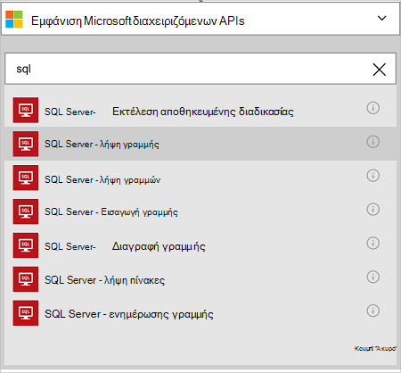
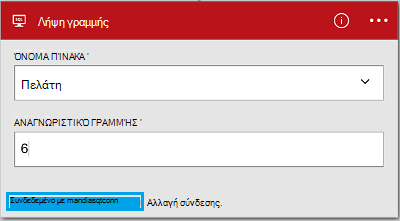

<properties
    pageTitle="Προσθέστε τη γραμμή σύνδεσης βάσης δεδομένων SQL Azure στο εφαρμογές σας λογικής | Microsoft Azure"
    description="Επισκόπηση της σύνδεσης βάσης δεδομένων SQL Azure με παραμέτρους REST API"
    services=""
    documentationCenter="" 
    authors="MandiOhlinger"
    manager="anneta"
    editor=""
    tags="connectors"/>

<tags
   ms.service="logic-apps"
   ms.devlang="na"
   ms.topic="article"
   ms.tgt_pltfrm="na"
   ms.workload="na" 
   ms.date="10/18/2016"
   ms.author="mandia"/>

# Γρήγορα αποτελέσματα με τη γραμμή σύνδεσης βάσης δεδομένων SQL Azure
Χρησιμοποιώντας τη γραμμή σύνδεσης βάσης δεδομένων SQL Azure, δημιουργήστε ροές εργασίας για την εταιρεία σας που διαχειρίζεστε τα δεδομένα στους πίνακές σας. 

Με βάση δεδομένων SQL, μπορείτε:

- Δημιουργία ροής εργασίας σας, προσθέτοντας ένα νέο πελάτη σε μια βάση δεδομένων πελάτες ή ενημέρωση μιας παραγγελίας σε μια βάση δεδομένων παραγγελιών.
- Χρησιμοποιήστε ενέργειες για να λάβετε μια γραμμή δεδομένων, εισαγάγετε μια νέα γραμμή και ακόμη και να διαγράψετε. Για παράδειγμα, όταν δημιουργείται μια εγγραφή στο Dynamics CRM Online (ένα έναυσμα), στη συνέχεια, εισαγάγετε μια γραμμή σε μια βάση δεδομένων SQL Azure (μια ενέργεια). 

Αυτό το θέμα δείχνει πώς μπορείτε να χρησιμοποιήσετε τη γραμμή σύνδεσης βάσης δεδομένων SQL σε μια εφαρμογή λογικής και εμφανίζει επίσης τις ενέργειες.

>[AZURE.NOTE] Αυτή η έκδοση του άρθρου ισχύει για εφαρμογές λογικής γενικής διαθεσιμότητας (GA). 

Για να μάθετε περισσότερα σχετικά με τις εφαρμογές λογικής, ανατρέξτε στο θέμα [Τι είναι οι εφαρμογές λογικής](../app-service-logic/app-service-logic-what-are-logic-apps.md) και να [δημιουργήσετε μια εφαρμογή λογικής](../app-service-logic/app-service-logic-create-a-logic-app.md).

## Σύνδεση με βάση δεδομένων SQL Azure

Πριν από την εφαρμογή της λογικής να αποκτήσετε πρόσβαση σε οποιαδήποτε υπηρεσία, μπορείτε πρώτα να δημιουργήσετε μια *σύνδεση* με την υπηρεσία. Μια σύνδεση παρέχει σύνδεση ανάμεσα σε μια εφαρμογή λογικής και μια άλλη υπηρεσία. Για παράδειγμα, για να συνδεθείτε με βάση δεδομένων SQL, μπορείτε πρώτα να δημιουργήσετε μια βάση δεδομένων SQL *σύνδεσης*. Για να δημιουργήσετε μια σύνδεση, μπορείτε να εισαγάγετε τα διαπιστευτήρια που χρησιμοποιείτε συνήθως για να αποκτήσετε πρόσβαση στην υπηρεσία που πρόκειται να συνδεθείτε με. Επομένως, σε βάση δεδομένων SQL, εισαγάγετε τα διαπιστευτήριά σας βάση δεδομένων SQL για να δημιουργήσετε τη σύνδεση. 

#### Δημιουργία της σύνδεσης

>[AZURE.INCLUDE [Create the connection to SQL Azure](../../includes/connectors-create-api-sqlazure.md)]

## Χρησιμοποιήστε ένα έναυσμα

Αυτή η γραμμή σύνδεσης δεν διαθέτει τα εναύσματα. Χρήση άλλων εναυσμάτων για να ξεκινήσετε την εφαρμογή λογικής, όπως ένα έναυσμα Περιοδικότητα, ένα έναυσμα HTTP Webhook, εναύσματα είναι διαθέσιμη με άλλες γραμμές σύνδεσης και πολλά άλλα. [Δημιουργία μιας εφαρμογής λογική](../app-service-logic/app-service-logic-create-a-logic-app.md) παρέχει ένα παράδειγμα.

## Χρησιμοποιήστε μια ενέργεια
    
Μια ενέργεια είναι μια ενέργεια που εκτελείται από τη ροή εργασίας που ορίζονται από το σε μια εφαρμογή για λογική. [Μάθετε περισσότερα σχετικά με τις ενέργειες](../app-service-logic/app-service-logic-what-are-logic-apps.md#logic-app-concepts).

1. Επιλέξτε το σύμβολο συν. Μπορείτε να δείτε διάφορες επιλογές: **Προσθήκη μιας ενέργειας**, **Προσθήκη συνθήκης**ή μία από τις **περισσότερες** επιλογές.

    

2. Επιλέξτε **Προσθήκη μιας ενέργειας**.

3. Στο πλαίσιο κειμένου, πληκτρολογήστε "sql" για να λάβετε μια λίστα με όλες τις διαθέσιμες ενέργειες.

     

4. Στο παράδειγμά μας, επιλέξτε **SQL Server - λήψη γραμμής**. Εάν υπάρχει ήδη μια σύνδεση, στη συνέχεια, επιλέξτε το **όνομα του πίνακα** από την αναπτυσσόμενη λίστα και πληκτρολογήστε το **Αναγνωριστικό γραμμής** που θέλετε να επιστραφεί.

    

    Εάν σας ζητηθεί για τις πληροφορίες σύνδεσης, στη συνέχεια, πληκτρολογήστε τις λεπτομέρειες για να δημιουργήσετε τη σύνδεση. [Δημιουργία της σύνδεσης](connectors-create-api-sqlazure.md#create-the-connection) σε αυτό το θέμα περιγράφει αυτές τις ιδιότητες. 

    > [AZURE.NOTE] Σε αυτό το παράδειγμα, θα σας να επιστρέψει μια γραμμή από έναν πίνακα. Για να δείτε τα δεδομένα σε αυτήν τη γραμμή, προσθέστε μια άλλη ενέργεια που δημιουργεί ένα αρχείο χρησιμοποιώντας τα πεδία από τον πίνακα. Για παράδειγμα, προσθέστε μια ενέργεια OneDrive που χρησιμοποιεί τα πεδία όνομα και επώνυμο για να δημιουργήσετε ένα νέο αρχείο στο λογαριασμό χώρο αποθήκευσης στο cloud. 

5. **Αποθηκεύστε** τις αλλαγές σας (επάνω αριστερή γωνία της γραμμής εργαλείων). Εφαρμογή της λογικής αποθηκεύεται και μπορεί να ενεργοποιηθεί αυτόματα.

## Τεχνικές λεπτομέρειες

## Ενέργειες της βάσης δεδομένων SQL
Μια ενέργεια είναι μια ενέργεια που εκτελείται από τη ροή εργασίας που ορίζονται από το σε μια εφαρμογή για λογική. Η γραμμή σύνδεσης βάσης δεδομένων SQL περιλαμβάνει τις ακόλουθες ενέργειες. 

|Ενέργεια|Περιγραφή|
|--- | ---|
|[ExecuteProcedure](connectors-create-api-sqlazure.md#execute-stored-procedure)|Εκτελεί μια αποθηκευμένη διαδικασία σε SQL|
|[GetRow](connectors-create-api-sqlazure.md#get-row)|Ανακτά μία γραμμή από έναν πίνακα SQL|
|[Λήψης αποτελεσμάτων γραμμής](connectors-create-api-sqlazure.md#get-rows)|Ανακτά γραμμές από έναν πίνακα SQL|
|[InsertRow](connectors-create-api-sqlazure.md#insert-row)|Εισάγει μια νέα γραμμή σε έναν πίνακα SQL|
|[DeleteRow](connectors-create-api-sqlazure.md#delete-row)|Διαγραφή γραμμής από έναν πίνακα SQL|
|[GetTables](connectors-create-api-sqlazure.md#get-tables)|Ανακτά πινάκων από μια βάση δεδομένων SQL|
|[UpdateRow](connectors-create-api-sqlazure.md#update-row)|Ενημερώνει μια υπάρχουσα γραμμή σε έναν πίνακα SQL|

### Λεπτομέρειες ενέργειας

Σε αυτήν την ενότητα, ανατρέξτε στο θέμα τις συγκεκριμένες λεπτομέρειες σχετικά με κάθε ενέργεια, συμπεριλαμβανομένων τυχόν απαιτούμενου ή προαιρετικού εισαγωγής ιδιότητες και τις αντίστοιχες εξόδου που σχετίζεται με τη γραμμή σύνδεσης.

#### Εκτέλεση αποθηκευμένης διαδικασίας
Εκτελεί μια αποθηκευμένη διαδικασία σε SQL.  

| Όνομα ιδιότητας| Εμφανιζόμενο όνομα |Περιγραφή|
| ---|---|---|
|η διαδικασία * | Το όνομα της διαδικασίας | Το όνομα της αποθηκευμένης διαδικασίας που θέλετε να εκτελεί |
|παράμετροι * | Παράμετροι εισόδου | Οι παράμετροι είναι δυναμική και με βάση την αποθηκευμένη διαδικασία που επιλέγετε.    Για παράδειγμα, εάν χρησιμοποιείτε το δείγμα βάσης δεδομένων Adventure Works, επιλέξτε τη διαδικασία *ufnGetCustomerInformation* είναι αποθηκευμένα. Εμφανίζεται η παράμετρος εισόδου **Αναγνωριστικό πελάτη** . Πληκτρολογήστε "6" ή ένα από τα άλλα πελατών αναγνωριστικά. |

Έναν αστερίσκο (*) σημαίνει ότι η ιδιότητα απαιτείται.

##### Λεπτομέρειες εξόδου
ProcedureResult: Αποτέλεσμα από την αποθηκευμένη διαδικασία εκτέλεσης φέρει

| Όνομα ιδιότητας | Τύπος δεδομένων | Περιγραφή |
|---|---|---|
|OutputParameters|αντικείμενο|Τιμές παραμέτρων εξόδου |
|ReturnCode|Ακέραιος αριθμός|Κωδικός επιστροφής διαδικασίας |
|Των συνόλων αποτελεσμάτων|αντικείμενο| Σύνολα αποτελεσμάτων|

#### Λήψη γραμμής 
Ανακτά μία γραμμή από έναν πίνακα SQL.  

| Όνομα ιδιότητας| Εμφανιζόμενο όνομα |Περιγραφή|
| ---|---|---|
|Πίνακας * | Όνομα πίνακα |Όνομα πίνακα SQL|
|αναγνωριστικό * | Αναγνωριστικό γραμμής |Μοναδικό αναγνωριστικό της γραμμής για να ανακτήσετε|

Έναν αστερίσκο (*) σημαίνει ότι η ιδιότητα απαιτείται.

##### Λεπτομέρειες εξόδου
Στοιχείο

| Όνομα ιδιότητας | Τύπος δεδομένων |
|---|---|
|ItemInternalId|συμβολοσειρά|

#### Λήψη γραμμών 
Ανακτά γραμμές από έναν πίνακα SQL.  

|Όνομα ιδιότητας| Εμφανιζόμενο όνομα|Περιγραφή|
| ---|---|---|
|Πίνακας *|Όνομα πίνακα|Όνομα πίνακα SQL|
|$skip|Παράλειψη μέτρησης|Αριθμός καταχωρήσεων για να παραλείψετε (προεπιλογή = 0)|
|$top|Καταμέτρηση μέγιστο λήψη|Μέγιστος αριθμός καταχωρήσεων για την ανάκτηση (προεπιλογή = 256)|
|$filter|Ερώτημα φίλτρου|Ένα ερώτημα ODATA φίλτρο για να περιορίσετε τον αριθμό των καταχωρήσεων|
|$orderby|Κατάταξη κατά|Ένα ερώτημα orderBy ODATA για να καθορίσετε τη σειρά των καταχωρήσεων|

Έναν αστερίσκο (*) σημαίνει ότι η ιδιότητα απαιτείται.

##### Λεπτομέρειες εξόδου
ItemsList

| Όνομα ιδιότητας | Τύπος δεδομένων |
|---|---|
|τιμή|πίνακα|

#### Εισαγωγή γραμμής 
Εισάγει μια νέα γραμμή σε έναν πίνακα SQL.  

|Όνομα ιδιότητας| Εμφανιζόμενο όνομα|Περιγραφή|
| ---|---|---|
|Πίνακας *|Όνομα πίνακα|Όνομα πίνακα SQL|
|στοιχείο *|Γραμμή|Γραμμή για να εισαγάγετε στο καθορισμένο πίνακα σε SQL|

Έναν αστερίσκο (*) σημαίνει ότι η ιδιότητα απαιτείται.

##### Λεπτομέρειες εξόδου
Στοιχείο

| Όνομα ιδιότητας | Τύπος δεδομένων |
|---|---|
|ItemInternalId|συμβολοσειρά|

#### Διαγραφή γραμμής 
Διαγραφή γραμμής από έναν πίνακα SQL.  

|Όνομα ιδιότητας| Εμφανιζόμενο όνομα|Περιγραφή|
| ---|---|---|
|Πίνακας *|Όνομα πίνακα|Όνομα πίνακα SQL|
|αναγνωριστικό *|Αναγνωριστικό γραμμής|Μοναδικό αναγνωριστικό της γραμμής για να διαγράψετε|

Έναν αστερίσκο (*) σημαίνει ότι η ιδιότητα απαιτείται.

##### Λεπτομέρειες εξόδου
Κανένα.

#### Έχετε πίνακες 
Ανακτά πινάκων από μια βάση δεδομένων SQL.  

Δεν υπάρχουν παράμετροι για αυτήν την κλήση. 

##### Λεπτομέρειες εξόδου 
TablesList

| Όνομα ιδιότητας | Τύπος δεδομένων |
|---|---|
|τιμή|πίνακα|

#### Ενημέρωση γραμμής 
Ενημερώνει μια υπάρχουσα γραμμή σε έναν πίνακα SQL.  

|Όνομα ιδιότητας| Εμφανιζόμενο όνομα|Περιγραφή|
| ---|---|---|
|Πίνακας *|Όνομα πίνακα|Όνομα πίνακα SQL|
|αναγνωριστικό *|Αναγνωριστικό γραμμής|Μοναδικό αναγνωριστικό της γραμμής για να ενημερώσετε|
|στοιχείο *|Γραμμή|Γραμμή με τις ενημερωμένες τιμές|

Έναν αστερίσκο (*) σημαίνει ότι η ιδιότητα απαιτείται.

##### Λεπτομέρειες εξόδου  
Στοιχείο

| Όνομα ιδιότητας | Τύπος δεδομένων |
|---|---|
|ItemInternalId|συμβολοσειρά|

### HTTP απαντήσεων

Κατά την πραγματοποίηση κλήσεων για τις διαφορετικές ενέργειες, ενδέχεται να λάβετε ορισμένες απαντήσεις. Ο παρακάτω πίνακας περιγράφει τις απαντήσεις και τις περιγραφές τους:  

|Όνομα|Περιγραφή|
|---|---|
|200|Ok|
|202|Αποδοχή|
|400|Ακατάλληλη αίτηση|
|401|Μη εξουσιοδοτημένο|
|403|Δεν επιτρέπεται|
|404|Δεν βρέθηκε|
|500|Εσωτερικό σφάλμα διακομιστή. Άγνωστο σφάλμα|
|προεπιλεγμένη|Απέτυχε η λειτουργία.|

## Επόμενα βήματα

[Δημιουργία μιας εφαρμογής λογικής](../app-service-logic/app-service-logic-create-a-logic-app.md). Εξερευνήστε τις διαθέσιμες συνδέσεις σε εφαρμογές της λογικής στο μας [APIs λίστα](apis-list.md).
