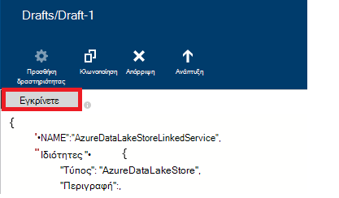

<properties
    pageTitle="Μετακίνηση δεδομένων προς/από χώρο αποθήκευσης λίμνης δεδομένων Azure | Εργοστασιακές Azure δεδομένων"
    description="Μάθετε πώς μπορείτε να μετακινήσετε δεδομένων προς/από χρησιμοποιώντας εργοστασίου δεδομένων Azure χώρου αποθήκευσης λίμνης δεδομένων Azure"
    services="data-factory"
    documentationCenter=""
    authors="linda33wj"
    manager="jhubbard"
    editor="monicar"/>

<tags
    ms.service="data-factory"
    ms.workload="data-services"
    ms.tgt_pltfrm="na"
    ms.devlang="na"
    ms.topic="article"
    ms.date="09/27/2016"
    ms.author="jingwang"/>

# Μετακίνηση δεδομένων από και προς χρήση εργοστασίου δεδομένων Azure χώρου αποθήκευσης λίμνης δεδομένων Azure
Σε αυτό το άρθρο περιγράφει πώς μπορείτε να χρησιμοποιήσετε τη δραστηριότητα αντίγραφο του ενός εργοστασίου Azure δεδομένων για τη μετακίνηση δεδομένων από/προς χώρου αποθήκευσης λίμνης Azure δεδομένων προς/από άλλο χώρο αποθήκευσης δεδομένων. Σε αυτό το άρθρο δημιουργεί στο το άρθρο [δραστηριότητες κίνηση δεδομένων](data-factory-data-movement-activities.md) , το οποίο παρουσιάζει μια γενική επισκόπηση κίνηση δεδομένων με τη δραστηριότητα αντίγραφο και τους συνδυασμούς αποθήκευσης δεδομένων που υποστηρίζονται.

> [AZURE.NOTE]
> Δημιουργήστε ένα λογαριασμό χώρου αποθήκευσης λίμνης δεδομένων Azure πριν να δημιουργήσετε μια διαδικασία με μια δραστηριότητα αντίγραφο για τη μετακίνηση δεδομένων προς/από ένα κατάστημα Azure λίμνης δεδομένων. Για να μάθετε σχετικά με το χώρο αποθήκευσης λίμνης Azure δεδομένων, ανατρέξτε στο θέμα [Γρήγορα αποτελέσματα με το χώρο αποθήκευσης λίμνης Azure δεδομένων](../data-lake-store/data-lake-store-get-started-portal.md).
>  
> Αναθεώρηση [Δημιουργήστε το πρώτο πρόγραμμα εκμάθησης διαδικασία](data-factory-build-your-first-pipeline.md) για λεπτομερή βήματα για να δημιουργήσετε μια προέλευση δεδομένων, συνδεδεμένες υπηρεσίες, σύνολα δεδομένων και μια διαδικασία. Χρησιμοποιήστε τα τμήματα κώδικα JSON με το πρόγραμμα επεξεργασίας εργοστασίου δεδομένων ή Visual Studio ή Azure PowerShell για τη δημιουργία του οντοτήτων εργοστασίου δεδομένων.

## Αντιγραφή δεδομένων οδηγού
Ο ευκολότερος τρόπος για να δημιουργήσετε μια διαδικασία που αντιγράφει δεδομένων προς/από χώρο αποθήκευσης λίμνης Azure δεδομένων είναι να χρησιμοποιήσετε τον Οδηγό δεδομένων αντιγράφου. Ανατρέξτε στο θέμα [πρόγραμμα εκμάθησης: δημιουργία μιας διοχέτευσης χρήση οδηγού αντιγραφής](data-factory-copy-data-wizard-tutorial.md) για γρήγορη αναλυτικές οδηγίες σχετικά με τη δημιουργία μιας διοχέτευσης χρησιμοποιώντας τον Οδηγό δεδομένων αντιγράφου. 

Τα παρακάτω παραδείγματα παρέχουν ορισμούς JSON δείγμα που μπορείτε να χρησιμοποιήσετε για να δημιουργήσετε μια διαδικασία χρησιμοποιώντας την [πύλη του Azure](data-factory-copy-activity-tutorial-using-azure-portal.md) ή [Visual Studio](data-factory-copy-activity-tutorial-using-visual-studio.md) ή [Azure PowerShell](data-factory-copy-activity-tutorial-using-powershell.md). Εμφανίζονται πώς μπορείτε να αντιγράψετε δεδομένα προς και από το χώρο αποθήκευσης λίμνης δεδομένων Azure και χώρο αποθήκευσης Blob του Azure. Ωστόσο, δεδομένων μπορεί να είναι αντίγραφο **απευθείας** από οποιαδήποτε από τις προελεύσεις σε οποιαδήποτε από τα δέκτες αναφέρεται [εδώ](data-factory-data-movement-activities.md#supported-data-stores) χρησιμοποιώντας τη δραστηριότητα αντίγραφο του Azure εργοστασίου δεδομένων.  

## Δείγμα: Αντιγράψτε δεδομένα από Azure Blob στο χώρο αποθήκευσης λίμνης δεδομένων Azure
Το παρακάτω παράδειγμα εμφανίζει:

1.  Ένα συνδεδεμένο υπηρεσία του τύπου [AzureStorage](#azure-storage-linked-service-properties).
2.  Ένα συνδεδεμένο υπηρεσία του τύπου [AzureDataLakeStore](#azure-data-lake-linked-service-properties).
3.  Μια εισαγωγής [σύνολο δεδομένων](data-factory-create-datasets.md) του τύπου [AzureBlob](#azure-blob-dataset-type-properties).
4.  Ένα αποτέλεσμα του [συνόλου δεδομένων](data-factory-create-datasets.md) του τύπου [AzureDataLakeStore](#azure-data-lake-dataset-type-properties).
4.  Μια [διαδικασία](data-factory-create-pipelines.md) με μια δραστηριότητα αντίγραφο που χρησιμοποιεί [BlobSource](#azure-blob-copy-activity-type-properties) και [AzureDataLakeStoreSink](#azure-data-lake-copy-activity-type-properties).

Το δείγμα αντιγράφει χρονολογική σειρά δεδομένων από το χώρο αποθήκευσης αντικειμένων Blob του Azure στο χώρο αποθήκευσης λίμνης δεδομένων Azure κάθε ώρα. Οι ιδιότητες JSON που χρησιμοποιούνται σε αυτά τα δείγματα περιγράφονται στις ενότητες ακολουθώντας τα δείγματα.

**Azure χώρου αποθήκευσης που συνδέονται υπηρεσίας:**

    {
      "name": "StorageLinkedService",
      "properties": {
        "type": "AzureStorage",
        "typeProperties": {
          "connectionString": "DefaultEndpointsProtocol=https;AccountName=<accountname>;AccountKey=<accountkey>"
        }
      }
    }

**Azure λίμνης δεδομένα συνδεδεμένα υπηρεσίας:**

    {
        "name": "AzureDataLakeStoreLinkedService",
        "properties": {
            "type": "AzureDataLakeStore",
            "typeProperties": {
                "dataLakeStoreUri": "https://<accountname>.azuredatalakestore.net/webhdfs/v1",
                "sessionId": "<session ID>",
                "authorization": "<authorization URL>"
            }
        }
    }

### Για να δημιουργήσετε Azure λίμνης συνδεδεμένων υπηρεσία δεδομένων χρησιμοποιώντας το πρόγραμμα επεξεργασίας εργοστασίου δεδομένων
Η παρακάτω διαδικασία παρέχει τα βήματα για να δημιουργήσετε μια υπηρεσία αποθήκευσης λίμνης δεδομένων Azure συνδεδεμένες χρησιμοποιώντας το πρόγραμμα επεξεργασίας εργοστασίου δεδομένων.

1. Κάντε κλικ στην επιλογή **Αποθήκευση νέα δεδομένα** στη γραμμή εντολών και επιλέξτε **Χώρου αποθήκευσης λίμνης Azure δεδομένων**.
2. Στο πρόγραμμα επεξεργασίας JSON, για την ιδιότητα **dataLakeStoreUri** , εισαγάγετε το URI για το λίμνης δεδομένων.
3. Κάντε κλικ στο κουμπί **εξουσιοδότηση** στη γραμμή εντολών. Θα πρέπει να βλέπετε ένα αναδυόμενο παράθυρο.

    

4. Χρησιμοποιήστε τα διαπιστευτήριά σας για να πραγματοποιήσετε είσοδο και την ιδιότητα **εξουσιοδότησης** στο το JSON πρέπει να ανατεθούν τώρα μια τιμή.
5. (προαιρετικό) Καθορίσετε τιμές για παραμέτρους όπως το **όνομα λογαριασμού**, **subscriptionID**και **resourceGroupName** το JSON (ή) διαγράψετε αυτές τις ιδιότητες από την JSON.
6. Στη γραμμή εντολών για την ανάπτυξη της συνδεδεμένων υπηρεσίας, κάντε κλικ στην επιλογή **Ανάπτυξη** .

> [AZURE.IMPORTANT] Ο κωδικός εξουσιοδότησης που δημιουργήσατε, χρησιμοποιώντας το κουμπί **εξουσιοδότηση** λήξη μετά από λίγη ώρα. **Reauthorize** χρησιμοποιώντας το **εξουσιοδότηση** κουμπί όταν το **διακριτικό λήξει** και επανάληψη ανάπτυξης συνδεδεμένων της υπηρεσίας. Ανατρέξτε στην ενότητα [Υπηρεσία συνδεδεμένων Store λίμνης δεδομένων Azure](#azure-data-lake-store-linked-service-properties) για λεπτομέρειες. 

**Azure Blob εισαγωγής συνόλου δεδομένων:**

Δεδομένα είναι επιλέξατε προς τα επάνω από ένα νέο blob κάθε ώρα (συχνότητα: ώρα, διάστημα: 1). Το φάκελο διαδρομή και το όνομα αρχείου για το αντικείμενο blob αξιολογούνται δυναμικά με βάση την ώρα έναρξης του στη φέτα που υποβάλλεται σε επεξεργασία. Η διαδρομή του φακέλου χρησιμοποιεί έτος, μήνα και ημέρα τμήμα της ώρας έναρξης και το τμήμα ώρας της ώρας έναρξης χρησιμοποιεί το όνομα του αρχείου. "εξωτερική": η ρύθμιση "true" πληροφορεί εργοστασίου δεδομένων υπηρεσίας ότι ο πίνακας είναι εξωτερική την προέλευση δεδομένων και δεν παράγεται από δραστηριότητα την προέλευση δεδομένων.

    {
      "name": "AzureBlobInput",
      "properties": {
        "type": "AzureBlob",
        "linkedServiceName": "StorageLinkedService",
        "typeProperties": {
          "folderPath": "mycontainer/myfolder/yearno={Year}/monthno={Month}/dayno={Day}",
          "partitionedBy": [
            {
              "name": "Year",
              "value": {
                "type": "DateTime",
                "date": "SliceStart",
                "format": "yyyy"
              }
            },
            {
              "name": "Month",
              "value": {
                "type": "DateTime",
                "date": "SliceStart",
                "format": "MM"
              }
            },
            {
              "name": "Day",
              "value": {
                "type": "DateTime",
                "date": "SliceStart",
                "format": "dd"
              }
            },
            {
              "name": "Hour",
              "value": {
                "type": "DateTime",
                "date": "SliceStart",
                "format": "HH"
              }
            }
          ]
        },
        "external": true,
        "availability": {
          "frequency": "Hour",
          "interval": 1
        },
        "policy": {
          "externalData": {
            "retryInterval": "00:01:00",
            "retryTimeout": "00:10:00",
            "maximumRetry": 3
          }
        }
      }
    }

**Azure λίμνης δεδομένων εξόδου συνόλου δεδομένων:**

Το δείγμα αντιγράφει δεδομένα σε ένα χώρο αποθήκευσης Azure λίμνης δεδομένων. Νέα δεδομένα είναι αντιτύπων που θα λίμνης δεδομένων αποθήκευση κάθε ώρα.

    {
        "name": "AzureDataLakeStoreOutput",
        "properties": {
            "type": "AzureDataLakeStore",
            "linkedServiceName": "AzureDataLakeStoreLinkedService",
            "typeProperties": {
                "folderPath": "datalake/output/"
            },
            "availability": {
                "frequency": "Hour",
                "interval": 1
            }
        }
    }

**Σωλήνωση με μια δραστηριότητα αντίγραφο:**

Η διαδικασία περιέχει δραστηριότητα αντίγραφο που έχει ρυθμιστεί να χρησιμοποιεί τα σύνολα δεδομένων εισόδου και εξόδου και έχει προγραμματιστεί να εκτελείται κάθε ώρα. Στη διοχέτευση ορισμού JSON, ο τύπος **προέλευσης** έχει οριστεί σε **BlobSource** και **δέκτη** τύπος έχει οριστεί σε **AzureDataLakeStoreSink**.

    {  
        "name":"SamplePipeline",
        "properties":
        {  
            "start":"2014-06-01T18:00:00",
            "end":"2014-06-01T19:00:00",
            "description":"pipeline with copy activity",
            "activities":
            [  
                {
                    "name": "AzureBlobtoDataLake",
                    "description": "Copy Activity",
                    "type": "Copy",
                    "inputs": [
                    {
                        "name": "AzureBlobInput"
                    }
                    ],
                    "outputs": [
                    {
                        "name": "AzureDataLakeStoreOutput"
                    }
                    ],
                    "typeProperties": {
                        "source": {
                            "type": "BlobSource",
                            "treatEmptyAsNull": true,
                            "blobColumnSeparators": ","
                        },
                        "sink": {
                            "type": "AzureDataLakeStoreSink"
                        }
                    },
                    "scheduler": {
                        "frequency": "Hour",
                        "interval": 1
                    },
                    "policy": {
                        "concurrency": 1,
                        "executionPriorityOrder": "OldestFirst",
                        "retry": 0,
                        "timeout": "01:00:00"
                    }
                }
            ]
        }
    }

## Δείγμα: Αντιγράψτε δεδομένα από το χώρο αποθήκευσης λίμνης δεδομένων Azure αντικειμένων Blob του Azure
Το παρακάτω παράδειγμα εμφανίζει:

1.  Ένα συνδεδεμένο υπηρεσία του τύπου [AzureDataLakeStore](#azure-data-lake-linked-service-properties).
2.  Ένα συνδεδεμένο υπηρεσία του τύπου [AzureStorage](#azure-storage-linked-service-properties).
3.  Μια εισαγωγής [σύνολο δεδομένων](data-factory-create-datasets.md) του τύπου [AzureDataLakeStore](#azure-data-lake-dataset-type-properties).
4.  Ένα αποτέλεσμα του [συνόλου δεδομένων](data-factory-create-datasets.md) του τύπου [AzureBlob](#azure-blob-dataset-type-properties).
5.  Μια [διαδικασία](data-factory-create-pipelines.md) με μια δραστηριότητα αντίγραφο που χρησιμοποιεί [AzureDataLakeStoreSource](#azure-data-lake-copy-activity-type-properties) και [BlobSink](#azure-blob-copy-activity-type-properties)

Το δείγμα αντιγράφει χρονολογική σειρά δεδομένων από ένα κατάστημα Azure λίμνης δεδομένων σε μια αντικειμένων blob του Azure κάθε ώρα. Οι ιδιότητες JSON που χρησιμοποιούνται σε αυτά τα δείγματα περιγράφονται στις ενότητες ακολουθώντας τα δείγματα.

**Χώρος αποθήκευσης λίμνης δεδομένων Azure συνδεδεμένα υπηρεσίας:**

    {
        "name": "AzureDataLakeStoreLinkedService",
        "properties": {
            "type": "AzureDataLakeStore",
            "typeProperties": {
                "dataLakeStoreUri": "https://<accountname>.azuredatalakestore.net/webhdfs/v1",
                "sessionId": "<session ID>",
                "authorization": "<authorization URL>"
            }
        }
    }

> [AZURE.NOTE] Δείτε τα βήματα στο προηγούμενο δείγμα για να αποκτήσετε εξουσιοδότηση διεύθυνσης URL.  

**Azure χώρου αποθήκευσης που συνδέονται υπηρεσίας:**

    {
      "name": "StorageLinkedService",
      "properties": {
        "type": "AzureStorage",
        "typeProperties": {
          "connectionString": "DefaultEndpointsProtocol=https;AccountName=<accountname>;AccountKey=<accountkey>"
        }
      }
    }

**Σύνολο δεδομένων εισαγωγής Azure λίμνης δεδομένων:**

Ρύθμιση **"εξωτερική": true** ενημερώνει για την υπηρεσία εργοστασίου δεδομένων ότι ο πίνακας είναι εξωτερική την προέλευση δεδομένων και δεν παράγεται από δραστηριότητα την προέλευση δεδομένων.

    {
        "name": "AzureDataLakeStoreInput",
        "properties":
        {
            "type": "AzureDataLakeStore",
            "linkedServiceName": "AzureDataLakeStoreLinkedService",
            "typeProperties": {
                "folderPath": "datalake/input/",
                "fileName": "SearchLog.tsv",
                "format": {
                    "type": "TextFormat",
                    "rowDelimiter": "\n",
                    "columnDelimiter": "\t"
                }
            },
            "external": true,
            "availability": {
                "frequency": "Hour",
                "interval": 1
            },
            "policy": {
                "externalData": {
                    "retryInterval": "00:01:00",
                    "retryTimeout": "00:10:00",
                    "maximumRetry": 3
                }
            }
        }
    }

**Αντικειμένων Blob του Azure εξόδου συνόλου δεδομένων:**

Είναι η εγγραφή δεδομένων σε ένα νέο blob κάθε ώρα (συχνότητα: ώρα, διάστημα: 1). Η διαδρομή φακέλου για το αντικείμενο blob δυναμικά αξιολογείται με βάση την ώρα έναρξης του στη φέτα που υποβάλλεται σε επεξεργασία. Η διαδρομή του φακέλου χρησιμοποιεί έτος, μήνας, ημέρα και ώρες τμήματα της ώρας έναρξης.

    {
      "name": "AzureBlobOutput",
      "properties": {
        "type": "AzureBlob",
        "linkedServiceName": "StorageLinkedService",
        "typeProperties": {
          "folderPath": "mycontainer/myfolder/yearno={Year}/monthno={Month}/dayno={Day}/hourno={Hour}",
          "partitionedBy": [
            {
              "name": "Year",
              "value": {
                "type": "DateTime",
                "date": "SliceStart",
                "format": "yyyy"
              }
            },
            {
              "name": "Month",
              "value": {
                "type": "DateTime",
                "date": "SliceStart",
                "format": "MM"
              }
            },
            {
              "name": "Day",
              "value": {
                "type": "DateTime",
                "date": "SliceStart",
                "format": "dd"
              }
            },
            {
              "name": "Hour",
              "value": {
                "type": "DateTime",
                "date": "SliceStart",
                "format": "HH"
              }
            }
          ],
          "format": {
            "type": "TextFormat",
            "columnDelimiter": "\t",
            "rowDelimiter": "\n"
          }
        },
        "availability": {
          "frequency": "Hour",
          "interval": 1
        }
      }
    }

**Σωλήνωση με τη δραστηριότητα αντίγραφο:**

Η διαδικασία περιέχει δραστηριότητα αντίγραφο που έχει ρυθμιστεί να χρησιμοποιεί τα σύνολα δεδομένων εισόδου και εξόδου και έχει προγραμματιστεί να εκτελείται κάθε ώρα. Στη διοχέτευση ορισμού JSON, ο τύπος **προέλευσης** έχει οριστεί σε **AzureDataLakeStoreSource** και **δέκτη** τύπος έχει οριστεί σε **BlobSink**.

    {  
        "name":"SamplePipeline",
        "properties":{  
            "start":"2014-06-01T18:00:00",
            "end":"2014-06-01T19:00:00",
            "description":"pipeline for copy activity",
            "activities":[  
                {
                    "name": "AzureDakeLaketoBlob",
                    "description": "copy activity",
                    "type": "Copy",
                    "inputs": [
                      {
                        "name": "AzureDataLakeStoreInput"
                      }
                    ],
                    "outputs": [
                      {
                        "name": "AzureBlobOutput"
                      }
                    ],
                    "typeProperties": {
                        "source": {
                            "type": "AzureDataLakeStoreSource",
                        },
                        "sink": {
                            "type": "BlobSink"
                        }
                    },
                    "scheduler": {
                        "frequency": "Hour",
                        "interval": 1
                    },
                    "policy": {
                        "concurrency": 1,
                        "executionPriorityOrder": "OldestFirst",
                        "retry": 0,
                        "timeout": "01:00:00"
                    }
                }
             ]
        }
    }

## Azure ιδιότητες συνδεδεμένων υπηρεσία αποθήκευσης λίμνης δεδομένων

Μπορείτε να συνδέσετε ένα λογαριασμό Azure χώρου αποθήκευσης για μια εργοστασίου Azure δεδομένων με μια υπηρεσία αποθήκευσης Azure συνδεδεμένες. Ο παρακάτω πίνακας παρέχει περιγραφή για συγκεκριμένες σε υπηρεσία αποθήκευσης Azure συνδεδεμένες JSON στοιχεία.

| Ιδιότητα | Περιγραφή | Απαιτείται |
| :-------- | :----------- | :-------- |
| Τύπος | Η ιδιότητα τύπος πρέπει να οριστούν: **AzureDataLakeStore** | Ναι |
| dataLakeStoreUri | Καθορίστε πληροφορίες σχετικά με το λογαριασμό χώρου αποθήκευσης λίμνης Azure δεδομένων. Έχει την παρακάτω μορφή: https://<Azure Data Lake account name>.azuredatalakestore.net/webhdfs/v1 | Ναι |
| εξουσιοδότηση | Κάντε κλικ στο κουμπί **εξουσιοδότηση** στο πρόγραμμα **Επεξεργασίας δεδομένων εργοστασίου** και εισαγάγετε το διαπιστευτηρίων που ορίζει τη διεύθυνση URL αυτόματης δημιουργίας εξουσιοδότησης για αυτήν την ιδιότητα.  | Ναι |
| αναγνωριστικό περιόδου λειτουργίας | Αναγνωριστικό περιόδου λειτουργίας OAuth από την περίοδο λειτουργίας εξουσιοδότησης oauth. Κάθε αναγνωριστικό περιόδου λειτουργίας είναι μοναδικό και μπορεί να χρησιμοποιηθεί μόνο μία φορά. Αυτή η ρύθμιση δημιουργείται αυτόματα όταν χρησιμοποιείτε το πρόγραμμα επεξεργασίας εργοστασίου δεδομένων. | Ναι |  
| όνομα λογαριασμού | Όνομα λογαριασμού λίμνης δεδομένων | Όχι |
| subscriptionId | Azure συνδρομή αναγνωριστικό. | Δεν (Εάν δεν καθορίζονται, τη συνδρομή από την προέλευση δεδομένων χρησιμοποιούνται). |
| resourceGroupName |  Όνομα ομάδας πόρων Azure | Δεν (Εάν δεν καθορίζονται, ομάδα πόρων του εργοστασίου δεδομένων χρησιμοποιούνται). |

## Λήξη διακριτικού 
Ο κώδικας εξουσιοδότησης που δημιουργείτε χρησιμοποιώντας το κουμπί **εξουσιοδότηση** λήξη μετά από λίγη ώρα. Ανατρέξτε στον παρακάτω πίνακα για την ώρα λήξης για διαφορετικούς τύπους λογαριασμών χρηστών. Ενδέχεται να δείτε το ακόλουθο σφάλμα όταν το μήνυμα ελέγχου ταυτότητας **Εάν λήξει το διακριτικό**: "διαπιστευτηρίων σφάλμα λειτουργίας: invalid_grant - AADSTS70002: σφάλμα επικύρωσης διαπιστευτήρια. AADSTS70008: Έχει λήξει ή ανακληθεί την εκχώρηση πρόσβασης που παρέχεται. Ανίχνευση Αναγνωριστικό: Αναγνωριστικό συσχέτισης d18629e8-af88-43c5-88e3-d8419eb1fca1: fac30a0c-6be6-4e02-8d69-a776d2ffefd7 χρονικής σήμανσης: 2015-12-15 21-09-31Z ".

| Τύπος χρήστη | Λήξη μετά |
| :-------- | :----------- | 
| Λογαριασμοί χρηστών δεν διαχειρίζεται Azure Active Directory (@hotmail.com, @live.com, κ.λπ.). | 12 ώρες |
| Λογαριασμοί χρηστών διαχειριζόμενο από Azure Active Directory (AAD) | Εκτελέστε 14 ημέρες μετά την τελευταία φέτα.   90 ημερών, εάν μια φέτα που βασίζονται σε συνδεδεμένα υπηρεσία που βασίζεται σε διακριτικό εκτελείται τουλάχιστον μία φορά κάθε 14 ημέρες. |

Εάν αλλάξετε τον κωδικό πρόσβασής σας πριν από αυτήν τη στιγμή διακριτικού λήξης, το διακριτικό λήξει αμέσως και βλέπετε το σφάλμα που αναφέρονται σε αυτήν την ενότητα. 

Για να αποφύγετε/επίλυση αυτό το σφάλμα, χρησιμοποιώντας την **εξουσιοδότηση** reauthorize κουμπί όταν το **διακριτικό λήξει** και επανάληψη ανάπτυξης συνδεδεμένων της υπηρεσίας. Μπορείτε επίσης να δημιουργήσετε τιμές για τις ιδιότητες **αναγνωριστικού περιόδου λειτουργίας** και **εξουσιοδότησης** μέσω προγραμματισμού χρησιμοποιώντας κωδικό στην παρακάτω ενότητα:

### Για να δημιουργήσετε μέσω προγραμματισμού τιμές αναγνωριστικού περιόδου λειτουργίας και εξουσιοδότησης 

    if (linkedService.Properties.TypeProperties is AzureDataLakeStoreLinkedService ||
        linkedService.Properties.TypeProperties is AzureDataLakeAnalyticsLinkedService)
    {
        AuthorizationSessionGetResponse authorizationSession = this.Client.OAuth.Get(this.ResourceGroupName, this.DataFactoryName, linkedService.Properties.Type);

        WindowsFormsWebAuthenticationDialog authenticationDialog = new WindowsFormsWebAuthenticationDialog(null);
        string authorization = authenticationDialog.AuthenticateAAD(authorizationSession.AuthorizationSession.Endpoint, new Uri("urn:ietf:wg:oauth:2.0:oob"));

        AzureDataLakeStoreLinkedService azureDataLakeStoreProperties = linkedService.Properties.TypeProperties as AzureDataLakeStoreLinkedService;
        if (azureDataLakeStoreProperties != null)
        {
            azureDataLakeStoreProperties.SessionId = authorizationSession.AuthorizationSession.SessionId;
            azureDataLakeStoreProperties.Authorization = authorization;
        }

        AzureDataLakeAnalyticsLinkedService azureDataLakeAnalyticsProperties = linkedService.Properties.TypeProperties as AzureDataLakeAnalyticsLinkedService;
        if (azureDataLakeAnalyticsProperties != null)
        {
            azureDataLakeAnalyticsProperties.SessionId = authorizationSession.AuthorizationSession.SessionId;
            azureDataLakeAnalyticsProperties.Authorization = authorization;
        }
    }

Ανατρέξτε στο θέμα θέματα [Κλάσης AzureDataLakeStoreLinkedService](https://msdn.microsoft.com/library/microsoft.azure.management.datafactories.models.azuredatalakestorelinkedservice.aspx), [AzureDataLakeAnalyticsLinkedService τάξης](https://msdn.microsoft.com/library/microsoft.azure.management.datafactories.models.azuredatalakeanalyticslinkedservice.aspx)και [AuthorizationSessionGetResponse κλάσης](https://msdn.microsoft.com/library/microsoft.azure.management.datafactories.models.authorizationsessiongetresponse.aspx) για λεπτομέρειες σχετικά με τις κατηγορίες δεδομένων εργοστασίου χρησιμοποιείται στον κώδικα. Προσθήκη αναφοράς σε **2.9.10826.1824** έκδοση του **Microsoft.IdentityModel.Clients.ActiveDirectory.WindowsForms.dll** για την τάξη WindowsFormsWebAuthenticationDialog χρησιμοποιείται στον κώδικα. 
 

## Ιδιότητες τύπου συνόλου δεδομένων λίμνης δεδομένων Azure

Για μια πλήρη λίστα των ενοτήτων JSON & ιδιότητες που είναι διαθέσιμες για τον ορισμό σύνολα δεδομένων, ανατρέξτε στο άρθρο [Δημιουργία συνόλων δεδομένων](data-factory-create-datasets.md) . Ενότητες όπως δομή, διαθεσιμότητα και την πολιτική από ένα σύνολο δεδομένων JSON είναι παρόμοια για όλους τους τύπους συνόλου δεδομένων (SQL Azure, αντικειμένων blob του Azure, πινάκων του Azure, κ.λπ.).

Στην ενότητα **typeProperties** είναι διαφορετικές για κάθε τύπο του συνόλου δεδομένων και παρέχει πληροφορίες σχετικά με τη θέση, μορφοποιήστε κ.λπ., τα δεδομένα στο χώρο αποθήκευσης δεδομένων. Στην ενότητα typeProperties για το σύνολο δεδομένων του τύπου συνόλου δεδομένων **AzureDataLakeStore** περιλαμβάνει τις ακόλουθες ιδιότητες:

| Ιδιότητα | Περιγραφή | Απαιτείται |
| :-------- | :----------- | :-------- |
| folderPath | Διαδρομή προς το κοντέινερ και ένα φάκελο στο το Azure λίμνης δεδομένων αποθηκεύουν. | Ναι |
| όνομα αρχείου | Το όνομα του αρχείου στο χώρο αποθήκευσης Azure λίμνης δεδομένων. όνομα αρχείου είναι προαιρετικό και διάκριση πεζών-κεφαλαίων.   Εάν καθορίσετε ένα όνομα αρχείου, τη δραστηριότητα (συμπεριλαμβανομένων των αντίγραφο) εργάζεται το συγκεκριμένο αρχείο.  Όταν δεν έχει καθοριστεί όνομα αρχείου, αντιγραφή περιλαμβάνει όλα τα αρχεία στο folderPath του συνόλου δεδομένων εισόδου.  Όταν δεν έχει καθοριστεί όνομα αρχείου για ένα σύνολο δεδομένων εξόδου, το όνομα του αρχείου που έχει δημιουργηθεί πρέπει να είναι τα εξής αυτήν τη μορφή: δεδομένων. <Guid>.txt (για παράδειγμα:: Data.0a405f8a-93ff-4c6f-b3be-f69616f1df7a.txt | Όχι |
| partitionedBy | partitionedBy είναι μια προαιρετική ιδιότητα. Μπορείτε να το χρησιμοποιήσετε για να καθορίσετε μια δυναμική folderPath και το όνομα αρχείου για το χρόνο σειράς δεδομένων. Για παράδειγμα, folderPath μπορεί να είναι με παραμέτρους για κάθε ώρα των δεδομένων. Ανατρέξτε στην ενότητα [Χρήση partitionedBy ιδιότητας](#using-partitionedby-property) για λεπτομέρειες και παραδείγματα. | Όχι |
| μορφή | Υποστηρίζονται οι παρακάτω τύποι μορφοποίησης: **TextFormat**, **AvroFormat**, **JsonFormat**, **OrcFormat**, **ParquetFormat**. Ορίστε την ιδιότητα **τύπου** στην περιοχή μορφοποίηση σε μία από αυτές τις τιμές. Ανατρέξτε στο θέμα [Καθορίζοντας TextFormat](#specifying-textformat), [Καθορίζοντας AvroFormat](#specifying-avroformat), [Καθορίζοντας JsonFormat](#specifying-jsonformat), [Καθορίζοντας OrcFormat](#specifying-orcformat)και [Καθορίζοντας ParquetFormat](#specifying-parquetformat) ενότητες για λεπτομέρειες. Εάν θέλετε να αντιγράψετε τα αρχεία ως-είναι μεταξύ βασίζεται στο αρχείο αποθηκεύονται (δυαδικό αντίγραφο), μπορείτε να μεταβείτε στην ενότητα μορφή σε δύο ορισμών συνόλου δεδομένων εισόδου και εξόδου.| Όχι
| συμπίεση | Καθορίστε τον τύπο και το επίπεδο συμπίεσης για τα δεδομένα. Υποστηριζόμενοι τύποι είναι: **GZip**, **Deflate**, και **BZip2** και υποστηριζόμενα επίπεδα είναι: **βέλτιστη** και **πιο γρήγορη**. Προς το παρόν, οι ρυθμίσεις συμπίεσης δεν υποστηρίζονται για δεδομένα σε **AvroFormat** ή **OrcFormat**. Για περισσότερες πληροφορίες, ανατρέξτε στην ενότητα [υποστήριξη συμπίεσης](#compression-support) .  | Όχι |

### Χρησιμοποιώντας την ιδιότητα partitionedBy
Μπορείτε να καθορίσετε μια δυναμική folderPath και το όνομα αρχείου για το χρόνο σειρές δεδομένων με την ενότητα **partitionedBy** , μακροεντολές δεδομένων εργοστασίου και τις μεταβλητές συστήματος: SliceStart και SliceEnd, τα οποία υποδεικνύουν ώρες έναρξης και λήξης για μια δεδομένη δεδομένων φέτα.

Ανατρέξτε στα άρθρα [Δημιουργία συνόλων δεδομένων](data-factory-create-datasets.md) και [Προγραμματισμός & εκτέλεση](data-factory-scheduling-and-execution.md) για να κατανοήσετε περισσότερες λεπτομέρειες σχετικά με σύνολα δεδομένων σειράς ώρα, τον προγραμματισμό και φέτες.

#### Δείγμα 1

    "folderPath": "wikidatagateway/wikisampledataout/{Slice}",
    "partitionedBy":
    [
        { "name": "Slice", "value": { "type": "DateTime", "date": "SliceStart", "format": "yyyyMMddHH" } },
    ],

Σε αυτό το παράδειγμα, {φέτα} έχει αντικατασταθεί με την τιμή της μεταβλητής συστήματος εργοστασίου δεδομένων SliceStart στη μορφή (YYYYMMDDHH) που καθορίζεται. Το SliceStart αναφέρεται σε ώρα έναρξης της στη φέτα. Το folderPath είναι διαφορετικό για κάθε φέτα. Για παράδειγμα: wikisampledataout/wikidatagateway/2014100103 ή wikisampledataout/wikidatagateway/2014100104

#### Δείγμα 2

    "folderPath": "wikidatagateway/wikisampledataout/{Year}/{Month}/{Day}",
    "fileName": "{Hour}.csv",
    "partitionedBy":
     [
        { "name": "Year", "value": { "type": "DateTime", "date": "SliceStart", "format": "yyyy" } },
        { "name": "Month", "value": { "type": "DateTime", "date": "SliceStart", "format": "MM" } },
        { "name": "Day", "value": { "type": "DateTime", "date": "SliceStart", "format": "dd" } },
        { "name": "Hour", "value": { "type": "DateTime", "date": "SliceStart", "format": "hh" } }
    ],

Σε αυτό το παράδειγμα, το έτος, μήνας, ημέρα και ώρα της SliceStart εξάγονται σε ξεχωριστές μεταβλητές που χρησιμοποιούνται από τις ιδιότητες folderPath και το όνομα αρχείου.

[AZURE.INCLUDE [data-factory-file-format](../../includes/data-factory-file-format.md)]
 

### Υποστήριξη συμπίεσης  
Επεξεργασία μεγάλα σύνολα δεδομένων μπορεί να προκαλέσουν συμφόρηση δικτύου και εισόδου/εξόδου. Γι ' αυτό, συμπιεσμένα δεδομένα στους χώρους αποθήκευσης να όχι μόνο επιτάχυνση μεταφορά δεδομένων μέσω του δικτύου και Εξοικονομήστε χώρο στο δίσκο, αλλά επίσης θέτουν βελτιώσεις απόδοσης σημαντική κατά την επεξεργασία μεγάλο δεδομένων. Προς το παρόν, συμπίεση υποστηρίζεται για χώρους αποθήκευσης δεδομένων που βασίζονται σε αρχείο όπως αντικειμένων Blob του Azure ή το σύστημα αρχείων εσωτερικής εγκατάστασης.  

Για να καθορίσετε συμπίεση για ένα σύνολο δεδομένων, χρησιμοποιήστε την ιδιότητα **συμπίεσης** σε του συνόλου δεδομένων JSON όπως στο ακόλουθο παράδειγμα:   

    {  
        "name": "AzureDatalakeStoreDataSet",  
        "properties": {  
            "availability": {  
                "frequency": "Day",  
                "interval": 1  
            },  
            "type": "AzureDatalakeStore",  
            "linkedServiceName": "DataLakeStoreLinkedService",  
            "typeProperties": {  
                "fileName": "pagecounts.csv.gz",  
                "folderPath": "compression/file/",  
                "compression": {  
                    "type": "GZip",  
                    "level": "Optimal"  
                }  
            }  
        }  
    }  
 
Στην ενότητα **συμπίεσης** περιλαμβάνει δύο ιδιότητες:  
  
- **Τύπος:** ο κωδικοποιητής συμπίεσης, η οποία μπορεί να είναι **GZIP**, **Deflate** ή **BZIP2**.  
- **Επίπεδο:** ο λόγος συμπίεσης, η οποία μπορεί να είναι **βέλτιστη** ή **πιο γρήγορη**. 
    - **Πιο ασφαλής:** Η λειτουργία συμπίεσης πρέπει να ολοκληρώσετε το συντομότερο δυνατό, ακόμα και αν το αρχείο που προκύπτει δεν είναι συμπιεσμένη βέλτιστη. 
    - **Βέλτιστη**: Η λειτουργία συμπίεσης θα πρέπει να είναι καλύτερη συμπίεση, ακόμα και εάν η λειτουργία διαρκεί περισσότερο χρόνο για να ολοκληρώσετε. 
    
    Για περισσότερες πληροφορίες, ανατρέξτε στο θέμα το θέμα [Επίπεδο συμπίεσης](https://msdn.microsoft.com/library/system.io.compression.compressionlevel.aspx) . 

Ας υποθέσουμε ότι το δείγμα dataset χρησιμοποιείται ως το αποτέλεσμα μιας δραστηριότητας αντίγραφο. Τη δραστηριότητα αντίγραφο συμπιέζει τα δεδομένα εξόδου με τον κωδικοποιητή GZIP χρησιμοποιώντας βέλτιστη αναλογία και, στη συνέχεια, καταγράφει τα συμπιεσμένα δεδομένα σε ένα αρχείο με το όνομα pagecounts.csv.gz στο χώρο αποθήκευσης Azure λίμνης δεδομένων.   

Όταν ορίζετε την ιδιότητα συμπίεσης σε ένα σύνολο δεδομένων εισαγωγής JSON, της διοχέτευσης διαβάζει συμπιεσμένα δεδομένα από την προέλευση. Όταν ορίζετε την ιδιότητα σε ένα σύνολο δεδομένων εξόδου JSON, τη δραστηριότητα αντίγραφο να συντάξετε συμπιεσμένα δεδομένα στον προορισμό. Ακολουθούν μερικά παραδείγματα σεναρίων: 

- Ανάγνωση GZIP συμπιεσμένα δεδομένα από ένα κατάστημα λίμνης Azure δεδομένων, αποσυμπίεση του και εγγραφή δεδομένων αποτέλεσμα σε μια βάση δεδομένων Azure SQL. Ορισμός του εισαγωγής συνόλου δεδομένων χώρου αποθήκευσης λίμνης Azure δεδομένων με τη συμπίεση JSON ιδιότητας σε αυτήν την περίπτωση. 
- Ανάγνωση δεδομένων από ένα αρχείο απλού κειμένου από το σύστημα αρχείων εσωτερικής εγκατάστασης, συμπίεση χρησιμοποιώντας μορφοποίηση GZip και εγγραφή τα συμπιεσμένα δεδομένα σε ένα χώρο αποθήκευσης λίμνης δεδομένων Azure. Ορισμός ενός συνόλου δεδομένων λίμνης Azure δεδομένων εξόδου με τη συμπίεση JSON ιδιότητας σε αυτήν την περίπτωση.  
- Ανάγνωση ενός GZIP συμπιεσμένα δεδομένα από ένα κατάστημα λίμνης δεδομένων Azure, αποσυμπίεση του, συμπίεση χρησιμοποιώντας BZIP2 και εγγραφή δεδομένων αποτέλεσμα στο κατάστημα λίμνης Azure δεδομένων. Μπορείτε να ορίσετε το σύνολο τύπος συμπίεσης ως GZIP και BZIP2 για εισαγωγή δεδομένων και εξόδου αντίστοιχα συνόλων δεδομένων.   

## Azure ιδιότητες τύπου δεδομένων λίμνης αντίγραφο δραστηριότητας  
Για μια πλήρη λίστα των ενοτήτων & ιδιότητες που είναι διαθέσιμες για τον ορισμό δραστηριότητες, ανατρέξτε στο άρθρο [Δημιουργία αγωγούς](data-factory-create-pipelines.md) . Ιδιότητες, όπως όνομα, περιγραφή, εισόδου και εξόδου πίνακες και πολιτικής είναι διαθέσιμες για όλους τους τύπους δραστηριοτήτων.

Ιδιότητες που είναι διαθέσιμες στην ενότητα typeProperties της δραστηριότητας διαφέρει από την άλλη πλευρά με κάθε τύπο δραστηριότητας. Για αντιγραφή δραστηριότητα, ποικίλλουν ανάλογα με τους τύπους προελεύσεων και δέκτες

**AzureDataLakeStoreSource** υποστηρίζει την παρακάτω ενότητα **typeProperties** Ιδιότητες:

| Ιδιότητα | Περιγραφή | Επιτρεπόμενη τιμή | Απαιτείται |
| -------- | ----------- | -------------- | -------- |
| περιοδικότητας | Υποδεικνύει αν τα δεδομένα είναι ανάγνωση σταδιακά από τους φακέλους sub ή μόνο από τον καθορισμένο φάκελο. | TRUE (προεπιλεγμένη τιμή), False | Όχι |

**AzureDataLakeStoreSink** υποστηρίζει την παρακάτω ενότητα **typeProperties** Ιδιότητες:

| Ιδιότητα | Περιγραφή | Επιτρεπόμενη τιμή | Απαιτείται |
| -------- | ----------- | -------------- | -------- |
| copyBehavior | Καθορίζει τη συμπεριφορά της αντιγραφής. | **PreserveHierarchy:** διατηρεί την ιεραρχία αρχείο στο φάκελο προορισμού. Η σχετική διαδρομή του αρχείου προέλευσης για φάκελο προέλευσης είναι ίδια με τη σχετική διαδρομή του αρχείου προορισμού σε φάκελο προορισμού.  **FlattenHierarchy:** όλα τα αρχεία από το φάκελο προέλευσης δημιουργούνται στο πρώτο επίπεδο του φακέλου προορισμού. Τα αρχεία προορισμού δημιουργούνται με το όνομα που δημιουργούνται αυτόματα.  **MergeFiles:** συγχωνεύει όλα τα αρχεία από το φάκελο προέλευσης σε ένα αρχείο. Εάν το όνομα του αρχείου/Blob έχει καθοριστεί, το όνομα του αρχείου συγχωνευμένων θα ήταν το καθορισμένο όνομα. Διαφορετικά, θα ήταν όνομα του αρχείου που δημιουργείται αυτόματα. | Όχι |

[AZURE.INCLUDE [data-factory-structure-for-rectangualr-datasets](../../includes/data-factory-structure-for-rectangualr-datasets.md)]

[AZURE.INCLUDE [data-factory-type-conversion-sample](../../includes/data-factory-type-conversion-sample.md)]

[AZURE.INCLUDE [data-factory-column-mapping](../../includes/data-factory-column-mapping.md)]

## Απόδοσης και της ρύθμισης  
Ανατρέξτε στο θέμα [Αντιγραφή δραστηριότητας επιδόσεων και τον Οδηγό ρύθμισης](data-factory-copy-activity-performance.md) για να μάθετε περισσότερα σχετικά με τις βασικές παράγοντες ότι η απόδοση επίδραση κίνηση δεδομένων (αντιγραφή δραστηριότητα) στο Azure δεδομένων εργοστασίου και διάφορους τρόπους για να βελτιστοποιήσετε την.
