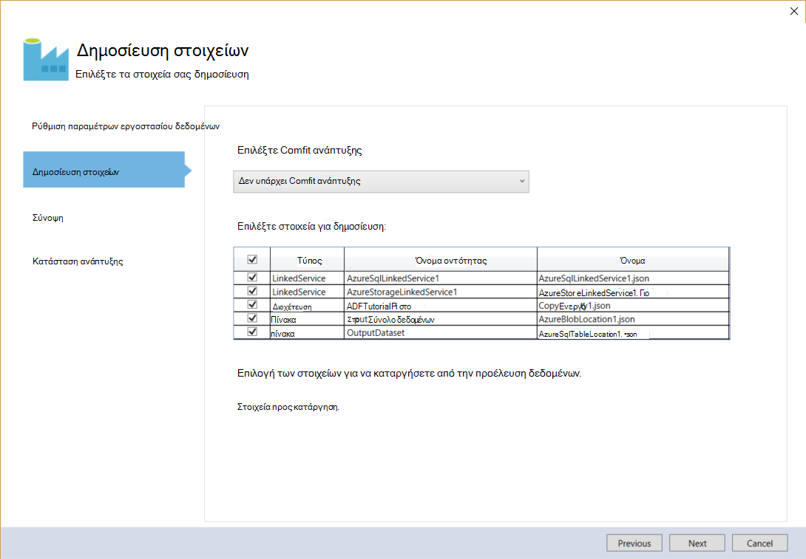

<properties 
    pageTitle="Πρόγραμμα εκμάθησης: Δημιουργία μιας διοχέτευσης με χρήση του Visual Studio δραστηριότητα αντίγραφο | Microsoft Azure" 
    description="Σε αυτό το πρόγραμμα εκμάθησης, δημιουργείτε μια διοχέτευση Azure εργοστασίου δεδομένων με μια δραστηριότητα αντίγραφο με χρήση του Visual Studio." 
    services="data-factory" 
    documentationCenter="" 
    authors="spelluru" 
    manager="jhubbard" 
    editor="monicar"/>

<tags 
    ms.service="data-factory" 
    ms.workload="data-services" 
    ms.tgt_pltfrm="na" 
    ms.devlang="na" 
    ms.topic="get-started-article" 
    ms.date="10/17/2016" 
    ms.author="spelluru"/>

# Πρόγραμμα εκμάθησης: Δημιουργία μιας διοχέτευσης με χρήση του Visual Studio δραστηριότητα αντιγράφου
> [AZURE.SELECTOR]
- [Επισκόπηση και τις προϋποθέσεις](data-factory-copy-data-from-azure-blob-storage-to-sql-database.md)
- [Αντιγραφή οδηγού](data-factory-copy-data-wizard-tutorial.md)
- [Πύλη του Azure](data-factory-copy-activity-tutorial-using-azure-portal.md)
- [Visual Studio](data-factory-copy-activity-tutorial-using-visual-studio.md)
- [PowerShell](data-factory-copy-activity-tutorial-using-powershell.md)
- [Azure προτύπου για τη διαχείριση πόρων](data-factory-copy-activity-tutorial-using-azure-resource-manager-template.md)
- [REST API](data-factory-copy-activity-tutorial-using-rest-api.md)
- [.NET API](data-factory-copy-activity-tutorial-using-dotnet-api.md)

Αυτό το πρόγραμμα εκμάθησης θα μάθετε πώς να δημιουργήσετε και να παρακολουθείτε μια εργοστασίου Azure δεδομένων με χρήση του Visual Studio. Της διοχέτευσης στο η προέλευση δεδομένων χρησιμοποιεί μια δραστηριότητα Αντιγραφή για να αντιγράψετε δεδομένα από το χώρο αποθήκευσης Blob του Azure με βάση δεδομένων SQL Azure.

Ακολουθούν τα βήματα που πρέπει να εκτελέσετε ως μέρος αυτού του προγράμματος εκμάθησης:

1. Δημιουργήστε δύο συνδεδεμένες υπηρεσίες: **AzureStorageLinkedService1** και **AzureSqlinkedService1**. 

    Το AzureStorageLinkedService1 συνδέσεων χώρο αποθήκευσης Azure και AzureSqlLinkedService1 συνδέσεις μια βάση δεδομένων Azure SQL με την προέλευση δεδομένων: **ADFTutorialDataFactoryVS**. Τα δεδομένα εισόδου για τη διαδικασία βρίσκεται σε ένα κοντέινερ αντικειμένων blob στο το χώρο αποθήκευσης αντικειμένων blob του Azure και δεδομένα εξόδου είναι αποθηκευμένο σε έναν πίνακα στη βάση δεδομένων Azure SQL. Γι ' αυτό, προσθέστε αυτές τις δύο δεδομένων αποθηκεύονται ως συνδεδεμένες υπηρεσίες την προέλευση δεδομένων.
2. Δημιουργήστε δύο συνόλων δεδομένων: **InputDataset** και **OutputDataset**, που αντιπροσωπεύει τα δεδομένα εισόδου/εξόδου που είναι αποθηκευμένα στο χώρο αποθήκευσης δεδομένων. 

    Για το InputDataset, μπορείτε να καθορίσετε το κοντέινερ αντικειμένων blob που περιέχει ένα αντικείμενο blob με τα δεδομένα προέλευσης. Για το OutputDataset, μπορείτε να καθορίσετε τον πίνακα SQL που αποθηκεύει τα δεδομένα εξόδου. Μπορείτε επίσης να ορίσετε άλλες ιδιότητες όπως δομή, διαθεσιμότητα και την πολιτική.
3. Δημιουργήστε μια διαδικασία με το όνομα **ADFTutorialPipeline** στο το ADFTutorialDataFactoryVS. 

    Η διαδικασία έχει ένα **Αντίγραφο δραστηριότητας** που αντίγραφα εισαγωγής δεδομένων από το Azure αντικειμένων blob στον πίνακα του Azure SQL εξόδου. Τη δραστηριότητα αντίγραφο εκτελεί την κυκλοφορία δεδομένων Azure εργοστασίου δεδομένων. Η δραστηριότητα είναι υποστηρίζεται από μια καθολικά διαθέσιμη υπηρεσία που να αντιγράψετε τα δεδομένα μεταξύ των διαφόρων αποθηκεύει δεδομένα με ασφάλεια, αξιοπιστία και με τον τρόπο. Δείτε το άρθρο [Δραστηριότητες κίνηση δεδομένων](data-factory-data-movement-activities.md) για λεπτομέρειες σχετικά με τη δραστηριότητα αντίγραφο. 
4. Δημιουργία ενός εργοστασίου δεδομένων με το όνομα **VSTutorialFactory**. Αναπτύξτε την προέλευση δεδομένων και όλες οντοτήτων εργοστασίου δεδομένων (συνδεδεμένες υπηρεσίες, πίνακες και της διοχέτευσης).    

## Προαπαιτούμενα στοιχεία

1. Διαβάστε το άρθρο [Επισκόπηση πρόγραμμα εκμάθησης](data-factory-copy-data-from-azure-blob-storage-to-sql-database.md) και ολοκληρώστε τα βήματα **προϋπόθεση** . 
2. Πρέπει να είστε ο **διαχειριστής της Azure συνδρομής** για να μπορέσετε να δημοσιεύσετε οντοτήτων εργοστασίου δεδομένων εργοστασίου δεδομένων Azure.  
3. Πρέπει να έχετε εγκαταστήσει στον υπολογιστή σας τα εξής: 
    - Visual Studio 2013 ή του Visual Studio 2015
    - Κάντε λήψη του Azure SDK για Visual Studio 2013 ή του Visual Studio 2015. Μεταβείτε στη [Σελίδα λήψης Azure](https://azure.microsoft.com/downloads/) και κάντε κλικ **και στο 2013** ή **και στο 2015** στην ενότητα **.NET** .
    - Λήψη την πιο πρόσφατη Προσθήκη εργοστασίου δεδομένων Azure για το Visual Studio: [ΣΎΓΚΡΙΣΗ 2013](https://visualstudiogallery.msdn.microsoft.com/754d998c-8f92-4aa7-835b-e89c8c954aa5) ή [και στο 2015](https://visualstudiogallery.msdn.microsoft.com/371a4cf9-0093-40fa-b7dd-be3c74f49005). Μπορείτε επίσης να ενημερώσετε την προσθήκη, κάνοντας τα εξής βήματα: στο μενού, κάντε κλικ στην επιλογή **Εργαλεία** -> **επεκτάσεις και ενημερώσεις** -> **Online** -> **Visual Studio συλλογή** -> **Εργαλεία εργοστασίου του Microsoft Azure δεδομένων για το Visual Studio** -> **Ενημέρωση**.

## Δημιουργία έργου Visual Studio 
1. Εκκινήστε το **Visual Studio 2013**. Κάντε κλικ στο **αρχείο**, επιλέξτε **Δημιουργία**και κάντε κλικ στο **έργο**. Θα πρέπει να βλέπετε το παράθυρο διαλόγου **Νέο έργο** .  
2. Στο παράθυρο διαλόγου **Νέο έργο** , επιλέξτε το πρότυπο **DataFactory** και κάντε κλικ στην επιλογή **Κενό έργο εργοστασίου δεδομένων**. Εάν δεν βλέπετε το πρότυπο DataFactory, κλείστε το Visual Studio, εγκατάσταση Azure SDK για το Visual Studio 2013 και ανοίξετε ξανά το Visual Studio.  

    

3. Πληκτρολογήστε ένα **όνομα** για το έργο, **θέση**και ένα όνομα για τη **λύση**και κάντε κλικ στο κουμπί **OK**.

     

## Δημιουργία συνδεδεμένων υπηρεσιών
Συνδεδεμένες υπηρεσίες σύνδεση χώροι αποθήκευσης δεδομένων ή τον υπολογισμό υπηρεσίες σε μια εργοστασίου Azure δεδομένων. Ανατρέξτε στο θέμα [αποθηκεύει τις υποστηριζόμενες δεδομένα](data-factory-data-movement-activities.md##supported-data-stores-and-formats) για όλες τις προελεύσεις και δέκτες που υποστηρίζονται από τη δραστηριότητα αντίγραφο. Δείτε [τον υπολογισμό συνδεδεμένες υπηρεσίες](data-factory-compute-linked-services.md) για τη λίστα των υπηρεσιών υπολογισμού υποστηρίζονται από προέλευση δεδομένων. Σε αυτό το πρόγραμμα εκμάθησης, δεν μπορείτε χρησιμοποιήσετε οποιαδήποτε υπηρεσία υπολογισμού. 

Σε αυτό το βήμα, δημιουργείτε δύο συνδεδεμένες υπηρεσίες: **AzureStorageLinkedService1** και **AzureSqlLinkedService1**. AzureStorageLinkedService1 συνδεδεμένες συνδέσεις υπηρεσίας λογαριασμού χώρου αποθήκευσης Azure και AzureSqlLinkedService συνδέσεις μια βάση δεδομένων Azure SQL με την προέλευση δεδομένων: **ADFTutorialDataFactory**. 

### Δημιουργία της υπηρεσίας συνδεδεμένο χώρο αποθήκευσης Azure

4. Κάντε δεξί κλικ **Συνδεδεμένες υπηρεσίες** στην Εξερεύνηση λύσεων, τοποθετήστε το δείκτη για **Προσθήκη**και κάντε κλικ στην επιλογή **Νέο στοιχείο**.      
5. Στο παράθυρο διαλόγου **Προσθήκη νέου στοιχείου** , επιλέξτε **Υπηρεσία αποθήκευσης στο Azure συνδεδεμένων** από τη λίστα και κάντε κλικ στην επιλογή **Προσθήκη**. 

    
 
3. Αντικατάσταση `<accountname>` και `<accountkey>`* με το όνομα του λογαριασμού Azure χώρου αποθήκευσης και το κλειδί. 

    

4. Αποθηκεύστε το αρχείο **AzureStorageLinkedService1.json** .

> Για λεπτομέρειες σχετικά με τις ιδιότητες JSON, ανατρέξτε στο θέμα [Μετακίνηση δεδομένων από/προς αντικειμένων Blob του Azure](data-factory-azure-blob-connector.md#azure-storage-linked-service) .

### Δημιουργία της υπηρεσίας συνδεδεμένες SQL Azure

5. Κάντε δεξί κλικ στον κόμβο **Συνδεδεμένες υπηρεσίες** στην **Εξερεύνηση λύσεων** ξανά, τοποθετήστε το δείκτη για **Προσθήκη**και κάντε κλικ στην επιλογή **Νέο στοιχείο**. 
6. Αυτήν τη στιγμή, επιλέξτε **Υπηρεσία συνδεδεμένων SQL Azure**και κάντε κλικ στην επιλογή **Προσθήκη**. 
7. Στο **αρχείο AzureSqlLinkedService1.json**, αντικαταστήστε `<servername>`, `<databasename>`, `<username@servername>`, και `<password>` με τα ονόματα των Azure SQL διακομιστή, βάση δεδομένων, λογαριασμού χρήστη, και τον κωδικό πρόσβασης.    
8.  Αποθηκεύστε το αρχείο **AzureSqlLinkedService1.json** . 

> [AZURE.NOTE]
> Για λεπτομέρειες σχετικά με τις ιδιότητες JSON, ανατρέξτε στο θέμα [Μετακίνηση δεδομένων από/προς βάση δεδομένων SQL Azure](data-factory-azure-sql-connector.md#azure-sql-linked-service-properties) .

## Δημιουργία συνόλων δεδομένων
Στο προηγούμενο βήμα, που δημιουργήσατε συνδεδεμένες υπηρεσίες **AzureStorageLinkedService1** και **AzureSqlLinkedService1** για να συνδέσετε ένα λογαριασμό αποθήκευσης Azure και μια βάση δεδομένων Azure SQL με την προέλευση δεδομένων: **ADFTutorialDataFactory**. Σε αυτό το βήμα, μπορείτε να ορίσετε δύο συνόλων δεδομένων-- **InputDataset** και **OutputDataset** --που αντιπροσωπεύουν τα δεδομένα εισόδου/εξόδου που είναι αποθηκευμένα στο χώρο αποθήκευσης δεδομένων που αναφέρονται, AzureStorageLinkedService1 και AzureSqlLinkedService1 αντίστοιχα. Για InputDataset, μπορείτε να καθορίσετε το κοντέινερ αντικειμένων blob που περιέχει ένα αντικείμενο blob με τα δεδομένα προέλευσης. Για OutputDataset, μπορείτε να καθορίσετε τον πίνακα SQL που αποθηκεύει τα δεδομένα εξόδου.

### Δημιουργία συνόλου δεδομένων εισαγωγής
Σε αυτό το βήμα, δημιουργείτε ένα σύνολο δεδομένων με το όνομα **InputDataset** που οδηγεί σε ένα κοντέινερ αντικειμένων blob στο χώρο αποθήκευσης του Azure που αντιπροσωπεύονται από την υπηρεσία **AzureStorageLinkedService1** συνδεδεμένες. Ένας πίνακας είναι ένα σύνολο δεδομένων ορθογώνια και είναι ο μόνος τύπος του συνόλου δεδομένων που υποστηρίζονται αυτήν τη στιγμή. 

9. Κάντε δεξί κλικ σε **πίνακες** στην **Εξερεύνηση λύσεων**, τοποθετήστε το δείκτη για **Προσθήκη**και κάντε κλικ στην επιλογή **Νέο στοιχείο**.
10. Στο παράθυρο διαλόγου **Προσθήκη νέου στοιχείου** , επιλέξτε **Αντικειμένων Blob του Azure**και κάντε κλικ στην επιλογή **Προσθήκη**.   
10. Αντικαταστήστε το κείμενο JSON με το παρακάτω κείμενο και αποθηκεύστε το αρχείο **AzureBlobLocation1.json** . 

        {
          "name": "InputDataset",
          "properties": {
            "structure": [
              {
                "name": "FirstName",
                "type": "String"
              },
              {
                "name": "LastName",
                "type": "String"
              }
            ],
            "type": "AzureBlob",
            "linkedServiceName": "AzureStorageLinkedService1",
            "typeProperties": {
              "folderPath": "adftutorial/",
              "format": {
                "type": "TextFormat",
                "columnDelimiter": ","
              }
            },
            "external": true,
            "availability": {
              "frequency": "Hour",
              "interval": 1
            }
          }
        }

     Λάβετε υπόψη τα εξής σημεία: 
    
    - σύνολο δεδομένων **Τύπος** έχει οριστεί σε **AzureBlob**.
    - **linkedServiceName** έχει οριστεί σε **AzureStorageLinkedService**. Δημιουργήσατε αυτήν την υπηρεσία συνδεδεμένο στο βήμα 2.
    - **folderPath** έχει οριστεί στο κοντέινερ **adftutorial** . Μπορείτε επίσης να καθορίσετε το όνομα του ένα blob μέσα στο φάκελο χρησιμοποιώντας την ιδιότητα **fileName** . Εφόσον δεν καθορίζετε το όνομα του το αντικείμενο blob, δεδομένα από όλα τα αντικείμενα blob στο κοντέινερ θεωρείται ως μια εισαγωγής δεδομένων.  
    - μορφοποίηση **τύπου** έχει οριστεί σε **TextFormat**
    - Υπάρχουν δύο πεδία στο αρχείο κειμένου- **όνομα** και **Επώνυμο** – διαχωρίζονται από ένα κόμμα (**Διαχωριστικό_στήλης**) 
    - Η **διαθεσιμότητα** έχει οριστεί σε **ωριαία** (**συχνότητα** έχει οριστεί σε **ώρα** και **διάστημα** έχει οριστεί σε **1**). Επομένως, εργοστασίου δεδομένων αναζητά δεδομένα εισόδου κάθε ώρα στον ριζικό φάκελο του κοντέινερ αντικειμένων blob (**adftutorial**) που καθορίσατε. 
    
    Εάν δεν μπορείτε να καθορίσετε ένα **όνομα αρχείου** για ένα σύνολο δεδομένων **εισόδου** , όλων των αρχείων/BLOB από το φάκελο εισαγωγής (**folderPath**) θεωρούνται ως εισροές. Εάν καθορίσετε ένα όνομα αρχείου στο το JSON, μόνο το καθορισμένο αρχείο/blob θεωρείται asn εισαγωγής.
 
    Εάν δεν καθορίσετε ένα **όνομα αρχείου** για έναν **πίνακα αποτελεσμάτων**, τα αρχεία που δημιουργούνται στο το **folderPath** ονομάζονται με την εξής μορφή: δεδομένων. &lt;Guid\&gt;. txt (παράδειγμα: Data.0a405f8a-93ff-4c6f-b3be-f69616f1df7a.txt.).

    Για να ορίσετε **folderPath** και δυναμικά με βάση την ώρα **SliceStart** **όνομα αρχείου** , χρησιμοποιήστε την ιδιότητα **partitionedBy** . Στο παρακάτω παράδειγμα, folderPath χρησιμοποιεί έτος, μήνα και την ημέρα από την SliceStart (ώρα έναρξης της στη φέτα που υποβάλλεται σε επεξεργασία) και ώρα από την SliceStart χρησιμοποιεί το όνομα αρχείου. Για παράδειγμα, εάν μια φέτα που παράγεται για 2016-09-20T08:00:00, το όνομα φακέλου έχει οριστεί σε wikidatagateway/wikisampledataout/2016/09/20 και το όνομα του αρχείου που έχει οριστεί σε 08.csv. 

            "folderPath": "wikidatagateway/wikisampledataout/{Year}/{Month}/{Day}",
            "fileName": "{Hour}.csv",
            "partitionedBy": 
            [
                { "name": "Year", "value": { "type": "DateTime", "date": "SliceStart", "format": "yyyy" } },
                { "name": "Month", "value": { "type": "DateTime", "date": "SliceStart", "format": "MM" } }, 
                { "name": "Day", "value": { "type": "DateTime", "date": "SliceStart", "format": "dd" } }, 
                { "name": "Hour", "value": { "type": "DateTime", "date": "SliceStart", "format": "hh" } } 

> [AZURE.NOTE]
> Για λεπτομέρειες σχετικά με τις ιδιότητες JSON, ανατρέξτε στο θέμα [Μετακίνηση δεδομένων από/προς αντικειμένων Blob του Azure](data-factory-azure-blob-connector.md#azure-blob-dataset-type-properties) .

### Δημιουργία συνόλου δεδομένων εξόδου
Σε αυτό το βήμα, δημιουργείτε ένα σύνολο δεδομένων εξόδου που ονομάζεται **OutputDataset**. Σε αυτό το σύνολο δεδομένων οδηγεί σε έναν πίνακα SQL στη βάση δεδομένων Azure SQL που αντιπροσωπεύονται από **AzureSqlLinkedService1**. 

11. Κάντε ξανά δεξί κλικ **πίνακες** στην **Εξερεύνηση λύσεων** , τοποθετήστε το δείκτη για **Προσθήκη**και κάντε κλικ στην επιλογή **Νέο στοιχείο**.
12. Στο παράθυρο διαλόγου **Προσθήκη νέου στοιχείου** , επιλέξτε **Azure SQL**και κάντε κλικ στην επιλογή **Προσθήκη**. 
13. Αντικαταστήστε το κείμενο JSON με την εξής JSON και αποθηκεύστε το αρχείο **AzureSqlTableLocation1.json** .

        {
          "name": "OutputDataset",
          "properties": {
            "structure": [
              {
                "name": "FirstName",
                "type": "String"
              },
              {
                "name": "LastName",
                "type": "String"
              }
            ],
            "type": "AzureSqlTable",
            "linkedServiceName": "AzureSqlLinkedService1",
            "typeProperties": {
              "tableName": "emp"
            },
            "availability": {
              "frequency": "Hour",
              "interval": 1
            }
          }
        }

     Λάβετε υπόψη τα εξής σημεία: 
    
    - σύνολο δεδομένων **Τύπος** έχει οριστεί σε **AzureSQLTable**.
    - **linkedServiceName** έχει οριστεί σε **AzureSqlLinkedService** (που δημιουργήσατε αυτήν την υπηρεσία συνδεδεμένο στο βήμα 2).
    - **όνομα πίνακα** έχει οριστεί σε **emp**.
    - Υπάρχουν τρεις στήλες- **Αναγνωριστικό**, **όνομα**και **Επώνυμο** – στον πίνακα emp στη βάση δεδομένων. Αναγνωριστικό είναι μια στήλη, επομένως, πρέπει να καθορίσετε μόνο **όνομα** και **Επώνυμο** εδώ.
    - Η **διαθεσιμότητα** έχει οριστεί σε **ωριαία** (**συχνότητα** ορισμένη σε **ώρα** και **διάστημα** οριστεί σε **1**).  Η υπηρεσία εργοστασίου δεδομένων δημιουργεί μια φέτα δεδομένων εξόδου κάθε ώρα στον πίνακα **emp** στη βάση δεδομένων Azure SQL.

> [AZURE.NOTE]
> Για λεπτομέρειες σχετικά με τις ιδιότητες JSON, ανατρέξτε στο θέμα [Μετακίνηση δεδομένων από/προς βάση δεδομένων SQL Azure](data-factory-azure-sql-connector.md#azure-sql-linked-service-properties) .

## Δημιουργία διοχέτευσης 
Έχετε δημιουργήσει συνδεδεμένες υπηρεσίες εισόδου/εξόδου και πίνακες μέχρι στιγμής. Τώρα, μπορείτε να δημιουργήσετε μια διαδικασία με μια **Δραστηριότητα αντιγραφή** για να αντιγράψετε τα δεδομένα από το Azure αντικειμένων blob με βάση δεδομένων Azure SQL. 

1. Κάντε δεξί κλικ στην **Εξερεύνηση λύσεων** **αγωγούς** , τοποθετήστε το δείκτη για **Προσθήκη**και κάντε κλικ στην επιλογή **Νέο στοιχείο**.  
15. Επιλέξτε **Αντιγραφή δεδομένων διοχέτευσης** στο παράθυρο διαλόγου **Προσθήκη νέου στοιχείου** και κάντε κλικ στην επιλογή **Προσθήκη**. 
16. Αντικαταστήστε το JSON με την εξής JSON και αποθηκεύστε το αρχείο **CopyActivity1.json** .
            
        {
          "name": "ADFTutorialPipeline",
          "properties": {
            "description": "Copy data from a blob to Azure SQL table",
            "activities": [
              {
                "name": "CopyFromBlobToSQL",
                "type": "Copy",
                "inputs": [
                  {
                    "name": "InputDataset"
                  }
                ],
                "outputs": [
                  {
                    "name": "OutputDataset"
                  }
                ],
                "typeProperties": {
                  "source": {
                    "type": "BlobSource"
                  },
                  "sink": {
                    "type": "SqlSink",
                    "writeBatchSize": 10000,
                    "writeBatchTimeout": "60:00:00"
                  }
                },
                "Policy": {
                  "concurrency": 1,
                  "executionPriorityOrder": "NewestFirst",
                  "style": "StartOfInterval",
                  "retry": 0,
                  "timeout": "01:00:00"
                }
              }
            ],
            "start": "2015-07-12T00:00:00Z",
            "end": "2015-07-13T00:00:00Z",
            "isPaused": false
          }
        }

    Λάβετε υπόψη τα εξής σημεία:

    - Στην ενότητα δραστηριότητες, υπάρχει μόνο μία δραστηριότητα του οποίου ο **Τύπος** έχει οριστεί σε **αντίγραφο**.
    - Εισαγωγή δεδομένων για τη δραστηριότητα έχει οριστεί σε **InputDataset** και εξόδου για τη δραστηριότητα έχει οριστεί σε **OutputDataset**.
    - Στην ενότητα **typeProperties** , **BlobSource** έχει καθοριστεί ως τύπο προέλευσης και **SqlSink** καθορίζεται ως τύπο δέκτη.

    Αντικαταστήστε την τιμή της ιδιότητας **Έναρξη** με την τρέχουσα ημέρα και **Τέλος** τιμή με την επόμενη ημέρα. Μπορείτε να καθορίσετε μόνο το τμήμα της ημερομηνίας και να παραλείψετε το τμήμα ώρας από την ημερομηνία ώρα. Για παράδειγμα, "2016-02-03", που είναι ισοδύναμη με "2016-02-03T00:00:00Z"
    
    Και τα δύο έναρξης και λήξης ημερομηνίες-ώρες πρέπει να είναι σε [μορφή ISO](http://en.wikipedia.org/wiki/ISO_8601). Για παράδειγμα: 2016-10-14T16:32:41Z. Την ώρα **λήξης** είναι προαιρετικό, αλλά χρησιμοποιούμε σε αυτό το πρόγραμμα εκμάθησης. 
    
    Εάν δεν καθορίσετε τιμή για την ιδιότητα **Τέλος** , υπολογίζεται ως "**Έναρξη + 48 ώρες**". Για να εκτελέσετε τη διαδικασία απεριόριστο χρονικό διάστημα, καθορίστε **9999-09-09** ως η τιμή για την ιδιότητα **Τέλος** .
    
    Στο προηγούμενο παράδειγμα, υπάρχουν 24 φέτες δεδομένων όπως κάθε φέτα δεδομένων παράγεται ανά ώρα.

## Δημοσίευση/ανάπτυξη οντοτήτων εργοστασίου δεδομένων
Σε αυτό το βήμα, μπορείτε να δημοσιεύσετε οντοτήτων εργοστασίου δεδομένων (συνδεδεμένες υπηρεσίες, σύνολα δεδομένων και διοχέτευσης) που δημιουργήσατε νωρίτερα. Μπορείτε επίσης να καθορίσετε το όνομα του νέου εργοστασίου δεδομένων θα δημιουργηθεί για τη διατήρηση αυτών των οντοτήτων.  

18. Κάντε δεξί κλικ έργου στην Εξερεύνηση λύσεων και κάντε κλικ στο κουμπί **Δημοσίευση**. 
19. Εάν βλέπετε το παράθυρο διαλόγου **Είσοδος στο λογαριασμό Microsoft** , εισαγάγετε τα διαπιστευτήριά σας για το λογαριασμό που έχει συνδρομή Azure και κάντε κλικ στην επιλογή **Είσοδος**.
20. Θα πρέπει να βλέπετε το παρακάτω παράθυρο διαλόγου:

    
21. Στη σελίδα Ρύθμιση παραμέτρων δεδομένων εργοστασίου, ακολουθήστε τα παρακάτω βήματα: 
    1. Ορίστε την επιλογή **Δημιουργία νέου εργοστασίου δεδομένων** .
    2. Πληκτρολογήστε **VSTutorialFactory** για **το όνομα**.  
    
        > [AZURE.IMPORTANT]  
        > Το όνομα του εργοστασίου Azure δεδομένων πρέπει να είναι μοναδικό καθολικό. Εάν λάβετε ένα σφάλμα σχετικά με το όνομα του εργοστασίου δεδομένων κατά τη δημοσίευση, αλλάξτε το όνομα του εργοστασίου δεδομένων (για παράδειγμα, yournameVSTutorialFactory) και δοκιμάστε να δημοσιεύσετε ξανά. Ανατρέξτε στο θέμα [Factory δεδομένων - κανόνες ονοματοθεσίας](data-factory-naming-rules.md) για τους κανόνες ονοματοθεσίας για αντικείμενα εργοστασίου δεδομένων.     
    3. Επιλέξτε Azure τη συνδρομή σας για το πεδίο **συνδρομής** .
     
        > [AZURE.IMPORTANT]Εάν δεν βλέπετε καμία συνδρομή, βεβαιωθείτε ότι έχετε συνδεθεί χρησιμοποιώντας ένα λογαριασμό που είναι ένα διαχειριστή ή από κοινού-διαχείριση της συνδρομής.  
    4. Επιλέξτε την **ομάδα πόρων** για την εργοστασίου δεδομένων που θα δημιουργηθεί. 5. Επιλέξτε την **περιοχή** για την προέλευση δεδομένων. Μόνο οι περιοχές που υποστηρίζεται από την υπηρεσία εργοστασίου δεδομένων εμφανίζονται στην αναπτυσσόμενη λίστα.
6. Κάντε κλικ στο κουμπί **Επόμενο** για να μεταβείτε στη σελίδα **Δημοσίευση στοιχείων** .
    
           
23. Στη σελίδα **Δημοσίευση στοιχείων** , βεβαιωθείτε ότι όλα τα εργοστάσια δεδομένων οντοτήτων είναι επιλεγμένα και κάντε κλικ στο κουμπί **Επόμενο** για να μεταβείτε στη σελίδα **Σύνοψη** .
    
         
24. Ελέγξτε τη σύνοψη και κάντε κλικ στο κουμπί **Επόμενο** για να ξεκινήσετε τη διαδικασία ανάπτυξης και προβολή της **Κατάστασης ανάπτυξης**.

    
25. Στη σελίδα **Κατάσταση ανάπτυξης** , θα πρέπει να βλέπετε την κατάσταση της διαδικασίας ανάπτυξης. Μόλις ολοκληρωθεί η ανάπτυξη, κάντε κλικ στο κουμπί Τέλος. 
     λάβετε υπόψη τα εξής σημεία: 

- Εάν λαμβάνετε το μήνυμα σφάλματος: "**Αυτή η συνδρομή δεν έχει καταχωρηθεί για να χρησιμοποιήσετε το χώρο ονομάτων Microsoft.DataFactory**", κάντε ένα από τα παρακάτω και προσπαθήστε να δημοσιεύσετε ξανά: 

    - Στο Azure PowerShell, εκτελέστε την ακόλουθη εντολή για να καταχωρήσετε την υπηρεσία παροχής δεδομένων Factory. 
        
            Register-AzureRmResourceProvider -ProviderNamespace Microsoft.DataFactory
    
        Μπορείτε να εκτελέσετε την παρακάτω εντολή για να επιβεβαιώσετε ότι η προέλευση δεδομένων έχει καταχωρηθεί η υπηρεσία παροχής που χρησιμοποιείτε. 
    
            Get-AzureRmResourceProvider
    - Συνδεθείτε χρησιμοποιώντας το Azure συνδρομή στην [πύλη του Azure](https://portal.azure.com) και μεταβείτε σε μια blade εργοστασίου δεδομένων (ή) Δημιουργήστε μια προέλευση δεδομένων στην πύλη του Azure. Αυτή η ενέργεια καταχωρεί αυτόματα την υπηρεσία παροχής για εσάς.
-   Το όνομα του εργοστασίου δεδομένων μπορεί να έχει εγγραφεί ως όνομα DNS στο μέλλον και συνεπώς γίνονται δημόσια ορατά.

> [AZURE.IMPORTANT] Για να δημιουργήσετε παρουσίες εργοστασίου δεδομένων, πρέπει να διαχείρισης/από κοινού-διαχειριστής της συνδρομής Azure

## Σύνοψη
Σε αυτό το πρόγραμμα εκμάθησης, έχετε δημιουργήσει ένα εργοστασίου Azure δεδομένων για να αντιγράψετε τα δεδομένα από μια Azure αντικειμένων blob σε μια βάση δεδομένων Azure SQL. Χρησιμοποιήσατε Visual Studio για να δημιουργήσετε την προέλευση δεδομένων, συνδεδεμένες υπηρεσίες, σύνολα δεδομένων και μια διαδικασία. Ακολουθούν τα βήματα υψηλού επιπέδου που έχει πραγματοποιηθεί σε αυτό το πρόγραμμα εκμάθησης:  

1.  Δημιουργία μιας Azure **εργοστασίου δεδομένων**.
2.  Δημιουργία **συνδεδεμένων υπηρεσιών**:
    1. Μια υπηρεσία **Αποθήκευσης Azure** συνδεδεμένες για να συνδέσετε το λογαριασμό σας χώρο αποθήκευσης Azure που περιέχει τα δεδομένα εισόδου.    
    2. Μια υπηρεσία **Azure SQL** συνδεδεμένες για να συνδέσετε τη βάση δεδομένων Azure SQL που περιέχει τα δεδομένα εξόδου. 
3.  Δημιουργία **συνόλων δεδομένων**, που περιγράφουν δεδομένα εισόδου και εξόδου δεδομένων για αγωγούς.
4.  Δημιουργηθεί μια **διαδικασία** με μια **Δραστηριότητα αντίγραφο** με **BlobSource** ως προέλευσης και **SqlSink** ως δέκτη. 

## Χρησιμοποιήστε την Εξερεύνηση διακομιστή για την προβολή δεδομένων εργοστάσια

1. Στο **Visual Studio**, κάντε κλικ στην επιλογή " **Προβολή** " στο μενού και κάντε κλικ στην επιλογή **Εξερεύνηση Server**.
2. Στο παράθυρο της Εξερεύνησης διακομιστή, αναπτύξτε **Azure** και αναπτύξτε **Εργοστασίου δεδομένων**. Εάν βλέπετε **να εισέλθετε στο Visual Studio**, εισαγάγετε το **λογαριασμό** που σχετίζεται με τη συνδρομή σας στο Azure και κάντε κλικ στην επιλογή **Continue**. Πληκτρολογήστε **τον κωδικό πρόσβασης**και κάντε κλικ στην επιλογή **Είσοδος**. Visual Studio προσπαθεί να λάβετε πληροφορίες σχετικά με όλα εργοστάσια Azure δεδομένων στη συνδρομή σας. Μπορείτε να δείτε την κατάσταση αυτής της λειτουργίας στο παράθυρο **Δεδομένων λίστας εργασιών Factory** .
    
3. Μπορείτε να κάντε δεξί κλικ σε μια προέλευση δεδομένων και επιλέξτε εξαγωγή δεδομένων Factory στο νέο έργο για να δημιουργήσετε ένα έργο Visual Studio που βασίζεται σε μια υπάρχουσα εργοστασίου δεδομένων.
      

## Ενημέρωση Εργαλεία εργοστασίου δεδομένων για το Visual Studio
Για να ενημερώσετε Εργαλεία εργοστασίου δεδομένων Azure για το Visual Studio, ακολουθήστε τα παρακάτω βήματα:

1. Κάντε κλικ στην επιλογή " **Εργαλεία** " στο μενού και επιλέξτε **επεκτάσεις και ενημερώσεις**. 
2. Επιλέξτε τις **ενημερώσεις** στο αριστερό τμήμα του παραθύρου και, στη συνέχεια, επιλέξτε **Visual Studio συλλογή**.
4. Επιλέξτε **Εργαλεία εργοστασίου δεδομένων Azure για το Visual Studio** και κάντε κλικ στην επιλογή **Ενημέρωση**. Εάν δεν βλέπετε αυτήν την εγγραφή, έχετε ήδη την πιο πρόσφατη έκδοση των εργαλείων. 

Ανατρέξτε στο θέμα [οθόνη συνόλων δεδομένων και διαδικασία](data-factory-copy-activity-tutorial-using-azure-portal.md#monitor-pipeline) για οδηγίες σχετικά με τον τρόπο για να χρησιμοποιήσουν την πύλη του Azure για την παρακολούθηση των και συνόλων δεδομένων που δημιουργήσατε σε αυτό το πρόγραμμα εκμάθησης.

## Δείτε επίσης
| Το θέμα | Περιγραφή |
| :---- | :---- |
| [Δραστηριότητες κίνηση δεδομένων](data-factory-data-movement-activities.md) | Σε αυτό το άρθρο παρέχει λεπτομερείς πληροφορίες σχετικά με τη δραστηριότητα αντίγραφο που χρησιμοποιούνται στην εκμάθηση. |
| [Προγραμματισμός και εκτέλεσης](data-factory-scheduling-and-execution.md) | Σε αυτό το άρθρο εξηγεί τις προγραμματισμού και εκτέλεσης πτυχές της εργοστασίου δεδομένων Azure μοντέλο εφαρμογών. |
| [Αγωγούς](data-factory-create-pipelines.md) | Σε αυτό το άρθρο σάς βοηθά να κατανοήσετε αγωγούς και δραστηριοτήτων στις εργοστασιακές δεδομένων Azure |
| [Σύνολα δεδομένων](data-factory-create-datasets.md) | Σε αυτό το άρθρο σάς βοηθά να κατανοήσετε συνόλων δεδομένων στην προέλευση δεδομένων Azure.
| [Παρακολούθηση και διαχείριση αγωγούς χρήση της εφαρμογής παρακολούθησης](data-factory-monitor-manage-app.md) | Σε αυτό το άρθρο περιγράφει τον τρόπο για την παρακολούθηση, διαχείριση και εντοπισμός σφαλμάτων αγωγούς με την παρακολούθηση & Διαχείριση εφαρμογών. 
