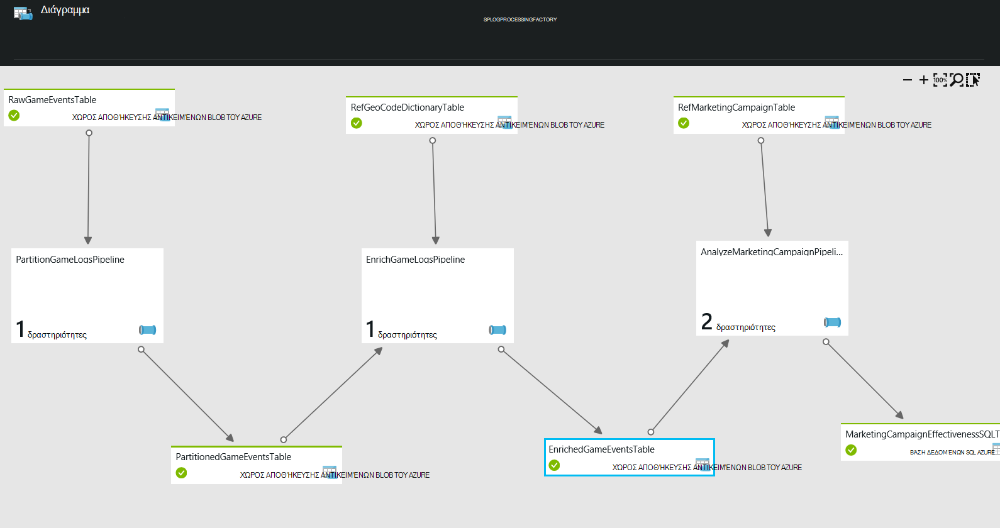

<properties 
    pageTitle="Χρήση πεζών-κεφαλαίων - δημιουργία προφίλ πελάτη" 
    description="Μάθετε τον τρόπο χρήσης Azure εργοστασίου δεδομένων για να δημιουργήσετε μια βασίζονται σε δεδομένα της ροής εργασιών (διοχέτευσης) προφίλ παιχνιδιών πελάτες." 
    services="data-factory" 
    documentationCenter="" 
    authors="sharonlo101" 
    manager="jhubbard" 
    editor="monicar"/>

<tags 
    ms.service="data-factory" 
    ms.workload="data-services" 
    ms.tgt_pltfrm="na" 
    ms.devlang="na" 
    ms.topic="article" 
    ms.date="09/06/2016" 
    ms.author="shlo"/>

# Χρήση πεζών-κεφαλαίων - δημιουργία προφίλ πελάτη

Azure εργοστασίου δεδομένων είναι μία από πολλές υπηρεσίες που χρησιμοποιούνται για την υλοποίηση την οικογένεια πληροφοριών Cortana του επιταχυντές λύσεων.  Για περισσότερες πληροφορίες σχετικά με την Cortana πληροφοριών, επισκεφθείτε την [Οικογένεια πληροφοριών Cortana](http://www.microsoft.com/cortanaanalytics). Σε αυτό το έγγραφο, θα σας περιγράφουν μια υπόθεση χρήσης απλό θα σας βοηθήσουν να ξεκινήσετε την κατανόηση πώς εργοστασίου δεδομένων Azure μπορεί να επιλύσει κοινά προβλήματα ανάλυσης.

Μόνο που πρέπει να έχετε πρόσβαση και να δοκιμάσετε αυτήν την περίπτωση απλή χρήση είναι μια [Azure συνδρομής](https://azure.microsoft.com/pricing/free-trial/).  Μπορείτε να αναπτύξετε ένα δείγμα που υλοποιεί αυτό περίπτωσης χρήσης, ακολουθώντας τα βήματα που περιγράφονται στο άρθρο [δείγματα](data-factory-samples.md) .

## Σενάριο

Το Contoso είναι μια εταιρεία παιχνιδιών που δημιουργεί αγώνων για πολλές πλατφόρμες: παιχνιδιών κονσόλες, συσκευές χειρός και προσωπικοί υπολογιστές (PC). Όπως παίκτες αναπαραγωγή αυτών των αγώνων, δημιουργείται μεγάλο όγκο δεδομένων αρχείου καταγραφής που παρακολουθεί τα μοτίβα χρήσης παιχνιδιών στυλ και τις προτιμήσεις του χρήστη.  Όταν συνδυάζεται με δημογραφικά, τοπικές ρυθμίσεις, και δεδομένα προϊόντος, Contoso μπορεί να εκτελέσει αναλύσεις για τις οδηγίες σχετικά με τον τρόπο για να βελτιώσετε την εμπειρία των αναπαραγωγής και αγορών προορισμού τους για αναβαθμίσεις και στο παιχνίδι. 

Στόχος της Contoso είναι ο εντοπισμός ευκαιρίες επάνω-πώληση/σταυρό-πώληση με βάση το ιστορικό παιχνιδιών τα προγράμματα αναπαραγωγής και προσθήκη συναρπαστικές δυνατότητες ανάπτυξη επιχείρησης μονάδα δίσκου και παρέχει μια καλύτερη εμπειρία στους πελάτες. Για αυτήν την περίπτωση χρήσης, χρησιμοποιούμε μια εταιρεία παιχνιδιών ως παράδειγμα μιας επιχείρησης. Η εταιρεία θέλει να βελτιστοποιήσετε την αγώνων με βάση τη συμπεριφορά των αναπαραγωγής. Οι αρχές αυτές ισχύουν για οποιαδήποτε επιχείρηση που θέλει να Εμπλακείτε πελατών γύρω από τα προϊόντα και τις υπηρεσίες και να βελτιώσετε την εμπειρία τους πελάτες.

## Προκλήσεις

## Επισκόπηση της λύσης

Αυτήν την περίπτωση απλή χρήση μπορεί να χρησιμοποιηθεί ως παράδειγμα πώς μπορείτε να χρησιμοποιήσετε εργοστασίου δεδομένων Azure ingest, προετοιμασία, μετασχηματισμός, ανάλυση και δημοσίευση δεδομένων.

Αυτή η εικόνα παρουσιάζει πώς εμφανίζονται τα αγωγούς δεδομένων στην πύλη του Azure αφού έχουν αναπτυχθεί.

1.  Το **PartitionGameLogsPipeline** διαβάζει τα ανεπεξέργαστα παιχνιδιών συμβάντα από χώρο αποθήκευσης αντικειμένων blob και δημιουργεί τα διαμερίσματα με βάση έτος, μήνα και ημέρα.
2.  Το **EnrichGameLogsPipeline** ενώνει διαμερίσματα παιχνιδιών συμβάντα με τα δεδομένα αναφοράς κώδικα παν και εμπλουτίζει τις δυνατότητες των δεδομένων αντιστοιχίζοντας διευθύνσεις IP με τις αντίστοιχες παν θέσεις.
3.  Η διαδικασία **AnalyzeMarketingCampaignPipeline** χρησιμοποιούν το εμπλουτισμένο δεδομένων και το επεξεργάζεται με τα δεδομένα διαφημίσεις για να δημιουργήσετε το τελικό αποτέλεσμα που περιέχει μάρκετινγκ της αποτελεσματικότητας της εκστρατείας.

Σε αυτό το παράδειγμα, εργοστασίου δεδομένων χρησιμοποιείται για να οργανώσετε δραστηριότητες που αντιγράψετε δεδομένα εισόδου, μετασχηματισμού και διαδικασία τα δεδομένα και να εξαγάγετε τα τελικά δεδομένα σε μια βάση δεδομένων SQL Azure.  Μπορείτε να επίσης απεικόνιση του δικτύου αγωγών που δεδομένων, Διαχείριση τους και την παρακολούθηση την κατάστασή τους από το περιβάλλον εργασίας Χρήστη.

## Πλεονεκτήματα

Βελτιστοποιώντας την ανάλυση προφίλ χρήστη και την ευθυγράμμιση με τους στόχους της επιχείρησης, η εταιρεία παιχνιδιών είναι μπορείτε να συλλέξετε γρήγορα τα μοτίβα χρήσης, και να αναλύσετε την αποτελεσματικότητα των τις εκστρατείες μάρκετινγκ.

