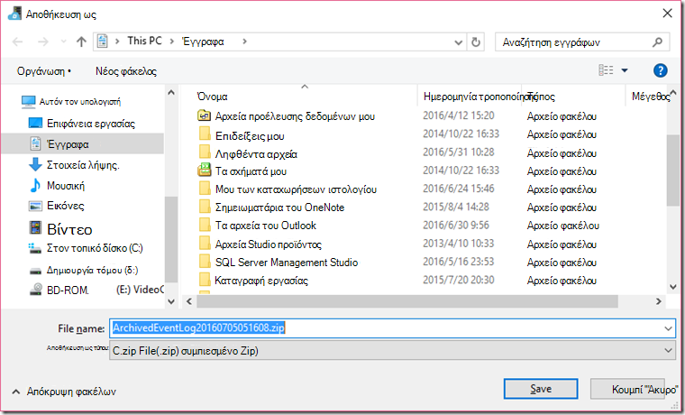

<properties 
    pageTitle="Η πύλη διαχείρισης δεδομένων για εργοστασίου δεδομένων | Microsoft Azure"
    description="Ρύθμιση του πύλης δεδομένων για τη μετακίνηση δεδομένων μεταξύ της εσωτερικής εγκατάστασης και cloud. Χρήση πύλης διαχείρισης δεδομένων στο Azure εργοστασίου δεδομένων για να μετακινήσετε τα δεδομένα σας." 
    services="data-factory" 
    documentationCenter="" 
    authors="linda33wj" 
    manager="jhubbard" 
    editor="monicar"/>

<tags 
    ms.service="data-factory" 
    ms.workload="data-services" 
    ms.tgt_pltfrm="na" 
    ms.devlang="na" 
    ms.topic="article" 
    ms.date="10/11/2016" 
    ms.author="jingwang"/>

# Η πύλη διαχείρισης δεδομένων
Η πύλη διαχείρισης δεδομένων είναι παράγοντας προγράμματος-πελάτη που πρέπει να εγκαταστήσετε το περιβάλλον εσωτερικής εγκατάστασης για την αντιγραφή δεδομένων μεταξύ αποθηκεύει δεδομένα cloud και εσωτερικής εγκατάστασης. Οι χώροι αποθήκευσης δεδομένων εσωτερικής εγκατάστασης που υποστηρίζονται από προέλευση δεδομένων, παρατίθενται στην ενότητα [υποστηριζόμενες προελεύσεις δεδομένων](data-factory-data-movement-activities.md##supported-data-stores) . 

> [AZURE.NOTE] Προς το παρόν, πύλης υποστηρίζει μόνο το αντίγραφο δραστηριότητας και δραστηριότητα αποθηκευμένη διαδικασία στην προέλευση δεδομένων. Δεν είναι δυνατή η χρήση της πύλης από μια προσαρμοσμένη δραστηριότητα για να αποκτήσετε πρόσβαση σε προελεύσεις δεδομένων εσωτερικής εγκατάστασης. 

Σε αυτό το άρθρο συμπληρώνει την αναλυτική παρουσίαση στο το [Μετακίνηση δεδομένων μεταξύ της εσωτερικής εγκατάστασης και cloud χώροι αποθήκευσης δεδομένων](data-factory-move-data-between-onprem-and-cloud.md) το άρθρο. Σε την αναλυτική παρουσίαση, μπορείτε να δημιουργήσετε μια διαδικασία που χρησιμοποιεί η πύλη για να μεταφέρετε δεδομένα από μια βάση δεδομένων SQL Server εσωτερικής εγκατάστασης μιας αντικειμένων blob του Azure. Σε αυτό το άρθρο παρέχει λεπτομερείς λεπτομερείς πληροφορίες σχετικά με την πύλη διαχείρισης δεδομένων.   

## Επισκόπηση

### Δυνατότητες της πύλης διαχείρισης δεδομένων
Η πύλη διαχείρισης δεδομένων παρέχει τις ακόλουθες δυνατότητες:

- Υπόδειγμα προελεύσεις δεδομένων εσωτερικής εγκατάστασης και cloud προελεύσεις δεδομένων εντός την ίδια προέλευση δεδομένων και μετακίνηση δεδομένων.
- Έχετε ένα τμήμα παραθύρου από γυαλί για την παρακολούθηση και τη διαχείριση με ορατότητα στην κατάσταση πύλης από το blade εργοστασίου δεδομένων.
- Διαχείριση ασφαλή πρόσβαση σε προελεύσεις δεδομένων εσωτερικής εγκατάστασης.
    - Δεν υπάρχουν αλλαγές που απαιτούνται για το εταιρικό τείχος προστασίας. Η πύλη κάνει μόνο εξερχόμενες συνδέσεις που βασίζονται σε HTTP, για να το ανοίξετε στο internet.
    - Κρυπτογράφηση των διαπιστευτηρίων για τις αποθηκεύει δεδομένα εσωτερικής εγκατάστασης με το πιστοποιητικό.
- Αποτελεσματική μετακίνηση δεδομένων – τα δεδομένα μεταφέρονται ταυτόχρονα και είναι ανθεκτικά στις διακοπές του δικτύου λόγω αυτόματης επανάληψης λογικής.

### Εντολή και ροή δεδομένων
Όταν χρησιμοποιείτε μια δραστηριότητα Αντιγραφή για να αντιγράψετε δεδομένα μεταξύ της εσωτερικής εγκατάστασης και cloud, τη δραστηριότητα χρησιμοποιεί μια πύλη για να μεταφέρετε δεδομένα από την προέλευση δεδομένων εσωτερικής εγκατάστασης στο cloud και αντίστροφα.

Εδώ υψηλού επιπέδου δεδομένων ροής για και σύνοψη των βήματα για την αντιγραφή με πύλης δεδομένων: 

1.  Δεδομένα προγραμματιστής δημιουργεί μια πύλη για μια προέλευση δεδομένων Azure χρησιμοποιώντας την [πύλη του Azure](https://portal.azure.com) ή [Cmdlet του PowerShell](https://msdn.microsoft.com/library/dn820234.aspx). 
2.  Δεδομένα προγραμματιστής δημιουργεί μια υπηρεσία συνδεδεμένων για ένα χώρο αποθήκευσης δεδομένων εσωτερικής εγκατάστασης, καθορίζοντας την πύλη. Ως μέρος της ρύθμισης των συνδεδεμένων της υπηρεσίας, προγραμματιστής δεδομένων χρησιμοποιεί την εφαρμογή ρύθμισης διαπιστευτήρια για να καθορίσετε τους τύπους ελέγχου ταυτότητας και τα διαπιστευτήρια.  Παράθυρο διαλόγου εφαρμογή διαπιστευτηρίων ρύθμιση επικοινωνεί με το χώρο αποθήκευσης δεδομένων για να ελέγξετε τη σύνδεση και την πύλη για την αποθήκευση διαπιστευτηρίων.
3. Η πύλη κρυπτογραφεί τα διαπιστευτήρια με το πιστοποιητικό που συσχετίζεται με την πύλη (που παρέχονται από δεδομένα προγραμματιστής), πριν να αποθηκεύσετε τα διαπιστευτήρια στο cloud.
4. Υπηρεσία εργοστασίου δεδομένων επικοινωνεί με την πύλη για τον προγραμματισμό & διαχείρισης έργων μέσω του καναλιού ελέγχου που χρησιμοποιεί μια ουρά bus κοινόχρηστων υπηρεσιών Azure. Όταν μια εργασία δραστηριότητας αντίγραφο πρέπει να διακοπή, εργοστασίου δεδομένων ουρές την αίτηση μαζί με πληροφορίες διαπιστευτηρίων. Η πύλη γεμίζει απενεργοποίηση της εργασίας μετά σταθμοσκόπησης ουρά.
5.  Η πύλη αποκρυπτογραφεί τα διαπιστευτήρια με το ίδιο πιστοποιητικό και, στη συνέχεια, συνδέεται με το χώρο αποθήκευσης δεδομένων εσωτερικής εγκατάστασης με τύπο proper ελέγχου ταυτότητας και τα διαπιστευτήρια.
6.  Η πύλη αντιγράφει δεδομένα από ένα κατάστημα εσωτερικής εγκατάστασης σε ένα χώρο αποθήκευσης στο cloud, ή αντίστροφα ανάλογα με το πώς έχει ρυθμιστεί η δραστηριότητα αντίγραφο στη διοχέτευση δεδομένων. Για αυτό το βήμα, η πύλη επικοινωνεί απευθείας με τις υπηρεσίες του χώρου αποθήκευσης που βασίζεται στο cloud όπως το χώρο αποθήκευσης Blob του Azure μέσω ασφαλούς καναλιού (HTTPS).

### Ζητήματα σχετικά με τη χρήση πύλης
- Μια μεμονωμένη παρουσία της πύλης διαχείρισης δεδομένων μπορεί να χρησιμοποιηθεί για πολλές προελεύσεις δεδομένων εσωτερικής εγκατάστασης. Ωστόσο, **μια παρουσία μία πύλη είναι συνδεδεμένη με μία μόνο εργοστασίου Azure δεδομένων** και δεν μπορεί να είναι κοινόχρηστη με μια άλλη προέλευση δεδομένων.
- Μπορείτε να έχετε **μόνο μία παρουσία της πύλης διαχείρισης δεδομένων** εγκατασταθεί σε έναν υπολογιστή. Έστω ότι έχετε δύο εργοστάσια δεδομένα που χρειάζεστε για να αποκτήσετε πρόσβαση σε προελεύσεις δεδομένων εσωτερικής εγκατάστασης, πρέπει να εγκαταστήσετε πύλες σε δύο υπολογιστές εσωτερικής εγκατάστασης. Με άλλα λόγια, μια πύλη είναι συνδεδεμένη με ένα εργοστασίου συγκεκριμένων δεδομένων
- Το που **η πύλη δεν χρειάζεται να είναι στον ίδιο υπολογιστή ως προέλευση δεδομένων**. Ωστόσο, έχοντας πύλης πιο κοντά στην προέλευση δεδομένων μειώνει το χρόνο για την πύλη για να συνδεθείτε στην προέλευση δεδομένων. Συνιστάται να εγκαταστήσετε την πύλη σε έναν υπολογιστή που είναι διαφορετικό από εκείνον που φιλοξενεί την προέλευση δεδομένων εσωτερικής εγκατάστασης. Όταν η πύλη και της προέλευσης δεδομένων είναι σε διαφορετικούς υπολογιστές, η πύλη δεν διαγωνιστούν για τους πόρους με το αρχείο προέλευσης δεδομένων.
- Μπορείτε να έχετε **πολλές πύλες σε διαφορετικούς υπολογιστές τη σύνδεση με το ίδιο εσωτερικής προέλευσης δεδομένων**. Για παράδειγμα, ενδέχεται να έχετε δύο πυλών που εξυπηρετούν δύο εργοστάσια δεδομένων αλλά στην ίδια προέλευση δεδομένων εσωτερικής εγκατάστασης έχει καταχωρηθεί με δύο τα εργοστάσια δεδομένων.
- Εάν έχετε ήδη μια πύλη που είναι εγκατεστημένη στον υπολογιστή σας που εξυπηρετούν ένα σενάριο **Power BI** , εγκαταστήστε μια **ξεχωριστή πύλη για Azure εργοστασίου δεδομένων** σε άλλον υπολογιστή.
- Η πύλη πρέπει να χρησιμοποιούνται, ακόμα και όταν χρησιμοποιείτε **ExpressRoute**.
- Χειρισμός προέλευση δεδομένων ως προέλευση δεδομένων εσωτερικής εγκατάστασης (δηλαδή, πίσω από ένα τείχος προστασίας) ακόμα και όταν χρησιμοποιείτε **ExpressRoute**. Χρήση της πύλης για να δημιουργήσετε τη σύνδεση μεταξύ της υπηρεσίας και το αρχείο προέλευσης δεδομένων.
- Πρέπει να **χρησιμοποιήσετε την πύλη** ακόμα και αν ο χώρος αποθήκευσης δεδομένων είναι στο cloud σε μια **Εικονική IaaS Azure**. 

## Εγκατάσταση

### Προαπαιτούμενα στοιχεία
- Οι υποστηριζόμενες εκδόσεις **λειτουργικό σύστημα** είναι Windows 7, Windows 8/8.1, Windows 10, Windows Server 2008 R2, Windows Server 2012, Windows Server 2012 R2. Εγκατάσταση της πύλης διαχείρισης δεδομένων σε έναν ελεγκτή τομέα προς το παρόν δεν υποστηρίζεται.
- .NET framework 4.5.1 ή απαιτείται παραπάνω. Εάν κάνετε εγκατάσταση πύλης σε υπολογιστή με Windows 7, εγκαταστήστε το .NET Framework 4,5 ή νεότερη έκδοση. Για λεπτομέρειες, ανατρέξτε στο θέμα [Απαιτήσεις συστήματος για το .NET Framework](https://msdn.microsoft.com/library/8z6watww.aspx) . 
- Τις συνιστώμενη **Ρύθμιση παραμέτρων** για υπολογιστή πύλης είναι τουλάχιστον 2 GHz, τεσσάρων πυρήνων, 8 GB RAM και δίσκος 80-GB.
- Εάν αδρανοποίηση τον κεντρικό υπολογιστή, η πύλη δεν αποκρίνεται σε αιτήσεις δεδομένων. Γι ' αυτό, ρυθμίστε τις παραμέτρους ένα κατάλληλο **πρόγραμμα power** στον υπολογιστή πριν από την εγκατάσταση της πύλης. Εάν ο υπολογιστής έχει ρυθμιστεί για αδρανοποίηση, η εγκατάσταση πύλης ζητά ένα μήνυμα.
- Πρέπει να είστε διαχειριστής στον υπολογιστή για να εγκαταστήσετε και να ρυθμίσετε την πύλη διαχείρισης δεδομένων με επιτυχία. Μπορείτε να προσθέσετε επιπλέον χρήστες στην τοπική ομάδα Windows **Τους χρήστες της πύλης διαχείρισης δεδομένων** . Τα μέλη αυτής της ομάδας, θα μπορείτε να χρησιμοποιήσετε το εργαλείο Διαχείριση παραμέτρων πύλης διαχείρισης δεδομένων για τη ρύθμιση παραμέτρων της πύλης. 

Κατά την αντιγραφή δραστηριότητας εκτελείται εκδηλώνονται σε μια συγκεκριμένη συχνότητα, τη χρήση πόρων (CPU, μνήμης) στον υπολογιστή ακολουθεί επίσης το ίδιο μοτίβο με κορύφωσης και ώρες αδράνειας. Χρήση των πόρων επίσης εξαρτάται σε μεγάλο βαθμό την ποσότητα των δεδομένων που μετακινείται. Όταν πολλές εργασίες αντίγραφο είναι σε εξέλιξη, μπορείτε να δείτε μετακινηθείτε προς τα επάνω κατά τη διάρκεια ώρες αιχμής "Χρήση πόρων". 

### Επιλογές εγκατάστασης
Η πύλη διαχείρισης δεδομένων μπορεί να εγκατασταθεί με τους εξής τρόπους: 

- Κατά τη λήψη MSI εγκατάστασης πακέτου από το [Κέντρο λήψης της Microsoft](https://www.microsoft.com/download/details.aspx?id=39717).  Το MSI μπορεί επίσης να χρησιμοποιηθεί για την αναβάθμιση υπάρχοντος πύλη διαχείρισης δεδομένων για την πιο πρόσφατη έκδοση, με όλες τις ρυθμίσεις διατηρούνται.
- Κάνοντας κλικ στην επιλογή **λήψη και εγκατάσταση πύλης δεδομένων** σύνδεσης στην περιοχή μη ΑΥΤΌΜΑΤΗ ΕΓΚΑΤΆΣΤΑΣΗ ή **Εγκατάσταση απευθείας σε αυτόν τον υπολογιστή** κάτω από το πρόγραμμα ΕΓΚΑΤΆΣΤΑΣΗΣ EXPRESS. Ανατρέξτε στο άρθρο [Μετακίνηση δεδομένων μεταξύ της εσωτερικής εγκατάστασης και cloud](data-factory-move-data-between-onprem-and-cloud.md) για οδηγίες βήμα προς βήμα σχετικά με τη χρήση express εγκατάστασης. Μη αυτόματη βήμα σας μεταφέρει στο Κέντρο λήψης.  Οι οδηγίες για τη λήψη και εγκατάσταση της πύλης από το Κέντρο λήψης είναι στην επόμενη ενότητα. 

### Βέλτιστες πρακτικές εγκατάστασης:
1.  Ρύθμιση παραμέτρων σχέδιο παροχής ενέργειας στο τον κεντρικό υπολογιστή για την πύλη, έτσι ώστε να μην αδρανοποίηση υπολογιστή. Εάν αδρανοποίηση τον κεντρικό υπολογιστή, η πύλη δεν αποκρίνεται σε αιτήσεις δεδομένων.
2.  Δημιουργία αντιγράφου ασφαλείας του πιστοποιητικού που σχετίζεται με την πύλη.

### Εγκατάσταση πύλης από το Κέντρο λήψης αρχείων
1. Μεταβείτε στη [σελίδα λήψης Microsoft πύλη διαχείρισης δεδομένων](https://www.microsoft.com/download/details.aspx?id=39717). 
2. Κάντε κλικ στο κουμπί **λήψη**, επιλέξτε την κατάλληλη έκδοση (**32 bit** και **64-bit**) και κάντε κλικ στο κουμπί **Επόμενο**. 
3. Εκτελέστε το **MSI** απευθείας ή αποθηκεύστε το στον σκληρό σας δίσκο και εκτέλεση.
4. Στη σελίδα **υποδοχής** , επιλέξτε μια **γλώσσα** κάντε κλικ στο κουμπί **Επόμενο**.
5. **Αποδοχή** την άδεια χρήσης τελικού χρήστη και κάντε κλικ στο κουμπί **Επόμενο**. 
6. Επιλέξτε **το φάκελο** για να εγκαταστήσετε την πύλη και κάντε κλικ στο κουμπί **Επόμενο**. 
7. Στη σελίδα **έτοιμο για την εγκατάσταση** , κάντε κλικ στην επιλογή **εγκατάσταση**. 
8. Κάντε κλικ στο κουμπί **Τέλος** για να ολοκληρώσετε την εγκατάσταση.
9. Λάβετε τον αριθμό-κλειδί από την πύλη του Azure. Ανατρέξτε στην επόμενη ενότητα για οδηγίες βήμα προς βήμα. 
10. Στη σελίδα **καταχωρήσετε πύλη** της **Ρύθμισης παραμέτρων πύλης διαχείρισης δεδομένων** που εκτελείται στον υπολογιστή σας, κάντε τα εξής βήματα: 
    1. Επικολλήστε τον αριθμό-κλειδί στο κείμενο.
    2. Προαιρετικά, κάντε κλικ στην επιλογή **Εμφάνιση κλειδί πύλης** για να δείτε το βασικό κείμενο.
    3. Κάντε κλικ στην επιλογή **καταχώρηση**. 

### Χρήση αριθμού-κλειδιού πύλης REGISTER

#### Εάν δεν έχετε ήδη δημιουργήσει μια λογική πύλη στην πύλη
Για να δημιουργήσετε μια πύλη στην πύλη και λάβετε τον αριθμό-κλειδί από τη **Ρύθμιση παραμέτρων** blade, ακολουθήστε τα βήματα από αναλυτικές οδηγίες στο άρθρο [Μετακίνηση δεδομένων μεταξύ της εσωτερικής εγκατάστασης και cloud](data-factory-move-data-between-onprem-and-cloud.md) .    

#### Εάν έχετε ήδη δημιουργήσει λογική πύλης στην πύλη
1. Στην πύλη Azure, μεταβείτε το blade **Εργοστασίου δεδομένων** και κάντε κλικ στο πλακίδιο **Συνδεδεμένες υπηρεσίες** .

    
2. Στο το blade **Συνδεδεμένες υπηρεσίες** , επιλέξτε λογική **πύλη** που δημιουργήσατε στην πύλη. 

      
2. Στο το blade **Πύλης δεδομένων** , κάντε κλικ στην επιλογή **λήψη και εγκατάσταση πύλης δεδομένων**.

       
3. Στο blade τη **Ρύθμιση παραμέτρων** , κάντε κλικ στην επιλογή **αναδημιουργήσετε το κλειδί**. Κάντε κλικ στο κουμπί Ναι στο προειδοποιητικό μήνυμα μετά την ανάγνωση του προσεκτικά.

    
4. Κάντε κλικ στο κουμπί Αντιγραφή δίπλα τον αριθμό-κλειδί. Το κλειδί αντιγράφεται στο Πρόχειρο.
    
     

### Εικονίδια στη γραμμή εργασιών / ειδοποιήσεων
Η παρακάτω εικόνα εμφανίζει ορισμένα από τα εικονίδια που εμφανίζονται στη γραμμή εργασιών. 

Εάν μετακινείτε το δείκτη του ποντικιού επάνω από το μήνυμα εικονίδιο/ειδοποίησης εργασιών συστήματος, μπορείτε να δείτε λεπτομέρειες σχετικά με την κατάσταση της λειτουργίας πύλης/ενημέρωση σε ένα αναδυόμενο παράθυρο.

### Θύρες και το τείχος προστασίας
Υπάρχουν δύο τείχη προστασίας που πρέπει να εξετάσετε: **εταιρικό τείχος προστασίας** που εκτελούνται στον κεντρικό δρομολογητή της εταιρείας και **τείχος προστασίας των Windows** που έχει ρυθμιστεί ως μια μονού στον τοπικό υπολογιστή όπου είναι εγκατεστημένη η πύλη.  

Στο επίπεδο εταιρικό τείχος προστασίας, χρειάζεστε ρυθμίζετε τις παραμέτρους των παρακάτω τομέων και εξερχομένων θύρες:

| Ονόματα τομέων | Θύρες | Περιγραφή |
| ------ | --------- | ------------ |
| *. servicebus.windows.net | 443, 80 | Ακροατών στην υπηρεσία Bus μετάδοση μέσω TCP (απαιτεί 443 για διακριτικού απόκτηση ελέγχου πρόσβασης) | 
| *. servicebus.windows.net | 9350-9354, 5671 | Προαιρετική υπηρεσία bus μετάδοση μέσω TCP | 
| *. core.windows.net | 443 | HTTPS | 
| *. clouddatahub.net | 443 | HTTPS | 
| Graph.Windows.NET | 443 | HTTPS |
| Login.Windows.NET | 443 | HTTPS | 

Στο επίπεδο τείχος προστασίας των windows, αυτές οι θύρες εξερχομένων κανονικά είναι ενεργοποιημένες. Εάν δεν μπορείτε να ρυθμίσετε το τομείς και τις θύρες αντίστοιχα στον υπολογιστή πύλης.

#### Αντιγράψτε δεδομένα από ένα χώρο αποθήκευσης δεδομένων προέλευσης σε ένα χώρο αποθήκευσης δεδομένων δέκτη

Βεβαιωθείτε ότι οι κανόνες τείχους προστασίας έχουν ενεργοποιηθεί σωστά στο εταιρικό τείχος προστασίας, το τείχος προστασίας των Windows στον υπολογιστή πύλης, και αποθηκεύστε τα δεδομένα ίδια. Ενεργοποίηση αυτούς τους κανόνες επιτρέπει την πύλη για να συνδεθείτε με δύο προέλευση και δέκτη με επιτυχία. Ενεργοποίηση κανόνων για κάθε χώρος αποθήκευσης δεδομένων που σχετίζονται για τη λειτουργία αντιγραφής.

Για παράδειγμα, για να αντιγράψετε από **ένα χώρο αποθήκευσης δεδομένων εσωτερικής εγκατάστασης σε μια βάση δεδομένων SQL Azure δέκτη ή μια αποθήκη δεδομένων του SQL Azure δέκτη**, κάντε τα εξής βήματα: 

- Επιτρέπεται η εξερχόμενη επικοινωνία **TCP** θύρα **1433** για το τείχος προστασίας των Windows και το εταιρικό τείχος προστασίας
- Ρύθμιση παραμέτρων του τείχους προστασίας του Azure SQL server για να προσθέσετε τη διεύθυνση IP του υπολογιστή πύλης στη λίστα επιτρεπόμενων διευθύνσεων IP. 

### Θέματα διακομιστή μεσολάβησης
Εάν το εταιρικό περιβάλλον δικτύου σας χρησιμοποιεί το διακομιστή μεσολάβησης για να αποκτήσετε πρόσβαση στο internet, ρύθμιση παραμέτρων πύλης διαχείρισης δεδομένων για να χρησιμοποιήσετε τις κατάλληλες ρυθμίσεις διακομιστή μεσολάβησης. Μπορείτε να ρυθμίσετε το διακομιστή μεσολάβησης κατά τη φάση αρχική καταχώρηση. 

Η πύλη χρησιμοποιεί το διακομιστή μεσολάβησης για να συνδεθείτε με την υπηρεσία cloud. Κάντε κλικ στην επιλογή **Αλλαγή** σύνδεσης κατά την αρχική εγκατάσταση. Μπορείτε να δείτε το παράθυρο διαλόγου **Ρύθμιση διακομιστή μεσολάβησης** .

Υπάρχουν τρεις επιλογές ρύθμισης παραμέτρων: 

- **Μην χρησιμοποιείτε διακομιστή μεσολάβησης**: πύλη δεν χρησιμοποιεί ρητά οποιαδήποτε διακομιστή μεσολάβησης για να συνδεθείτε με τις υπηρεσίες cloud.
- **Χρήση διακομιστή μεσολάβησης συστήματος**: πύλη χρησιμοποιεί τη ρύθμιση του διακομιστή μεσολάβησης που έχει ρυθμιστεί στο diahost.exe.config.  Εάν δεν υπάρχει διακομιστή μεσολάβησης έχει ρυθμιστεί στο diahost.exe.config, πύλης συνδέεται με μια υπηρεσία cloud απευθείας χωρίς να μεταβείτε μέσω διακομιστή μεσολάβησης.
- **Χρήση προσαρμοσμένου διακομιστή μεσολάβησης**: ρύθμιση παραμέτρων του διακομιστή μεσολάβησης HTTP τη ρύθμιση για να χρησιμοποιήσετε για την πύλη, αντί να χρησιμοποιήσετε τις ρυθμίσεις παραμέτρων σε diahost.exe.config.  Διεύθυνση και θύρα απαιτούνται.  Όνομα χρήστη και τον κωδικό πρόσβασης είναι προαιρετικά ανάλογα με τη ρύθμιση του διακομιστή μεσολάβησης ελέγχου ταυτότητας.  Όλες οι ρυθμίσεις είναι κρυπτογραφημένα με το πιστοποιητικό διαπιστευτηρίων της πύλης και είναι τοπικά αποθηκευμένα στο τον κεντρικό υπολογιστή πύλης.

Η υπηρεσία κεντρικού υπολογιστή πύλης διαχείρισης δεδομένων επανεκκίνηση του αυτόματα μετά την αποθήκευση του ενημερωμένες ρυθμίσεις διακομιστή μεσολάβησης. 

Αφού πύλης καταχωρηθεί με επιτυχία, εάν θέλετε να προβάλετε ή να ενημερώσετε τις ρυθμίσεις του διακομιστή μεσολάβησης, χρησιμοποιήστε Διαχείριση παραμέτρων πύλης διαχείρισης δεδομένων. 

1. Εκκίνηση Διαχείριση παραμέτρων πύλης διαχείρισης δεδομένων.
2. Μεταβείτε στην καρτέλα **Ρυθμίσεις** .
3. Κάντε κλικ στην επιλογή **Αλλαγή** συνδέσεων στην ενότητα **Διακομιστής μεσολάβησης HTTP** για να εμφανίσετε το παράθυρο διαλόγου **Ορισμός διακομιστή μεσολάβησης HTTP** .  
4. Αφού κάνετε κλικ στο κουμπί **Επόμενο** , μπορείτε να δείτε ένα προειδοποιητικό παράθυρο διαλόγου που σας ρωτά για το δικαίωμα για να αποθηκεύσετε τη ρύθμιση διακομιστή μεσολάβησης και επανεκκινήστε την υπηρεσία κεντρικού υπολογιστή πύλης.

Μπορείτε να προβάλετε και να ενημερώσετε διακομιστής μεσολάβησης HTTP, χρησιμοποιώντας το εργαλείο Configuration Manager. 

> [AZURE.NOTE] Εάν ρυθμίσετε διακομιστή μεσολάβησης με έλεγχο ταυτότητας NTLM, υπηρεσία κεντρικού υπολογιστή πύλης εκτελείται στο λογαριασμό τομέα. Εάν αλλάξετε τον κωδικό πρόσβασης για το λογαριασμό τομέα αργότερα, μην ξεχάσετε να ενημέρωση των ρυθμίσεων παραμέτρων για την υπηρεσία και επανεκκινήστε το αντίστοιχα. Λόγω αυτής της απαίτησης, προτείνουμε να χρησιμοποιείτε ένα λογαριασμό αποκλειστικό τομέα για να αποκτήσετε πρόσβαση στο διακομιστή μεσολάβησης που δεν απαιτούν να ενημερώσετε τον κωδικό πρόσβασης συχνά.

### Ρύθμιση παραμέτρων διακομιστή μεσολάβησης στο diahost.exe.config
Εάν επιλέξετε τη ρύθμιση για το διακομιστή μεσολάβησης HTTP **Χρήση διακομιστή μεσολάβησης σύστημα** , η πύλη χρησιμοποιεί τη ρύθμιση στο diahost.exe.config διακομιστή μεσολάβησης.  Εάν δεν υπάρχει διακομιστή μεσολάβησης έχει οριστεί σε diahost.exe.config, πύλης συνδέεται με μια υπηρεσία cloud απευθείας χωρίς να μεταβείτε μέσω διακομιστή μεσολάβησης. Η παρακάτω διαδικασία παρέχει οδηγίες για την ενημέρωση του αρχείου ρύθμισης παραμέτρων. 

1.  Στην Εξερεύνηση αρχείων, δημιουργήστε ένα ασφαλές αντίγραφο του C:\Program Files\Microsoft δεδομένων διαχείρισης Gateway\2.0\Shared\diahost.exe.config για να δημιουργήσετε αντίγραφα ασφαλείας το αρχικό αρχείο.
2.  Εκκινήστε το Notepad.exe εκτέλεση ως διαχειριστής και ανοίξτε το αρχείο κειμένου "C:\Program Files\Microsoft δεδομένων διαχείρισης Gateway\2.0\Shared\diahost.exe.config. Βρείτε την προεπιλεγμένη ετικέτα για system.net, όπως φαίνεται στο ακόλουθο κώδικα:

            <system.net>
                <defaultProxy useDefaultCredentials="true" />
            </system.net>   

    Στη συνέχεια, μπορείτε να προσθέσετε λεπτομέρειες διακομιστή μεσολάβησης όπως φαίνεται στο ακόλουθο παράδειγμα:

            <system.net>
                  <defaultProxy enabled="true">
                        <proxy bypassonlocal="true" proxyaddress="http://proxy.domain.org:8888/" />
                  </defaultProxy>
            </system.net>

    Πρόσθετες ιδιότητες επιτρέπονται μέσα στην ετικέτα διακομιστή μεσολάβησης, για να καθορίσετε τις απαιτούμενες ρυθμίσεις όπως scriptLocation. Ανατρέξτε στο [διακομιστή μεσολάβησης στοιχείο (ρυθμίσεις δικτύου)](https://msdn.microsoft.com/library/sa91de1e.aspx) στη σύνταξη.

            <proxy autoDetect="true|false|unspecified" bypassonlocal="true|false|unspecified" proxyaddress="uriString" scriptLocation="uriString" usesystemdefault="true|false|unspecified "/>

3. Αποθηκεύστε το αρχείο ρύθμισης παραμέτρων σε στην αρχική της θέση και, στη συνέχεια, επανεκκινήστε την υπηρεσία κεντρικού υπολογιστή πύλης διαχείρισης δεδομένων, η οποία παίρνει τις αλλαγές. Για να κάνετε επανεκκίνηση της υπηρεσίας: Χρησιμοποιήστε βοηθητική εφαρμογή υπηρεσιών από τον πίνακα ελέγχου ή από τη **Διαχείριση παραμέτρων πύλης διαχείρισης δεδομένων** > κάντε κλικ στο κουμπί **Διακοπή υπηρεσίας** και, στη συνέχεια, κάντε κλικ στην **Έναρξη υπηρεσίας**. Εάν δεν είναι δυνατή η εκκίνηση της υπηρεσίας, είναι πιθανό ότι λανθασμένη σύνταξη σήμανση XML έχει προστεθεί στο αρχείο παραμέτρων της εφαρμογής που έχει υποβληθεί σε επεξεργασία.     

Εκτός από αυτά τα σημεία, πρέπει επίσης να βεβαιωθείτε ότι είναι Microsoft Azure στο whitelist της εταιρείας σας. Λίστα έγκυρων διευθύνσεων IP του Microsoft Azure μπορούν να ληφθούν από το [Κέντρο λήψης της Microsoft](https://www.microsoft.com/download/details.aspx?id=41653).

#### Πιθανά συμπτώματα για τείχος προστασίας και διακομιστή μεσολάβησης θέματα που σχετίζονται με το διακομιστή
Εάν αντιμετωπίζετε σφάλματα παρόμοια με την εξής αυτά, είναι πιθανό λόγω εσφαλμένη ρύθμιση των παραμέτρων του τείχους προστασίας ή διακομιστή μεσολάβησης διακομιστή, που αποκλείει την πύλη από τη σύνδεση με προέλευση δεδομένων για τον έλεγχο ταυτότητας του εαυτού. Ανατρέξτε στην προηγούμενη ενότητα για να βεβαιωθείτε ότι το τείχος προστασίας και διακομιστή μεσολάβησης έχουν ρυθμιστεί σωστά.

1.  Όταν προσπαθείτε να καταχωρήσετε την πύλη, λαμβάνετε το ακόλουθο σφάλμα: "απέτυχε να καταχωρήσετε το κλειδί πύλης. Πριν να επιχειρήσετε να καταχωρήσετε ξανά το κλειδί πύλης, επιβεβαιώστε ότι η πύλη διαχείρισης δεδομένων είναι σε κατάσταση σύνδεσης και την εκκίνηση της υπηρεσίας κεντρικού υπολογιστή πύλης διαχείρισης δεδομένων."
2.  Όταν ανοίγετε Configuration Manager, μπορείτε να δείτε την κατάσταση ως "Αποσύνδεση" ή "Σύνδεση". Κατά την Προβολή συμβάντων αρχεία καταγραφής των Windows, στην περιοχή "Πρόγραμμα προβολής συμβάντων" > "Και τις υπηρεσίες αρχεία καταγραφής εφαρμογών" > "Πύλη διαχείρισης δεδομένων", δείτε μηνύματα σφάλματος, όπως το ακόλουθο σφάλμα:`Unable to connect to the remote server` 
    `A component of Data Management Gateway has become unresponsive and restarts automatically. Component name: Gateway.`

### Ανοίξτε τη θύρα 8050 για την κρυπτογράφηση των διαπιστευτηρίων 
Το χρησιμοποιεί εφαρμογή **Διαπιστευτήρια τη ρύθμιση** του θύρας εισερχομένων **8050** για μετάδοση διαπιστευτήρια για την πύλη όταν ορίζετε μια εσωτερική συνδεδεμένη υπηρεσίας στην πύλη του Azure. Κατά την εγκατάσταση πύλης, από προεπιλογή, η εγκατάσταση πύλης διαχείρισης δεδομένων ανοίγει στον υπολογιστή πύλης.
 
Εάν χρησιμοποιείτε ένα τείχος προστασίας άλλου κατασκευαστή, μπορείτε να ανοίξετε με μη αυτόματο τρόπο τη θύρα 8050. Εάν αντιμετωπίσετε το πρόβλημα τείχους προστασίας κατά τη διάρκεια της εγκατάστασης πύλης, μπορείτε να δοκιμάσετε χρησιμοποιώντας την ακόλουθη εντολή για να εγκαταστήσετε την πύλη χωρίς τη ρύθμιση των παραμέτρων του τείχους προστασίας.

    msiexec /q /i DataManagementGateway.msi NOFIREWALL=1

Εάν επιλέξετε να μην ανοίξετε τη θύρα 8050 στον υπολογιστή πύλης, χρησιμοποιήστε τους μηχανισμούς εκτός από χρησιμοποιώντας την εφαρμογή **Ρύθμισης διαπιστευτήρια** για ρύθμιση παραμέτρων διαπιστευτηρίων χώρου αποθήκευσης δεδομένων. Για παράδειγμα, μπορείτε να χρησιμοποιήσετε το cmdlet του PowerShell [Δημιουργία AzureRmDataFactoryEncryptValue](https://msdn.microsoft.com/library/mt603802.aspx) . Ανατρέξτε στο θέμα [Ρύθμιση διαπιστευτήρια και την ασφάλεια](#set-credentials-and-securityy) ενότητα πώς δεδομένων αποθήκευση των διαπιστευτηρίων μπορεί να οριστεί.

## Ενημέρωση 
Από προεπιλογή, η πύλη διαχείρισης δεδομένων ενημερώνεται αυτόματα όταν υπάρχει διαθέσιμη νεότερη έκδοση της πύλης. Η πύλη δεν ενημερώνεται μέχρι να έχουν γίνει όλες οι προγραμματισμένες εργασίες. Δεν υπάρχει περαιτέρω εργασίες σε αυτές από την πύλη μέχρι να ολοκληρωθεί η λειτουργία ενημέρωσης. Εάν η ενημέρωση αποτύχει, πύλης επανέρχεται στην παλιά έκδοση. 

Μπορείτε να δείτε την ώρα ενημέρωσης προγραμματισμένη στις ακόλουθες θέσεις:

- Το blade ιδιοτήτων πύλης στην πύλη του Azure.
- Αρχική σελίδα της πύλης ρύθμιση παραμέτρων διαχείρισης δεδομένων
- Μήνυμα ειδοποίησης εργασιών συστήματος. 

Στην κεντρική καρτέλα του την δεδομένων παραμέτρων πύλης διαχείρισης εμφανίζει το χρονοδιάγραμμα ενημέρωσης και την τελευταία φορά που η πύλη έχει εγκατασταθεί/ενημέρωση. 

Μπορείτε να εγκαταστήσετε την ενημέρωση αμέσως ή να περιμένετε για την πύλη να ενημερώνονται αυτόματα κατά την προγραμματισμένη ώρα. Για παράδειγμα, η παρακάτω εικόνα εμφανίζει το μήνυμα ειδοποίησης που εμφανίζεται στη τη Διαχείριση παραμέτρων πύλης μαζί με το κουμπί Ενημέρωση που μπορείτε να κάνετε κλικ για να την εγκαταστήσετε αμέσως. 

Το μήνυμα ειδοποίησης στην περιοχή ειδοποιήσεων θα είναι όπως φαίνεται στην παρακάτω εικόνα: 

Μπορείτε να δείτε την κατάσταση της λειτουργίας update (αυτόματη ή μη) στην περιοχή ειδοποιήσεων. Κατά την εκκίνηση Διαχείριση παραμέτρων πύλης επόμενη φορά, μπορείτε να δείτε ένα μήνυμα στη γραμμή ειδοποίηση ότι η πύλη έχει ενημερωθεί μαζί με μια σύνδεση για το [Τι είναι το νέο θέμα](data-factory-gateway-release-notes.md).

### Με τη δυνατότητα αυτόματης ενημέρωσης Απενεργοποίηση/ενεργοποίηση
Μπορείτε να Απενεργοποίηση/ενεργοποίηση της δυνατότητας αυτόματης ενημέρωσης, κάνοντας τα εξής βήματα: 

1. Εκκινήστε το Windows PowerShell στον υπολογιστή πύλης. 
2. Μεταβείτε στο φάκελο C:\Program Files\Microsoft δεδομένων διαχείρισης Gateway\2.0\PowerShellScript.
3. Εκτελέστε την παρακάτω εντολή για να ενεργοποιήσετε την αυτόματη ενημέρωση της δυνατότητας ΑΠΕΝΕΡΓΟΠΟΊΗΣΗ (απενεργοποίηση).   

        .\GatewayAutoUpdateToggle.ps1  -off

4. Για να ενεργοποιήσετε ξανά: 
    
        .\GatewayAutoUpdateToggle.ps1  -on  

## Διαχείριση ομάδας παραμέτρων 
Αφού εγκαταστήσετε την πύλη, μπορείτε να εκκινήσετε τη Διαχείριση παραμέτρων πύλης διαχείρισης δεδομένων με έναν από τους εξής τρόπους: 

- Στο παράθυρο " **Αναζήτηση** ", πληκτρολογήστε **Πύλη διαχείρισης δεδομένων** για να αποκτήσετε πρόσβαση σε αυτό το βοηθητικό πρόγραμμα. 
- Εκτελέστε το εκτελέσιμο **ConfigManager.exe** στο φάκελο: **C:\Program Files\Microsoft δεδομένων διαχείρισης Gateway\2.0\Shared** 
 
### Αρχική σελίδα
Στην αρχική σελίδα σας επιτρέπει να εκτελέσετε τις ακόλουθες ενέργειες: 

- Προβολή της κατάστασης της πύλης (συνδεδεμένη με την υπηρεσία cloud κ.λπ.). 
- **Καταχώρηση** χρησιμοποιώντας έναν αριθμό-κλειδί από την πύλη.
- **Διακοπή** και να ξεκινήσετε την **υπηρεσία κεντρικού υπολογιστή πύλης διαχείρισης δεδομένων** στον υπολογιστή πύλης.
- **Προγραμματισμός ενημερώσεων** σε συγκεκριμένο χρόνο από τις ημέρες.
- Προβάλετε την ημερομηνία κατά την πύλη **τελευταία ενημέρωση**. 

### Σελίδα "Ρυθμίσεις"
Η σελίδα "Ρυθμίσεις" σάς επιτρέπει να εκτελέσετε τις ακόλουθες ενέργειες:

- Προβολή, αλλαγή και εξαγωγή **πιστοποιητικού** που χρησιμοποιείται από την πύλη. Αυτό το πιστοποιητικό χρησιμοποιείται για την κρυπτογράφηση των διαπιστευτηρίων προέλευσης δεδομένων.
- Αλλαγή **θύρα HTTPS** για το τελικό σημείο. Η πύλη ανοίγει μια θύρα για τη ρύθμιση του διαπιστευτηρίων προέλευσης δεδομένων. 
- **Κατάσταση** του τελικού σημείου
- Προβολή **πιστοποιητικού SSL** χρησιμοποιείται για την επικοινωνία SSL μεταξύ του πύλες Ορισμός διαπιστευτηρίων για τις προελεύσεις δεδομένων.  

### Σελίδα Διαγνωστικά
Η σελίδα Διαγνωστικά σάς επιτρέπει να εκτελέσετε τις ακόλουθες ενέργειες:

- Ενεργοποίηση λεπτομερή **Καταγραφή**, προβολή αρχείων καταγραφής στο πρόγραμμα προβολής συμβάντων και αποστολή αρχείων καταγραφής στη Microsoft εάν Παρουσιάστηκε σφάλμα.
- **Δοκιμή σύνδεσης** σε μια προέλευση δεδομένων.  

### Σελίδα Βοήθειας
Η σελίδα Βοήθειας εμφανίζει τις ακόλουθες πληροφορίες:  

- Σύντομη περιγραφή της πύλης
- Ο αριθμός έκδοσης
- Συνδέσεις σε ηλεκτρονική Βοήθεια, δήλωση προστασίας προσωπικών δεδομένων και άδεια χρήσης.  

## Αντιμετώπιση προβλημάτων

- Μπορείτε να βρείτε λεπτομερείς πληροφορίες στην πύλη καταγράφει στα αρχεία καταγραφής συμβάντων των Windows. Μπορείτε να τις βρείτε με τη χρήση των Windows **Πρόγραμμα προβολής συμβάντων** στην περιοχή **εφαρμογή αρχεία καταγραφής και υπηρεσιών** > **Πύλης διαχείρισης δεδομένων**. Κατά την αντιμετώπιση προβλημάτων που σχετίζονται με την πύλη, αναζητήστε τα συμβάντα επιπέδου σφάλματος συμβάντων προβολής.
- Εάν η πύλη σταματά να λειτουργεί μετά την **Αλλαγή του πιστοποιητικού**, επανεκκινήστε την **Υπηρεσία πύλης διαχείρισης δεδομένων** χρησιμοποιώντας το εργαλείο Διαχείριση παραμέτρων πύλης διαχείρισης δεδομένων της Microsoft ή τις υπηρεσίες στον πίνακα ελέγχου. Εάν εξακολουθείτε να βλέπετε ένα μήνυμα σφάλματος, ίσως χρειαστεί να δώσετε ρητά δικαιώματα για το χρήστη υπηρεσία πύλης διαχείρισης δεδομένων για να αποκτήσετε πρόσβαση στο πιστοποιητικό στη Διαχείριση πιστοποιητικών (certmgr.msc).  Είναι το προεπιλεγμένο λογαριασμό χρήστη για την υπηρεσία: **NT Service\DIAHostService**. 
- Εάν η εφαρμογή **Διαχείριση διαπιστευτηρίων** αποτύχει για να **κρυπτογραφήσετε** διαπιστευτήρια όταν κάνετε κλικ στο κουμπί κρυπτογράφηση στο πρόγραμμα επεξεργασίας δεδομένων εργοστασίου, βεβαιωθείτε ότι εκτελείτε αυτής της εφαρμογής στον **υπολογιστή πύλης**. Εάν όχι, εκτελέστε την εφαρμογή στον υπολογιστή πύλης και προσπαθήστε να την κρυπτογράφηση των διαπιστευτηρίων.  
- Εάν βλέπετε δεδομένα Αποθήκευση σύνδεσης ή σφαλμάτων που σχετίζονται με το πρόγραμμα οδήγησης, κάντε τα εξής βήματα: 
    - Εκκίνηση **Διαχείριση παραμέτρων πύλης διαχείρισης δεδομένων** στον υπολογιστή πύλης.
    - Μεταβείτε στην καρτέλα **Εργαλεία διαγνωστικών**
    - Επιλέξτε/πληκτρολογήστε κατάλληλες τιμές για τα πεδία στην ομάδα **Έλεγχος σύνδεσης με μια προέλευση δεδομένων εσωτερικής εγκατάστασης χρησιμοποιώντας αυτό πύλης**
    - Κάντε κλικ στην επιλογή **Δοκιμή σύνδεσης** για να δείτε εάν μπορείτε να συνδεθείτε σε προέλευση δεδομένων εσωτερικής εγκατάστασης από τον υπολογιστή πύλης χρησιμοποιώντας τις πληροφορίες σύνδεσης και τα διαπιστευτήρια. Εάν η δοκιμή σύνδεσης εξακολουθεί να αποτυγχάνει μετά την εγκατάσταση ενός προγράμματος οδήγησης, επανεκκινήστε την πύλη για να την πιο πρόσφατη αλλαγή.  

    

### Αποστολή αρχείων καταγραφής πύλης στη Microsoft
Όταν επικοινωνήσετε με την υποστήριξη της Microsoft για να λάβετε βοήθεια σχετικά με την αντιμετώπιση προβλημάτων της πύλης, μπορεί να σας ζητηθεί να κάνετε κοινή χρήση αρχείων καταγραφής σας πύλης. Την έκδοση της πύλης σάς επιτρέπει να μοιράζεστε εύκολα αρχεία καταγραφής πύλης απαιτείται μέσω δύο κλικ με το κουμπί στη Διαχείριση παραμέτρων πύλης.   

1. Μεταβείτε στην καρτέλα **Διαγνωστικά** του Διαχείριση παραμέτρων πύλης.
 
    
2. Κάντε κλικ στην επιλογή **Αποστολή αρχείων καταγραφής** σύνδεσης για να δείτε το παρακάτω παράθυρο διαλόγου: 

    
3. (προαιρετικό) Κάντε κλικ στην επιλογή **Προβολή αρχείων καταγραφής** για να δείτε τα αρχεία καταγραφής στο πρόγραμμα προβολής συμβάντων.
4. (προαιρετικό) Κάντε κλικ στην επιλογή **προστασίας προσωπικών δεδομένων** για να δείτε τη δήλωση προστασίας προσωπικών δεδομένων του Microsoft online services. 
3. Όταν είστε ικανοποιημένοι με το τι πρόκειται να αποστείλετε, κάντε κλικ στην επιλογή **Αποστολή αρχείων καταγραφής** στην πραγματικότητα αποστολής αρχείων καταγραφής από τελευταίες επτά ημέρες στη Microsoft για την αντιμετώπιση προβλημάτων. Θα πρέπει να βλέπετε την κατάσταση της λειτουργίας αποστολή αρχείων καταγραφής, όπως φαίνεται στην παρακάτω εικόνα:

    
4. Μόλις ολοκληρωθεί η λειτουργία, βλέπετε ένα παράθυρο διαλόγου, όπως φαίνεται στην παρακάτω εικόνα:
    
    
5. Σημειώστε προς τα κάτω το **Αναγνωριστικό αναφοράς** και μοιραστείτε με την υπηρεσία υποστήριξης της Microsoft. Το Αναγνωριστικό αναφοράς χρησιμοποιείται για να εντοπίσετε τα αρχεία καταγραφής πύλης που έχετε αποστείλει για την αντιμετώπιση προβλημάτων.  Το Αναγνωριστικό αναφοράς αποθηκεύεται επίσης στο πρόγραμμα προβολής συμβάντων για την αναφορά.  Μπορείτε να βρείτε, εξετάζοντας το Αναγνωριστικό συμβάντος "25" και να ελέγξετε την ημερομηνία και ώρα.
    
        

### Αρχειοθέτηση πύλης συνδέεται στον κεντρικό υπολογιστή πύλης
Υπάρχουν ορισμένα σενάρια όπου έχετε πύλης θέματα και μπορείτε να κάνετε κοινή χρήση αρχεία καταγραφής από την πύλη απευθείας: 

- Εγκαταστήσετε την πύλη και να καταχωρήσει την πύλη, με μη αυτόματο τρόπο
- Προσπαθείτε να καταχωρήσετε την πύλη με έναν αριθμό-κλειδί δημιουργηθεί ξανά στη Διαχείριση ρύθμισης παραμέτρων; 
- Προσπαθείτε να στείλετε αρχεία καταγραφής και δεν μπορεί να συνδεθεί στην υπηρεσία κεντρικού υπολογιστή πύλης;

Σε αυτές τις περιπτώσεις, μπορείτε να αποθηκεύσετε αρχεία καταγραφής από την πύλη ως ένα αρχείο zip και να κάνετε κοινή χρήση του κατά την επικοινωνία με την υποστήριξη της Microsoft αργότερα. Για παράδειγμα, εάν λάβετε ένα μήνυμα σφάλματος κατά την καταχώρηση της πύλης ως φαίνεται στην παρακάτω εικόνα:   

Κάντε κλικ στην επιλογή **πύλης αρχειοθέτηση** αρχείων καταγραφής σύνδεσης για να αρχειοθετήσετε και αποθήκευση αρχείων καταγραφής και, στη συνέχεια, να κάνετε κοινή χρήση του αρχείου zip με υποστήριξης της Microsoft. 

### Η πύλη είναι σε σύνδεση με περιορισμένη λειτουργικότητα 
Μπορείτε να δείτε την κατάσταση της πύλης ως **online με περιορισμένη λειτουργικότητα** για έναν από τους παρακάτω λόγους.

- Η πύλη δεν μπορεί να συνδεθεί σε υπηρεσία στο cloud μέσω bus υπηρεσίας.
- Υπηρεσία cloud μπορώ να συνδεθώ στην πύλη μέσω bus υπηρεσίας.

Όταν η πύλη είναι σε σύνδεση με περιορισμένη λειτουργικότητα, ενδέχεται να μην μπορείτε να χρησιμοποιήσετε τον Οδηγό αντίγραφο εργοστασίου δεδομένων για να δημιουργήσετε αγωγούς δεδομένων για την αντιγραφή δεδομένων προς/από χώροι αποθήκευσης δεδομένων εσωτερικής εγκατάστασης.

Ανάλυση/λύση για αυτό το θέμα (online με περιορισμένη λειτουργικότητα) στο οποίο βασίζεται η εάν πύλης δεν είναι δυνατό να συνδεθείτε με μια υπηρεσία cloud ή ο άλλος τρόπος. Οι παρακάτω ενότητες παρέχουν αυτές τις λύσεις. 

#### Η πύλη δεν μπορεί να συνδεθεί σε υπηρεσία στο cloud μέσω bus υπηρεσίας
Ακολουθήστε τα παρακάτω βήματα για να λάβετε την πύλη πάλι σε σύνδεση: 

1. Ενεργοποίηση εξερχομένων θύρες 9350 9354 σε δύο τείχος προστασίας των Windows στον υπολογιστή πύλης και εταιρικό τείχος προστασίας. [Θύρες και πρωτόκολλα του τείχους προστασίας](#ports-and-firewall) για ανατρέξτε στην ενότητα λεπτομερειών.
2. Ρύθμιση παραμέτρων διακομιστή μεσολάβησης της πύλης. Ανατρέξτε στην ενότητα [θέματα διακομιστή μεσολάβησης](#proxy-server-considerations) για λεπτομέρειες. 

Ως λύση, χρησιμοποιήστε πρόγραμμα επεξεργασίας εργοστασίου δεδομένων στο Azure πύλη (ή) Visual Studio (ή) Azure PowerShell.

#### Σφάλμα: Υπηρεσία Cloud μπορώ να συνδεθώ στην πύλη μέσω bus υπηρεσίας.
Ακολουθήστε τα παρακάτω βήματα για να λάβετε την πύλη πάλι σε σύνδεση:
 
1. Ενεργοποίηση εξερχομένων θύρες 5671 και 9350-9354 σε δύο τείχος προστασίας των Windows στον υπολογιστή πύλης και εταιρικό τείχος προστασίας. [Θύρες και πρωτόκολλα του τείχους προστασίας](#ports-and-firewall) για ανατρέξτε στην ενότητα λεπτομερειών.
2. Ρύθμιση παραμέτρων διακομιστή μεσολάβησης της πύλης. Ανατρέξτε στην ενότητα [θέματα διακομιστή μεσολάβησης](#proxy-server-considerations) για λεπτομέρειες.
3. Κατάργηση στατική τον περιορισμό IP του διακομιστή μεσολάβησης. 

Ως λύση, μπορείτε να χρησιμοποιήσετε το πρόγραμμα επεξεργασίας εργοστασίου δεδομένων στο Azure πύλη (ή) Visual Studio (ή) Azure PowerShell.
 
## Μετακίνηση πύλης από έναν υπολογιστή σε έναν άλλο
Αυτή η ενότητα παρέχει τα βήματα για μετακίνηση προγράμματος-πελάτη πύλης από έναν υπολογιστή σε άλλον υπολογιστή. 

2. Στην πύλη, μεταβείτε στην **αρχική σελίδα του εργοστασίου δεδομένων**και κάντε κλικ στο πλακίδιο **Συνδεδεμένες υπηρεσίες** . 

     
3. Επιλέξτε την πύλη στην ενότητα **ΠΎΛΕΣ ΔΕΔΟΜΈΝΩΝ** από το blade **Συνδεδεμένες υπηρεσίες** .
    
    
4. Στο το blade **πύλης δεδομένων** , κάντε κλικ στην επιλογή **λήψη και εγκατάσταση πύλης δεδομένων**.
    
     
5. Στο blade τη **Ρύθμιση παραμέτρων** , κάντε κλικ στην επιλογή **λήψη και εγκατάσταση πύλης δεδομένων**και ακολουθήστε τις οδηγίες για να εγκαταστήσετε την πύλη δεδομένων στον υπολογιστή. 

    
6. Κρατήστε ανοιχτή τη **Διαχείριση παραμέτρων πύλης διαχείρισης δεδομένων της Microsoft** . 
 
     
7. Στο τη **Ρύθμιση παραμέτρων** blade στην πύλη, κάντε κλικ στην επιλογή **αναδημιουργήσετε το κλειδί** στη γραμμή εντολών και κάντε κλικ στο κουμπί **Ναι** για το μήνυμα προειδοποίησης. Κάντε κλικ στο **κουμπί "Αντιγραφή"** δίπλα στο κείμενο του πλήκτρου που αντιγράφει τον αριθμό-κλειδί στο Πρόχειρο. Η πύλη στον παλιό υπολογιστή σταματά να λειτουργεί όπως σύντομα αναδημιουργήσετε το κλειδί.  
    
    
     
8. Επικολλήστε το **κλειδί** στο πλαίσιο κειμένου στη σελίδα **Πύλης καταχώρηση** από τη **Διαχείριση παραμέτρων πύλης διαχείρισης δεδομένων** στον υπολογιστή σας. (προαιρετικό) Κάντε κλικ στο πλαίσιο ελέγχου **Εμφάνιση κλειδί πύλης** για να δείτε το βασικό κείμενο. 
 
    
9. Κάντε κλικ στην **καταχώρηση** για να καταχωρήσετε την πύλη με την υπηρεσία cloud.
10. Στην καρτέλα **Ρυθμίσεις** , κάντε κλικ στην επιλογή **Αλλαγή** , για να επιλέξετε το ίδιο πιστοποιητικό που χρησιμοποιήθηκε με την παλιά πύλη, πληκτρολογήστε τον **κωδικό πρόσβασης**και κάντε κλικ στο κουμπί **Τέλος**. 
 
    

    Μπορείτε να εξαγάγετε ένα πιστοποιητικό από την παλιά πύλη, κάνοντας τα εξής βήματα: εκκίνηση Διαχείριση παραμέτρων πύλης διαχείρισης δεδομένων στον παλιό υπολογιστή, μεταβείτε στην καρτέλα **πιστοποιητικό** , κάντε κλικ στο κουμπί **Εξαγωγή** και ακολουθήστε τις οδηγίες. 
10. Μετά την επιτυχή καταχώρηση της πύλης, θα πρέπει να βλέπετε την **καταχώρηση** οριστεί σε **καταχωρημένο** και **κατάσταση** οριστεί σε **ξεκίνησε** στην αρχική σελίδα της διαχείρισης παραμέτρων πύλης. 

## Κρυπτογράφηση διαπιστευτηρίων 
Για την κρυπτογράφηση των διαπιστευτηρίων στο πρόγραμμα επεξεργασίας εργοστασίου δεδομένων, ακολουθήστε τα παρακάτω βήματα:

1. Εκκινήστε το πρόγραμμα περιήγησης web στον **υπολογιστή πύλης**, μεταβείτε στην [πύλη Azure](http://portal.azure.com). Αναζητήστε εργοστασίου σας δεδομένα, εάν είναι απαραίτητο, Άνοιγμα δεδομένων εργοστασίου στο το blade **ΕΡΓΟΣΤΑΣΊΟΥ ΔΕΔΟΜΈΝΩΝ** και, στη συνέχεια, κάντε κλικ στην επιλογή **συντάκτη και ανάπτυξη** εκκίνηση πρόγραμμα επεξεργασίας εργοστασίου δεδομένων.   
1. Κάντε κλικ σε μια υπάρχουσα **υπηρεσία συνδεδεμένων** στην προβολή δέντρου για να δείτε τον ορισμό της JSON ή Δημιουργία συνδεδεμένου υπηρεσίας που απαιτεί την πύλη διαχείρισης δεδομένων (για παράδειγμα: SQL Server ή Oracle). 
2. Στο πρόγραμμα επεξεργασίας JSON, για την ιδιότητα **gatewayName** , πληκτρολογήστε το όνομα της πύλης. 
3. Πληκτρολογήστε το όνομα του διακομιστή για την ιδιότητα **Προέλευση δεδομένων** στη **συμβολοσειρά σύνδεσης**.
4. Εισαγάγετε όνομα βάσης δεδομένων για την ιδιότητα **Αρχικού καταλόγου** στη **συμβολοσειρά σύνδεσης**.    
5. Κάντε κλικ στο κουμπί **κρυπτογράφηση** στη γραμμή εντολών που ξεκινά κάντε κλικ στην επιλογή-μία φορά εφαρμογή **Διαχείριση διαπιστευτηρίων** . Θα πρέπει να βλέπετε το παράθυρο διαλόγου **Ρύθμιση διαπιστευτήρια** . 
    
6. Στο παράθυρο διαλόγου **Ρύθμιση διαπιστευτήρια** , κάντε τα ακόλουθα βήματα:  
    1.  Επιλέξτε **τον έλεγχο ταυτότητας** που θέλετε στην υπηρεσία εργοστασίου δεδομένων για να χρησιμοποιήσετε για να συνδεθείτε στη βάση δεδομένων. 
    2.  Πληκτρολογήστε το όνομα του χρήστη που έχουν πρόσβαση στη βάση δεδομένων για τη ρύθμιση **όνομα ΧΡΉΣΤΗ** . 
    3.  Πληκτρολογήστε τον κωδικό πρόσβασης για το χρήστη για τη ρύθμιση **κωδικού ΠΡΌΣΒΑΣΗΣ** .  
    4.  Κάντε κλικ στο **κουμπί OK** για να κρυπτογραφήσετε διαπιστευτήρια και κλείστε το παράθυρο διαλόγου. 
5.  Τώρα, θα πρέπει να δείτε μια ιδιότητα **encryptedCredential** στη **συμβολοσειρά σύνδεσης** .      
        
            {
                "name": "SqlServerLinkedService",
                "properties": {
                    "type": "OnPremisesSqlServer",
                    "description": "",
                    "typeProperties": {
                        "connectionString": "data source=myserver;initial catalog=mydatabase;Integrated Security=False;EncryptedCredential=eyJDb25uZWN0aW9uU3R",
                        "gatewayName": "adftutorialgateway"
                    }
                }
            }

Εάν έχετε πρόσβαση στην πύλη από έναν υπολογιστή που είναι διαφορετικός από τον υπολογιστή πύλης, πρέπει να βεβαιωθείτε ότι η εφαρμογή Διαχείριση διαπιστευτηρίων να συνδεθείτε στον υπολογιστή πύλης. Εάν η εφαρμογή δεν είναι δυνατό να συνδεθούν με υπολογιστή πύλης, δεν επιτρέπει να Ορισμός διαπιστευτηρίων για την προέλευση δεδομένων και να ελέγξετε τη σύνδεση με την προέλευση δεδομένων.  

Όταν χρησιμοποιείτε την εφαρμογή **Ρύθμισης διαπιστευτήρια** , την πύλη κρυπτογραφεί τα διαπιστευτήρια με το πιστοποιητικό που καθορίζεται στην καρτέλα **πιστοποιητικό** του τη **Διαχείριση παραμέτρων πύλης** στον υπολογιστή πύλης. 

Εάν αναζητάτε μια προσέγγιση με βάση την API για την κρυπτογράφηση τα διαπιστευτήρια, μπορείτε να χρησιμοποιήσετε το cmdlet του PowerShell [Δημιουργία AzureRmDataFactoryEncryptValue](https://msdn.microsoft.com/library/mt603802.aspx) για την κρυπτογράφηση των διαπιστευτηρίων. Το cmdlet χρησιμοποιεί το πιστοποιητικό που η πύλη έχει ρυθμιστεί ώστε να χρησιμοποιήσετε για να κρυπτογραφήσετε τα διαπιστευτήρια. Μπορείτε να προσθέσετε κρυπτογραφημένο διαπιστευτήρια για το στοιχείο **EncryptedCredential** από τη **συμβολοσειρά σύνδεσης** στο το JSON. Μπορείτε να χρησιμοποιήσετε το JSON με τα cmdlet [New-AzureRmDataFactoryLinkedService](https://msdn.microsoft.com/library/mt603647.aspx) ή στο πρόγραμμα επεξεργασίας εργοστασίου δεδομένων. 

    "connectionString": "Data Source=<servername>;Initial Catalog=<databasename>;Integrated Security=True;EncryptedCredential=<encrypted credential>",

Υπάρχει ένα περισσότερες προσέγγιση για τη ρύθμιση διαπιστευτήρια με χρήση του προγράμματος επεξεργασίας εργοστασίου δεδομένων. Εάν δημιουργείτε μια υπηρεσία SQL Server που συνδέεται με τη χρήση του προγράμματος επεξεργασίας και εισαγάγετε τα διαπιστευτήριά σε μορφή απλού κειμένου, τα διαπιστευτήρια που είναι κρυπτογραφημένα με ένα πιστοποιητικό που ανήκει στην υπηρεσία εργοστασίου δεδομένων. Δεν χρησιμοποιεί το πιστοποιητικό πύλης που έχει ρυθμιστεί για χρήση. Ενώ αυτή η προσέγγιση μπορεί να είναι λίγο πιο γρήγορη σε ορισμένες περιπτώσεις, είναι λιγότερο ασφαλής. Επομένως, συνιστάται να ακολουθήσετε αυτήν την προσέγγιση μόνο για σκοπούς δοκιμής/ανάπτυξης. 

## Cmdlet του PowerShell 
Αυτή η ενότητα περιγράφει πώς μπορείτε να δημιουργήσετε και να καταχωρήσετε μια πύλη με χρήση των cmdlet του Azure PowerShell. 

1. Εκκίνηση **Του PowerShell Azure** σε κατάσταση λειτουργίας διαχειριστή. 
2. Συνδεθείτε στο λογαριασμό σας Azure, εκτελέστε την παρακάτω εντολή και πληκτρολογώντας Azure τα διαπιστευτήριά σας. 

    AzureRmAccount σύνδεσης
2. Χρησιμοποιήστε το cmdlet **New-AzureRmDataFactoryGateway** για να δημιουργήσετε μια λογική πύλη ως εξής:

        $MyDMG = New-AzureRmDataFactoryGateway -Name <gatewayName> -DataFactoryName <dataFactoryName> -ResourceGroupName ADF –Description <desc>

    **Παράδειγμα εντολής και εξόδου**:

        PS C:\> $MyDMG = New-AzureRmDataFactoryGateway -Name MyGateway -DataFactoryName $df -ResourceGroupName ADF –Description “gateway for walkthrough”

        Name              : MyGateway
        Description       : gateway for walkthrough
        Version           :
        Status            : NeedRegistration
        VersionStatus     : None
        CreateTime        : 9/28/2014 10:58:22
        RegisterTime      :
        LastConnectTime   :
        ExpiryTime        :
        ProvisioningState : Succeeded
        Key               : ADF#00000000-0000-4fb8-a867-947877aef6cb@fda06d87-f446-43b1-9485-78af26b8bab0@4707262b-dc25-4fe5-881c-c8a7c3c569fe@wu#nfU4aBlq/heRyYFZ2Xt/CD+7i73PEO521Sj2AFOCmiI

    
4. Στο Azure PowerShell, μεταβείτε στο φάκελο: * *C:\Program Files\Microsoft δεδομένων διαχείρισης Gateway\2.0\PowerShellScript\**. Εκτέλεση * *RegisterGateway.ps1* * που σχετίζεται με την τοπική μεταβλητή * *$Key** όπως φαίνεται στην παρακάτω εντολή. Αυτή η δέσμη ενεργειών καταχωρεί εγκαταστήσει στον υπολογιστή σας με την πύλη λογική δημιουργείτε προηγουμένως τον παράγοντα προγράμματος-πελάτη.

        PS C:\> .\RegisterGateway.ps1 $MyDMG.Key
        
        Agent registration is successful!

    Μπορείτε να καταχωρήσετε την πύλη σε έναν απομακρυσμένο υπολογιστή, χρησιμοποιώντας την παράμετρο IsRegisterOnRemoteMachine. Παράδειγμα:
        
        .\RegisterGateway.ps1 $MyDMG.Key -IsRegisterOnRemoteMachine true

5. Μπορείτε να χρησιμοποιήσετε το cmdlet **Get-AzureRmDataFactoryGateway** για να λάβετε τη λίστα των πυλών του εργοστασίου δεδομένων σας. Όταν η **κατάσταση** εμφανίζει **online**, αυτό σημαίνει ότι η πύλη είναι έτοιμη για χρήση.

        Get-AzureRmDataFactoryGateway -DataFactoryName <dataFactoryName> -ResourceGroupName ADF

Για να καταργήσετε μιας πύλης χρησιμοποιώντας το cmdlet **Κατάργηση AzureRmDataFactoryGateway** και ενημερώστε την περιγραφή μιας πύλης χρησιμοποιώντας τα cmdlet **Set-AzureRmDataFactoryGateway** . Για τη σύνταξη και άλλες λεπτομέρειες σχετικά με αυτών των cmdlet, ανατρέξτε στο θέμα αναφορά Cmdlet εργοστασίου δεδομένων.  

### Λίστα πυλών χρήση του PowerShell

    Get-AzureRmDataFactoryGateway -DataFactoryName jasoncopyusingstoredprocedure -ResourceGroupName ADF_ResourceGroup

### Κατάργηση πύλης χρησιμοποιώντας το PowerShell
    
    Remove-AzureRmDataFactoryGateway -Name JasonHDMG_byPSRemote -ResourceGroupName ADF_ResourceGroup -DataFactoryName jasoncopyusingstoredprocedure -Force 

## Επόμενα βήματα
- Ανατρέξτε στο θέμα [Μετακίνηση δεδομένων μεταξύ της εσωτερικής εγκατάστασης και cloud χώροι αποθήκευσης δεδομένων](data-factory-move-data-between-onprem-and-cloud.md) το άρθρο. Σε την αναλυτική παρουσίαση, μπορείτε να δημιουργήσετε μια διαδικασία που χρησιμοποιεί η πύλη για να μεταφέρετε δεδομένα από μια βάση δεδομένων SQL Server εσωτερικής εγκατάστασης μιας αντικειμένων blob του Azure.  
