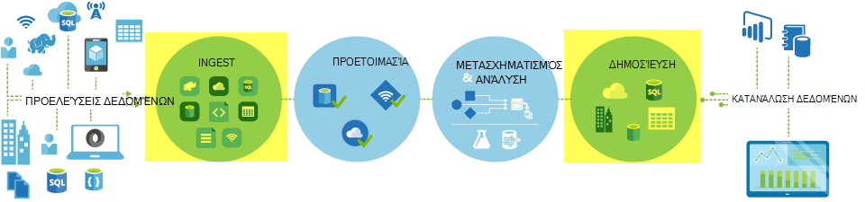
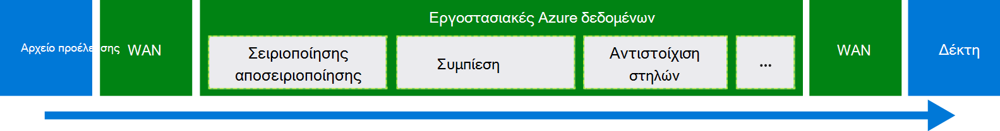
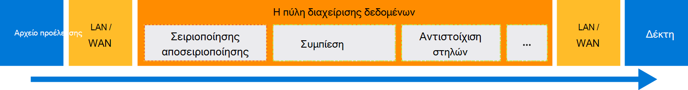

<properties
    pageTitle="Μετακίνηση δεδομένων με χρήση αντιγραφής δραστηριότητας | Microsoft Azure"
    description="Μάθετε περισσότερα σχετικά με την κίνηση δεδομένων στο αγωγούς εργοστασίου δεδομένων: μετεγκατάσταση δεδομένων μεταξύ αποθηκεύει cloud και μεταξύ ενός χώρου αποθήκευσης εσωτερικής εγκατάστασης και ένα χώρο αποθήκευσης στο cloud. Χρησιμοποιήστε τη δραστηριότητα αντίγραφο."
    keywords="Αντιγραφή δεδομένων, μετακίνηση δεδομένων, μετεγκατάσταση δεδομένων, μεταφορά δεδομένων"
    services="data-factory"
    documentationCenter=""
    authors="linda33wj"
    manager="jhubbard"
    editor="monicar"/>

<tags
    ms.service="data-factory"
    ms.workload="data-services"
    ms.tgt_pltfrm="na"
    ms.devlang="na"
    ms.topic="article"
    ms.date="09/22/2016"
    ms.author="jingwang"/>

# Μετακίνηση δεδομένων με χρήση αντιγραφής δραστηριότητας

## Επισκόπηση
Στο Azure εργοστασίου δεδομένων, μπορείτε να χρησιμοποιήσετε δραστηριότητας Αντιγραφή για να αντιγράψετε δεδομένα από διαφορετικά σχήματα από διάφορες εσωτερικής εγκατάστασης και cloud προελεύσεων δεδομένων ώστε να Azure. Μετά την αντιγραφή δεδομένων, μπορεί να περαιτέρω μετασχηματισμό και να αναλύσετε. Μπορείτε επίσης να χρησιμοποιήσετε δραστηριότητας Αντιγραφή για να δημοσιεύσετε το μετασχηματισμό και τα αποτελέσματα της ανάλυσης για επιχειρηματικής ευφυΐας (BI) και κατανάλωση εφαρμογής.

Αντιγραφή δραστηριότητας είναι υποστηρίζεται από μια ασφαλή, αξιόπιστη, με δυνατότητα κλιμάκωσης, και [καθολικά διαθέσιμη υπηρεσία](#global). Σε αυτό το άρθρο παρέχει λεπτομέρειες σχετικά με κίνηση δεδομένων στο εργοστασίου δεδομένων και αντιγραφή δραστηριότητας.

Πρώτα, ας δούμε πώς μετεγκατάσταση δεδομένων πραγματοποιείται μεταξύ δύο χώροι αποθήκευσης δεδομένων cloud και μεταξύ ενός χώρου αποθήκευσης δεδομένων εσωτερικής εγκατάστασης και ένα χώρο αποθήκευσης δεδομένων στο cloud.

> [AZURE.NOTE] Για να μάθετε σχετικά με δραστηριότητες σε γενικές γραμμές, ανατρέξτε στο θέμα [Κατανόηση των αγωγούς και δραστηριότητες](data-factory-create-pipelines.md).

### Αντιγραφή δεδομένων μεταξύ δύο χώροι αποθήκευσης δεδομένων cloud
Όταν οι χώροι αποθήκευσης δεδομένων προέλευσης και δέκτη είναι στο cloud, δραστηριότητας αντίγραφο, έχετε τα ακόλουθα βήματα για να αντιγράψετε δεδομένα από την προέλευση του δέκτη. Η υπηρεσία που προσφέρει αντίγραφο δραστηριότητας:

1. Διαβάζει δεδομένα από το χώρο αποθήκευσης του αρχείου προέλευσης δεδομένων.
2. Εκτελεί σειριοποίησης/αποσειριοποίησης, συμπίεση/αποσυμπίεση, στήλη αντιστοίχιση και μετατροπή τύπου. Κάνει αυτές τις εργασίες με βάση τις ρυθμίσεις παραμέτρων της εισαγωγής συνόλου δεδομένων, σύνολο δεδομένων εξόδου και αντιγραφή δραστηριότητας.
3.  Εγγράφει τα δεδομένα στο χώρο αποθήκευσης δεδομένων προορισμού.

Η υπηρεσία επιλέγει αυτόματα τη βέλτιστη περιοχή για να εκτελέσετε την κυκλοφορία δεδομένων. Αυτή η περιοχή είναι συνήθως αυτήν που βρίσκεται πιο κοντά στο χώρο αποθήκευσης δεδομένων δέκτη.

### Αντιγραφή δεδομένων μεταξύ ενός χώρου αποθήκευσης δεδομένων εσωτερικής εγκατάστασης και ένα χώρο αποθήκευσης δεδομένων στο cloud
Για να μετακινήσετε με ασφάλεια δεδομένα μεταξύ ενός χώρου αποθήκευσης δεδομένων εσωτερικής εγκατάστασης και ένα χώρο αποθήκευσης δεδομένων στο cloud, εγκαταστήστε πύλη διαχείρισης δεδομένων στον υπολογιστή σας στην εσωτερική εγκατάσταση. Η πύλη διαχείρισης δεδομένων είναι παράγοντας που επιτρέπει σε υβριδική κίνηση δεδομένων και επεξεργασία. Μπορείτε να εγκαταστήσετε το στον ίδιο υπολογιστή, όπως τα δεδομένα αποθήκευση ίδιο ή σε νέο υπολογιστή που έχει πρόσβαση στο χώρο αποθήκευσης δεδομένων.

Σε αυτό το σενάριο, η πύλη διαχείρισης δεδομένων εκτελεί την σειριοποίησης/αποσειριοποίησης, συμπίεση/αποσυμπίεση, στήλη αντιστοίχιση και μετατροπή τύπου. Δεν ροής δεδομένων μέσω της υπηρεσίας Azure εργοστασίου δεδομένων. Αντί για αυτό, η πύλη διαχείρισης δεδομένων απευθείας εγγράφει τα δεδομένα του χώρου αποθήκευσης προορισμού.

Ανατρέξτε στο θέμα [Μετακίνηση δεδομένων μεταξύ της εσωτερικής εγκατάστασης και cloud χώροι αποθήκευσης δεδομένων](data-factory-move-data-between-onprem-and-cloud.md) για μια εισαγωγή και αναλυτικές οδηγίες. Για λεπτομερείς πληροφορίες σχετικά με αυτό παράγοντας, ανατρέξτε στο θέμα [Η πύλη διαχείρισης δεδομένων](data-factory-data-management-gateway.md) .

Μπορείτε επίσης να μετακινήσετε δεδομένα από/προς υποστηρίζονται χώροι αποθήκευσης δεδομένων που φιλοξενούνται σε εικονικές μηχανές Azure IaaS (ΣΠΣ) με τη χρήση της πύλης διαχείρισης δεδομένων. Σε αυτήν την περίπτωση, μπορείτε να εγκαταστήσετε πύλη διαχείρισης δεδομένων σε την ίδια εικονική Μηχανή κατά την αποθήκευση των δεδομένων ίδιο ή σε ένα ξεχωριστό Εικονική που έχει πρόσβαση στο χώρο αποθήκευσης δεδομένων.

## Υποστηριζόμενες δεδομένων αποθηκεύει και μορφές
[AZURE.INCLUDE [data-factory-supported-data-stores](../../includes/data-factory-supported-data-stores.md)]

Εάν χρειάζεστε για τη μετακίνηση δεδομένων προς/από δεδομένων αποθηκεύουν που δραστηριότητας αντίγραφο δεν υποστηρίζουν, χρησιμοποιήστε μια **προσαρμοσμένη δραστηριότητα** στην προέλευση δεδομένων με το δικό σας λογική για αντιγραφή/μετακίνηση δεδομένων. Για λεπτομέρειες σχετικά με τη δημιουργία και χρήση μιας προσαρμοσμένης δραστηριότητας, ανατρέξτε στο θέμα [Χρήση προσαρμοσμένες δραστηριότητες σε μια διαδικασία Azure εργοστασίου δεδομένων](data-factory-use-custom-activities.md).

### Υποστηριζόμενες μορφές αρχείων
Μπορείτε να χρησιμοποιήσετε δραστηριότητας Αντιγραφή για να αντιγράψετε τα αρχεία ως-μεταξύ δύο δεδομένων που βασίζονται σε αρχείο χώρους αποθήκευσης, όπως αντικειμένων Blob του Azure, το σύστημα αρχείων και HDFS. Για να το κάνετε αυτό, μπορείτε να μεταβείτε στην [ενότητα μορφή](data-factory-create-datasets.md) σε δύο των ορισμών συνόλου δεδομένων εισόδου και εξόδου. Τα δεδομένα αντιγράφεται αποτελεσματικά χωρίς οποιαδήποτε σειριοποίησης/αποσειριοποίησης.

Αντιγραφή δραστηριότητας επίσης διαβάζει από και γράφει σε αρχεία στο καθορισμένο μορφές: κείμενο, Avro, ORC, Parquet και JSON. Μπορείτε να κάνετε τις ακόλουθες δραστηριότητες αντίγραφο, για παράδειγμα:

-   Αντιγραφή δεδομένων σε μορφή κειμένου (CSV) από το Azure Blob και εγγραφή σε βάση δεδομένων SQL Azure.
-   Αντιγραφή αρχείων σε μορφή κειμένου (CSV) από το σύστημα αρχείων εσωτερικής εγκατάστασης και εγγραφής αντικειμένων Blob του Azure σε μορφή Avro.
-   Αντιγραφή δεδομένων σε βάση δεδομένων SQL Azure και εγγραφής στο HDFS εσωτερικής εγκατάστασης σε μορφή ORC.

## Κίνηση καθολικά διαθέσιμων στοιχείων
Azure εργοστασίου δεδομένων είναι διαθέσιμη μόνο στις περιοχές Δυτική η.π.α., Ανατολικής ΗΠΑ και Βόρειας Ευρώπης. Ωστόσο, η υπηρεσία που προσφέρει δραστηριότητας αντίγραφο είναι διαθέσιμη καθολικά στις ακόλουθες περιοχές και geographies. Τα καθολικά διαθέσιμη τοπολογία εξασφαλίζει κίνηση αποτελεσματική δεδομένων που συνήθως αποτρέπει μεταπηδήσεις σταυρό περιοχής. Ανατρέξτε στο θέμα [υπηρεσίες ανά περιοχή](https://azure.microsoft.com/regions/#services) για τη διαθεσιμότητα των εργοστασίου δεδομένων και μετακίνηση δεδομένων σε μια περιοχή.

### Αντιγραφή δεδομένων μεταξύ cloud χώροι αποθήκευσης δεδομένων
Όταν οι χώροι αποθήκευσης δεδομένων προέλευσης και δέκτη είναι στο cloud, εργοστασίου δεδομένων χρησιμοποιεί μια ανάπτυξη υπηρεσίας στην περιοχή που βρίσκεται πιο κοντά το δέκτη στο το ίδιο Γεωγραφία για να μετακινήσετε τα δεδομένα. Ανατρέξτε στον παρακάτω πίνακα για την αντιστοίχιση:

Περιοχή του χώρου αποθήκευσης δεδομένων προορισμού | Περιοχή που χρησιμοποιείται για τη μεταφορά δεδομένων
:----------------------------------- | :----------------------------
Ανατολικής η.π.α. | Ανατολικής η.π.α.
2 Ανατολικής η.π.α. | 2 Ανατολικής η.π.α.
Δυτική η.π.α. | Δυτική η.π.α.
2 Δυτική η.π.α. | Δυτική η.π.α.
Κεντρική η.π.α. | Κεντρική η.π.α.
Δυτική κεντρικής η.π.α. | Κεντρική η.π.α.
Βόρεια κεντρική η.π.α. | Βόρεια κεντρική η.π.α.
Νότια κεντρικής η.π.α. | Νότια κεντρικής η.π.α.
Βόρεια Ευρώπη | Βόρεια Ευρώπη
Δυτική Ευρώπη | Δυτική Ευρώπη
Νοτιοανατολικής Ασίας | Νοτιοανατολικής Ασίας
Ανατολικής Ασίας | Νοτιοανατολικής Ασίας
Ιαπωνία Ανατολή | Ιαπωνία Ανατολή
Δυτική Ιαπωνία | Ιαπωνία Ανατολή
Νότια Βραζιλίας | Νότια Βραζιλίας
Ανατολική Αυστραλία | Ανατολική Αυστραλία
Αυστραλία νοτιοανατολικής | Αυστραλία νοτιοανατολικής
Κεντρική Ινδίας | Κεντρική Ινδίας
Νότια Ινδίας | Κεντρική Ινδίας
Δυτική Ινδίας | Κεντρική Ινδίας

> [AZURE.NOTE] Εάν η περιοχή του χώρου αποθήκευσης δεδομένων προορισμού δεν είναι στην προηγούμενη λίστα, αντιγραφή δραστηριότητας αποτυγχάνει αντί να μεταβείτε μια εναλλακτική περιοχής.

### Αντιγραφή δεδομένων μεταξύ ενός χώρου αποθήκευσης δεδομένων εσωτερικής εγκατάστασης και ένα χώρο αποθήκευσης δεδομένων στο cloud
Όταν γίνεται αντιγραφή δεδομένων μεταξύ της εσωτερικής εγκατάστασης (ή Azure εικονικές μηχανές/IaaS) και τα αποθηκεύει cloud, [Η πύλη διαχείρισης δεδομένων](data-factory-data-management-gateway.md) εκτελεί κίνηση δεδομένων σε μια εσωτερική ή εικονική υπολογιστή. Τα δεδομένα δεν ρέει μέσω της υπηρεσίας στο cloud, εκτός εάν χρησιμοποιείτε τη δυνατότητα [τοποθετούνται αντίγραφο](data-factory-copy-activity-performance.md#staged-copy) . Σε αυτήν την περίπτωση, δεδομένα ρέει μέσω του ενδιάμεσου σταδίου χώρο αποθήκευσης αντικειμένων Blob του Azure πριν από την εγγραφή στο χώρο αποθήκευσης δεδομένων δέκτη.

## Δημιουργήστε μια διαδικασία με αντιγραφή δραστηριότητας
Μπορείτε να δημιουργήσετε μια διαδικασία με αντιγραφή δραστηριότητα με δύο τρόπους:

### Με χρήση του Οδηγού αντιγραφής
Ο οδηγός αντίγραφο εργοστασίου δεδομένων σάς βοηθά να για να δημιουργήσετε μια διαδικασία με αντιγραφή δραστηριότητας. Αυτή η διαδικασία σάς επιτρέπει να αντιγράψτε δεδομένα από υποστηριζόμενες προελεύσεις τους προορισμούς *χωρίς να συντάξετε JSON* ορισμούς για συνδεδεμένες υπηρεσίες, σύνολα δεδομένων και αγωγούς. Για λεπτομέρειες σχετικά με τον οδηγό, ανατρέξτε στο θέμα [Οδηγός αντίγραφο εργοστασίου δεδομένων](data-factory-copy-wizard.md) .  

### Χρησιμοποιώντας JSON δέσμες ενεργειών
Μπορείτε να χρησιμοποιήσετε πρόγραμμα επεξεργασίας εργοστασίου δεδομένων στην πύλη του Azure, Visual Studio ή Azure PowerShell για να δημιουργήσετε έναν ορισμό JSON για μια διαδικασία (με χρήση δραστηριότητας αντιγραφή). Στη συνέχεια, μπορείτε να αναπτύξετε αυτό για να δημιουργήσετε τη διαδικασία στην προέλευση δεδομένων. Ανατρέξτε στο θέμα [πρόγραμμα εκμάθησης: χρήση δραστηριότητας αντίγραφο στη διοχέτευση ενός εργοστασίου δεδομένων Azure](data-factory-copy-data-from-azure-blob-storage-to-sql-database.md) για ένα πρόγραμμα εκμάθησης με οδηγίες βήμα προς βήμα.    

Ιδιότητες JSON (όπως όνομα, περιγραφή, εισόδου και εξόδου πίνακες και πολιτικές) είναι διαθέσιμες για όλους τους τύπους δραστηριοτήτων. Ιδιότητες που είναι διαθέσιμες στο το `typeProperties` ενότητα της δραστηριότητας ποικίλλουν ανάλογα με κάθε τύπο δραστηριότητας.

Για αντιγραφή δραστηριότητα, η `typeProperties` ενότητα ποικίλλει ανάλογα με τους τύπους προελεύσεων και δέκτες. Κάντε κλικ σε ένα αρχείο προέλευσης/δέκτη στην ενότητα [υποστηριζόμενες προελεύσεις και δέκτες](#supported-data-stores) για να μάθετε σχετικά με τις ιδιότητες τύπος που υποστηρίζει το αντίγραφο δραστηριότητας για αυτόν το χώρο αποθήκευσης δεδομένων.   

Ακολουθεί ένα δείγμα ορισμού JSON:

    {
      "name": "ADFTutorialPipeline",
      "properties": {
        "description": "Copy data from Azure blob to Azure SQL table",
        "activities": [
          {
            "name": "CopyFromBlobToSQL",
            "type": "Copy",
            "inputs": [
              {
                "name": "InputBlobTable"
              }
            ],
            "outputs": [
              {
                "name": "OutputSQLTable"
              }
            ],
            "typeProperties": {
              "source": {
                "type": "BlobSource"
              },
              "sink": {
                "type": "SqlSink",
                "writeBatchSize": 10000,
                "writeBatchTimeout": "60:00:00"
              }
            },
            "Policy": {
              "concurrency": 1,
              "executionPriorityOrder": "NewestFirst",
              "retry": 0,
              "timeout": "01:00:00"
            }
          }
        ],
        "start": "2016-07-12T00:00:00Z",
        "end": "2016-07-13T00:00:00Z"
      }
    }

Καθορίζει το χρονοδιάγραμμα που έχει οριστεί στο του συνόλου δεδομένων εξόδου όταν εκτελείται η δραστηριότητα (για παράδειγμα: **ημερήσια**, συχνότητα ως **ημέρα**και διάστημα ως **1**). Η δραστηριότητα αντιγράφει δεδομένα από ένα σύνολο δεδομένων εισόδου (**προέλευσης**) σε ένα σύνολο δεδομένων εξόδου (**δέκτη**).

Μπορείτε να καθορίσετε περισσότερα από ένα σύνολο δεδομένων εισαγωγής με αντιγραφή δραστηριότητα. Χρησιμοποιούνται για να επαληθεύσετε τις εξαρτήσεις πριν εκτελέσετε τη δραστηριότητα. Ωστόσο, αντιγράφονται μόνο τα δεδομένα από το πρώτο σύνολο δεδομένων για το σύνολο δεδομένων προορισμού. Για περισσότερες πληροφορίες, ανατρέξτε στο θέμα [Προγραμματισμός και εκτέλεση](data-factory-scheduling-and-execution.md).  

## Απόδοσης και της ρύθμισης
Ανατρέξτε στο θέμα [Αντιγραφή δραστηριότητας επιδόσεις και τον Οδηγό ρύθμισης](data-factory-copy-activity-performance.md), που περιγράφει κλειδιού παράγοντες που επηρεάζουν τις επιδόσεις του κίνηση δεδομένων (αντιγραφή δραστηριότητα) στο Azure εργοστασίου δεδομένων. Επίσης, παραθέτει τις επιδόσεις παρατηρούμενη κατά τις δοκιμές εσωτερικές και ασχολείται με διάφορους τρόπους για να βελτιστοποιήσετε την απόδοση της δραστηριότητας αντίγραφο.

## Αντιγραφή προγραμματισμού και διαδοχικές
Ανατρέξτε στο θέμα [Προγραμματισμός και εκτέλεσης](data-factory-scheduling-and-execution.md) για λεπτομερείς πληροφορίες σχετικά με το πώς λειτουργεί η προγραμματισμού και εκτέλεσης στην προέλευση δεδομένων. Είναι δυνατή η εκτέλεση πολλών λειτουργίες αντιγραφής διαδοχικά με τρόπο διαδοχικές/παραγγελθεί. Ανατρέξτε στην ενότητα [παραγγελθεί αντίγραφο](data-factory-scheduling-and-execution.md#ordered-copy) .

## Μετατροπής τύπων
Αποθηκεύει διαφορετικά δεδομένα έχουν διαφορετικό τύπο εγγενή συστήματα. Αντιγραφή δραστηριότητας πραγματοποιεί μετατροπές αυτόματων τύπου από τους τύπους προέλευσης αποδοχή τους τύπους με τα παρακάτω δύο βήματα προσέγγιση:

1. Μετατροπή από τύπους εγγενούς προέλευσης σε έναν τύπο .NET.
2. Μετατροπή από έναν τύπο .NET σε έναν τύπο εγγενούς δέκτη.

Η αντιστοίχιση από ένα σύστημα εγγενούς τύπου σε έναν τύπο .NET για ένα χώρο αποθήκευσης δεδομένων είναι στο άρθρο store αντίστοιχα δεδομένα. (Κάντε κλικ στη συγκεκριμένη σύνδεση στον πίνακα [που υποστηρίζονται χώροι αποθήκευσης δεδομένων](#supported-data-stores) ). Μπορείτε να χρησιμοποιήσετε αυτές τις αντιστοιχίσεις για τον καθορισμό κατάλληλους τύπους κατά τη δημιουργία πινάκων σας, ώστε να δραστηριότητας αντίγραφο εκτελεί τις μετατροπές δεξιά.

## Επόμενα βήματα
- Για να μάθετε περισσότερα σχετικά με τη δραστηριότητα αντίγραφο, ανατρέξτε στο θέμα [Αντιγραφή δεδομένων από το χώρο αποθήκευσης αντικειμένων Blob του Azure με βάση δεδομένων SQL Azure](data-factory-copy-data-from-azure-blob-storage-to-sql-database.md).
- Για να μάθετε σχετικά με τη μετακίνηση δεδομένων από ένα κατάστημα δεδομένων εσωτερικής εγκατάστασης σε ένα χώρο αποθήκευσης δεδομένων στο cloud, ανατρέξτε στο θέμα [Μετακίνηση δεδομένων από εσωτερικής εγκατάστασης στο cloud δεδομένων αποθηκεύει](data-factory-move-data-between-onprem-and-cloud.md).
