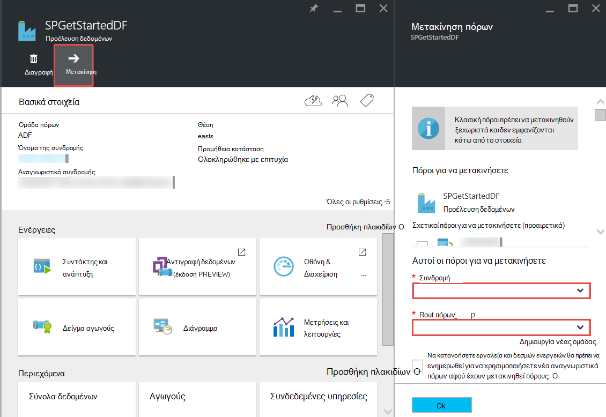

<properties 
    pageTitle="Factory Azure δεδομένων - συνήθεις ερωτήσεις" 
    description="Συνήθεις ερωτήσεις σχετικά με την προέλευση δεδομένων Azure." 
    services="data-factory" 
    documentationCenter="" 
    authors="sharonlo101" 
    manager="jhubbard" 
    editor="monicar"/>

<tags 
    ms.service="data-factory" 
    ms.workload="data-services" 
    ms.tgt_pltfrm="na" 
    ms.devlang="na" 
    ms.topic="article" 
    ms.date="09/12/2016" 
    ms.author="shlo"/>

# Factory Azure δεδομένων - συνήθεις ερωτήσεις

## Γενικές ερωτήσεις

### Τι είναι η προέλευση δεδομένων Azure;

Προέλευση δεδομένων είναι μια βασισμένη στο cloud ενσωμάτωση δεδομένων υπηρεσίας που **αυτοματοποιεί την κίνηση και Μετασχηματισμός των δεδομένων**. Όπως ακριβώς ενός εργοστασίου που εκτελείται εξοπλισμού για να τραβήξετε πρώτες ύλες και μετατροπή τους σε τελικά προϊόντα, εργοστασίου δεδομένων orchestrates υπάρχουσες υπηρεσίες που συλλογής ανεπεξέργαστα δεδομένα και να μετατρέψετε σε πληροφορίες έτοιμη για χρήση. 
 
Εργοστασίου δεδομένων σάς επιτρέπει να δημιουργήσετε τις ροές εργασίας που βασίζονται σε δεδομένα για τη μετακίνηση δεδομένων μεταξύ τόσο εσωτερικής εγκατάστασης και cloud χώροι αποθήκευσης δεδομένων καθώς και διαδικασία/μετασχηματισμού δεδομένων με χρήση υπολογισμού υπηρεσίες όπως το Azure HDInsight και τις αναλύσεις λίμνης Azure δεδομένων. Αφού δημιουργήσετε μια διαδικασία που εκτελεί την ενέργεια που χρειάζεστε, μπορείτε να προγραμματίσετε την εκτέλεσή περιοδικά (ανά ώρα, ημερήσια, εβδομαδιαία, κ.λπ.).   

Ανατρέξτε στο θέμα [Επισκόπηση & έννοιες αριθμού-κλειδιού](data-factory-introduction.md) για περισσότερες λεπτομέρειες. 

### Πού μπορώ να βρω τις τιμές λεπτομερειών για εργοστασίου δεδομένων Azure;

Ανατρέξτε στην ενότητα [σελίδα λεπτομερειών τις τιμές δεδομένων εργοστασίου] [ adf-pricing-details] για τις πληροφορίες τιμολόγησης για την προέλευση δεδομένων Azure.  

### Πώς να γρήγορα αποτελέσματα με εργοστασίου δεδομένων Azure;

- Για μια επισκόπηση του Azure εργοστασίου δεδομένων, ανατρέξτε στο θέμα [Εισαγωγή στις εργοστασιακές Azure δεδομένων](data-factory-introduction.md).
- Για ένα πρόγραμμα εκμάθησης σχετικά με την **Αντιγραφή/Μετακίνηση δεδομένων** με χρήση αντιγραφής δραστηριότητας, ανατρέξτε στο θέμα [Αντιγραφή δεδομένων από το χώρο αποθήκευσης Blob του Azure με βάση δεδομένων SQL Azure](data-factory-copy-data-from-azure-blob-storage-to-sql-database.md).
- Για ένα πρόγραμμα εκμάθησης σχετικά με τον τρόπο **μετασχηματισμού δεδομένων** με χρήση δραστηριότητας Hive HDInsight. Ανατρέξτε στο θέμα [διαδικασία δεδομένων, εκτελώντας Hive δέσμης ενεργειών σε σύμπλεγμα Hadoop](data-factory-build-your-first-pipeline.md) 
  
### Τι είναι η διαθεσιμότητα περιοχή του εργοστασίου τα δεδομένα;
Εργοστασίου δεδομένων είναι διαθέσιμη στο **Δυτική ΗΠΑ** και **Βόρειας Ευρώπης**. Οι υπηρεσίες υπολογισμού και χώρου αποθήκευσης που χρησιμοποιούνται από εργοστάσια δεδομένων μπορεί να είναι σε άλλες περιοχές. Ανατρέξτε στο θέμα [υποστηριζόμενα περιοχές](data-factory-introduction.md#supported-regions). 
 
### Τι είναι τα όρια στον αριθμό των δεδομένων εργοστάσια/αγωγούς/δραστηριότητες/σύνολα δεδομένων;
 
Ανατρέξτε στην ενότητα **Όρια εργοστασίου δεδομένων Azure** αυτού του άρθρου [συνδρομή Azure και όρια υπηρεσίας, όρια, και τους περιορισμούς](../azure-subscription-service-limits.md#data-factory-limits) .

### Τι είναι η εμπειρία σύνταξης προγραμματιστής με την υπηρεσία εργοστασίου δεδομένων Azure;

Μπορείτε να συντάκτης/δημιουργήσετε εργοστάσια δεδομένων χρησιμοποιώντας ένα από τα εξής:

- **Πύλη του Azure**  
   λεπίδες το εργοστασίου δεδομένων στην πύλη του Azure παρέχουν περιβάλλον εργασίας χρήστη εμπλουτισμένου για να δημιουργήσετε δεδομένα εργοστάσια ad συνδεδεμένες υπηρεσίες. Το **Πρόγραμμα επεξεργασίας εργοστασίου δεδομένων**, που είναι επίσης τμήμα της πύλης, σας επιτρέπει να δημιουργήσετε εύκολα συνδεδεμένες υπηρεσίες, πίνακες, σύνολα δεδομένων και αγωγούς, καθορίζοντας ορισμούς JSON για αυτά τα στοιχεία. Για ένα παράδειγμα της χρήσης πύλη/της επεξεργασίας της δημιουργίας και ανάπτυξης ενός εργοστασίου δεδομένων, ανατρέξτε στο θέμα [Δημιουργία του πρώτου διοχέτευσης δεδομένων με Azure πύλη](data-factory-build-your-first-pipeline-using-editor.md) .

- **Visual Studio**  
   μπορείτε να χρησιμοποιήσετε το Visual Studio για τη δημιουργία ενός εργοστασίου Azure δεδομένων. Για λεπτομέρειες, ανατρέξτε στο θέμα [Δημιουργία του πρώτου διοχέτευσης δεδομένων χρήση του Visual Studio](data-factory-build-your-first-pipeline-using-vs.md) . 

- **Azure PowerShell**  
   ανατρέξτε στο θέμα [Δημιουργία και παρακολούθηση Azure εργοστασίου δεδομένων με χρήση του PowerShell Azure](data-factory-build-your-first-pipeline-using-powershell.md) για το πρόγραμμα εκμάθησης/αναλυτικές οδηγίες για τη δημιουργία μιας προέλευσης δεδομένων με χρήση του PowerShell. Ανατρέξτε στο θέμα [Αναφορά Cmdlet εργοστασίου δεδομένων] [ adf-powershell-reference] περιεχομένου στη βιβλιοθήκη MSDN για μια ολοκληρωμένη τεκμηρίωση των cmdlet του εργοστασίου δεδομένων.
   
- **Βιβλιοθήκη κλάσεων .NET**  
   μέσω προγραμματισμού, μπορείτε να δημιουργήσετε εργοστάσια δεδομένων με χρήση του SDK .NET εργοστασίου δεδομένων. Για αναλυτικές οδηγίες για τη δημιουργία ενός εργοστασίου δεδομένων χρησιμοποιώντας .NET SDK, ανατρέξτε στο θέμα [Δημιουργία, παρακολούθηση, και διαχείριση εργοστάσια δεδομένων χρησιμοποιώντας .NET SDK](data-factory-create-data-factories-programmatically.md) . Ανατρέξτε στο θέμα [Αναφορά βιβλιοθήκη κλάσης εργοστασίου δεδομένων] [ msdn-class-library-reference] για μια ολοκληρωμένη τεκμηρίωση του SDK .NET εργοστασίου δεδομένων.

- **REST API**  
   μπορείτε επίσης να χρησιμοποιήσετε το REST API που εκτίθεται από την υπηρεσία Azure εργοστασίου δεδομένων για να δημιουργήσετε και να αναπτύξετε εργοστάσια δεδομένων. Ανατρέξτε στο θέμα [Δεδομένων εργοστασίου REST API αναφορά] [ msdn-rest-api-reference] για μια ολοκληρωμένη τεκμηρίωση των δεδομένων εργοστασίου REST API.
 
- **Azure προτύπου για τη διαχείριση πόρων** 
   ανατρέξτε στο θέμα [πρόγραμμα εκμάθησης: Δημιουργήστε το πρώτο εργοστασίου Azure δεδομένων χρησιμοποιώντας το πρότυπο διαχείρισης πόρων Azure](data-factory-build-your-first-pipeline-using-arm.md) λεπτομέρειες της. 

### Μπορώ να μετονομάσω ενός εργοστασίου δεδομένων;
Όχι. Όπως άλλοι πόροι Azure, δεν μπορεί να αλλάξει το όνομα ενός εργοστασίου Azure δεδομένων. 

### Μπορώ να μετακινήσω μια προέλευση δεδομένων από μία συνδρομές στο Azure σε ένα άλλο; 
Ναι. Χρησιμοποιήστε το κουμπί **Μετακίνηση** στην σας blade εργοστασίου δεδομένων, όπως φαίνεται στο ακόλουθο διάγραμμα. 

### Τι είναι τα περιβάλλοντα υπολογισμού που υποστηρίζονται από το εργοστασίου δεδομένων;
Ο παρακάτω πίνακας παρέχει μια λίστα με περιβάλλοντα υπολογισμού υποστηρίζονται από εργοστασίου δεδομένα και οι δραστηριότητες που μπορεί να εκτελέσει σε αυτά. 

| Τον υπολογισμό περιβάλλον | δραστηριότητες |
| ------------------- | -------- | 
| [Σύμπλεγμα HDInsight on demand](data-factory-compute-linked-services.md#azure-hdinsight-on-demand-linked-service) ή [το δικό σας HDInsight συμπλέγματος](data-factory-compute-linked-services.md#azure-hdinsight-linked-service) | [DotNet](data-factory-use-custom-activities.md), [Hive](data-factory-hive-activity.md), [γουρούνι](data-factory-pig-activity.md), [MapReduce](data-factory-map-reduce.md), [Hadoop ροής](data-factory-hadoop-streaming-activity.md) | 
| [Azure δέσμης](data-factory-compute-linked-services.md#azure-batch-linked-service) | [DotNet](data-factory-use-custom-activities.md) |  
| [Azure μηχανικής εκμάθησης](data-factory-compute-linked-services.md#azure-machine-learning-linked-service) | [Πόρος εκμάθησης δραστηριότητες: εκτέλεση δέσμης και ενημέρωση πόρων](data-factory-azure-ml-batch-execution-activity.md) |
| [Ανάλυση λίμνης Azure δεδομένων](data-factory-compute-linked-services.md#azure-data-lake-analytics-linked-service) | [U-SQL λίμνης ανάλυση δεδομένων](data-factory-usql-activity.md)
| [Azure SQL](data-factory-compute-linked-services.md#azure-sql-linked-service), [αποθήκη δεδομένων του Azure SQL](data-factory-compute-linked-services.md#azure-sql-data-warehouse-linked-service), [SQL Server](data-factory-compute-linked-services.md#sql-server-linked-service) | [Αποθηκευμένη διαδικασία](data-factory-stored-proc-activity.md)

## Δραστηριότητες - συνήθεις Ερωτήσεις
### Τι είναι οι τους διαφορετικούς τύπους δραστηριοτήτων που μπορείτε να χρησιμοποιήσετε σε μια διαδικασία εργοστασίου δεδομένων; 

- [Δραστηριότητες κίνηση δεδομένων](data-factory-data-movement-activities.md) για τη μετακίνηση δεδομένων.
- Οι [Δραστηριότητες μετασχηματισμού δεδομένων](data-factory-data-transformation-activities.md) διαδικασία/μετασχηματισμού δεδομένων. 

### Όταν εκτελείται μια δραστηριότητα;
Η ρύθμιση παραμέτρων **διαθεσιμότητα** στον πίνακα δεδομένων εξόδου καθορίζει κατά την εκτέλεση της δραστηριότητας. Εάν έχουν καθοριστεί εισαγωγής σύνολα δεδομένων, τη δραστηριότητα ελέγχει αν πληρούνται όλες τις εξαρτήσεις εισαγωγής δεδομένων (δηλαδή, **είστε έτοιμοι** κατάσταση) πριν να ξεκινήσει η εκτέλεση. 

## Αντιγραφή δραστηριότητα - συνήθεις Ερωτήσεις
### Είναι καλύτερα να έχετε μια σωλήνωσης με πολλαπλές δραστηριότητες ή μια ξεχωριστή διαδικασία για κάθε δραστηριότητα; 
Αγωγούς πρέπει να ομαδοποιηθούν σχετικές δραστηριότητες. Εάν τα σύνολα δεδομένων που να τα συνδέσετε δεν καταναλώνεται από οποιαδήποτε άλλη δραστηριότητα έξω από τη διαδικασία, μπορείτε να διατηρήσετε τις δραστηριότητες στη μία διοχέτευση. Με αυτόν τον τρόπο, θα δεν πρέπει να αλυσίδα διοχέτευσης ενεργό περιόδων ώστε να συμφωνούν με μεταξύ τους. Επίσης, τα δεδομένα στους πίνακες εσωτερικό της διοχέτευσης καλύτερα διατηρείται η ακεραιότητα κατά την ενημέρωση της διοχέτευσης. Ενημέρωση διοχέτευσης ουσιαστικά σταματά όλων των δραστηριοτήτων εντός της διοχέτευσης καταργεί τους και δημιουργεί ξανά. Από κοινού προοπτική, αυτό μπορεί επίσης να ευκολότερη την προβολή της ροής δεδομένων εντός των σχετικών δραστηριοτήτων σε ένα αρχείο JSON για τη διαδικασία.

### Τι είναι οι χώροι αποθήκευσης δεδομένων υποστηρίζονται;
[AZURE.INCLUDE [data-factory-supported-data-stores](../../includes/data-factory-supported-data-stores.md)]

### Τι είναι οι υποστηριζόμενες μορφές αρχείων; 
[AZURE.INCLUDE [data-factory-file-format](../../includes/data-factory-file-format.md)]

### Όπου εκτελείται η λειτουργία αντιγραφής; 
Ανατρέξτε στην ενότητα [κίνηση καθολικά διαθέσιμων στοιχείων](data-factory-data-movement-activities.md#global) για λεπτομέρειες. Με λίγα λόγια, όταν σχετίζονται για ένα χώρο αποθήκευσης δεδομένων εσωτερικής εγκατάστασης, εκτελείται η λειτουργία Αντιγραφή από την πύλη διαχείρισης δεδομένων στο περιβάλλον σας εσωτερικής εγκατάστασης. Και, όταν η κυκλοφορία δεδομένων μεταξύ των δύο αποθηκεύει cloud, εκτελείται η λειτουργία αντίγραφο στην πλησιέστερη στη θέση του δέκτη στην ίδια τη Γεωγραφία περιοχή. 

## Δραστηριότητα HDInsight - συνήθεις Ερωτήσεις

### Ποιες περιοχές υποστηρίζονται από το HDInsight;

Ανατρέξτε στην ενότητα διαθεσιμότητα γεωγραφικά στο ακόλουθο άρθρο: ή [Λεπτομέρειες τιμολόγησης HDInsight][hdinsight-supported-regions].

### Ποια περιοχή χρησιμοποιείται από ένα σύμπλεγμα HDInsight στην απαιτήσεων;

Το σύμπλεγμα HDInsight σε ζήτηση δημιουργείται στην ίδια περιοχή όπου υπάρχει το χώρο αποθήκευσης που καθορίσατε για χρήση με το σύμπλεγμα.    

### Πώς μπορώ να συσχετίσετε λογαριασμοί επιπλέον χώρο αποθήκευσης για το σύμπλεγμά σας HDInsight;

Εάν χρησιμοποιείτε το δικό σας σύμπλεγμα HDInsight (BYOC - η δική σύμπλεγμα θέτουν), ανατρέξτε στα ακόλουθα θέματα: 

- [Χρησιμοποιώντας ένα σύμπλεγμα HDInsight με λογαριασμούς εναλλακτική χώρου αποθήκευσης και Metastores][hdinsight-alternate-storage]
- [Χρήση λογαριασμών επιπλέον χώρο αποθήκευσης με HDInsight ομάδα][hdinsight-alternate-storage-2]

Εάν χρησιμοποιείτε ένα σύμπλεγμα στη ζήτηση που δημιουργείται από την υπηρεσία εργοστασίου δεδομένων, καθορίστε τους λογαριασμούς επιπλέον χώρο αποθήκευσης για το HDInsight συνδεδεμένες υπηρεσία, έτσι ώστε η υπηρεσία εργοστασίου δεδομένων να τους καταχωρήσετε για λογαριασμό σας. Στον ορισμό JSON για την υπηρεσία συνδεδεμένο σε ζήτηση, χρησιμοποιήστε την ιδιότητα **additionalLinkedServiceNames** για να καθορίσετε λογαριασμούς εναλλάξ χώρου αποθήκευσης, όπως φαίνεται στην το παρακάτω τμήμα κώδικα JSON:
 
    {
        "name": "MyHDInsightOnDemandLinkedService",
        "properties":
        {
            "type": "HDInsightOnDemandLinkedService",
            "typeProperties": {
                "clusterSize": 1,
                "timeToLive": "00:01:00",
                "linkedServiceName": "LinkedService-SampleData",
                "additionalLinkedServiceNames": [ "otherLinkedServiceName1", "otherLinkedServiceName2" ] 
            }
        }
    } 

Στο παραπάνω παράδειγμα, otherLinkedServiceName1 και otherLinkedServiceName2 αντιπροσωπεύουν συνδεδεμένες υπηρεσίες των οποίων ορισμών περιέχουν τα διαπιστευτήρια που χρειάζεται το σύμπλεγμα HDInsight για να αποκτήσετε πρόσβαση σε λογαριασμούς εναλλακτική χώρου αποθήκευσης.

## Φέτες - συνήθεις Ερωτήσεις

### Γιατί δεν είναι μου εισαγωγής φέτες δεν σε κατάσταση ετοιμότητας;  
Ένα συνηθισμένο λάθος δεν είναι ρύθμιση ιδιότητας **εξωτερικών** **true** στην του συνόλου δεδομένων εισαγωγής όταν τα δεδομένα εισόδου είναι εξωτερική η προέλευση δεδομένων (δεν παράγονται από την προέλευση δεδομένων). 

Στο παρακάτω παράδειγμα, θα πρέπει να ορίσετε **εξωτερικών** στην τιμή true σε **dataset1**.  

**DataFactory1** Διοχέτευση 1: dataset1 -> activity1 -> dataset2 -> activity2 -> dataset3 διοχέτευσης 2: dataset3 -> activity3 -> dataset4

Εάν έχετε ένα άλλο εργοστασίου δεδομένων με μια διαδικασία που τίθεται σε dataset4 (παράγονται από διοχέτευσης 2 στην προέλευση δεδομένων 1), σήμανση dataset4 ως ένα σύνολο εξωτερικών δεδομένων, επειδή παράγεται από ενός εργοστασίου διαφορετικά δεδομένα (DataFactory1, δεν DataFactory2) του συνόλου δεδομένων.  

**DataFactory2**    
Διοχέτευση 1: dataset4 -> activity4 -> dataset5

Εάν η εξωτερική ιδιότητα έχει ρυθμιστεί σωστά, επαληθεύστε αν τα δεδομένα εισόδου υπάρχει στη θέση που καθορίζεται στον ορισμό του συνόλου δεδομένων εισόδου. 

### Πώς μπορώ να εκτελέσετε μια φέτα κάποια άλλη στιγμή από τα μεσάνυχτα όταν στη φέτα που παράγεται καθημερινά;
Χρησιμοποιήστε την ιδιότητα **offset** για να καθορίσετε την ώρα στην οποία θέλετε στη φέτα που θα παραχθεί. Ανατρέξτε στην ενότητα [διαθεσιμότητα σύνολο δεδομένων](data-factory-create-datasets.md#Availability) για λεπτομέρειες σχετικά με αυτήν την ιδιότητα. Ακολουθεί ένα γρήγορο παράδειγμα:

    "availability":
    {
        "frequency": "Day",
        "interval": 1,
        "offset": "06:00:00"
    }

Ημερήσιο φέτες Έναρξη στις **6 ΠΜ** αντί για την προεπιλεγμένη τα μεσάνυχτα.     

### Πώς μπορώ να εκτελέσω ξανά μια φέτα;
Μπορείτε να εκτελέσετε ξανά μια φέτα με έναν από τους εξής τρόπους: 

- Χρησιμοποιήστε την οθόνη και διαχείριση εφαρμογών για να εκτελέστε ξανά ένα παράθυρο δραστηριότητας ή φέτα. Για οδηγίες, ανατρέξτε στο θέμα [Επανεκτέλεση επιλεγμένης δραστηριότητα των windows](data-factory-monitor-manage-app.md#re-run-selected-activity-windows) .   
- Κάντε κλικ στην επιλογή **Εκτέλεση** στη γραμμή εντολών του blade **ΦΈΤΑ ΔΕΔΟΜΈΝΩΝ** για τη φέτα στην πύλη του Azure.
- Εκτελέστε το cmdlet **Set-AzureRmDataFactorySliceStatus** με κατάσταση οριστεί σε **Αναμονή** για τη φέτα.   
    
        Set-AzureRmDataFactorySliceStatus -Status Waiting -ResourceGroupName $ResourceGroup -DataFactoryName $df -TableName $table -StartDateTime "02/26/2015 19:00:00" -EndDateTime "02/26/2015 20:00:00" 

Ανατρέξτε στο θέμα [Ορισμός AzureRmDataFactorySliceStatus] [ set-azure-datafactory-slice-status] για λεπτομέρειες σχετικά με το cmdlet. 

### Πόσος χρόνος χρειαστεί να επεξεργαστεί ένα κομμάτι;
Χρησιμοποιήστε την Εξερεύνηση παραθύρου δραστηριότητα στην οθόνη & Διαχείριση εφαρμογών για να μάθετε πόσος χρόνος εκτελέσατε για να επεξεργαστείτε ένα κομμάτι δεδομένων. Για λεπτομέρειες, ανατρέξτε στο θέμα [Explorer παραθύρου δραστηριότητα](data-factory-monitor-manage-app.md#activity-window-explorer) . 

Μπορείτε επίσης να κάνετε τα εξής στην πύλη του Azure:  

1. Κάντε κλικ στο πλακίδιο **συνόλων δεδομένων** στην το blade **ΕΡΓΟΣΤΑΣΊΟΥ ΔΕΔΟΜΈΝΩΝ** για την προέλευση δεδομένων.
2. Κάντε κλικ στο συγκεκριμένο dataset σε blade τα **σύνολα δεδομένων** .
3. Επιλέξτε στη φέτα που σας ενδιαφέρει από τη λίστα **πρόσφατα φέτες** σε blade του **ΠΊΝΑΚΑ** .
4. Επιλέξτε τη δραστηριότητα που εκτελείται από τη λίστα **Δραστηριότητας εκτελείται** σε το blade **ΦΈΤΑ ΔΕΔΟΜΈΝΩΝ** . 
5. Κάντε κλικ στο πλακίδιο **Ιδιότητες** στην το blade **ΛΕΠΤΟΜΈΡΕΙΕΣ ΕΚΤΈΛΕΣΗ ΔΡΑΣΤΗΡΙΌΤΗΤΑΣ** . 
6. Θα πρέπει να βλέπετε το πεδίο " **ΔΙΆΡΚΕΙΑ** " με μια τιμή. Αυτή η τιμή είναι ο χρόνος που λαμβάνονται για την επεξεργασία στη φέτα.   

### Πώς μπορείτε να σταματήσετε μια ενσωματωμένη φέτα;
Εάν θέλετε να διακόψετε τη διαδικασία από την εκτέλεση, μπορείτε να χρησιμοποιήσετε το cmdlet [Αναστολής AzureRmDataFactoryPipeline](https://msdn.microsoft.com/library/mt603721.aspx) . Προς το παρόν, αναστολής της διοχέτευσης δεν εμποδίζει την εκτελέσεις φέτα που βρίσκονται σε εξέλιξη. Αφού ολοκληρώσετε την εκτελέσεις σε εξέλιξη, χωρίς επιπλέον φέτα είναι επιλέξατε προς τα επάνω.

Εάν θέλετε πραγματικά να διακόψετε όλα τα εκτελέσεις αμέσως, θα ήταν ο μόνος τρόπος για να διαγράψετε τη διαδικασία και να δημιουργήσετε ξανά. Εάν επιλέξετε να διαγράψετε τη διαδικασία, δεν χρειάζεται να διαγράψετε τους πίνακες και συνδεδεμένων υπηρεσιών που χρησιμοποιούνται από τη διαδικασία. 

[create-factory-using-dotnet-sdk]: data-factory-create-data-factories-programmatically.md
[msdn-class-library-reference]: https://msdn.microsoft.com/library/dn883654.aspx
[msdn-rest-api-reference]: https://msdn.microsoft.com/library/dn906738.aspx

[adf-powershell-reference]: https://msdn.microsoft.com/library/dn820234.aspx 
[azure-portal]: http://portal.azure.com
[set-azure-datafactory-slice-status]: https://msdn.microsoft.com/library/mt603522.aspx

[adf-pricing-details]: http://go.microsoft.com/fwlink/?LinkId=517777
[hdinsight-supported-regions]: http://azure.microsoft.com/pricing/details/hdinsight/
[hdinsight-alternate-storage]: http://social.technet.microsoft.com/wiki/contents/articles/23256.using-an-hdinsight-cluster-with-alternate-storage-accounts-and-metastores.aspx
[hdinsight-alternate-storage-2]: http://blogs.msdn.com/b/cindygross/archive/2014/05/05/use-additional-storage-accounts-with-hdinsight-hive.aspx
 
