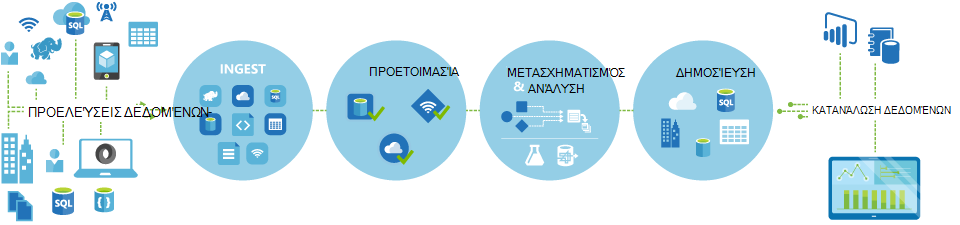
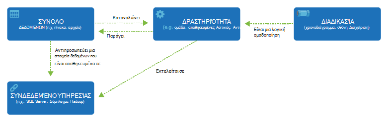

<properties 
    pageTitle="Εισαγωγή στις εργοστασιακές δεδομένων, μια υπηρεσία ενοποίησης δεδομένων | Microsoft Azure" 
    description="Μάθετε τι είναι το Azure εργοστασίου δεδομένων: μια υπηρεσία cloud δεδομένων ενοποίησης που orchestrates και αυτοματοποιεί κίνηση και Μετασχηματισμός των δεδομένων." 
    keywords="ενσωμάτωση δεδομένων, ενσωμάτωση δεδομένων cloud, τι είναι το azure δεδομένων factory"
    services="data-factory" 
    documentationCenter="" 
    authors="sharonlo101" 
    manager="jhubbard" 
    editor="monicar"/>

<tags 
    ms.service="data-factory" 
    ms.workload="data-services" 
    ms.tgt_pltfrm="na" 
    ms.devlang="na" 
    ms.topic="get-started-article" 
    ms.date="09/22/2016" 
    ms.author="shlo"/>

# Εισαγωγή στην υπηρεσία εργοστασίου δεδομένων Azure, μια υπηρεσία ενοποίησης δεδομένων στο cloud

## Τι είναι η προέλευση δεδομένων Azure; 
Προέλευση δεδομένων είναι μια υπηρεσία ενοποίησης δεδομένων που βασίζεται στο cloud που orchestrates και αυτοματοποιεί την **κίνηση** και **Μετασχηματισμός** των δεδομένων. Μπορείτε να δημιουργήσετε δεδομένων ενοποίησης λύσεις που χρησιμοποιούν την υπηρεσία εργοστασίου δεδομένων που μπορούν να ingest δεδομένα από διάφορους χώρους αποθήκευσης δεδομένων, μετασχηματισμός/διαδικασία τα δεδομένα και να δημοσιεύουν τα δεδομένα αποτελέσματος για τους χώρους αποθήκευσης δεδομένων. 

Υπηρεσία εργοστασίου δεδομένων σάς επιτρέπει να δημιουργήσετε αγωγούς δεδομένων που μετακίνηση και μετασχηματισμού δεδομένων και, στη συνέχεια, εκτελέστε το αγωγούς σε καθορισμένο χρονοδιάγραμμα (ανά ώρα, ημερήσια, εβδομαδιαία, κ.λπ.). Παρέχει επίσης εμπλουτισμένες απεικονίσεις για εμφάνιση της καταγωγής και εξαρτήσεων μεταξύ σας αγωγούς δεδομένων και την παρακολούθηση όλα σας αγωγούς δεδομένων από μια ενιαία προβολή ενιαίου για να επισημάνετε εύκολα θέματα και ρύθμιση παρακολούθησης ειδοποιήσεις.

**Figure1.** Ingest δεδομένων από διάφορες προελεύσεις δεδομένων, προετοιμασία, μετασχηματισμός, και να αναλύσετε τα δεδομένα και, στη συνέχεια, δημοσίευση δεδομένων έτοιμη για χρήση για κατανάλωση.

## Αγωγούς και δραστηριότητες
Σε μια λύση εργοστασίου δεδομένων, μπορείτε να δημιουργήσετε ένα ή περισσότερα δεδομένα **αγωγούς**. Μια διαδικασία είναι μια λογική ομαδοποίηση των δραστηριοτήτων. Χρησιμοποιούνται για τις δραστηριότητες ομάδας σε μια μονάδα που μαζί εκτελούν μια εργασία. 

**Δραστηριότητες** Καθορίστε τις ενέργειες που θα αναλάβουν τα δεδομένα σας. Για παράδειγμα, ενδέχεται να μπορείτε να χρησιμοποιήσετε μια δραστηριότητα Αντιγραφή για να αντιγράψετε δεδομένα από το χώρο αποθήκευσης δεδομένων μία άλλη χώρου αποθήκευσης δεδομένων. Ομοίως, μπορείτε να χρησιμοποιήσετε μια δραστηριότητα Hive, που εκτελεί ένα ερώτημα ομάδας σε ένα σύμπλεγμα Azure HDInsight να μετασχηματισμός ή να αναλύσετε τα δεδομένα σας. Προέλευση δεδομένων υποστηρίζει δύο τύπους δραστηριοτήτων: δεδομένων κίνηση δραστηριότητες και οι δραστηριότητες μετασχηματισμού δεδομένων. 
  
## Δραστηριότητες κίνηση δεδομένων 
[AZURE.INCLUDE [data-factory-supported-data-stores](../../includes/data-factory-supported-data-stores.md)]

Δείτε το άρθρο [Δραστηριότητες κίνηση δεδομένων](data-factory-data-movement-activities.md) για περισσότερες λεπτομέρειες. 

## Δραστηριότητες μετασχηματισμού δεδομένων
[AZURE.INCLUDE [data-factory-transformation-activities](../../includes/data-factory-transformation-activities.md)]

Δείτε το άρθρο [Δραστηριότητες μετασχηματισμού δεδομένων](data-factory-data-transformation-activities.md) για περισσότερες λεπτομέρειες.

Εάν χρειάζεστε για τη μετακίνηση δεδομένων προς/από δεδομένων αποθηκεύουν που δραστηριότητας αντίγραφο δεν υποστηρίζουν, ή μετασχηματισμού δεδομένων χρησιμοποιώντας τη δική σας λογικής, δημιουργήστε μια **προσαρμοσμένη δραστηριότητα .NET**. Για λεπτομέρειες σχετικά με τη δημιουργία και χρήση μιας προσαρμοσμένης δραστηριότητας, ανατρέξτε στο θέμα [Χρήση προσαρμοσμένες δραστηριότητες σε μια διαδικασία Azure εργοστασίου δεδομένων](data-factory-use-custom-activities.md).

## Συνδεδεμένες υπηρεσίες
Συνδεδεμένες υπηρεσίες καθορίζουν τις πληροφορίες που χρειάζονται για εργοστασίου δεδομένων για να συνδεθείτε με εξωτερικών πόρων (παραδείγματα: αποθήκευσης Azure, εσωτερικής εγκατάστασης SQL Server Azure HDInsight). Συνδεδεμένες υπηρεσίες χρησιμοποιούνται για δύο λόγους στην προέλευση δεδομένων:

- Για να αντιπροσωπεύει μια **χώρου αποθήκευσης δεδομένων** συμπεριλαμβανομένων, ενδεικτικά, μια εσωτερική SQL Server, βάση δεδομένων της Oracle, αρχείου κοινή χρήση, ή το χώρο αποθήκευσης Blob του Azure λογαριασμού. Ανατρέξτε στην ενότητα [δραστηριότητες κίνηση δεδομένων](data-factory-data-movement-activities.md) για μια λίστα χώρων αποθήκευσης δεδομένων που υποστηρίζονται. 
- Για να αντιπροσωπεύει μια **τον υπολογισμό πόρων** που μπορεί να φιλοξενήσει την εκτέλεση μιας δραστηριότητας. Για παράδειγμα, τη δραστηριότητα HDInsightHive εκτελείται σε ένα σύμπλεγμα HDInsight Hadoop. Ανατρέξτε στην ενότητα [δραστηριότητες μετασχηματισμού δεδομένων](data-factory-data-transformation-activities.md) για μια λίστα των περιβαλλόντων υποστηριζόμενες υπολογισμού. 

## Σύνολα δεδομένων 
Συνδεδεμένες υπηρεσίες σύνδεση χώροι αποθήκευσης δεδομένων σε μια εργοστασίου Azure δεδομένων. Σύνολα δεδομένων αντιπροσωπεύουν δομές δεδομένων με στο χώρο αποθήκευσης δεδομένων. Για παράδειγμα, μια υπηρεσία αποθήκευσης Azure συνδεδεμένες παρέχει πληροφορίες σύνδεσης για εργοστασίου δεδομένων για να συνδεθείτε με ένα λογαριασμό αποθήκευσης Azure. Ένα σύνολο αντικειμένων Blob του Azure δεδομένων καθορίζει το κοντέινερ αντικειμένων blob και ένα φάκελο στο χώρο αποθήκευσης αντικειμένων Blob του Azure από την οποία της διοχέτευσης πρέπει να διαβάσετε τα δεδομένα. Ομοίως, μια υπηρεσία SQL Azure συνδεδεμένες παρέχει πληροφορίες σύνδεσης για μια βάση δεδομένων Azure SQL και ένα σύνολο δεδομένων Azure SQL καθορίζει τον πίνακα που περιέχει τα δεδομένα.   

## Σχέση μεταξύ οντοτήτων εργοστασίου δεδομένων
Προέλευση δεδομένων έχει μερικές βασικές οντοτήτων που συνεργάζονται για να ορίσετε εισαγωγή και εξαγωγή δεδομένων, επεξεργασίας συμβάντα, και το χρονοδιάγραμμα και τους πόρους που απαιτείται για την εκτέλεση της ροής δεδομένα που θέλετε.

**εικόνα 2.** Σχέσεις μεταξύ του συνόλου δεδομένων, δραστηριότητας, διαδικασία και σύνδεση υπηρεσίας

Με τις τέσσερις απλό έννοιες των συνδεδεμένων υπηρεσιών, σύνολα δεδομένων, δραστηριότητες και αγωγούς, είστε έτοιμοι να ξεκινήσετε! Μπορείτε να [δημιουργήσετε το πρώτο διοχέτευσης](data-factory-build-your-first-pipeline.md). 

## Υποστηριζόμενες περιοχές
Προς το παρόν, μπορείτε να δημιουργήσετε εργοστάσια δεδομένων στις περιοχές **Δυτική η.π.α.**, **Ανατολικής ΗΠΑ**και **Βόρειας Ευρώπης** . Ωστόσο, μια προέλευση δεδομένων να πρόσβαση σε χώρους αποθήκευσης δεδομένων και τον υπολογισμό υπηρεσίες σε άλλες περιοχές Azure για τη μετακίνηση δεδομένων μεταξύ χώροι αποθήκευσης δεδομένων ή διαδικασία δεδομένα χρησιμοποιώντας υπηρεσίες τον υπολογισμό. 

Azure εργοστασίου δεδομένων ίδιου δεν αποθηκεύει δεδομένα. Αυτό σας επιτρέπει να δημιουργήσετε ροών που βασίζονται σε δεδομένα για να οργανώσετε μετακίνηση δεδομένων μεταξύ [χώροι αποθήκευσης δεδομένων που υποστηρίζονται](data-factory-data-movement-activities.md#supported-data-stores) και επεξεργασίας δεδομένων χρησιμοποιώντας [τον υπολογισμό υπηρεσίες](data-factory-compute-linked-services.md) σε άλλες περιοχές ή σε ένα περιβάλλον εσωτερικής εγκατάστασης. Επίσης, μπορείτε να [παρακολουθείτε και να διαχειρίζεστε τις ροές εργασίας](data-factory-monitor-manage-pipelines.md) χρησιμοποιώντας και τα δύο μέσω προγραμματισμού και μηχανισμούς περιβάλλοντος εργασίας Χρήστη. 

Παρόλο που εργοστασίου δεδομένων Azure είναι διαθέσιμη στο μόνο **Δυτική η.π.α.**, **Ανατολικής ΗΠΑ**και **Βόρειας Ευρώπης** περιοχές, η υπηρεσία Ενεργοποίηση την κυκλοφορία δεδομένων στην προέλευση δεδομένων είναι διαθέσιμες [καθολικά](data-factory-data-movement-activities.md#global) σε πολλές περιοχές. Σε περίπτωση που ένα χώρο αποθήκευσης δεδομένων βρίσκεται πίσω από ένα τείχος προστασίας, στη συνέχεια, μια [Πύλη διαχείρισης δεδομένων](data-factory-move-data-between-onprem-and-cloud.md) που είναι εγκατεστημένη σε περιβάλλον εσωτερικής εγκατάστασης του μετακινείται τα δεδομένα. 

Για παράδειγμα, ας υποθέσουμε ότι σας περιβάλλοντα υπολογισμού όπως Azure HDInsight σύμπλεγμα και Azure μηχανικής εκμάθησης εκτελούνται εκτός περιοχής Δυτική Ευρώπη. Μπορείτε να δημιουργήσετε και να χρησιμοποιήστε μια παρουσία εργοστασίου δεδομένων Azure Βόρειας Ευρώπης και να το χρησιμοποιήσετε για να προγραμματίζουν εργασίες σε σας περιβάλλοντα υπολογισμού στην Ευρώπη Δυτική. Χρειάζονται μερικά χιλιοστά του δευτερολέπτου για την προέλευση δεδομένων για να ενεργοποιήσετε την εργασία στο περιβάλλον του υπολογισμού, αλλά δεν αλλάζει την ώρα για την εκτέλεση της εργασίας στο περιβάλλον του υπολογιστή σας.

Θα σας σκοπεύετε να έχουν Azure εργοστασίου δεδομένων σε κάθε Γεωγραφία που υποστηρίζονται από το Azure στο μέλλον.
  
## Επόμενα βήματα
Για να μάθετε πώς να δημιουργείτε εργοστάσια δεδομένων με δεδομένα αγωγούς, ακολουθούν οδηγίες βήμα προς βήμα κατά τα παρακάτω προγράμματα εκμάθησης. 

Πρόγραμμα εκμάθησης | Περιγραφή
-------- | -----------
[Δημιουργήστε μια διαδικασία δεδομένων που επεξεργάζεται δεδομένα χρησιμοποιώντας Hadoop συμπλέγματος](data-factory-build-your-first-pipeline.md) | Σε αυτό το πρόγραμμα εκμάθησης, δημιουργείτε την πρώτη εργοστασιακές Azure δεδομένων με μια διαδικασία δεδομένων **διεργασίες δεδομένα** , εκτελώντας Hive δέσμης ενεργειών σε ένα σύμπλεγμα Azure HDInsight (Hadoop). |
[Δημιουργήστε μια διαδικασία δεδομένων για τη μετακίνηση δεδομένων μεταξύ των δύο χώροι αποθήκευσης δεδομένων cloud](data-factory-copy-data-from-azure-blob-storage-to-sql-database.md) | Σε αυτό το πρόγραμμα εκμάθησης, θα δημιουργήσετε ενός εργοστασίου δεδομένων με μια διαδικασία που **πραγματοποιεί μετακίνηση δεδομένων** από το χώρο αποθήκευσης αντικειμένων Blob με βάση δεδομένων SQL.
[Δημιουργήστε μια διαδικασία δεδομένων για τη μετακίνηση δεδομένων μεταξύ ενός χώρου αποθήκευσης δεδομένων εσωτερικής εγκατάστασης και ένα δεδομένων χώρο αποθήκευσης στο cloud χρησιμοποιώντας την πύλη διαχείρισης δεδομένων](data-factory-move-data-between-onprem-and-cloud.md) | Σε αυτό το πρόγραμμα εκμάθησης, δημιουργείτε μια εργοστασίου δεδομένων με μια διαδικασία που **μετακινεί δεδομένα** από μια βάση δεδομένων SQL Server **εσωτερικής εγκατάστασης** σε ένα αντικειμένων blob του Azure. Ως μέρος του αναλυτικές οδηγίες, εγκατάσταση και ρύθμιση παραμέτρων της πύλης διαχείρισης δεδομένων στον υπολογιστή σας. 
