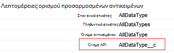
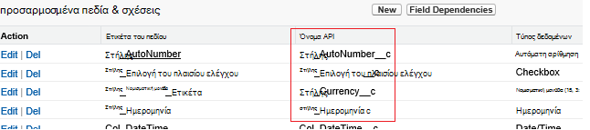

<properties
    pageTitle="Μετακίνηση δεδομένων από το Salesforce, χρησιμοποιώντας δεδομένα εργοστασίου | Microsoft Azure"
    description="Μάθετε σχετικά με τον τρόπο για τη μετακίνηση δεδομένων από το Salesforce χρησιμοποιώντας Azure εργοστασίου δεδομένων."
    services="data-factory"
    documentationCenter=""
    authors="linda33wj"
    manager="jhubbard"
    editor="monicar"/>

<tags
    ms.service="data-factory"
    ms.workload="data-services"
    ms.tgt_pltfrm="na"
    ms.devlang="na"
    ms.topic="article"
    ms.date="10/25/2016"
    ms.author="jingwang"/>

# Μετακίνηση δεδομένων από το Salesforce χρησιμοποιώντας εργοστασίου δεδομένων Azure
Σε αυτό το άρθρο περιγράφει πώς μπορείτε να χρησιμοποιήσετε δραστηριότητας αντίγραφο του ενός εργοστασίου Azure δεδομένων για να αντιγράψετε δεδομένα από Salesforce σε οποιονδήποτε χώρο αποθήκευσης δεδομένων που εμφανίζεται κάτω από τη στήλη δέκτη στον πίνακα [υποστηριζόμενες προελεύσεις και δέκτες](data-factory-data-movement-activities.md#supported-data-stores) . Σε αυτό το άρθρο δημιουργεί στο το άρθρο [δραστηριότητες κίνηση δεδομένων](data-factory-data-movement-activities.md) , το οποίο παρουσιάζει μια γενική επισκόπηση κίνηση δεδομένων με αντιγραφή δραστηριότητας και οι συνδυασμοί χώρου αποθήκευσης δεδομένων που υποστηρίζονται.

Azure εργοστασίου δεδομένων υποστηρίζει επί του παρόντος μόνο μετακίνηση δεδομένων από Salesforce [stores]((data-factory-data-movement-activities.md#supported-data-stores) δεδομένων υποστηρίζονται δέκτη, αλλά δεν υποστηρίζει μετακίνηση δεδομένων από άλλα δεδομένα αποθηκεύονται σε Salesforce κάνει.

## Προαπαιτούμενα στοιχεία
- Πρέπει να χρησιμοποιήσετε μία από τις παρακάτω εκδόσεις του Salesforce: προγραμματιστής Edition, Professional Edition, Enterprise Edition ή απεριόριστες Edition.
- API δικαιωμάτων πρέπει να είναι ενεργοποιημένη. Ανατρέξτε στο θέμα [Πώς μπορώ να ενεργοποιήσω την πρόσβαση API στο Salesforce, ορισμός δικαιωμάτων;](https://www.data2crm.com/migration/faqs/enable-api-access-salesforce-permission-set/)
- Για να αντιγράψετε δεδομένα από το Salesforce χώροι αποθήκευσης δεδομένων εσωτερικής εγκατάστασης, πρέπει να έχετε τουλάχιστον 2.0 πύλης διαχείρισης δεδομένων με εγκαταστήσει το περιβάλλον εσωτερικής εγκατάστασης.

## Όρια αιτήσεων Salesforce
Salesforce έχει όρια για το σύνολο των αιτήσεων API και ταυτόχρονες αιτήσεις API. Ανατρέξτε στην ενότητα "Όρια αίτηση API" στο άρθρο [Salesforce προγραμματιστής όρια](http://resources.docs.salesforce.com/200/20/en-us/sfdc/pdf/salesforce_app_limits_cheatsheet.pdf) για λεπτομέρειες. Σημείωση Εάν ο αριθμός των ταυτόχρονες αιτήσεις υπερβαίνει το όριο, περιορισμού πραγματοποιείται και θα δείτε τυχαίες αποτυχίες; Εάν ο συνολικός αριθμός των αιτήσεων υπερβαίνει το όριο, ο λογαριασμός Salesforce θα αποκλειστούν 24 ώρες; μπορεί επίσης να λάβετε το σφάλμα "REQUEST_LIMIT_EXCEEDED" και στα δύο σενάρια.

## Αντιγραφή δεδομένων οδηγού
Ο ευκολότερος τρόπος για να δημιουργήσετε μια διαδικασία που αντιγράφει δεδομένα από Salesforce σε οποιονδήποτε από τους χώρους αποθήκευσης δεδομένων υποστηρίζονται δέκτη είναι να χρησιμοποιήσετε τον "Οδηγό αντιγραφή δεδομένων". Ανατρέξτε στο θέμα [πρόγραμμα εκμάθησης: δημιουργία μιας διοχέτευσης χρήση οδηγού αντιγραφής](data-factory-copy-data-wizard-tutorial.md) για γρήγορη αναλυτικές οδηγίες σχετικά με τη δημιουργία μιας διοχέτευσης με χρήση του οδηγού αντιγραφή δεδομένων.

Το παρακάτω παράδειγμα παρέχει ορισμούς JSON δείγμα που μπορείτε να χρησιμοποιήσετε για να δημιουργήσετε μια διαδικασία χρησιμοποιώντας την [πύλη του Azure](data-factory-copy-activity-tutorial-using-azure-portal.md), [Visual Studio](data-factory-copy-activity-tutorial-using-visual-studio.md)ή [Azure PowerShell](data-factory-copy-activity-tutorial-using-powershell.md). Εμφανίζονται πώς μπορείτε να αντιγράψετε δεδομένα από το Salesforce χώρο αποθήκευσης Blob του Azure. Ωστόσο, μπορούν να αντιγραφούν δεδομένα σε οποιαδήποτε από τα δέκτες αναφέρεται [εδώ](data-factory-data-movement-activities.md#supported-data-stores) χρησιμοποιώντας τη δραστηριότητα αντίγραφο του Azure εργοστασίου δεδομένων.   

## Δείγμα: Αντιγράψτε δεδομένα από το Salesforce μια αντικειμένων blob του Azure
Αυτό το δείγμα αντιγράφει δεδομένα από το Salesforce μια αντικειμένων blob του Azure κάθε ώρα. Οι ιδιότητες JSON που χρησιμοποιούνται σε αυτά τα παραδείγματα περιγράφονται στις ενότητες μετά τα παραδείγματα. Μπορείτε να αντιγράψετε δεδομένα απευθείας σε κάποιο από τα δέκτες που αναφέρονται στο άρθρο [δραστηριότητες κίνηση δεδομένων](data-factory-data-movement-activities.md#supported-data-stores) με τη χρήση δραστηριότητας αντίγραφο του Azure εργοστασίου δεδομένων.

Εδώ θα βρείτε τα αντικείμενα εργοστασίου δεδομένων που θα χρειαστείτε για να δημιουργήσετε για να υλοποιήσετε το σενάριο. Οι ενότητες που ακολουθούν τη λίστα παρέχουν λεπτομέρειες σχετικά με τα παρακάτω βήματα.

- Συνδεδεμένο υπηρεσίας του τύπου [Salesforce](#salesforce-linked-service-properties)
- Συνδεδεμένο υπηρεσίας του τύπου [AzureStorage](data-factory-azure-blob-connector.md#azure-storage-linked-service-properties)
- Ένα [σύνολο δεδομένων](data-factory-create-datasets.md) εισόδου του τύπου [RelationalTable](#salesforce-dataset-properties)
- Ένα αποτέλεσμα του [συνόλου δεδομένων](data-factory-create-datasets.md) του τύπου [AzureBlob](data-factory-azure-blob-connector.md#azure-blob-dataset-type-properties)
- Μια [διαδικασία](data-factory-create-pipelines.md) με αντιγραφή δραστηριότητα που χρησιμοποιεί [RelationalSource](#relationalsource-type-properties) και [BlobSink](data-factory-azure-blob-connector.md#azure-blob-copy-activity-type-properties)

**Υπηρεσία Salesforce συνδεδεμένες**

Αυτό το παράδειγμα χρησιμοποιεί την υπηρεσία **Salesforce** συνδεδεμένες. Ανατρέξτε στην ενότητα [Salesforce συνδεδεμένες υπηρεσίας](#salesforce-linked-service-properties) για τις ιδιότητες που υποστηρίζονται από αυτήν την υπηρεσία συνδεδεμένων.  Για οδηγίες σχετικά με τον τρόπο επαναφοράς/λήψη του διακριτικού ασφαλείας, ανατρέξτε στο θέμα [λήψη διακριτικού ασφαλείας](https://help.salesforce.com/apex/HTViewHelpDoc?id=user_security_token.htm) .

    {
        "name": "SalesforceLinkedService",
        "properties":
        {
            "type": "Salesforce",
            "typeProperties":
            {
                "username": "<user name>",
                "password": "<password>",
                "securityToken": "<security token>"
            }
        }
    }

**Υπηρεσία αποθήκευσης συνδεδεμένες του Azure**

    {
      "name": "AzureStorageLinkedService",
      "properties": {
        "type": "AzureStorage",
        "typeProperties": {
          "connectionString": "DefaultEndpointsProtocol=https;AccountName=<accountname>;AccountKey=<accountkey>"
        }
      }
    }

**Σύνολο δεδομένων εισαγωγής Salesforce**

    {
        "name": "SalesforceInput",
        "properties": {
            "linkedServiceName": "SalesforceLinkedService",
            "type": "RelationalTable",
            "typeProperties": {
                "tableName": "AllDataType__c"  
            },
            "availability": {
                "frequency": "Hour",
                "interval": 1
            },
            "external": true,
            "policy": {
                "externalData": {
                    "retryInterval": "00:01:00",
                    "retryTimeout": "00:10:00",
                    "maximumRetry": 3
                }
            }
        }
    }

Ρύθμιση **εξωτερικής** στην **τιμή true** ενημερώνει για την υπηρεσία εργοστασίου δεδομένων που του συνόλου δεδομένων είναι εξωτερική την προέλευση δεδομένων και δεν παράγεται από δραστηριότητα την προέλευση δεδομένων.

> [AZURE.IMPORTANT] Το τμήμα "__c" το όνομα API είναι απαραίτητη για οποιαδήποτε προσαρμοσμένα αντικείμενο.

**Σύνολο δεδομένων εξόδου αντικειμένων blob του Azure**

Είναι η εγγραφή δεδομένων σε ένα νέο blob κάθε ώρα (συχνότητα: ώρα, διάστημα: 1).

    {
        "name": "AzureBlobOutput",
        "properties":
        {
            "type": "AzureBlob",
            "linkedServiceName": "AzureStorageLinkedService",
            "typeProperties":
            {
                "folderPath": "adfgetstarted/alltypes_c"
            },
            "availability":
            {
                "frequency": "Hour",
                "interval": 1
            }
        }
    }

**Σωλήνωσης με αντιγραφή δραστηριότητας**

Διοχέτευση περιέχει δραστηριότητα αντίγραφο, που έχει ρυθμιστεί ώστε να χρησιμοποιήσετε το παραπάνω εισόδου και εξόδου σύνολα δεδομένων, και έχει προγραμματιστεί να εκτελείται κάθε ώρα. Στη διοχέτευση ορισμού JSON, ο τύπος **προέλευσης** έχει οριστεί σε **RelationalSource**και τον τύπο **δέκτη** έχει οριστεί σε **BlobSink**.

Ανατρέξτε στο θέμα [RelationalSource ιδιότητες τύπου](#relationalsource-type-properties) για τη λίστα των ιδιοτήτων που υποστηρίζονται από το RelationalSource.

    {  
        "name":"SamplePipeline",
        "properties":{  
            "start":"2016-06-01T18:00:00",
            "end":"2016-06-01T19:00:00",
            "description":"pipeline with copy activity",
            "activities":[  
            {
                "name": "SalesforceToAzureBlob",
                "description": "Copy from Salesforce to an Azure blob",
                "type": "Copy",
                "inputs": [
                {
                    "name": "SalesforceInput"
                }
                ],
                "outputs": [
                {
                    "name": "AzureBlobOutput"
                }
                ],
                "typeProperties": {
                    "source": {
                        "type": "RelationalSource",
                        "query": "SELECT Id, Col_AutoNumber__c, Col_Checkbox__c, Col_Currency__c, Col_Date__c, Col_DateTime__c, Col_Email__c, Col_Number__c, Col_Percent__c, Col_Phone__c, Col_Picklist__c, Col_Picklist_MultiSelect__c, Col_Text__c, Col_Text_Area__c, Col_Text_AreaLong__c, Col_Text_AreaRich__c, Col_URL__c, Col_Text_Encrypt__c, Col_Lookup__c FROM AllDataType__c"             
                    },
                    "sink": {
                        "type": "BlobSink"
                    }
                },
                "scheduler": {
                    "frequency": "Hour",
                    "interval": 1
                },
                "policy": {
                    "concurrency": 1,
                    "executionPriorityOrder": "OldestFirst",
                    "retry": 0,
                    "timeout": "01:00:00"
                }
            }
            ]
        }
    }

> [AZURE.IMPORTANT] Το τμήμα "__c" το όνομα API είναι απαραίτητη για οποιαδήποτε προσαρμοσμένα αντικείμενο.

## Ιδιότητες υπηρεσίας Salesforce συνδεδεμένες

Ο παρακάτω πίνακας παρέχει περιγραφές για στοιχεία JSON που σχετίζονται με την υπηρεσία Salesforce συνδεδεμένες.

| Ιδιότητα | Περιγραφή | Απαιτείται |
| -------- | ----------- | -------- |
| Τύπος | Η ιδιότητα τύπος πρέπει να οριστούν: **Salesforce**. | Ναι |
| όνομα χρήστη |Καθορίστε ένα όνομα χρήστη για το λογαριασμό χρήστη. | Ναι |
| κωδικός πρόσβασης | Καθορίστε έναν κωδικό πρόσβασης για το λογαριασμό χρήστη.  | Ναι |
| securityToken | Καθορίστε έναν κωδικό ασφαλείας για το λογαριασμό χρήστη. Για οδηγίες σχετικά με τον τρόπο επαναφοράς/γρήγορα έναν κωδικό ασφαλείας, ανατρέξτε στο θέμα [λήψη διακριτικού ασφαλείας](https://help.salesforce.com/apex/HTViewHelpDoc?id=user_security_token.htm) . Για να μάθετε σχετικά με την ασφάλεια διακριτικά σε γενικές γραμμές, ανατρέξτε στην ενότητα [Ασφάλεια και το API](https://developer.salesforce.com/docs/atlas.en-us.api.meta/api/sforce_api_concepts_security.htm).  | Ναι |

## Ιδιότητες συνόλου δεδομένων Salesforce

Για μια πλήρη λίστα των ενότητες και τις ιδιότητες που είναι διαθέσιμες για τον ορισμό σύνολα δεδομένων, ανατρέξτε στο άρθρο [Δημιουργία συνόλων δεδομένων](data-factory-create-datasets.md) . Ενότητες όπως δομή, διαθεσιμότητα και την πολιτική από ένα σύνολο δεδομένων JSON είναι παρόμοια για όλους τους τύπους συνόλου δεδομένων (Azure SQL, αντικειμένων blob του Azure, πινάκων του Azure και ούτω καθεξής).

Στην ενότητα **typeProperties** είναι διαφορετικές για κάθε τύπο του συνόλου δεδομένων και παρέχει πληροφορίες σχετικά με τη θέση των δεδομένων στο χώρο αποθήκευσης δεδομένων. Στην ενότητα typeProperties για ένα σύνολο δεδομένων του τύπου **RelationalTable** περιλαμβάνει τις ακόλουθες ιδιότητες:

| Ιδιότητα | Περιγραφή | Απαιτείται |
| -------- | ----------- | -------- |
| όνομα πίνακα | Το όνομα του πίνακα στο Salesforce. | Χωρίς (εάν έχει καθοριστεί ένα **ερώτημα** της **RelationalSource** ) |

> [AZURE.IMPORTANT]  Το τμήμα "__c" το όνομα API είναι απαραίτητη για οποιαδήποτε προσαρμοσμένα αντικείμενο.

## Ιδιότητες τύπου RelationalSource

Για μια πλήρη λίστα των ενότητες και τις ιδιότητες που είναι διαθέσιμες για τον ορισμό δραστηριότητες, ανατρέξτε στο άρθρο [Δημιουργία αγωγούς](data-factory-create-pipelines.md) . Ιδιότητες, όπως όνομα, περιγραφή, εισόδου και εξόδου πίνακες και διάφορες πολιτικές είναι διαθέσιμα για όλους τους τύπους δραστηριοτήτων.

Οι ιδιότητες που είναι διαθέσιμες στην ενότητα typeProperties της δραστηριότητας, από την άλλη πλευρά, ανάλογα με κάθε τύπο δραστηριότητας. Για αντιγραφή δραστηριότητα, τους ποικίλλουν ανάλογα με τους τύπους προελεύσεων και δέκτες.

Στο αντίγραφο δραστηριότητα, όταν το αρχείο προέλευσης είναι του τύπου **RelationalSource** (το οποίο περιλαμβάνει Salesforce), τις ακόλουθες ιδιότητες είναι διαθέσιμες στην ενότητα typeProperties:

| Ιδιότητα | Περιγραφή | Επιτρεπόμενη τιμή | Απαιτείται |
| -------- | ----------- | -------------- | -------- |
| ερώτημα | Χρησιμοποιήστε το προσαρμοσμένο ερώτημα για την ανάγνωση δεδομένων. | Ένα ερώτημα SQL-92 ή ερώτημα [Γλώσσας ερωτήματος αντικείμενο Salesforce (SOQL)](https://developer.salesforce.com/docs/atlas.en-us.soql_sosl.meta/soql_sosl/sforce_api_calls_soql.htm) . Για παράδειγμα: `select * from MyTable__c`. | Χωρίς (εάν έχει καθοριστεί το **όνομα πίνακα** του **συνόλου δεδομένων** ) |

> [AZURE.IMPORTANT] Το τμήμα "__c" το όνομα API είναι απαραίτητη για οποιαδήποτε προσαρμοσμένα αντικείμενο.

## Συμβουλές για ερωτήματα

### Ανάκτηση δεδομένων με χρήση πού όρο σε στήλη ημερομηνίας/ώρας
Καθορίστε πότε το ερώτημα SOQL ή SQL, προσέξτε τη διαφορά μορφή ημερομηνίας/ώρας. Για παράδειγμα:

- **Δείγμα SOQL**: $$Text.Format (' ΕΠΙΛΈΞΤΕ αναγνωριστικό, όνομα, BillingCity από το λογαριασμό όπου LastModifiedDate > = {0:yyyy-MM-ddTHH:mm:ssZ} και LastModifiedDate < {1:yyyy-MM-ddTHH:mm:ssZ}', WindowStart, WindowEnd)
- **Δείγμα SQL**: $$Text.Format (' ΕΠΙΛΟΓΉ * από το λογαριασμό όπου LastModifiedDate > = {{ts\'{0:yyyy-MM-dd HH:mm:ss}\'}} και LastModifiedDate < {{ts\'{1:yyyy-MM-dd HH:mm:ss}\'}}', WindowStart, WindowEnd)'.

### Ανάκτηση δεδομένων από αναφορά Salesforce
Μπορείτε να ανακτήσετε δεδομένα από αναφορές Salesforce, καθορίζοντας ερώτημα ως `{call "<report name>"}`, π.χ. `"query": "{call \"TestReport\"}"`.

### Ανάκτηση διαγραμμένων εγγραφών από τον Κάδο Ανακύκλωσης Salesforce
Ερώτημα για τις εγγραφές απαλές Διαγραμμένα από τον Κάδο Ανακύκλωσης Salesforce, μπορείτε να καθορίσετε **"IsDeleted = 1"** στο ερώτημά σας. Για παράδειγμα, 

- Για να υποβάλετε ερώτημα μόνο τις διαγραμμένες εγγραφές, καθορίστε "επιλέξτε *από MyTable__c * *όπου IsDeleted = 1**"
- Ερώτημα για όλες τις εγγραφές, όπως την υπάρχουσα και τα διαγραμμένα, καθορίστε "επιλέξτε *από MyTable__c * *όπου IsDeleted = 0 ή IsDeleted = 1**"

[AZURE.INCLUDE [data-factory-structure-for-rectangualr-datasets](../../includes/data-factory-structure-for-rectangualr-datasets.md)]

### Αντιστοίχιση τύπων για Salesforce
Τύπος Salesforce | . Τύπος βάσει Καθαρής
--------------- | ---------------
Αυτόματη αρίθμηση | Συμβολοσειρά
Επιλογή του πλαισίου ελέγχου | Δυαδική τιμή
Νομισματική μονάδα | Δύο
Ημερομηνία | Ημερομηνίας και ώρας
Ημερομηνία/ώρα | Ημερομηνίας και ώρας
Μήνυμα ηλεκτρονικού ταχυδρομείου | Συμβολοσειρά
Αναγνωριστικό | Συμβολοσειρά
Σχέση αναζήτησης | Συμβολοσειρά
Λίστα επιλογών πολλαπλής επιλογής | Συμβολοσειρά
Αριθμός | Δύο
Τοις εκατό | Δύο
Τηλέφωνο | Συμβολοσειρά
Λίστα επιλογών | Συμβολοσειρά
Κείμενο | Συμβολοσειρά
Περιοχή κειμένου | Συμβολοσειρά
Περιοχή κειμένου (πλήρης) | Συμβολοσειρά
Περιοχή κειμένου (Rich) | Συμβολοσειρά
Κείμενο (κρυπτογραφημένα) | Συμβολοσειρά
ΔΙΕΎΘΥΝΣΗ URL | Συμβολοσειρά

[AZURE.INCLUDE [data-factory-column-mapping](../../includes/data-factory-column-mapping.md)]
[AZURE.INCLUDE [data-factory-structure-for-rectangualr-datasets](../../includes/data-factory-structure-for-rectangualr-datasets.md)]

## Απόδοσης και της ρύθμισης  
Δείτε τις [επιδόσεις δραστηριότητας αντίγραφο και τον Οδηγό ρύθμισης](data-factory-copy-activity-performance.md) για να μάθετε σχετικά με τους παράγοντες κλειδιού ότι η απόδοση επίδραση κίνηση δεδομένων (αντιγραφή δραστηριότητα) στο Azure δεδομένων εργοστασίου και διάφορους τρόπους για να βελτιστοποιήσετε την.
