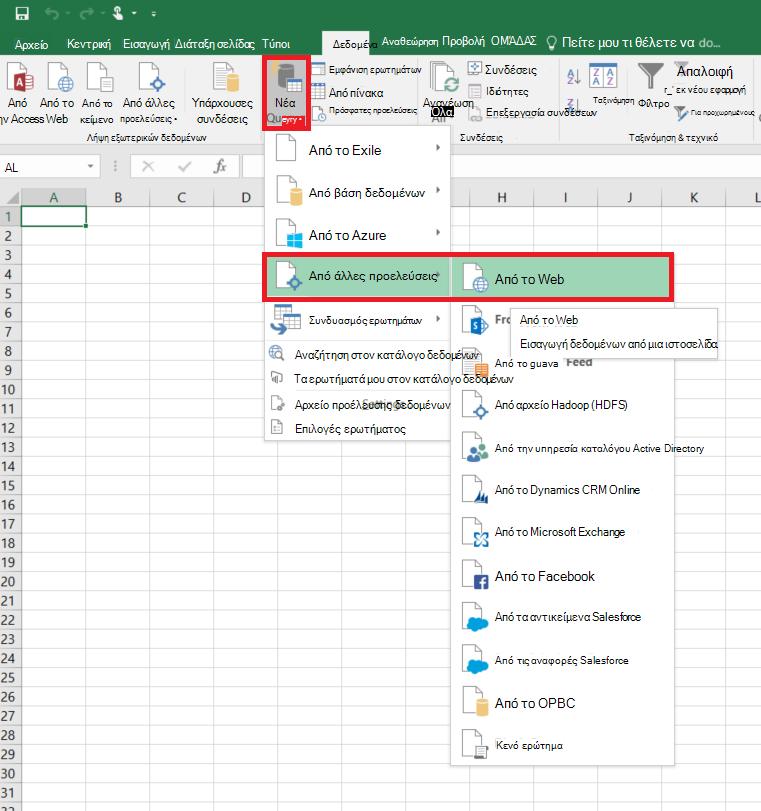
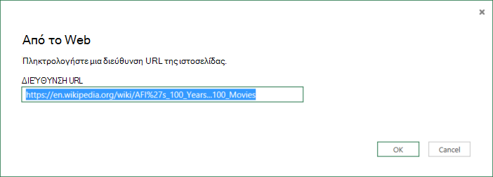
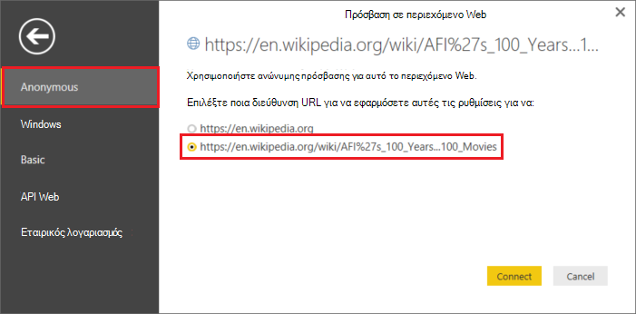
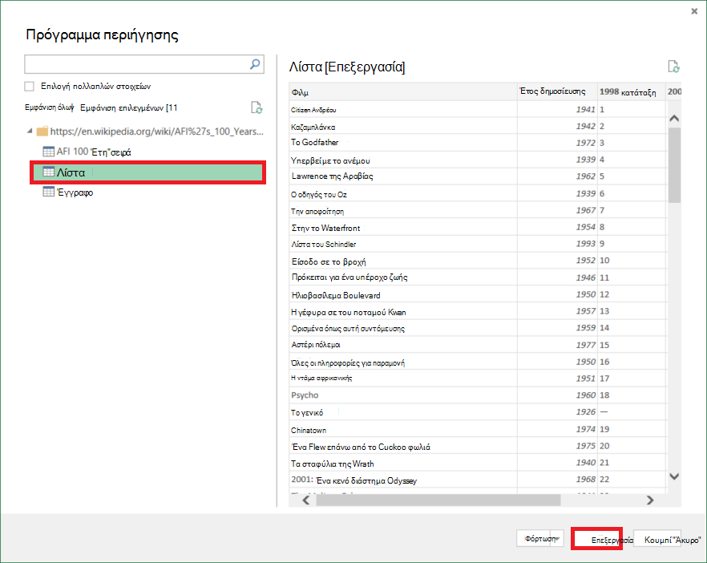
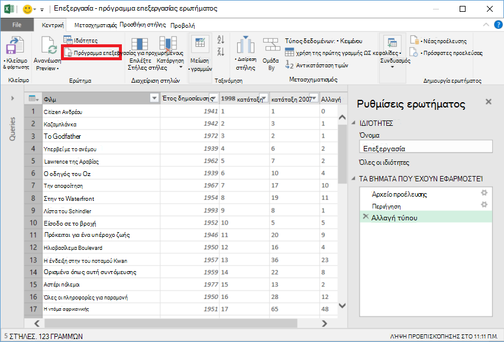
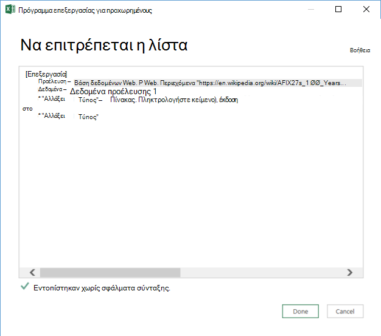

<properties 
    pageTitle="Μετακίνηση δεδομένων από πίνακα Web | Εργοστασιακές Azure δεδομένων" 
    description="Μάθετε σχετικά με τον τρόπο για τη μετακίνηση δεδομένων από εσωτερικής πίνακα σε μια ιστοσελίδα χρησιμοποιώντας Azure εργοστασίου δεδομένων." 
    services="data-factory" 
    documentationCenter="" 
    authors="linda33wj" 
    manager="jhubbard" 
    editor="monicar"/>

<tags 
    ms.service="data-factory" 
    ms.workload="data-services" 
    ms.tgt_pltfrm="na" 
    ms.devlang="na" 
    ms.topic="article" 
    ms.date="09/26/2016" 
    ms.author="jingwang"/>

# Μετακίνηση δεδομένων από μια προέλευση πίνακα Web χρησιμοποιώντας εργοστασίου δεδομένων Azure
Σε αυτό το άρθρο περιγράφει πώς μπορείτε να χρησιμοποιήσετε τη δραστηριότητα αντίγραφο του ενός εργοστασίου Azure δεδομένων για να αντιγράψετε δεδομένα από έναν πίνακα σε μια ιστοσελίδα σε μια άλλη χώρου αποθήκευσης δεδομένων. Σε αυτό το άρθρο δημιουργεί στο το άρθρο [δραστηριότητες κίνηση δεδομένων](data-factory-data-movement-activities.md) , το οποίο παρουσιάζει μια γενική επισκόπηση κίνηση δεδομένων με αντιγραφή δραστηριότητας και οι συνδυασμοί χώρου αποθήκευσης δεδομένων που υποστηρίζονται.

Εργοστασίου δεδομένων υποστηρίζει επί του παρόντος μόνο μετακίνηση δεδομένων από πίνακα Web σε άλλους χώρους αποθήκευσης, αλλά όχι μετακίνηση δεδομένων από άλλα δεδομένα αποθηκεύονται σε έναν προορισμό πίνακα Web.

> [AZURE.NOTE] Αυτή η γραμμή σύνδεσης Web υποστηρίζει επί του παρόντος μόνο το περιεχόμενο εξαγωγής πίνακα από μια σελίδα HTML.

## Δείγμα: Αντιγράψτε δεδομένα από το Web πίνακα αντικειμένων Blob του Azure

Το παρακάτω παράδειγμα εμφανίζει:

1.  Συνδεδεμένο υπηρεσίας [Web](#web-linked-service-properties)του τύπου.
2.  Ένα συνδεδεμένο υπηρεσία του τύπου [AzureStorage](data-factory-azure-blob-connector.md#azure-storage-linked-service-properties).
3.  Μια εισαγωγής [σύνολο δεδομένων](data-factory-create-datasets.md) του τύπου [WebTable](#WebTable-dataset-properties).
4.  Ένα αποτέλεσμα του [συνόλου δεδομένων](data-factory-create-datasets.md) του τύπου [AzureBlob](data-factory-azure-blob-connector.md#azure-blob-dataset-type-properties).
4.  Μια [διαδικασία](data-factory-create-pipelines.md) με αντιγραφή δραστηριότητα που χρησιμοποιεί [WebSource](#websource-copy-activity-type-properties) και [BlobSink](data-factory-azure-blob-connector.md#azure-blob-copy-activity-type-properties).

Το δείγμα αντιγράφει δεδομένα από έναν πίνακα Web μια αντικειμένων blob του Azure κάθε ώρα. Οι ιδιότητες JSON που χρησιμοποιούνται σε αυτά τα δείγματα περιγράφονται στις ενότητες ακολουθώντας τα δείγματα. 

Το παρακάτω παράδειγμα δείχνει πώς μπορείτε να αντιγράψετε δεδομένα από έναν πίνακα Web σε μια αντικειμένων blob του Azure. Ωστόσο, μπορούν να αντιγραφούν τα δεδομένα απευθείας σε κάποιο από τα δέκτες που αναφέρεται στο άρθρο [Δραστηριότητες κίνηση δεδομένων](data-factory-data-movement-activities.md) , χρησιμοποιώντας τη δραστηριότητα αντίγραφο του Azure εργοστασίου δεδομένων. 

**Συνδεδεμένες λίστες υπηρεσίας Web** Αυτό το παράδειγμα χρησιμοποιεί την υπηρεσία Web που είναι συνδεδεμένες με ανώνυμο έλεγχο ταυτότητας. Ανατρέξτε στην ενότητα [υπηρεσία συνδεδεμένες λίστες Web](#web-linked-service-properties) για διαφορετικούς τύπους ελέγχου ταυτότητας που μπορείτε να χρησιμοποιήσετε. 

    {
        "name": "WebLinkedService",
        "properties":
        {
            "type": "Web",
            "typeProperties":
            {
                "authenticationType": "Anonymous",
                "url" : "https://en.wikipedia.org/wiki/"
            }
        }
    }

**Υπηρεσία αποθήκευσης συνδεδεμένες του Azure**

    {
      "name": "AzureStorageLinkedService",
      "properties": {
        "type": "AzureStorage",
        "typeProperties": {
          "connectionString": "DefaultEndpointsProtocol=https;AccountName=<accountname>;AccountKey=<accountkey>"
        }
      }
    }

**Σύνολο δεδομένων εισόδου WebTable** Ρύθμιση **εξωτερικής** στην **τιμή true** ενημερώνει για την υπηρεσία εργοστασίου δεδομένων που του συνόλου δεδομένων είναι εξωτερική την προέλευση δεδομένων και δεν παράγεται από δραστηριότητα την προέλευση δεδομένων.

> [AZURE.NOTE] Ανατρέξτε στην ενότητα [λήψη ευρετηρίου ενός πίνακα σε μια σελίδα HTML](#get-index-of-a-table-in-an-html-page) για τα βήματα για να έχετε ευρετηρίου ενός πίνακα σε μια σελίδα HTML.  

    
    {
        "name": "WebTableInput",
        "properties": {
            "type": "WebTable",
            "linkedServiceName": "WebLinkedService",
            "typeProperties": {
                "index": 1,
                "path": "AFI's_100_Years...100_Movies"
            },
            "external": true,
            "availability": {
                "frequency": "Hour",
                "interval":  1
            }
        }
    }

**Σύνολο δεδομένων εξόδου αντικειμένων Blob του Azure**

Είναι η εγγραφή δεδομένων σε ένα νέο blob κάθε ώρα (συχνότητα: ώρα, διάστημα: 1). 

    {
        "name": "AzureBlobOutput",
        "properties":
        {
            "type": "AzureBlob",
            "linkedServiceName": "AzureStorageLinkedService",
            "typeProperties":
            {
                "folderPath": "adfgetstarted/Movies"
            },
            "availability":
            {
                "frequency": "Hour",
                "interval": 1
            }
        }
    }

**Σωλήνωση με αντιγραφή δραστηριότητα**

Διοχέτευση περιέχει ένα αντίγραφο δραστηριότητα που έχει ρυθμιστεί ώστε να χρησιμοποιήσετε το παραπάνω εισόδου και εξόδου συνόλων δεδομένων και έχει προγραμματιστεί να εκτελείται κάθε ώρα. Στη διοχέτευση ορισμού JSON, ο τύπος **προέλευσης** έχει οριστεί σε **WebSource** και **δέκτη** τύπος έχει οριστεί σε **BlobSink**. 

Ανατρέξτε στο θέμα [WebSource ιδιότητες τύπου](#websource-copy-activity-type-properties) για τη λίστα των ιδιοτήτων που υποστηρίζονται από το WebSource. 
    
    {  
        "name":"SamplePipeline",
        "properties":{  
        "start":"2014-06-01T18:00:00",
        "end":"2014-06-01T19:00:00",
        "description":"pipeline with copy activity",
        "activities":[  
          {
            "name": "WebTableToAzureBlob",
            "description": "Copy from a Web table to an Azure blob",
            "type": "Copy",
            "inputs": [
              {
                "name": "WebTableInput"
              }
            ],
            "outputs": [
              {
                "name": "AzureBlobOutput"
              }
            ],
            "typeProperties": {
              "source": {
                "type": "WebSource"
              },
              "sink": {
                "type": "BlobSink"
              }
            },
           "scheduler": {
              "frequency": "Hour",
              "interval": 1
            },
            "policy": {
              "concurrency": 1,
              "executionPriorityOrder": "OldestFirst",
              "retry": 0,
              "timeout": "01:00:00"
            }
          }
          ]
       }
    }

## Ιδιότητες συνδεδεμένων υπηρεσίας Web

Ο παρακάτω πίνακας παρέχει περιγραφή για στοιχεία JSON ειδικά για συνδεδεμένο υπηρεσία Web.

| Ιδιότητα | Περιγραφή | Απαιτείται |
| -------- | ----------- | -------- | 
| Τύπος | Η ιδιότητα τύπος πρέπει να οριστούν: **Web** | Ναι | 
| Διεύθυνση URL | Διεύθυνση URL για την προέλευση του Web | Ναι |
| authenticationType | Ανώνυμος ή βασικές. | Ναι |
| όνομα χρήστη | Το όνομα χρήστη για βασικό έλεγχο ταυτότητας. | Ναι (για το βασικό έλεγχο ταυτότητας)
| κωδικός πρόσβασης | Ο κωδικός πρόσβασης για το βασικό έλεγχο ταυτότητας. | Ναι (για το βασικό έλεγχο ταυτότητας)

### Χρήση ανώνυμος έλεγχος ταυτότητας

    {
        "name": "web",
        "properties":
        {
            "type": "Web",
            "typeProperties":
            {
                "authenticationType": "Anonymous",
                "url" : "https://en.wikipedia.org/wiki/"
            }
        }
    }

### Χρήση βασικού ελέγχου ταυτότητας
    
    {
        "name": "web",
        "properties":
        {
            "type": "Web",
            "typeProperties":
            {
                "authenticationType": "basic",
                "url" : "http://myit.mycompany.com/",
                "userName": "Administrator",
                "password": "password"
            }
        }
    }

## Ιδιότητες συνόλου δεδομένων WebTable

Για μια πλήρη λίστα των ενοτήτων & ιδιότητες που είναι διαθέσιμες για τον ορισμό σύνολα δεδομένων, ανατρέξτε στο άρθρο [Δημιουργία συνόλων δεδομένων](data-factory-create-datasets.md) . Ενότητες όπως δομή, διαθεσιμότητα και την πολιτική από ένα σύνολο δεδομένων JSON είναι παρόμοια για όλους τους τύπους συνόλου δεδομένων (SQL Azure, αντικειμένων blob του Azure, πινάκων του Azure, κ.λπ.).

Στην ενότητα **typeProperties** είναι διαφορετικές για κάθε τύπο του συνόλου δεδομένων και παρέχει πληροφορίες σχετικά με τη θέση των δεδομένων στο χώρο αποθήκευσης δεδομένων. Στην ενότητα typeProperties για το σύνολο δεδομένων του τύπου **WebTable** περιλαμβάνει τις ακόλουθες ιδιότητες

Ιδιότητα | Περιγραφή | Απαιτείται
:-------- | :----------- | :--------
Τύπος    | τύπος του συνόλου δεδομένων. πρέπει να οριστεί σε **WebTable** | Ναι
διαδρομή | Μια σχετική διεύθυνση URL για τον πόρο που περιέχει τον πίνακα. | Όχι. Όταν δεν έχει καθοριστεί, χρησιμοποιείται μόνο τη διεύθυνση URL που καθορίζεται στον ορισμό συνδεδεμένων υπηρεσιών. 
ευρετήριο | Ο δείκτης του πίνακα στον πόρο. Ανατρέξτε στην ενότητα [λήψη ευρετηρίου ενός πίνακα σε μια σελίδα HTML](#get-index-of-a-table-in-an-html-page) για τα βήματα για να έχετε ευρετηρίου ενός πίνακα σε μια σελίδα HTML. | Ναι

**Παράδειγμα:**

    {
        "name": "WebTableInput",
        "properties": {
            "type": "WebTable",
            "linkedServiceName": "WebLinkedService",
            "typeProperties": {
                "index": 1,
                "path": "AFI's_100_Years...100_Movies"
            },
            "external": true,
            "availability": {
                "frequency": "Hour",
                "interval":  1
            }
        }
    }

## WebSource - ιδιότητες δραστηριότητας Αντιγραφή τύπου

Για μια πλήρη λίστα των ενοτήτων & ιδιότητες που είναι διαθέσιμες για τον ορισμό δραστηριότητες, ανατρέξτε στο άρθρο [Δημιουργία αγωγούς](data-factory-create-pipelines.md) . Ιδιότητες, όπως όνομα, περιγραφή, εισόδου και εξόδου πίνακες και πολιτικής είναι διαθέσιμες για όλους τους τύπους δραστηριοτήτων. 

Ιδιότητες που είναι διαθέσιμες στην ενότητα typeProperties της δραστηριότητας διαφέρει από την άλλη πλευρά με κάθε τύπο δραστηριότητας. Για αντιγραφή δραστηριότητα, τους ποικίλλουν ανάλογα με τους τύπους προελεύσεων και δέκτες.

Προς το παρόν, όταν το αρχείο προέλευσης στο αντίγραφο δραστηριότητας είναι του τύπου **WebSource**, υποστηρίζονται χωρίς πρόσθετες ιδιότητες. 

## Λήψη ευρετηρίου ενός πίνακα σε μια σελίδα HTML

1. Εκκίνηση του **Excel 2016** και μεταβείτε στην καρτέλα " **δεδομένα** ".  
2. Κάντε κλικ στην επιλογή **Νέο ερώτημα** στη γραμμή εργαλείων, επιλέξτε **Από άλλες προελεύσεις** και κάντε κλικ στην επιλογή **Από το Web**.
    
     
3. Στο παράθυρο διαλόγου **Από το Web** , πληκτρολογήστε **διεύθυνση URL** που θα χρησιμοποιήσετε σε συνδεδεμένα υπηρεσίας JSON (για παράδειγμα: https://en.wikipedia.org/wiki/) μαζί με τη διαδρομή που θα πρέπει να καθορίσετε για το σύνολο δεδομένων (για παράδειγμα: AFI % 27s_100_Years... 100_Movies), και κάντε κλικ στο **κουμπί OK**. 

     

    Διεύθυνση URL που χρησιμοποιείται σε αυτό το παράδειγμα: https://en.wikipedia.org/wiki/AFI%27s_100_Years...100_Movies 
4.  Εάν βλέπετε το παράθυρο διαλόγου **περιεχόμενο Web της Access** , επιλέξτε τη σωστή **διεύθυνση URL**, **ελέγχου ταυτότητας**, και κάντε κλικ στην επιλογή **σύνδεση**. 

    
5.  Κάντε κλικ σε ένα στοιχείο **πίνακα** της προβολής δέντρου για να δείτε το περιεχόμενο από τον πίνακα και, στη συνέχεια, κάντε κλικ στο κουμπί **Επεξεργασία** στο κάτω μέρος.  

     

5. Στο παράθυρο του **Προγράμματος επεξεργασίας ερωτήματος** , κάντε κλικ στο **Πρόγραμμα επεξεργασίας για προχωρημένους** κουμπί στη γραμμή εργαλείων.

    

6. Στο παράθυρο διαλόγου πρόγραμμα επεξεργασίας για προχωρημένους, ο αριθμός δίπλα στο στοιχείο "Προέλευση" είναι το ευρετήριο.

     

Εάν χρησιμοποιείτε το Excel 2013, χρησιμοποιήστε [Το Microsoft Power Query για Excel](https://www.microsoft.com/download/details.aspx?id=39379) για να λάβετε το ευρετήριο. Ανατρέξτε στο θέμα [σύνδεση σε μια ιστοσελίδα](https://support.office.com/article/Connect-to-a-web-page-Power-Query-b2725d67-c9e8-43e6-a590-c0a175bd64d8) άρθρου για λεπτομέρειες. Τα βήματα είναι παρόμοια, εάν χρησιμοποιείτε [Το Microsoft Power BI για την επιφάνεια εργασίας](https://powerbi.microsoft.com/desktop/). 

[AZURE.INCLUDE [data-factory-column-mapping](../../includes/data-factory-column-mapping.md)]

[AZURE.INCLUDE [data-factory-structure-for-rectangualr-datasets](../../includes/data-factory-structure-for-rectangualr-datasets.md)]

## Απόδοσης και της ρύθμισης  
Ανατρέξτε στο θέμα [Αντιγραφή δραστηριότητας επιδόσεων και τον Οδηγό ρύθμισης](data-factory-copy-activity-performance.md) για να μάθετε περισσότερα σχετικά με τις βασικές παράγοντες ότι η απόδοση επίδραση κίνηση δεδομένων (αντιγραφή δραστηριότητα) στο Azure δεδομένων εργοστασίου και διάφορους τρόπους για να βελτιστοποιήσετε την.
