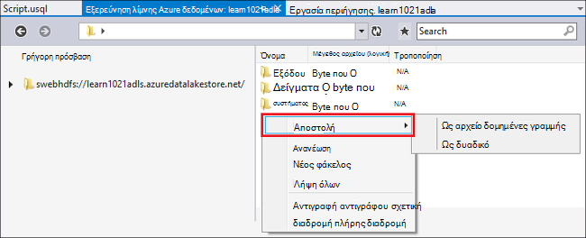
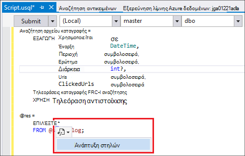
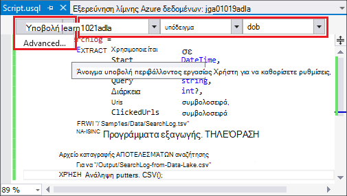
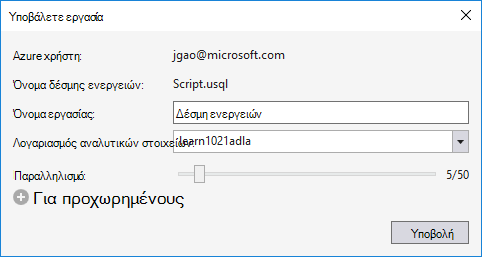
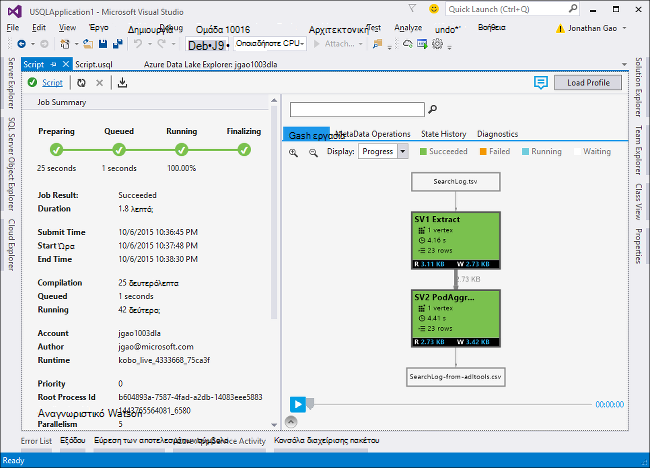
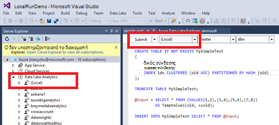
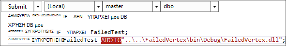

<properties
   pageTitle="Ανάπτυξη δεσμών ενεργειών U-SQL χρησιμοποιώντας εργαλεία λίμνης δεδομένων για το Visual Studio | Azure"
   description="Μάθετε πώς μπορείτε να εγκαταστήσετε εργαλεία λίμνης δεδομένων για το Visual Studio, τον τρόπο ανάπτυξης και δεσμών ενεργειών δοκιμής U-SQL. "
   services="data-lake-analytics"
   documentationCenter=""
   authors="edmacauley"
   manager="jhubbard"
   editor="cgronlun"/>

<tags
   ms.service="data-lake-analytics"
   ms.devlang="na"
   ms.topic="get-started-article"
   ms.tgt_pltfrm="na"
   ms.workload="big-data"
   ms.date="05/16/2016"
   ms.author="edmaca"/>

# Πρόγραμμα εκμάθησης: ανάπτυξη δεσμών ενεργειών U-SQL χρησιμοποιώντας εργαλεία λίμνης δεδομένων για το Visual Studio

[AZURE.INCLUDE [get-started-selector](../../includes/data-lake-analytics-selector-get-started.md)]

Μάθετε πώς μπορείτε να εγκαταστήσετε εργαλεία λίμνης δεδομένων για το Visual Studio και να χρησιμοποιήσετε εργαλεία λίμνης δεδομένων για το Visual Studio να γράψετε και να ελέγξετε δέσμες ενεργειών U-SQL.

U-SQL είναι μια hyper μεταβλητού μεγέθους, ιδιαίτερα επεκτάσιμη γλώσσα για την προετοιμασία, μετασχηματισμός και την ανάλυση όλων των δεδομένων από το λίμνης δεδομένων και μετά. Για περισσότερες πληροφορίες, ανατρέξτε στο θέμα [U SQL αναφορά] (http://go.microsoft.com/fwlink/p/?LinkId=691348).

##Προαπαιτούμενα στοιχεία

- **Visual Studio 2015, το Visual Studio 2013 ενημέρωση 4 ή Visual Studio 2012. Για μεγάλες επιχειρήσεις (Ultimate Premium), Professional, Κοινότητας εκδόσεις υποστηρίζονται. Express edition δεν υποστηρίζεται. Visual Studio "15" δεν υποστηρίζεται αυτήν τη στιγμή και Εργαζόμαστε για αυτό το θέμα.**
- **Microsoft Azure SDK για .NET έκδοση 2.7.1 ή παραπάνω**.  Εγκατάσταση χρησιμοποιώντας το [πρόγραμμα εγκατάστασης πλατφόρμας Web](http://www.microsoft.com/web/downloads/platform.aspx).
- **[Εργαλεία λίμνης δεδομένων για το Visual Studio](http://aka.ms/adltoolsvs)**.

    Μόλις εγκαταστήσετε εργαλεία λίμνης δεδομένων για το Visual Studio, θα δείτε έναν κόμβο "Λίμνης ανάλυσης δεδομένων" στην Εξερεύνηση Server κάτω από τον κόμβο "Azure" (μπορείτε να ανοίξετε Εξερεύνηση Server, πατώντας το συνδυασμό πλήκτρων Ctrl + Alt + S).

- **Μεταβείτε στις παρακάτω δύο ενότητες [Γρήγορα αποτελέσματα με το Azure δεδομένων λίμνης ανάλυσης](data-lake-analytics-get-started-portal.md)χρησιμοποιώντας την πύλη του Azure**.

    - [Δημιουργία λογαριασμού Azure δεδομένων λίμνης ανάλυσης](data-lake-analytics-get-started-portal.md#create_adl_analytics_account).
    - [Αποστολή SearchLog.tsv στον προεπιλεγμένο λογαριασμό χώρος αποθήκευσης δεδομένων λίμνης](data-lake-analytics-get-started-portal.md#update-data-to-the-default-adl-storage-account).

    Για τη διευκόλυνσή σας, μπορείτε να βρείτε ένα δείγμα δέσμης ενεργειών του PowerShell για τη δημιουργία μιας υπηρεσίας ανάλυσης λίμνης δεδομένων και την αποστολή αρχείου προέλευσης δεδομένων στο [δείγμα Appx-A PowerShell για την προετοιμασία το πρόγραμμα εκμάθησης](data-lake-analytics-data-lake-tools-get-started.md#appx-a-powershell-sample-for-preparing-the-tutorial).

    Τα εργαλεία λίμνης δεδομένων δεν υποστηρίζει τη δημιουργία λογαριασμών ανάλυση λίμνης δεδομένων. Επομένως, πρέπει να δημιουργήσετε χρησιμοποιώντας την πύλη Azure, Azure PowerShell, .NET SDK ή Azure CLI. Για να εκτελέσετε μια ανάλυση δεδομένων λίμνης εργασία, θα χρειαστεί ορισμένα δεδομένα. Παρόλο που τα εργαλεία λίμνης δεδομένων υποστηρίζει αποστολής δεδομένων, θα χρησιμοποιήσετε την πύλη για να αποστείλετε το δείγμα δεδομένων για να διευκολύνετε την εκμάθηση για να παρακολουθήσετε.

## Σύνδεση με Azure

**Για να συνδεθείτε με δεδομένα λίμνης ανάλυσης**

1. Ανοίξτε το Visual Studio.
2. Από το μενού **Προβολή** , κάντε κλικ στην επιλογή **Εξερεύνηση Server** για να ανοίξετε την Εξερεύνηση διακομιστή. Ή πατήστε το πλήκτρο **[CTRL] + [ALT] + S**.
3. Κάντε δεξί κλικ **Azure**, κάντε κλικ στην επιλογή "Σύνδεση στο Microsoft Azure συνδρομής" και, στη συνέχεια, ακολουθήστε οδηγίες.
4. Από την **Εξερεύνηση Server**, αναπτύξτε **Azure**και, στη συνέχεια, αναπτύξτε το στοιχείο **Ανάλυση λίμνης δεδομένων**. Μέλη μπορείτε να δείτε μια λίστα με τους λογαριασμούς σας ανάλυση λίμνης δεδομένων, αν υπάρχουν. Δεν μπορείτε να δημιουργήσετε λογαριασμούς ανάλυση λίμνης δεδομένων από το Visual Studio. Για να δημιουργήσετε ένα λογαριασμό, ανατρέξτε στο θέμα [Γρήγορα αποτελέσματα με το Azure δεδομένων λίμνης ανάλυσης με Azure πύλη](data-lake-analytics-get-started-portal.md) ή [Γρήγορα αποτελέσματα με το Azure ανάλυση λίμνης δεδομένων με χρήση του PowerShell Azure](data-lake-analytics-get-started-powershell.md).

## Αποστολή αρχείων προέλευσης δεδομένων

Έχετε αποστείλει ορισμένα δεδομένα στην ενότητα **προαπαιτούμενες** νωρίτερα σε το πρόγραμμα εκμάθησης.  

Σε περίπτωση που θέλετε να χρησιμοποιήσετε τα δικά σας δεδομένα, εδώ θα βρείτε τις διαδικασίες για την αποστολή δεδομένων από τα εργαλεία λίμνης δεδομένων.

**Για να αποστείλετε αρχεία στο λογαριασμό εξαρτώμενα λίμνης δεδομένων Azure**

1. Από την **Εξερεύνηση Server**, ανάπτυξη **Azure**, ανάπτυξη **Ανάλυσης λίμνης δεδομένα**, αναπτύξτε το λογαριασμό σας ανάλυσης δεδομένων λίμνης, αναπτύξτε το στοιχείο **Λογαριασμοί χώρου αποθήκευσης**. Μέλη βλέπετε τον προεπιλεγμένο λογαριασμό χώρος αποθήκευσης δεδομένων λίμνης, και συνδεδεμένους λογαριασμούς χώρος αποθήκευσης δεδομένων λίμνης και συνδεδεμένους λογαριασμούς αποθήκευσης Azure. Τον προεπιλεγμένο λογαριασμό λίμνης δεδομένων έχει μια ετικέτα "Προεπιλεγμένου λογαριασμού χώρου αποθήκευσης".
2. Κάντε δεξί κλικ στον προεπιλεγμένο λογαριασμό αποθήκευση λίμνης δεδομένων και, στη συνέχεια, κάντε κλικ στην επιλογή **Εξερεύνηση**.  Ανοίγει τα εργαλεία λίμνης δεδομένων για το παράθυρο της Εξερεύνησης Visual Studio.  Στο αριστερό, το εμφανίζει μια προβολή δέντρου, η προβολή περιεχομένου στη δεξιά πλευρά.
3. Μεταβείτε στο φάκελο όπου θέλετε να αποστείλετε αρχεία,
4. Κάντε δεξί κλικ σε οποιοδήποτε κενό διάστημα και, στη συνέχεια, κάντε κλικ στην επιλογή **Αποστολή**.

    

**Για να αποστείλετε αρχεία σε ένα συνδεδεμένο λογαριασμό χώρο αποθήκευσης αντικειμένων Blob του Azure**

1. Από την **Εξερεύνηση Server**, ανάπτυξη **Azure**, ανάπτυξη **Ανάλυσης λίμνης δεδομένα**, αναπτύξτε το λογαριασμό σας ανάλυσης δεδομένων λίμνης, αναπτύξτε το στοιχείο **Λογαριασμοί χώρου αποθήκευσης**. Μέλη βλέπετε τον προεπιλεγμένο λογαριασμό χώρος αποθήκευσης δεδομένων λίμνης, και συνδεδεμένους λογαριασμούς χώρος αποθήκευσης δεδομένων λίμνης και συνδεδεμένους λογαριασμούς αποθήκευσης Azure.
2. Αναπτύξτε το λογαριασμό Azure χώρου αποθήκευσης.
3. Κάντε δεξί κλικ στο σημείο που θέλετε να αποστείλετε αρχεία κοντέινερ και, στη συνέχεια, κάντε κλικ στην επιλογή **Εξερεύνηση**. Εάν δεν έχετε ένα κοντέινερ, πρέπει πρώτα να δημιουργήσετε ένα χρησιμοποιώντας την πύλη του Azure, Azure PowerShell ή άλλα εργαλεία.
4. Μεταβείτε στο φάκελο όπου θέλετε να αποστείλετε αρχεία,
5. Κάντε δεξί κλικ σε οποιοδήποτε κενό διάστημα και, στη συνέχεια, κάντε κλικ στην επιλογή **Αποστολή**.

## Ανάπτυξη δεσμών ενεργειών U SQL

Οι εργασίες ανάλυσης λίμνης δεδομένων εγγράφονται στη γλώσσα U-SQL. Για να μάθετε περισσότερα σχετικά με το U-SQL, ανατρέξτε στο θέμα [Γρήγορα αποτελέσματα με το γλώσσα U SQL](data-lake-analytics-u-sql-get-started.md) και [αναφορά γλώσσας U-SQL](http://go.microsoft.com/fwlink/?LinkId=691348).

**Για να δημιουργήσετε και να υποβάλετε μια εργασία ανάλυσης δεδομένων λίμνης**

1. Από το μενού **αρχείο** , κάντε κλικ στην επιλογή **Δημιουργία**και, στη συνέχεια, κάντε κλικ στην επιλογή **έργο**.
2. Επιλέξτε τον τύπο του **Έργου U-SQL** .

    

3. Κάντε κλικ στο **κουμπί OK**. Visual studio δημιουργεί μια λύση με ένα αρχείο **Script.usql** .
4. Πληκτρολογήστε την ακόλουθη δέσμη ενεργειών σε **Script.usql**:

        @searchlog =
            EXTRACT UserId          int,
                    Start           DateTime,
                    Region          string,
                    Query           string,
                    Duration        int?,
                    Urls            string,
                    ClickedUrls     string
            FROM "/Samples/Data/SearchLog.tsv"
            USING Extractors.Tsv();

        @res =
            SELECT *
            FROM @searchlog;        

        OUTPUT @res   
            TO "/Output/SearchLog-from-Data-Lake.csv"
        USING Outputters.Csv();

    Αυτή η δέσμη ενεργειών U SQL διαβάζει το αρχείο προέλευσης δεδομένων με χρήση **Extractors.Tsv()**και, στη συνέχεια, δημιουργεί ένα αρχείο csv χρησιμοποιώντας **Outputters.Csv()**.

    Μην τροποποιείτε τις δύο διαδρομές, εκτός αν έχετε αντιγράψει το αρχείο προέλευσης σε διαφορετική θέση.  Ανάλυση λίμνης δεδομένων θα δημιουργήσει το φάκελο εξόδου, εάν δεν υπάρχει.

    Είναι ευκολότερο να χρησιμοποιήσετε σχετικές διαδρομές για προεπιλεγμένες αποθηκευμένα τα αρχεία δεδομένων λίμνης λογαριασμών. Μπορείτε επίσης να χρησιμοποιήσετε απόλυτες διαδρομές.  Για παράδειγμα

        adl://<Data LakeStorageAccountName>.azuredatalakestore.net:443/Samples/Data/SearchLog.tsv

    Πρέπει να χρησιμοποιήσετε απόλυτες διαδρομές για να αποκτήσετε πρόσβαση σε αρχεία σε συνδεδεμένους λογαριασμούς χώρου αποθήκευσης.  Η σύνταξη για τα αρχεία που είναι αποθηκευμένα σε συνδεδεμένο λογαριασμό Azure χώρου αποθήκευσης είναι:

        wasb://<BlobContainerName>@<StorageAccountName>.blob.core.windows.net/Samples/Data/SearchLog.tsv

    >[AZURE.NOTE] Azure Blob κοντέινερ με αντικείμενα BLOB δημόσια ή τα δικαιώματα πρόσβασης δημόσια κοντέινερ δεν υποστηρίζονται αυτήν τη στιγμή.  

    Παρατηρήστε τις ακόλουθες δυνατότητες:

    - **Το IntelliSense**

        Όνομα αυτόματης ολοκληρωθεί και θα εμφανιστούν τα μέλη για το σύνολο γραμμών, κλάσεις, βάσεις δεδομένων, σχήματα και αντικείμενα που ορίζονται από το χρήστη (UDOs).

        Το IntelliSense για οντοτήτων στον κατάλογο (βάσεις δεδομένων, σχήματα, πίνακες, UDOs κ.λπ.) σχετίζεται με το λογαριασμό σας υπολογισμού. Μπορείτε να ελέγξτε το τρέχον ενεργό υπολογισμού λογαριασμού, βάση δεδομένων και σχήματος στο την επάνω γραμμή εργαλείων και εναλλαγή τους μέσω αναπτυσσόμενη λίστα.

    - **Ανάπτυξη* στηλών**

        Κάντε κλικ στο κουμπί στα δεξιά του *, βλέπετε μια μπλε υπογράμμιση κάτω από το *. Τοποθετήστε το δείκτη του δείκτη του ποντικιού στην το μπλε υπογράμμιση και, στη συνέχεια, κάντε κλικ στο κάτω βέλος.
        

        Κάντε κλικ στην επιλογή **Ανάπτυξη στηλών**, το εργαλείο θα αντικαταστήσει το * με τα ονόματα των στηλών.

    - **Αυτόματη μορφοποίηση**

        Οι χρήστες μπορούν να αλλάξουν τις εσοχές της δέσμης ενεργειών U SQL με βάση τον κωδικό δομής στην περιοχή επεξεργασία, -> για προχωρημένους:

        - Μορφοποίηση εγγράφου (Ctrl + E, D): Μορφοποιεί ολόκληρο το έγγραφο   
        - Επιλογή μορφής (Ctrl + K, Ctrl + F): Μορφές της επιλογής. Εάν έχει γίνει καμία επιλογή, αυτήν τη συντόμευση μορφές στη γραμμή που βρίσκεται ο δρομέας.  

        Όλης της μορφοποίησης κανόνες είναι δυνατό να ρυθμιστούν στην περιοχή Εργαλεία -> Επιλογές -> πρόγραμμα επεξεργασίας κειμένου - > SIP -> μορφοποίηση.  
    - **Έξυπνη εσοχής**

        Εργαλεία λίμνης δεδομένων για το Visual Studio είναι σε θέση να εσοχής παραστάσεις αυτόματα, ενώ γράφετε δεσμών ενεργειών. Αυτή η δυνατότητα είναι απενεργοποιημένη από προεπιλογή, οι χρήστες πρέπει να την ενεργοποιήσετε μέσω έλεγχος U-SQL -> Επιλογές και ρυθμίσεις -> διακόπτες -> Ενεργοποίηση έξυπνη εσοχής.

    - **Μεταβείτε στον ορισμό και εύρεση όλων των αναφορών**

        Κάνοντας δεξί κλικ στο όνομα του ένα σύνολο γραμμών/παράμετρο/στηλών/UDO κ.λπ. και κάνοντας κλικ στην επιλογή Μετάβαση σε ορισμό (F12) σάς επιτρέπει να περιηγηθείτε τον ορισμό της. Κάνοντας κλικ στην επιλογή Εύρεση όλων των αναφορών (Shift + F12), θα εμφανίζει όλες τις αναφορές.

    - **Εισαγωγή Azure διαδρομής**

        Αντί να θυμάστε διαδρομή του αρχείου Azure και τον τύπο με μη αυτόματο τρόπο όταν συντάσσετε δέσμη ενεργειών, εργαλεία λίμνης δεδομένων για το Visual Studio παρέχει ένας εύκολος τρόπος: κάντε δεξί κλικ στο πρόγραμμα επεξεργασίας, κάντε κλικ στην επιλογή Εισαγωγή διαδρομής Azure. Μεταβείτε στο αρχείο στο παράθυρο διαλόγου περιήγησης αντικειμένων Blob του Azure. Κάντε κλικ στο **κουμπί OK**. η διαδρομή του αρχείου θα εισαχθεί σας κώδικα.

5. Καθορίστε ανάλυσης δεδομένων λίμνης λογαριασμού, βάση δεδομένων, και σχήματος. Μπορείτε να επιλέξετε **(τοπικά)** για να εκτελέσετε τη δέσμη ενεργειών τοπικά για το σκοπό του ελέγχου. Για περισσότερες πληροφορίες, ανατρέξτε στο θέμα [Εκτέλεση U-SQL τοπικά](#run-u-sql-locally).

    

    Για περισσότερες πληροφορίες, ανατρέξτε στο θέμα [Χρήση U-SQL στον κατάλογο](data-lake-analytics-use-u-sql-catalog.md).

5. Από την **Εξερεύνηση λύσεων**, κάντε δεξί κλικ **Script.usql**και, στη συνέχεια, κάντε κλικ στην επιλογή **Δημιουργία δέσμης ενεργειών**. Επιβεβαιώστε το αποτέλεσμα στο παράθυρο εξόδου.
6. Από την **Εξερεύνηση λύσεων**, κάντε δεξί κλικ **Script.usql**και, στη συνέχεια, κάντε κλικ στην επιλογή **Υποβολή δέσμης ενεργειών**. Προαιρετικά, μπορείτε επίσης να επιλέξετε **Υποβολή** από Script.usql παράθυρο.  Ανατρέξτε στο θέμα το προηγούμενο στιγμιότυπο οθόνης.  Κάντε κλικ στο κάτω βέλος δίπλα στο κουμπί "Υποβολή" για να υποβάλετε χρησιμοποιώντας τις επιλογές εκ των προτέρων:
7. Καθορίστε **Το όνομα της εργασίας**, επιβεβαιώστε το **Λογαριασμό αναλυτικών στοιχείων**και, στη συνέχεια, κάντε κλικ στην επιλογή **Υποβολή**. Αποτελέσματα υποβολής και σύνδεση εργασίας είναι διαθέσιμες στα εργαλεία λίμνης δεδομένων για το παράθυρο του Visual Studio προκαλεί όταν ολοκληρωθεί η υποβολή.

    

8. Πρέπει να κάνετε κλικ στο κουμπί Ανανέωση για να δείτε την πιο πρόσφατη κατάσταση της εργασίας και ανανέωση της οθόνης. Όταν το επιτυχίες εργασία, θα εμφανίζεται που το **Γράφημα εργασία**, **Λειτουργίες δεδομένων μετα** **Ιστορικό κατάστασης**, **Διαγνωστικά**:

    

    * Εργασία σύνοψης. Εμφανίζονται οι συνοπτικές πληροφορίες της τρέχουσας εργασίας, π.χ.: κατάσταση προόδου, χρόνος εκτέλεσης, όνομα χρόνου εκτέλεσης, υποβάλλοντος κ.λπ.   
    * Λεπτομέρειες εργασίας. Παρέχονται λεπτομερείς πληροφορίες σχετικά με αυτήν την εργασία, συμπεριλαμβανομένων των δεσμών ενεργειών, πόρος, προβολή εκτέλεσης κορυφής.
    * Γράφημα εργασία. Τέσσερα γραφήματα παρέχονται για την απεικόνιση των πληροφοριών του έργου: προόδου, ανάγνωση δεδομένων, η εγγραφή των δεδομένων, χρόνος εκτέλεσης, Μέσος χρόνος εκτέλεσης ανά κόμβο, μετάδοσης εισαγωγής, μετάδοσης εξόδου.
    * Εργασίες μετα-δεδομένων. Εμφανίζει όλες τις λειτουργίες μετα-δεδομένων.
    * Το ιστορικό κατάστασης.
    * Διαγνωστικά. Εργαλεία λίμνης δεδομένων για το Visual Studio θα διάγνωση εκτέλεσης εργασίας αυτόματα. Θα λαμβάνετε ειδοποιήσεις όταν υπάρχουν ορισμένα σφάλματα ή προβλήματα επιδόσεων σε εργασίες τους. Ανατρέξτε στο θέμα εργασία μέρος Διαγνωστικά (σύνδεση TBD) για περισσότερες πληροφορίες.

**Για να ελέγξετε την κατάσταση εργασίας**

1. Από την Εξερεύνηση διακομιστών, αναπτύξτε το στοιχείο **Azure**, ανάπτυξη **Ανάλυσης λίμνης δεδομένων**, αναπτύξτε το όνομα του λογαριασμού ανάλυση λίμνης δεδομένων
2. Κάντε διπλό κλικ **εργασίες** για μια λίστα των εργασιών.
2. Κάντε κλικ σε μια εργασία για να δείτε την κατάσταση.

**Για να δείτε το αποτέλεσμα του έργου**

1. Από την **Εξερεύνηση Server**, αναπτύξτε **Azure**, ανάπτυξη **Ανάλυσης δεδομένων λίμνης**, αναπτύξτε το λογαριασμό σας ανάλυσης δεδομένων λίμνης, αναπτύξτε **Τους λογαριασμούς χώρου αποθήκευσης**, κάντε δεξί κλικ στον προεπιλεγμένο λογαριασμό χώρος αποθήκευσης δεδομένων λίμνης και, στη συνέχεια, κάντε κλικ στην επιλογή **Εξερεύνηση**.
2.  Κάντε διπλό κλικ στο **αποτέλεσμα** για να ανοίξετε το φάκελο
3.  Κάντε διπλό κλικ **SearchLog από adltools.csv**.

###Αναπαραγωγή εργασία

Αναπαραγωγή εργασίας σάς επιτρέπει να παρακολούθηση της προόδου εργασίας εκτέλεσης και οπτικά εντοπίζει τις επιδόσεις ανωμαλίες και συνωστισμών. Αυτή η δυνατότητα μπορεί να χρησιμοποιηθεί πριν ολοκληρωθεί η εργασία εκτέλεσης (δηλαδή στη διάρκεια του χρόνου ενεργά εκτελείται η εργασία), καθώς και μετά την ολοκλήρωση της εκτέλεσης του. Με τον τρόπο αναπαραγωγής κατά την εκτέλεση του έργου επιτρέπει στο χρήστη να αναπαραγάγετε την πρόοδο προς το παρόν.

**Για να δείτε την πρόοδο εκτέλεσης εργασίας**  

1. Στην επάνω δεξιά γωνία, κάντε κλικ στην επιλογή **Φόρτωση προφίλ** . Ανατρέξτε στην προηγούμενη οθόνη στιγμιότυπο.
2. Κάντε κλικ στο κουμπί "Αναπαραγωγή" στην κάτω αριστερή γωνία για να δείτε την πρόοδο εκτέλεσης της εργασίας.
3. Κατά την αναπαραγωγή, κάντε κλικ στην επιλογή **Παύση** για να διακόψετε την ή απευθείας σύρετε τη γραμμή προόδου σε συγκεκριμένες θέσεις.

###Χάρτης θερμότητας

Εργαλεία λίμνης δεδομένων για το Visual Studio παρέχει δυνατότητα επιλογής χρήστη επικαλύψεις χρωμάτων στην προβολή έργου για να υποδείξετε την πρόοδο, δεδομένα εισόδου/εξόδου, χρόνος εκτέλεσης, μετάδοσης εισόδου/εξόδου κάθε σταδίου. Έως αυτό, οι χρήστες μπορούν να καταλαβαίνετε πιθανά προβλήματα και κατανομή των Ιδιότητες εργασίας απευθείας και εύκολα. Μπορείτε να επιλέξετε ένα αρχείο προέλευσης δεδομένων για να εμφανίσετε από την αναπτυσσόμενη λίστα.  

## Εκτέλεση τοπικά U-SQL

Χρήση του τοπικού U-SQL εκτέλεση εμπειρία στο Visual Studio, μπορείτε να:

- Εκτέλεση δεσμών ενεργειών U-SQL τοπικά, καθώς και C# συγκροτήσεις.
- Εντοπισμός σφαλμάτων C# συγκροτήσεις τοπικά.
- Δημιουργία/Διαγραφή/προβολής τοπικές βάσεις δεδομένων, συγκροτήσεις, σχήματα και πίνακες στην Εξερεύνηση διακομιστή ακριβώς όπως θα μπορείτε να κάνετε για την υπηρεσία Azure δεδομένων λίμνης ανάλυσης.

Θα δείτε ένα *τοπικό* λογαριασμό στο Visual Studio και το πρόγραμμα Εγκατάστασης δημιουργεί μια *DataRoot* φάκελος βρίσκεται *C:\LocalRunRoot*. Ο φάκελος DataRoot θα χρησιμοποιηθεί:

- Χώρος αποθήκευσης μετα-δεδομένων όπως οι πίνακες, Demand DBs, TVFs, κ.λπ.
- Για μια δέσμη ενεργειών: Εάν μια σχετική διαδρομή γίνεται αναφορά σε διαδρομές εισόδου/εξόδου, θα σας θα αναζητήσετε το DataRoot (καθώς και τη δέσμη ενεργειών διαδρομή εάν εισόδου της το αυτό)
- ΔΕΝ θα γίνει παραπομπή στο φάκελο DataRoot Εάν προσπαθείτε να καταχωρήσετε μια συγκρότησης και να χρησιμοποιήσετε μια σχετική διαδρομή (ανατρέξτε στο θέμα "Χρήση συγκροτήσεις όταν κάνοντας τοπική εκτέλεση" τμήμα για περισσότερες λεπτομέρειες)

Το βίντεο που ακολουθεί παρουσιάζει τη δυνατότητα εκτέλεσης τοπικό U-SQL:

>[AZURE.VIDEO usql-localrun]

### Γνωστά θέματα και περιορισμούς

- Δεν είναι δυνατή η δημιουργία πίνακα/DB κ.λπ. στην Εξερεύνηση Server για λογαριασμού του τοπικού.
- Αν μια σχετική διαδρομή η αναφορά είναι:

    - Στην εισαγωγή δέσμης ενεργειών (ΕΞΑΓΆΓΕΤΕ * από "/ διαδρομή/abc")-τη διαδρομή DataRoot και η διαδρομή δέσμης ενεργειών θα γίνει αναζήτηση.
    - Στη δέσμη ενεργειών εξόδου (ΕΞΌΔΟΥ σε "διαδρομή abc"): η διαδρομή DataRoot θα χρησιμοποιηθεί ως το φάκελο εξόδου.
    - Κατά την καταχώρηση του συγκρότησης (ΔΗΜΙΟΥΡΓΊΑ ΣΥΓΚΡΌΤΗΣΗΣ xyz από "/ διαδρομή/abc"): η διαδρομή δέσμης ενεργειών θα γίνει αναζήτηση, αλλά δεν το DataRoot.
    - Στο registered TVF/προβολή ή άλλων οντοτήτων μετα-δεδομένων: η διαδρομή DataRoot θα γίνει αναζήτηση, αλλά όχι τη διαδρομή δέσμης ενεργειών.

    Για τις δέσμες ενεργειών εκτελέσατε την υπηρεσία λίμνης δεδομένων, τον προεπιλεγμένο λογαριασμό χώρου αποθήκευσης που θα χρησιμοποιηθεί ως ριζικό φάκελο και θα γίνει αναζήτηση ανάλογα.

### Δοκιμή τοπικά δέσμες ενεργειών U SQL
Για οδηγίες σχετικά με την ανάπτυξη δεσμών ενεργειών U-SQL, ανατρέξτε στο θέμα [Ανάπτυξη U-SQL δεσμών ενεργειών](#develop-and-test-u-sql-scripts). Για να δημιουργήσετε και να εκτελέσετε U-SQL δέσμες ενεργειών τοπικά, επιλέξτε **(τοπικά)** στην αναπτυσσόμενη λίστα συμπλέγματος και, στη συνέχεια, κάντε κλικ στην επιλογή **Υποβολή**. Πληκτρολογήστε βεβαιωθείτε ότι έχετε τα σωστά δεδομένα στα οποία γίνεται αναφορά - είτε αναφέρονται στη διαδρομή απόλυτη ή να τοποθετήσετε τα δεδομένα κάτω από το φάκελο DataRoot.

Μπορείτε να επίσης κάντε δεξί κλικ σε μια δέσμη ενεργειών και, στη συνέχεια, κάντε κλικ στην επιλογή **Εκτέλεση τοπικό πρόγραμμα** από το μενού περιβάλλοντος ή πατήστε το **Συνδυασμό πλήκτρων CTRL + F5** έναυσμα τοπική εκτέλεση.

### Χρήση συγκροτήσεις σε τοπική εκτέλεση

Υπάρχουν δύο τρόποι για να εκτελέσετε τα προσαρμοσμένα αρχεία C#:

- Γράψτε συγκροτήσεις στον κώδικα πίσω από το αρχείο και οι συγκροτήσεις θα αυτόματα καταχωρηθεί και αποτεθεί μόλις ολοκληρωθεί η δέσμη ενεργειών.
- Δημιουργία έργου συγκρότησης C# και καταχωρήσει το dll εξόδου στον τοπικό λογαριασμό μέσω μιας δέσμης ενεργειών όπως κάτω από. Έχετε υπόψη ότι η διαδρομή είναι σχετική με τη δέσμη ενεργειών και όχι στο φάκελο DataRoot.

### Εντοπισμός σφαλμάτων δέσμης ενεργειών και C# συγκροτήσεις τοπικά

Μπορείτε να προσθέσετε C# συγκροτήσεις χωρίς την υποβολή και την εγγραφή σας στην υπηρεσία Azure δεδομένων λίμνης ανάλυσης. Μπορείτε να ορίσετε σημεία διακοπής και οι δύο τον κώδικα πίσω από το αρχείο και στο οποίο γίνεται αναφορά έργου C#.

**Για τον εντοπισμό σφαλμάτων τοπικό κώδικα στον κώδικα πίσω από αρχείο**
1.  Ορίσετε σημεία διακοπής στον κώδικα πίσω από το αρχείο.
2.  Πατήστε το πλήκτρο **F5** για τον εντοπισμό σφαλμάτων δέσμης ενεργειών τοπικά.

Η ακόλουθη διαδικασία λειτουργεί μόνο στο Visual Studio 2015. Στο Visual Studio παλαιότερων ίσως χρειαστεί να προσθέσετε με μη αυτόματο τρόπο τα αρχεία pdb.

**Για τον εντοπισμό σφαλμάτων τοπικό κώδικα στο οποίο γίνεται αναφορά έργου C#**
1.  Δημιουργία έργου C# συγκρότησης και να δομήσετε για να δημιουργήσετε το dll εξόδου.
2.  Καταχωρήστε το dll χρησιμοποιώντας μια πρόταση U SQL:

        CREATE ASSEMBLY assemblyname FROM @"..\..\path\to\output\.dll";
3.  Ορίσετε σημεία διακοπής στον κώδικα C#.
4.  Πατήστε το πλήκτρο **F5** για τον εντοπισμό σφαλμάτων δέσμης ενεργειών με αναφορά σε C# dll τοπικά.  

##Δείτε επίσης

Για να ξεκινήσετε με ανάλυση λίμνης δεδομένων με διάφορα εργαλεία, ανατρέξτε στα θέματα:

- [Γρήγορα αποτελέσματα με το ανάλυση λίμνης δεδομένων με την πύλη του Azure](data-lake-analytics-get-started-portal.md)
- [Γρήγορα αποτελέσματα με το ανάλυση λίμνης δεδομένων με χρήση του PowerShell Azure](data-lake-analytics-get-started-powershell.md)
- [Γρήγορα αποτελέσματα με το ανάλυση λίμνης δεδομένων με .NET SDK](data-lake-analytics-get-started-net-sdk.md)
- [Εντοπισμός σφαλμάτων κώδικα C# σε έργα U SQL](data-lake-analytics-debug-u-sql-jobs.md)

Για να δείτε περισσότερα θέματα ανάπτυξης:

- [Ανάλυση ιστολόγια χρησιμοποιώντας την ανάλυση δεδομένων λίμνης](data-lake-analytics-analyze-weblogs.md)
- [Ανάπτυξη δεσμών ενεργειών U SQL χρησιμοποιώντας εργαλεία λίμνης δεδομένων για το Visual Studio](data-lake-analytics-data-lake-tools-get-started.md)
- [Γρήγορα αποτελέσματα με το γλώσσας δεδομένων λίμνης ανάλυση U-SQL Azure](data-lake-analytics-u-sql-get-started.md)
- [Ανάπτυξη U-SQL που ορίζονται από το χρήστη τελεστές για ανάλυση δεδομένων λίμνης εργασίες](data-lake-analytics-u-sql-develop-user-defined-operators.md)

##Δείγμα PowerShell Appx Α για την προετοιμασία το πρόγραμμα εκμάθησης

Την ακόλουθη δέσμη ενεργειών PowerShell προετοιμάζει λογαριασμού Azure δεδομένων λίμνης ανάλυση και τα δεδομένα προέλευσης για εσάς, ώστε να μπορείτε να μεταβείτε στο [δέσμες ενεργειών ανάπτυξη U-SQL](data-lake-analytics-data-lake-tools-get-started.md#develop-u-sql-scripts).

    #region - used for creating Azure service names
    $nameToken = "<Enter an alias>"
    $namePrefix = $nameToken.ToLower() + (Get-Date -Format "MMdd")
    #endregion

    #region - service names
    $resourceGroupName = $namePrefix + "rg"
    $dataLakeStoreName = $namePrefix + "adas"
    $dataLakeAnalyticsName = $namePrefix + "adla"
    $location = "East US 2"
    #endregion

    # Treat all errors as terminating
    $ErrorActionPreference = "Stop"

    #region - Connect to Azure subscription
    Write-Host "`nConnecting to your Azure subscription ..." -ForegroundColor Green
    try{Get-AzureRmContext}
    catch{Login-AzureRmAccount}
    #endregion

    #region - Create an Azure Data Lake Analytics service account
    Write-Host "Create a resource group ..." -ForegroundColor Green
    New-AzureRmResourceGroup `
        -Name  $resourceGroupName `
        -Location $location

    Write-Host "Create a Data Lake account ..."  -ForegroundColor Green
    New-AzureRmDataLakeStoreAccount `
        -ResourceGroupName $resourceGroupName `
        -Name $dataLakeStoreName `
        -Location $location

    Write-Host "Create a Data Lake Analytics account ..."  -ForegroundColor Green
    New-AzureRmDataLakeAnalyticsAccount `
        -Name $dataLakeAnalyticsName `
        -ResourceGroupName $resourceGroupName `
        -Location $location `
        -DefaultDataLake $dataLakeStoreName

    Write-Host "The newly created Data Lake Analytics account ..."  -ForegroundColor Green
    Get-AzureRmDataLakeAnalyticsAccount `
        -ResourceGroupName $resourceGroupName `
        -Name $dataLakeAnalyticsName  
    #endregion

    #region - prepare the source data
    Write-Host "Import the source data ..."  -ForegroundColor Green
    $localFolder = "C:\Tutorials\Downloads\" # A temp location for the file.
    $storageAccount = "adltutorials"  # Don't modify this value.
    $container = "adls-sample-data"  #Don't modify this value.

    # Create the temp location  
    New-Item -Path $localFolder -ItemType Directory -Force

    # Download the sample file from Azure Blob storage
    $context = New-AzureStorageContext -StorageAccountName $storageAccount -Anonymous
    $blobs = Azure\Get-AzureStorageBlob -Container $container -Context $context
    $blobs | Get-AzureStorageBlobContent -Context $context -Destination $localFolder

    # Upload the file to the default Data Lake Store account    
    Import-AzureRmDataLakeStoreItem -AccountName $dataLakeStoreName -Path $localFolder"SearchLog.tsv" -Destination "/Samples/Data/SearchLog.tsv"

    Write-Host "List the source data ..."  -ForegroundColor Green
    Get-AzureRmDataLakeStoreChildItem -Account $dataLakeStoreName -Path  "/Samples/Data/"
    #endregion
