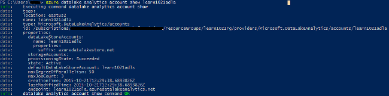

<properties 
   pageTitle="Γρήγορα αποτελέσματα με το Azure δεδομένων λίμνης ανάλυση με περιβάλλον γραμμής εντολών Azure | Microsoft Azure" 
   description="Μάθετε πώς μπορείτε να χρησιμοποιήσετε το περιβάλλον γραμμής εντολών Azure για να δημιουργήσετε ένα λογαριασμό του χώρου αποθήκευσης λίμνης δεδομένων, να δημιουργήσετε μια εργασία ανάλυσης λίμνης δεδομένων χρησιμοποιώντας U-SQL και υποβάλετε την εργασία. " 
   services="data-lake-analytics" 
   documentationCenter="" 
   authors="edmacauley" 
   manager="jhubbard" 
   editor="cgronlun"/>
 
<tags
   ms.service="data-lake-analytics"
   ms.devlang="na"
   ms.topic="hero-article"
   ms.tgt_pltfrm="na"
   ms.workload="big-data" 
   ms.date="05/16/2016"
   ms.author="edmaca"/>

# Πρόγραμμα εκμάθησης: γρήγορα αποτελέσματα με το Azure δεδομένων λίμνης ανάλυση με Azure περιβάλλον γραμμής εντολών (CLI)

[AZURE.INCLUDE [get-started-selector](../../includes/data-lake-analytics-selector-get-started.md)]

Μάθετε πώς μπορείτε να χρησιμοποιήσετε Azure CLI για να δημιουργήσετε λογαριασμούς Azure δεδομένων λίμνης ανάλυση, Ορισμός ανάλυσης δεδομένων λίμνης εργασίες στο [U-SQL](data-lake-analytics-u-sql-get-started.md)και υποβολή εργασιών σε λογαριασμούς ανάλυση λίμνης δεδομένων. Για περισσότερες πληροφορίες σχετικά με την ανάλυση λίμνης δεδομένων, ανατρέξτε στο θέμα [Επισκόπηση Azure δεδομένων λίμνης ανάλυσης](data-lake-analytics-overview.md).

Σε αυτό το πρόγραμμα εκμάθησης, θα μπορείτε να αναπτύξετε ένα έργο που διαβάζει μια καρτέλα διαχωρισμένες αρχείο τιμών (TSV) και τον μετατρέπει σε ένα αρχείο τιμών διαχωρισμένων με κόμματα (CSV). Για να μεταβείτε στο ίδιο πρόγραμμα εκμάθησης με χρήση άλλων εργαλείων υποστηριζόμενες, κάντε κλικ στις καρτέλες στο επάνω μέρος αυτής της ενότητας.

##Προαπαιτούμενα στοιχεία

Προτού ξεκινήσετε αυτό το πρόγραμμα εκμάθησης, πρέπει να έχετε τα εξής:

- **Azure μια συνδρομή**. Ανατρέξτε στο θέμα [λήψη Azure δωρεάν δοκιμαστικής έκδοσης](https://azure.microsoft.com/pricing/free-trial/).
- **Azure CLI**. Ανατρέξτε στο θέμα [εγκατάσταση και ρύθμιση παραμέτρων Azure CLI](../xplat-cli-install.md).
    - Κάντε λήψη και εγκαταστήστε την **προ-έκδοση** [Azure CLI εργαλεία](https://github.com/MicrosoftBigData/AzureDataLake/releases) για να ολοκληρώσετε αυτή την επίδειξη.
- **Έλεγχος ταυτότητας**, χρησιμοποιώντας την ακόλουθη εντολή:

        azure login
    Για περισσότερες πληροφορίες σχετικά με τον έλεγχο ταυτότητας χρησιμοποιώντας έναν εταιρικό ή σχολικό λογαριασμό, ανατρέξτε στο θέμα [σύνδεση σε μια συνδρομή του Azure από το Azure CLI](../xplat-cli-connect.md).
- **Μετάβαση στη λειτουργία διαχείρισης πόρων Azure**, χρησιμοποιώντας την ακόλουθη εντολή:

        azure config mode arm
        
## Δημιουργία λογαριασμού ανάλυσης δεδομένων λίμνης

Πρέπει να έχετε ένα λογαριασμό ανάλυσης δεδομένων λίμνης μπορέσετε να εκτελέσετε τις εργασίες. Για να δημιουργήσετε ένα λογαριασμό ανάλυση λίμνης δεδομένων, πρέπει να καθορίσετε τα εξής:

- **Ομάδα πόρων Azure**: ανάλυση λίμνης δεδομένων A λογαριασμό πρέπει να δημιουργηθεί μέσα σε μια ομάδα πόρων Azure. [Διαχείριση πόρων Azure](../azure-resource-manager/resource-group-overview.md) σάς επιτρέπει να εργαστείτε με τους πόρους στην εφαρμογή σας ως ομάδα. Να αναπτύξετε, ενημέρωση ή να διαγράψετε όλους τους πόρους για την εφαρμογή σας σε μια ενιαία, συντονισμένη λειτουργία.  

    Απαρίθμηση των ομάδων πόρων στη συνδρομή σας:
    
        azure group list 
    
    Για να δημιουργήσετε μια νέα ομάδα πόρων:

        azure group create -n "<Resource Group Name>" -l "<Azure Location>"

- **Το όνομα του λογαριασμού ανάλυσης δεδομένων λίμνης**
- **Θέση**: ένα από τα κέντρα δεδομένων Azure που υποστηρίζει ανάλυση λίμνης δεδομένων.
- **Προεπιλεγμένη δεδομένων λίμνης λογαριασμό**: κάθε λογαριασμό ανάλυση λίμνης δεδομένων διαθέτει έναν προεπιλεγμένο λογαριασμό λίμνης δεδομένων.

    Στη λίστα τα υπάρχοντα λογαριασμό λίμνης δεδομένων:
    
        azure datalake store account list

    Για να δημιουργήσετε ένα νέο λογαριασμό λίμνης δεδομένων:

        azure datalake store account create "<Data Lake Store Account Name>" "<Azure Location>" "<Resource Group Name>"

    > [AZURE.NOTE] Το όνομα του λογαριασμού λίμνης δεδομένων πρέπει να περιέχει μόνο πεζά γράμματα και αριθμούς.

**Για να δημιουργήσετε ένα λογαριασμό ανάλυσης δεδομένων λίμνης**

        azure datalake analytics account create "<Data Lake Analytics Account Name>" "<Azure Location>" "<Resource Group Name>" "<Default Data Lake Account Name>"

        azure datalake analytics account list
        azure datalake analytics account show "<Data Lake Analytics Account Name>"          

> [AZURE.NOTE] Το όνομα του λογαριασμού δεδομένων λίμνης ανάλυσης πρέπει να περιέχει μόνο πεζά γράμματα και αριθμούς.

## Αποστολή δεδομένων στο χώρο αποθήκευσης δεδομένων λίμνης

Σε αυτό το πρόγραμμα εκμάθησης, θα επεξεργαστεί ορισμένα αρχεία καταγραφής από την αναζήτηση.  Το αρχείο καταγραφής αναζήτησης μπορούν να αποθηκευτούν στο χώρο αποθήκευσης δεδομένων λίμνης ή χώρο αποθήκευσης αντικειμένων Blob του Azure. 

Η πύλη Azure παρέχει ένα περιβάλλον εργασίας χρήστη για την αντιγραφή ορισμένα δείγματα αρχείων δεδομένων για να τον προεπιλεγμένο λογαριασμό λίμνης δεδομένων που περιλαμβάνει ένα αρχείο καταγραφής αναζήτησης. Ανατρέξτε στο θέμα [Προετοιμασία αρχείου προέλευσης δεδομένων](data-lake-analytics-get-started-portal.md#prepare-source-data) για την αποστολή των δεδομένων στον προεπιλεγμένο λογαριασμό χώρου αποθήκευσης λίμνης δεδομένων.

Για να αποστείλετε αρχεία χρησιμοποιώντας cli, χρησιμοποιήστε την ακόλουθη εντολή:

    azure datalake store filesystem import "<Data Lake Store Account Name>" "<Path>" "<Destination>"
    azure datalake store filesystem list "<Data Lake Store Account Name>" "<Path>"

Ανάλυση δεδομένων λίμνης επίσης να αποκτήσετε πρόσβαση χώρος αποθήκευσης αντικειμένων Blob του Azure.  Για την αποστολή δεδομένων με το χώρο αποθήκευσης αντικειμένων Blob του Azure, ανατρέξτε στο θέμα [χρήση του Azure CLI με το χώρο αποθήκευσης Azure](../storage/storage-azure-cli.md).

## Υποβολή δεδομένων λίμνης ανάλυσης εργασιών

Οι εργασίες ανάλυσης λίμνης δεδομένων εγγράφονται στη γλώσσα U-SQL. Για να μάθετε περισσότερα σχετικά με το U-SQL, ανατρέξτε στο θέμα [Γρήγορα αποτελέσματα με το γλώσσα U SQL](data-lake-analytics-u-sql-get-started.md) και [αναφορά γλώσσας U-SQL](http://go.microsoft.com/fwlink/?LinkId=691348).

**Για να δημιουργήσετε μια δέσμη ενεργειών εργασία ανάλυσης δεδομένων λίμνης**

- Δημιουργήστε ένα αρχείο κειμένου με την ακόλουθη δέσμη ενεργειών U-SQL και αποθηκεύστε το αρχείο κειμένου για να σας σταθμούς εργασίας:

        @searchlog =
            EXTRACT UserId          int,
                    Start           DateTime,
                    Region          string,
                    Query           string,
                    Duration        int?,
                    Urls            string,
                    ClickedUrls     string
            FROM "/Samples/Data/SearchLog.tsv"
            USING Extractors.Tsv();
        
        OUTPUT @searchlog   
            TO "/Output/SearchLog-from-Data-Lake.csv"
        USING Outputters.Csv();

    Αυτή η δέσμη ενεργειών U-SQL διαβάζει το αρχείο προέλευσης δεδομένων με χρήση **Extractors.Tsv()**και, στη συνέχεια, δημιουργεί ένα αρχείο csv χρησιμοποιώντας **Outputters.Csv()**. 
    
    Μην τροποποιείτε τις δύο διαδρομές, εκτός εάν μπορείτε να αντιγράψετε το αρχείο προέλευσης σε διαφορετική θέση.  Ανάλυση λίμνης δεδομένων θα δημιουργήσει το φάκελο εξόδου, εάν δεν υπάρχει.
    
    Είναι ευκολότερο να χρησιμοποιήσετε σχετικές διαδρομές για προεπιλεγμένες αποθηκευμένα τα αρχεία δεδομένων λίμνης λογαριασμών. Μπορείτε επίσης να χρησιμοποιήσετε απόλυτες διαδρομές.  Για παράδειγμα 
    
        adl://<Data LakeStorageAccountName>.azuredatalakestore.net:443/Samples/Data/SearchLog.tsv
        
    Πρέπει να χρησιμοποιήσετε απόλυτες διαδρομές για να αποκτήσετε πρόσβαση σε αρχεία σε συνδεδεμένους λογαριασμούς χώρου αποθήκευσης.  Η σύνταξη για τα αρχεία που είναι αποθηκευμένα σε συνδεδεμένο λογαριασμό Azure χώρου αποθήκευσης είναι:
    
        wasb://<BlobContainerName>@<StorageAccountName>.blob.core.windows.net/Samples/Data/SearchLog.tsv

    >[AZURE.NOTE] Azure Blob κοντέινερ με αντικείμενα BLOB δημόσια ή τα δικαιώματα πρόσβασης δημόσια κοντέινερ δεν υποστηρίζονται αυτήν τη στιγμή.      

    
**Για να υποβάλετε την εργασία**

    azure datalake analytics job create  "<Data Lake Analytics Account Name>" "<Job Name>" "<Script>"
    
    
Τις παρακάτω εντολές μπορεί να χρησιμοποιηθεί για λίστα εργασιών, λήψη λεπτομερειών έργου και ακυρώσετε εργασίες:

    azure datalake analytics job cancel "<Data Lake Analytics Account Name>" "<Job Id>"
    azure datalake analytics job list "<Data Lake Analytics Account Name>"
    azure datalake analytics job show "<Data Lake Analytics Account Name>" "<Job Id>"

Μετά την ολοκλήρωση της εργασίας, μπορείτε να χρησιμοποιήσετε τα ακόλουθα cmdlet για να εμφανίσετε το αρχείο και κάντε λήψη του αρχείου:
    
    azure datalake store filesystem list "<Data Lake Store Account Name>" "/Output"
    azure datalake store filesystem export "<Data Lake Store Account Name>" "/Output/SearchLog-from-Data-Lake.csv" "<Destination>"
    azure datalake store filesystem read "<Data Lake Store Account Name>" "/Output/SearchLog-from-Data-Lake.csv" <Length> <Offset>

## Δείτε επίσης

- Για να δείτε το ίδιο πρόγραμμα εκμάθησης με χρήση άλλων εργαλείων, κάντε κλικ στην επιλογή των δεικτών επιλογής καρτέλα στο επάνω μέρος της σελίδας.
- Για να δείτε ένα πιο σύνθετο ερώτημα, ανατρέξτε στο θέμα [ανάλυση τοποθεσίας Web αρχεία καταγραφής χρησιμοποιώντας Azure δεδομένων λίμνης ανάλυσης](data-lake-analytics-analyze-weblogs.md).
- Για να ξεκινήσετε την ανάπτυξη εφαρμογών U-SQL, ανατρέξτε στο θέμα [Ανάπτυξη U-SQL δέσμης ενεργειών με χρήση εργαλεία λίμνης δεδομένων για το Visual Studio](data-lake-analytics-data-lake-tools-get-started.md).
- Για να μάθετε U-SQL, ανατρέξτε στο θέμα [Γρήγορα αποτελέσματα με το δεδομένων λίμνης ανάλυση U-SQL Azure γλώσσας](data-lake-analytics-u-sql-get-started.md).
- Για τις εργασίες διαχείρισης, ανατρέξτε στο θέμα [Διαχείριση Azure δεδομένων λίμνης αναλυτικών στοιχείων χρήσης Azure πύλη](data-lake-analytics-manage-use-portal.md).
- Για να δείτε μια επισκόπηση της ανάλυσης λίμνης δεδομένων, ανατρέξτε στο θέμα [Επισκόπηση Azure δεδομένων λίμνης ανάλυσης](data-lake-analytics-overview.md).

