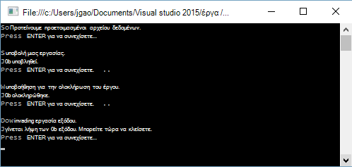

<properties 
   pageTitle="Γρήγορα αποτελέσματα με το Azure δεδομένων λίμνης ανάλυση με .NET SDK | Azure" 
   description="Μάθετε πώς μπορείτε να χρησιμοποιήσετε το .NET SDK για να δημιουργήσετε λογαριασμούς χώρου αποθήκευσης λίμνης δεδομένων, να δημιουργήσετε εργασίες ανάλυσης λίμνης δεδομένων και να υποβάλλουν εργασίες γραμμένο σε U-SQL. " 
   services="data-lake-analytics" 
   documentationCenter="" 
   authors="edmacauley" 
   manager="jhubbard" 
   editor="cgronlun"/>
 
<tags
   ms.service="data-lake-analytics"
   ms.devlang="na"
   ms.topic="hero-article"
   ms.tgt_pltfrm="na"
   ms.workload="big-data" 
   ms.date="10/26/2016"
   ms.author="edmaca"/>

# Πρόγραμμα εκμάθησης: γρήγορα αποτελέσματα με το Azure δεδομένων λίμνης ανάλυση με .NET SDK

[AZURE.INCLUDE [get-started-selector](../../includes/data-lake-analytics-selector-get-started.md)]

Μάθετε πώς μπορείτε να χρησιμοποιήσετε το .NET SDK Azure για να υποβάλλουν εργασίες γραμμένο σε [U-SQL](data-lake-analytics-u-sql-get-started.md) για ανάλυση δεδομένων λίμνης. Για περισσότερες πληροφορίες σχετικά με την ανάλυση λίμνης δεδομένων, ανατρέξτε στο θέμα [Επισκόπηση Azure δεδομένων λίμνης ανάλυσης](data-lake-analytics-overview.md).

Σε αυτό το πρόγραμμα εκμάθησης, θα μπορείτε να αναπτύξετε μια εφαρμογή κονσόλας C# για να υποβάλετε μια εργασία U-SQL που διαβάζει μια καρτέλα διαχωρισμένες αρχείο τιμών (TSV) και τον μετατρέπει σε ένα αρχείο τιμών διαχωρισμένων (CSV) με κόμματα. Για να μεταβείτε στο ίδιο πρόγραμμα εκμάθησης με χρήση άλλων εργαλείων υποστηριζόμενες, κάντε κλικ στις καρτέλες στο επάνω μέρος αυτού του άρθρου.

##Προαπαιτούμενα στοιχεία

Προτού ξεκινήσετε αυτό το πρόγραμμα εκμάθησης, πρέπει να έχετε τα εξής:

- **Visual Studio 2015, το Visual Studio 2013 ενημέρωση 4, ή Visual Studio 2012, με τη Visual C++ εγκατεστημένο**.
- **Microsoft Azure SDK για .NET έκδοση 2.5 ή νεότερη έκδοση**.  Εγκατάσταση χρησιμοποιώντας το [πρόγραμμα εγκατάστασης πλατφόρμας Web](http://www.microsoft.com/web/downloads/platform.aspx).
- **Μια ανάλυση λίμνης δεδομένων Azure λογαριασμού**. Ανατρέξτε στο θέμα [Διαχείριση δεδομένων λίμνης αναλυτικών στοιχείων χρήσης Azure .NET SDK](data-lake-analytics-manage-use-dotnet-sdk.md).

##Δημιουργία εφαρμογής κονσόλας

Σε αυτό το πρόγραμμα εκμάθησης, μπορείτε να επεξεργαστείτε ορισμένα αρχεία καταγραφής από την αναζήτηση.  Το αρχείο καταγραφής αναζήτησης μπορούν να αποθηκευτούν στο χώρο αποθήκευσης δεδομένων λίμνης ή χώρο αποθήκευσης αντικειμένων Blob του Azure. 

Μπορείτε να βρείτε ένα αρχείο καταγραφής δείγμα αναζήτησης σε δημόσια κοντέινερ αντικειμένων Blob του Azure. Στην εφαρμογή, θα κάνετε λήψη του αρχείου για να σας σταθμούς εργασίας και, στη συνέχεια, αποστείλετε το αρχείο για να τον προεπιλεγμένο λογαριασμό χώρου αποθήκευσης δεδομένων λίμνης του λογαριασμού σας ανάλυση λίμνης δεδομένων.

**Για να δημιουργήσετε μια δέσμη ενεργειών U-SQL**

Οι εργασίες ανάλυσης δεδομένων λίμνης εγγράφονται στη γλώσσα U-SQL. Για να μάθετε περισσότερα σχετικά με το U-SQL, ανατρέξτε στο θέμα [Γρήγορα αποτελέσματα με το γλώσσα U SQL](data-lake-analytics-u-sql-get-started.md) και [αναφορά γλώσσας U-SQL](http://go.microsoft.com/fwlink/?LinkId=691348).

Δημιουργήστε ένα αρχείο **SampleUSQLScript.txt** με την ακόλουθη δέσμη ενεργειών U-SQL και τοποθετήστε το αρχείο σε το **C:\temp\* * διαδρομή.  Η διαδρομή είναι κωδικοποιημένη στην εφαρμογή .NET που δημιουργείτε στην επόμενη διαδικασία.  

    @searchlog =
        EXTRACT UserId          int,
                Start           DateTime,
                Region          string,
                Query           string,
                Duration        int?,
                Urls            string,
                ClickedUrls     string
        FROM "/Samples/Data/SearchLog.tsv"
        USING Extractors.Tsv();
    
    OUTPUT @searchlog   
        TO "/Output/SearchLog-from-Data-Lake.csv"
    USING Outputters.Csv();

Αυτή η δέσμη ενεργειών U-SQL διαβάζει το αρχείο προέλευσης δεδομένων με χρήση **Extractors.Tsv()**και, στη συνέχεια, δημιουργεί ένα αρχείο csv χρησιμοποιώντας **Outputters.Csv()**. 

Στο πρόγραμμα C#, πρέπει να προετοιμάσετε το αρχείο **/Samples/Data/SearchLog.tsv** και το φάκελο **/Output/** .    

Είναι ευκολότερο να χρησιμοποιήσετε σχετικές διαδρομές για προεπιλεγμένες αποθηκευμένα τα αρχεία δεδομένων λίμνης λογαριασμών. Μπορείτε επίσης να χρησιμοποιήσετε απόλυτες διαδρομές.  Για παράδειγμα 

    adl://<Data LakeStorageAccountName>.azuredatalakestore.net:443/Samples/Data/SearchLog.tsv
    
Πρέπει να χρησιμοποιήσετε απόλυτες διαδρομές για να αποκτήσετε πρόσβαση σε αρχεία σε συνδεδεμένους λογαριασμούς χώρου αποθήκευσης.  Η σύνταξη για αρχεία που είναι αποθηκευμένα στο συνδεδεμένο λογαριασμό Azure χώρου αποθήκευσης είναι:

    wasb://<BlobContainerName>@<StorageAccountName>.blob.core.windows.net/Samples/Data/SearchLog.tsv

>[AZURE.NOTE] Προς το παρόν είναι ένα γνωστό θέμα με την υπηρεσία λίμνης Azure δεδομένων.  Εάν η εφαρμογή δείγμα διακοπεί ή παρουσιάσει σφάλμα, ίσως χρειαστεί να διαγράψετε με μη αυτόματο τρόπο το χώρο αποθήκευσης λίμνης δεδομένων και ανάλυση δεδομένων λίμνης τους λογαριασμούς που δημιουργεί τη δέσμη ενεργειών.  Εάν δεν είστε εξοικειωμένοι με την πύλη του Azure, τον οδηγό [Διαχείριση Azure δεδομένων λίμνης αναλυτικών στοιχείων χρήσης Azure πύλη](data-lake-analytics-manage-use-portal.md) θα σας βοηθήσουν να ξεκινήσετε.       

**Για να δημιουργήσετε μια εφαρμογή**

1. Ανοίξτε το Visual Studio.
2. Δημιουργία μιας εφαρμογής κονσόλας C#.
3. Ανοίξτε την Κονσόλα διαχείρισης πακέτου NuGet και εκτελέστε τις ακόλουθες εντολές:

        Install-Package Microsoft.Azure.Management.DataLake.Analytics -Pre
        Install-Package Microsoft.Azure.Management.DataLake.Store -Pre
        Install-Package Microsoft.Azure.Management.DataLake.StoreUploader -Pre
        Install-Package Microsoft.Rest.ClientRuntime.Azure.Authentication -Pre
        Install-Package WindowsAzure.Storage

       
5. Στο Program.cs, επικολλήστε τον ακόλουθο κώδικα:

        using System;
        using System.IO;
        using System.Collections.Generic;
        using System.Threading;
        using Microsoft.Rest;
        using Microsoft.Rest.Azure.Authentication;
        using Microsoft.Azure.Management.DataLake.Store;
        using Microsoft.Azure.Management.DataLake.StoreUploader;
        using Microsoft.Azure.Management.DataLake.Analytics;
        using Microsoft.Azure.Management.DataLake.Analytics.Models;
        using Microsoft.WindowsAzure.Storage.Blob;

        namespace SdkSample
        {
          class Program
          {
            private const string SUBSCRIPTIONID = "<Enter Your Azure Subscription ID>";
            private const string CLIENTID = "1950a258-227b-4e31-a9cf-717495945fc2";
            private const string DOMAINNAME = "common"; // Replace this string with the user's Azure Active Directory tenant ID or domain name, if needed.

            private static string _adlaAccountName = "<Enter an Existing Data Lake Analytics Account Name>";
            private static string _adlsAccountName = "<Enter the default Data Lake Store Account Name>";

            private static DataLakeAnalyticsAccountManagementClient _adlaClient;
            private static DataLakeStoreFileSystemManagementClient _adlsFileSystemClient;
            private static DataLakeAnalyticsJobManagementClient _adlaJobClient;
        
            private static void Main(string[] args)
            {
                string localFolderPath = @"c:\temp\";

                // Connect to Azure
                var creds = AuthenticateAzure(DOMAINNAME, CLIENTID);

                SetupClients(creds, SUBSCRIPTIONID);

                // Transfer the source file from a public Azure Blob container to Data Lake Store.
                CloudBlockBlob blob = new CloudBlockBlob(new Uri("https://adltutorials.blob.core.windows.net/adls-sample-data/SearchLog.tsv"));
                blob.DownloadToFile(localFolderPath + "SearchLog.tsv", FileMode.Create); // from WASB
                UploadFile(localFolderPath + "SearchLog.tsv", "/Samples/Data/SearchLog.tsv"); // to ADLS
                WaitForNewline("Source data file prepared.", "Submitting a job.");

                // Submit the job
                Guid jobId = SubmitJobByPath(localFolderPath + "SampleUSQLScript.txt", "My First ADLA Job");
                WaitForNewline("Job submitted.", "Waiting for job completion.");

                // Wait for job completion
                WaitForJob(jobId);
                WaitForNewline("Job completed.", "Downloading job output.");

                // Download job output
                DownloadFile(@"/Output/SearchLog-from-Data-Lake.csv", localFolderPath + "SearchLog-from-Data-Lake.csv");
        
                WaitForNewline("Job output downloaded. You can now exit.");
            }
        
            public static ServiceClientCredentials AuthenticateAzure(
                string domainName,
                string nativeClientAppCLIENTID)
            {
                // User login via interactive popup
                SynchronizationContext.SetSynchronizationContext(new SynchronizationContext());
                // Use the client ID of an existing AAD "Native Client" application.
                var activeDirectoryClientSettings = ActiveDirectoryClientSettings.UsePromptOnly(nativeClientAppCLIENTID, new Uri("urn:ietf:wg:oauth:2.0:oob"));
                return UserTokenProvider.LoginWithPromptAsync(domainName, activeDirectoryClientSettings).Result;
            }

            public static void SetupClients(ServiceClientCredentials tokenCreds, string subscriptionId)
            {
                _adlaClient = new DataLakeAnalyticsAccountManagementClient(tokenCreds);
                _adlaClient.SubscriptionId = subscriptionId;

                _adlaJobClient = new DataLakeAnalyticsJobManagementClient(tokenCreds);

                _adlsFileSystemClient = new DataLakeStoreFileSystemManagementClient(tokenCreds);
            }

            public static void UploadFile(string srcFilePath, string destFilePath, bool force = true)
            {
                var parameters = new UploadParameters(srcFilePath, destFilePath, _adlsAccountName, isOverwrite: force);
                var frontend = new DataLakeStoreFrontEndAdapter(_adlsAccountName, _adlsFileSystemClient);
                var uploader = new DataLakeStoreUploader(parameters, frontend);
                uploader.Execute();
            }

            public static void DownloadFile(string srcPath, string destPath)
            {
                var stream = _adlsFileSystemClient.FileSystem.Open(_adlsAccountName, srcPath);
                var fileStream = new FileStream(destPath, FileMode.Create);

                stream.CopyTo(fileStream);
                fileStream.Close();
                stream.Close();
            }

            // Helper function to show status and wait for user input
            public static void WaitForNewline(string reason, string nextAction = "")
            {
                Console.WriteLine(reason + "\r\nPress ENTER to continue...");

                Console.ReadLine();

                if (!String.IsNullOrWhiteSpace(nextAction))
                    Console.WriteLine(nextAction);
            }

            // List all Data Lake Analytics accounts within the subscription
            public static List<DataLakeAnalyticsAccount> ListADLAAccounts()
            {
                var response = _adlaClient.Account.List();
                var accounts = new List<DataLakeAnalyticsAccount>(response);

                while (response.NextPageLink != null)
                {
                    response = _adlaClient.Account.ListNext(response.NextPageLink);
                    accounts.AddRange(response);
                }

                Console.WriteLine("You have %i Data Lake Analytics account(s).", accounts.Count);
                for (int i = 0; i < accounts.Count; i++)
                {
                    Console.WriteLine(accounts[i].Name);
                }

                return accounts;
            }
            public static Guid SubmitJobByPath(string scriptPath, string jobName)
            {
                var script = File.ReadAllText(scriptPath);

                var jobId = Guid.NewGuid();
                var properties = new USqlJobProperties(script);
                var parameters = new JobInformation(jobName, JobType.USql, properties, priority: 1, degreeOfParallelism: 1, jobId: jobId);
                var jobInfo = _adlaJobClient.Job.Create(_adlaAccountName, jobId, parameters);

                return jobId;
            }

            public static JobResult WaitForJob(Guid jobId)
            {
                var jobInfo = _adlaJobClient.Job.Get(_adlaAccountName, jobId);
                while (jobInfo.State != JobState.Ended)
                {
                    jobInfo = _adlaJobClient.Job.Get(_adlaAccountName, jobId);
                }
                return jobInfo.Result.Value;
            }
          }
        }

6. Πατήστε το πλήκτρο **F5** για να εκτελέσετε την εφαρμογή. Το αποτέλεσμα είναι όπως:

    

7. Ελέγξτε το αρχείο εξόδου.  Η προεπιλεγμένη διαδρομή και το όνομα αρχείου είναι c:\Temp\SearchLog-from-Data-Lake.csv.

## Δείτε επίσης

- Για να δείτε το ίδιο πρόγραμμα εκμάθησης με χρήση άλλων εργαλείων, κάντε κλικ στην επιλογή των δεικτών επιλογής καρτέλα στο επάνω μέρος της σελίδας.
- Για να δείτε ένα πιο σύνθετο ερώτημα, ανατρέξτε στο θέμα [ανάλυση τοποθεσίας Web αρχεία καταγραφής χρησιμοποιώντας Azure δεδομένων λίμνης ανάλυσης](data-lake-analytics-analyze-weblogs.md).
- Για να ξεκινήσετε την ανάπτυξη εφαρμογών U-SQL, ανατρέξτε στο θέμα [Ανάπτυξη U-SQL δέσμης ενεργειών με χρήση εργαλεία λίμνης δεδομένων για το Visual Studio](data-lake-analytics-data-lake-tools-get-started.md).
- Για να μάθετε U-SQL, ανατρέξτε στο θέμα [Γρήγορα αποτελέσματα με το δεδομένων λίμνης ανάλυση U-SQL Azure γλώσσας](data-lake-analytics-u-sql-get-started.md)και [αναφορά γλώσσας U-SQL](http://go.microsoft.com/fwlink/?LinkId=691348).
- Για τις εργασίες διαχείρισης, ανατρέξτε στο θέμα [Διαχείριση Azure δεδομένων λίμνης αναλυτικών στοιχείων χρήσης Azure πύλη](data-lake-analytics-manage-use-portal.md).
- Για να δείτε μια επισκόπηση της ανάλυσης λίμνης δεδομένων, ανατρέξτε στο θέμα [Επισκόπηση Azure δεδομένων λίμνης ανάλυσης](data-lake-analytics-overview.md).
