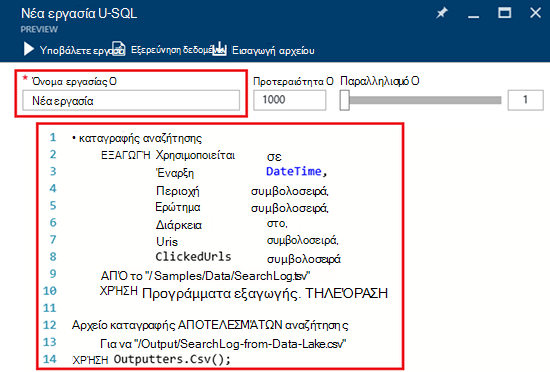

<properties 
   pageTitle="Γρήγορα αποτελέσματα με το Azure δεδομένων λίμνης ανάλυση με Azure πύλη | Azure" 
   description="Μάθετε πώς μπορείτε να χρησιμοποιήσετε την πύλη του Azure για δημιουργία λογαριασμού ανάλυση λίμνης δεδομένων, να δημιουργήσετε μια εργασία ανάλυσης λίμνης δεδομένων χρησιμοποιώντας U-SQL και υποβάλετε την εργασία. " 
   services="data-lake-analytics" 
   documentationCenter="" 
   authors="edmacauley" 
   manager="jhubbard" 
   editor="cgronlun"/>
 
<tags
   ms.service="data-lake-analytics"
   ms.devlang="na"
   ms.topic="hero-article"
   ms.tgt_pltfrm="na"
   ms.workload="big-data" 
   ms.date="10/06/2016"
   ms.author="edmaca"/>

# Πρόγραμμα εκμάθησης: γρήγορα αποτελέσματα με το Azure ανάλυση λίμνης δεδομένων με την πύλη του Azure

[AZURE.INCLUDE [get-started-selector](../../includes/data-lake-analytics-selector-get-started.md)]

Μάθετε πώς μπορείτε να χρησιμοποιήσετε την πύλη του Azure για να δημιουργήσετε λογαριασμούς Azure δεδομένων λίμνης ανάλυση, Ορισμός ανάλυσης δεδομένων λίμνης εργασίες στο [U-SQL](data-lake-analytics-u-sql-get-started.md)και υποβολή εργασιών για την ανάλυση δεδομένων λίμνης υπηρεσία. Για περισσότερες πληροφορίες σχετικά με την ανάλυση λίμνης δεδομένων, ανατρέξτε στο θέμα [Επισκόπηση Azure δεδομένων λίμνης ανάλυσης](data-lake-analytics-overview.md).

Σε αυτό το πρόγραμμα εκμάθησης, μπορείτε να αναπτύξετε ένα έργο που διαβάζει μια καρτέλα διαχωρισμένες αρχείο τιμών (TSV) και τον μετατρέπει σε ένα αρχείο τιμών διαχωρισμένων με κόμματα (CSV). Για να μεταβείτε στο ίδιο πρόγραμμα εκμάθησης με χρήση άλλων εργαλείων υποστηριζόμενες, κάντε κλικ στις καρτέλες στο επάνω μέρος αυτής της ενότητας. Μετά την πρώτη εργασία ολοκληρωθεί με επιτυχία, μπορείτε να ξεκινήσετε να γράψετε πιο σύνθετες μετασχηματισμοί δεδομένων με U-SQL.

##Προαπαιτούμενα στοιχεία

Προτού ξεκινήσετε αυτό το πρόγραμμα εκμάθησης, πρέπει να έχετε τα ακόλουθα στοιχεία:

- **Azure μια συνδρομή**. Ανατρέξτε στο θέμα [λήψη Azure δωρεάν δοκιμαστικής έκδοσης](https://azure.microsoft.com/pricing/free-trial/).

##Δημιουργία λογαριασμού ανάλυσης δεδομένων λίμνης

Πρέπει να έχετε ένα λογαριασμό ανάλυσης δεδομένων λίμνης μπορέσετε να εκτελέσετε τις εργασίες.

Κάθε λογαριασμό ανάλυση λίμνης δεδομένων έχει μια εξάρτηση λογαριασμού [Χώρου αποθήκευσης λίμνης Azure δεδομένων]() .  Αυτός ο λογαριασμός είναι αναφέρονται ως του προεπιλεγμένου λογαριασμού χώρου αποθήκευσης λίμνης δεδομένων.  Μπορείτε να δημιουργήσετε το λογαριασμό χώρου αποθήκευσης δεδομένων λίμνης εκ των προτέρων ή κατά τη δημιουργία του λογαριασμού ανάλυση λίμνης δεδομένων. Σε αυτό το πρόγραμμα εκμάθησης, θα δημιουργήσετε το λογαριασμό χώρου αποθήκευσης λίμνης δεδομένων με το λογαριασμό ανάλυση λίμνης δεδομένων.

**Για να δημιουργήσετε ένα λογαριασμό ανάλυσης δεδομένων λίμνης**

1. Πραγματοποιήστε είσοδο [πύλη του Azure](https://portal.azure.com).
2. Κάντε κλικ στην επιλογή **Δημιουργία**, κάντε κλικ **ευφυΐας + ανάλυση**, και, στη συνέχεια, κάντε κλικ στην επιλογή **Ανάλυσης λίμνης δεδομένων**.
3. Πληκτρολογήστε ή επιλέξτε τις ακόλουθες τιμές:

    

    - **Όνομα**: δώστε ένα όνομα στο λογαριασμό ανάλυση λίμνης δεδομένων.
    - **Συνδρομή**: Επιλέξτε τη συνδρομή Azure που χρησιμοποιούνται για το λογαριασμό ανάλυσης.
    - **Ομάδα πόρων**. Επιλέξτε μια υπάρχουσα ομάδα πόρων Azure ή δημιουργήστε ένα νέο. Azure διαχείριση πόρων σάς επιτρέπει να εργαστείτε με τους πόρους στην εφαρμογή σας ως ομάδα. Για περισσότερες πληροφορίες, ανατρέξτε στο θέμα [Επισκόπηση της διαχείρισης πόρων Azure](resource-group-overview.md). 
    - **Θέση**. Επιλέξτε ένα κέντρο δεδομένων Azure για το λογαριασμό ανάλυση λίμνης δεδομένων. 
    - **Χώρος αποθήκευσης δεδομένων λίμνης**: λογαριασμός κάθε ανάλυση λίμνης δεδομένων έχει ένα λογαριασμό του χώρου αποθήκευσης δεδομένων λίμνης εξαρτώμενα. Ο λογαριασμός δεδομένων λίμνης ανάλυση και το λογαριασμό χώρου αποθήκευσης δεδομένων λίμνης εξαρτώμενα πρέπει να βρίσκεται στο ίδιο κέντρο Azure δεδομένων. Ακολουθήστε τις οδηγίες για να δημιουργήσετε ένα νέο λογαριασμό του χώρου αποθήκευσης δεδομένων λίμνης ή επιλέξτε ένα υπάρχον.

8. Κάντε κλικ στην επιλογή **Δημιουργία**. Σας μεταφέρει στην αρχική οθόνη πύλης. Ένα νέο πλακίδιο προστίθεται το StartBoard με την ετικέτα που εμφανίζει την "Για την ανάπτυξη Azure δεδομένων λίμνης ανάλυσης". Χρειάζονται μερικά λεπτά για να δημιουργήσετε ένα λογαριασμό ανάλυση λίμνης δεδομένων. Όταν δημιουργηθεί ο λογαριασμός, την πύλη ανοίγει το λογαριασμό σε ένα νέο blade.

Μετά τη δημιουργία ενός λογαριασμού ανάλυση λίμνης δεδομένων, μπορείτε να προσθέσετε επιπλέον χώρο αποθήκευσης λίμνης δεδομένων και αποθήκευσης Azure λογαριασμών. Για οδηγίες, ανατρέξτε στο θέμα [Διαχείριση ανάλυσης λίμνης δεδομένων λογαριασμού προελεύσεις δεδομένων](data-lake-analytics-manage-use-portal.md#manage-account-data-sources).

##Προετοιμασία αρχείου προέλευσης δεδομένων

Σε αυτό το πρόγραμμα εκμάθησης, μπορείτε να επεξεργαστείτε ορισμένα αρχεία καταγραφής από την αναζήτηση.  Το αρχείο καταγραφής αναζήτησης μπορούν να αποθηκευτούν στο χώρο αποθήκευσης λίμνης dData ή χώρο αποθήκευσης αντικειμένων Blob του Azure. 

Η πύλη του Azure παρέχει ένα περιβάλλον εργασίας χρήστη για την αντιγραφή ορισμένα δείγματα αρχείων δεδομένων για να τον προεπιλεγμένο λογαριασμό χώρου αποθήκευσης λίμνης δεδομένων που περιλαμβάνει ένα αρχείο καταγραφής αναζήτησης.

**Για να αντιγράψετε τα δείγματα αρχείων δεδομένων**

1. Από την [πύλη του Azure](https://portal.azure.com), ανοίξτε το λογαριασμό σας ανάλυση λίμνης δεδομένων.  Ανατρέξτε στο θέμα [Διαχείριση ανάλυσης λίμνης δεδομένων λογαριασμών](data-lake-analytics-get-started-portal.md#manage-accounts) για να δημιουργήσετε ένα και ανοίξτε το λογαριασμό στην πύλη.
3. Αναπτύξτε το παράθυρο **βασικά στοιχεία** και, στη συνέχεια, κάντε κλικ στην επιλογή **Εξερεύνηση δείγματα δεσμών ενεργειών**. Ανοίγει μια άλλη blade που ονομάζεται **Δείγματα δεσμών ενεργειών**.

    

4. Κάντε κλικ στην επιλογή **Λείπει το δείγμα δεδομένων** για να αντιγράψετε τα δείγματα αρχείων δεδομένων. Όταν γίνεται, την πύλη εμφανίζει **δείγμα δεδομένων ενημερώθηκε με επιτυχία**.
7. Από το blade λίμνης δεδομένων αναλυτικών στοιχείων λογαριασμού, κάντε κλικ στην επιλογή **Εξερεύνηση δεδομένων** στο επάνω μέρος. 

    

    Ανοίγει δύο πτερύγια. Ένα είναι **Εξερεύνηση δεδομένων**και το άλλο είναι ο προεπιλεγμένος χώρος αποθήκευσης δεδομένων λίμνης λογαριασμός.
8. Στο το προεπιλεγμένο blade λογαριασμού χώρου αποθήκευσης λίμνης δεδομένων, κάντε κλικ στην επιλογή **δείγματα** για να αναπτύξετε το φάκελο και κάντε κλικ στην επιλογή **δεδομένων** για να αναπτύξετε το φάκελο. Θα βλέπετε τα παρακάτω αρχεία και φακέλους:

    - AmbulanceData /
    - AdsLog.tsv
    - SearchLog.tsv
    - Version.txt
    - WebLog.log
    
    Σε αυτό το πρόγραμμα εκμάθησης, θα χρησιμοποιήσετε SearchLog.tsv.

Στην πράξη, μπορείτε είτε να προγράμματος τις εφαρμογές σας για να γράψετε δεδομένα σε ένα συνδεδεμένο χώρο αποθήκευσης λογαριασμούς ή αποστολή δεδομένων. Για την αποστολή αρχείων, ανατρέξτε στο θέμα [Αποστολή δεδομένων στο χώρο αποθήκευσης δεδομένων λίμνης](data-lake-analytics-manage-use-portal.md#upload-data-to-adls) ή [Αποστολή δεδομένων με το χώρο αποθήκευσης αντικειμένων Blob](data-lake-analytics-manage-use-portal.md#upload-data-to-wasb).

##Δημιουργία και υποβολή δεδομένων λίμνης ανάλυσης εργασιών

Αφού ετοιμάσετε τα δεδομένα προέλευσης, μπορείτε να ξεκινήσετε την ανάπτυξη μιας δέσμης ενεργειών U-SQL.  

**Για να υποβάλετε μια εργασία**

1. Από το λογαριασμό blade ανάλυση λίμνης δεδομένων στην πύλη, κάντε κλικ στην επιλογή **Νέα εργασία**. 

    

    Εάν δεν βλέπετε το blade, ανατρέξτε στο θέμα [ανοίξετε ένα λογαριασμό ανάλυση λίμνης δεδομένων από την πύλη](data-lake-analytics-manage-use-portal.md#access-adla-account).
2. Πληκτρολογήστε **Το όνομα της εργασίας**και την ακόλουθη δέσμη ενεργειών U-SQL:

        @searchlog =
            EXTRACT UserId          int,
                    Start           DateTime,
                    Region          string,
                    Query           string,
                    Duration        int?,
                    Urls            string,
                    ClickedUrls     string
            FROM "/Samples/Data/SearchLog.tsv"
            USING Extractors.Tsv();
        
        OUTPUT @searchlog   
            TO "/Output/SearchLog-from-Data-Lake.csv"
        USING Outputters.Csv();

    

    Αυτή η δέσμη ενεργειών U-SQL διαβάζει το αρχείο προέλευσης δεδομένων με χρήση **Extractors.Tsv()**και, στη συνέχεια, δημιουργεί ένα αρχείο csv χρησιμοποιώντας **Outputters.Csv()**. 
    
    Μην τροποποιείτε τις δύο διαδρομές, εκτός εάν μπορείτε να αντιγράψετε το αρχείο προέλευσης σε διαφορετική θέση.  Ανάλυση δεδομένων λίμνης δημιουργεί το φάκελο εξόδου, εάν δεν υπάρχει.  Σε αυτήν την περίπτωση, χρησιμοποιούμε απλή, σχετική διαδρομές.  
    
    Είναι ευκολότερο να χρησιμοποιήσετε σχετικές διαδρομές για αρχεία που είναι αποθηκευμένα στο προεπιλεγμένο λίμνης δεδομένων λογαριασμοί. Μπορείτε επίσης να χρησιμοποιήσετε απόλυτες διαδρομές.  Για παράδειγμα 
    
        adl://<Data LakeStorageAccountName>.azuredatalakestore.net:443/Samples/Data/SearchLog.tsv
      

    Για περισσότερες πληροφορίες σχετικά με το U-SQL, ανατρέξτε στο θέμα [Γρήγορα αποτελέσματα με το δεδομένων λίμνης ανάλυση U-SQL Azure γλώσσας](data-lake-analytics-u-sql-get-started.md) και [αναφορά γλώσσας U-SQL](http://go.microsoft.com/fwlink/?LinkId=691348).
     
3. Κάντε κλικ στην επιλογή **Υποβολή εργασίας** από την αρχή.   
4. Περιμένετε μέχρι να αλλάξει σε **ολοκληρώθηκε με**την κατάσταση της εργασίας. Μπορείτε να δείτε την εργασία εκτελέσατε περίπου ένα λεπτό για να ολοκληρωθεί.
    
    Σε περίπτωση που η εργασία απέτυχε, ανατρέξτε στο θέμα [οθόνη και αντιμετώπιση προβλημάτων εργασίες ανάλυσης δεδομένων λίμνης](data-lake-analytics-monitor-and-troubleshoot-jobs-tutorial.md).

5. Στο κάτω μέρος του blade, κάντε κλικ στην καρτέλα **εξόδου** και, στη συνέχεια, κάντε κλικ στην επιλογή **SearchLog από δεδομένα Lake.csv**. Μπορείτε να κάνετε προεπισκόπηση, κάντε λήψη, μετονομάσετε, και διαγράψτε το αρχείο εξόδου.

    

##Δείτε επίσης

- Για να δείτε ένα πιο σύνθετο ερώτημα, ανατρέξτε στο θέμα [ανάλυση τοποθεσίας Web αρχεία καταγραφής χρησιμοποιώντας Azure δεδομένων λίμνης ανάλυσης](data-lake-analytics-analyze-weblogs.md).
- Για να ξεκινήσετε την ανάπτυξη εφαρμογών U-SQL, ανατρέξτε στο θέμα [Ανάπτυξη U-SQL δέσμης ενεργειών με χρήση εργαλεία λίμνης δεδομένων για το Visual Studio](data-lake-analytics-data-lake-tools-get-started.md).
- Για να μάθετε U-SQL, ανατρέξτε στο θέμα [Γρήγορα αποτελέσματα με το δεδομένων λίμνης ανάλυση U-SQL Azure γλώσσας](data-lake-analytics-u-sql-get-started.md).
- Για τις εργασίες διαχείρισης, ανατρέξτε στο θέμα [Διαχείριση Azure δεδομένων λίμνης αναλυτικών στοιχείων χρήσης Azure πύλη](data-lake-analytics-manage-use-portal.md).
- Για να δείτε μια επισκόπηση της ανάλυσης λίμνης δεδομένων, ανατρέξτε στο θέμα [Επισκόπηση Azure δεδομένων λίμνης ανάλυσης](data-lake-analytics-overview.md).
- Για να δείτε το ίδιο πρόγραμμα εκμάθησης με χρήση άλλων εργαλείων, κάντε κλικ στην επιλογή των δεικτών επιλογής καρτέλα στο επάνω μέρος της σελίδας.
- Την καταγραφή διαγνωστικών πληροφοριών, ανατρέξτε στο θέμα [πρόσβαση σε αρχεία καταγραφής Διαγνωστικά για ανάλυση λίμνης δεδομένων Azure](data-lake-analytics-diagnostic-logs.md)
