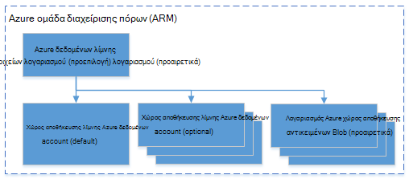

<properties 
   pageTitle="Διαχείριση Azure δεδομένων λίμνης ανάλυση με περιβάλλον γραμμής εντολών Azure | Azure" 
   description="Μάθετε πώς να διαχειρίζεστε ανάλυσης δεδομένων λίμνης λογαριασμούς, αρχεία προέλευσης δεδομένων, εργασίες και οι χρήστες που χρησιμοποιούν Azure CLI" 
   services="data-lake-analytics" 
   documentationCenter="" 
   authors="edmacauley" 
   manager="jhubbard" 
   editor="cgronlun"/>
 
<tags
   ms.service="data-lake-analytics"
   ms.devlang="na"
   ms.topic="article"
   ms.tgt_pltfrm="na"
   ms.workload="big-data" 
   ms.date="05/16/2016"
   ms.author="edmaca"/>

# Διαχείριση Azure δεδομένων λίμνης ανάλυση με Azure περιβάλλον γραμμής εντολών (CLI)

[AZURE.INCLUDE [manage-selector](../../includes/data-lake-analytics-selector-manage.md)]

Μάθετε πώς μπορείτε να διαχειριστείτε λογαριασμοί Azure δεδομένων λίμνης ανάλυση, προελεύσεις δεδομένων, οι χρήστες και εργασίες χρησιμοποιώντας το Azure. Για να δείτε το θέμα διαχείρισης με χρήση άλλων εργαλείων, κάντε κλικ στην επιλογή καρτέλα, επιλέξτε το παραπάνω.

**Προαπαιτούμενα στοιχεία**

Προτού ξεκινήσετε αυτό το πρόγραμμα εκμάθησης, πρέπει να έχετε τα εξής:

- **Azure μια συνδρομή**. Ανατρέξτε στο θέμα [λήψη Azure δωρεάν δοκιμαστικής έκδοσης](https://azure.microsoft.com/pricing/free-trial/).
- **Azure CLI**. Ανατρέξτε στο θέμα [εγκατάσταση και ρύθμιση παραμέτρων Azure CLI](../xplat-cli-install.md).
    - Κάντε λήψη και εγκαταστήστε την **προ-έκδοση** [Azure CLI εργαλεία](https://github.com/MicrosoftBigData/AzureDataLake/releases) για να ολοκληρώσετε αυτή την επίδειξη.
- **Έλεγχος ταυτότητας**, χρησιμοποιώντας την ακόλουθη εντολή:

        azure login
    Για περισσότερες πληροφορίες σχετικά με τον έλεγχο ταυτότητας χρησιμοποιώντας έναν εταιρικό ή σχολικό λογαριασμό, ανατρέξτε στο θέμα [σύνδεση σε μια συνδρομή του Azure από το Azure CLI](../xplat-cli-connect.md).
- **Μετάβαση στη λειτουργία διαχείρισης πόρων Azure**, χρησιμοποιώντας την ακόλουθη εντολή:

        azure config mode arm

**Για να εμφανίσετε τις εντολές χώρου αποθήκευσης λίμνης δεδομένων και τις αναλύσεις λίμνης δεδομένων:**

    azure datalake store
    azure datalake analytics

<!-- ################################ -->
<!-- ################################ -->
## Διαχείριση λογαριασμών

Πριν από την εκτέλεση ανάλυσης δεδομένων λίμνης εργασίες, πρέπει να έχετε ένα λογαριασμό ανάλυση λίμνης δεδομένων. Σε αντίθεση με Azure HDInsight, δεν πληρώνετε για ένα λογαριασμό ανάλυσης όταν δεν εκτελείται μια εργασία.  Πληρώνετε μόνο για την περίοδο λειτουργίας όταν εκτελείται μια εργασία.  Για περισσότερες πληροφορίες, ανατρέξτε στο θέμα [Επισκόπηση ανάλυσης λίμνης Azure δεδομένων](data-lake-analytics-overview.md).  

###Δημιουργία λογαριασμών

    azure datalake analytics account create "<Data Lake Analytics Account Name>" "<Azure Location>" "<Resource Group Name>" "<Default Data Lake Account Name>"

###Ενημέρωση λογαριασμών

Η ακόλουθη εντολή ενημερώνει τις ιδιότητες του υπάρχοντος λογαριασμού λίμνης ανάλυσης δεδομένων
    
    azure datalake analytics account set "<Data Lake Analytics Account Name>"

###Λίστα λογαριασμών

Λογαριασμοί ανάλυση λίμνης δεδομένων λίστας 

    azure datalake analytics account list

Λογαριασμοί ανάλυση λίμνης δεδομένων λίστας μέσα σε μια ομάδα συγκεκριμένο πόρο

    azure datalake analytics account list -g "<Azure Resource Group Name>"

Λήψη λεπτομερειών από ένα συγκεκριμένο λογαριασμό ανάλυσης δεδομένων λίμνης

    azure datalake analytics account show -g "<Azure Resource Group Name>" -n "<Data Lake Analytics Account Name>"

###Διαγραφή λογαριασμών ανάλυσης δεδομένων λίμνης

    azure datalake analytics account delete "<Data Lake Analytics Account Name>"

<!-- ################################ -->
<!-- ################################ -->
## Διαχείριση προελεύσεων δεδομένων λογαριασμού

Ανάλυση δεδομένων λίμνης υποστηρίζει αυτήν τη στιγμή τις ακόλουθες προελεύσεις δεδομένων:

- [Χώρος αποθήκευσης λίμνης δεδομένων Azure](../data-lake-store/data-lake-store-overview.md)
- [Azure χώρου αποθήκευσης](../storage/storage-introduction.md)

Όταν δημιουργείτε ένα λογαριασμό ανάλυσης, πρέπει να καθορίσετε ένα λογαριασμό αποθήκευσης λίμνης Azure δεδομένων για να τον προεπιλεγμένο λογαριασμό χώρου αποθήκευσης. Τον προεπιλεγμένο λογαριασμό χώρου αποθήκευσης ADL χρησιμοποιείται για την αποθήκευση έργων μετα-δεδομένων και εργασία αρχείων καταγραφής ελέγχου. Αφού δημιουργήσετε ένα λογαριασμό ανάλυση, μπορείτε να προσθέσετε επιπλέον λογαριασμούς χώρος αποθήκευσης δεδομένων λίμνης ή/και το χώρο αποθήκευσης Azure λογαριασμού. 

### Βρείτε τον προεπιλεγμένο λογαριασμό χώρου αποθήκευσης ADL

    azure datalake analytics account show "<Data Lake Analytics Account Name>"

Η τιμή εμφανίζεται στην περιοχή Ιδιότητες: datalakeStoreAccount:name.

### Προσθήκη επιπλέον λογαριασμούς χώρο αποθήκευσης αντικειμένων Blob του Azure

    azure datalake analytics account datasource add -n "<Data Lake Analytics Account Name>" -b "<Azure Blob Storage Account Short Name>" -k "<Azure Storage Account Key>"

>[AZURE.NOTE] Υποστηρίζονται μόνο Blob αποθήκευσης σύντομο ονόματα.  Μην χρησιμοποιείτε FQDN, για παράδειγμα "myblob.blob.core.windows.net".

### Προσθήκη επιπλέον λογαριασμούς χώρου αποθήκευσης δεδομένων λίμνης

    azure datalake analytics account datasource add -n "<Data Lake Analytics Account Name>" -l "<Data Lake Store Account Name>" [-d]

[-δ] είναι ένας προαιρετικός διακόπτης για να υποδείξετε εάν τα δεδομένα λίμνης Προσθήκη είναι τον προεπιλεγμένο λογαριασμό λίμνης δεδομένων. 

### Ενημέρωση υπάρχοντος αρχείου προέλευσης δεδομένων

Για να ορίσετε έναν υπάρχοντα λογαριασμό χώρου αποθήκευσης λίμνης δεδομένων να είναι η προεπιλεγμένη:

    azure datalake analytics account datasource set -n "<Data Lake Analytics Account Name>" -l "<Azure Data Lake Store Account Name>" -d
      
Για να ενημερώσετε ένα υπάρχον κλειδί λογαριασμού χώρου αποθήκευσης αντικειμένων Blob:

    azure datalake analytics account datasource set -n "<Data Lake Analytics Account Name>" -b "<Blob Storage Account Name>" -k "<New Blob Storage Account Key>"

### Λίστα προελεύσεων δεδομένων:

    azure datalake analytics account show "<Data Lake Analytics Account Name>"
    

### Διαγραφή προελεύσεις δεδομένων:

Για να διαγράψετε ένα λογαριασμό του χώρου αποθήκευσης λίμνης δεδομένων:

    azure datalake analytics account datasource delete "<Data Lake Analytics Account Name>" "<Azure Data Lake Store Account Name>"

Για να διαγράψετε ένα λογαριασμό του χώρου αποθήκευσης αντικειμένων Blob:

    azure datalake analytics account datasource delete "<Data Lake Analytics Account Name>" "<Blob Storage Account Name>"

## Διαχείριση εργασιών

Πρέπει να έχετε ένα λογαριασμό ανάλυση λίμνης δεδομένων για να δημιουργήσετε μια εργασία.  Για περισσότερες πληροφορίες, ανατρέξτε στο θέμα [Διαχείριση ανάλυσης λίμνης δεδομένων λογαριασμών](#manage-accounts).

### Λίστα εργασιών

    azure datalake analytics job list -n "<Data Lake Analytics Account Name>"

### Λήψη λεπτομερειών έργου

    azure datalake analytics job show -n "<Data Lake Analytics Account Name>" -j "<Job ID>"
    
### Υποβολή εργασιών

> [AZURE.NOTE] Η προεπιλεγμένη προτεραιότητα μιας εργασίας είναι 1000 και προεπιλεγμένη βαθμού παραλληλισμό για μια εργασία είναι 1.

    azure datalake analytics job create  "<Data Lake Analytics Account Name>" "<Job Name>" "<Script>"

### Ακύρωση εργασιών

Χρησιμοποιήστε την εντολή λίστας για να βρείτε το αναγνωριστικό εργασίας και, στη συνέχεια, χρησιμοποιήστε Άκυρο για να ακυρώσετε την εργασία.

    azure datalake analytics job list -n "<Data Lake Analytics Account Name>"
    azure datalake analytics job cancel "<Data Lake Analytics Account Name>" "<Job ID>"

## Διαχείριση καταλόγου

Τον κατάλογο U-SQL χρησιμοποιείται για τη Δόμηση δεδομένων και κώδικα, ώστε να είναι κοινόχρηστη με δέσμες ενεργειών U-SQL. Τον κατάλογο επιτρέπει την υψηλότερη απόδοση πιθανές με δεδομένα σε Azure λίμνης δεδομένων. Για περισσότερες πληροφορίες, ανατρέξτε στο θέμα [Χρήση U-SQL στον κατάλογο](data-lake-analytics-use-u-sql-catalog.md).
 
###Λίστα στοιχείων καταλόγου

    #List databases
    azure datalake analytics catalog list -n "<Data Lake Analytics Account Name>" -t database

    #List tables
    azure datalake analytics catalog list -n "<Data Lake Analytics Account Name>" -t table
    
Οι τύποι περιλαμβάνουν βάσης δεδομένων, σχήματος, συναρμολόγησης, εξωτερική προέλευση δεδομένων, πίνακα, συνάρτηση πίνακα με τιμές ή στατιστικά δεδομένα στον πίνακα.

###Δημιουργία μυστικό καταλόγου

    azure datalake analytics catalog secret create -n "<Data Lake Analytics Account Name>" <databaseName> <hostUri> <secretName>

### Τροποποίηση μυστικό καταλόγου

    azure datalake analytics catalog secret set -n "<Data Lake Analytics Account Name>" <databaseName> <hostUri> <secretName>

###Διαγραφή μυστικό καταλόγου

    azure datalake analytics catalog secrete delete -n "<Data Lake Analytics Account Name>" <databaseName> <hostUri> <secretName>

<!-- ################################ -->
<!-- ################################ -->
## Χρήση ομάδων ARM

Εφαρμογές είναι συνήθως αποτελείται από πολλά στοιχεία, για παράδειγμα μια εφαρμογή web, βάση δεδομένων, διακομιστή βάσης δεδομένων, χώρος αποθήκευσης και τρίτου κατασκευαστή υπηρεσίες. Διαχείριση Azure πόρων (ARM) σάς επιτρέπει να εργαστείτε με τους πόρους στην εφαρμογή σας ως ομάδα, γνωστή ως μια ομάδα πόρων του Azure. Να αναπτύξετε, ενημέρωση, παρακολούθηση ή να διαγράψετε όλους τους πόρους για την εφαρμογή σας σε μια ενιαία, συντονισμένη λειτουργία. Μπορείτε να χρησιμοποιήσετε ένα πρότυπο για ανάπτυξη και μπορεί να λειτουργήσει αυτό το πρότυπο για διαφορετικά περιβάλλοντα όπως δοκιμές, ανάπτυξης και παραγωγής. Να ξεκαθαρίσετε χρεώσεις για την εταιρεία σας, προβάλλοντας το κόστος πολλαπλών επιπέδων για ολόκληρη την ομάδα. Για περισσότερες πληροφορίες, ανατρέξτε στο θέμα [Επισκόπηση της διαχείρισης πόρων Azure](../azure-resource-manager/resource-group-overview.md). 

Μια υπηρεσία ανάλυσης λίμνης δεδομένων μπορεί να περιλαμβάνει τα παρακάτω στοιχεία:

- Azure δεδομένων λίμνης αναλυτικών στοιχείων λογαριασμού
- Απαιτείται προεπιλεγμένου λογαριασμού αποθήκευσης λίμνης δεδομένων Azure
- Λογαριασμοί λίμνης δεδομένων Azure επιπλέον χώρου αποθήκευσης
- Επιπλέον χώρο αποθήκευσης Azure λογαριασμούς

Μπορείτε να δημιουργήσετε όλα αυτά τα στοιχεία στην περιοχή μία ομάδα ARM ώστε να είναι πιο εύκολο να διαχειριστείτε.

Ένα λογαριασμό ανάλυση λίμνης δεδομένων και τους λογαριασμούς εξαρτώμενα αποθήκευσης πρέπει να τοποθετηθεί στο ίδιο κέντρο Azure δεδομένων.
Ομάδα ARM μπορεί ωστόσο να βρίσκεται σε ένα κέντρο διαφορετικά δεδομένα.  

##Δείτε επίσης 

- [Επισκόπηση της ανάλυσης λίμνης δεδομένων Microsoft Azure](data-lake-analytics-overview.md)
- [Γρήγορα αποτελέσματα με το ανάλυση λίμνης δεδομένων με την πύλη Azure](data-lake-analytics-get-started-portal.md)
- [Διαχείριση Azure ανάλυση λίμνης δεδομένων με την πύλη Azure](data-lake-analytics-manage-use-portal.md)
- [Παρακολούθηση και αντιμετώπιση προβλημάτων του Azure δεδομένων λίμνης ανάλυσης εργασιών με πύλη Azure](data-lake-analytics-monitor-and-troubleshoot-jobs-tutorial.md)

