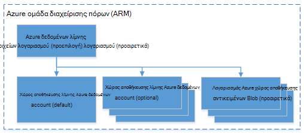

<properties 
   pageTitle="Διαχείριση Azure δεδομένων λίμνης ανάλυση με Azure .NET SDK | Azure" 
   description="Μάθετε πώς μπορείτε να διαχειριστείτε εργασίες ανάλυσης δεδομένων λίμνης, προελεύσεις δεδομένων, οι χρήστες. " 
   services="data-lake-analytics" 
   documentationCenter="" 
   authors="mumian" 
   manager="jhubbard" 
   editor="cgronlun"/>
 
<tags
   ms.service="data-lake-analytics"
   ms.devlang="na"
   ms.topic="article"
   ms.tgt_pltfrm="na"
   ms.workload="big-data" 
   ms.date="09/23/2016"
   ms.author="jgao"/>

# Διαχείριση Azure δεδομένων λίμνης ανάλυση με Azure .NET SDK

[AZURE.INCLUDE [manage-selector](../../includes/data-lake-analytics-selector-manage.md)]

Μάθετε πώς μπορείτε να διαχειριστείτε λογαριασμοί Azure δεδομένων λίμνης ανάλυση, προελεύσεις δεδομένων, οι χρήστες και εργασίες χρησιμοποιώντας το .NET SDK Azure. Για να δείτε θέματα διαχείρισης με χρήση άλλων εργαλείων, κάντε κλικ στην επιλογή καρτέλα, επιλέξτε το παραπάνω.

**Προαπαιτούμενα στοιχεία**

Προτού ξεκινήσετε αυτό το πρόγραμμα εκμάθησης, πρέπει να έχετε τα εξής:

- **Azure μια συνδρομή**. Ανατρέξτε στο θέμα [λήψη Azure δωρεάν δοκιμαστικής έκδοσης](https://azure.microsoft.com/pricing/free-trial/).

<!-- ################################ -->
<!-- ################################ -->

## Σύνδεση με δεδομένα Azure λίμνης ανάλυσης

Θα χρειαστείτε τα εξής πακέτα Nuget:

    Install-Package Microsoft.Rest.ClientRuntime.Azure.Authentication -Pre
    Install-Package Microsoft.Azure.Common 
    Install-Package Microsoft.Azure.Management.ResourceManager -Pre
    Install-Package Microsoft.Azure.Management.DataLake.Analytics -Pre

Το παρακάτω δείγμα κώδικα δείχνει πώς να συνδεθείτε με Azure και παράθεση σε λίστα τους υπάρχοντες λογαριασμούς ανάλυση λίμνης δεδομένων στην περιοχή Azure τη συνδρομή σας.

    using System;
    using System.Collections.Generic;
    using System.Threading;

    using Microsoft.Rest;
    using Microsoft.Rest.Azure.Authentication;

    using Microsoft.Azure.Management.ResourceManager;
    using Microsoft.Azure.Management.DataLake.Store;
    using Microsoft.Azure.Management.DataLake.Analytics;
    using Microsoft.Azure.Management.DataLake.Analytics.Models;

    namespace ConsoleAcplication1
    {
        class Program
        {

            private const string SUBSCRIPTIONID = "<Enter Your Azure Subscription ID>";
            private const string CLIENTID = "1950a258-227b-4e31-a9cf-717495945fc2";
            private const string DOMAINNAME = "common"; // Replace this string with the user's Azure Active Directory tenant ID or domain name, if needed.

            private static DataLakeAnalyticsAccountManagementClient _adlaClient;

            private static void Main(string[] args)
            {

                var creds = AuthenticateAzure(DOMAINNAME, CLIENTID);

                _adlaClient = new DataLakeAnalyticsAccountManagementClient(creds);
                _adlaClient.SubscriptionId = SUBSCRIPTIONID;

                var adlaAccounts = ListADLAAccounts();

                Console.WriteLine("You have %i Data Lake Analytics account(s).", adlaAccounts.Count);
                for (int i = 0; i < adlaAccounts.Count; i ++)
                {
                    Console.WriteLine(adlaAccounts[i].Name);
                }

                System.Console.WriteLine("Press ENTER to continue");
                System.Console.ReadLine();
            }

            public static ServiceClientCredentials AuthenticateAzure(
            string domainName,
            string nativeClientAppCLIENTID)
            {
                // User login via interactive popup
                SynchronizationContext.SetSynchronizationContext(new SynchronizationContext());
                // Use the client ID of an existing AAD "Native Client" application.
                var activeDirectoryClientSettings = ActiveDirectoryClientSettings.UsePromptOnly(nativeClientAppCLIENTID, new Uri("urn:ietf:wg:oauth:2.0:oob"));
                return UserTokenProvider.LoginWithPromptAsync(domainName, activeDirectoryClientSettings).Result;
            }

            public static List<DataLakeAnalyticsAccount> ListADLAAccounts()
            {
                var response = _adlaClient.Account.List();
                var accounts = new List<DataLakeAnalyticsAccount>(response);

                while (response.NextPageLink != null)
                {
                    response = _adlaClient.Account.ListNext(response.NextPageLink);
                    accounts.AddRange(response);
                }

                return accounts;
            }
        }
    }

## Διαχείριση λογαριασμών

Πριν από την εκτέλεση ανάλυσης δεδομένων λίμνης εργασίες, πρέπει να έχετε ένα λογαριασμό ανάλυση λίμνης δεδομένων. Σε αντίθεση με Azure HDInsight, δεν πληρώνετε για ένα λογαριασμό ανάλυσης όταν δεν εκτελείται μια εργασία.  Πληρώνετε μόνο για την περίοδο λειτουργίας όταν εκτελείται μια εργασία.  Για περισσότερες πληροφορίες, ανατρέξτε στο θέμα [Επισκόπηση ανάλυσης λίμνης Azure δεδομένων](data-lake-analytics-overview.md).  

###Δημιουργία λογαριασμών

Πρέπει να έχετε μια ομάδα διαχείρισης πόρων Azure, καθώς και ένα λογαριασμό του χώρου αποθήκευσης δεδομένων λίμνης μπορέσετε να εκτελέσετε το παρακάτω παράδειγμα.

Ο ακόλουθος κώδικας δείχνει πώς μπορείτε να δημιουργήσετε μια ομάδα πόρων:

    public static async Task<ResourceGroup> CreateResourceGroupAsync(
        ServiceClientCredentials credential,
        string groupName,
        string subscriptionId,
        string location)
    {

        Console.WriteLine("Creating the resource group...");
        var resourceManagementClient = new ResourceManagementClient(credential)
        { SubscriptionId = subscriptionId };
        var resourceGroup = new ResourceGroup { Location = location };
        return await resourceManagementClient.ResourceGroups.CreateOrUpdateAsync(groupName, resourceGroup);
    }

Ο ακόλουθος κώδικας δείχνει πώς μπορείτε να δημιουργήσετε ένα λογαριασμό του χώρου αποθήκευσης λίμνης δεδομένων:

    var adlsParameters = new DataLakeStoreAccount(location: _location);
    _adlsClient.Account.Create(_resourceGroupName, _adlsAccountName, adlsParameters);

Ο ακόλουθος κώδικας δείχνει πώς μπορείτε να δημιουργήσετε ένα λογαριασμό ανάλυση λίμνης δεδομένων:

    var defaultAdlsAccount = new List<DataLakeStoreAccountInfo> { new DataLakeStoreAccountInfo(adlsAccountName, new DataLakeStoreAccountInfoProperties()) };
    var adlaProperties = new DataLakeAnalyticsAccountProperties(defaultDataLakeStoreAccount: adlsAccountName, dataLakeStoreAccounts: defaultAdlsAccount);
    var adlaParameters = new DataLakeAnalyticsAccount(properties: adlaProperties, location: location);
    var adlaAccount = _adlaClient.Account.Create(resourceGroupName, adlaAccountName, adlaParameters);

###Λίστα λογαριασμών

Ανατρέξτε στο θέμα [σύνδεση με δεδομένα Azure λίμνης ανάλυσης](#connect_to_azure_data_lake_analytics).

###Βρείτε ένα λογαριασμό

Αφού δημιουργήσετε ένα αντικείμενο από μια λίστα λογαριασμών ανάλυση λίμνης δεδομένων, μπορείτε να χρησιμοποιήσετε τα εξής για να βρείτε ένα λογαριασμό:

    Predicate<DataLakeAnalyticsAccount> accountFinder = (DataLakeAnalyticsAccount a) => { return a.Name == adlaAccountName; };
    var myAdlaAccount = adlaAccounts.Find(accountFinder);

###Διαγραφή λογαριασμών ανάλυσης δεδομένων λίμνης

Το παρακάτω τμήμα κώδικα διαγράφει ένα λογαριασμό ανάλυση λίμνης δεδομένων:

    _adlaClient.Account.Delete(resourceGroupName, adlaAccountName);

<!-- ################################ -->
<!-- ################################ -->
## Διαχείριση προελεύσεων δεδομένων λογαριασμού

Ανάλυση δεδομένων λίμνης υποστηρίζει αυτήν τη στιγμή τις ακόλουθες προελεύσεις δεδομένων:

- [Χώρος αποθήκευσης λίμνης Azure δεδομένων](../data-lake-store/data-lake-store-overview.md)
- [Azure χώρου αποθήκευσης](../storage/storage-introduction.md)

Όταν δημιουργείτε ένα λογαριασμό ανάλυσης, πρέπει να καθορίσετε ένα λογαριασμό αποθήκευσης λίμνης Azure δεδομένων για να τον προεπιλεγμένο λογαριασμό χώρου αποθήκευσης. Τον προεπιλεγμένο λογαριασμό χώρου αποθήκευσης δεδομένων λίμνης χρησιμοποιείται για την αποθήκευση έργων μετα-δεδομένων και εργασία αρχείων καταγραφής ελέγχου. Αφού δημιουργήσετε ένα λογαριασμό ανάλυση, μπορείτε να προσθέσετε επιπλέον λογαριασμούς χώρος αποθήκευσης δεδομένων λίμνης ή/και το χώρο αποθήκευσης Azure λογαριασμού. 

### Βρείτε τον προεπιλεγμένο λογαριασμό χώρου αποθήκευσης δεδομένων λίμνης

Ανατρέξτε στο θέμα Εύρεση λογαριασμού σε αυτό το άρθρο για να βρείτε το λογαριασμό ανάλυση λίμνης δεδομένων. Στη συνέχεια, χρησιμοποιήστε τα εξής:

    string adlaDefaultDataLakeStoreAccountName = myAccount.Properties.DefaultDataLakeStoreAccount;

## Χρήση των ομάδων διαχείρισης πόρων Azure

Εφαρμογές είναι συνήθως αποτελείται από πολλά στοιχεία, για παράδειγμα μια εφαρμογή web, βάση δεδομένων, διακομιστή βάσης δεδομένων, χώρος αποθήκευσης και τρίτου κατασκευαστή υπηρεσίες. Azure διαχείριση πόρων σάς επιτρέπει να εργαστείτε με τους πόρους στην εφαρμογή σας ως ομάδα, γνωστή ως μια ομάδα πόρων του Azure. Να αναπτύξετε, ενημέρωση, παρακολούθηση ή να διαγράψετε όλους τους πόρους για την εφαρμογή σας σε μια ενιαία, συντονισμένη λειτουργία. Μπορείτε να χρησιμοποιήσετε ένα πρότυπο για ανάπτυξη και μπορεί να λειτουργήσει αυτό το πρότυπο για διαφορετικά περιβάλλοντα όπως δοκιμές, ανάπτυξης και παραγωγής. Να ξεκαθαρίσετε χρεώσεις για την εταιρεία σας, προβάλλοντας το κόστος πολλαπλών επιπέδων για ολόκληρη την ομάδα. Για περισσότερες πληροφορίες, ανατρέξτε στο θέμα [Επισκόπηση της διαχείρισης πόρων Azure](../azure-resource-manager/resource-group-overview.md). 

Μια υπηρεσία ανάλυσης λίμνης δεδομένων μπορεί να περιλαμβάνει τα παρακάτω στοιχεία:

- Azure δεδομένων λίμνης αναλυτικών στοιχείων λογαριασμού
- Απαιτείται προεπιλεγμένου λογαριασμού αποθήκευσης λίμνης δεδομένων Azure
- Λογαριασμοί λίμνης δεδομένων Azure επιπλέον χώρου αποθήκευσης
- Επιπλέον χώρο αποθήκευσης Azure λογαριασμούς

Μπορείτε να δημιουργήσετε όλα αυτά τα στοιχεία στην περιοχή μία ομάδα διαχείρισης πόρων ώστε να είναι πιο εύκολο να διαχειριστείτε.

Ένα λογαριασμό ανάλυση λίμνης δεδομένων και τους λογαριασμούς εξαρτώμενα αποθήκευσης πρέπει να τοποθετηθεί στο ίδιο κέντρο Azure δεδομένων.
Στην ομάδα διαχείριση πόρων μπορεί ωστόσο να βρίσκεται σε ένα κέντρο διαφορετικά δεδομένα.  

##Δείτε επίσης 

- [Επισκόπηση της ανάλυσης λίμνης δεδομένων Microsoft Azure](data-lake-analytics-overview.md)
- [Γρήγορα αποτελέσματα με το ανάλυση λίμνης δεδομένων με την πύλη του Azure](data-lake-analytics-get-started-portal.md)
- [Διαχείριση Azure ανάλυση λίμνης δεδομένων με την πύλη του Azure](data-lake-analytics-manage-use-portal.md)
- [Παρακολούθηση και αντιμετώπιση προβλημάτων του Azure δεδομένων λίμνης ανάλυσης εργασιών με Azure πύλη](data-lake-analytics-monitor-and-troubleshoot-jobs-tutorial.md)

