<properties 
   pageTitle="Διαχείριση Azure ανάλυση λίμνης δεδομένων με την πύλη του Azure | Azure" 
   description="Μάθετε πώς μπορείτε να διαχειριστείτε acounts ανάλυσης δεδομένων λίμνης, προελεύσεις δεδομένων, οι χρήστες και εργασίες." 
   services="data-lake-analytics" 
   documentationCenter="" 
   authors="edmacauley" 
   manager="jhubbard" 
   editor="cgronlun"/>
 
<tags
   ms.service="data-lake-analytics"
   ms.devlang="na"
   ms.topic="article"
   ms.tgt_pltfrm="na"
   ms.workload="big-data" 
   ms.date="10/06/2016"
   ms.author="edmaca"/>

# Διαχείριση Azure ανάλυση λίμνης δεδομένων με την πύλη του Azure

[AZURE.INCLUDE [manage-selector](../../includes/data-lake-analytics-selector-manage.md)]

Μάθετε πώς μπορείτε να διαχειριστείτε λογαριασμοί Azure δεδομένων λίμνης ανάλυση, προελεύσεις δεδομένων λογαριασμού, οι χρήστες και εργασίες με την πύλη Azure. Για να δείτε θέματα διαχείρισης με χρήση άλλων εργαλείων, κάντε κλικ στον επιλογέα στηλοθετών στο επάνω μέρος της σελίδας.

**Προαπαιτούμενα στοιχεία**

Προτού ξεκινήσετε αυτό το πρόγραμμα εκμάθησης, πρέπει να έχετε τα ακόλουθα στοιχεία:

- **Azure μια συνδρομή**. Ανατρέξτε στο θέμα [λήψη Azure δωρεάν δοκιμαστικής έκδοσης](https://azure.microsoft.com/pricing/free-trial/).

<!-- ################################ -->
<!-- ################################ -->
## Διαχείριση λογαριασμών

Πριν από την εκτέλεση ανάλυσης δεδομένων λίμνης εργασίες, πρέπει να έχετε ένα λογαριασμό ανάλυση λίμνης δεδομένων. Σε αντίθεση με Azure HDInsight, μόνο πληρώνετε για ένα λογαριασμό ανάλυση λίμνης δεδομένων κατά την εκτέλεση μιας εργασίας.  Πληρώνετε μόνο για την περίοδο λειτουργίας όταν εκτελείται μια εργασία.  Για περισσότερες πληροφορίες, ανατρέξτε στο θέμα [Επισκόπηση ανάλυσης λίμνης Azure δεδομένων](data-lake-analytics-overview.md).  

**Για να δημιουργήσετε ένα λογαριασμό ανάλυσης δεδομένων λίμνης**

1. Πραγματοποιήστε είσοδο [πύλη του Azure](https://portal.azure.com).
2. Κάντε κλικ στην επιλογή **Δημιουργία**, κάντε κλικ **ευφυΐας + ανάλυση**, και, στη συνέχεια, κάντε κλικ στην επιλογή **Ανάλυσης λίμνης δεδομένων**.
3. Πληκτρολογήστε ή επιλέξτε τις ακόλουθες τιμές:

    

    - **Όνομα**: δώστε ένα όνομα στο λογαριασμό ανάλυση λίμνης δεδομένων.
    - **Συνδρομή**: Επιλέξτε τη συνδρομή Azure που χρησιμοποιούνται για το λογαριασμό ανάλυσης.
    - **Ομάδα πόρων**. Επιλέξτε μια υπάρχουσα ομάδα πόρων Azure ή δημιουργήστε ένα νέο. Azure διαχείριση πόρων σάς επιτρέπει να εργαστείτε με τους πόρους στην εφαρμογή σας ως ομάδα. Για περισσότερες πληροφορίες, ανατρέξτε στο θέμα [Επισκόπηση της διαχείρισης πόρων Azure](resource-group-overview.md). 
    - **Θέση**. Επιλέξτε ένα κέντρο δεδομένων Azure για το λογαριασμό ανάλυση λίμνης δεδομένων. 
    - **Χώρος αποθήκευσης δεδομένων λίμνης**: λογαριασμός κάθε ανάλυση λίμνης δεδομένων έχει ένα λογαριασμό του χώρου αποθήκευσης δεδομένων λίμνης εξαρτώμενα. Ο λογαριασμός δεδομένων λίμνης ανάλυση και το λογαριασμό χώρου αποθήκευσης δεδομένων λίμνης εξαρτώμενα πρέπει να βρίσκεται στο ίδιο κέντρο Azure δεδομένων. Ακολουθήστε τις οδηγίες για να δημιουργήσετε ένα νέο λογαριασμό του χώρου αποθήκευσης δεδομένων λίμνης ή επιλέξτε ένα υπάρχον.

8. Κάντε κλικ στην επιλογή **Δημιουργία**. Σας μεταφέρει στην αρχική οθόνη πύλης. Ένα νέο πλακίδιο προστίθεται το StartBoard με την ετικέτα που εμφανίζει την "Για την ανάπτυξη Azure δεδομένων λίμνης ανάλυσης". Χρειάζονται μερικά λεπτά για να δημιουργήσετε ένα λογαριασμό ανάλυση λίμνης δεδομένων. Όταν δημιουργηθεί ο λογαριασμός, την πύλη ανοίγει το λογαριασμό σε ένα νέο blade.

Μετά τη δημιουργία ενός λογαριασμού ανάλυση λίμνης δεδομένων, μπορείτε να προσθέσετε επιπλέον χώρο αποθήκευσης λίμνης δεδομένων και αποθήκευσης Azure λογαριασμών. Για οδηγίες, ανατρέξτε στο θέμα [Διαχείριση ανάλυσης λίμνης δεδομένων λογαριασμού προελεύσεις δεδομένων](data-lake-analytics-manage-use-portal.md#manage-account-data-sources).

**Για να πρόσβασης/άνοιγμα ενός λογαριασμού ανάλυσης δεδομένων λίμνης**

1. Πραγματοποιήστε είσοδο [πύλη του Azure](https://portal.azure.com/).
2. Κάντε κλικ στην επιλογή **Ανάλυσης λίμνης δεδομένων** από το αριστερό μενού.  Εάν δεν το βλέπετε, κάντε κλικ στην επιλογή **περισσότερες υπηρεσίες**και, στη συνέχεια, κάντε κλικ στην επιλογή **Ανάλυσης λίμνης δεδομένων** στην περιοχή **πληροφοριών + ανάλυσης**.
3. Κάντε κλικ στο λογαριασμό ανάλυση λίμνης δεδομένων που θέλετε να έχετε πρόσβαση. Ανοίγει το λογαριασμό σε ένα νέο blade.

**Για να διαγράψετε ένα λογαριασμό ανάλυσης δεδομένων λίμνης**

1. Ανοίξτε το λογαριασμό ανάλυση λίμνης δεδομένων που θέλετε να διαγράψετε. Για οδηγίες, ανατρέξτε στο θέμα [ανάλυση λίμνης δεδομένων Access λογαριασμοί](#access-adla-account).
2. Κάντε κλικ στην επιλογή **Διαγραφή** από το μενού του κουμπιού στο επάνω μέρος του blade.
3. Πληκτρολογήστε το όνομα του λογαριασμού και, στη συνέχεια, κάντε κλικ στην επιλογή **Διαγραφή**.

Τη διαγραφή ενός λογαριασμού ανάλυση λίμνης δεδομένων δεν διαγράφει τα εξαρτημένα λογαριασμούς χώρου αποθήκευσης λίμνης δεδομένων. Για οδηγίες διαγραφής χώρος αποθήκευσης δεδομένων λίμνης λογαριασμούς, ανατρέξτε [λογαριασμού χώρου αποθήκευσης λίμνης διαγραφή δεδομένων](data-lake-store-get-started-portal.md#delete-azure-data-lake-store-account).

<!-- ################################ -->
<!-- ################################ -->
## Διαχείριση προελεύσεων δεδομένων λογαριασμού

Ανάλυση δεδομένων λίμνης υποστηρίζει αυτήν τη στιγμή τις ακόλουθες προελεύσεις δεδομένων:

- [Χώρος αποθήκευσης λίμνης δεδομένων Azure](../data-lake-store/data-lake-store-overview.md)
- [Azure χώρου αποθήκευσης](../storage/storage-introduction.md)

Όταν δημιουργείτε ένα λογαριασμό ανάλυση λίμνης δεδομένων, πρέπει να καθορίσετε ένα λογαριασμό χώρου αποθήκευσης λίμνης Azure δεδομένων για να τον προεπιλεγμένο λογαριασμό χώρου αποθήκευσης. Τον προεπιλεγμένο λογαριασμό χώρου αποθήκευσης δεδομένων λίμνης χρησιμοποιείται για την αποθήκευση έργων μετα-δεδομένων και εργασία αρχείων καταγραφής ελέγχου. Αφού δημιουργήσετε ένα λογαριασμό ανάλυση λίμνης δεδομένων, μπορείτε να προσθέσετε επιπλέον χώρο αποθήκευσης δεδομένων λίμνης λογαριασμούς ή/και το χώρο αποθήκευσης Azure λογαριασμού. 

**Για να βρείτε τον προεπιλεγμένο λογαριασμό χώρου αποθήκευσης δεδομένων λίμνης**

- Ανοίξτε το λογαριασμό ανάλυση λίμνης δεδομένων που θέλετε να διαχειριστείτε. Για οδηγίες, ανατρέξτε στο θέμα [ανάλυση λίμνης δεδομένων Access λογαριασμοί](#access-adla-account). Προεπιλεγμένος χώρος αποθήκευσης δεδομένων λίμνης εμφανίζεται στην **βασικά**:

    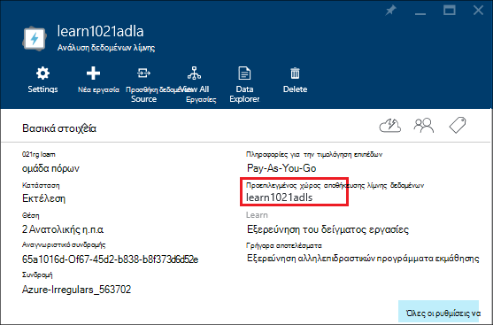

**Για να προσθέσετε πρόσθετων προελεύσεων δεδομένων**

1. Ανοίξτε το λογαριασμό ανάλυση λίμνης δεδομένων που θέλετε να διαχειριστείτε. Για οδηγίες, ανατρέξτε στο θέμα [ανάλυση λίμνης δεδομένων Access λογαριασμοί](#access-adla-account).
2. Κάντε κλικ στην επιλογή **Ρυθμίσεις** και, στη συνέχεια, κάντε κλικ στην επιλογή **Προελεύσεις δεδομένων**. Βλέπετε τον προεπιλεγμένο λογαριασμό χώρου αποθήκευσης λίμνης δεδομένων που εμφανίζεται εκεί. 
3. Κάντε κλικ στην επιλογή **Προσθήκη προέλευσης δεδομένων**.

    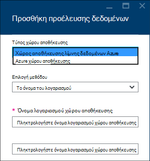

    Για να προσθέσετε ένα λογαριασμό του χώρου αποθήκευσης λίμνης δεδομένων Azure, πρέπει το λογαριασμό όνομα, και αποκτήστε πρόσβαση στο λογαριασμό για να έχετε τη δυνατότητα το ερώτημα.
    Για να προσθέσετε χώρο αποθήκευσης αντικειμένων Blob του Azure, χρειάζεστε το λογαριασμό χώρου αποθήκευσης και το κλειδί λογαριασμού, το οποίο μπορείτε να βρείτε, μεταβαίνοντας στο λογαριασμό χώρου αποθήκευσης στην πύλη.

**Για να εξερευνήσετε προελεύσεις δεδομένων**  

1. Ανοίξτε το λογαριασμό ανάλυσης που θέλετε να διαχειριστείτε. Για οδηγίες, ανατρέξτε στο θέμα [ανάλυση λίμνης δεδομένων Access λογαριασμοί](#access-adla-account).
2. Κάντε κλικ στην επιλογή **Ρυθμίσεις** και, στη συνέχεια, κάντε κλικ στην επιλογή **Εξερεύνηση δεδομένων**. 
 
    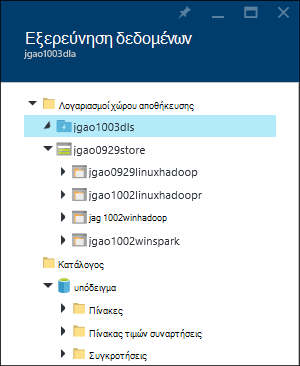
    
3. Κάντε κλικ σε ένα λογαριασμό χώρου αποθήκευσης λίμνης δεδομένων για να ανοίξετε το λογαριασμό.

    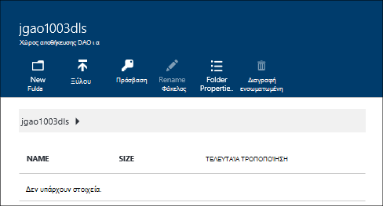
    
    Για κάθε λογαριασμό χώρου αποθήκευσης λίμνης δεδομένων, μπορείτε να κάνετε
    
    - **Νέος φάκελος**: Προσθήκη νέου φακέλου.
    - **Αποστολή**: Αποστολή αρχείων με το λογαριασμό χώρου αποθήκευσης από το σταθμούς εργασίας.
    - **Πρόσβαση**: ρύθμιση παραμέτρων πρόσβασης δικαιώματα.
    - **Μετονομασία φακέλου**: Μετονομασία φακέλου.
    - **Ιδιότητες φακέλου**: εμφάνιση των ιδιοτήτων αρχείου ή φακέλου, όπως WASB διαδρομή, η διαδρομή WEBHDFS, έκανε την τελευταία τροποποίηση ώρας και ούτω καθεξής.
    - **Διαγραφή φακέλου**: Διαγραφή φακέλου.

**Για να αποστείλετε αρχεία με το λογαριασμό χώρου αποθήκευσης δεδομένων λίμνης**

1. Από την πύλη, κάντε κλικ στην επιλογή **Αναζήτηση** από το αριστερό μενού και, στη συνέχεια, κάντε κλικ στην επιλογή **Χώρος αποθήκευσης δεδομένων λίμνης**.
2. Επιλέξτε το λογαριασμό χώρου αποθήκευσης λίμνης δεδομένων που θέλετε να κάνετε αποστολή δεδομένων σε. Για να βρείτε τον προεπιλεγμένο λογαριασμό χώρος αποθήκευσης δεδομένων λίμνης, δείτε [εδώ](#default-adl-account).
3. Κάντε κλικ στην επιλογή **Εξερεύνηση δεδομένων** από το επάνω μενού.
4. Κάντε κλικ στην επιλογή **Νέο κατάλογο** για να δημιουργήσετε ένα νέο φάκελο ή κάντε κλικ σε ένα όνομα φακέλου για να αλλάξετε το φάκελο.
6. Κάντε κλικ στην επιλογή **Αποστολή** από το επάνω μενού για να αποστείλετε το αρχείο.

**Για να αποστείλετε αρχεία με το λογαριασμό χώρου αποθήκευσης αντικειμένων Blob του Azure**

Ανατρέξτε στο θέμα [Αποστολή δεδομένων για τις εργασίες Hadoop στο HDInsight](../hdinsight/hdinsight-upload-data.md).  Οι πληροφορίες ισχύουν για ανάλυση δεδομένων λίμνης.

## Διαχείριση χρηστών

Ανάλυση δεδομένων λίμνης χρησιμοποιεί τον έλεγχο πρόσβασης βάσει ρόλων με Azure Active Directory. Όταν δημιουργείτε ένα λογαριασμό ανάλυσης δεδομένων λίμνης, ένα ρόλο "Διαχειριστές συνδρομής" προστίθεται στο λογαριασμό. Μπορείτε να προσθέσετε επιπλέον χρήστες και ομάδες ασφαλείας με τους εξής ρόλους:

|Ρόλος|Περιγραφή|
|----|-----------|
|Κάτοχος|Σας επιτρέπουν να διαχειρίζεστε όλα τα στοιχεία, συμπεριλαμβανομένης της πρόσβασης σε πόρους.|
|Συμβολής|Πρόσβαση στην πύλη; υποβολή και να παρακολουθείτε τις εργασίες. Για να έχετε τη δυνατότητα να υποβάλλουν εργασίες, ένα συνεργάτη πρέπει το δικαίωμα ανάγνωσης ή εγγραφής για τους λογαριασμούς χώρου αποθήκευσης λίμνης δεδομένων.|
|DataLakeAnalyticsDeveloper | Υποβολή, να παρακολουθούν και να ακυρώσετε τις εργασίες.  Αυτοί οι χρήστες μπορούν να ακυρώσετε μόνο τις δικές τους εργασίες. Δεν είναι δυνατό να διαχειρίζονται τις δικές τους λογαριασμό, για παράδειγμα, να προσθέσετε χρήστες, αλλαγή δικαιωμάτων ή διαγράψετε το λογαριασμό. Για να μπορέσετε να εκτελέσετε εργασίες, που χρειάζονται δικαίωμα ανάγνωσης ή εγγραφής πρόσβασης για τους λογαριασμούς του χώρου αποθήκευσης δεδομένων λίμνης     | 
|Πρόγραμμα ανάγνωσης|Σας επιτρέπει να προβάλετε τα πάντα, αλλά όχι να κάνετε αλλαγές.|  
|DevTest Labs χρήστη|Σας επιτρέπει να δείτε όλα τα στοιχεία και να συνδεθείτε, Έναρξη και επανεκκίνηση τερματισμού εικονικές μηχανές.|  
|Διαχειριστής πρόσβασης χρήστη|Σας επιτρέπει να διαχειριστείτε την πρόσβαση χρηστών σε Azure πόρους.|  

Για πληροφορίες σχετικά με τη δημιουργία Azure Active Directory χρήστες και ομάδες ασφαλείας, ανατρέξτε στο θέμα [Τι είναι το Azure Active Directory](../active-directory/active-directory-whatis.md).

**Για να προσθέσετε χρήστες ή ομάδες ασφαλείας σε ένα λογαριασμό ανάλυσης δεδομένων λίμνης**

1. Ανοίξτε το λογαριασμό ανάλυσης που θέλετε να διαχειριστείτε. Για οδηγίες, ανατρέξτε στο θέμα [ανάλυση λίμνης δεδομένων Access λογαριασμοί](#access-adla-account).
2. Κάντε κλικ στην επιλογή **Ρυθμίσεις**και, στη συνέχεια, κάντε κλικ στην επιλογή **χρήστες**. Μπορείτε επίσης να επιλέξετε **πρόσβαση** στη γραμμή τίτλου **βασικά στοιχεία** , όπως φαίνεται στο παρακάτω στιγμιότυπο οθόνης:

    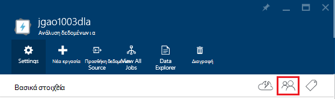
3. Από το **χρήστη** blade, κάντε κλικ στην επιλογή **Προσθήκη**.
4. Επιλέξτε ένα ρόλο και Προσθήκη χρήστη και, στη συνέχεια, κάντε κλικ στο κουμπί **OK**.

**Σημείωση: Εάν αυτόν το χρήστη ή ομάδας ασφαλείας πρέπει να υποβάλλουν εργασίες, θα πρέπει να δοθεί δικαιωμάτων στο χώρο αποθήκευσης λίμνης δεδομένων καθώς και. Για περισσότερες πληροφορίες, ανατρέξτε στο θέμα [ασφαλή δεδομένα που είναι αποθηκευμένα στο χώρο αποθήκευσης λίμνης δεδομένων](../data-lake-store/data-lake-store-secure-data.md).**

<!-- ################################ -->
<!-- ################################ -->
## Διαχείριση εργασιών

Πρέπει να έχετε ένα λογαριασμό ανάλυσης δεδομένων λίμνης μπορέσετε να εκτελέσετε τις εργασίες U-SQL.  Για περισσότερες πληροφορίες, ανατρέξτε στο θέμα [Διαχείριση ανάλυσης λίμνης δεδομένων λογαριασμών](#manage-data-lake-analytics-accounts).

**Για να δημιουργήσετε μια εργασία**

1. Ανοίξτε το λογαριασμό ανάλυσης που θέλετε να διαχειριστείτε. Για οδηγίες, ανατρέξτε στο θέμα [ανάλυση λίμνης δεδομένων Access λογαριασμοί](#access-adla-account).
2. Κάντε κλικ στην επιλογή **νέα εργασία**.

    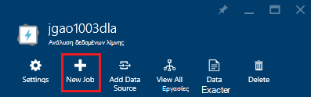

    Βλέπετε μια νέα blade παρόμοιο με το εξής:

    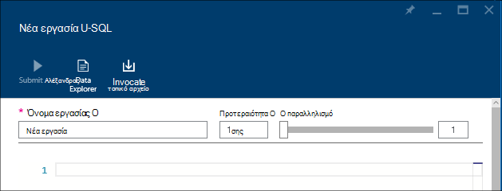

    Για κάθε εργασία, μπορείτε να ρυθμίσετε τις παραμέτρους

  	|Όνομα|Περιγραφή|
  	|----|-----------|
  	|Το όνομα της εργασίας|Πληκτρολογήστε το όνομα της εργασίας.|
  	|Προτεραιότητα|Μικρότερο αριθμό έχει την υψηλότερη προτεραιότητα. Εάν οι δύο εργασίες είναι και τα δύο στην ουρά, η μία με χαμηλότερη προτεραιότητα εκτελείται πρώτα|
  	|Παραλληλισμό |Μέγιστος αριθμός των διεργασιών υπολογισμού που μπορεί να συμβεί την ίδια στιγμή. Αύξηση αυτός ο αριθμός να βελτιώσετε τις επιδόσεις, αλλά επίσης να αυξήσετε το κόστος.|
  	|Δέσμη ενεργειών|Εισαγάγετε τη δέσμη ενεργειών U-SQL για το έργο.|

    Χρησιμοποιώντας το ίδιο περιβάλλον, μπορείτε να επίσης Εξερευνήστε τις προελεύσεις δεδομένων σύνδεσης και προσθήκη επιπλέον αρχείων για να τα συνδεδεμένα αρχεία προέλευσης δεδομένων. 
3. Εάν θέλετε να υποβάλετε την εργασία, κάντε κλικ στην επιλογή **Υποβολή εργασία** .

**Για να υποβάλετε μια εργασία**

Ανατρέξτε στο θέμα [Δημιουργία ανάλυση λίμνης δεδομένων εργασίες](#create-job).

**Για να παρακολουθείτε τις εργασίες**

1. Ανοίξτε το λογαριασμό ανάλυσης που θέλετε να διαχειριστείτε. Για οδηγίες, ανατρέξτε στο θέμα [ανάλυση λίμνης δεδομένων Access λογαριασμοί](#access-adla-account). Ο πίνακας τη διαχείριση του έργου εμφανίζει πληροφορίες για την εργασία βασικές:

    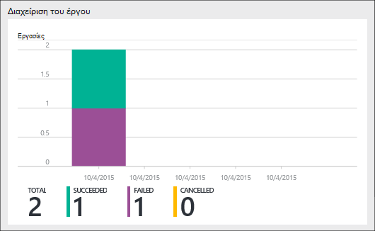

3. Κάντε κλικ στην επιλογή **Διαχείριση του έργου** , όπως φαίνεται στο προηγούμενο στιγμιότυπο οθόνης.

    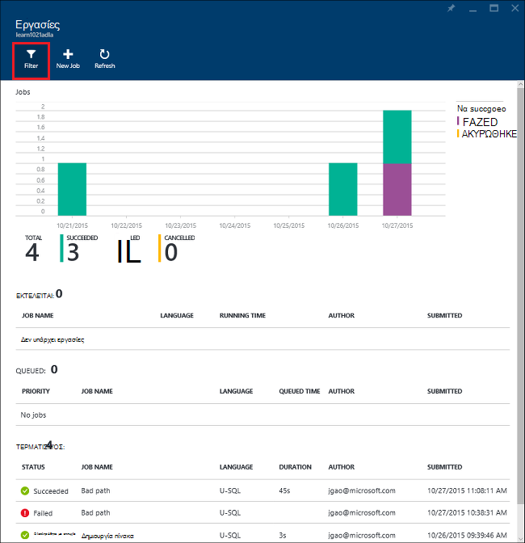

4. Κάντε κλικ σε μια εργασία από τις λίστες. Ή κάντε κλικ στην επιλογή **φίλτρο** για να σας βοηθήσει να βρείτε τις εργασίες:

    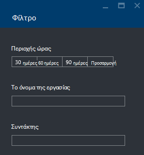

    Μπορείτε να φιλτράρετε εργασίες **Περιοχής ώρας**, **Το όνομα της εργασίας**και **συντάκτη**.
5. Κάντε κλικ στην επιλογή **υποβάλετε ξανά** , εάν θέλετε να υποβάλετε ξανά την εργασία.

**Για να το υποβάλετε μια εργασία**

Ανατρέξτε στο θέμα [εργασίες οθόνη δεδομένων λίμνης ανάλυσης](#monitor-jobs).

##Παρακολούθηση χρήσης λογαριασμού

**Για την παρακολούθηση της χρήσης λογαριασμού**

1. Ανοίξτε το λογαριασμό ανάλυσης που θέλετε να διαχειριστείτε. Για οδηγίες, ανατρέξτε στο θέμα [ανάλυση λίμνης δεδομένων Access λογαριασμοί](#access-adla-account). Ο πίνακας χρήση δείχνει τη χρήση:

    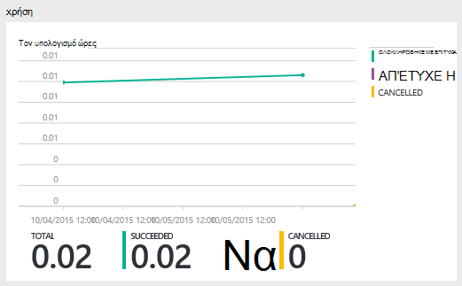

2. Κάντε διπλό κλικ στο παράθυρο για να δείτε περισσότερες λεπτομέρειες.

##Προβολή U SQL καταλόγου

Τον [κατάλογο U-SQL](data-lake-analytics-use-u-sql-catalog.md) χρησιμοποιείται για τη Δόμηση δεδομένων και κώδικα, ώστε να είναι κοινόχρηστη με δέσμες ενεργειών U-SQL. Τον κατάλογο επιτρέπει την υψηλότερη απόδοση πιθανές με δεδομένα σε Azure λίμνης δεδομένων. Από την πύλη Azure, θα μπορείτε να προβάλετε τον κατάλογο U-SQL.

**Για να κάνετε αναζήτηση καταλόγου U-SQL**

1. Ανοίξτε το λογαριασμό ανάλυσης που θέλετε να διαχειριστείτε. Για οδηγίες, ανατρέξτε στο θέμα [ανάλυση λίμνης δεδομένων Access λογαριασμοί](#access-adla-account).
2. Κάντε κλικ στην επιλογή **Εξερεύνηση δεδομένων** από το επάνω μενού.
3. Ανάπτυξη **καταλόγου**, αναπτύξτε το στοιχείο **κύρια**, αναπτύξτε το στοιχείο **πίνακες, ή **τιμών συναρτήσεις πίνακα**, ή **συγκροτήσεις **. Το παρακάτω στιγμιότυπο οθόνης εμφανίζει μία συναρτήσεις με τιμές πίνακα.

    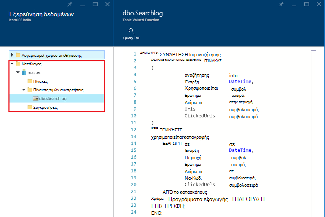

<!-- ################################ -->
<!-- ################################ -->
## Χρήση των ομάδων διαχείρισης πόρων Azure

Εφαρμογές είναι συνήθως αποτελείται από πολλά στοιχεία, για παράδειγμα μια εφαρμογή web, βάση δεδομένων, διακομιστή βάσης δεδομένων, χώρος αποθήκευσης και υπηρεσιών τρίτων. Azure διαχείριση πόρων σάς επιτρέπει να εργαστείτε με τους πόρους στην εφαρμογή σας ως ομάδα, γνωστή ως μια ομάδα πόρων του Azure. Να αναπτύξετε, ενημέρωση, παρακολούθηση, ή να διαγράψετε όλους τους πόρους για την εφαρμογή σας σε μια ενιαία, συντονισμένη λειτουργία. Μπορείτε να χρησιμοποιήσετε ένα πρότυπο για ανάπτυξη και μπορεί να λειτουργήσει αυτό το πρότυπο για διαφορετικά περιβάλλοντα όπως δοκιμές, ενδιάμεσου σταδίου και παραγωγής. Να ξεκαθαρίσετε χρεώσεις για την εταιρεία σας, προβάλλοντας το κόστος πολλαπλών επιπέδων για ολόκληρη την ομάδα. Για περισσότερες πληροφορίες, ανατρέξτε στο θέμα [Επισκόπηση της διαχείρισης πόρων Azure](../azure-resource-manager/resource-group-overview.md). 

Μια υπηρεσία ανάλυσης λίμνης δεδομένων μπορεί να περιλαμβάνει τα παρακάτω στοιχεία:

- Azure δεδομένων λίμνης αναλυτικών στοιχείων λογαριασμού
- Απαιτείται προεπιλεγμένο λογαριασμό χώρου αποθήκευσης λίμνης δεδομένων Azure
- Χώρος αποθήκευσης λίμνης δεδομένων Azure επιπλέον λογαριασμούς
- Επιπλέον χώρο αποθήκευσης Azure λογαριασμούς

Μπορείτε να δημιουργήσετε όλα αυτά τα στοιχεία στην περιοχή μία ομάδα διαχείρισης πόρων ώστε να είναι πιο εύκολο να διαχειριστείτε.

Ένα λογαριασμό ανάλυση λίμνης δεδομένων και τους λογαριασμούς εξαρτώμενα αποθήκευσης πρέπει να τοποθετηθεί στο ίδιο κέντρο Azure δεδομένων.
Στην ομάδα διαχείριση πόρων μπορεί ωστόσο να βρίσκεται σε ένα κέντρο διαφορετικά δεδομένα.  

##Δείτε επίσης 

- [Επισκόπηση της ανάλυσης λίμνης δεδομένων Microsoft Azure](data-lake-analytics-overview.md)
- [Γρήγορα αποτελέσματα με το ανάλυση λίμνης δεδομένων με την πύλη του Azure](data-lake-analytics-get-started-portal.md)
- [Διαχείριση Azure ανάλυση λίμνης δεδομένων με χρήση του PowerShell Azure](data-lake-analytics-manage-use-powershell.md)
- [Παρακολούθηση και αντιμετώπιση προβλημάτων του Azure δεδομένων λίμνης ανάλυσης εργασιών με Azure πύλη](data-lake-analytics-monitor-and-troubleshoot-jobs-tutorial.md)

