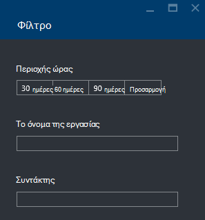

<properties 
   pageTitle="Αντιμετώπιση προβλημάτων Azure δεδομένων λίμνης ανάλυσης εργασιών με πύλη Azure | Azure" 
   description="Μάθετε πώς να χρησιμοποιήσουν την πύλη του Azure για την αντιμετώπιση προβλημάτων ανάλυσης δεδομένων λίμνης εργασίες. " 
   services="data-lake-analytics" 
   documentationCenter="" 
   authors="edmacauley" 
   manager="jhubbard" 
   editor="cgronlun"/>
 
<tags
   ms.service="data-lake-analytics"
   ms.devlang="na"
   ms.topic="article"
   ms.tgt_pltfrm="na"
   ms.workload="big-data" 
   ms.date="05/16/2016"
   ms.author="edmaca"/>

# Αντιμετώπιση προβλημάτων Azure δεδομένων λίμνης ανάλυσης εργασιών με πύλη Azure

Μάθετε πώς να χρησιμοποιήσουν την πύλη του Azure για την αντιμετώπιση προβλημάτων ανάλυσης δεδομένων λίμνης εργασίες.

Σε αυτό το πρόγραμμα εκμάθησης, θα εγκατάστασης που λείπουν πρόβλημα αρχείο προέλευσης και χρησιμοποιήστε την πύλη του Azure για την αντιμετώπιση του προβλήματος.

**Προαπαιτούμενα στοιχεία**

Προτού ξεκινήσετε αυτό το πρόγραμμα εκμάθησης, πρέπει να έχετε τα εξής:

- **Βασικές γνώσεις ανάλυση λίμνης δεδομένα έργου διαδικασία**. Ανατρέξτε στο θέμα [Γρήγορα αποτελέσματα με το Azure δεδομένων λίμνης ανάλυση με Azure πύλη](data-lake-analytics-get-started-portal.md).
- **Ανάλυση λίμνης δεδομένων A λογαριασμού**. Ανατρέξτε στο θέμα [Γρήγορα αποτελέσματα με το Azure δεδομένων λίμνης ανάλυση με Azure πύλη](data-lake-analytics-get-started-portal.md#create-adl-analytics-account).
- **Αντιγράψτε το δείγμα δεδομένων για να τον προεπιλεγμένο λογαριασμό χώρου αποθήκευσης λίμνης δεδομένων**.  Ανατρέξτε στο θέμα [Προετοιμασία αρχείου προέλευσης δεδομένων](data-lake-analytics-get-started-portal.md#prepare-source-data)

##Υποβάλετε μια εργασία ανάλυσης δεδομένων λίμνης

Τώρα θα δημιουργήσετε μια εργασία U-SQL με όνομα αρχείου εσφαλμένες προέλευσης.  

**Για να υποβάλετε την εργασία**

1. Από την πύλη Azure, κάντε κλικ στην επιλογή **Microsoft Azure** στην επάνω αριστερή γωνία.
2. Κάντε κλικ στο πλακίδιο με το όνομα του λογαριασμού σας ανάλυση λίμνης δεδομένων.  Ήταν καρφιτσωμένα εδώ κατά τη δημιουργία του λογαριασμού.
Εάν ο λογαριασμός δεν είναι καρφιτσωμένο εκεί, ανατρέξτε στο θέμα [Άνοιγμα αναλυτικών στοιχείων λογαριασμού από την πύλη](data-lake-analytics-manage-use-portal.md#access-adla-account).
3. Κάντε κλικ στην επιλογή **Νέο έργο** από το επάνω μενού.
4. Πληκτρολογήστε ένα όνομα εργασίας και την ακόλουθη δέσμη ενεργειών U-SQL:

        @searchlog =
            EXTRACT UserId          int,
                    Start           DateTime,
                    Region          string,
                    Query           string,
                    Duration        int?,
                    Urls            string,
                    ClickedUrls     string
            FROM "/Samples/Data/SearchLog.tsv1"
            USING Extractors.Tsv();
        
        OUTPUT @searchlog   
            TO "/output/SearchLog-from-adls.csv"
        USING Outputters.Csv();

    Το αρχείο προέλευσης που ορίζονται από το στη δέσμη ενεργειών είναι **/Samples/Data/SearchLog.tsv1**, όπου πρέπει να είναι **/Samples/Data/SearchLog.tsv**.
     
5. Κάντε κλικ στην επιλογή **Υποβολή εργασίας** από την αρχή. Ανοίγει ένα νέο παράθυρο λεπτομερειών έργου. Στη γραμμή τίτλου, που εμφανίζει την κατάσταση της εργασίας. Χρειάζονται μερικά λεπτά για να ολοκληρώσετε. Μπορείτε να επιλέξετε **Ανανέωση** για να λάβετε την πιο πρόσφατη κατάσταση.
6. Περιμένετε μέχρι να αλλάξει την κατάσταση της εργασίας σε **απέτυχε**.  Εάν η εργασία είναι **ολοκληρώθηκε με**, αυτό συμβαίνει επειδή δεν μπορείτε να καταργήσετε το φάκελο /Samples. Ανατρέξτε στην ενότητα **προαπαιτούμενες** στην αρχή του προγράμματος εκμάθησης.

Ίσως αναρωτηθείτε - γιατί χρειάζονται τόσο πολύ για ένα μικρό έργο.  Να θυμάστε ότι ανάλυση λίμνης δεδομένων έχει σχεδιαστεί για να επεξεργαστείτε μεγάλο δεδομένα.  Το ιδιαίτερα χαμηλή κατά την επεξεργασία σε μεγάλο όγκο δεδομένων χρησιμοποιώντας το κατανεμημένο σύστημα.

Ας θεωρείται ότι έχετε υποβάλει το έργο και κλείστε την πύλη.  Στην επόμενη ενότητα, θα μάθετε πώς μπορείτε να αντιμετωπίσετε το έργο.

## Αντιμετώπιση προβλημάτων με την εργασία

Στην ενότητα τελευταία, έχετε υποβάλει μια εργασία και η εργασία απέτυχε.  

**Για να δείτε όλες τις εργασίες**

1. Από την πύλη Azure, κάντε κλικ στην επιλογή **Microsoft Azure** στην επάνω αριστερή γωνία.
2. Κάντε κλικ στο πλακίδιο με το όνομα του λογαριασμού σας ανάλυση λίμνης δεδομένων.  Εμφανίζεται η εργασία σύνοψης στο πλακίδιο **Διαχείριση του έργου** .

    
    
    Η εργασία διαχείρισης παρέχει μια ματιά από την κατάσταση της εργασίας. Σημειώστε υπάρχει αποτυχίας εργασίας.
   
3. Κάντε κλικ στο πλακίδιο **Διαχείριση του έργου** για να δείτε τις εργασίες. Οι εργασίες κατηγοριοποιούνται σε **εκτελείται** **σε ουρά**και **έληξε**. Βλέπετε απέτυχε εργαστείτε στην ενότητα **έληξε** . Πρέπει να πρώτο στη λίστα. Όταν έχετε πολλές εργασίες, μπορείτε να επιλέξετε **φίλτρο** για να σας βοηθήσουν να εντοπίσετε εργασίες.

    

4. Κάντε κλικ στην επιλογή της αποτυχίας εργασίας από τη λίστα για να ανοίξετε τις λεπτομέρειες της εργασίας σε ένα νέο blade:

    
    
    Παρατηρήστε ότι το κουμπί **υποβάλετε ξανά** . Μόλις διορθώσετε το πρόβλημα, να υποβάλετε ξανά την εργασία.

5. Κάντε κλικ στην επιλογή επισήμανση τμήματος από το προηγούμενο στιγμιότυπο οθόνης για να ανοίξετε τις λεπτομέρειες του σφάλματος.  Θα δείτε κάτι παρόμοιο με το:

    

    Αυτό σας ενημερώνει για το φάκελο προέλευσης δεν βρέθηκε.
    
6. Κάντε κλικ στην επιλογή **αναπαραγωγή δέσμης ενεργειών**.
7. Ενημέρωση της διαδρομής **από** τα εξής:

    "/ Samples/Data/SearchLog.tsv"

8. Κάντε κλικ στην επιλογή **Υποβολή εργασίας**.

##Δείτε επίσης

- [Επισκόπηση ανάλυσης λίμνης δεδομένων Azure](data-lake-analytics-overview.md)
- [Γρήγορα αποτελέσματα με το Azure ανάλυση λίμνης δεδομένων με χρήση του PowerShell Azure](data-lake-analytics-get-started-powershell.md)
- [Γρήγορα αποτελέσματα με το Azure δεδομένων λίμνης ανάλυση και χρήση του Visual Studio U-SQL](data-lake-analytics-u-sql-get-started.md)
- [Διαχείριση Azure ανάλυση λίμνης δεδομένων με την πύλη Azure](data-lake-analytics-manage-use-portal.md)

