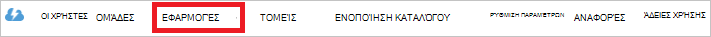

<properties
   pageTitle="Ο έλεγχος ταυτότητας με χώρου αποθήκευσης λίμνης δεδομένων με χρήση της υπηρεσίας καταλόγου Active Directory | Microsoft Azure"
   description="Μάθετε πώς μπορείτε να τον έλεγχο ταυτότητας με το χώρο αποθήκευσης λίμνης δεδομένων με χρήση της υπηρεσίας καταλόγου Active Directory"
   services="data-lake-store"
   documentationCenter=""
   authors="nitinme"
   manager="jhubbard"
   editor="cgronlun"/>

<tags
   ms.service="data-lake-store"
   ms.devlang="na"
   ms.topic="article"
   ms.tgt_pltfrm="na"
   ms.workload="big-data"
   ms.date="10/17/2016"
   ms.author="nitinme"/>

# Υπηρεσία-υπηρεσίας τον έλεγχο ταυτότητας με το χώρο αποθήκευσης λίμνης δεδομένων με χρήση Azure Active Directory

> [AZURE.SELECTOR]
- [Υπηρεσία εξυπηρέτησης ελέγχου ταυτότητας](data-lake-store-authenticate-using-active-directory.md)
- [Έλεγχος ταυτότητας τελικού χρήστη](data-lake-store-end-user-authenticate-using-active-directory.md)

Χώρος αποθήκευσης λίμνης δεδομένων Azure χρησιμοποιεί Azure Active Directory για τον έλεγχο ταυτότητας. Πριν από μια εφαρμογή που λειτουργεί με το χώρο αποθήκευσης λίμνης δεδομένων Azure ή ανάλυσης λίμνης δεδομένων Azure σύνταξης, πρέπει πρώτα να αποφασίσετε πώς θα θέλατε να ελέγχουν την ταυτότητα την εφαρμογή σας με το Azure Active Directory (Azure AD). Δύο κύριες διαθέσιμες επιλογές είναι:

* Έλεγχος ταυτότητας του τελικού χρήστη, και 
* Έλεγχος ταυτότητας υπηρεσίας εξυπηρέτησης. 

Και οι δύο αυτές τις επιλογές έχει ως αποτέλεσμα την εφαρμογή που που παρέχεται με ένα διακριτικό διακριτικό 2.0, το οποίο λαμβάνει που έχουν επισυναφθεί σε κάθε αίτηση που υποβάλλεται χώρου αποθήκευσης λίμνης δεδομένων Azure ή Azure δεδομένων λίμνης ανάλυσης.

Σε αυτό το άρθρο συνομιλίες σχετικά με τον τρόπο δημιουργία μιας εφαρμογής web Azure AD για έλεγχο ταυτότητας υπηρεσίας εξυπηρέτησης. Για οδηγίες σχετικά με τη ρύθμιση παραμέτρων εφαρμογής Azure AD για έλεγχο ταυτότητας του τελικού χρήστη, δείτε [τελικού χρήστη τον έλεγχο ταυτότητας με το χώρο αποθήκευσης δεδομένων λίμνης χρήση Azure Active Directory](data-lake-store-end-user-authenticate-using-active-directory.md).

## Προαπαιτούμενα στοιχεία

* Μια συνδρομή του Azure. Ανατρέξτε στο θέμα [λήψη Azure δωρεάν δοκιμαστικής έκδοσης](https://azure.microsoft.com/pricing/free-trial/).
* Το αναγνωριστικό συνδρομής. Μπορείτε να την ανακτήσετε από την πύλη του Azure. Για παράδειγμα, είναι διαθέσιμη από το χώρο αποθήκευσης δεδομένων λίμνης blade λογαριασμού.

    

* Το όνομα τομέα σας Azure AD. Μπορείτε να την ανακτήσετε τοποθετώντας το δείκτη του ποντικιού στην επάνω δεξιά γωνία της πύλης Azure. Από το στιγμιότυπο οθόνης παρακάτω, το όνομα τομέα είναι **contoso.microsoft.com**και το GUID μέσα σε αγκύλες είναι το αναγνωριστικό του μισθωτή. 

    

## Υπηρεσία εξυπηρέτησης ελέγχου ταυτότητας

Αυτή είναι η συνιστώμενη προσέγγιση, εάν θέλετε η εφαρμογή σας για τον έλεγχο ταυτότητας αυτόματα με το Azure AD, χωρίς να χρειάζεται μια τελικού χρήστη για την παροχή τα διαπιστευτήριά τους. Η εφαρμογή σας να μπορούν να τον έλεγχο ταυτότητας του εαυτού για κατά τη διάρκεια τα διαπιστευτήρια είναι έγκυρες, που μπορεί να προσαρμοστεί για να με τη σειρά των ετών.

### Τι πρέπει να χρησιμοποιήσετε αυτήν την προσέγγιση;

* Azure AD όνομα τομέα. Αυτό είναι ήδη στη λίστα την προϋπόθεση αυτού του άρθρου.

* Azure AD **εφαρμογής web**.

* Αναγνωριστικό υπολογιστή-πελάτη για την εφαρμογή web Azure AD.

* Μυστικό προγράμματος-πελάτη για την εφαρμογή web Azure AD.

* Διακριτικού τελικό σημείο για την εφαρμογή web Azure AD.

* Ενεργοποίηση της πρόσβασης για την εφαρμογή web Azure AD σε το το αρχείο/φάκελος χώρου αποθήκευσης λίμνης δεδομένων ή του λογαριασμού ανάλυση λίμνης δεδομένων που θέλετε να εργαστείτε.

Για οδηγίες σχετικά με τον τρόπο για να δημιουργήσετε μια εφαρμογή web Azure AD και να ρυθμίσετε τις παραμέτρους για τις απαιτήσεις που αναφέρονται παραπάνω, ανατρέξτε στην ενότητα [Δημιουργία μιας εφαρμογής υπηρεσίας καταλόγου Active Directory](#create-an-active-directory-application) παρακάτω.

>[AZURE.NOTE] Από προεπιλογή, η εφαρμογή Azure AD έχει ρυθμιστεί για να χρησιμοποιήσετε το μυστικό προγράμματος-πελάτη, το οποίο μπορείτε να ανακτήσετε από την εφαρμογή Azure AD. Ωστόσο, εάν θέλετε η εφαρμογή Azure AD για να χρησιμοποιήσετε ένα πιστοποιητικό αντί για αυτό, πρέπει να δημιουργείτε την εφαρμογή web Azure AD χρησιμοποιώντας το Azure PowerShell, όπως περιγράφεται στην [Δημιουργία κεφαλαίου με πιστοποιητικό υπηρεσίας](../resource-group-authenticate-service-principal.md#create-service-principal-with-certificate).

## Δημιουργία μιας εφαρμογής υπηρεσίας καταλόγου Active Directory

Σε αυτήν την ενότητα θα σας μάθετε σχετικά με τον τρόπο δημιουργίας και ρύθμισης παραμέτρων μιας εφαρμογής web Azure AD για έλεγχο ταυτότητας υπηρεσίας εξυπηρέτησης με το χώρο αποθήκευσης λίμνης δεδομένων Azure χρησιμοποιώντας Azure Active Directory. 

### Βήμα 1: Δημιουργία μιας εφαρμογής υπηρεσίας καταλόγου Azure Active Directory

>[AZURE.NOTE] Τα παρακάτω βήματα χρησιμοποιούν την πύλη Azure. Μπορείτε επίσης να δημιουργήσετε μια εφαρμογή του Azure AD με τη χρήση [Του PowerShell Azure](../resource-group-authenticate-service-principal.md) ή [Azure CLI](../resource-group-authenticate-service-principal-cli.md).

1. Συνδεθείτε στο λογαριασμό σας στο Azure μέσω της [κλασικής πύλη](https://manage.windowsazure.com/).

2. Επιλέξτε την **Υπηρεσία καταλόγου Active Directory** από το αριστερό παράθυρο.

     
     
3. Επιλέξτε την υπηρεσία καταλόγου Active Directory που θέλετε να χρησιμοποιήσετε για τη δημιουργία της νέας εφαρμογής. Εάν έχετε περισσότερες από μία υπηρεσίας καταλόγου Active Directory, συνήθως θέλετε να δημιουργήσετε την εφαρμογή στον κατάλογο όπου βρίσκεται η συνδρομή σας. Μπορείτε μόνο να εκχωρήσετε πρόσβαση σε πόρο στη συνδρομή σας για τις εφαρμογές στο ίδιο κατάλογο με τη συνδρομή σας.  

     
    
    
3. Για να προβάλετε τις εφαρμογές στον κατάλογό σας, κάντε κλικ στην επιλογή **εφαρμογές**.

     

4. Εάν δεν έχετε δημιουργήσει μια εφαρμογή του σε αυτόν τον κατάλογο πριν θα πρέπει να δείτε κάτι παρόμοιο στην παρακάτω εικόνα. Κάντε κλικ στην **ΠΡΟΣΘΉΚΗ ΜΙΑΣ ΕΦΑΡΜΟΓΉΣ**

     

     Εναλλακτικά, κάντε κλικ στην επιλογή **Προσθήκη** στο κάτω τμήμα του παραθύρου.

     

6. Δώστε ένα όνομα για την εφαρμογή και επιλέξτε τον τύπο της εφαρμογής που θέλετε να δημιουργήσετε. Για αυτό το πρόγραμμα εκμάθησης, δημιουργήστε μια **ΕΦΑΡΜΟΓΉ WEB ή/και το API WEB** και κάντε κλικ στο κουμπί Επόμενο.

     

7. Συμπληρώστε τις ιδιότητες για την εφαρμογή σας. Για **Διεύθυνση URL ΕΙΣΌΔΟΥ Ενεργο**, δώστε το URI σε μια τοποθεσία web που περιγράφει την εφαρμογή σας. Η ύπαρξη της τοποθεσίας web δεν είναι επικύρωση. Για **URI Αναγνωριστικό Εφαρμογής**, δώστε το URI που προσδιορίζει την εφαρμογή σας.

     

    Κάντε κλικ στο σημάδι ελέγχου για να ολοκληρωθεί ο οδηγός και να δημιουργήσετε την εφαρμογή.

### Βήμα 2: Λήψη αναγνωριστικό υπολογιστή-πελάτη, μυστικό προγράμματος-πελάτη και διακριτικού τελικού σημείου

Κατά τη σύνδεση μέσω προγραμματισμού στο, χρειάζεστε το αναγνωριστικό για την εφαρμογή σας. Εάν η εφαρμογή θα εκτελείται στο δικό του διαπιστευτήρια, θα πρέπει επίσης ένα κλειδί ελέγχου ταυτότητας.

1. Κάντε κλικ στην καρτέλα **Ρύθμιση παραμέτρων** για να ρυθμίσετε τις παραμέτρους της εφαρμογής σας κωδικό πρόσβασης.

     

2. Αντιγράψτε το **Αναγνωριστικό υπολογιστή-ΠΕΛΆΤΗ**.
  
     

3. Εάν η εφαρμογή θα εκτελείται με το δικό της διαπιστευτήρια, κάντε κύλιση προς τα κάτω στην ενότητα **πλήκτρα** και επιλέξτε το χρονικό διάστημα που θέλετε να ισχύει τον κωδικό πρόσβασής σας.

     

4. Επιλέξτε **Αποθήκευση** για να δημιουργήσετε τον αριθμό-κλειδί.

    

    Εμφανίζεται το κλειδί που αποθηκεύσατε και μπορείτε να το αντιγράψετε. Δεν θα μπορείτε να την ανακτήσετε αργότερα τον αριθμό-κλειδί, ώστε να πρέπει να την αντιγράψετε τώρα.

    

5. Ανακτήστε το διακριτικό τελικό σημείο, επιλέγοντας **τα τελικά σημεία προβολής** στο κάτω μέρος της οθόνης και την ανάκτηση της τιμής για πεδίο **Διακριτικού τελικού σημείου διακριτικό 2.0** , όπως φαίνεται παρακάτω.  

    

### Βήμα 3: Αντιστοίχιση της εφαρμογής Azure AD στο αρχείο λογαριασμού χώρου αποθήκευσης λίμνης δεδομένων Azure ή το φάκελο (μόνο για τον έλεγχο ταυτότητας υπηρεσίας εξυπηρέτησης)

1. Πραγματοποιήστε είσοδο νέα [Πύλη Azure](https://portal.azure.com) και ανοίξτε το λογαριασμό χώρου αποθήκευσης λίμνης Azure δεδομένων που θέλετε να συσχετίσετε με την εφαρμογή του Azure Active Directory που δημιουργήσατε νωρίτερα.

1. Στο blade το λογαριασμό χώρου αποθήκευσης λίμνης δεδομένων, κάντε κλικ στην επιλογή **Εξερεύνηση δεδομένων**.

    ![Δημιουργία καταλόγων του χώρου αποθήκευσης δεδομένων λίμνης λογαριασμού] (./media/data-lake-store-authenticate-using-active-directory/adl.start.data.explorer.png "Δημιουργία σε καταλόγους στο λογαριασμό λίμνης δεδομένων")

2. Στο blade η **Εξερεύνηση δεδομένων** , κάντε κλικ στο αρχείο ή φάκελο για τον οποίο θέλετε να δώσετε πρόσβαση στην εφαρμογή Azure AD και, στη συνέχεια, κάντε κλικ στην επιλογή **Access**. Για να ρυθμίσετε τις παραμέτρους πρόσβασης σε ένα αρχείο, πρέπει να κάνετε κλικ **πρόσβαση** από την **Προεπισκόπηση αρχείου** blade.

    ![Ορισμός ACL στο σύστημα αρχείων δεδομένων λίμνης] (./media/data-lake-store-authenticate-using-active-directory/adl.acl.1.png "Ορισμός ACL στο σύστημα αρχείων δεδομένων λίμνης")

3. Η **Access** blade παραθέτει τις τυπική πρόσβαση και προσαρμοσμένες πρόσβασης που έχουν ήδη ανατεθεί στον ριζικό κατάλογο. Κάντε κλικ στο εικονίδιο **Προσθήκη** για να προσθέσετε ACL προσαρμοσμένο επίπεδο.

    ![Λίστα τυπικών και προσαρμοσμένων πρόσβασης] (./media/data-lake-store-authenticate-using-active-directory/adl.acl.2.png "Λίστα τυπικών και προσαρμοσμένων πρόσβασης")

4. Κάντε κλικ στο εικονίδιο **Προσθήκη** για να ανοίξετε το blade **Προσθήκη προσαρμοσμένης πρόσβασης** . Σε αυτό το blade, κάντε κλικ στην επιλογή **Επιλογή χρήστη ή ομάδας**και, στη συνέχεια, στην **Επιλογή χρήστη ή ομάδας** blade, αναζητήστε την ομάδα ασφαλείας που δημιουργήσατε νωρίτερα σε Azure Active Directory. Εάν έχετε πολλές ομάδες για να κάνετε αναζήτηση από, χρησιμοποιήστε το πλαίσιο κειμένου στο επάνω μέρος για να φιλτράρετε με βάση το όνομα της ομάδας. Κάντε κλικ στην ομάδα που θέλετε να προσθέσετε και, στη συνέχεια, κάντε κλικ στην **επιλογή**.

    ![Προσθήκη ομάδας] (./media/data-lake-store-authenticate-using-active-directory/adl.acl.3.png "Προσθήκη ομάδας")

5. Κάντε κλικ στην επιλογή **Επιλογή δικαιώματα**, επιλέξτε τα δικαιώματα και εάν θέλετε να εκχωρήσετε δικαιώματα ως προεπιλογή ACL, πρόσβαση ACL ή και τα δύο. Κάντε κλικ στο **κουμπί OK**.

    ![Εκχώρηση δικαιωμάτων σε ομάδα] (./media/data-lake-store-authenticate-using-active-directory/adl.acl.4.png "Εκχώρηση δικαιωμάτων σε ομάδα")

    Για περισσότερες πληροφορίες σχετικά με τα δικαιώματα στο χώρο αποθήκευσης λίμνης δεδομένων και το προεπιλεγμένο/πρόσβαση ACL, ανατρέξτε στο θέμα [Έλεγχος πρόσβασης στο χώρο αποθήκευσης λίμνης δεδομένων](data-lake-store-access-control.md).

6. Στο blade η **Προσθήκη προσαρμοσμένης Access** , κάντε κλικ στο **OK**. Η ομάδα που προστέθηκε πρόσφατα, με τα συσχετισμένα δικαιώματα, τώρα θα παρατεθούν σε blade την **Access** .

    ![Εκχώρηση δικαιωμάτων σε ομάδα] (./media/data-lake-store-authenticate-using-active-directory/adl.acl.5.png "Εκχώρηση δικαιωμάτων σε ομάδα") 

## Επόμενα βήματα

Σε αυτό το άρθρο μπορείτε να δημιουργήσει μια εφαρμογή web Azure AD και συγκεντρώσατε τις πληροφορίες που χρειάζεστε στις εφαρμογές σας προγράμματος-πελάτη που συντάσσετε χρησιμοποιώντας .NET SDK, Java SDK, κ.λπ. Μπορείτε τώρα να προχωρήσετε στα ακόλουθα άρθρα που μιλήσουμε για τον τρόπο χρήσης της εφαρμογής web Azure AD για πρώτα τον έλεγχο ταυτότητας με το χώρο αποθήκευσης λίμνης δεδομένων και, στη συνέχεια, να εκτελέσετε άλλες λειτουργίες στο χώρο αποθήκευσης.

- [Γρήγορα αποτελέσματα με χρήση του .NET SDK χώρο αποθήκευσης λίμνης δεδομένων Azure](data-lake-store-get-started-net-sdk.md)
- [Γρήγορα αποτελέσματα με το Azure αποθήκευσης λίμνης δεδομένων χρησιμοποιώντας Java SDK](data-lake-store-get-started-java-sdk.md)
