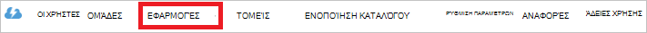

<properties
   pageTitle="Ο έλεγχος ταυτότητας με χώρου αποθήκευσης λίμνης δεδομένων με χρήση της υπηρεσίας καταλόγου Active Directory | Microsoft Azure"
   description="Μάθετε πώς μπορείτε να τον έλεγχο ταυτότητας με το χώρο αποθήκευσης λίμνης δεδομένων με χρήση της υπηρεσίας καταλόγου Active Directory"
   services="data-lake-store"
   documentationCenter=""
   authors="nitinme"
   manager="jhubbard"
   editor="cgronlun"/>

<tags
   ms.service="data-lake-store"
   ms.devlang="na"
   ms.topic="article"
   ms.tgt_pltfrm="na"
   ms.workload="big-data"
   ms.date="10/17/2016"
   ms.author="nitinme"/>

# Έλεγχος ταυτότητας του τελικού χρήστη με το χώρο αποθήκευσης λίμνης δεδομένων με χρήση Azure Active Directory

> [AZURE.SELECTOR]
- [Υπηρεσία εξυπηρέτησης ελέγχου ταυτότητας](data-lake-store-authenticate-using-active-directory.md)
- [Έλεγχος ταυτότητας τελικού χρήστη](data-lake-store-end-user-authenticate-using-active-directory.md)

Χώρος αποθήκευσης λίμνης δεδομένων Azure χρησιμοποιεί Azure Active Directory για τον έλεγχο ταυτότητας. Πριν από μια εφαρμογή που λειτουργεί με το χώρο αποθήκευσης λίμνης δεδομένων Azure ή ανάλυσης λίμνης δεδομένων Azure σύνταξης, πρέπει πρώτα να αποφασίσετε πώς θα θέλατε να ελέγχουν την ταυτότητα την εφαρμογή σας με το Azure Active Directory (Azure AD). Δύο κύριες διαθέσιμες επιλογές είναι:

* Έλεγχος ταυτότητας του τελικού χρήστη, και 
* Έλεγχος ταυτότητας υπηρεσίας εξυπηρέτησης. 

Και οι δύο αυτές τις επιλογές έχει ως αποτέλεσμα την εφαρμογή που που παρέχεται με ένα διακριτικό διακριτικό 2.0, το οποίο λαμβάνει που έχουν επισυναφθεί σε κάθε αίτηση που υποβάλλεται χώρου αποθήκευσης λίμνης δεδομένων Azure ή Azure δεδομένων λίμνης ανάλυσης.

Σε αυτό το άρθρο συνομιλίες σχετικά με τον τρόπο δημιουργία μιας εφαρμογής web Azure AD για έλεγχο ταυτότητας του τελικού χρήστη. Για οδηγίες σχετικά με τη ρύθμιση παραμέτρων εφαρμογής Azure AD για έλεγχο ταυτότητας υπηρεσίας εξυπηρέτησης ανατρέξτε στην ενότητα [υπηρεσία εξυπηρέτησης τον έλεγχο ταυτότητας με το χώρο αποθήκευσης δεδομένων λίμνης χρήση Azure Active Directory](data-lake-store-authenticate-using-active-directory.md).

## Προαπαιτούμενα στοιχεία

* Μια συνδρομή του Azure. Ανατρέξτε στο θέμα [λήψη Azure δωρεάν δοκιμαστικής έκδοσης](https://azure.microsoft.com/pricing/free-trial/).
* Το αναγνωριστικό συνδρομής. Μπορείτε να την ανακτήσετε από την πύλη του Azure. Για παράδειγμα, είναι διαθέσιμη από το χώρο αποθήκευσης δεδομένων λίμνης blade λογαριασμού.

    

* Το όνομα τομέα σας Azure AD. Μπορείτε να την ανακτήσετε τοποθετώντας το δείκτη του ποντικιού στην επάνω δεξιά γωνία της πύλης Azure. Από το στιγμιότυπο οθόνης παρακάτω, το όνομα τομέα είναι **contoso.microsoft.com**και το GUID μέσα σε αγκύλες είναι το αναγνωριστικό του μισθωτή. 

    

## Έλεγχος ταυτότητας τελικού χρήστη

Αυτή είναι η συνιστώμενη προσέγγιση, αν θέλετε μια τελικού χρήστη για να συνδεθείτε εφαρμογή σας μέσω Azure AD. Η εφαρμογή σας θα μπορούν να έχουν πρόσβαση Azure πόρους με το ίδιο επίπεδο πρόσβασης με τον τελικό χρήστη που έχετε συνδεθεί στο. Του τελικού χρήστη θα πρέπει να καταχωρήσετε τα διαπιστευτήριά τους περιοδικά στη σειρά για την εφαρμογή σας για να διατηρήσετε την πρόσβαση.

Χρειάζεται ο τελικός χρήστης, συνδεθείτε στο το αποτέλεσμα είναι ότι η εφαρμογή σας παρέχεται ένα διακριτικό πρόσβασης και ενός διακριτικού ανανέωσης. Το διακριτικό πρόσβασης λαμβάνει που έχουν επισυναφθεί σε κάθε αίτηση που υποβάλλεται χώρου αποθήκευσης λίμνης δεδομένων ή δεδομένων λίμνης ανάλυση και είναι έγκυρος για μία ώρα από προεπιλογή. Το διακριτικό ανανέωσης μπορεί να χρησιμοποιηθεί για να αποκτήσετε έναν νέο κωδικό πρόσβασης και είναι έγκυροι για έως και δύο εβδομάδες από προεπιλογή, εάν χρησιμοποιείται συχνά. Μπορείτε να χρησιμοποιήσετε δύο διαφορετικές μεθόδους για σύνδεση τελικού χρήστη.

### Χρησιμοποιώντας το αναδυόμενο παράθυρο διακριτικό 2.0

Η εφαρμογή σας μπορεί να ενεργοποιήσει ένα αναδυόμενο παράθυρο εξουσιοδότησης διακριτικό 2.0, στο οποίο ο τελικός χρήστης να εισαγάγετε τα διαπιστευτήριά τους. Σε αυτό το αναδυόμενο παράθυρο λειτουργεί επίσης με τη διαδικασία ελέγχου ταυτότητας Azure AD δύο παραγόντων (2FA), εάν είναι απαραίτητο. 

>[AZURE.NOTE] Αυτή η μέθοδος δεν υποστηρίζεται ακόμη στο το Azure βιβλιοθήκη ελέγχου ταυτότητας AD (ADAL) για Python ή Java.

### Απευθείας που περνά μέσα σε διαπιστευτήρια χρήστη

Εφαρμογή σας μπορούν να παρέχουν απευθείας διαπιστευτήρια χρήστη για να Azure AD. Η μέθοδος αυτή λειτουργεί μόνο με τους λογαριασμούς χρήστη Αναγνωριστικό οργανισμού. δεν είναι συμβατή με το προσωπικό / τους λογαριασμούς χρηστών "live ID", συμπεριλαμβανομένων και αυτών που τελειώνει σε @outlook.com ή @live.com. Επιπλέον, η μέθοδος αυτή δεν είναι συμβατή με τους λογαριασμούς χρηστών που απαιτούν έλεγχο ταυτότητας Azure AD δύο παραγόντων (2FA).

### Τι πρέπει να χρησιμοποιήσετε αυτήν την προσέγγιση;

* Azure AD όνομα τομέα. Αυτό είναι ήδη στη λίστα την προϋπόθεση αυτού του άρθρου.

* Azure AD **εφαρμογής web**

* Αναγνωριστικό υπολογιστή-πελάτη για την εφαρμογή web Azure AD

* Απάντηση URI για την εφαρμογή web Azure AD

* Ορισμός με ανάθεση δικαιωμάτων

Για οδηγίες σχετικά με τον τρόπο για να δημιουργήσετε μια εφαρμογή web Azure AD και να ρυθμίσετε τις παραμέτρους για τις απαιτήσεις που αναφέρονται παραπάνω, ανατρέξτε στην ενότητα [Δημιουργία μιας εφαρμογής υπηρεσίας καταλόγου Active Directory](#create-an-active-directory-application) παρακάτω. 

## Δημιουργία μιας εφαρμογής υπηρεσίας καταλόγου Active Directory

Σε αυτήν την ενότητα θα σας πληροφορίες σχετικά με τον τρόπο δημιουργίας και ρύθμιση παραμέτρων μιας εφαρμογής web Azure AD για έλεγχο ταυτότητας του τελικού χρήστη με το χώρο αποθήκευσης λίμνης δεδομένων Azure χρησιμοποιώντας Azure Active Directory.

### Βήμα 1: Δημιουργία μιας εφαρμογής υπηρεσίας καταλόγου Azure Active Directory

>[AZURE.NOTE] Τα παρακάτω βήματα χρησιμοποιούν την πύλη Azure. Μπορείτε επίσης να δημιουργήσετε μια εφαρμογή του Azure AD με τη χρήση [Του PowerShell Azure](../resource-group-authenticate-service-principal.md) ή [Azure CLI](../resource-group-authenticate-service-principal-cli.md).

1. Συνδεθείτε στο λογαριασμό σας στο Azure μέσω της [κλασικής πύλη](https://manage.windowsazure.com/).

2. Επιλέξτε την **Υπηρεσία καταλόγου Active Directory** από το αριστερό παράθυρο.

     
     
3. Επιλέξτε την υπηρεσία καταλόγου Active Directory που θέλετε να χρησιμοποιήσετε για τη δημιουργία της νέας εφαρμογής. Εάν έχετε περισσότερες από μία υπηρεσίας καταλόγου Active Directory, συνήθως θέλετε να δημιουργήσετε την εφαρμογή στον κατάλογο όπου βρίσκεται η συνδρομή σας. Μπορείτε μόνο να εκχωρήσετε πρόσβαση σε πόρο στη συνδρομή σας για τις εφαρμογές στο ίδιο κατάλογο με τη συνδρομή σας.  

     
    
    
3. Για να προβάλετε τις εφαρμογές στον κατάλογό σας, κάντε κλικ στην επιλογή **εφαρμογές**.

     

4. Εάν δεν έχετε δημιουργήσει μια εφαρμογή του σε αυτόν τον κατάλογο πριν θα πρέπει να δείτε κάτι παρόμοιο στην παρακάτω εικόνα. Κάντε κλικ στην **ΠΡΟΣΘΉΚΗ ΜΙΑΣ ΕΦΑΡΜΟΓΉΣ**

     

     Εναλλακτικά, κάντε κλικ στην επιλογή **Προσθήκη** στο κάτω τμήμα του παραθύρου.

     

6. Δώστε ένα όνομα για την εφαρμογή και επιλέξτε τον τύπο της εφαρμογής που θέλετε να δημιουργήσετε. Για αυτό το πρόγραμμα εκμάθησης, δημιουργήστε μια **ΕΦΑΡΜΟΓΉ WEB ή/και το API WEB** και κάντε κλικ στο κουμπί Επόμενο.

     

7. Συμπληρώστε τις ιδιότητες για την εφαρμογή σας. Για **Διεύθυνση URL ΕΙΣΌΔΟΥ Ενεργο**, δώστε το URI σε μια τοποθεσία web που περιγράφει την εφαρμογή σας. Η ύπαρξη της τοποθεσίας web δεν είναι επικύρωση. Για **URI Αναγνωριστικό Εφαρμογής**, δώστε το URI που προσδιορίζει την εφαρμογή σας.

     

    Κάντε κλικ στο σημάδι ελέγχου για να ολοκληρωθεί ο οδηγός και να δημιουργήσετε την εφαρμογή.

### Βήμα 2: Λήψη αναγνωριστικό υπολογιστή-πελάτη, απάντηση URI και να ορίσετε δικαιώματα πληρεξούσιου

1. Κάντε κλικ στην καρτέλα **Ρύθμιση παραμέτρων** για να ρυθμίσετε τις παραμέτρους της εφαρμογής σας κωδικό πρόσβασης.

     

2. Αντιγράψτε το **Αναγνωριστικό υπολογιστή-ΠΕΛΆΤΗ**.
  
     

3. Στην περιοχή **καθολικής σύνδεσης** , αντιγράψτε το **URI απάντηση**.

    

4. Στην περιοχή **δικαιώματα σε άλλες εφαρμογές**, κάντε κλικ στην επιλογή **Προσθήκη εφαρμογής**

    

5. Στον οδηγό **δικαιωμάτων σε άλλες εφαρμογές** , επιλέξτε **Azure λίμνης δεδομένων** και **των Windows** **Azure το API διαχείρισης της υπηρεσίας**και κάντε κλικ στην επιλογή το σημάδι ελέγχου.

6. Από προεπιλογή, τα **Δικαιώματα με ανάθεση** για τις υπηρεσίες που προστέθηκε πρόσφατα έχει οριστεί στην τιμή μηδέν. Κάντε κλικ στην επιλογή **Δικαιώματα πληρεξούσιοι** αναπτυσσόμενη για Azure λίμνης δεδομένων και υπηρεσία διαχείρισης των Windows Azure και επιλέξτε τα πλαίσια ελέγχου διαθέσιμη για να ορίσετε τις τιμές σε 1. Το αποτέλεσμα θα πρέπει να είναι κάπως έτσι.

     

7. Κάντε κλικ στην επιλογή **Αποθήκευση**.

## Επόμενα βήματα

Σε αυτό το άρθρο μπορείτε να δημιουργήσει μια εφαρμογή web Azure AD και συγκεντρώσατε τις πληροφορίες που χρειάζεστε στις εφαρμογές σας προγράμματος-πελάτη που συντάσσετε χρησιμοποιώντας .NET SDK, Java SDK, κ.λπ. Μπορείτε τώρα να προχωρήσετε στα ακόλουθα άρθρα που μιλήσουμε για τον τρόπο χρήσης της εφαρμογής web Azure AD για πρώτα τον έλεγχο ταυτότητας με το χώρο αποθήκευσης λίμνης δεδομένων και, στη συνέχεια, να εκτελέσετε άλλες λειτουργίες στο χώρο αποθήκευσης.

- [Γρήγορα αποτελέσματα με χρήση του .NET SDK χώρο αποθήκευσης λίμνης δεδομένων Azure](data-lake-store-get-started-net-sdk.md)
- [Γρήγορα αποτελέσματα με το Azure αποθήκευσης λίμνης δεδομένων χρησιμοποιώντας Java SDK](data-lake-store-get-started-java-sdk.md)
