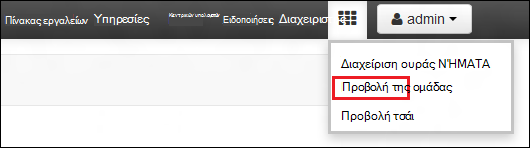
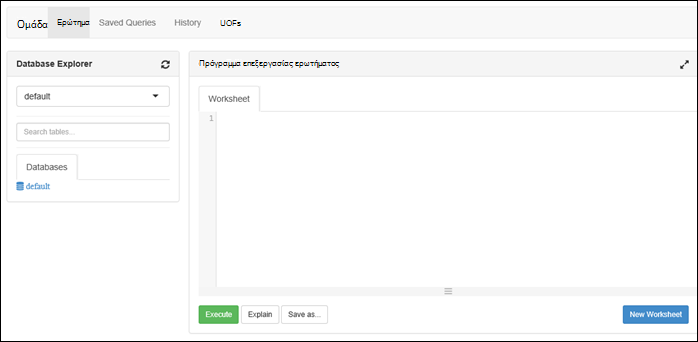

<properties
   pageTitle="Δημιουργία συμπλεγμάτων HDInsight με με την πύλη χώρου αποθήκευσης λίμνης δεδομένων Azure | Azure"
   description="Χρήση του Azure πύλη για τη δημιουργία και χρήση συμπλεγμάτων HDInsight με το χώρο αποθήκευσης λίμνης δεδομένων Azure"
   services="data-lake-store,hdinsight" 
   documentationCenter=""
   authors="nitinme"
   manager="jhubbard"
   editor="cgronlun"/>

<tags
   ms.service="data-lake-store"
   ms.devlang="na"
   ms.topic="article"
   ms.tgt_pltfrm="na"
   ms.workload="big-data"
   ms.date="10/21/2016"
   ms.author="nitinme"/>

# Δημιουργήστε ένα σύμπλεγμα HDInsight με το χώρο αποθήκευσης λίμνης δεδομένων με πύλη Azure

> [AZURE.SELECTOR]
- [Με πύλη](data-lake-store-hdinsight-hadoop-use-portal.md)
- [Χρήση του PowerShell](data-lake-store-hdinsight-hadoop-use-powershell.md)
- [Χρήση της διαχείρισης πόρων](data-lake-store-hdinsight-hadoop-use-resource-manager-template.md)

Μάθετε πώς μπορείτε να χρησιμοποιήσετε Azure πύλη για να δημιουργήσετε ένα σύμπλεγμα HDInsight (Hadoop, HBase, τους ή καταιγίδας) με την πρόσβαση στο χώρο αποθήκευσης λίμνης Azure δεδομένων. Ορισμένα σημαντικά θέματα για αυτήν την έκδοση:

* **Για τους συμπλεγμάτων (Linux) και συμπλεγμάτων Hadoop (Windows και Linux)**, ο χώρος αποθήκευσης δεδομένων λίμνης μπορεί να χρησιμοποιηθεί μόνο ως ένα λογαριασμό επιπλέον χώρο αποθήκευσης. Τον προεπιλεγμένο λογαριασμό χώρου αποθήκευσης για το εν λόγω συμπλεγμάτων θα εξακολουθούν να Azure χώρο αποθήκευσης αντικειμένων blob (WASB).

* **Για καταιγίδας συμπλεγμάτων (Windows και Linux)**, ο χώρος αποθήκευσης δεδομένων λίμνης μπορεί να χρησιμοποιηθεί για την εγγραφή δεδομένων από μια τοπολογία καταιγίδας. Χώρος αποθήκευσης δεδομένων λίμνης επίσης μπορούν να χρησιμοποιηθούν για την αποθήκευση δεδομένων αναφοράς που, στη συνέχεια, μπορείτε να διαβάσετε από μια τοπολογία καταιγίδας. Για περισσότερες πληροφορίες, ανατρέξτε στο θέμα [Χρήση του χώρου αποθήκευσης λίμνης δεδομένων σε μια τοπολογία καταιγίδας](#use-data-lake-store-in-a-storm-topology).

* **Για HBase συμπλεγμάτων (Windows και Linux)**, ο χώρος αποθήκευσης δεδομένων λίμνης μπορεί να χρησιμοποιηθεί ως ένα προεπιλεγμένο αποθήκευσης, καθώς και επιπλέον χώρο αποθήκευσης. Για περισσότερες πληροφορίες, ανατρέξτε στο θέμα [Χρήση του χώρου αποθήκευσης λίμνης δεδομένων με HBase συμπλεγμάτων](#use-data-lake-store-with-hbase-clusters).

> [AZURE.NOTE] Ορισμένα σημαντικά σημεία σε σημείωση. 
> 
> * Επιλογή για να δημιουργήσετε συμπλεγμάτων HDInsight με την πρόσβαση στο χώρο αποθήκευσης λίμνης δεδομένων είναι διαθέσιμη μόνο για τις εκδόσεις HDInsight 3.2 και 3.4 (για Hadoop, HBase και καταιγίδας συμπλεγμάτων σε Windows, καθώς και Linux). Για τους συμπλεγμάτων σε Linux, αυτή η επιλογή είναι διαθέσιμη μόνο σε συμπλεγμάτων HDInsight 3.4.
>
> * Όπως προαναφέρθηκε, χώρου αποθήκευσης λίμνης δεδομένων είναι διαθέσιμα ως προεπιλεγμένο αποθήκευσης για ορισμένους τύπους συμπλέγματος (HBase) και επιπλέον χώρου αποθήκευσης για άλλους τύπους συμπλέγματος (Hadoop, τους, καταιγίδας). Χρήση χώρου αποθήκευσης δεδομένων λίμνης ως ένα λογαριασμό επιπλέον χώρο αποθήκευσης δεν επηρεάζει τις επιδόσεις ή τη δυνατότητα ανάγνωσης/εγγραφής στο χώρο αποθήκευσης από το σύμπλεγμα. Σε ένα σενάριο όπου χρησιμοποιείται ο χώρος αποθήκευσης δεδομένων λίμνης ως επιπλέον χώρο αποθήκευσης, τα αρχεία που σχετίζονται με το σύμπλεγμα (όπως αρχεία καταγραφής, κ.λπ.) εγγράφεται το προεπιλεγμένο αποθήκευσης (αντικείμενα BLOB Azure), ενώ τα δεδομένα που θέλετε να επεξεργαστείτε μπορούν να αποθηκευτούν σε ένα λογαριασμό του χώρου αποθήκευσης δεδομένων λίμνης.

## Προαπαιτούμενα στοιχεία

Προτού ξεκινήσετε αυτό το πρόγραμμα εκμάθησης, πρέπει να έχετε τα εξής:

- **Azure μια συνδρομή**. Ανατρέξτε στο θέμα [λήψη Azure δωρεάν δοκιμαστικής έκδοσης](https://azure.microsoft.com/pricing/free-trial/).

- **Λογαριασμός azure δεδομένων λίμνης Store**. Ακολουθήστε τις οδηγίες στο θέμα [Γρήγορα αποτελέσματα με με την πύλη Azure χώρου αποθήκευσης λίμνης δεδομένων Azure](data-lake-store-get-started-portal.md). 

- **Αποστολή μερικά δείγματα δεδομένων στο λογαριασμό σας χώρου αποθήκευσης λίμνης Azure δεδομένων**. Αφού δημιουργήσετε το λογαριασμό, εκτελέστε τις ακόλουθες εργασίες για να αποστείλετε μερικά δείγματα δεδομένων. Θα χρειαστείτε αυτά τα δεδομένα αργότερα στην εκμάθηση για να εκτελέσετε εργασίες από ένα σύμπλεγμα HDInsight που έχουν πρόσβαση σε δεδομένα στο χώρο αποθήκευσης λίμνης δεδομένων.

    * [Δημιουργία φακέλου στο χώρο αποθήκευσης λίμνης των δεδομένων](data-lake-store-get-started-portal.md#createfolder).
    * [Αποστολή αρχείου στο χώρο αποθήκευσης λίμνης των δεδομένων](data-lake-store-get-started-portal.md#uploaddata). Εάν αναζητάτε μερικά δείγματα δεδομένων για την αποστολή, μπορείτε να λάβετε το φάκελο **Ασθενοφόρων δεδομένων** από το [Azure δεδομένων λίμνης Git αποθετήριο](https://github.com/Azure/usql/tree/master/Examples/Samples/Data/AmbulanceData).

- **Azure Active Directory υπηρεσίας κεφάλαιο**. Βήματα που περιγράφονται σε αυτό το πρόγραμμα εκμάθησης παρέχουν οδηγίες σχετικά με τον τρόπο για να δημιουργήσετε ένα κεφάλαιο υπηρεσίας στο Azure AD. Ωστόσο, πρέπει να είστε διαχειριστής Azure AD για να μπορέσετε να δημιουργήσετε ένα κεφάλαιο υπηρεσίας. Εάν είστε διαχειριστής Azure AD, μπορείτε να παραλείψετε αυτήν την προϋπόθεση και να συνεχίσετε με το πρόγραμμα εκμάθησης.
    
    **Εάν είστε δεν διαχειριστής Azure AD**, δεν θα μπορείτε να εκτελέσετε τα βήματα που απαιτούνται για να δημιουργήσετε ένα κεφάλαιο υπηρεσίας. Σε αυτήν την περίπτωση, ο διαχειριστής Azure AD πρέπει πρώτα να δημιουργήσετε αρχής υπηρεσίας πριν να δημιουργήσετε ένα σύμπλεγμα HDInsight με το χώρο αποθήκευσης λίμνης δεδομένων. Επίσης, το κεφάλαιο υπηρεσίας πρέπει να δημιουργηθούν με χρήση ενός πιστοποιητικού, όπως περιγράφεται στην υποστήριξη [δημιουργίας μιας υπηρεσίας κεφαλαίου με το πιστοποιητικό](../resource-group-authenticate-service-principal.md#create-service-principal-with-certificate).

## Να μάθει πιο γρήγορα με βίντεο;

Παρακολουθήστε τα παρακάτω βίντεο για να κατανοήσετε τον τρόπο παροχής συμπλεγμάτων HDInsight με την πρόσβαση στο χώρο αποθήκευσης λίμνης δεδομένων.

* [Δημιουργήστε ένα σύμπλεγμα HDInsight με την πρόσβαση στο χώρο αποθήκευσης δεδομένων λίμνης](https://mix.office.com/watch/l93xri2yhtp2)
* Αφού ορίσετε το σύμπλεγμα προς τα επάνω, [δεδομένων της Access στο χώρο αποθήκευσης λίμνης δεδομένων με χρήση της ομάδας και γουρούνι δέσμες ενεργειών](https://mix.office.com/watch/1n9g5w0fiqv1q)

## Δημιουργήστε ένα σύμπλεγμα HDInsight με την πρόσβαση στο χώρο αποθήκευσης λίμνης δεδομένων Azure

Σε αυτήν την ενότητα, μπορείτε να δημιουργήσετε ένα σύμπλεγμα HDInsight Hadoop που χρησιμοποιεί το χώρο αποθήκευσης λίμνης δεδομένων ως μια επιπλέον χώρο αποθήκευσης. Σε αυτήν την έκδοση, για ένα σύμπλεγμα Hadoop, χώρος αποθήκευσης δεδομένων λίμνης μπορεί να χρησιμοποιηθεί μόνο ως μια επιπλέον χώρο αποθήκευσης για το σύμπλεγμα. Το προεπιλεγμένο αποθήκευσης θα εξακολουθούν να είναι το Azure χώρο αποθήκευσης αντικειμένων blob (WASB). Επομένως, θα σας θα πρώτα να δημιουργήσετε το λογαριασμό χώρου αποθήκευσης και χώρους αποθήκευσης που απαιτούνται για το σύμπλεγμα.

1. Πραγματοποιήστε είσοδο νέα [Πύλη Azure](https://portal.azure.com).

2. Ακολουθήστε τα βήματα στο θέμα [Δημιουργία Hadoop συμπλεγμάτων στο HDInsight](../hdinsight/hdinsight-provision-clusters.md#create-using-the-preview-portal) για να ξεκινήσετε την προμήθεια ένα σύμπλεγμα HDInsight.

3. Στην blade την **Προαιρετική ρύθμιση παραμέτρων** , κάντε κλικ στην επιλογή **Προέλευσης δεδομένων**. Στο blade το **Αρχείο προέλευσης δεδομένων** , καθορίστε τις λεπτομέρειες για το λογαριασμό χώρου αποθήκευσης και κοντέινερ χώρου αποθήκευσης, καθορίστε **θέση** ως **Ανατολικής ΗΠΑ 2**και, στη συνέχεια, κάντε κλικ στην επιλογή **Σύμπλεγμα AAD ταυτότητας**.

    ![Προσθήκη υπηρεσίας κεφαλαίου σύμπλεγμα HDInsight] (./media/data-lake-store-hdinsight-hadoop-use-portal/hdi.adl.1.png "Προσθήκη υπηρεσίας κεφαλαίου σύμπλεγμα HDInsight")

4. Στην την **Ταυτότητα AAD σύμπλεγμα** blade, μπορείτε να επιλέξετε για να επιλέξετε μια υπάρχουσα υπηρεσία κεφάλαιο ή δημιουργήστε ένα νέο.

    * **Δημιουργία νέας αρχής υπηρεσίας**

        * Στο το blade **Σύμπλεγμα AAD ταυτότητα** , κάντε κλικ στην επιλογή **Δημιουργία νέου**, κάντε κλικ στην επιλογή **Υπηρεσία κεφάλαιο**και, στη συνέχεια, στο blade **Δημιουργία αρχής υπηρεσίας** , δώστε τις τιμές για να δημιουργήσετε μια νέα υπηρεσία κεφάλαιο. Ως μέρος αυτού του, ένα πιστοποιητικό και μια εφαρμογή του Azure Active Directory δημιουργείται επίσης. Κάντε κλικ στην επιλογή **Δημιουργία**.

            ![Προσθήκη υπηρεσίας κεφαλαίου σύμπλεγμα HDInsight] (./media/data-lake-store-hdinsight-hadoop-use-portal/hdi.adl.2.png "Προσθήκη υπηρεσίας κεφαλαίου σύμπλεγμα HDInsight")

        * Στην την **Ταυτότητα AAD σύμπλεγμα** blade, επιλέξτε **Διαχείριση πρόσβασης ADLS**. Το παράθυρο εμφανίζει τους λογαριασμούς χώρου αποθήκευσης λίμνης δεδομένων που σχετίζονται με τη συνδρομή. Ωστόσο, μπορείτε να ορίσετε τα δικαιώματα μόνο για το λογαριασμό που έχετε δημιουργήσει. Επιλέξτε δικαιώματα ΑΝΆΓΝΩΣΗΣ/ΕΓΓΡΑΦΉΣ/EXECUTE για το λογαριασμό που θέλετε να συσχετίσετε με το σύμπλεγμα HDInsight και, στη συνέχεια, κάντε κλικ στην επιλογή **Αποθήκευση δικαιώματα**.

            ![Προσθήκη υπηρεσίας κεφαλαίου σύμπλεγμα HDInsight] (./media/data-lake-store-hdinsight-hadoop-use-portal/hdi.adl.3.png "Προσθήκη υπηρεσίας κεφαλαίου σύμπλεγμα HDInsight")

        * Στην το blade **Σύμπλεγμα AAD ταυτότητα** , κάντε κλικ στην επιλογή **Κάντε λήψη του πιστοποιητικού** για να κάνετε λήψη του πιστοποιητικού που σχετίζεται με την υπηρεσία του κεφαλαίου που δημιουργήσατε. Αυτό είναι χρήσιμο εάν θέλετε να χρησιμοποιήσετε το ίδιο κεφάλαιο υπηρεσίας στο μέλλον, κατά τη δημιουργία επιπλέον συμπλεγμάτων HDInsight. Κάντε κλικ στην **επιλογή**.

            ![Προσθήκη υπηρεσίας κεφαλαίου σύμπλεγμα HDInsight] (./media/data-lake-store-hdinsight-hadoop-use-portal/hdi.adl.4.png "Προσθήκη υπηρεσίας κεφαλαίου σύμπλεγμα HDInsight")

    * **Επιλέξτε μια υπάρχουσα κεφάλαιο υπηρεσίας**

        * Στο το blade **Σύμπλεγμα AAD ταυτότητα** , κάντε κλικ στην επιλογή **Χρήση υπάρχουσας**, κάντε κλικ στην επιλογή **Υπηρεσία κεφάλαιο**και, στη συνέχεια, blade **επιλογή αρχής υπηρεσίας** , αναζητήστε μια υπάρχουσα υπηρεσία κεφάλαιο. Κάντε κλικ σε ένα κύριο όνομα υπηρεσίας και, στη συνέχεια, κάντε κλικ στην **επιλογή**.

            ![Προσθήκη υπηρεσίας κεφαλαίου σύμπλεγμα HDInsight] (./media/data-lake-store-hdinsight-hadoop-use-portal/hdi.adl.5.png "Προσθήκη υπηρεσίας κεφαλαίου σύμπλεγμα HDInsight")

        * Στην την **Ταυτότητα AAD σύμπλεγμα** blade, αποστείλετε το πιστοποιητικό (.pfx) που σχετίζεται με το κεφάλαιο υπηρεσία που επιλέξατε και, στη συνέχεια, εισαγάγετε τον κωδικό πρόσβασης του πιστοποιητικού.

5. Κάντε κλικ στην επιλογή **Διαχείριση ADLS πρόσβασης** και, στη συνέχεια, κάντε κλικ στην **επιλογή δικαιώματα αρχείου**. 

    ![Προσθήκη υπηρεσίας κεφαλαίου σύμπλεγμα HDInsight] (./media/data-lake-store-hdinsight-hadoop-use-portal/hdi.adl.5.existing.save.png "Προσθήκη υπηρεσίας κεφαλαίου σύμπλεγμα HDInsight")

6. Στο blade **Επιλέξτε δικαιώματα για το αρχείο** , από την αναπτυσσόμενη λίστα **λογαριασμού** , επιλέξτε το λογαριασμό χώρου αποθήκευσης λίμνης δεδομένων που θέλετε να που σχετίζεται με το σύμπλεγμα HDInsight. Το blade παραθέτει τα αρχεία και φακέλους που είναι διαθέσιμοι στο επιλεγμένο λογαριασμό χώρου αποθήκευσης λίμνης δεδομένων. 
 
    ![Παροχή πρόσβασης στο χώρο αποθήκευσης δεδομένων λίμνης] (./media/data-lake-store-hdinsight-hadoop-use-portal/hdi-adl-permission-1.png "Παροχή πρόσβασης στο χώρο αποθήκευσης δεδομένων λίμνης")

    Μετά από αυτό, προσδιορίστε τα δικαιώματα που διατίθενται για το τα επιλεγμένα αρχεία και τους φακέλους. Για τους φακέλους, καθορίσετε επίσης εάν ισχύουν τα δικαιώματα στο φάκελο μόνο ή στο φάκελο και όλα τα θυγατρικά στοιχεία στο φάκελο. Μπορείτε να κάνετε αυτήν την επιλογή, επιλέγοντας την κατάλληλη τιμή από την **Εφαρμογή σε** αναπτυσσόμενη λίστα. Για να καταργήσετε ένα δικαίωμα, κάντε κλικ στο εικονίδιο **Διαγραφή**

    ![Παροχή πρόσβασης στο χώρο αποθήκευσης δεδομένων λίμνης] (./media/data-lake-store-hdinsight-hadoop-use-portal/hdi-adl-permission-2.png "Παροχή πρόσβασης στο χώρο αποθήκευσης δεδομένων λίμνης")

    Επαναλάβετε αυτά τα βήματα για να τα συσχετισμένα αρχεία και φακέλους από άλλους λογαριασμούς χώρου αποθήκευσης λίμνης δεδομένων καθώς και. Όταν ολοκληρώσετε την αντιστοίχιση τα δικαιώματα, κάντε κλικ στο κουμπί " **επιλογή** " στο κάτω μέρος του blade.

7. Στο blade **Εκχώρηση επιλεγμένα δικαιώματα** , ελέγξτε τα δικαιώματα που παρείχατε και, στη συνέχεια, κάντε κλικ στο κουμπί **Εκτέλεση** για να εκχωρήσετε αυτά τα δικαιώματα.

    ![Παροχή πρόσβασης στο χώρο αποθήκευσης δεδομένων λίμνης] (./media/data-lake-store-hdinsight-hadoop-use-portal/hdi-adl-permission-3.png "Παροχή πρόσβασης στο χώρο αποθήκευσης δεδομένων λίμνης")

    Στη στήλη κατάσταση εμφανίζει την πρόοδο. Όταν όλα τα δικαιώματα εκχωρούνται με επιτυχία, κάντε κλικ **την εργασία**. 

6. Κάντε κλικ στην επιλογή **Επιλέξτε** τις λεπίδες **Σύμπλεγμα AAD ταυτότητας** και **Αρχείου προέλευσης δεδομένων** και κατόπιν συνεχίστε με σύμπλεγμα δημιουργίες όπως περιγράφεται στην [συμπλεγμάτων δημιουργία Hadoop στο HDInsight](../hdinsight/hdinsight-hadoop-create-linux-clusters-portal.md).

7. Μόλις παρασχεθεί στο σύμπλεγμα, μπορείτε να επαληθεύσετε ότι το κεφάλαιο υπηρεσίας είναι συσχετισμένη με το σύμπλεγμα HDInsight. Για να το κάνετε αυτό, από το σύμπλεγμα blade, κάντε κλικ στην επιλογή **Σύμπλεγμα AAD ταυτότητας** για να δείτε το σχετικό κεφάλαιο υπηρεσίας.

    ![Προσθήκη υπηρεσίας κεφαλαίου σύμπλεγμα HDInsight] (./media/data-lake-store-hdinsight-hadoop-use-portal/hdi.adl.6.png "Προσθήκη υπηρεσίας κεφαλαίου σύμπλεγμα HDInsight")

## Εκτέλεση δοκιμής εργασίες στο σύμπλεγμα για να χρησιμοποιήσετε το χώρο αποθήκευσης λίμνης δεδομένων Azure HDInsight

Αφού έχετε ρυθμίσει ένα σύμπλεγμα HDInsight, μπορείτε να εκτελέσετε εργασίες δοκιμής στο σύμπλεγμα για να ελέγξετε ότι το σύμπλεγμα HDInsight πρόσβαση σε δεδομένα στο χώρο αποθήκευσης λίμνης Azure δεδομένων. Για να το κάνετε αυτό, θα σας θα εκτελεστεί ορισμένα ερωτήματα hive αυτόν το χώρο αποθήκευσης λίμνης δεδομένων προορισμού.

### Για ένα σύμπλεγμα Linux

1. Ανοίξτε το σύμπλεγμα blade για το σύμπλεγμα που μόλις παρασχεθεί και, στη συνέχεια, κάντε κλικ στην επιλογή **πίνακα εργαλείων**. Έτσι ανοίγει Ambari για το σύμπλεγμα Linux. Κατά την πρόσβαση Ambari, θα σας ζητηθεί να ελέγχουν την ταυτότητα της τοποθεσίας. Ο διαχειριστής (διαχειριστής προεπιλογή), εισαγάγετε λογαριασμού όνομα και τον κωδικό πρόσβασης που χρησιμοποιήσατε κατά τη δημιουργία του συμπλέγματος.

    ![Εκκίνηση σύμπλεγμα πίνακα εργαλείων] (./media/data-lake-store-hdinsight-hadoop-use-portal/hdiadlcluster1.png "Εκκίνηση σύμπλεγμα πίνακα εργαλείων")

    Μπορείτε επίσης να μεταβείτε απευθείας σε Ambari μεταβαίνοντας στο https://CLUSTERNAME.azurehdinsight.net σε πρόγραμμα περιήγησης web (όπου **CLUSTERNAME** είναι το όνομα του συμπλέγματος HDInsight).

2. Ανοίξτε την προβολή της ομάδας. Επιλέξτε το σύνολο των τετραγώνων για τις από το μενού σελίδας (δίπλα στο κουμπί στη δεξιά πλευρά της σελίδας, και σύνδεση **διαχειριστή** ) σε διαθέσιμες προβολές λίστας. Επιλέξτε την προβολή **της ομάδας** .

    

3. Θα πρέπει να δείτε μια σελίδα που είναι παρόμοιο με το εξής:

    

4. Στην ενότητα **Πρόγραμμα επεξεργασίας ερωτήματος** της σελίδας, επικολλήστε την ακόλουθη πρόταση HiveQL στο φύλλο εργασίας:

        CREATE EXTERNAL TABLE vehicles (str string) LOCATION 'adl://mydatalakestore.azuredatalakestore.net:443/mynewfolder'

5. Κάντε κλικ στο κουμπί **Εκτέλεση** στο κάτω μέρος του προγράμματος **Επεξεργασίας ερωτήματος** για να ξεκινήσετε το ερώτημα. Μια ενότητα **Διαδικασία αποτελέσματα του ερωτήματος** θα πρέπει να εμφανίζονται κάτω από το **Πρόγραμμα επεξεργασίας ερωτήματος** και να εμφανίζετε πληροφορίες σχετικά με την εργασία.

6. Μόλις ολοκληρωθεί το ερώτημα, στην ενότητα **Διαδικασία αποτελέσματα του ερωτήματος** θα εμφανίζονται τα αποτελέσματα της λειτουργίας. Στην καρτέλα **αποτελέσματα** θα πρέπει να περιέχει τις ακόλουθες πληροφορίες:

7. Εκτελέστε το ακόλουθο ερώτημα για να επαληθεύσετε ότι ο πίνακας που δημιουργήθηκε.

        SHOW TABLES;

    Στην καρτέλα **αποτελέσματα** θα πρέπει να εμφανίζουν τα εξής:

        hivesampletable
        vehicles

    **οχήματα** είναι ο πίνακας που δημιουργήσατε νωρίτερα. **hivesampletable** είναι διαθέσιμο σε όλες τις συμπλεγμάτων HDInsight από προεπιλογή δείγμα πίνακα.

8. Μπορείτε επίσης να εκτελέσετε ένα ερώτημα για να ανακτήσετε δεδομένα από τον πίνακα **οχήματα** .

        SELECT * FROM vehicles LIMIT 5;

### Για ένα σύμπλεγμα των Windows

1. Ανοίξτε το σύμπλεγμα blade για το σύμπλεγμα που μόλις παρασχεθεί και, στη συνέχεια, κάντε κλικ στην επιλογή **πίνακα εργαλείων**.

    ![Εκκίνηση σύμπλεγμα πίνακα εργαλείων] (./media/data-lake-store-hdinsight-hadoop-use-portal/hdiadlcluster1.png "Εκκίνηση σύμπλεγμα πίνακα εργαλείων")

    Όταν σας ζητηθεί, πληκτρολογήστε τα διαπιστευτήρια διαχειριστή για το σύμπλεγμα.

2. Έτσι ανοίγει κονσόλα ερωτήματος της Microsoft Azure HDInsight. Κάντε κλικ στην επιλογή **Hive προγράμματος επεξεργασίας**.

    ![Άνοιγμα Hive επεξεργασίας] (./media/data-lake-store-hdinsight-hadoop-use-portal/hdiadlcluster2.png "Άνοιγμα Hive επεξεργασίας")

3. Στο πρόγραμμα επεξεργασίας Hive, εισαγάγετε το παρακάτω ερώτημα και, στη συνέχεια, κάντε κλικ στην επιλογή **Υποβολή**.

        CREATE EXTERNAL TABLE vehicles (str string) LOCATION 'adl://mydatalakestore.azuredatalakestore.net:443/mynewfolder'

    Σε αυτό το ερώτημα Hive, δημιουργούμε έναν πίνακα από δεδομένα που είναι αποθηκευμένα στο χώρο αποθήκευσης δεδομένων λίμνης στο `adl://mydatalakestore.azuredatalakestore.net:443/mynewfolder`. Αυτή η θέση περιλαμβάνει ένα δείγμα αρχείου δεδομένων που θα πρέπει να έχετε αποστείλει νωρίτερα.

    Ο πίνακας **Εργασία περιόδου λειτουργίας** στο κάτω μέρος εμφανίζει την κατάσταση της εργασίας αλλαγή από **Προετοιμασία**, για να **εκτελείται**, σε **ολοκληρωμένο**. Μπορείτε επίσης να κάνετε κλικ **Προβολή λεπτομερειών** για να δείτε περισσότερες πληροφορίες σχετικά με την ολοκληρωμένη εργασία.

    ![Δημιουργία πίνακα] (./media/data-lake-store-hdinsight-hadoop-use-portal/hdiadlcluster3.png "Δημιουργία πίνακα")

4. Εκτελέστε το ακόλουθο ερώτημα για να επαληθεύσετε ότι ο πίνακας που δημιουργήθηκε.

        SHOW TABLES;

    Κάντε κλικ στην επιλογή **Προβολή λεπτομερειών** αντιστοιχεί σε αυτό το ερώτημα και το αποτέλεσμα θα πρέπει να εμφανίζουν τα εξής:

        hivesampletable
        vehicles

    **οχήματα** είναι ο πίνακας που δημιουργήσατε νωρίτερα. **hivesampletable** είναι διαθέσιμο σε όλες τις συμπλεγμάτων HDInsight από προεπιλογή δείγμα πίνακα.

5. Μπορείτε επίσης να εκτελέσετε ένα ερώτημα για να ανακτήσετε δεδομένα από τον πίνακα **οχήματα** .

        SELECT * FROM vehicles LIMIT 5;

## Χρήση εντολών HDFS χώρου αποθήκευσης λίμνης δεδομένων Access

Αφού έχετε ρυθμίσει τις παραμέτρους του συμπλέγματος HDInsight για να χρησιμοποιήσετε το χώρο αποθήκευσης λίμνης δεδομένων, μπορείτε να χρησιμοποιήσετε τις εντολές κελύφους HDFS για πρόσβαση στο χώρο αποθήκευσης.

### Για ένα σύμπλεγμα Linux

Σε αυτό ενότητα που θα SSH στο σύμπλεγμα και να εκτελέσετε τις εντολές HDFS. Τα Windows δεν παρέχει ένα ενσωματωμένο πρόγραμμα-πελάτη SSH. Συνιστάται να χρησιμοποιείτε **PuTTY**, που μπορούν να ληφθούν από [http://www.chiark.greenend.org.uk/~sgtatham/putty/download.html](http://www.chiark.greenend.org.uk/~sgtatham/putty/download.html).

Για περισσότερες πληροφορίες σχετικά με τη χρήση PuTTY, ανατρέξτε στο θέμα [Χρήση SSH με βάσει Linux Hadoop σε HDInsight από τα Windows](../hdinsight/hdinsight-hadoop-linux-use-ssh-windows.md).

Μόλις συνδεθεί, χρησιμοποιήστε την ακόλουθη εντολή HDFS στο σύστημα αρχείων για μια λίστα των αρχείων στο χώρο αποθήκευσης λίμνης δεδομένων.

    hdfs dfs -ls adl://<Data Lake Store account name>.azuredatalakestore.net:443/

Αυτό θα πρέπει να αναφέρετε το αρχείο που έχετε αποστείλει προηγουμένως στο χώρο αποθήκευσης λίμνης δεδομένων.

    15/09/17 21:41:15 INFO web.CaboWebHdfsFileSystem: Replacing original urlConnectionFactory with org.apache.hadoop.hdfs.web.URLConnectionFactory@21a728d6
    Found 1 items
    -rwxrwxrwx   0 NotSupportYet NotSupportYet     671388 2015-09-16 22:16 adl://mydatalakestore.azuredatalakestore.net:443/mynewfolder

Μπορείτε επίσης να χρησιμοποιήσετε το `hdfs dfs -put` εντολή για την αποστολή ορισμένα αρχεία στο χώρο αποθήκευσης λίμνης δεδομένων και, στη συνέχεια, χρησιμοποιήστε `hdfs dfs -ls` για να επαληθεύσετε εάν τα αρχεία έχουν αποσταλεί με επιτυχία.

### Για ένα σύμπλεγμα των Windows

1. Πραγματοποιήστε είσοδο νέα [Πύλη Azure](https://portal.azure.com).

2. Κάντε κλικ στο κουμπί **Αναζήτηση**, κάντε κλικ στην επιλογή **HDInsight συμπλεγμάτων**και, στη συνέχεια, κάντε κλικ στην επιλογή το σύμπλεγμα HDInsight που δημιουργήσατε.

3. Στο το blade σύμπλεγμα, κάντε κλικ στην επιλογή **Σύνδεση απομακρυσμένης επιφάνειας εργασίας**και, στη συνέχεια, στο το blade **Απομακρυσμένης επιφάνειας εργασίας** , κάντε κλικ στην επιλογή **σύνδεση**.

    ![Απομακρυσμένη σε HDI συμπλέγματος] (./media/data-lake-store-hdinsight-hadoop-use-portal/ADL.HDI.PS.Remote.Desktop.png "Δημιουργία ομάδας πόρων του Azure")

    Όταν σας ζητηθεί, πληκτρολογήστε τα διαπιστευτήρια που παρέχονται για τον απομακρυσμένο υπολογιστή χρήστη.

4. Στην απομακρυσμένη περίοδο λειτουργίας, ξεκινήστε του Windows PowerShell και χρησιμοποιήστε τις εντολές του συστήματος αρχείων HDFS για μια λίστα των αρχείων στο χώρο αποθήκευσης λίμνης Azure δεδομένων.

        hdfs dfs -ls adl://<Data Lake Store account name>.azuredatalakestore.net:443/

    Αυτό θα πρέπει να αναφέρετε το αρχείο που έχετε αποστείλει προηγουμένως στο χώρο αποθήκευσης λίμνης δεδομένων.

        15/09/17 21:41:15 INFO web.CaboWebHdfsFileSystem: Replacing original urlConnectionFactory with org.apache.hadoop.hdfs.web.URLConnectionFactory@21a728d6
        Found 1 items
        -rwxrwxrwx   0 NotSupportYet NotSupportYet     671388 2015-09-16 22:16 adl://mydatalakestore.azuredatalakestore.net:443/mynewfolder

    Μπορείτε επίσης να χρησιμοποιήσετε το `hdfs dfs -put` εντολή για την αποστολή ορισμένα αρχεία στο χώρο αποθήκευσης λίμνης δεδομένων και, στη συνέχεια, χρησιμοποιήστε `hdfs dfs -ls` για να επαληθεύσετε εάν τα αρχεία έχουν αποσταλεί με επιτυχία.

## Χρήση του χώρου αποθήκευσης λίμνης δεδομένων με τους συμπλέγματος

Σε αυτήν την ενότητα, μπορείτε χρησιμοποιήσετε Jupyter Σημειωματάριο διαθέσιμο με συμπλεγμάτων HDInsight τους για να εκτελέσετε μια εργασία που διαβάζει δεδομένα από ένα λογαριασμό του χώρου αποθήκευσης δεδομένων λίμνης που που σχετίζεται με ένα σύμπλεγμα τους HDInsight, αντί για τον προεπιλεγμένο λογαριασμό Azure χώρο αποθήκευσης Blob.

1. Αντιγραφή πάνω από μερικά δείγματα δεδομένων από τον προεπιλεγμένο αποθήκευσης λογαριασμό (WASB) που σχετίζεται με το σύμπλεγμα τους με το λογαριασμό χώρου αποθήκευσης Azure λίμνης δεδομένων που σχετίζονται με το σύμπλεγμα. Μπορείτε να χρησιμοποιήσετε το [εργαλείο ADLCopy](http://aka.ms/downloadadlcopy) για να το κάνετε. Κάντε λήψη και εγκατάσταση του εργαλείου από τη σύνδεση.

2. Ανοίξτε μια γραμμή εντολών και μεταβείτε στον κατάλογο όπου AdlCopy είναι εγκατεστημένο, συνήθως `%HOMEPATH%\Documents\adlcopy`.

3. Εκτελέστε την παρακάτω εντολή για να αντιγράψετε ένα συγκεκριμένο blob από το κοντέινερ προέλευσης σε ένα χώρο αποθήκευσης λίμνης δεδομένων:

        AdlCopy /source https://<source_account>.blob.core.windows.net/<source_container>/<blob name> /dest swebhdfs://<dest_adls_account>.azuredatalakestore.net/<dest_folder>/ /sourcekey <storage_account_key_for_storage_container>

    Για αυτό το πρόγραμμα εκμάθησης, αντιγράψτε το αρχείο **HVAC.csv** δείγμα δεδομένων σε **/HdiSamples/HdiSamples/SensorSampleData/hvac/** με το λογαριασμό χώρου αποθήκευσης λίμνης Azure δεδομένων. Το τμήμα κώδικα πρέπει να μοιάζει ως:

        AdlCopy /Source https://mydatastore.blob.core.windows.net/mysparkcluster/HdiSamples/HdiSamples/SensorSampleData/hvac/HVAC.csv /dest swebhdfs://mydatalakestore.azuredatalakestore.net/hvac/ /sourcekey uJUfvD6cEvhfLoBae2yyQf8t9/BpbWZ4XoYj4kAS5Jf40pZaMNf0q6a8yqTxktwVgRED4vPHeh/50iS9atS5LQ==

    >[AZURE.WARNING] Βεβαιωθείτε ότι τα ονόματα αρχείου και η διαδρομή είναι με το πρώτο γράμμα κεφαλαίο.

4. Θα σας ζητηθεί να εισαγάγετε τα διαπιστευτήρια για τη συνδρομή Azure στην οποία έχετε το λογαριασμό χώρου αποθήκευσης δεδομένων λίμνης. Θα δείτε το αποτέλεσμα παρόμοιο με το εξής:

        Initializing Copy.
        Copy Started.
        100% data copied.
        Copy Completed. 1 file copied.

    Το αρχείο δεδομένων (**HVAC.csv**) θα αντιγραφούν στην περιοχή ένα φάκελο **/hvac** στο λογαριασμό χώρου αποθήκευσης λίμνης δεδομένων.

4. Από την [Πύλη Azure](https://portal.azure.com/), από την startboard, κάντε κλικ στο πλακίδιο για το σύμπλεγμα τους (εάν καρφιτσωμένα αυτό για να το startboard). Μπορείτε επίσης να μεταβείτε σε το σύμπλεγμά σας στην περιοχή **Αναζήτηση όλων** > **Συμπλεγμάτων HDInsight**.   

2. Από το σύμπλεγμα blade τους, κάντε κλικ στην επιλογή **Γρήγορες συνδέσεις**και, στη συνέχεια, από το blade **Σύμπλεγμα πίνακα εργαλείων** , κάντε κλικ στην επιλογή **Jupyter σημειωματαρίου**. Εάν σας ζητηθεί, πληκτρολογήστε τα διαπιστευτήρια διαχειριστή για το σύμπλεγμα.

    > [AZURE.NOTE] Μπορείτε επίσης μπορεί να φτάσει στο Σημειωματάριο Jupyter για το σύμπλεγμά σας ανοίγοντας την παρακάτω διεύθυνση URL στο πρόγραμμα περιήγησης. Αντικαταστήστε το __CLUSTERNAME__ με το όνομα του συμπλέγματος:
    >
    > `https://CLUSTERNAME.azurehdinsight.net/jupyter`

2. Δημιουργήστε ένα νέο σημειωματάριο. Κάντε κλικ στην επιλογή **Δημιουργία**και, στη συνέχεια, κάντε κλικ στην επιλογή **PySpark**.

    ![Δημιουργία νέου σημειωματαρίου Jupyter] (./media/data-lake-store-hdinsight-hadoop-use-portal/hdispark.note.jupyter.createnotebook.png "Δημιουργία νέου σημειωματαρίου Jupyter")

3. Δημιουργείται ένα νέο σημειωματάριο και ανοίγει με το όνομα **Untitled.pynb**. 

4. Επειδή έχετε δημιουργήσει ένα σημειωματάριο χρησιμοποιώντας το PySpark πυρήνα, δεν χρειάζεται να δημιουργήσετε οποιαδήποτε περιβάλλοντα ρητά. Τα περιβάλλοντα τους και η ομάδα θα δημιουργηθεί αυτόματα για εσάς όταν εκτελείτε το πρώτο κελί κώδικα. Μπορείτε να ξεκινήσετε με την εισαγωγή των τύπων που απαιτείται για αυτό το σενάριο. Για να το κάνετε, επικολλήστε το εξής τμήμα κώδικα σε ένα κελί και πατήστε το **συνδυασμό πλήκτρων SHIFT + ENTER**.

        from pyspark.sql.types import *
        
    Κάθε φορά που εκτελείτε μια εργασία στις Jupyter, τον τίτλο παράθυρο του προγράμματος περιήγησης web θα εμφανιστεί μια κατάσταση **(απασχολημένος)** μαζί με τον τίτλο του σημειωματαρίου. Μπορείτε, επίσης, θα δείτε έναν κύκλο συμπαγούς δίπλα στο κείμενο **PySpark** στην επάνω δεξιά γωνία. Μετά την ολοκλήρωση της εργασίας, αυτό θα αλλάξει σε ένα κενό κύκλο.

     ![Κατάσταση μιας εργασίας Jupyter σημειωματαρίου] (./media/data-lake-store-hdinsight-hadoop-use-portal/hdispark.jupyter.job.status.png "Κατάσταση μιας εργασίας Jupyter σημειωματαρίου")

4. Φόρτωση του δείγματος δεδομένων σε ένα προσωρινό πίνακα χρησιμοποιώντας το αρχείο **HVAC.csv** που αντιγράψατε στο λογαριασμό του χώρου αποθήκευσης δεδομένων λίμνης. Μπορείτε να αποκτήσετε πρόσβαση των δεδομένων στο λογαριασμό χώρου αποθήκευσης λίμνης δεδομένων χρησιμοποιώντας την παρακάτω διεύθυνση URL μοτίβο.

        adl://<data_lake_store_name>.azuredatalakestore.net/<path_to_file>

    Σε ένα κενό κελί, επικολλήστε το ακόλουθο παράδειγμα κώδικα, αντικαταστήστε το **MYDATALAKESTORE** με το όνομα του λογαριασμού χώρου αποθήκευσης δεδομένων λίμνης και πατήστε το **συνδυασμό πλήκτρων SHIFT + ENTER**. Αυτό το παράδειγμα κώδικα καταχωρεί τα δεδομένα σε ένα προσωρινό πίνακα που ονομάζεται **hvac**.

        # Load the data
        hvacText = sc.textFile("adl://MYDATALAKESTORE.azuredatalakestore.net/hvac/HVAC.csv")
        
        # Create the schema
        hvacSchema = StructType([StructField("date", StringType(), False),StructField("time", StringType(), False),StructField("targettemp", IntegerType(), False),StructField("actualtemp", IntegerType(), False),StructField("buildingID", StringType(), False)])
        
        # Parse the data in hvacText
        hvac = hvacText.map(lambda s: s.split(",")).filter(lambda s: s[0] != "Date").map(lambda s:(str(s[0]), str(s[1]), int(s[2]), int(s[3]), str(s[6]) ))
        
        # Create a data frame
        hvacdf = sqlContext.createDataFrame(hvac,hvacSchema)
        
        # Register the data fram as a table to run queries against
        hvacdf.registerTempTable("hvac")

5. Επειδή χρησιμοποιείτε μια πυρήνα PySpark, τώρα μπορείτε να απευθείας εκτελέσετε ένα ερώτημα SQL σε το προσωρινό πίνακα **hvac** που μόλις δημιουργήσατε, χρησιμοποιώντας το `%%sql` μαγικός. Για περισσότερες πληροφορίες σχετικά με το `%%sql` μαγικός, καθώς και άλλες magics είναι διαθέσιμη με το PySpark πυρήνα, ανατρέξτε στο θέμα [πυρήνων διαθέσιμη Jupyter σημειωματάρια με συμπλεγμάτων HDInsight τους](hdinsight-apache-spark-jupyter-notebook-kernels.md#why-should-i-use-the-new-kernels).
        
        %%sql
        SELECT buildingID, (targettemp - actualtemp) AS temp_diff, date FROM hvac WHERE date = \"6/1/13\"

5. Όταν η εργασία ολοκληρώθηκε με επιτυχία, η ακόλουθη Έξοδος σε μορφή πίνακα εμφανίζεται από προεπιλογή.

    ![Αποτέλεσμα πίνακα αποτέλεσμα του ερωτήματος] (./media/data-lake-store-hdinsight-hadoop-use-portal/tabular.output.png "Αποτέλεσμα πίνακα αποτέλεσμα του ερωτήματος")

    Μπορείτε επίσης να δείτε τα αποτελέσματα σε καθώς και άλλες απεικονίσεις. Για παράδειγμα, ένα γράφημα περιοχής για το ίδιο αποτέλεσμα θα είναι παρόμοιο με το ακόλουθο.

    ![Γράφημα περιοχής με το αποτέλεσμα του ερωτήματος] (./media/data-lake-store-hdinsight-hadoop-use-portal/area.output.png "Γράφημα περιοχής με το αποτέλεσμα του ερωτήματος")

6. Αφού ολοκληρώσετε την εκτέλεση της εφαρμογής, θα πρέπει να τερματισμού στο Σημειωματάριο για να αφήσετε τους πόρους. Για να το κάνετε αυτό, από το μενού **αρχείο** στο Σημειωματάριο, κάντε κλικ στην επιλογή **Κλείσιμο και διακοπή**. Αυτό θα τερματισμού και κλείσιμο του σημειωματαρίου.

## Χρήση του χώρου αποθήκευσης λίμνης δεδομένων σε μια τοπολογία καταιγίδας

Μπορείτε να χρησιμοποιήσετε το χώρο αποθήκευσης λίμνης δεδομένων για την εγγραφή δεδομένων από μια τοπολογία καταιγίδας. Για οδηγίες σχετικά με τον τρόπο για να επιτύχετε αυτό το σενάριο, ανατρέξτε στο θέμα [Χρήση Azure λίμνης χώρου αποθήκευσης δεδομένων με καταιγίδας Apache με HDInsight](../hdinsight/hdinsight-storm-write-data-lake-store.md).

## Χρήση του χώρου αποθήκευσης λίμνης δεδομένων με HBase συμπλεγμάτων

Με HBase συμπλεγμάτων, μπορείτε να χρησιμοποιήσετε χώρου αποθήκευσης δεδομένων λίμνης ως ένα προεπιλεγμένο αποθήκευσης, καθώς και επιπλέον χώρο αποθήκευσης. Για να το κάνετε:

1.  Στο blade το **Αρχείο προέλευσης δεδομένων** , **Θέση δεδομένων HBase**, επιλέξτε **Χώρου αποθήκευσης λίμνης δεδομένων** .
2.  Επιλέξτε το όνομα του χώρου αποθήκευσης λίμνης δεδομένων που θέλετε να χρησιμοποιήσετε ή δημιουργήστε ένα νέο.
3.  Τέλος, καθορίστε το **HBase ριζικό φάκελο** στο χώρο αποθήκευσης λίμνης δεδομένων. Εάν το λογαριασμό χώρου αποθήκευσης λίμνης δεδομένων δεν έχει έναν ριζικό φάκελο, δημιουργήστε ένα νέο.

    ![HBase με το χώρο αποθήκευσης δεδομένων λίμνης] (./media/data-lake-store-hdinsight-hadoop-use-portal/hbase-data-lake-store.png "Δημιουργία ομάδας πόρων του Azure")

### Ζητήματα κατά τη χρήση του χώρου αποθήκευσης δεδομένων λίμνης ως προεπιλεγμένο αποθήκευσης για HBase συμπλεγμάτων

* Μπορείτε να χρησιμοποιήσετε τον ίδιο λογαριασμό χώρου αποθήκευσης δεδομένων λίμνης για περισσότερα από ένα σύμπλεγμα HBase. Ωστόσο, το **HBase ριζικό φάκελο** που δίνετε για το σύμπλεγμα (βήμα # 4 στο την εικόνα της οθόνης παραπάνω) πρέπει να είναι μοναδικό. **Δεν πρέπει** να χρησιμοποιήσετε τον ίδιο ριζικό φάκελο σε δύο διαφορετικούς συμπλεγμάτων HBase.
* Παρόλο που μπορείτε να χρησιμοποιήσετε το λογαριασμό χώρου αποθήκευσης δεδομένων λίμνης ως προεπιλεγμένο αποθήκευσης, τα αρχεία καταγραφής του συμπλέγματος HBase εξακολουθεί να είναι αποθηκευμένα στο το Azure χώρο αποθήκευσης αντικειμένων blob (WASB) που σχετίζεται με το σύμπλεγμα. Επισημαίνεται στο πλαίσιο μπλε στο την εικόνα της οθόνης παραπάνω.

## Δείτε επίσης

* [PowerShell: Δημιουργήστε ένα σύμπλεγμα HDInsight για να χρησιμοποιήσετε το χώρο αποθήκευσης δεδομένων λίμνης](data-lake-store-hdinsight-hadoop-use-powershell.md)

[makecert]: https://msdn.microsoft.com/library/windows/desktop/ff548309(v=vs.85).aspx
[pvk2pfx]: https://msdn.microsoft.com/library/windows/desktop/ff550672(v=vs.85).aspx
