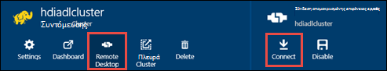

<properties
   pageTitle="Δημιουργία συμπλεγμάτων HDInsight με το Azure αποθήκευσης λίμνης δεδομένων με τη χρήση προτύπων από διαχειριστή πόρων | Microsoft Azure"
   description="Χρησιμοποιήστε πρότυπα για τη διαχείριση πόρων Azure για να δημιουργήσετε και να χρησιμοποιήσετε συμπλεγμάτων HDInsight με το χώρο αποθήκευσης λίμνης δεδομένων Azure"
   services="data-lake-store,hdinsight"
   documentationCenter=""
   authors="nitinme"
   manager="jhubbard"
   editor="cgronlun"/>

<tags
   ms.service="data-lake-store"
   ms.devlang="na"
   ms.topic="article"
   ms.tgt_pltfrm="na"
   ms.workload="big-data"
   ms.date="10/21/2016"
   ms.author="nitinme"/>

# <a name="create-an-hdinsight-cluster-with-data-lake-store-using-azure-resource-manager-template"></a>Δημιουργήστε ένα σύμπλεγμα HDInsight με το χώρο αποθήκευσης λίμνης δεδομένων χρησιμοποιώντας το πρότυπο διαχείρισης πόρων Azure

> [AZURE.SELECTOR] - [Με πύλη](data-lake-store-hdinsight-hadoop-use-portal.md) - [χρήση του PowerShell](data-lake-store-hdinsight-hadoop-use-powershell.md) - [χρησιμοποιώντας τη διαχείριση πόρων](data-lake-store-hdinsight-hadoop-use-resource-manager-template.md)

Μάθετε πώς μπορείτε να χρησιμοποιήσετε ένα πρότυπο από διαχειριστή πόρων Azure για να ρυθμίσετε ένα σύμπλεγμα HDInsight με την πρόσβαση στο χώρο αποθήκευσης λίμνης Azure δεδομένων. Ορισμένα σημαντικά θέματα για αυτήν την έκδοση:

-   **Για τους συμπλεγμάτων (Linux), και Hadoop/καταιγίδας συμπλεγμάτων (Windows και Linux)**, ο χώρος αποθήκευσης δεδομένων λίμνης μπορεί να χρησιμοποιηθεί μόνο ως ένα λογαριασμό επιπλέον χώρο αποθήκευσης. Τον προεπιλεγμένο λογαριασμό χώρου αποθήκευσης για το εν λόγω συμπλεγμάτων θα εξακολουθούν να Azure χώρο αποθήκευσης αντικειμένων blob (WASB).

-   **Για HBase συμπλεγμάτων (Windows και Linux)**, ο χώρος αποθήκευσης δεδομένων λίμνης μπορεί να χρησιμοποιηθεί ως προεπιλεγμένο αποθήκευσης ή επιπλέον χώρο αποθήκευσης.

> [AZURE.NOTE] Ορισμένα σημαντικά σημεία σε σημείωση.
>
> - Επιλογή για να δημιουργήσετε συμπλεγμάτων HDInsight με την πρόσβαση στο χώρο αποθήκευσης λίμνης δεδομένων είναι διαθέσιμη μόνο για τις εκδόσεις HDInsight 3.2 και 3.4 (για Hadoop, HBase και καταιγίδας συμπλεγμάτων σε Windows, καθώς και Linux). Για τους συμπλεγμάτων σε Linux, αυτή η επιλογή είναι διαθέσιμη μόνο σε συμπλεγμάτων HDInsight 3.4.
>
> - Όπως προαναφέρθηκε, χώρου αποθήκευσης λίμνης δεδομένων είναι διαθέσιμα ως προεπιλεγμένο αποθήκευσης για ορισμένους τύπους συμπλέγματος (HBase) και επιπλέον χώρου αποθήκευσης για άλλους τύπους συμπλέγματος (Hadoop, τους, καταιγίδας). Χρήση χώρου αποθήκευσης δεδομένων λίμνης ως ένα λογαριασμό επιπλέον χώρο αποθήκευσης δεν επηρεάζει τις επιδόσεις ή τη δυνατότητα ανάγνωσης/εγγραφής στο χώρο αποθήκευσης από το σύμπλεγμα. Σε ένα σενάριο όπου χρησιμοποιείται ο χώρος αποθήκευσης δεδομένων λίμνης ως επιπλέον χώρο αποθήκευσης, τα αρχεία που σχετίζονται με το σύμπλεγμα (όπως αρχεία καταγραφής, κ.λπ.) εγγράφεται το προεπιλεγμένο αποθήκευσης (αντικείμενα BLOB Azure), ενώ τα δεδομένα που θέλετε να επεξεργαστείτε μπορούν να αποθηκευτούν σε ένα λογαριασμό του χώρου αποθήκευσης δεδομένων λίμνης.
>

Σε αυτό το άρθρο θα σας προμήθεια ένα σύμπλεγμα Hadoop με το χώρο αποθήκευσης δεδομένων λίμνης ως επιπλέον χώρο αποθήκευσης.

## <a name="prerequisites"></a>Προαπαιτούμενα στοιχεία

Προτού ξεκινήσετε αυτό το πρόγραμμα εκμάθησης, πρέπει να έχετε τα εξής:

-   **Azure μια συνδρομή**. Ανατρέξτε στο θέμα [λήψη Azure δωρεάν δοκιμαστικής έκδοσης](https://azure.microsoft.com/pricing/free-trial/).

-   **Azure PowerShell 1.0 ή μεγαλύτερη**. Δείτε [πώς μπορείτε να εγκαταστήσετε και να ρυθμίσετε τις παραμέτρους του PowerShell Azure](../powershell-install-configure.md).

- **Azure Active Directory υπηρεσίας κεφάλαιο**. Βήματα που περιγράφονται σε αυτό το πρόγραμμα εκμάθησης παρέχουν οδηγίες σχετικά με τον τρόπο για να δημιουργήσετε ένα κεφάλαιο υπηρεσίας στο Azure AD. Ωστόσο, πρέπει να είστε διαχειριστής Azure AD για να μπορέσετε να δημιουργήσετε ένα κεφάλαιο υπηρεσίας. Εάν είστε διαχειριστής Azure AD, μπορείτε να παραλείψετε αυτήν την προϋπόθεση και να συνεχίσετε με το πρόγραμμα εκμάθησης.
    
    **Εάν είστε δεν διαχειριστής Azure AD**, δεν θα μπορείτε να εκτελέσετε τα βήματα που απαιτούνται για να δημιουργήσετε ένα κεφάλαιο υπηρεσίας. Σε αυτήν την περίπτωση, ο διαχειριστής Azure AD πρέπει πρώτα να δημιουργήσετε αρχής υπηρεσίας πριν να δημιουργήσετε ένα σύμπλεγμα HDInsight με το χώρο αποθήκευσης λίμνης δεδομένων. Επίσης, το κεφάλαιο υπηρεσίας πρέπει να δημιουργηθούν με χρήση ενός πιστοποιητικού, όπως περιγράφεται στην υποστήριξη [δημιουργίας μιας υπηρεσίας κεφαλαίου με το πιστοποιητικό](../resource-group-authenticate-service-principal.md#create-service-principal-with-certificate).

## <a name="create-an-hdinsight-cluster-with-azure-data-lake-store"></a>Δημιουργήστε ένα σύμπλεγμα HDInsight με το χώρο αποθήκευσης λίμνης δεδομένων Azure

Το πρότυπο διαχείρισης πόρων και τις προϋποθέσεις για τη χρήση του προτύπου, είναι διαθέσιμες στην GitHub στην [Ανάπτυξη ένα σύμπλεγμα HDInsight Linux με το νέο χώρο αποθήκευσης λίμνης δεδομένων](https://github.com/Azure/azure-quickstart-templates/tree/master/201-hdinsight-datalake-store-azure-storage). Ακολουθήστε τις οδηγίες που παρέχονται σε αυτήν τη σύνδεση για να δημιουργήσετε ένα σύμπλεγμα HDInsight με το Azure χώρου αποθήκευσης λίμνης δεδομένων ως το επιπλέον χώρο αποθήκευσης.

Τις οδηγίες στην ενότητα τη σύνδεση που αναφέρονται παραπάνω απαιτούν PowerShell. Πριν να ξεκινήσετε με αυτές τις οδηγίες, βεβαιωθείτε ότι συνδέεστε στο λογαριασμό σας στο Azure. Από την επιφάνεια εργασίας, ανοίξτε ένα νέο παράθυρο Azure PowerShell και πληκτρολογήστε τα παρακάτω τμήματα κώδικα. Όταν σας ζητηθεί να συνδεθείτε στο, βεβαιωθείτε ότι συνδέεστε στο ως ένα από τα admininistrators/κάτοχος της συνδρομής:

```
# Log in to your Azure account
Login-AzureRmAccount

# List all the subscriptions associated to your account
Get-AzureRmSubscription

# Select a subscription
Set-AzureRmContext -SubscriptionId <subscription ID>
```

## <a name="upload-sample-data-to-the-azure-data-lake-store"></a>Αποστολή δείγματος δεδομένων για το χώρο αποθήκευσης λίμνης δεδομένων Azure

Το πρότυπο διαχείρισης πόρων δημιουργεί ένα νέο λογαριασμό του χώρου αποθήκευσης δεδομένων λίμνης και συσχετίζει με το σύμπλεγμα HDInsight. Μπορείτε τώρα πρέπει να αποστείλετε μερικά δείγματα δεδομένων στο χώρο αποθήκευσης λίμνης δεδομένων. Θα χρειαστείτε αυτά τα δεδομένα αργότερα στην εκμάθηση για να εκτελέσετε εργασίες από ένα σύμπλεγμα HDInsight που έχουν πρόσβαση σε δεδομένα στο χώρο αποθήκευσης λίμνης δεδομένων. Για οδηγίες σχετικά με τον τρόπο για την αποστολή δεδομένων, ανατρέξτε στο θέμα [Αποστολή αρχείου στο χώρο αποθήκευσης λίμνης των δεδομένων](data-lake-store-get-started-portal.md#uploaddata). Εάν αναζητάτε μερικά δείγματα δεδομένων για την αποστολή, μπορείτε να λάβετε το φάκελο **Ασθενοφόρων δεδομένων** από το [Azure δεδομένων λίμνης Git αποθετήριο](https://github.com/Azure/usql/tree/master/Examples/Samples/Data/AmbulanceData).

## <a name="set-relevant-acls-on-the-sample-data"></a>Σύνολο σχετικών ACL το δείγμα δεδομένων

Για να βεβαιωθείτε ότι το δείγμα δεδομένων, κάνετε αποστολή είναι προσβάσιμη από το HDInsight σύμπλεγμα, θα πρέπει να βεβαιωθείτε ότι η εφαρμογή Azure AD που χρησιμοποιείται για να δημιουργήσετε ταυτότητας μεταξύ του συμπλέγματος HDInsight και του χώρου αποθήκευσης δεδομένων λίμνης έχει πρόσβαση στο αρχείο/φάκελος που προσπαθείτε να αποκτήσετε πρόσβαση. Για να το κάνετε αυτό, ακολουθήστε τα παρακάτω βήματα.

1.  Βρείτε το όνομα της εφαρμογής Azure AD που είναι συσχετισμένη με σύμπλεγμα HDInsight και το χώρο αποθήκευσης λίμνης δεδομένων. Ένας τρόπος για να αναζητήσετε το όνομα είναι να ανοίξετε το blade σύμπλεγμα HDInsight που έχετε δημιουργήσει χρησιμοποιώντας το πρότυπο διαχείρισης πόρων, κάντε κλικ στην καρτέλα **Ταυτότητα AAD σύμπλεγμα** και αναζητήστε την τιμή της **Υπηρεσίας κεφάλαιο εμφανιζόμενο όνομα**.

2.  Τώρα, παρέχουν πρόσβαση σε αυτήν την εφαρμογή Azure AD στο αρχείο/φάκελο στον οποίο θέλετε να έχετε πρόσβαση από το σύμπλεγμα HDInsight. Για να ορίσετε το σωστό ACL το αρχείο/φάκελος στο χώρο αποθήκευσης λίμνης δεδομένων, ανατρέξτε στο θέμα [ασφαλή δεδομένα στο χώρο αποθήκευσης λίμνης δεδομένων](data-lake-store-secure-data.md#assign-users-or-security-group-as-acls-to-the-azure-data-lake-store-file-system).

## <a name="run-test-jobs-on-the-hdinsight-cluster-to-use-the-data-lake-store"></a>Εκτέλεση δοκιμής εργασίες στο σύμπλεγμα HDInsight για να χρησιμοποιήσετε το χώρο αποθήκευσης δεδομένων λίμνης

Αφού έχετε ρυθμίσει ένα σύμπλεγμα HDInsight, μπορείτε να εκτελέσετε εργασίες δοκιμής στο σύμπλεγμα για να ελέγξετε ότι το σύμπλεγμα HDInsight πρόσβαση χώρου αποθήκευσης λίμνης δεδομένων. Για να το κάνετε αυτό, θα σας θα εκτελέσετε μια εργασία Hive δείγμα που δημιουργεί έναν πίνακα χρησιμοποιώντας το δείγμα δεδομένων που έχετε αποστείλει προηγουμένως στο χώρο αποθήκευσης λίμνης των δεδομένων.

### <a name="for-a-linux-cluster"></a>Για ένα σύμπλεγμα Linux

Σε αυτήν την ενότητα θα SSH στον σύμπλεγμα και την εκτέλεση του ερωτήματος Hive δείγμα. Τα Windows δεν παρέχει ένα ενσωματωμένο πρόγραμμα-πελάτη SSH. Συνιστάται να χρησιμοποιείτε **PuTTY**, που μπορούν να ληφθούν από [http://www.chiark.greenend.org.uk/~sgtatham/putty/download.html](http://www.chiark.greenend.org.uk/~sgtatham/putty/download.html).

Για περισσότερες πληροφορίες σχετικά με τη χρήση PuTTY, ανατρέξτε στο θέμα [Χρήση SSH με βάσει Linux Hadoop σε HDInsight από τα Windows ](../hdinsight/hdinsight-hadoop-linux-use-ssh-windows.md).

1.  Μετά τη σύνδεση, ξεκινήστε το CLI Hive, χρησιμοποιώντας την ακόλουθη εντολή:

    ```
    hive
    ```

2.  Χρησιμοποιώντας το CLI, εισαγάγετε τις παρακάτω προτάσεις για να δημιουργήσετε έναν νέο πίνακα με το όνομα **οχήματα** , χρησιμοποιώντας το δείγμα δεδομένων στο χώρο αποθήκευσης λίμνης δεδομένων:

    ```
    DROP TABLE vehicles;
    CREATE EXTERNAL TABLE vehicles (str string) LOCATION 'adl://<mydatalakestore>.azuredatalakestore.net:443/';
    SELECT * FROM vehicles LIMIT 10;
    ```

    Θα πρέπει να δείτε το αποτέλεσμα παρόμοιο με το εξής:

    ```
    1,1,2014-09-14 00:00:03,46.81006,-92.08174,51,S,1
    1,2,2014-09-14 00:00:06,46.81006,-92.08174,13,NE,1
    1,3,2014-09-14 00:00:09,46.81006,-92.08174,48,NE,1
    1,4,2014-09-14 00:00:12,46.81006,-92.08174,30,W,1
    1,5,2014-09-14 00:00:15,46.81006,-92.08174,47,S,1
    1,6,2014-09-14 00:00:18,46.81006,-92.08174,9,S,1
    1,7,2014-09-14 00:00:21,46.81006,-92.08174,53,N,1
    1,8,2014-09-14 00:00:24,46.81006,-92.08174,63,SW,1
    1,9,2014-09-14 00:00:27,46.81006,-92.08174,4,NE,1
    1,10,2014-09-14 00:00:30,46.81006,-92.08174,31,N,1
    ```

### <a name="for-a-windows-cluster"></a>Για ένα σύμπλεγμα των Windows

Χρησιμοποιήστε τα ακόλουθα cmdlet για να εκτελέσετε το ερώτημα ομάδας. Σε αυτό το ερώτημα Δημιουργία πίνακα από τα δεδομένα στο χώρο αποθήκευσης λίμνης δεδομένων και, στη συνέχεια, να εκτελέσετε ένα ερώτημα επιλογής στον πίνακα που δημιουργήσατε.

```
$queryString = "DROP TABLE vehicles;" + "CREATE EXTERNAL TABLE vehicles (str string) LOCATION 'adl://$dataLakeStoreName.azuredatalakestore.net:443/';" + "SELECT * FROM vehicles LIMIT 10;"

$hiveJobDefinition = New-AzureRmHDInsightHiveJobDefinition -Query $queryString

$hiveJob = Start-AzureRmHDInsightJob -ResourceGroupName $resourceGroupName -ClusterName $clusterName -JobDefinition $hiveJobDefinition -ClusterCredential $httpCredentials

Wait-AzureRmHDInsightJob -ResourceGroupName $resourceGroupName -ClusterName $clusterName -JobId $hiveJob.JobId -ClusterCredential $httpCredentials
```

Αυτό θα έχει το εξής αποτέλεσμα. **ExitValue** 0 στο αποτέλεσμα προτείνει ότι η εργασία ολοκληρώθηκε με επιτυχία.

```
Cluster         : hdiadlcluster.
HttpEndpoint    : hdiadlcluster.azurehdinsight.net
State           : SUCCEEDED
JobId           : job_1445386885331_0012
ParentId        :
PercentComplete :
ExitValue       : 0
User            : admin
Callback        :
Completed       : done
```

Ανάκτηση την έξοδο από το έργο χρησιμοποιώντας το ακόλουθο cmdlet:

```
Get-AzureRmHDInsightJobOutput -ClusterName $clusterName -JobId $hiveJob.JobId -DefaultContainer $containerName -DefaultStorageAccountName $storageAccountName -DefaultStorageAccountKey $storageAccountKey -ClusterCredential $httpCredentials
```

Το αποτέλεσμα του έργου παρόμοιο με το εξής:

```
1,1,2014-09-14 00:00:03,46.81006,-92.08174,51,S,1
1,2,2014-09-14 00:00:06,46.81006,-92.08174,13,NE,1
1,3,2014-09-14 00:00:09,46.81006,-92.08174,48,NE,1
1,4,2014-09-14 00:00:12,46.81006,-92.08174,30,W,1
1,5,2014-09-14 00:00:15,46.81006,-92.08174,47,S,1
1,6,2014-09-14 00:00:18,46.81006,-92.08174,9,S,1
1,7,2014-09-14 00:00:21,46.81006,-92.08174,53,N,1
1,8,2014-09-14 00:00:24,46.81006,-92.08174,63,SW,1
1,9,2014-09-14 00:00:27,46.81006,-92.08174,4,NE,1
1,10,2014-09-14 00:00:30,46.81006,-92.08174,31,N,1
```

## <a name="access-data-lake-store-using-hdfs-commands"></a>Χρήση εντολών HDFS χώρου αποθήκευσης λίμνης δεδομένων Access

Αφού έχετε ρυθμίσει τις παραμέτρους του συμπλέγματος HDInsight για να χρησιμοποιήσετε το χώρο αποθήκευσης λίμνης δεδομένων, μπορείτε να χρησιμοποιήσετε τις εντολές κελύφους HDFS για πρόσβαση στο χώρο αποθήκευσης.

### <a name="for-a-linux-cluster"></a>Για ένα σύμπλεγμα Linux

Σε αυτό ενότητα που θα SSH στο σύμπλεγμα και να εκτελέσετε τις εντολές HDFS. Τα Windows δεν παρέχει ένα ενσωματωμένο πρόγραμμα-πελάτη SSH. Συνιστάται να χρησιμοποιείτε **PuTTY**, που μπορούν να ληφθούν από [http://www.chiark.greenend.org.uk/~sgtatham/putty/download.html](http://www.chiark.greenend.org.uk/~sgtatham/putty/download.html).

Για περισσότερες πληροφορίες σχετικά με τη χρήση PuTTY, ανατρέξτε στο θέμα [Χρήση SSH με βάσει Linux Hadoop σε HDInsight από τα Windows ](../hdinsight/hdinsight-hadoop-linux-use-ssh-windows.md).

Μόλις συνδεθεί, χρησιμοποιήστε την ακόλουθη εντολή HDFS στο σύστημα αρχείων για μια λίστα των αρχείων στο χώρο αποθήκευσης λίμνης δεδομένων.

```
hdfs dfs -ls adl://<Data Lake Store account name>.azuredatalakestore.net:443/
```

Αυτό θα πρέπει να αναφέρετε το αρχείο που έχετε αποστείλει προηγουμένως στο χώρο αποθήκευσης λίμνης δεδομένων.

```
15/09/17 21:41:15 INFO web.CaboWebHdfsFileSystem: Replacing original urlConnectionFactory with org.apache.hadoop.hdfs.web.URLConnectionFactory@21a728d6
Found 1 items
-rwxrwxrwx   0 NotSupportYet NotSupportYet     671388 2015-09-16 22:16 adl://mydatalakestore.azuredatalakestore.net:443/mynewfolder
```

Μπορείτε επίσης να χρησιμοποιήσετε το `hdfs dfs -put` εντολή για την αποστολή ορισμένα αρχεία στο χώρο αποθήκευσης λίμνης δεδομένων και, στη συνέχεια, χρησιμοποιήστε `hdfs dfs -ls` για να επαληθεύσετε εάν τα αρχεία έχουν αποσταλεί με επιτυχία.

### <a name="for-a-windows-cluster"></a>Για ένα σύμπλεγμα των Windows

1.  Πραγματοποιήστε είσοδο νέα [Πύλη Azure](https://portal.azure.com).

2.  Κάντε κλικ στο κουμπί **Αναζήτηση**, κάντε κλικ στην επιλογή **HDInsight συμπλεγμάτων**και, στη συνέχεια, κάντε κλικ στην επιλογή το σύμπλεγμα HDInsight που δημιουργήσατε.

3.  Στο το blade σύμπλεγμα, κάντε κλικ στην επιλογή **Σύνδεση απομακρυσμένης επιφάνειας εργασίας**και, στη συνέχεια, στο το blade **Απομακρυσμένης επιφάνειας εργασίας** , κάντε κλικ στην επιλογή **σύνδεση**.

    

    Όταν σας ζητηθεί, πληκτρολογήστε τα διαπιστευτήρια που παρέχονται για τον απομακρυσμένο υπολογιστή χρήστη.

4.  Στην απομακρυσμένη περίοδο λειτουργίας, ξεκινήστε του Windows PowerShell και χρησιμοποιήστε τις εντολές του συστήματος αρχείων HDFS για μια λίστα των αρχείων στο χώρο αποθήκευσης λίμνης Azure δεδομένων.

    ```
    hdfs dfs -ls adl://<Data Lake Store account name>.azuredatalakestore.net:443/
    ```

    Αυτό θα πρέπει να αναφέρετε το αρχείο που έχετε αποστείλει προηγουμένως στο χώρο αποθήκευσης λίμνης δεδομένων.

    ```
    15/09/17 21:41:15 INFO web.CaboWebHdfsFileSystem: Replacing original urlConnectionFactory with org.apache.hadoop.hdfs.web.URLConnectionFactory@21a728d6
    Found 1 items
    -rwxrwxrwx   0 NotSupportYet NotSupportYet     671388 2015-09-16 22:16 adl://mydatalakestore.azuredatalakestore.net:443/vehicle1_09142014.csv
    ```

    Μπορείτε επίσης να χρησιμοποιήσετε το `hdfs dfs -put` εντολή για την αποστολή ορισμένα αρχεία στο χώρο αποθήκευσης λίμνης δεδομένων και, στη συνέχεια, χρησιμοποιήστε `hdfs dfs -ls` για να επαληθεύσετε εάν τα αρχεία έχουν αποσταλεί με επιτυχία.

## <a name="next-steps"></a>Επόμενα βήματα

-   [Αντιγράψτε δεδομένα από αντικείμενα blob του Azure χώρου αποθήκευσης στο χώρο αποθήκευσης δεδομένων λίμνης](data-lake-store-copy-data-wasb-distcp.md)
