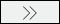

<properties
   pageTitle="Καταχώρηση δεδομένων από το χώρο αποθήκευσης δεδομένων λίμνης στον κατάλογο δεδομένων Azure | Microsoft Azure"
   description="Καταχώρηση δεδομένων από το χώρο αποθήκευσης δεδομένων λίμνης στον κατάλογο δεδομένων Azure"
   services="data-lake-store,data-catalog" 
   documentationCenter=""
   authors="nitinme"
   manager="jhubbard"
   editor="cgronlun"/>

<tags
   ms.service="data-lake-store"
   ms.devlang="na"
   ms.topic="article"
   ms.tgt_pltfrm="na"
   ms.workload="big-data"
   ms.date="10/28/2016"
   ms.author="nitinme"/>

# Καταχώρηση δεδομένων από το χώρο αποθήκευσης δεδομένων λίμνης στον κατάλογο δεδομένων Azure

Σε αυτό το άρθρο θα μάθετε πώς μπορείτε να ενοποιήσετε χώρου αποθήκευσης λίμνης δεδομένων Azure με Azure κατάλογο δεδομένων για να εντοπίζουν τα δεδομένα σας μέσα σε μια εταιρεία με την ενοποίηση με τον κατάλογο δεδομένων. Για περισσότερες πληροφορίες σχετικά με την επιλογή δεδομένων, ανατρέξτε στο θέμα [Καταλόγου Azure δεδομένων](../data-catalog/data-catalog-what-is-data-catalog.md). Για να κατανοήσετε σενάρια στο οποίο μπορείτε να χρησιμοποιήσετε στον κατάλογο δεδομένων, ανατρέξτε στο θέμα [Κατάλογος δεδομένων Azure συνηθισμένα σενάρια](../data-catalog/data-catalog-common-scenarios.md).

## Προαπαιτούμενα στοιχεία

Προτού ξεκινήσετε αυτό το πρόγραμμα εκμάθησης, πρέπει να έχετε τα εξής:

- **Azure μια συνδρομή**. Ανατρέξτε στο θέμα [λήψη Azure δωρεάν δοκιμαστικής έκδοσης](https://azure.microsoft.com/pricing/free-trial/).

- **Ενεργοποίηση της συνδρομής σας Azure** για δημόσια προεπισκόπηση δεδομένων λίμνης χώρου αποθήκευσης. Ανατρέξτε στο θέμα [οδηγίες](data-lake-store-get-started-portal.md#signup).

- **Λογαριασμός azure δεδομένων λίμνης Store**. Ακολουθήστε τις οδηγίες στο θέμα [Γρήγορα αποτελέσματα με με την πύλη Azure χώρου αποθήκευσης λίμνης δεδομένων Azure](data-lake-store-get-started-portal.md). Για αυτό το πρόγραμμα εκμάθησης, ενημερώστε μας Δημιουργία λογαριασμού χώρου αποθήκευσης λίμνης δεδομένων που ονομάζεται **datacatalogstore**. 

    Αφού δημιουργήσετε το λογαριασμό, αποστολή ενός συνόλου δεδομένων δείγματος σε αυτήν. Για αυτό το πρόγραμμα εκμάθησης, ενημερώστε μας αποστείλετε όλα τα αρχεία .csv κάτω από το φάκελο **AmbulanceData** στο [Αποθετήριο δεδομένων Git λίμνης Azure δεδομένων](https://github.com/Azure/usql/tree/master/Examples/Samples/Data/AmbulanceData/). Μπορείτε να χρησιμοποιήσετε διάφορα προγράμματα-πελάτες, όπως η [Εξερεύνηση χώρου αποθήκευσης Azure](http://storageexplorer.com/), για την αποστολή δεδομένων σε ένα κοντέινερ αντικειμένων blob.

- **Καταλόγου azure δεδομένων**. Εταιρεία σας πρέπει να έχετε ήδη έναν κατάλογο δεδομένων Azure που έχει δημιουργηθεί για την εταιρεία σας. Επιτρέπεται μόνο μία καταλόγου για κάθε εταιρείας.

## REGISTER χώρου αποθήκευσης λίμνης δεδομένων ως προέλευση για τον κατάλογο δεδομένων

>[AZURE.VIDEO adcwithadl] 

1. Μεταβείτε στις επιλογές `https://azure.microsoft.com/services/data-catalog`, και κάντε κλικ στην επιλογή **Γρήγορα αποτελέσματα**.

2. Συνδεθείτε στην πύλη του καταλόγου δεδομένων του Azure και κάντε κλικ στην επιλογή **δημοσίευση δεδομένων**.

    ![Καταχωρήσετε μια προέλευση δεδομένων] (./media/data-lake-store-with-data-catalog/register-data-source.png "Καταχωρήσετε μια προέλευση δεδομένων")

3. Στην επόμενη σελίδα, κάντε κλικ στην επιλογή **Εκκίνηση εφαρμογής**. Αυτό θα κάνει λήψη του αρχείο δηλώσεων εφαρμογής στον υπολογιστή σας. Κάντε διπλό κλικ στο αρχείο δήλωσης για να ξεκινήσετε την εφαρμογή.

4. Στη σελίδα υποδοχής, κάντε κλικ στην επιλογή **Είσοδος**και εισαγάγετε τα διαπιστευτήριά σας.

    ![Οθόνη υποδοχής] (./media/data-lake-store-with-data-catalog/welcome.screen.png "Οθόνη υποδοχής")

5. Στην επιλογή μιας σελίδας προέλευσης δεδομένων, επιλέξτε **Azure λίμνης δεδομένων**και, στη συνέχεια, κάντε κλικ στο κουμπί **Επόμενο**.

    ![Επιλογή αρχείου προέλευσης δεδομένων] (./media/data-lake-store-with-data-catalog/select-source.png "Επιλογή αρχείου προέλευσης δεδομένων")

6. Στην επόμενη σελίδα, δώστε το όνομα του λογαριασμού χώρου αποθήκευσης λίμνης δεδομένων που θέλετε να καταχωρήσετε στον κατάλογο δεδομένων. Αφήστε τις υπόλοιπες επιλογές ως προεπιλεγμένη και, στη συνέχεια, κάντε κλικ στην επιλογή **σύνδεση**.

    ![Σύνδεση με προέλευση δεδομένων] (./media/data-lake-store-with-data-catalog/connect-to-source.png "Σύνδεση με προέλευση δεδομένων")

7. Στην επόμενη σελίδα μπορεί να διαιρεθεί σε τα εξής τμήματα.

    μια. Στο πλαίσιο **Διακομιστής ιεραρχία** αντιπροσωπεύει δομής των φακέλων του χώρου αποθήκευσης δεδομένων λίμνης λογαριασμού. **$Root** αντιπροσωπεύει το ριζικό κατάλογο του χώρου αποθήκευσης δεδομένων λίμνης λογαριασμού και **AmbulanceData** αντιπροσωπεύει το φάκελο που έχουν δημιουργηθεί με το ριζικό κατάλογο του χώρου αποθήκευσης δεδομένων λίμνης λογαριασμού.

    β. Στο πλαίσιο **διαθέσιμα αντικείμενα** παραθέτει τα αρχεία και φακέλους κάτω από το φάκελο **AmbulanceData** .

    c. **Αντικείμενα να είναι καταχωρημένα πλαίσιο** παραθέτει τα αρχεία και τους φακέλους που θέλετε να καταχωρήσετε στον κατάλογο δεδομένων Azure.

    ![Προβολή δομής δεδομένων] (./media/data-lake-store-with-data-catalog/view-data-structure.png "Προβολή δομής δεδομένων")

8. Για αυτό το πρόγραμμα εκμάθησης, πρέπει να δηλώσετε όλα τα αρχεία στον κατάλογο. Για αυτό, κάντε κλικ στο κουμπί () για να μετακινήσετε όλα τα αρχεία από το πλαίσιο **αντικείμενα να έχει καταχωρηθεί** . 

    Επειδή τα δεδομένα θα καταγραφεί σε έναν κατάλογο δεδομένων οργανισμό, είναι μια προσέγγιση recommened για να προσθέσετε κάποια μετα-δεδομένων που μπορείτε να χρησιμοποιήσετε αργότερα για να εντοπίσετε γρήγορα τα δεδομένα. Για παράδειγμα, μπορείτε να προσθέσετε μια διεύθυνση ηλεκτρονικού ταχυδρομείου για τον κάτοχο δεδομένων (για παράδειγμα, μία που η αποστολή των δεδομένων) ή να προσθέσετε μια ετικέτα για τον προσδιορισμό των δεδομένων. Καταγραφής οθόνης που ακολουθεί εμφανίζει μια ετικέτα προσθέσουμε στα δεδομένα.

    ![Προβολή δομής δεδομένων] (./media/data-lake-store-with-data-catalog/view-selected-data-structure.png "Προβολή δομής δεδομένων")

    Κάντε κλικ στην επιλογή **καταχώρηση**.

8. Η παρακάτω εικόνα οθόνης υποδηλώνει ότι τα δεδομένα έχει καταχωρηθεί με επιτυχία στον κατάλογο δεδομένων.

    ![Η εγγραφή ολοκληρώθηκε] (./media/data-lake-store-with-data-catalog/registration-complete.png "Προβολή δομής δεδομένων")

9. Κάντε κλικ στην επιλογή **Προβολή πύλη** για να επιστρέψετε στην πύλη του καταλόγου δεδομένων και επιβεβαιώστε ότι μπορείτε τώρα να αποκτήσετε πρόσβαση στα δεδομένα καταχωρημένες από την πύλη. Για να αναζητήσετε τα δεδομένα, μπορείτε να χρησιμοποιήσετε την ετικέτα που χρησιμοποιήσατε κατά την εγγραφή των δεδομένων.

    ![Αναζήτηση δεδομένων στον κατάλογο] (./media/data-lake-store-with-data-catalog/search-data-in-catalog.png "Αναζήτηση δεδομένων στον κατάλογο")

10. Τώρα μπορείτε να εκτελέσετε λειτουργίες όπως η προσθήκη σχολίων και την τεκμηρίωση για τα δεδομένα. Για περισσότερες πληροφορίες, ανατρέξτε στις παρακάτω συνδέσεις.
    * [Προσθήκη σχολίων σε προελεύσεις δεδομένων στον κατάλογο δεδομένων](../data-catalog/data-catalog-how-to-annotate.md)
    * [Προελεύσεις δεδομένων εγγράφου στον κατάλογο δεδομένων](../data-catalog/data-catalog-how-to-documentation.md)

## Δείτε επίσης

* [Προσθήκη σχολίων σε προελεύσεις δεδομένων στον κατάλογο δεδομένων](../data-catalog/data-catalog-how-to-annotate.md)
* [Προελεύσεις δεδομένων εγγράφου στον κατάλογο δεδομένων](../data-catalog/data-catalog-how-to-documentation.md)
* [Ενοποίηση του χώρου αποθήκευσης δεδομένων λίμνης με άλλες υπηρεσίες του Azure](data-lake-store-integrate-with-other-services.md)
