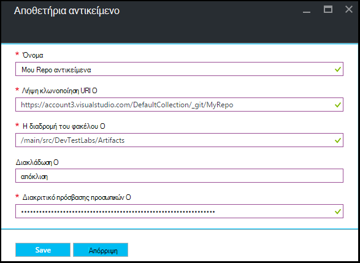

<properties
    pageTitle="Προσθήκη αποθετηρίου αντικείμενο Git σε ένα εργαστήριο στο Azure DevTest Labs | Microsoft Azure"
    description="Προσθήκη αποθετηρίου GitHub ή Visual Studio ομάδας υπηρεσίες Git για το αρχείο προέλευσης προσαρμοσμένα αντικείμενα στο Azure DevTest Labs"
    services="devtest-lab,virtual-machines,visual-studio-online"
    documentationCenter="na"
    authors="tomarcher"
    manager="douge"
    editor=""/>

<tags
    ms.service="devtest-lab"
    ms.workload="na"
    ms.tgt_pltfrm="na"
    ms.devlang="na"
    ms.topic="article"
    ms.date="09/06/2016"
    ms.author="tarcher"/>

# Προσθήκη αποθετηρίου αντικείμενο Git σε ένα εργαστήριο στο Azure DevTest Labs

> [AZURE.VIDEO how-to-add-your-private-artifacts-repository-in-a-devtest-lab]

Στο Azure DevTest Labs, αντικείμενα είναι *Ενέργειες* - όπως την εγκατάσταση του λογισμικού ή εκτελείται δέσμες ενεργειών και των εντολών - όταν δημιουργείται μια Εικονική. Από προεπιλογή, ένα εργαστήριο περιλαμβάνει αντικείμενα από το χώρο αποθήκευσης αντικείμενο επίσημη Azure DevTest Labs. Μπορείτε να προσθέσετε ένα αποθετήριο αντικείμενο Git εργαστήριο σας για να συμπεριλάβετε τα αντικείμενα που δημιουργεί την ομάδα σας. Το αποθετήριο μπορούν να φιλοξενηθούν σε [GitHub](https://github.com) ή στο [Visual Studio ομάδας υπηρεσιών (VSTS)](https://visualstudio.com).

- Για να μάθετε πώς μπορείτε να δημιουργήσετε ένα αποθετήριο GitHub, ανατρέξτε στο θέμα [GitHub Bootcamp](https://help.github.com/categories/bootcamp/).
- Για να μάθετε πώς μπορείτε να δημιουργήσετε ένα έργο υπηρεσιών ομάδας με ένα αποθετήριο Git, ανατρέξτε στο θέμα [σύνδεση στο Visual Studio Team Services](https://www.visualstudio.com/get-started/setup/connect-to-visual-studio-online).

Το παρακάτω στιγμιότυπο οθόνης εμφανίζει ένα παράδειγμα πώς μπορεί να φαίνεται ένα αποθετήριο δεδομένων που περιέχει αντικείμενα στην GitHub:  

## Λάβετε τις πληροφορίες αποθετήριο δεδομένων και τα διαπιστευτήρια

Για να προσθέσετε ένα αποθετήριο αντικείμενο εργαστήριο σας, πρέπει πρώτα να λάβετε ορισμένες πληροφορίες από το χώρο αποθήκευσης. Οι παρακάτω ενότητες σας καθοδηγήσει στη γρήγορα αυτές τις πληροφορίες για το αντικείμενο αποθετήρια φιλοξενούνται σε GitHub και Visual Studio Team Services.

### Λήψη της GitHub αποθετήριο κλωνοποίηση διεύθυνσης URL και πρόσβαση προσωπική διακριτικού

Για να λάβετε την κλωνοποίηση αποθετήριο GitHub διεύθυνση URL και το διακριτικό πρόσβασης προσωπικών, ακολουθήστε τα παρακάτω βήματα:

1. Μεταβείτε στην αρχική σελίδα του αποθετηρίου GitHub που περιέχει τους ορισμούς αντικείμενο.

1. Επιλέξτε **κλωνοποίηση ή λήψη**.

1. Επιλέξτε το κουμπί για να αντιγράψετε το **HTTPS κλωνοποίηση διεύθυνση url** στο Πρόχειρο και αποθηκεύστε τη διεύθυνση URL για μελλοντική χρήση.

1. Επιλέξτε την εικόνα προφίλ στην επάνω δεξιά γωνία του GitHub, και επιλέξτε **Ρυθμίσεις**.

1. Στο μενού " **προσωπικές ρυθμίσεις** " στα αριστερά, επιλέξτε **διακριτικά προσωπικών πρόσβασης**.

1. Επιλέξτε **Δημιουργία νέου διακριτικό**.

1. Στη σελίδα **νέα διακριτικό πρόσβασης προσωπικών** , πληκτρολογήστε μια **Περιγραφή διακριτικό**, αποδεχτείτε τα προεπιλεγμένα στοιχεία σε την **επιλογή εύρους**και, στη συνέχεια, επιλέξτε **Δημιουργία διακριτικού**.

1. Αποθηκεύστε το διακριτικό που δημιουργείται ως που το χρειαστείτε αργότερα.

1. Μπορείτε να κλείσετε GitHub τώρα.   

1. Συνεχίστε με την ενότητα [Connect εργαστήριο σας στο αποθετήριο αντικείμενο](#connect-your-lab-to-the-artifact-repository) .

### Λήψη της Visual Studio Team Services αποθετήριο κλωνοποίηση διεύθυνσης URL και πρόσβαση προσωπική διακριτικού

Για να λάβετε τη Visual Studio Team Services αποθετήριο κλωνοποίηση διεύθυνση URL και διακριτικό πρόσβασης προσωπικών, ακολουθήστε τα παρακάτω βήματα:

1. Ανοίξτε την αρχική σελίδα της συλλογής ομάδας (για παράδειγμα, `https://contoso-web-team.visualstudio.com`), και, στη συνέχεια, επιλέξτε το αντικείμενο έργου.

1. Στην κεντρική σελίδα του project, επιλέξτε **κώδικα**.

1. Για να δείτε τη διεύθυνση URL κλωνοποίηση, η σελίδα **κώδικα** έργου, επιλέξτε **κλωνοποίηση**.

1. Αποθηκεύστε τη διεύθυνση URL, χρειάζεστε παρακάτω σε αυτό το πρόγραμμα εκμάθησης.

1. Για να δημιουργήσετε μια προσωπική διακριτικό πρόσβασης, επιλέξτε **το προφίλ μου** από το αναπτυσσόμενο μενού του λογαριασμού χρήστη.

1. Στη σελίδα πληροφορίες προφίλ, επιλέξτε **ασφάλεια**.

1. Στην καρτέλα **ασφάλεια** , επιλέξτε **Προσθήκη**.

1. Στη σελίδα **Δημιουργία ένα διακριτικό πρόσβασης προσωπικών** :

    - Πληκτρολογήστε μια **Περιγραφή** για το διακριτικό.
    - Επιλέξτε **180 ημέρες** από τη **Λήξη της σε** λίστα.
    - Επιλέξτε **όλους τους λογαριασμούς προσβάσιμη** από τη λίστα **λογαριασμών** .
    - Ενεργοποιήστε την επιλογή **όλα τα πεδία** .
    - Επιλέξτε **Δημιουργία διακριτικού**.

1. Όταν ολοκληρώσετε τη διαδικασία, το νέο διακριτικό εμφανίζεται στη λίστα **Προσωπικά διακριτικά πρόσβασης** . Επιλέξτε **Αντιγραφή διακριτικού**και, στη συνέχεια, αποθηκεύστε την τιμή διακριτικού για μελλοντική χρήση.

1. Συνεχίστε με την ενότητα [Connect εργαστήριο σας στο αποθετήριο αντικείμενο](#connect-your-lab-to-the-artifact-repository) .

##Σύνδεση εργαστήριο σας με το αρχείο φύλαξης αντικείμενο

1. Είσοδος στην [πύλη του Azure](http://go.microsoft.com/fwlink/p/?LinkID=525040).

1. Επιλέξτε **Περισσότερες υπηρεσίες**και, στη συνέχεια, επιλέξτε **DevTest Labs** από τη λίστα.

1. Από τη λίστα των labs, επιλέξτε το επιθυμητό εργαστήριο.   

1. Στην blade το εργαστήριο, επιλέξτε **Ρύθμιση παραμέτρων**.

1. Στην blade **ρύθμισης παραμέτρων** του εργαστήριο, επιλέξτε **Αποθετήρια αντικείμενα**.

1. Στην το blade **Αποθετήρια αντικείμενα** , επιλέξτε **+ Add**.

    
 
1. Στην το δεύτερο blade **Αποθετήρια αντικείμενα** , καθορίστε τα εξής:

    - **Όνομα** - πληκτρολογήστε ένα όνομα για το χώρο αποθήκευσης.
    - **Διεύθυνση Url κλωνοποίηση Git** - πληκτρολογήστε τη διεύθυνση URL κλωνοποίηση Git HTTPS που αντιγράψατε προηγουμένως από GitHub ή Visual Studio Team Services. 
    - **Η διαδρομή του φακέλου** - πληκτρολογήστε τη διαδρομή του φακέλου σε σχέση με τη διεύθυνση URL κλωνοποίηση που περιέχει το αντικείμενο ορισμούς.
    - **Διακλάδωση** - πληκτρολογήστε στον κλάδο για να λάβετε το αντικείμενο ορισμών.
    - **Προσωπική διακριτικό πρόσβασης** - πληκτρολογήστε το διακριτικό πρόσβασης προσωπικών που λάβατε νωρίτερα από GitHub ή Visual Studio Team Services. 
     
    

1. Επιλέξτε **Αποθήκευση**.

[AZURE.INCLUDE [devtest-lab-try-it-out](../../includes/devtest-lab-try-it-out.md)]

## Σχετικές ιστολογίου
- [Τρόπος αντιμετώπισης προβλημάτων αποτυγχάνει εργαλεία σε AzureDevTestLabs](http://www.visualstudiogeeks.com/blog/DevOps/How-to-troubleshoot-failing-artifacts-in-AzureDevTestLabs)
- [Συμμετοχή σε μια Εικονική για υπάρχοντα τομέα AD χρησιμοποιώντας το πρότυπο ARM στο εργαστήριο δοκιμών αποκλίσεις Azure](http://www.visualstudiogeeks.com/blog/DevOps/Join-a-VM-to-existing-AD-domain-using-ARM-template-AzureDevTestLabs)